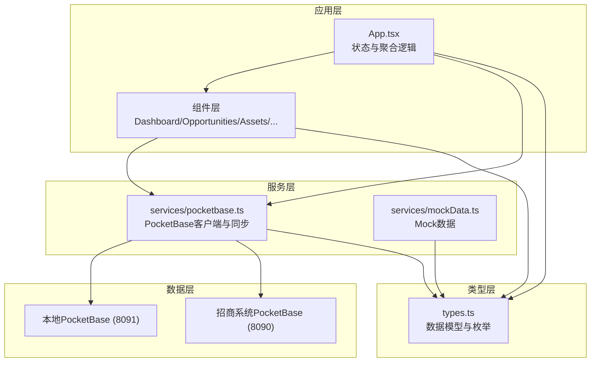
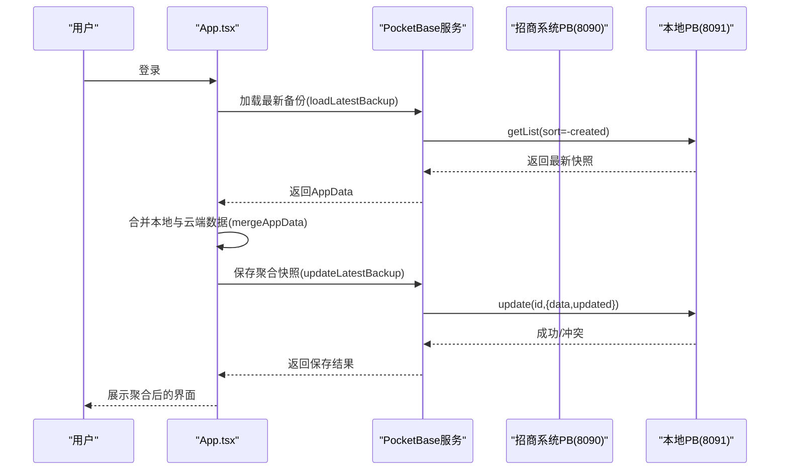
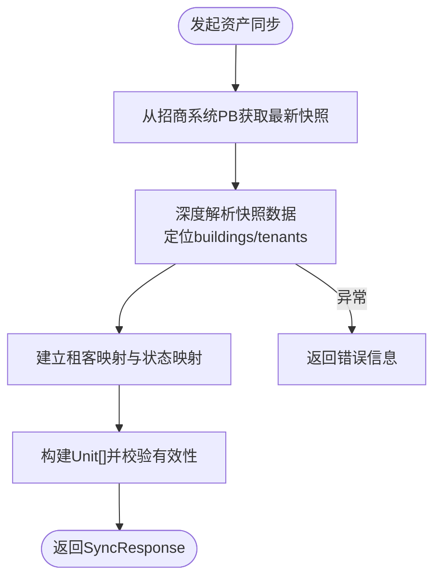
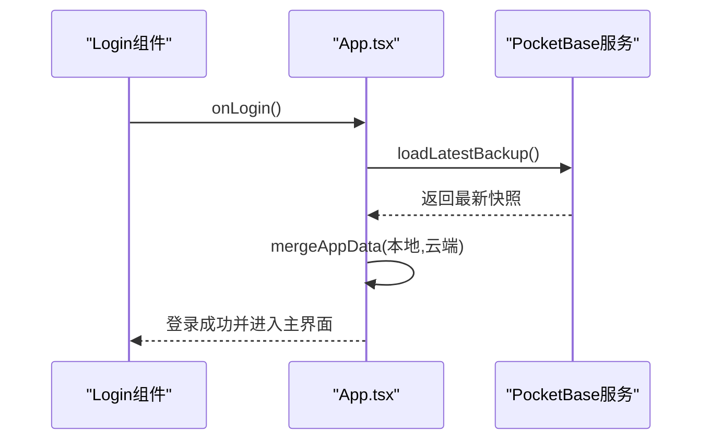
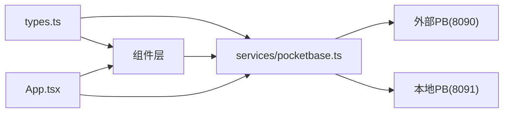

# API参考

<cite>
**本文引用的文件**
- [README.md](file://README.md)
- [package.json](file://package.json)
- [services/pocketbase.ts](file://services/pocketbase.ts)
- [services/mockData.ts](file://services/mockData.ts)
- [types.ts](file://types.ts)
- [App.tsx](file://App.tsx)
- [components/Dashboard.tsx](file://components/Dashboard.tsx)
- [components/Opportunities.tsx](file://components/Opportunities.tsx)
- [components/Assets.tsx](file://components/Assets.tsx)
- [components/ChannelPRM.tsx](file://components/ChannelPRM.tsx)
- [components/Policies.tsx](file://components/Policies.tsx)
- [components/CommissionLedger.tsx](file://components/CommissionLedger.tsx)
- [components/DealRecords.tsx](file://components/DealRecords.tsx)
- [components/Settings.tsx](file://components/Settings.tsx)
</cite>

## 目录
1. [简介](#简介)
2. [项目结构](#项目结构)
3. [核心组件](#核心组件)
4. [架构总览](#架构总览)
5. [详细组件分析](#详细组件分析)
6. [依赖关系分析](#依赖关系分析)
7. [性能考量](#性能考量)
8. [故障排查指南](#故障排查指南)
9. [结论](#结论)
10. [附录](#附录)

## 简介
本文件为“上海商机及渠道管理系统”的API参考文档，面向前端开发者与第三方集成方，系统性梳理系统内嵌的PocketBase服务接口、数据同步API、Mock数据接口以及各功能模块的组件API规范。内容涵盖：
- HTTP请求格式、参数定义、响应结构与错误处理
- 具体调用方式、认证机制与安全考虑
- API版本管理、速率限制与性能优化建议
- 第三方集成与扩展开发的技术规范

本系统采用React + TypeScript构建，数据持久化依赖PocketBase（本地与外部招商系统双实例）。系统通过服务层封装对PocketBase的访问，实现云端数据拉取、本地快照聚合与备份。

## 项目结构
系统主要由以下层次构成：
- 服务层：封装PocketBase客户端与数据同步逻辑
- 类型层：统一定义业务模型与枚举
- 组件层：按功能划分的UI组件，负责数据展示与交互
- 应用入口：App.tsx负责状态管理、数据聚合与云同步

图表来源
- [App.tsx](file://App.tsx#L179-L617)
- [services/pocketbase.ts](file://services/pocketbase.ts#L1-L226)
- [services/mockData.ts](file://services/mockData.ts#L1-L81)
- [types.ts](file://types.ts#L1-L261)

章节来源
- [README.md](file://README.md#L1-L21)
- [package.json](file://package.json#L1-L28)

## 核心组件
- PocketBase服务封装：提供资产同步、本地备份读写、历史快照查询等能力
- Mock数据服务：提供演示用的用户、房源、渠道、佣金规则等数据
- 类型系统：统一定义业务实体、枚举与复合对象
- 组件API：各功能页面暴露的props与交互行为，便于第三方集成

章节来源
- [services/pocketbase.ts](file://services/pocketbase.ts#L1-L226)
- [services/mockData.ts](file://services/mockData.ts#L1-L81)
- [types.ts](file://types.ts#L1-L261)

## 架构总览
系统通过App.tsx集中管理应用状态，组件通过服务层与PocketBase交互，实现：
- 登录前云端数据同步与聚合
- 本地状态变更的防抖与自动聚合保存
- 云端并发冲突的乐观锁处理
- 资产数据从招商系统PocketBase（8090）拉取并回填本地（8091）

图表来源
- [App.tsx](file://App.tsx#L302-L378)
- [services/pocketbase.ts](file://services/pocketbase.ts#L184-L225)

## 详细组件分析

### 1) PocketBase服务接口（数据同步与备份）
- 作用：封装与本地与外部PocketBase实例的交互，提供资产同步、备份读写、历史快照查询等方法
- 关键方法与返回结构：
  - fetchPropertyUnits(): 从招商系统PB获取最新资产快照并解析为本地Unit[]
  - saveBackup(name,data): 保存新快照
  - updateLatestBackup(data): 更新最新快照（乐观锁）
  - loadLatestBackup(): 加载最新快照
  - getAllBackups(): 获取历史快照列表

图表来源
- [services/pocketbase.ts](file://services/pocketbase.ts#L50-L125)

章节来源
- [services/pocketbase.ts](file://services/pocketbase.ts#L1-L226)

### 2) 数据模型与枚举（types.ts）
- 数据模型：User、Unit、Channel、Commission、Opportunity、CommissionRule、AppData、CloudSnapshot等
- 枚举：UnitStatus、OpportunityStage、OpportunityIntent、OpportunitySource、CommissionStatus、UserRole、AgentTier、ActivityType等
- 复合类型：DealParameters、PayoutInstallment、PolicyChangeLog、RentFreePeriod、DealLog等

章节来源
- [types.ts](file://types.ts#L1-L261)

### 3) Mock数据接口（演示与测试）
- 提供演示用的用户、房源、渠道、佣金规则、机会、活动、佣金等数据
- 用途：本地开发与演示环境快速启动，无需真实PocketBase

章节来源
- [services/mockData.ts](file://services/mockData.ts#L1-L81)

### 4) 组件API规范

#### 4.1 登录与聚合（App.tsx）
- 登录流程：登录前先同步云端最新数据，再进行本地用户校验
- 数据聚合：mergeAppData对本地与云端数据进行ID去重与级联删除过滤
- 自动保存：3秒防抖后自动聚合保存至云端

图表来源
- [App.tsx](file://App.tsx#L77-L104)
- [App.tsx](file://App.tsx#L302-L329)

章节来源
- [App.tsx](file://App.tsx#L179-L617)

#### 4.2 资产销控（Assets.tsx）
- 功能：展示与编辑资产状态，支持从招商系统PB同步资产
- 关键交互：handleSyncFromCloud、onSyncUnits回调、状态颜色与空置天数计算

章节来源
- [components/Assets.tsx](file://components/Assets.tsx#L1-L368)

#### 4.3 商机管理（Opportunities.tsx）
- 功能：商机全生命周期管理，支持新增、跟进、成交、标记流失、佣金生成
- 关键交互：新增商机、编辑成交参数、添加跟进轨迹、标记流失、激活已流失商机

章节来源
- [components/Opportunities.tsx](file://components/Opportunities.tsx#L1-L804)

#### 4.4 渠道PRM（ChannelPRM.tsx）
- 功能：渠道合作商管理、联系人维护、佣金统计与财务状态变更
- 关键交互：新增/编辑渠道、新增/编辑联系人、佣金财务修正

章节来源
- [components/ChannelPRM.tsx](file://components/ChannelPRM.tsx#L1-L476)

#### 4.5 政策配置（Policies.tsx）
- 功能：佣金政策方案的创建、编辑、启用/禁用与历史审计
- 关键交互：新增/编辑政策、分期节点管理、历史记录查看

章节来源
- [components/Policies.tsx](file://components/Policies.tsx#L1-L382)

#### 4.6 佣金结算（CommissionLedger.tsx）
- 功能：待结佣金监控与财务状态变更
- 关键交互：搜索过滤、按计划发放日期排序、财务状态更新

章节来源
- [components/CommissionLedger.tsx](file://components/CommissionLedger.tsx#L1-L201)

#### 4.7 成交台账（DealRecords.tsx）
- 功能：成交记录的年度统计与月度明细
- 关键交互：年度筛选、企业搜索、按月分组展示

章节来源
- [components/DealRecords.tsx](file://components/DealRecords.tsx#L1-L252)

#### 4.8 系统设置（Settings.tsx）
- 功能：个人档案维护、账户管理（管理员）、数据快照列表与恢复
- 关键交互：更新个人信息、创建/编辑/删除账户、导出/导入数据

章节来源
- [components/Settings.tsx](file://components/Settings.tsx#L1-L291)

## 依赖关系分析
- 服务层依赖PocketBase SDK与环境变量（POCKETBASE_URL、POCKETBASE_PROPERTY_URL）
- 组件层依赖类型系统与服务层接口
- App.tsx作为中枢协调组件与服务层交互

图表来源
- [services/pocketbase.ts](file://services/pocketbase.ts#L1-L12)
- [App.tsx](file://App.tsx#L1-L14)

章节来源
- [services/pocketbase.ts](file://services/pocketbase.ts#L1-L226)
- [package.json](file://package.json#L11-L16)

## 性能考量
- 防抖与批处理：本地状态变更3秒防抖后批量聚合保存，降低云端写入压力
- 乐观锁：updateLatestBackup在并发冲突时自动重试并重新合并，避免数据丢失
- 本地缓存：localStorage持久化用户与业务数据，减少重复加载
- 计算优化：大量图表与统计使用useMemo稳定化计算，避免重复渲染
- 网络优化：资产同步时仅加载必要字段，历史快照列表仅返回id/name/created

## 故障排查指南
- 登录失败：检查网络连通性与云端数据可用性；确认fetchLatestBackup返回正确数据
- 并发冲突：updateLatestBackup返回conflict=true时，系统会自动重新加载并合并；如持续出现，检查客户端时间同步与网络延迟
- 资产同步异常：deepSeekArray解析失败或快照结构变更时，前端会提示“云端数据格式已变更”，需手动适配解析逻辑
- 本地数据丢失：通过“数据快照”恢复历史版本；管理员可导出/导入离线数据包

章节来源
- [App.tsx](file://App.tsx#L355-L364)
- [components/Assets.tsx](file://components/Assets.tsx#L136-L141)
- [components/Settings.tsx](file://components/Settings.tsx#L240-L247)

## 结论
本系统通过服务层抽象与组件化设计，提供了清晰的API边界与稳定的交互协议。PocketBase作为核心数据基础设施，配合本地聚合与云端备份，实现了高可用与可扩展的业务数据管理能力。第三方集成应重点关注：
- 服务层方法的调用时机与幂等性
- 并发冲突的处理策略
- 类型系统的严格使用与扩展
- Mock数据与生产数据的切换策略

## 附录

### A. 环境变量与端口
- POCKETBASE_URL：本地PocketBase地址（默认 http://127.0.0.1:8091）
- POCKETBASE_PROPERTY_URL：招商系统PocketBase地址（默认 http://127.0.0.1:8090）

章节来源
- [services/pocketbase.ts](file://services/pocketbase.ts#L5-L12)

### B. 认证与安全
- 认证机制：本地用户凭据校验（用户名/密码），登录成功后将用户信息写入localStorage
- 安全建议：生产环境建议接入后端鉴权与HTTPS；对敏感字段（如租客名称）在前端做脱敏展示

章节来源
- [App.tsx](file://App.tsx#L77-L104)
- [components/Settings.tsx](file://components/Settings.tsx#L50-L81)

### C. 版本管理与迁移
- 版本号：项目package.json中定义
- 迁移策略：通过CloudSnapshot与历史快照进行版本回溯与数据迁移

章节来源
- [package.json](file://package.json#L1-L10)
- [types.ts](file://types.ts#L255-L261)

### D. 速率限制与性能优化建议
- 速率限制：建议在网关层对PocketBase接口增加限流与熔断策略
- 性能优化：使用useMemo稳定化计算、分页加载、懒加载组件、CDN加速静态资源

[本节为通用指导，不直接分析具体文件]