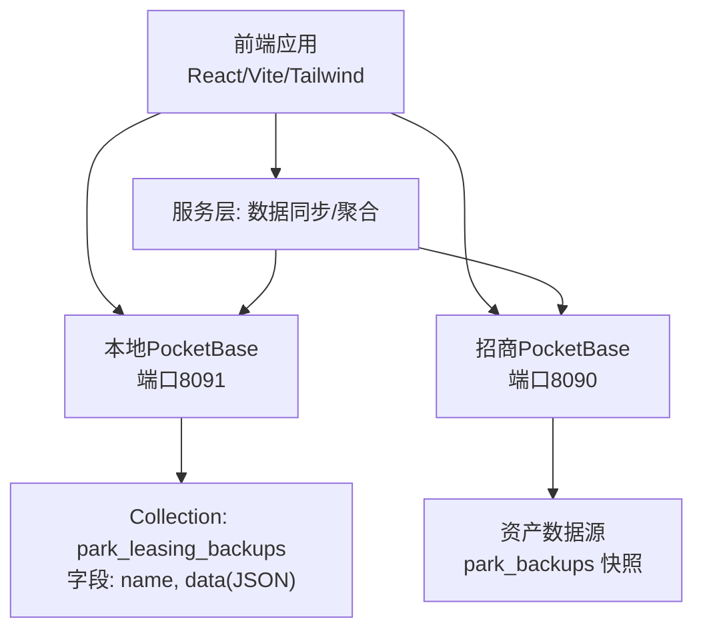
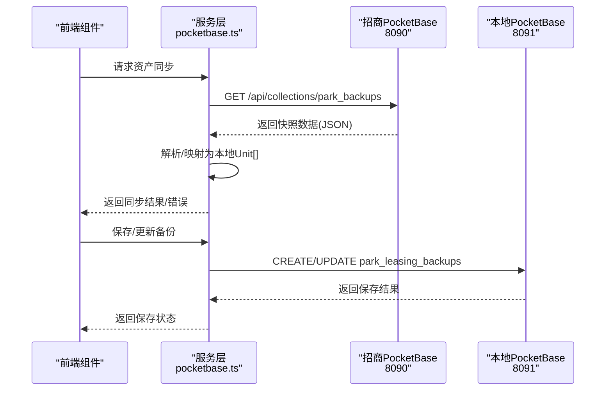
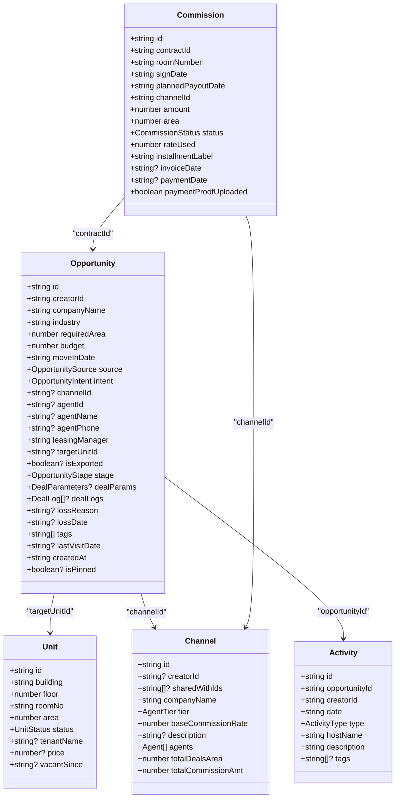
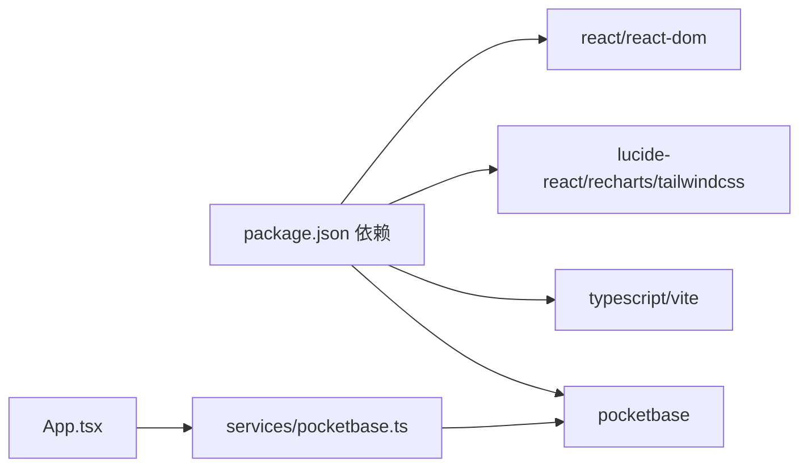

# 数据接口

<cite>
**本文引用的文件**
- [types.ts](file://types.ts)
- [App.tsx](file://App.tsx)
- [pocketbase.ts](file://services/pocketbase.ts)
- [Assets.tsx](file://components/Assets.tsx)
- [Opportunities.tsx](file://components/Opportunities.tsx)
- [ChannelPRM.tsx](file://components/ChannelPRM.tsx)
- [CommissionLedger.tsx](file://components/CommissionLedger.tsx)
- [mockData.ts](file://services/mockData.ts)
- [MIGRATION_SUMMARY.md](file://MIGRATION_SUMMARY.md)
- [setup-pocketbase.sh](file://scripts/setup-pocketbase.sh)
- [package.json](file://package.json)
</cite>

## 目录
1. [简介](#简介)
2. [项目结构](#项目结构)
3. [核心数据模型](#核心数据模型)
4. [架构总览](#架构总览)
5. [详细组件分析](#详细组件分析)
6. [依赖关系分析](#依赖关系分析)
7. [性能考量](#性能考量)
8. [故障排查指南](#故障排查指南)
9. [结论](#结论)
10. [附录](#附录)

## 简介
本文件面向“上海商机及渠道管理系统”，系统采用前端 React + PocketBase 作为后端，提供本地化部署与云端快照聚合能力。本文聚焦于数据接口文档，涵盖：
- 核心数据模型（Opportunity、Unit、Channel、Commission、Activity 等）的字段定义、数据类型与约束
- 数据接口的请求格式、响应结构、验证规则与转换逻辑
- 数据模型间的关系映射、索引设计与查询优化方案
- 数据迁移策略、版本兼容性与数据完整性保障机制

## 项目结构
系统采用前端单页应用 + 本地/云端 PocketBase 的双实例架构：
- 前端应用：React + TailwindCSS + Recharts
- 本地备份：PocketBase (8091) - 存储业务快照
- 房源数据源：招商管理 PocketBase (8090) - 提供资产数据
- 服务层：封装 PocketBase 客户端、数据同步与聚合逻辑

图表来源
- [App.tsx](file://App.tsx#L179-L617)
- [pocketbase.ts](file://services/pocketbase.ts#L1-L226)
- [MIGRATION_SUMMARY.md](file://MIGRATION_SUMMARY.md#L107-L111)

章节来源
- [package.json](file://package.json#L1-L28)
- [MIGRATION_SUMMARY.md](file://MIGRATION_SUMMARY.md#L1-L224)

## 核心数据模型
本节定义各实体的字段、类型与约束，并给出业务含义与取值范围。

- Opportunity 商机实体
  - 字段与类型
    - id: string
    - creatorId: string
    - companyName: string
    - industry: string
    - requiredArea: number
    - budget: number
    - moveInDate: string (YYYY-MM-DD)
    - source: 枚举 OpportunitySource
    - intent: 枚举 OpportunityIntent
    - channelId?: string
    - agentId?: string
    - agentName?: string
    - agentPhone?: string
    - leasingManager: string
    - targetUnitId?: string
    - isExported?: boolean
    - stage: 枚举 OpportunityStage
    - dealParams?: DealParameters
    - dealLogs?: DealLog[]
    - lossReason?: string
    - lossDate?: string
    - tags: string[]
    - lastVisitDate?: string
    - createdAt: string (ISO8601)
    - isPinned?: boolean
  - 约束与规则
    - 必填字段：companyName, requiredArea, source, intent, leasingManager, stage
    - 时间字段遵循 ISO 日期格式
    - dealParams 仅在签约阶段存在
    - isPinned 用于界面置顶展示
  - 关系映射
    - 属于一个用户（creatorId）
    - 可关联一个渠道（channelId）、一个中介（agentId）
    - 关联多个活动（Activity.opportunityId）
    - 关联多个佣金（Commission.contractId）

- Unit 资产实体
  - 字段与类型
    - id: string
    - building: string
    - floor: number
    - roomNo: string
    - area: number
    - status: 枚举 UnitStatus
    - tenantName?: string
    - price?: number
    - vacantSince?: string (YYYY-MM-DD)
  - 约束与规则
    - 必填字段：building, floor, roomNo, area, status
    - price 仅在待租状态下有意义
    - vacantSince 用于空置天数计算
  - 关系映射
    - 可被多个商机绑定（targetUnitId）
    - 在成交时更新状态为占用

- Channel 渠道实体
  - 字段与类型
    - id: string
    - creatorId?: string
    - sharedWithIds?: string[]
    - companyName: string
    - tier: 枚举 AgentTier
    - baseCommissionRate: number
    - description?: string
    - agents: Agent[]
    - totalDealsArea: number
    - totalCommissionAmt: number
  - 约束与规则
    - 必填字段：companyName, tier, baseCommissionRate
    - agents 为联系人列表
    - sharedWithIds 控制可见性与协作
  - 关系映射
    - 关联多个佣金（Commission.channelId）
    - 关联多个商机（Opportunity.channelId）

- Commission 佣金实体
  - 字段与类型
    - id: string
    - contractId: string
    - roomNumber: string
    - signDate: string (YYYY-MM-DD)
    - plannedPayoutDate: string (YYYY-MM-DD)
    - channelId: string
    - amount: number
    - area: number
    - status: 枚举 CommissionStatus
    - rateUsed: number
    - installmentLabel: string
    - invoiceDate?: string
    - paymentDate?: string
    - paymentProofUploaded: boolean
  - 约束与规则
    - 必填字段：contractId, roomNumber, signDate, plannedPayoutDate, channelId, amount, area, status
    - installmentLabel 表示分期标识（如 “1/2” 或 “一次性”）
    - paymentProofUploaded 标识凭证上传状态
  - 关系映射
    - 关联一个商机（Contract）
    - 关联一个渠道（Channel）

- Activity 活动实体
  - 字段与类型
    - id: string
    - opportunityId: string
    - creatorId: string
    - date: string (YYYY-MM-DD)
    - type: 枚举 ActivityType
    - hostName: string
    - description: string
    - tags?: string[]
  - 约束与规则
    - 必填字段：opportunityId, creatorId, date, type, hostName, description
    - tags 用于分类筛选
  - 关系映射
    - 属于一个商机（Opportunity）

- 其他相关模型
  - Agent 中介联系人：id, name, phone, title?, company?, tier?, commissionRate?, totalDealsArea?, totalCommissionAmt?, totalVisits?
  - DealParameters 成交参数：unitIds[], buildingName, finalArea, signDate, leaseStartDate, leaseEndDate, finalPrice, monthlyRent, paymentCycleMonths, firstPaymentCount, firstPaymentDate, isRentFreeDeferred, rentFreePeriods[], depositAmount, depositStatus, remarks, isHighRisk?, industry?, establishedDate?, legalRepresentative?, mainContact?
  - DealLog 成交日志：id, timestamp, operator, changeDescription
  - CommissionRule 佣金规则：id, minArea, maxArea, rate, label, startDate, endDate, isActive, payoutType('ONETIME'|'STAGED'), installments[]
  - PayoutInstallment 分期节点：id, percentage(0-100), triggerMonth, label
  - PolicyChangeLog 策略变更日志：id, timestamp, ruleId, ruleLabel, changeType('CREATE'|'UPDATE'|'EXTEND'|'DELETE'), description, previousValue?, newValue?
  - User 用户：id, username, password?, name, role(UserRole), annualTargetArea?, monthlyTargetArea?, annualTargetVisits?
  - AppData 应用聚合数据：opportunities[], channels[], commissions[], units[], commissionRules[], policyHistory[], activities[], users[], settings{annualTargetArea}, deletedIds[]

章节来源
- [types.ts](file://types.ts#L1-L261)
- [mockData.ts](file://services/mockData.ts#L1-L81)

## 架构总览
系统通过服务层与两个 PocketBase 实例交互，实现数据的采集、聚合与持久化。

图表来源
- [pocketbase.ts](file://services/pocketbase.ts#L50-L125)
- [App.tsx](file://App.tsx#L302-L378)

章节来源
- [App.tsx](file://App.tsx#L179-L617)
- [pocketbase.ts](file://services/pocketbase.ts#L1-L226)

## 详细组件分析

### 数据模型类图

图表来源
- [types.ts](file://types.ts#L78-L238)

章节来源
- [types.ts](file://types.ts#L1-L261)

### 数据接口规范

- 资产同步接口
  - 方法与路径
    - GET /api/collections/park_backups
  - 查询参数
    - filter: project_id="park_data_main"
    - sort: -created
    - expand: 可选（根据需要展开关联）
  - 请求头
    - Accept: application/json
  - 响应体
    - 列表对象，包含 items[] 与 totalItems 等
    - items[].data 为 AppData JSON
  - 错误处理
    - 未发现快照：返回错误信息
    - 快照为空：返回错误信息
    - 解析异常：返回异常描述
  - 转换逻辑
    - 递归定位 buildings/tenants 等容器
    - 构建 unitTenantMap 以映射租户
    - 状态映射：occupied/vacant/reserved/self_use
    - 生成本地 Unit[] 并校验有效性

- 备份保存接口
  - 方法与路径
    - POST /api/collections/park_leasing_backups
  - 请求体
    - name: string
    - data: AppData JSON
  - 响应体
    - 保存后的记录对象
  - 错误处理
    - 保存失败抛出异常

- 备份更新接口（乐观锁）
  - 方法与路径
    - PATCH /api/collections/park_leasing_backups/{id}
  - 请求体
    - data: AppData JSON
    - updated: string (时间戳)
  - 响应体
    - 更新后的记录对象
  - 错误处理
    - 冲突时返回 conflict 标记，调用方需重新合并

- 备份加载接口
  - 方法与路径
    - GET /api/collections/park_leasing_backups
  - 查询参数
    - sort: -created
    - expand: 可选
  - 响应体
    - 列表对象，取 items[0].data 为 AppData

章节来源
- [pocketbase.ts](file://services/pocketbase.ts#L50-L125)
- [pocketbase.ts](file://services/pocketbase.ts#L130-L179)
- [pocketbase.ts](file://services/pocketbase.ts#L184-L204)

### 数据聚合与一致性

- 深度合并算法
  - 合并策略
    - 基于 id 去重，优先保留本地最新数据
    - 合并双方删除标记（deletedIds），形成墓碑集合
    - 关联数据级联过滤：若商机被删除，则其下佣金/活动也被过滤
    - 用户数据特殊处理：云端为空时不覆盖本地有效用户
  - 输出
    - AppData（含 settings 与 deletedIds）

- 删除标记机制
  - 删除商机时，同时记录其关联的佣金与活动 id 至 deletedIds
  - 合并时统一过滤，防止“僵尸子数据复活”

- 佣金生成逻辑
  - 规则匹配：按成交面积与签约日期匹配 CommissionRule
  - 分期/一次性：根据 payoutType 与 installments 生成多条 Commission
  - 默认值：channelId 为 DIRECT，installmentLabel 为一次性或“1/n”

章节来源
- [App.tsx](file://App.tsx#L17-L75)
- [App.tsx](file://App.tsx#L458-L468)
- [App.tsx](file://App.tsx#L380-L435)

### 组件与接口交互

- 资产页面（Assets）
  - 同步入口：handleSyncFromCloud -> fetchPropertyUnits
  - 本地操作：新增/编辑/删除单位，更新 units 状态
  - 云端写入：onSyncUnits 回调触发聚合保存

- 商机页面（Opportunities）
  - 新增/编辑商机、更新阶段、记录活动
  - 成交时自动生成佣金记录
  - 删除商机时级联删除并写入 deletedIds

- 渠道 PRM（ChannelPRM）
  - 渠道/联系人管理
  - 统计与排序：按 YTD 面积、最近成交、分级权重

- 佣金看板（CommissionLedger）
  - 待结佣金筛选与排序
  - 财务状态变更与保存

章节来源
- [Assets.tsx](file://components/Assets.tsx#L109-L142)
- [Opportunities.tsx](file://components/Opportunities.tsx#L73-L120)
- [ChannelPRM.tsx](file://components/ChannelPRM.tsx#L128-L149)
- [CommissionLedger.tsx](file://components/CommissionLedger.tsx#L19-L43)

## 依赖关系分析
- 前端依赖
  - lucide-react、react、react-dom、recharts、tailwindcss、typescript、vite
  - pocketbase 作为后端 SDK
- 服务层依赖
  - pocketbase.ts 封装 PB8090/PB8091 客户端与同步逻辑
- 运行时端口
  - 3000：Vite 开发服务器
  - 8090：招商管理 PocketBase
  - 8091：本地备份 PocketBase

图表来源
- [package.json](file://package.json#L11-L26)
- [pocketbase.ts](file://services/pocketbase.ts#L1-L10)

章节来源
- [package.json](file://package.json#L1-L28)
- [MIGRATION_SUMMARY.md](file://MIGRATION_SUMMARY.md#L107-L111)

## 性能考量
- 同步策略
  - 房源同步建议手动触发，避免频繁自动同步
  - 备份保存采用 3 秒防抖，减少并发写入
- 缓存与轮询
  - 可考虑在前端增加短期缓存（5-10 分钟）
  - 轮询间隔建议不低于 30 秒
- 数据量控制
  - 合并时使用 Map 去重，避免重复渲染
  - 级联过滤减少无效数据传输

## 故障排查指南
- PocketBase Collection 未配置
  - 现象：无法创建/更新 park_leasing_backups
  - 处理：参考脚本与迁移摘要，手动创建 collection 并设置 API Rules
- 端口冲突
  - 现象：8090/8091 端口占用
  - 处理：停止占用进程或调整端口
- CORS 问题
  - 现象：前端跨域错误
  - 处理：在 PocketBase 管理后台设置 Allowed Origins
- 并发冲突
  - 现象：更新备份返回 conflict
  - 处理：重新加载并合并后再提交

章节来源
- [MIGRATION_SUMMARY.md](file://MIGRATION_SUMMARY.md#L51-L87)
- [setup-pocketbase.sh](file://scripts/setup-pocketbase.sh#L21-L54)
- [pocketbase.ts](file://services/pocketbase.ts#L146-L179)

## 结论
本系统通过明确的数据模型、严格的接口规范与完善的聚合/一致性机制，实现了本地与云端数据的协同管理。通过合理的索引与查询优化、分阶段的迁移策略以及版本兼容性保障，系统在保证数据完整性的同时，提供了良好的扩展性与可维护性。

## 附录

### 数据模型关系映射与索引设计
- 关系映射
  - Opportunity 与 Unit：一对一或多对多（targetUnitId）
  - Opportunity 与 Channel：多对一
  - Opportunity 与 Activity：一对多（opportunityId）
  - Commission 与 Opportunity/Channel：多对一
- 索引建议
  - 常用查询字段建立索引：createdAt、stage、channelId、opportunityId、contractId
  - 时间字段：signDate、plannedPayoutDate、leaseStartDate 等
  - 文本搜索：companyName、roomNo、hostName 等

### 查询优化方案
- 前端过滤
  - 使用 useMemo 缓存过滤结果，避免重复计算
  - 有效活动集过滤：先构建 activeOppIds 集合再过滤
- 后端过滤
  - 使用 filter 参数限定范围（如 project_id、时间区间）
  - 使用 sort 参数按时间倒序，优先获取最新快照

### 数据迁移策略与版本兼容
- 迁移路径
  - 从 Supabase 迁移到 PocketBase，保留业务逻辑不变
  - 使用导出脚本与手动导入方式迁移历史数据
- 版本兼容
  - 通过 AppData 的 settings 与 deletedIds 字段实现向后兼容
  - 合并算法对空用户/空规则进行兜底处理

章节来源
- [App.tsx](file://App.tsx#L60-L64)
- [mockData.ts](file://services/mockData.ts#L4-L81)
- [MIGRATION_SUMMARY.md](file://MIGRATION_SUMMARY.md#L70-L81)