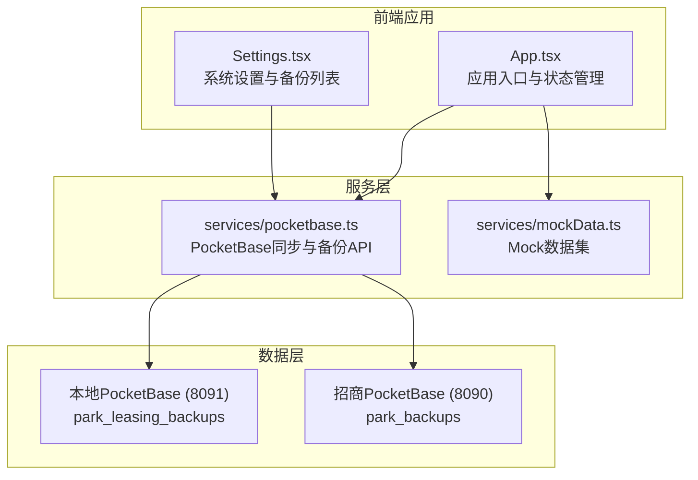
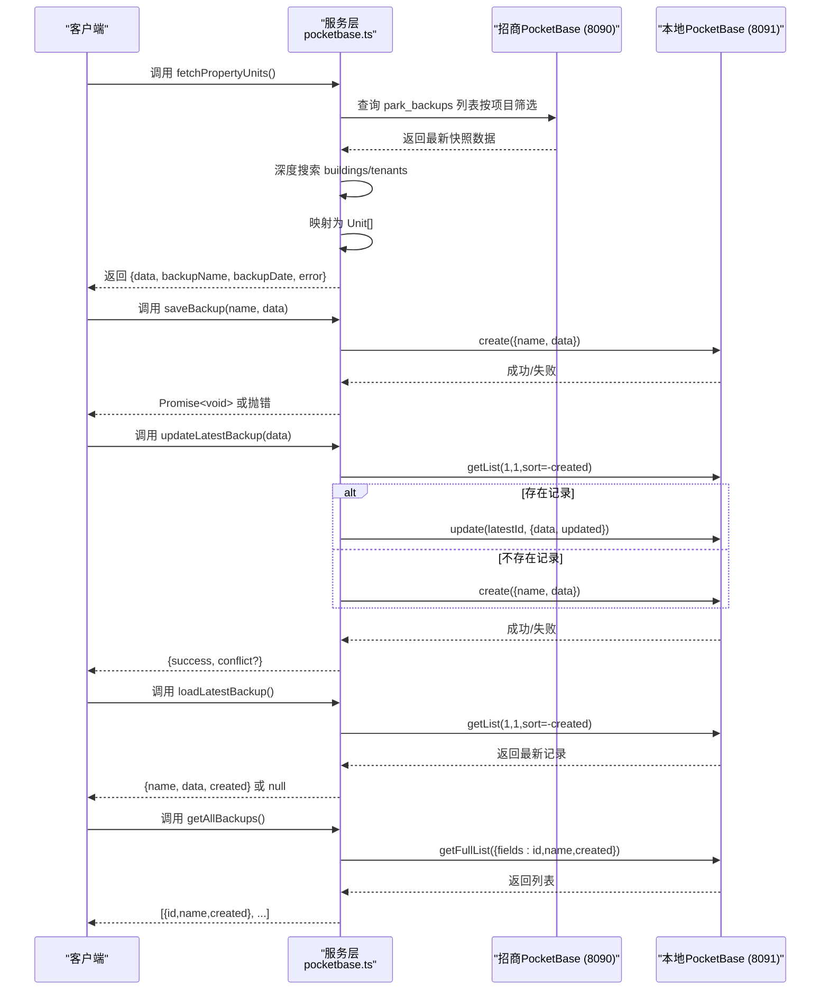
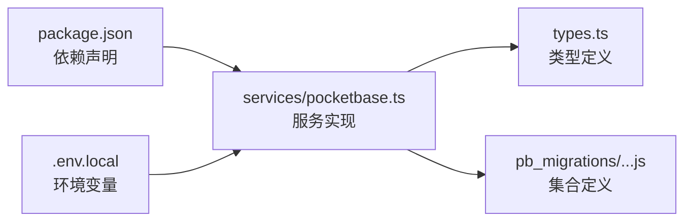
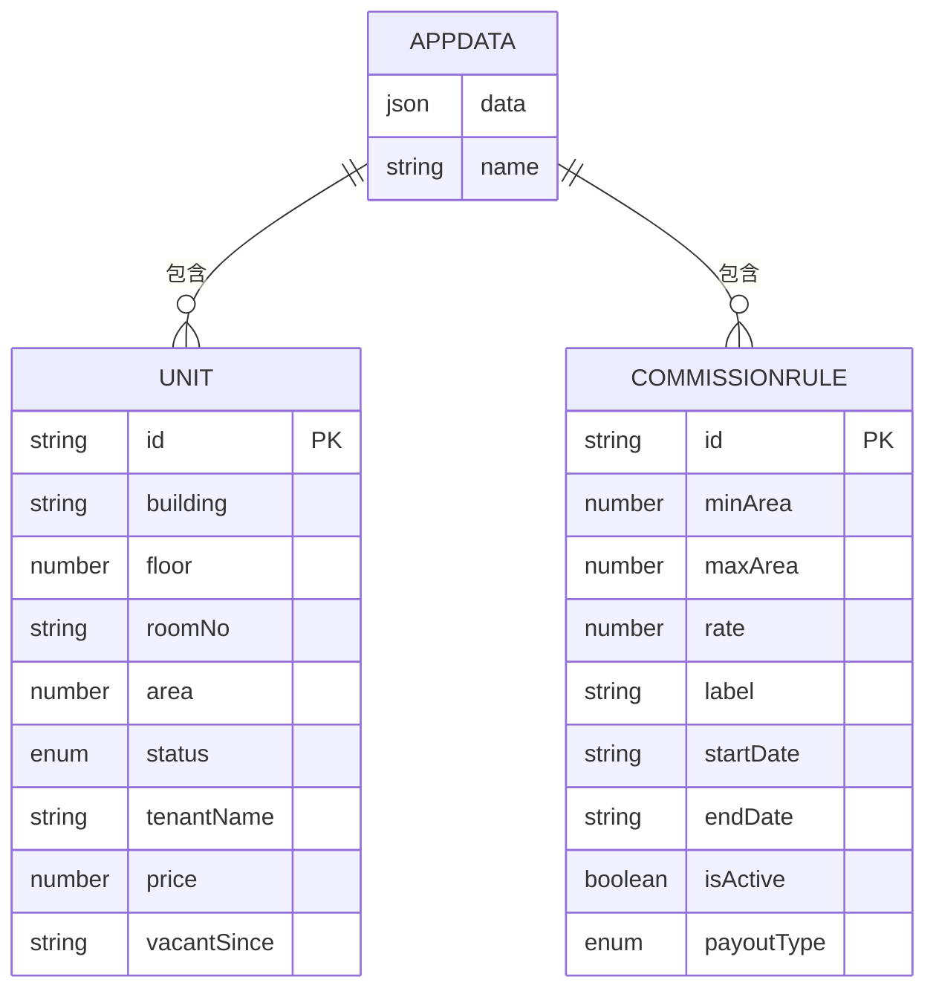

# 服务API

<cite>
**本文引用的文件**
- [services/pocketbase.ts](file://services/pocketbase.ts)
- [services/mockData.ts](file://services/mockData.ts)
- [types.ts](file://types.ts)
- [pb_migrations/1770189507_created_park_leasing_backups.js](file://pb_migrations/1770189507_created_park_leasing_backups.js)
- [package.json](file://package.json)
- [.env.local](file://.env.local)
- [README.md](file://README.md)
- [App.tsx](file://App.tsx)
- [components/Settings.tsx](file://components/Settings.tsx)
</cite>

## 目录
1. [简介](#简介)
2. [项目结构](#项目结构)
3. [核心组件](#核心组件)
4. [架构总览](#架构总览)
5. [详细组件分析](#详细组件分析)
6. [依赖关系分析](#依赖关系分析)
7. [性能考虑](#性能考虑)
8. [故障排查指南](#故障排查指南)
9. [结论](#结论)
10. [附录](#附录)

## 简介
本文件为“上海商机及渠道管理系统（v5.0）”的服务API文档，聚焦于以下三类服务接口：
- PocketBase数据同步服务接口：从招商管理系统的PocketBase实例拉取资产快照并映射为本地业务模型。
- 备份管理API：对本地PocketBase中的应用数据进行保存、更新、加载与列表查询。
- Mock数据接口：提供开发与演示所需的静态数据集，便于快速启动与测试。

文档涵盖每个接口的参数定义、返回值结构、错误处理机制、HTTP请求格式、响应状态码以及异常情况处理方案，并给出最佳实践与性能优化建议。

## 项目结构
系统采用前端React + PocketBase的轻量架构，核心服务集中在 services 目录，类型定义位于 types.ts，数据库迁移脚本位于 pb_migrations。环境变量通过 .env.local 控制PocketBase实例地址。

图表来源
- [services/pocketbase.ts](file://services/pocketbase.ts#L1-L226)
- [services/mockData.ts](file://services/mockData.ts#L1-L81)
- [types.ts](file://types.ts#L240-L261)
- [pb_migrations/1770189507_created_park_leasing_backups.js](file://pb_migrations/1770189507_created_park_leasing_backups.js#L1-L54)
- [components/Settings.tsx](file://components/Settings.tsx#L1-L200)
- [.env.local](file://.env.local#L1-L4)

章节来源
- [services/pocketbase.ts](file://services/pocketbase.ts#L1-L226)
- [services/mockData.ts](file://services/mockData.ts#L1-L81)
- [types.ts](file://types.ts#L240-L261)
- [pb_migrations/1770189507_created_park_leasing_backups.js](file://pb_migrations/1770189507_created_park_leasing_backups.js#L1-L54)
- [.env.local](file://.env.local#L1-L4)

## 核心组件
- PocketBase同步与备份服务：封装资产同步、备份保存、备份更新、备份加载与备份列表查询等能力。
- Mock数据服务：提供用户、资产、渠道、佣金规则等静态数据，便于开发与演示。
- 类型定义：统一AppData、Unit、CommissionRule等核心数据模型，确保前后端契约一致。

章节来源
- [services/pocketbase.ts](file://services/pocketbase.ts#L1-L226)
- [services/mockData.ts](file://services/mockData.ts#L1-L81)
- [types.ts](file://types.ts#L240-L261)

## 架构总览
系统通过两个PocketBase实例协同工作：
- 本地PocketBase（8091）：存放应用数据快照与备份。
- 招商PocketBase（8090）：存放资产快照数据，供资产同步接口消费。

图表来源
- [services/pocketbase.ts](file://services/pocketbase.ts#L50-L225)
- [.env.local](file://.env.local#L2-L3)

## 详细组件分析

### 资产同步接口：fetchPropertyUnits
- 功能概述：从招商PocketBase的 park_backups 集合中获取最新快照，解析并映射为本地 Unit 列表；同时返回快照元信息。
- 请求路径：无HTTP请求，直接调用服务方法。
- 参数
  - 无显式参数（内部使用环境变量控制目标实例）
- 返回值
  - data: Unit[] | null
  - backupName: string（可选）
  - backupDate: string（可选）
  - error: string | null
- 错误处理
  - 未找到项目快照：返回错误提示
  - 快照数据为空：返回错误提示
  - 解析后未提取到单元：返回错误提示
  - 其他异常：捕获并返回解析异常信息
- 使用示例
  - 在组件中调用并处理返回值，展示同步进度与结果
- 性能与最佳实践
  - 仅读取最新一条快照，避免全量扫描
  - 深度搜索逻辑对复杂JSON进行递归遍历，注意快照体量控制
  - 对租客映射建立索引，减少二次遍历成本

章节来源
- [services/pocketbase.ts](file://services/pocketbase.ts#L50-L125)
- [.env.local](file://.env.local#L3)

### 备份保存接口：saveBackup
- 功能概述：向本地PocketBase的 park_leasing_backups 集合写入一条备份记录。
- 请求路径：无HTTP请求，直接调用服务方法。
- 参数
  - name: string（备份名称）
  - data: AppData（应用数据快照）
- 返回值
  - Promise<void>（成功/失败）
- 错误处理
  - 写入失败：抛出错误并记录日志
- 使用示例
  - 在应用退出或定时任务中调用，持久化当前状态
- 性能与最佳实践
  - AppData体积较大，注意数据库字段大小限制
  - 建议在UI中提供进度反馈与错误提示

章节来源
- [services/pocketbase.ts](file://services/pocketbase.ts#L130-L140)
- [types.ts](file://types.ts#L240-L253)
- [pb_migrations/1770189507_created_park_leasing_backups.js](file://pb_migrations/1770189507_created_park_leasing_backups.js#L28-L36)

### 备份更新接口：updateLatestBackup
- 功能概述：更新本地PocketBase中最新的备份记录，用于自动同步场景；若无记录则创建新记录。
- 请求路径：无HTTP请求，直接调用服务方法。
- 参数
  - data: AppData（应用数据快照）
- 返回值
  - { success: boolean; conflict?: boolean }
- 错误处理
  - 并发冲突检测：当返回状态为409或消息包含“conflict”时，返回 { conflict: true }
  - 其他异常：抛出错误并记录日志
- 使用示例
  - 自动同步流程中调用，避免重复创建快照
- 性能与最佳实践
  - 使用乐观锁思想，先读取再更新，减少竞争条件
  - 若检测到冲突，建议重试或回退到保存新快照策略

章节来源
- [services/pocketbase.ts](file://services/pocketbase.ts#L146-L179)
- [types.ts](file://types.ts#L240-L253)

### 备份加载接口：loadLatestBackup
- 功能概述：加载本地PocketBase中最新的备份记录。
- 请求路径：无HTTP请求，直接调用服务方法。
- 参数：无
- 返回值
  - { name: string; data: AppData; created: string } | null
- 错误处理
  - 加载失败：抛出错误并记录日志
- 使用示例
  - 应用启动时自动恢复最新状态
- 性能与最佳实践
  - 仅读取最新一条记录，避免全量扫描

章节来源
- [services/pocketbase.ts](file://services/pocketbase.ts#L184-L204)
- [types.ts](file://types.ts#L240-L253)

### 备份列表接口：getAllBackups
- 功能概述：获取本地PocketBase中所有备份记录的简要信息列表。
- 请求路径：无HTTP请求，直接调用服务方法。
- 参数：无
- 返回值
  - Array<{ id: string; name: string; created: string }>
- 错误处理
  - 获取失败：返回空数组并记录日志
- 使用示例
  - 在设置页面展示历史备份列表
- 性能与最佳实践
  - 仅返回必要字段，避免传输冗余数据

章节来源
- [services/pocketbase.ts](file://services/pocketbase.ts#L209-L225)
- [components/Settings.tsx](file://components/Settings.tsx#L37-L48)

### Mock数据接口
- 功能概述：提供开发与演示所需的静态数据集，包括用户、资产、渠道、佣金规则等。
- 请求路径：无HTTP请求，直接导入模块使用。
- 参数：无
- 返回值
  - 各类常量数组与工具函数（如计算年度累计面积、判断佣金逾期等）
- 使用示例
  - 在开发模式下注入初始数据，或在测试中使用
- 性能与最佳实践
  - 仅在开发环境启用，生产环境应从真实数据源加载

章节来源
- [services/mockData.ts](file://services/mockData.ts#L1-L81)
- [App.tsx](file://App.tsx#L12)

## 依赖关系分析
- 依赖项
  - pocketbase：用于与本地与招商PocketBase实例交互
  - lucide-react、recharts：UI与可视化组件
- 环境变量
  - POCKETBASE_URL：本地PocketBase地址（默认8091）
  - POCKETBASE_PROPERTY_URL：招商PocketBase地址（默认8090）
- 数据库集合
  - park_leasing_backups：本地备份集合（JSON字段最大2MB）
  - park_backups：招商快照集合（由外部系统维护）

图表来源
- [package.json](file://package.json#L11-L26)
- [.env.local](file://.env.local#L2-L3)
- [services/pocketbase.ts](file://services/pocketbase.ts#L1-L12)
- [types.ts](file://types.ts#L240-L261)
- [pb_migrations/1770189507_created_park_leasing_backups.js](file://pb_migrations/1770189507_created_park_leasing_backups.js#L1-L54)

章节来源
- [package.json](file://package.json#L11-L26)
- [.env.local](file://.env.local#L2-L3)
- [services/pocketbase.ts](file://services/pocketbase.ts#L1-L12)
- [types.ts](file://types.ts#L240-L261)
- [pb_migrations/1770189507_created_park_leasing_backups.js](file://pb_migrations/1770189507_created_park_leasing_backups.js#L1-L54)

## 性能考虑
- 数据体量控制
  - AppData为JSON字段，最大容量限制为2MB；建议在保存前进行必要的裁剪与压缩
- 查询优化
  - 仅读取最新记录或必要字段，避免全量扫描
- 并发与一致性
  - updateLatestBackup采用乐观锁思想，检测冲突后返回冲突标志，便于上层重试或降级
- 解析效率
  - 深度搜索函数对复杂JSON进行递归遍历，建议保持快照结构稳定与简洁
- UI体验
  - 在调用备份相关接口时提供加载状态与错误提示，提升用户体验

[本节为通用指导，无需列出具体文件来源]

## 故障排查指南
- 无法连接PocketBase
  - 检查环境变量 POCKETBASE_URL 与 POCKETBASE_PROPERTY_URL 是否正确
  - 确认对应端口（8091/8090）的PocketBase实例已启动
- fetchPropertyUnits 返回空数据
  - 确认招商PocketBase中 park_backups 集合存在项目名为 park_data_main 的快照
  - 检查快照数据结构是否包含 buildings/tenants 等关键容器
- 备份保存失败
  - 检查 AppData 是否超出JSON字段大小限制
  - 查看服务端错误日志，确认集合权限与规则
- 备份更新冲突
  - 若返回 conflict: true，建议稍后重试或改为保存新快照
- 加载备份失败
  - 确认本地PocketBase中存在 park_leasing_backups 集合且有数据
  - 检查字段映射与类型定义是否匹配

章节来源
- [.env.local](file://.env.local#L2-L3)
- [services/pocketbase.ts](file://services/pocketbase.ts#L50-L125)
- [services/pocketbase.ts](file://services/pocketbase.ts#L130-L140)
- [services/pocketbase.ts](file://services/pocketbase.ts#L146-L179)
- [services/pocketbase.ts](file://services/pocketbase.ts#L184-L204)
- [services/pocketbase.ts](file://services/pocketbase.ts#L209-L225)
- [pb_migrations/1770189507_created_park_leasing_backups.js](file://pb_migrations/1770189507_created_park_leasing_backups.js#L28-L36)

## 结论
本文档梳理了系统的核心服务API，明确了资产同步与备份管理的实现细节与使用规范。通过合理利用Mock数据与严格的错误处理机制，可在保证数据一致性的同时提升开发与运维效率。建议在生产环境中持续监控数据库容量与查询性能，并根据业务增长调整快照结构与保存策略。

[本节为总结性内容，无需列出具体文件来源]

## 附录

### 接口一览与使用要点
- fetchPropertyUnits
  - 用途：从招商PocketBase获取最新资产快照并映射为本地Unit列表
  - 返回：包含数据、快照元信息与错误标识
  - 注意：快照结构需包含 buildings/tenants 等容器
- saveBackup
  - 用途：保存当前应用状态为新备份
  - 返回：Promise<void>，失败抛错
  - 注意：AppData体积限制与字段权限
- updateLatestBackup
  - 用途：更新最新备份，避免重复创建
  - 返回：{ success, conflict? }
  - 注意：并发冲突检测与重试策略
- loadLatestBackup
  - 用途：加载最新备份用于恢复
  - 返回：最新备份对象或null
- getAllBackups
  - 用途：获取备份列表用于历史记录
  - 返回：[{ id, name, created }, ...]

章节来源
- [services/pocketbase.ts](file://services/pocketbase.ts#L50-L225)
- [types.ts](file://types.ts#L240-L253)

### 数据模型概览

图表来源
- [types.ts](file://types.ts#L240-L261)
- [types.ts](file://types.ts#L78-L88)
- [types.ts](file://types.ts#L123-L134)