# Assets资产管理组件API

<cite>
**本文档引用的文件**
- [Assets.tsx](file://components/Assets.tsx)
- [pocketbase.ts](file://services/pocketbase.ts)
- [types.ts](file://types.ts)
- [unitHeatAnalytics.ts](file://services/unitHeatAnalytics.ts)
- [App.tsx](file://App.tsx)
- [mockData.ts](file://services/mockData.ts)
</cite>

## 目录
1. [简介](#简介)
2. [项目结构](#项目结构)
3. [核心组件](#核心组件)
4. [架构概览](#架构概览)
5. [详细组件分析](#详细组件分析)
6. [依赖关系分析](#依赖关系分析)
7. [性能考虑](#性能考虑)
8. [故障排除指南](#故障排除指南)
9. [结论](#结论)

## 简介

Assets资产管理组件是上海商机及渠道管理系统中的核心资产展示和管理模块。该组件提供了可视化的资产落位大表，支持资产状态实时更新、空置房源统计分析、云端数据同步等功能。组件集成了招商管理系统，通过PocketBase数据源实现与主库的实时数据同步。

## 项目结构

该项目采用React + TypeScript构建，主要目录结构如下：

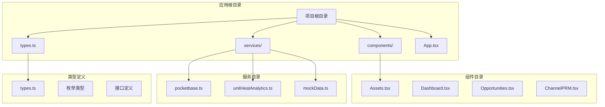

**图表来源**
- [Assets.tsx](file://components/Assets.tsx#L1-L445)
- [pocketbase.ts](file://services/pocketbase.ts#L1-L274)
- [types.ts](file://types.ts#L1-L276)

**章节来源**
- [Assets.tsx](file://components/Assets.tsx#L1-L445)
- [pocketbase.ts](file://services/pocketbase.ts#L1-L274)
- [types.ts](file://types.ts#L1-L276)

## 核心组件

Assets资产管理组件是一个高度模块化的React组件，具备以下核心特性：

### 主要功能特性
- **可视化资产展示**：以楼层平面图形式展示所有资产单元
- **实时状态管理**：支持资产状态的动态更新和管理
- **智能统计分析**：提供面积统计、出租率计算等关键指标
- **云端数据同步**：与招商管理系统实现双向数据同步
- **热度分析**：基于商机和带看活动的房源热度统计
- **权限控制**：区分管理员和普通用户的操作权限

### 数据流架构

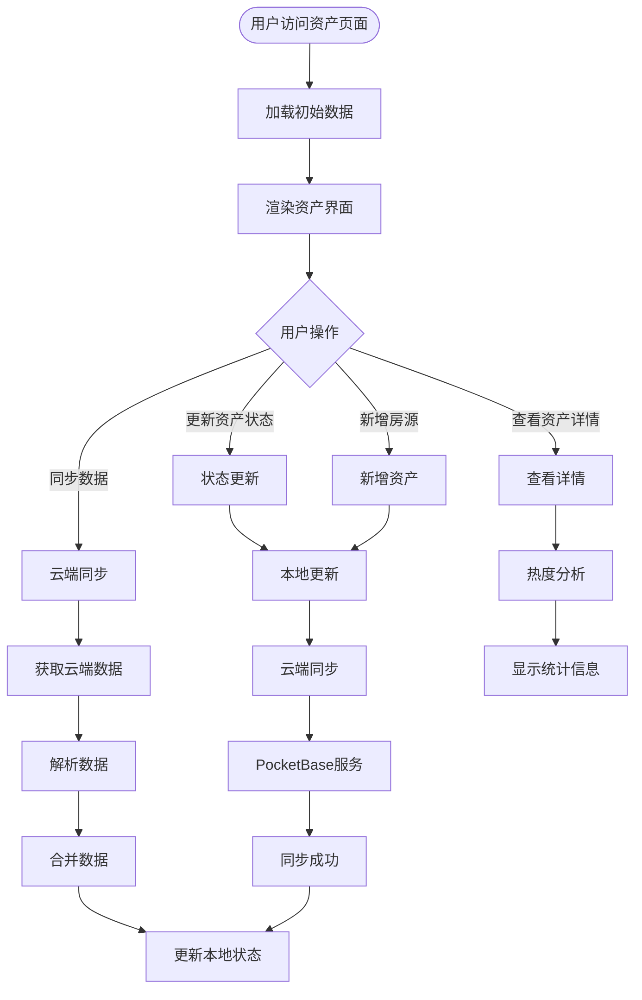

**图表来源**
- [Assets.tsx](file://components/Assets.tsx#L35-L169)
- [pocketbase.ts](file://services/pocketbase.ts#L93-L173)

**章节来源**
- [Assets.tsx](file://components/Assets.tsx#L19-L47)
- [App.tsx](file://App.tsx#L542-L556)

## 架构概览

Assets组件采用分层架构设计，确保了良好的可维护性和扩展性：

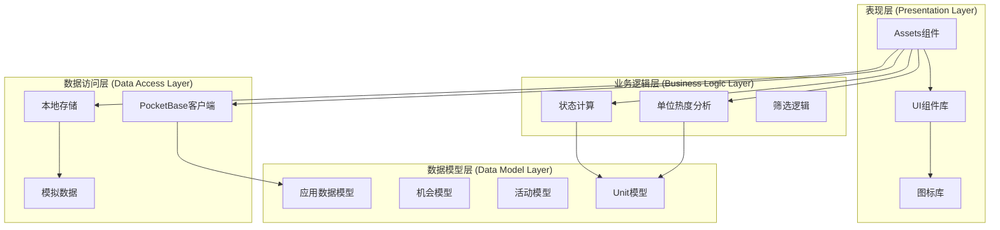

**图表来源**
- [Assets.tsx](file://components/Assets.tsx#L1-L445)
- [pocketbase.ts](file://services/pocketbase.ts#L1-L274)
- [types.ts](file://types.ts#L78-L256)

## 详细组件分析

### Props接口定义

Assets组件通过清晰的Props接口实现组件化设计：

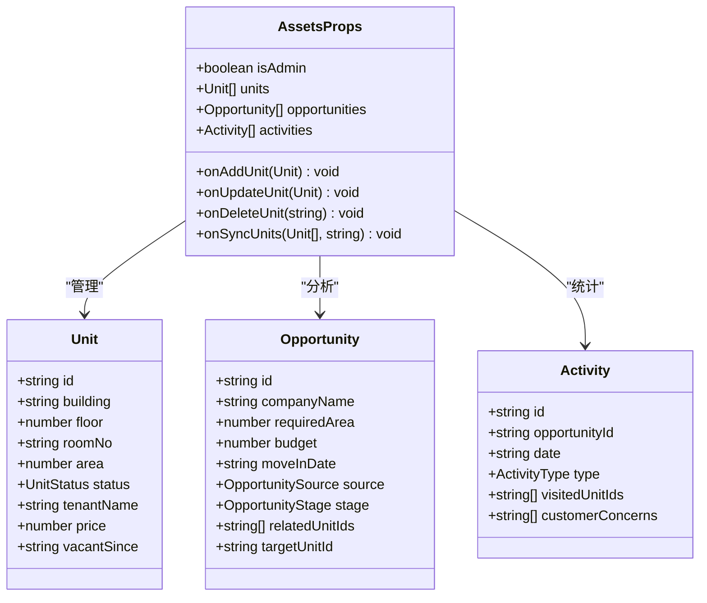

**图表来源**
- [Assets.tsx](file://components/Assets.tsx#L8-L17)
- [types.ts](file://types.ts#L78-L224)

### 状态管理机制

组件内部实现了完善的状态管理机制：

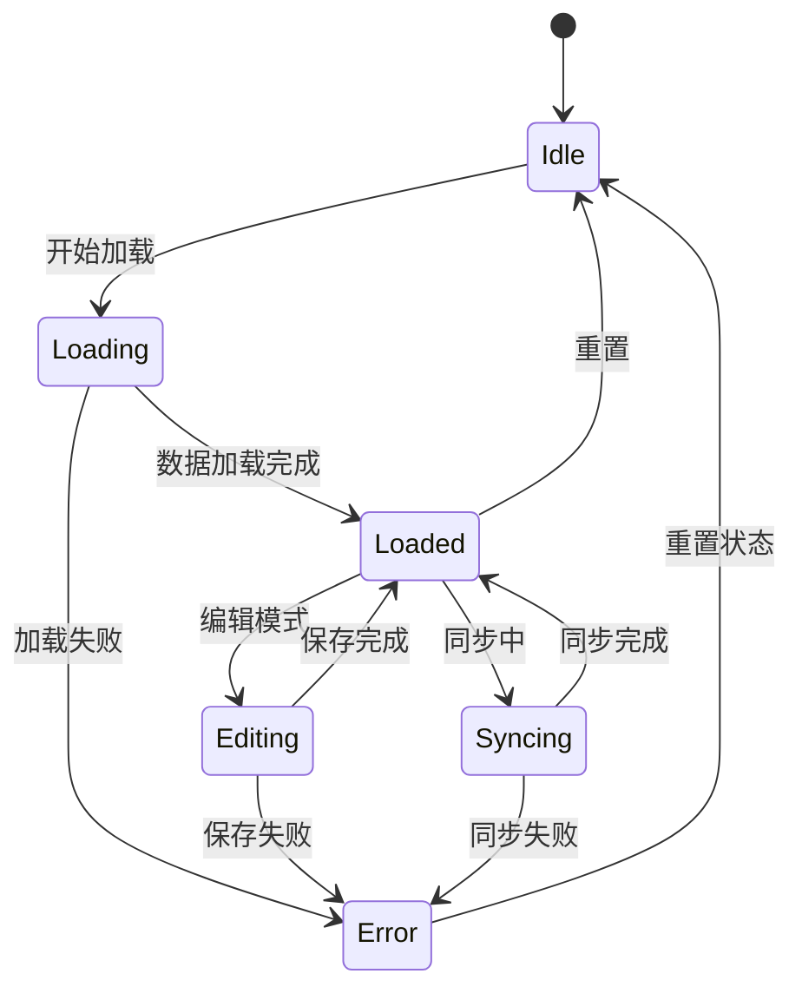

**图表来源**
- [Assets.tsx](file://components/Assets.tsx#L20-L27)
- [Assets.tsx](file://components/Assets.tsx#L112-L169)

### 数据同步流程

组件与招商管理系统的数据同步采用多层保障机制：

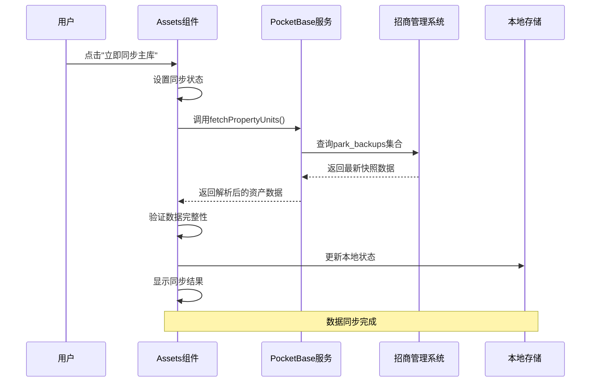

**图表来源**
- [Assets.tsx](file://components/Assets.tsx#L112-L169)
- [pocketbase.ts](file://services/pocketbase.ts#L93-L173)

**章节来源**
- [Assets.tsx](file://components/Assets.tsx#L8-L17)
- [Assets.tsx](file://components/Assets.tsx#L19-L47)
- [Assets.tsx](file://components/Assets.tsx#L112-L169)

### 空置房源统计分析

组件实现了智能化的空置房源统计分析功能：

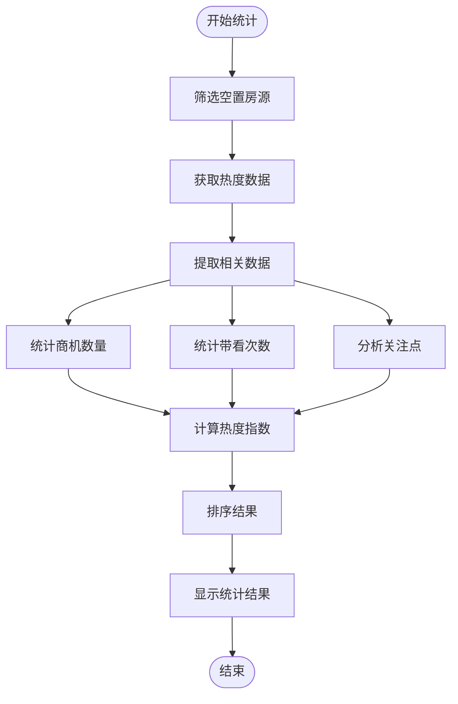

**图表来源**
- [unitHeatAnalytics.ts](file://services/unitHeatAnalytics.ts#L37-L139)
- [Assets.tsx](file://components/Assets.tsx#L316-L343)

**章节来源**
- [unitHeatAnalytics.ts](file://services/unitHeatAnalytics.ts#L144-L189)
- [Assets.tsx](file://components/Assets.tsx#L316-L343)

## 依赖关系分析

### 核心依赖关系

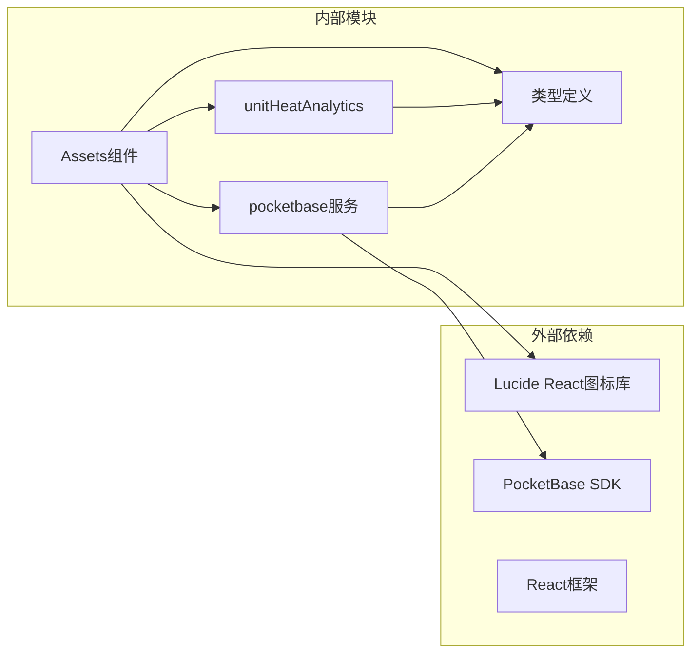

**图表来源**
- [Assets.tsx](file://components/Assets.tsx#L1-L6)
- [pocketbase.ts](file://services/pocketbase.ts#L1-L12)

### 数据模型关系

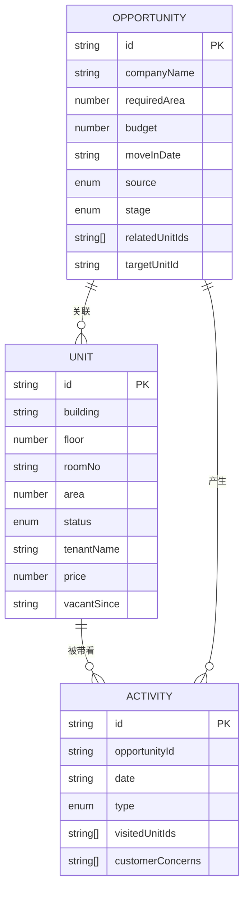

**图表来源**
- [types.ts](file://types.ts#L78-L224)

**章节来源**
- [Assets.tsx](file://components/Assets.tsx#L1-L6)
- [pocketbase.ts](file://services/pocketbase.ts#L1-L12)
- [types.ts](file://types.ts#L78-L224)

## 性能考虑

### 数据加载优化

组件采用了多种性能优化策略：

1. **懒加载机制**：仅在需要时加载和渲染数据
2. **虚拟滚动**：对于大量数据采用虚拟化渲染
3. **缓存策略**：合理利用浏览器缓存减少重复请求
4. **防抖处理**：对频繁操作进行防抖处理

### 内存管理

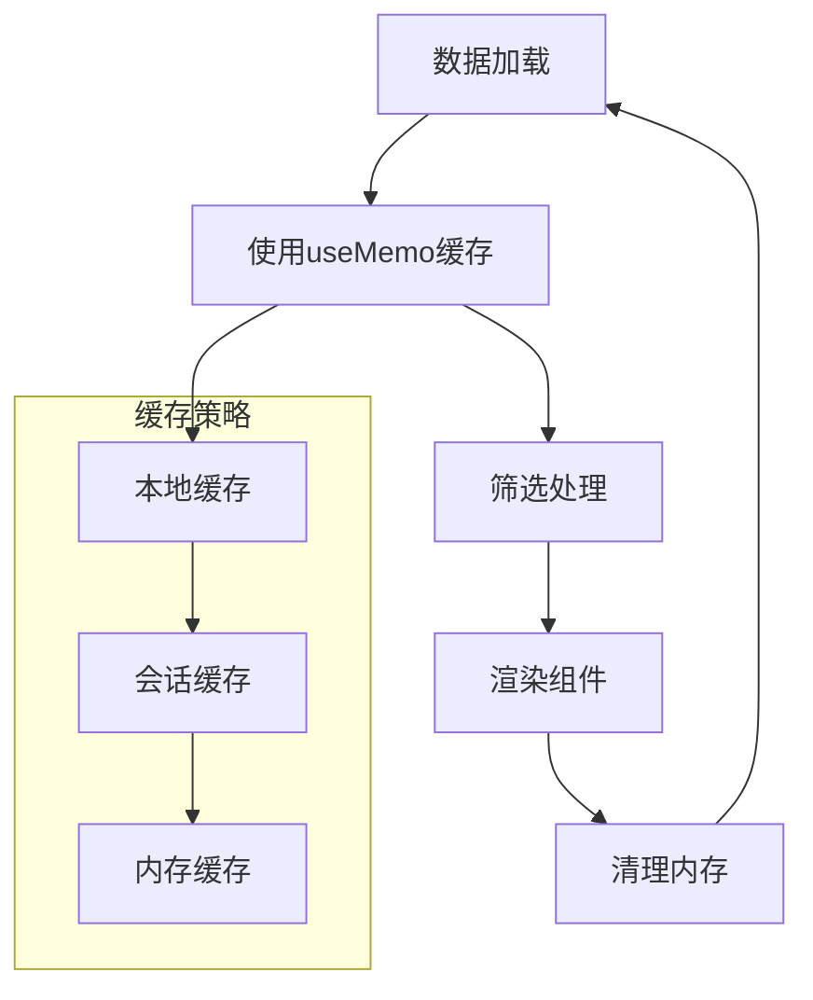

**图表来源**
- [Assets.tsx](file://components/Assets.tsx#L39-L47)
- [Assets.tsx](file://components/Assets.tsx#L25-L27)

### 网络请求优化

组件实现了智能的网络请求管理：

- **超时控制**：15秒超时机制防止长时间等待
- **自动重试**：失败时自动重试最多2次
- **并发控制**：避免同时发起过多请求
- **错误处理**：完善的错误捕获和用户提示

**章节来源**
- [pocketbase.ts](file://services/pocketbase.ts#L47-L87)
- [pocketbase.ts](file://services/pocketbase.ts#L93-L173)

## 故障排除指南

### 常见问题及解决方案

| 问题类型 | 症状描述 | 可能原因 | 解决方案 |
|---------|---------|---------|---------|
| 同步失败 | 显示"同步失败"提示 | 网络连接问题 | 检查网络连接，重启服务 |
| 数据加载慢 | 页面响应缓慢 | 数据量过大 | 清理缓存，优化查询条件 |
| 权限不足 | 无法编辑资产 | 用户权限限制 | 联系管理员提升权限 |
| 状态更新失败 | 资产状态不变化 | 数据同步冲突 | 刷新页面，重新登录 |

### 错误处理机制

组件实现了多层次的错误处理：

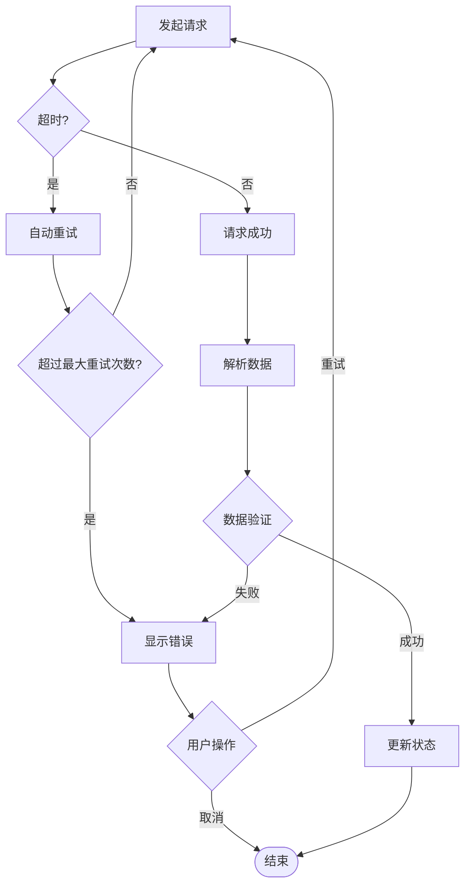

**图表来源**
- [Assets.tsx](file://components/Assets.tsx#L112-L169)
- [pocketbase.ts](file://services/pocketbase.ts#L72-L87)

**章节来源**
- [Assets.tsx](file://components/Assets.tsx#L112-L169)
- [pocketbase.ts](file://services/pocketbase.ts#L170-L173)

## 结论

Assets资产管理组件是一个功能完备、架构清晰的React组件。它成功地将复杂的资产管理需求抽象为简洁的API接口，为用户提供了直观、高效的资产管理和分析体验。

### 主要优势

1. **模块化设计**：清晰的组件边界和职责分离
2. **数据驱动**：基于真实数据的可视化展示
3. **实时同步**：与招商管理系统的无缝集成
4. **智能分析**：内置的热度统计和趋势分析
5. **用户体验**：直观的界面设计和流畅的操作体验

### 技术亮点

- **类型安全**：完整的TypeScript类型定义
- **性能优化**：多层缓存和优化策略
- **错误处理**：完善的异常处理机制
- **权限控制**：细粒度的用户权限管理
- **扩展性强**：易于添加新功能和定制化需求

该组件为资产管理提供了坚实的技术基础，能够满足现代企业对资产可视化管理的各种需求。