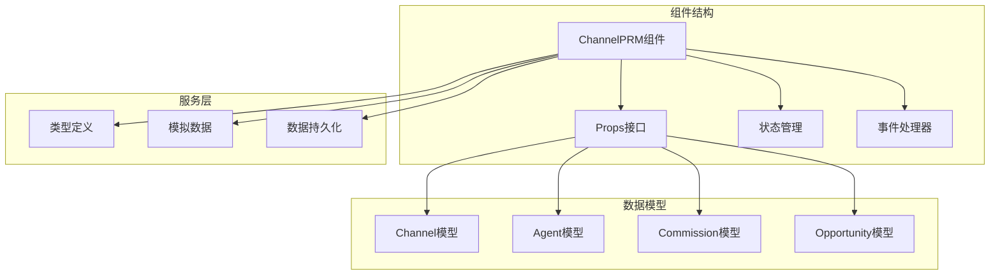
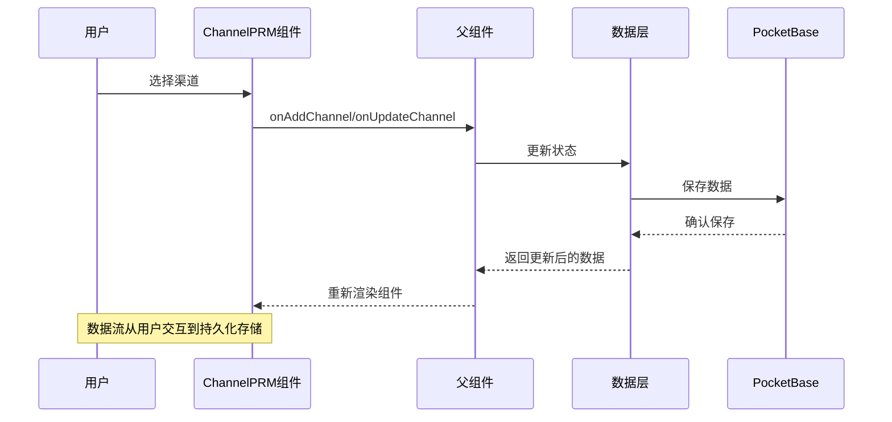
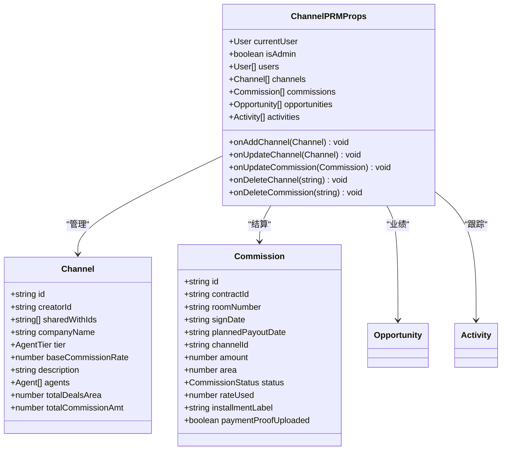
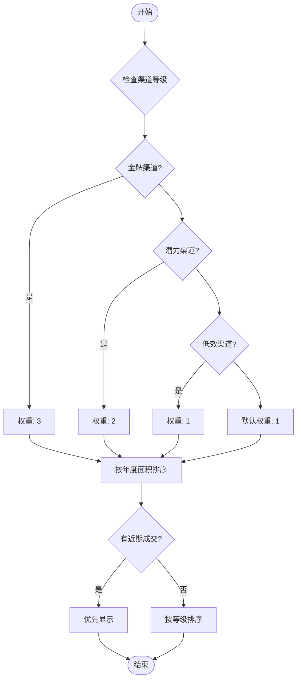
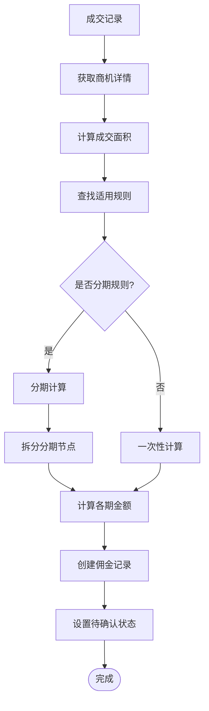
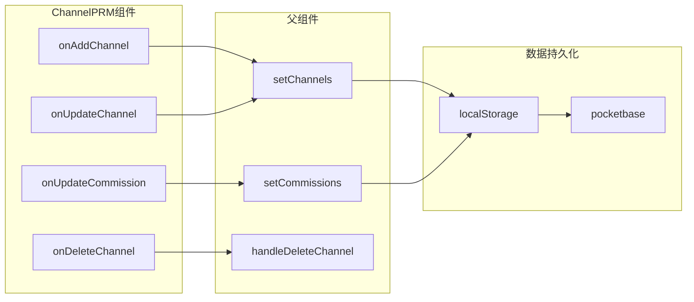
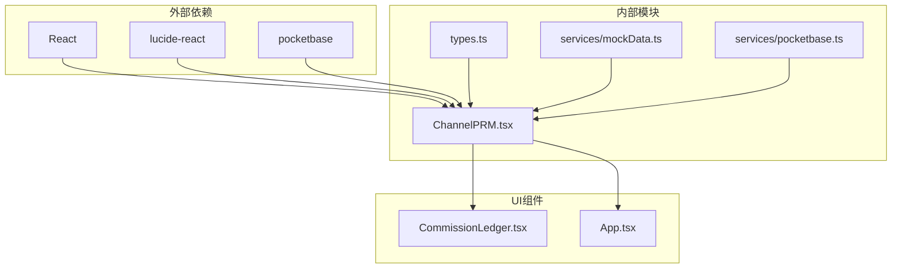

# ChannelPRM渠道管理组件API

<cite>
**本文档引用的文件**
- [ChannelPRM.tsx](file://components/ChannelPRM.tsx)
- [types.ts](file://types.ts)
- [App.tsx](file://App.tsx)
- [CommissionLedger.tsx](file://components/CommissionLedger.tsx)
- [mockData.ts](file://services/mockData.ts)
- [pocketbase.ts](file://services/pocketbase.ts)
</cite>

## 目录
1. [简介](#简介)
2. [项目结构](#项目结构)
3. [核心组件](#核心组件)
4. [架构概览](#架构概览)
5. [详细组件分析](#详细组件分析)
6. [依赖关系分析](#依赖关系分析)
7. [性能考虑](#性能考虑)
8. [故障排除指南](#故障排除指南)
9. [结论](#结论)

## 简介

ChannelPRM渠道管理组件是上海商机及渠道管理系统的核心模块，负责渠道伙伴的全生命周期管理、业绩统计分析和佣金分配结算。该组件提供了完整的渠道关系维护、渠道业绩跟踪、渠道佣金结算等功能，支持多层级的渠道等级管理和复杂的佣金计算机制。

## 项目结构

ChannelPRM组件位于components目录下，采用React函数式组件设计，集成了类型安全的TypeScript实现。组件通过props接口接收外部数据和回调函数，实现了高度的可复用性和可扩展性。



**图表来源**
- [ChannelPRM.tsx](file://components/ChannelPRM.tsx#L1-L50)
- [types.ts](file://types.ts#L103-L114)

**章节来源**
- [ChannelPRM.tsx](file://components/ChannelPRM.tsx#L1-L50)
- [types.ts](file://types.ts#L1-L50)

## 核心组件

ChannelPRM组件是一个功能完整的渠道管理界面，主要包含以下核心功能：

### 主要特性
- **渠道伙伴管理**：支持新增、编辑、删除渠道合作伙伴
- **业绩统计分析**：提供月度(MTD)和年度(YTD)业绩指标
- **佣金分配结算**：集成佣金财务状态管理和分期付款机制
- **渠道关系维护**：支持多级渠道等级和权限共享
- **联系人管理**：维护渠道方对接联系人的信息

### 接口设计
组件通过清晰的props接口与父组件通信，支持双向数据绑定和事件回调。

**章节来源**
- [ChannelPRM.tsx](file://components/ChannelPRM.tsx#L6-L19)
- [App.tsx](file://App.tsx#L550-L551)

## 架构概览

ChannelPRM组件采用分层架构设计，实现了数据层、业务逻辑层和表现层的有效分离。



**图表来源**
- [ChannelPRM.tsx](file://components/ChannelPRM.tsx#L128-L149)
- [App.tsx](file://App.tsx#L550-L551)

## 详细组件分析

### Props接口定义

ChannelPRM组件的Props接口定义了完整的数据交换协议：



**图表来源**
- [ChannelPRM.tsx](file://components/ChannelPRM.tsx#L6-L19)
- [types.ts](file://types.ts#L103-L114)
- [types.ts](file://types.ts#L226-L241)

### 渠道等级管理逻辑

组件实现了三级渠道等级体系，支持金牌、潜力和低效三个级别：



**图表来源**
- [ChannelPRM.tsx](file://components/ChannelPRM.tsx#L117-L126)

### 佣金计算机制

组件集成了复杂的佣金计算和分期付款机制：



**图表来源**
- [App.tsx](file://App.tsx#L357-L412)

### 性能统计功能

组件提供了全面的业绩统计分析功能：

| 统计指标 | 计算方式 | 时间范围 |
|---------|---------|----------|
| 月度成交面积(MTD) | 当月成交面积总和 | 月度 |
| 年度成交面积(YTD) | 当年成交面积总和 | 年度 |
| 月度带看次数 | 当月带看活动数量 | 月度 |
| 年度带看次数 | 当年带看活动数量 | 年度 |
| 已结清佣金 | 已支付状态佣金总和 | 全部 |
| 待结清佣金 | 非支付状态佣金总和 | 全部 |

**章节来源**
- [ChannelPRM.tsx](file://components/ChannelPRM.tsx#L54-L98)

### 使用示例

#### 添加渠道伙伴
```typescript
// 在父组件中实现
const handleAddChannel = (channel: Channel) => {
  setChannels(prev => [channel, ...prev]);
};

// 在ChannelPRM中调用
onAddChannel(newChannel);
```

#### 查看渠道业绩
```typescript
// 选择渠道后自动显示统计信息
const selectedChannel = channels.find(c => c.id === channelId);
const stats = getChannelStats(selectedChannel.id);
```

#### 分配佣金
```typescript
// 编辑佣金状态
const handleUpdateCommission = (commission: Commission) => {
  setCommissions(prev => 
    prev.map(c => c.id === commission.id ? commission : c)
  );
};
```

**章节来源**
- [ChannelPRM.tsx](file://components/ChannelPRM.tsx#L128-L149)
- [App.tsx](file://App.tsx#L550-L551)

### 数据交互接口

组件与佣金管理系统的数据交互通过以下接口实现：



**图表来源**
- [ChannelPRM.tsx](file://components/ChannelPRM.tsx#L14-L18)
- [App.tsx](file://App.tsx#L550-L551)

**章节来源**
- [ChannelPRM.tsx](file://components/ChannelPRM.tsx#L14-L18)
- [App.tsx](file://App.tsx#L550-L551)

## 依赖关系分析

ChannelPRM组件的依赖关系体现了清晰的模块化设计：



**图表来源**
- [ChannelPRM.tsx](file://components/ChannelPRM.tsx#L1-L5)
- [types.ts](file://types.ts#L1-L50)

### 错误处理机制

组件实现了多层次的错误处理和数据降级机制：

1. **用户列表降级**：当props传入的用户列表为空时，自动从localStorage读取缓存数据
2. **数据完整性检查**：确保关键字段的完整性和有效性
3. **操作确认机制**：对危险操作提供确认对话框
4. **状态管理**：使用useState和useMemo优化性能

**章节来源**
- [ChannelPRM.tsx](file://components/ChannelPRM.tsx#L36-L52)
- [ChannelPRM.tsx](file://components/ChannelPRM.tsx#L174-L180)

## 性能考虑

ChannelPRM组件在设计时充分考虑了性能优化：

### 内存管理
- 使用useMemo避免不必要的重新计算
- 通过JSON.parse(JSON.stringify())实现深度克隆
- 合理的状态分割减少重渲染

### 数据处理
- 使用filter和reduce进行高效的数据筛选
- 通过索引建立快速查找机制
- 避免在渲染过程中进行复杂计算

### 用户体验
- 实时搜索和排序功能
- 动画过渡效果提升交互体验
- 响应式布局适配不同设备

## 故障排除指南

### 常见问题及解决方案

#### 用户列表为空
**问题**：渠道归属下拉菜单显示为空
**原因**：用户数据未正确加载
**解决方案**：
1. 检查localStorage中的用户数据
2. 确认PocketBase连接状态
3. 验证用户数据格式

#### 渠道统计不准确
**问题**：业绩统计数据与预期不符
**原因**：数据关联关系错误
**解决方案**：
1. 检查opportunities和commissions的关联
2. 验证dealParams字段的完整性
3. 确认时间范围过滤逻辑

#### 佣金计算错误
**问题**：佣金金额计算不正确
**原因**：佣金规则匹配失败
**解决方案**：
1. 检查commissionRules的有效性
2. 验证面积范围和日期条件
3. 确认费率计算逻辑

**章节来源**
- [ChannelPRM.tsx](file://components/ChannelPRM.tsx#L36-L52)
- [App.tsx](file://App.tsx#L357-L412)

## 结论

ChannelPRM渠道管理组件是一个功能完整、架构清晰的React组件，提供了全面的渠道伙伴管理解决方案。组件通过合理的接口设计、完善的错误处理机制和高效的性能优化，为企业提供了可靠的渠道管理工具。

组件的主要优势包括：
- **模块化设计**：清晰的职责分离和接口定义
- **类型安全**：完整的TypeScript类型定义
- **性能优化**：智能的状态管理和计算缓存
- **用户体验**：直观的界面设计和流畅的交互体验
- **数据完整性**：多层次的数据验证和降级机制

通过本文档的详细说明，开发者可以快速理解和使用ChannelPRM组件，实现高效的渠道管理功能。