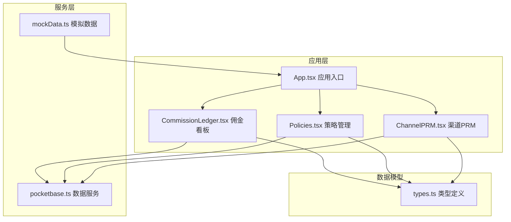
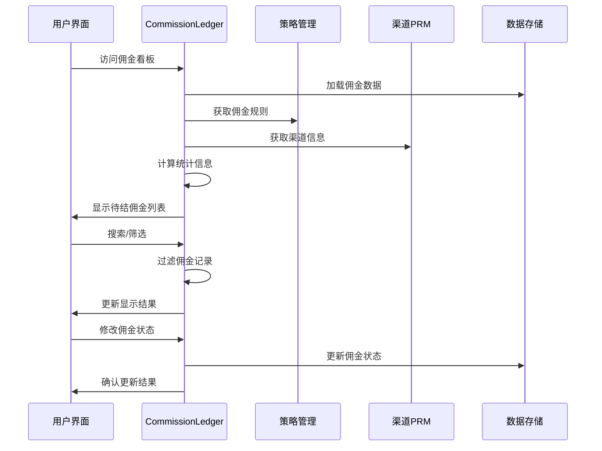
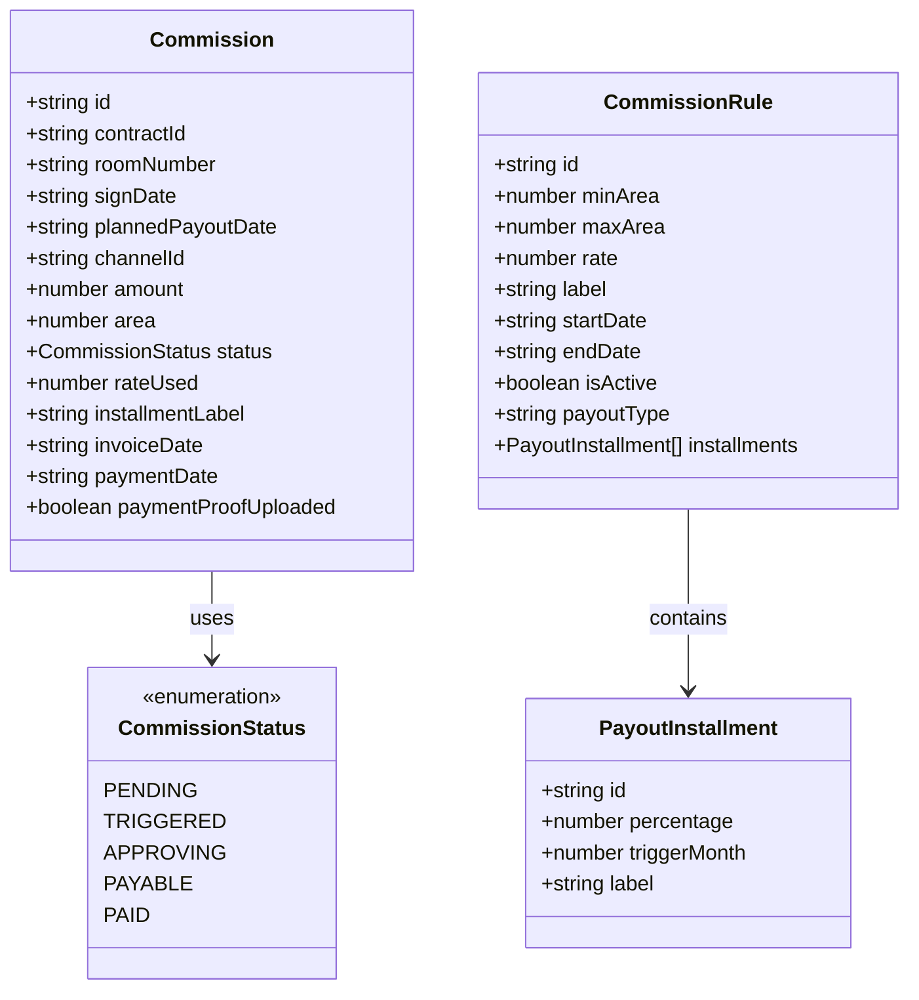
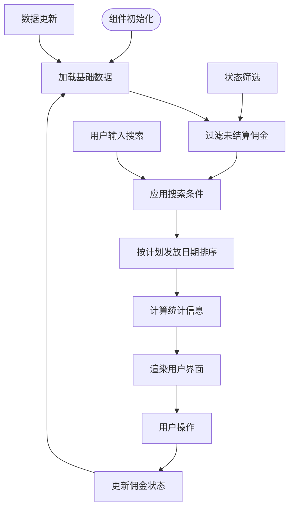
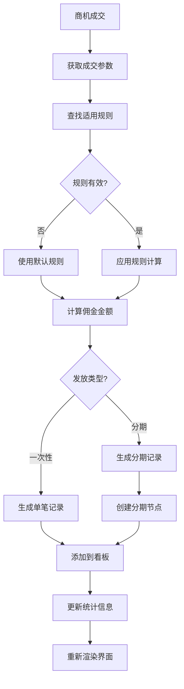
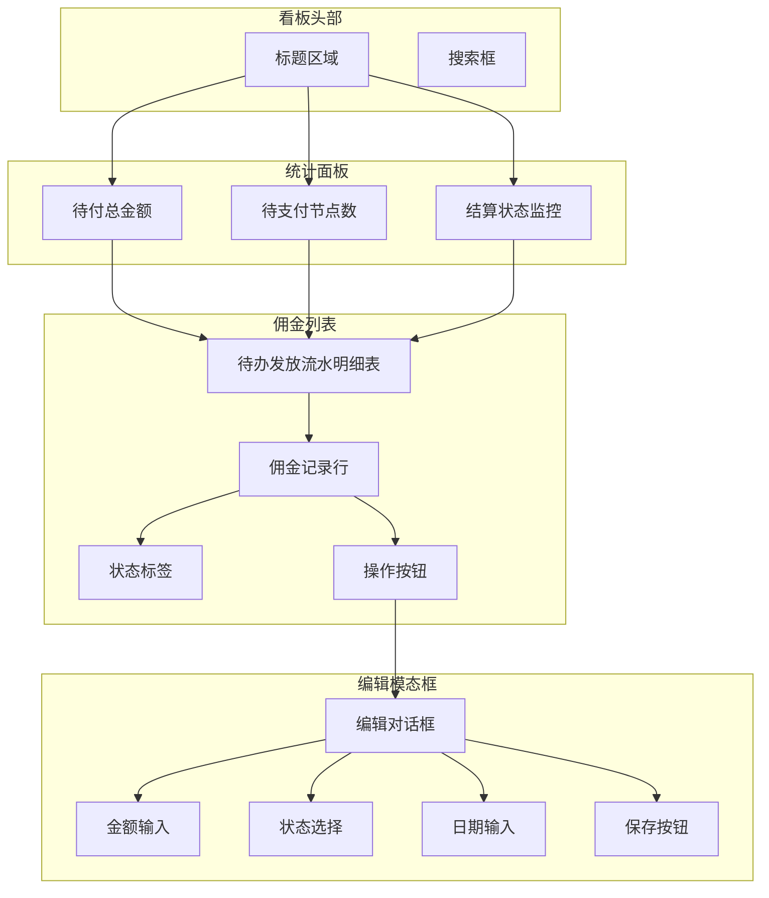
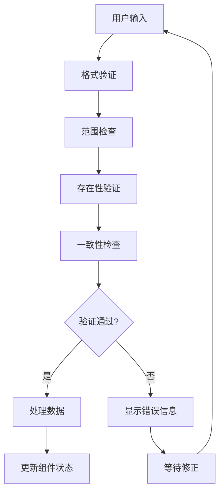
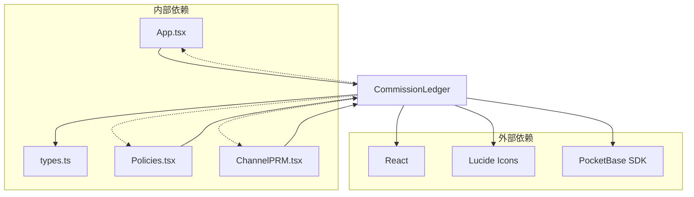
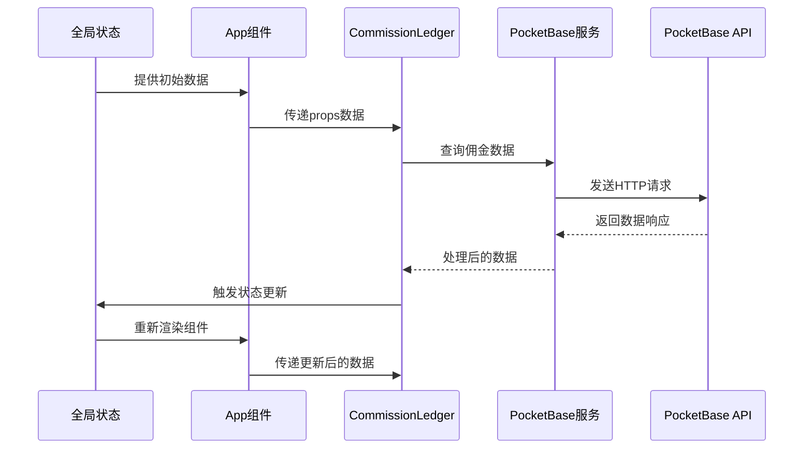

# CommissionLedger佣金管理组件API

<cite>
**本文档引用的文件**
- [CommissionLedger.tsx](file://components/CommissionLedger.tsx)
- [types.ts](file://types.ts)
- [App.tsx](file://App.tsx)
- [Policies.tsx](file://components/Policies.tsx)
- [ChannelPRM.tsx](file://components/ChannelPRM.tsx)
- [pocketbase.ts](file://services/pocketbase.ts)
- [mockData.ts](file://services/mockData.ts)
</cite>

## 目录
1. [简介](#简介)
2. [项目结构](#项目结构)
3. [核心组件](#核心组件)
4. [架构概览](#架构概览)
5. [详细组件分析](#详细组件分析)
6. [依赖关系分析](#依赖关系分析)
7. [性能考虑](#性能考虑)
8. [故障排除指南](#故障排除指南)
9. [结论](#结论)

## 简介

CommissionLedger佣金管理组件是Leasing Cmdr.系统中的核心模块，负责管理和监控待结算佣金。该组件提供了完整的佣金生命周期管理功能，包括佣金计算、发放、对账和历史查询等操作。

该组件采用React函数式组件设计，结合TypeScript类型系统，确保了代码的类型安全性和可维护性。通过与策略管理系统和渠道PRM系统的深度集成，实现了从佣金规则配置到最终结算的完整业务流程。

## 项目结构

Leasing Cmdr.系统采用模块化架构设计，CommissionLedger组件位于components目录下，与其他核心组件协同工作：



**图表来源**
- [App.tsx](file://App.tsx#L565-L569)
- [CommissionLedger.tsx](file://components/CommissionLedger.tsx#L1-L201)
- [Policies.tsx](file://components/Policies.tsx#L1-L382)

**章节来源**
- [App.tsx](file://App.tsx#L1-L590)
- [CommissionLedger.tsx](file://components/CommissionLedger.tsx#L1-L201)

## 核心组件

### CommissionLedger组件概述

CommissionLedger是一个专门用于佣金管理的React组件，提供以下核心功能：

- **待结佣金监控**：实时显示所有未结算的佣金记录
- **佣金计算**：基于佣金规则自动计算应结佣金金额
- **分期管理**：支持一次性发放和多次分期两种模式
- **状态跟踪**：完整的佣金状态生命周期管理
- **搜索过滤**：多维度搜索和筛选功能
- **数据验证**：严格的输入验证和数据完整性检查

### Props接口定义

```typescript
interface CommissionLedgerProps {
  commissions: Commission[];           // 佣金记录数组
  channels: Channel[];                 // 渠道信息数组
  opportunities: Opportunity[];        // 商机机会数组
  onUpdateCommission: (commission: Commission) => void; // 佣金更新回调
  isAdmin: boolean;                    // 是否为管理员权限
}
```

**章节来源**
- [CommissionLedger.tsx](file://components/CommissionLedger.tsx#L6-L12)

## 架构概览

CommissionLedger组件在整个系统架构中扮演着关键角色，连接着多个子系统：



**图表来源**
- [CommissionLedger.tsx](file://components/CommissionLedger.tsx#L14-L197)
- [App.tsx](file://App.tsx#L565-L569)

## 详细组件分析

### 数据模型与类型定义

CommissionLedger组件依赖于以下核心数据模型：

#### Commission（佣金记录）



**图表来源**
- [types.ts](file://types.ts#L226-L241)
- [types.ts](file://types.ts#L33-L39)
- [types.ts](file://types.ts#L116-L121)
- [types.ts](file://types.ts#L123-L134)

#### 数据流处理

组件内部的数据处理流程：



**图表来源**
- [CommissionLedger.tsx](file://components/CommissionLedger.tsx#L19-L36)
- [CommissionLedger.tsx](file://components/CommissionLedger.tsx#L23-L30)

**章节来源**
- [types.ts](file://types.ts#L226-L241)
- [types.ts](file://types.ts#L123-L134)

### 佣金计算逻辑

佣金计算是CommissionLedger的核心功能，基于策略管理系统提供的规则进行智能计算：

#### 计算流程



**图表来源**
- [App.tsx](file://App.tsx#L377-L432)
- [mockData.ts](file://services/mockData.ts#L49-L61)

#### 计算规则

组件支持多种佣金计算模式：

1. **面积区间计算**：根据成交面积匹配对应规则
2. **时间范围限制**：仅在有效期内的交易生效
3. **分期模式支持**：支持一次性和多次分期两种发放方式
4. **状态自动流转**：从待确认到审批中再到待打款的状态管理

**章节来源**
- [App.tsx](file://App.tsx#L377-L432)
- [mockData.ts](file://services/mockData.ts#L49-L61)

### 用户界面与交互

#### 主要界面元素



**图表来源**
- [CommissionLedger.tsx](file://components/CommissionLedger.tsx#L46-L197)

#### 交互功能

1. **搜索功能**：支持按企业名称、渠道名称和房间号搜索
2. **状态筛选**：自动过滤已结算的佣金记录
3. **编辑权限**：仅管理员可编辑佣金状态
4. **实时更新**：数据变更时自动刷新界面

**章节来源**
- [CommissionLedger.tsx](file://components/CommissionLedger.tsx#L46-L197)

### 数据验证机制

组件内置了多层次的数据验证机制：

#### 输入验证



**图表来源**
- [CommissionLedger.tsx](file://components/CommissionLedger.tsx#L38-L43)

#### 数据完整性检查

1. **必填字段验证**：确保关键字段不为空
2. **数值范围验证**：检查金额和面积的合理性
3. **日期有效性**：验证时间戳的正确性
4. **状态转换验证**：确保状态变更的合法性

**章节来源**
- [CommissionLedger.tsx](file://components/CommissionLedger.tsx#L38-L43)

## 依赖关系分析

### 组件间依赖



**图表来源**
- [CommissionLedger.tsx](file://components/CommissionLedger.tsx#L2-L4)
- [App.tsx](file://App.tsx#L10-L14)

### 数据流依赖

组件的数据流遵循单向数据流原则：



**图表来源**
- [pocketbase.ts](file://services/pocketbase.ts#L178-L188)
- [App.tsx](file://App.tsx#L328-L375)

**章节来源**
- [CommissionLedger.tsx](file://components/CommissionLedger.tsx#L1-L201)
- [pocketbase.ts](file://services/pocketbase.ts#L1-L274)

## 性能考虑

### 内存优化

1. **useMemo缓存**：对计算结果进行缓存，避免重复计算
2. **useState优化**：合理分割状态，减少不必要的重渲染
3. **虚拟滚动**：对于大量数据采用虚拟滚动技术

### 网络性能

1. **批量请求**：合并多个API调用为批量请求
2. **缓存策略**：实现智能缓存机制，减少重复请求
3. **防抖处理**：对高频操作进行防抖处理

### 渲染性能

1. **组件拆分**：将大型组件拆分为多个小型组件
2. **懒加载**：对非关键路径的功能采用懒加载
3. **CSS优化**：使用高效的CSS类名和样式

## 故障排除指南

### 常见问题

#### 数据加载失败

**症状**：佣金数据无法显示或显示空白

**解决方案**：
1. 检查PocketBase服务连接状态
2. 验证数据格式是否正确
3. 确认网络连接稳定性

#### 计算错误

**症状**：佣金金额计算不正确

**解决方案**：
1. 检查佣金规则配置
2. 验证成交参数的完整性
3. 确认规则的有效期

#### 权限问题

**症状**：无法编辑佣金状态

**解决方案**：
1. 确认用户角色为管理员
2. 检查权限配置
3. 重新登录系统

**章节来源**
- [pocketbase.ts](file://services/pocketbase.ts#L93-L173)

### 调试技巧

1. **浏览器开发者工具**：使用React DevTools检查组件状态
2. **日志输出**：在关键位置添加console.log语句
3. **断点调试**：使用浏览器断点功能逐步执行代码

## 结论

CommissionLedger佣金管理组件是一个功能完善、架构清晰的React组件。它通过以下特点实现了高效的佣金管理：

1. **完整的业务流程**：从规则配置到最终结算的全流程支持
2. **强大的数据处理能力**：支持复杂的佣金计算和状态管理
3. **优秀的用户体验**：直观的界面设计和流畅的交互体验
4. **可靠的系统集成**：与策略管理系统和渠道PRM系统的深度集成
5. **完善的错误处理**：多层次的数据验证和错误处理机制

该组件为Leasing Cmdr.系统的佣金管理提供了坚实的技术基础，能够满足现代商业地产管理的复杂需求。通过持续的优化和扩展，该组件将继续为企业提供高效、可靠的佣金管理解决方案。