# Dashboard仪表板组件API

<cite>
**本文引用的文件**
- [components/Dashboard.tsx](file://components/Dashboard.tsx)
- [types.ts](file://types.ts)
- [App.tsx](file://App.tsx)
- [services/unitHeatAnalytics.ts](file://services/unitHeatAnalytics.ts)
- [services/pocketbase.ts](file://services/pocketbase.ts)
</cite>

## 目录
1. [简介](#简介)
2. [项目结构](#项目结构)
3. [核心组件](#核心组件)
4. [架构概览](#架构概览)
5. [详细组件分析](#详细组件分析)
6. [依赖关系分析](#依赖关系分析)
7. [性能考虑](#性能考虑)
8. [故障排除指南](#故障排除指南)
9. [结论](#结论)

## 简介
Dashboard仪表板组件是上海商机及渠道管理系统的核心可视化组件，提供园区运营的全面数据分析和决策支持。该组件通过多个图表和数据面板展示商机来源、客户需求分析、运营指标等关键业务指标，帮助招商管理人员进行战略决策。

## 项目结构
Dashboard组件位于components目录下，采用React函数式组件设计，结合TypeScript类型系统确保数据安全性。组件依赖于专业的图表库Recharts进行数据可视化，并通过自定义服务模块提供数据处理能力。

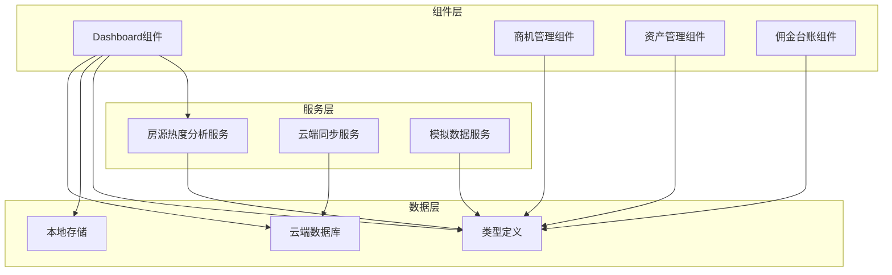

**图表来源**
- [components/Dashboard.tsx](file://components/Dashboard.tsx#L1-L316)
- [services/unitHeatAnalytics.ts](file://services/unitHeatAnalytics.ts#L1-L190)
- [services/pocketbase.ts](file://services/pocketbase.ts#L1-L274)

**章节来源**
- [components/Dashboard.tsx](file://components/Dashboard.tsx#L1-L316)
- [App.tsx](file://App.tsx#L1-L590)

## 核心组件
Dashboard组件是一个高度模块化的React组件，具备以下核心特性：

### 主要功能模块
1. **年度累计签约去化展示** - 显示年度签约面积和目标完成率
2. **商机总量监控** - 展示年度累计和月度新增商机数量
3. **带看与转化分析** - 分析年度带看总数和流失商机数量
4. **招商效能走势图** - 月度商机入库和带看趋势对比
5. **待租房源实时分布** - 展示空置房源的分布和热度
6. **商机来源渠道占比** - 分析不同渠道的商机贡献
7. **客户需求面积段占比** - 展示客户对不同面积需求的分布
8. **近期商机流失复盘** - 展示最近流失商机的详细信息

### 数据处理流程
组件采用React.memo和useMemo优化策略，通过计算属性缓存复杂的统计数据，确保在大数据量场景下的性能表现。

**章节来源**
- [components/Dashboard.tsx](file://components/Dashboard.tsx#L8-L16)
- [components/Dashboard.tsx](file://components/Dashboard.tsx#L21-L316)

## 架构概览
Dashboard组件采用分层架构设计，各模块职责清晰，耦合度低，便于维护和扩展。

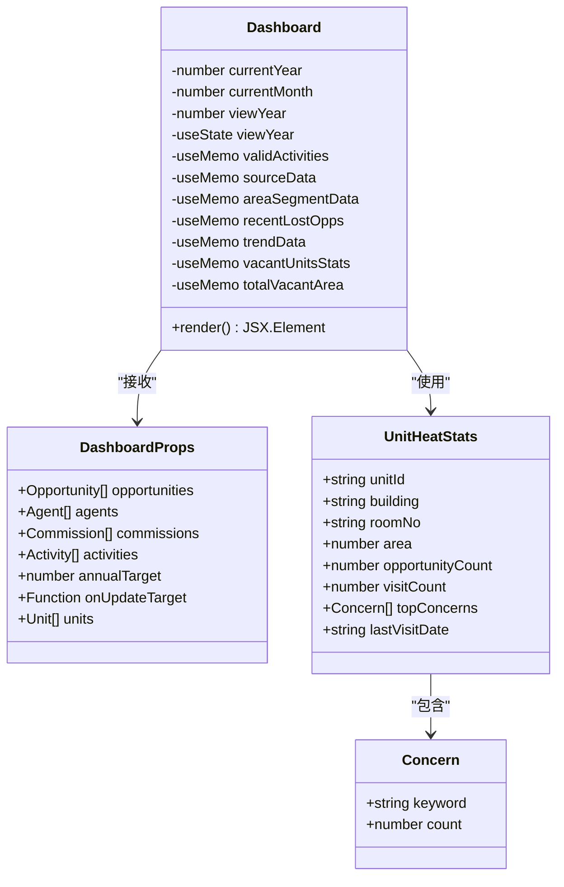

**图表来源**
- [components/Dashboard.tsx](file://components/Dashboard.tsx#L8-L16)
- [components/Dashboard.tsx](file://components/Dashboard.tsx#L21-L316)
- [types.ts](file://types.ts#L266-L276)

**章节来源**
- [components/Dashboard.tsx](file://components/Dashboard.tsx#L1-L316)
- [types.ts](file://types.ts#L1-L276)

## 详细组件分析

### Props接口定义
Dashboard组件的props接口提供了完整的数据输入和事件处理机制：

#### 必需属性
- **opportunities**: 商机数据数组，包含所有商机的完整信息
- **activities**: 活动数据数组，记录客户互动和带看行为
- **commissions**: 佣金数据数组，反映销售业绩和奖励情况
- **agents**: 代理/经纪人数据数组
- **units**: 房源数据数组，包含所有可租赁单元信息
- **annualTarget**: 年度目标数值，用于完成率计算

#### 事件处理
- **onUpdateTarget**: 目标值更新回调函数，签名 `(target: number) => void`

#### 类型定义参考
组件使用了完整的TypeScript类型系统，确保数据结构的正确性：

**章节来源**
- [components/Dashboard.tsx](file://components/Dashboard.tsx#L8-L16)
- [types.ts](file://types.ts#L184-L211)
- [types.ts](file://types.ts#L213-L224)
- [types.ts](file://types.ts#L226-L241)
- [types.ts](file://types.ts#L78-L88)

### 状态管理机制
Dashboard组件实现了智能的状态管理，主要包含以下状态：

#### 视图年份选择器
组件内置了viewYear状态，允许用户在当前年份、前一年和前两年之间切换查看数据：

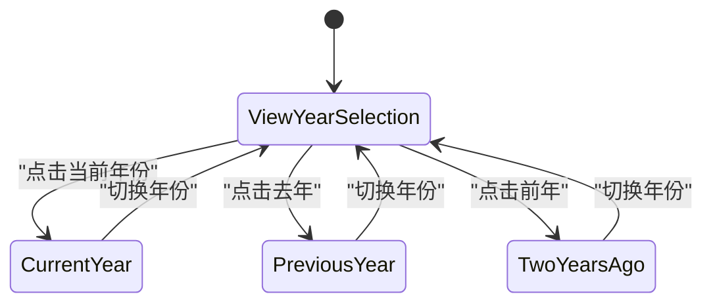

**图表来源**
- [components/Dashboard.tsx](file://components/Dashboard.tsx#L22-L24)
- [components/Dashboard.tsx](file://components/Dashboard.tsx#L113-L122)

#### 数据缓存策略
组件使用useMemo进行数据缓存，避免重复计算：

- **validActivities**: 过滤有效的活动记录，仅包含存在于商机中的活动
- **sourceData**: 商机来源统计，按渠道分类计算数量
- **areaSegmentData**: 客户需求面积段分析
- **recentLostOpps**: 最近流失商机列表
- **trendData**: 月度趋势数据
- **vacantUnitsStats**: 空置房源统计

**章节来源**
- [components/Dashboard.tsx](file://components/Dashboard.tsx#L27-L30)
- [components/Dashboard.tsx](file://components/Dashboard.tsx#L33-L38)
- [components/Dashboard.tsx](file://components/Dashboard.tsx#L41-L48)
- [components/Dashboard.tsx](file://components/Dashboard.tsx#L51-L60)
- [components/Dashboard.tsx](file://components/Dashboard.tsx#L63-L81)
- [components/Dashboard.tsx](file://components/Dashboard.tsx#L84-L90)

### 渲染逻辑和数据计算

#### 年度累计签约去化
组件计算年度签约面积并显示目标完成率：

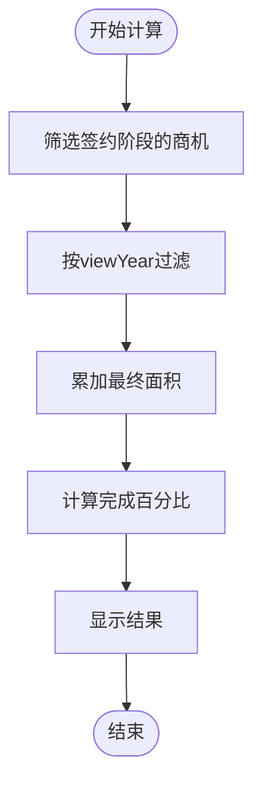

**图表来源**
- [components/Dashboard.tsx](file://components/Dashboard.tsx#L95-L97)
- [components/Dashboard.tsx](file://components/Dashboard.tsx#L136-L141)

#### 商机来源占比分析
组件分析不同渠道的商机贡献度：

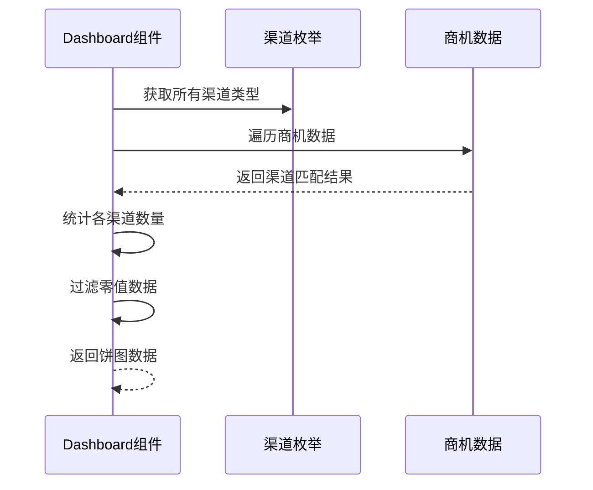

**图表来源**
- [components/Dashboard.tsx](file://components/Dashboard.tsx#L33-L38)
- [types.ts](file://types.ts#L24-L31)

#### 客户需求面积段分析
组件对客户面积需求进行分段统计：

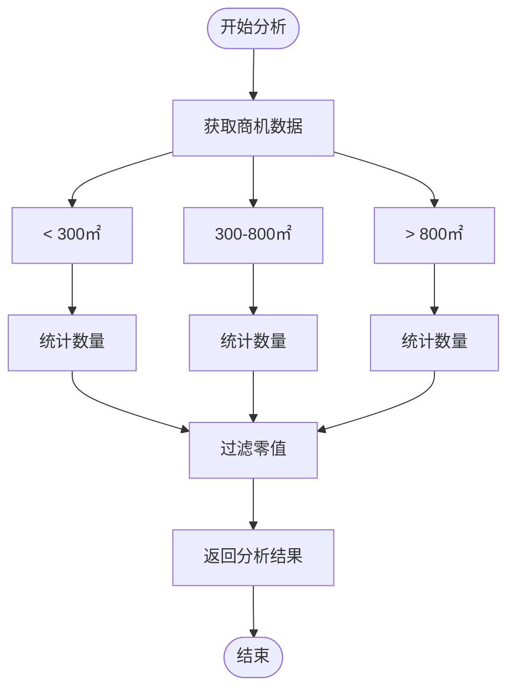

**图表来源**
- [components/Dashboard.tsx](file://components/Dashboard.tsx#L41-L48)

#### 近期商机流失复盘
组件展示最近的流失商机信息：

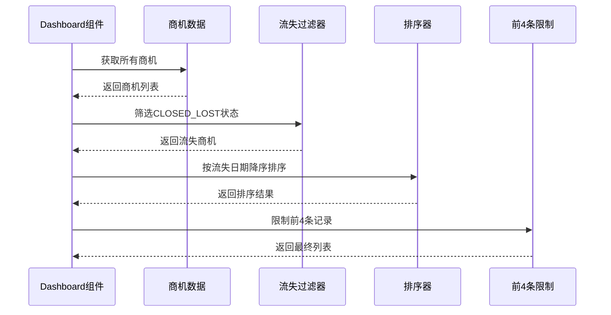

**图表来源**
- [components/Dashboard.tsx](file://components/Dashboard.tsx#L51-L60)

#### 招商效能走势图
组件生成月度趋势图表数据：

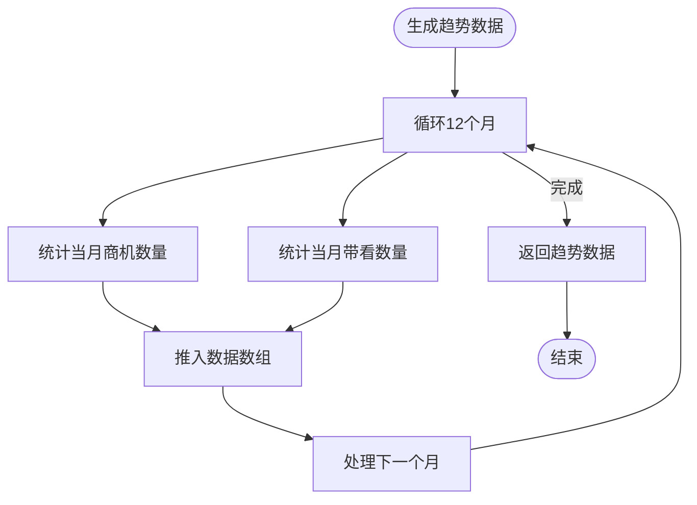

**图表来源**
- [components/Dashboard.tsx](file://components/Dashboard.tsx#L63-L81)

#### 待租房源实时分布
组件分析空置房源的热度和带看情况：

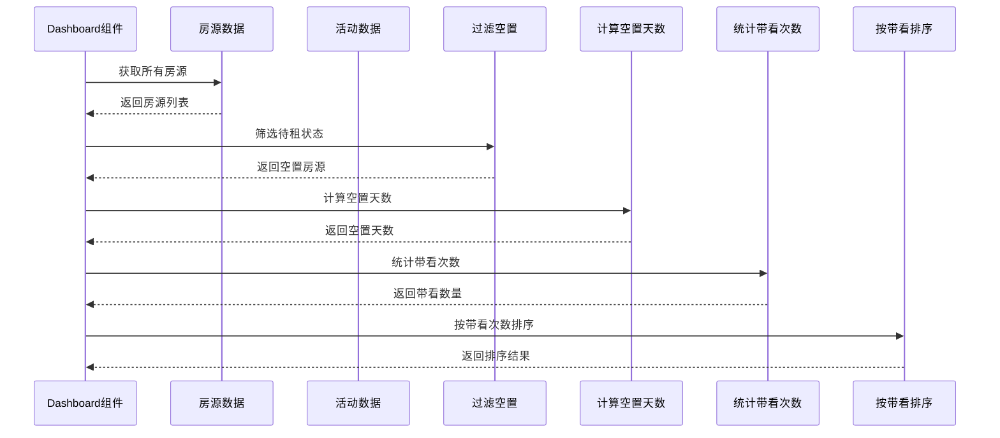

**图表来源**
- [components/Dashboard.tsx](file://components/Dashboard.tsx#L84-L90)

### 事件处理函数

#### onUpdateTarget函数
组件提供目标值更新功能，用于动态调整年度目标：

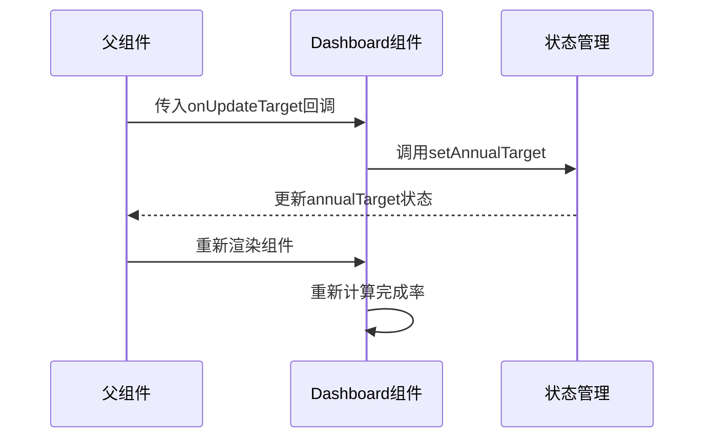

**图表来源**
- [components/Dashboard.tsx](file://components/Dashboard.tsx#L14)
- [App.tsx](file://App.tsx#L541)

**章节来源**
- [components/Dashboard.tsx](file://components/Dashboard.tsx#L14)
- [App.tsx](file://App.tsx#L541)

### 使用示例

#### 基本使用模式
```typescript
// 在父组件中使用Dashboard
function App() {
  const [opportunities, setOpportunities] = useState<Opportunity[]>([]);
  const [activities, setActivities] = useState<Activity[]>([]);
  const [commissions, setCommissions] = useState<Commission[]>([]);
  const [units, setUnits] = useState<Unit[]>([]);
  const [annualTarget, setAnnualTarget] = useState<number>(30000);

  return (
    <Dashboard
      opportunities={opportunities}
      activities={activities}
      commissions={commissions}
      agents={agents}
      units={units}
      annualTarget={annualTarget}
      onUpdateTarget={setAnnualTarget}
    />
  );
}
```

#### 处理目标更新
```typescript
// 当用户修改目标值时的处理
const handleTargetChange = (newTarget: number) => {
  // 更新本地状态
  setAnnualTarget(newTarget);
  
  // 可选：同步到云端
  syncTargetToCloud(newTarget);
  
  // 可选：发送通知
  showNotification(`年度目标已更新为 ${newTarget} m²`);
};
```

**章节来源**
- [App.tsx](file://App.tsx#L541)
- [App.tsx](file://App.tsx#L236-L239)

## 依赖关系分析

### 内部依赖关系
Dashboard组件依赖于多个内部模块和服务：

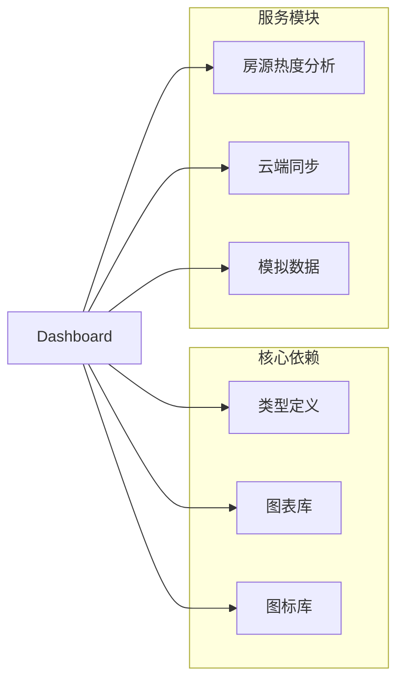

**图表来源**
- [components/Dashboard.tsx](file://components/Dashboard.tsx#L2-L6)
- [services/unitHeatAnalytics.ts](file://services/unitHeatAnalytics.ts#L1-L190)
- [services/pocketbase.ts](file://services/pocketbase.ts#L1-L274)

### 外部依赖关系
组件使用了现代化的前端技术栈：

- **React 18**: 函数式组件和Hooks API
- **TypeScript**: 强类型系统确保代码质量
- **Recharts**: 专业图表库，支持响应式设计
- **Lucide React**: 现代化图标库
- **Tailwind CSS**: 实用优先的CSS框架

**章节来源**
- [components/Dashboard.tsx](file://components/Dashboard.tsx#L1-L316)
- [types.ts](file://types.ts#L1-L276)

## 性能考虑
Dashboard组件在设计时充分考虑了性能优化：

### 计算优化
- **useMemo缓存**: 对所有计算属性使用useMemo进行缓存
- **条件渲染**: 根据数据存在性进行条件渲染
- **虚拟滚动**: 对长列表使用虚拟滚动优化

### 内存管理
- **垃圾回收**: 及时清理不再使用的数据引用
- **状态分离**: 将大型数据集与UI状态分离

### 网络优化
- **数据懒加载**: 按需加载数据，减少初始负载
- **缓存策略**: 利用浏览器缓存和组件缓存

## 故障排除指南

### 常见问题
1. **数据不显示**: 检查props传入的数据格式是否正确
2. **图表渲染异常**: 确认Recharts库版本兼容性
3. **性能问题**: 检查数据量大小和useMemo使用情况

### 调试技巧
- 使用React DevTools检查组件状态
- 在控制台输出关键数据结构
- 检查网络请求和API响应

### 错误处理
组件包含基本的错误处理机制：
- 空数据保护
- 类型验证
- 边界条件检查

**章节来源**
- [components/Dashboard.tsx](file://components/Dashboard.tsx#L1-L316)

## 结论
Dashboard仪表板组件是一个功能完整、性能优化的React组件，提供了全面的园区运营数据分析能力。组件采用现代前端技术栈，具备良好的可维护性和扩展性。通过合理的状态管理和数据缓存策略，组件能够在大数据量场景下保持流畅的用户体验。

组件的设计体现了以下最佳实践：
- 清晰的职责分离
- 强类型的安全保障
- 性能友好的数据处理
- 用户友好的交互设计
- 完善的错误处理机制