# Opportunities商机管理组件API

<cite>
**本文档引用的文件**
- [components/Opportunities.tsx](file://components/Opportunities.tsx)
- [types.ts](file://types.ts)
- [services/pocketbase.ts](file://services/pocketbase.ts)
- [services/mockData.ts](file://services/mockData.ts)
- [App.tsx](file://App.tsx)
</cite>

## 目录
1. [简介](#简介)
2. [项目结构](#项目结构)
3. [核心组件](#核心组件)
4. [架构概览](#架构概览)
5. [详细组件分析](#详细组件分析)
6. [依赖关系分析](#依赖关系分析)
7. [性能考虑](#性能考虑)
8. [故障排除指南](#故障排除指南)
9. [结论](#结论)

## 简介

Opportunities商机管理组件是上海商机及渠道管理系统的核心模块，负责管理企业的商业机会生命周期。该组件提供了完整的商机数据管理功能，包括商机的创建、查询、更新、删除操作，以及商机状态管理、活动记录添加、商机跟进等功能。组件采用现代化的React Hooks架构，实现了高性能的数据绑定和实时状态同步。

## 项目结构

系统采用模块化的项目结构，主要文件组织如下：

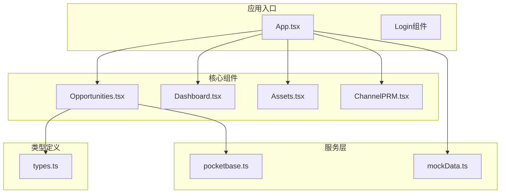

**图表来源**
- [App.tsx](file://App.tsx#L179-L589)
- [components/Opportunities.tsx](file://components/Opportunities.tsx#L1-L50)

**章节来源**
- [App.tsx](file://App.tsx#L1-L100)
- [components/Opportunities.tsx](file://components/Opportunities.tsx#L1-L50)

## 核心组件

### Props接口定义

Opportunities组件通过严格的Props接口实现类型安全的数据传递：

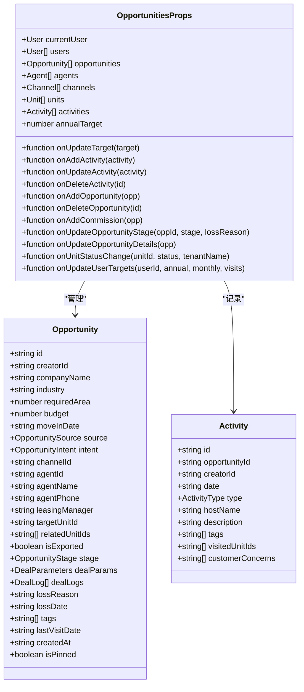

**图表来源**
- [components/Opportunities.tsx](file://components/Opportunities.tsx#L6-L26)
- [types.ts](file://types.ts#L184-L224)

### 主要功能特性

组件实现了以下核心功能：

1. **商机生命周期管理**：从线索到签约的完整流程管理
2. **状态转换控制**：支持商机阶段的有序转换
3. **活动记录系统**：完整的业务跟进轨迹记录
4. **数据绑定机制**：双向数据绑定和实时状态同步
5. **表单验证系统**：多层次的表单验证和错误处理
6. **权限控制机制**：基于角色的访问控制

**章节来源**
- [components/Opportunities.tsx](file://components/Opportunities.tsx#L28-L32)
- [types.ts](file://types.ts#L10-L65)

## 架构概览

系统采用分层架构设计，确保各组件间的松耦合和高内聚：

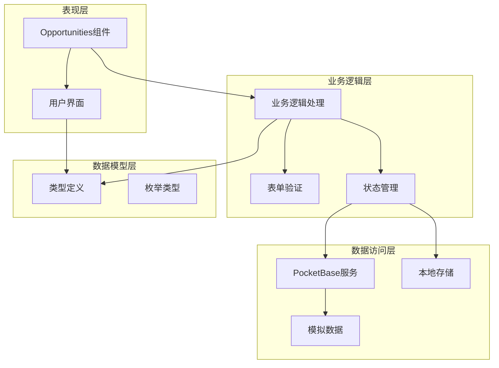

**图表来源**
- [App.tsx](file://App.tsx#L179-L589)
- [services/pocketbase.ts](file://services/pocketbase.ts#L1-L274)
- [types.ts](file://types.ts#L1-L276)

## 详细组件分析

### 商机数据管理API

#### 创建新商机

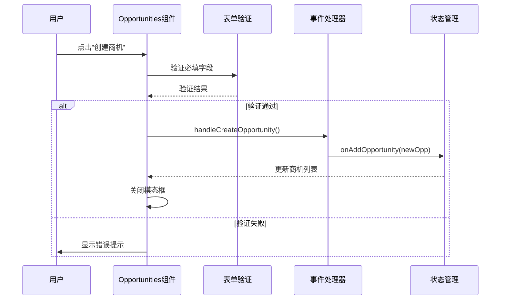

**图表来源**
- [components/Opportunities.tsx](file://components/Opportunities.tsx#L73-L100)

#### 更新商机状态

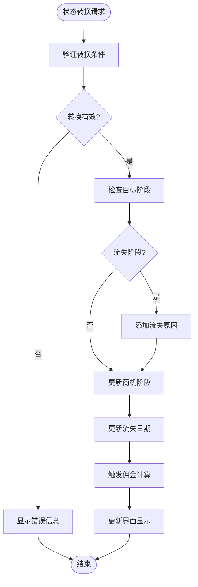

**图表来源**
- [components/Opportunities.tsx](file://components/Opportunities.tsx#L122-L128)
- [App.tsx](file://App.tsx#L446-L448)

#### 删除商机

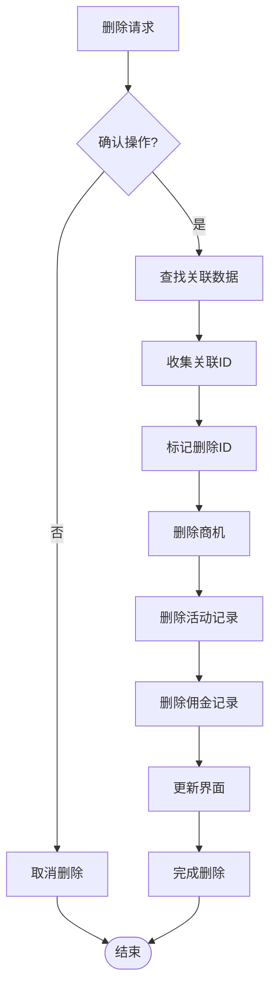

**图表来源**
- [components/Opportunities.tsx](file://components/Opportunities.tsx#L130-L136)
- [App.tsx](file://App.tsx#L454-L464)

### 活动记录管理API

#### 添加活动记录

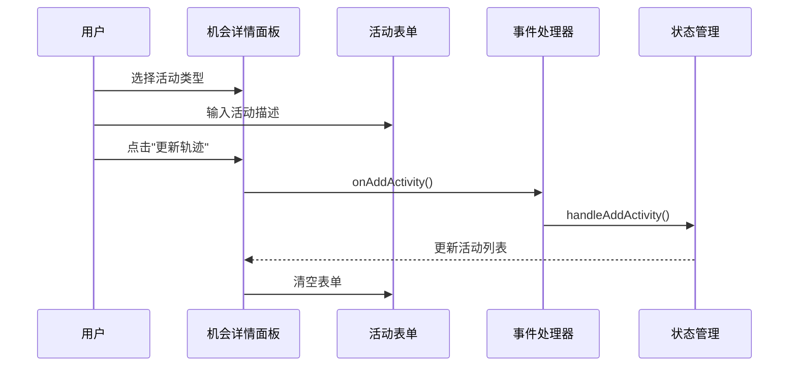

**图表来源**
- [components/Opportunities.tsx](file://components/Opportunities.tsx#L488-L494)

#### 活动类型枚举

组件支持多种活动类型的记录：

| 活动类型 | 描述 | 使用场景 |
|---------|------|----------|
| VISIT | 带看 | 实地考察、现场沟通 |
| CALL | 电访 | 电话沟通、情况了解 |
| QUOTATION | 报价 | 价格谈判、方案说明 |
| NEGOTIATION | 谈判 | 合同条款讨论 |
| SIGNING | 签约 | 合同签署、最终确认 |

**章节来源**
- [components/Opportunities.tsx](file://components/Opportunities.tsx#L47-L53)
- [types.ts](file://types.ts#L47-L53)

### 商机状态管理API

#### 阶段转换流程

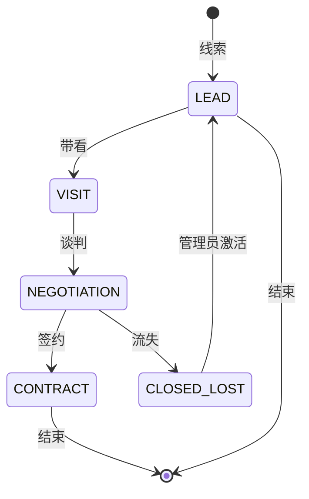

**图表来源**
- [types.ts](file://types.ts#L10-L16)

#### 状态转换事件处理

组件提供了完整的状态转换事件处理机制：

| 事件处理函数 | 功能描述 | 触发条件 |
|-------------|----------|----------|
| handleCreateOpportunity | 创建新商机 | 用户点击创建按钮 |
| handleSignConfirm | 确认成交签约 | 用户完成签约信息填写 |
| handleConfirmLost | 标记商机流失 | 用户填写流失原因 |
| handleReactivateAndTransfer | 重新激活并流转 | 管理员操作流失商机 |
| handleTogglePin | 切换置顶状态 | 用户点击置顶按钮 |

**章节来源**
- [components/Opportunities.tsx](file://components/Opportunities.tsx#L73-L164)

### 数据绑定和表单验证机制

#### 实时数据绑定

组件采用React Hooks实现高效的数据绑定：

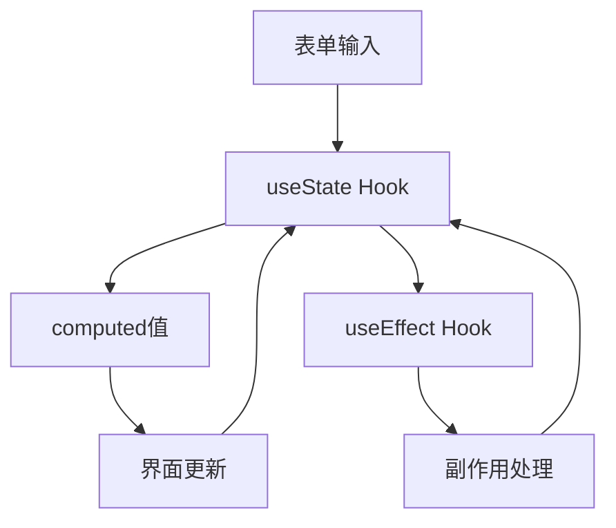

**图表来源**
- [components/Opportunities.tsx](file://components/Opportunities.tsx#L33-L50)

#### 表单验证策略

组件实现了多层次的表单验证：

1. **前端即时验证**：用户输入时实时验证
2. **必填字段检查**：关键字段的必填验证
3. **业务规则验证**：符合业务逻辑的验证
4. **状态一致性验证**：确保数据状态的一致性

**章节来源**
- [components/Opportunities.tsx](file://components/Opportunities.tsx#L73-L100)

### 组件使用示例

#### 创建新商机

```typescript
// 在父组件中传递必要的Props
<Opportunities 
  currentUser={currentUser}
  users={users}
  opportunities={opportunities}
  channels={channels}
  units={units}
  activities={activities}
  annualTarget={annualTarget}
  onUpdateTarget={setAnnualTarget}
  onAddActivity={handleAddActivity}
  onUpdateActivity={handleUpdateActivity}
  onDeleteActivity={handleDeleteActivity}
  onAddOpportunity={handleAddOpportunity}
  onDeleteOpportunity={handleDeleteOpportunity}
  onAddCommission={handleAddCommission}
  onUpdateOpportunityStage={handleUpdateOppStage}
  onUpdateOpportunityDetails={handleUpdateOppDetails}
  onUnitStatusChange={handleUnitStatusChange}
/>
```

#### 更新商机状态

```typescript
// 更新商机状态为"签约"
handleUpdateOppStage(oppId, OpportunityStage.CONTRACT, lossReason)

// 更新商机详情
handleUpdateOppDetails({
  ...existingOpp,
  dealParams: newDealParams,
  stage: OpportunityStage.CONTRACT
})
```

#### 添加活动记录

```typescript
// 添加带看活动
onAddActivity({
  id: `ACT-${Date.now()}`,
  opportunityId: oppId,
  creatorId: currentUserId,
  date: new Date().toISOString().slice(0, 10),
  type: ActivityType.VISIT,
  hostName: currentUserName,
  description: "实地考察了客户公司"
})
```

**章节来源**
- [App.tsx](file://App.tsx#L557-L563)
- [App.tsx](file://App.tsx#L446-L473)

### 后端数据同步API

#### PocketBase集成

组件通过PocketBase实现云端数据同步：

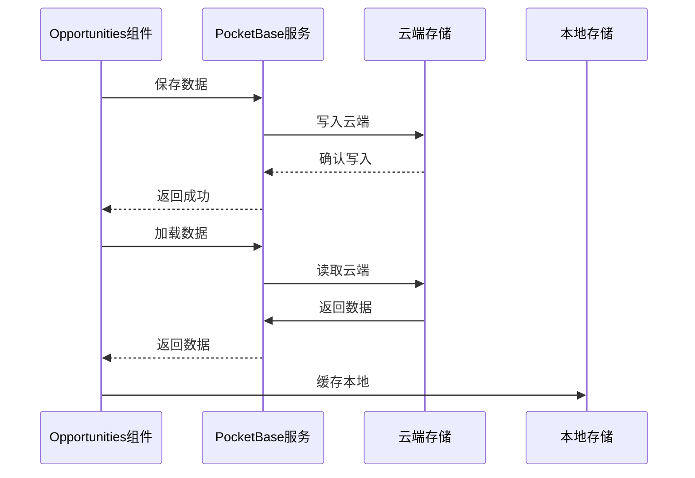

**图表来源**
- [services/pocketbase.ts](file://services/pocketbase.ts#L178-L273)

#### 错误处理机制

组件实现了完善的错误处理机制：

1. **网络错误处理**：超时重试机制
2. **并发冲突处理**：乐观锁机制
3. **数据一致性保证**：删除标记机制
4. **用户反馈机制**：友好的错误提示

**章节来源**
- [services/pocketbase.ts](file://services/pocketbase.ts#L47-L87)
- [App.tsx](file://App.tsx#L328-L375)

## 依赖关系分析

### 组件间依赖关系

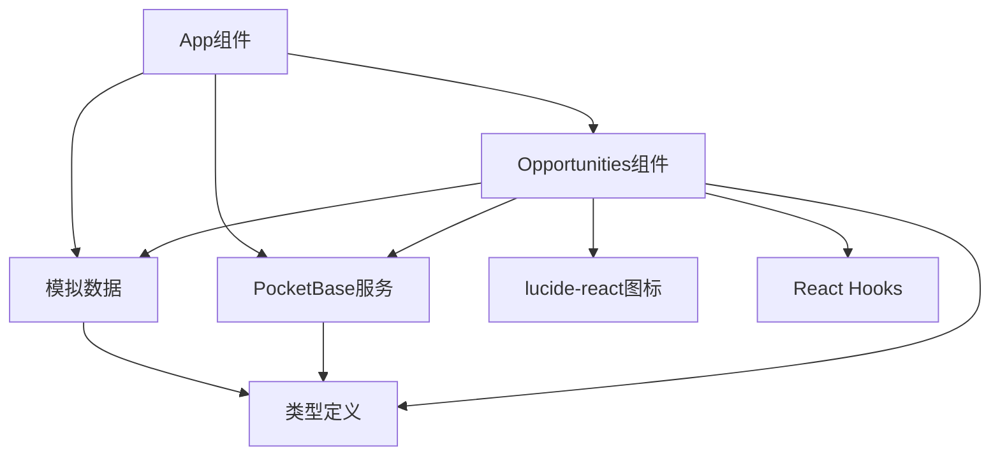

**图表来源**
- [components/Opportunities.tsx](file://components/Opportunities.tsx#L1-L5)
- [App.tsx](file://App.tsx#L1-L15)

### 外部依赖分析

组件依赖的主要外部库：

| 依赖库 | 版本 | 用途 | 重要性 |
|--------|------|------|--------|
| lucide-react | 最新版 | 图标库 | 高 |
| react | 18.x | 核心框架 | 高 |
| pocketbase | 0.20.x | 云端存储 | 高 |
| tailwindcss | 3.x | 样式框架 | 中 |

**章节来源**
- [package.json](file://package.json#L1-L50)

## 性能考虑

### 优化策略

1. **虚拟滚动**：大量商机数据的高效渲染
2. **记忆化计算**：useMemo优化昂贵的计算
3. **懒加载**：按需加载大型组件
4. **防抖机制**：减少不必要的状态更新

### 内存管理

组件采用了智能的内存管理策略：

- **状态清理**：及时清理不再使用的状态
- **事件解绑**：组件卸载时清理事件监听
- **缓存策略**：合理使用缓存避免重复计算

## 故障排除指南

### 常见问题及解决方案

#### 数据不同步问题

**症状**：界面显示与实际数据不一致

**解决方案**：
1. 检查网络连接状态
2. 重新加载页面
3. 手动触发数据同步

#### 表单验证错误

**症状**：无法提交表单或出现验证错误

**解决方案**：
1. 检查必填字段是否完整
2. 确认数据格式正确
3. 查看具体的错误提示

#### 权限不足问题

**症状**：某些操作按钮不可用

**解决方案**：
1. 检查用户角色权限
2. 联系管理员提升权限
3. 确认当前用户的登录状态

**章节来源**
- [components/Opportunities.tsx](file://components/Opportunities.tsx#L73-L100)
- [App.tsx](file://App.tsx#L481-L489)

## 结论

Opportunities商机管理组件是一个功能完整、架构清晰的商业机会管理解决方案。组件通过严格的类型定义、完善的事件处理机制、高效的性能优化和可靠的错误处理，为企业提供了强大的商机管理能力。

组件的主要优势包括：

1. **类型安全**：完整的TypeScript类型定义确保开发安全性
2. **用户体验**：直观的界面设计和流畅的交互体验
3. **数据一致性**：完善的同步机制保证数据完整性
4. **扩展性强**：模块化的架构便于功能扩展和维护

该组件为上海商机及渠道管理系统提供了坚实的基础，能够满足现代企业对商机管理的各种需求。