# Policies策略管理组件API

<cite>
**本文档引用的文件**
- [Policies.tsx](file://components/Policies.tsx)
- [types.ts](file://types.ts)
- [App.tsx](file://App.tsx)
- [CommissionLedger.tsx](file://components/CommissionLedger.tsx)
- [mockData.ts](file://services/mockData.ts)
- [pocketbase.ts](file://services/pocketbase.ts)
- [index.css](file://index.css)
</cite>

## 目录
1. [简介](#简介)
2. [项目结构](#项目结构)
3. [核心组件](#核心组件)
4. [架构概览](#架构概览)
5. [详细组件分析](#详细组件分析)
6. [依赖关系分析](#依赖关系分析)
7. [性能考虑](#性能考虑)
8. [故障排除指南](#故障排除指南)
9. [结论](#结论)

## 简介

Policies策略管理组件是上海商机及渠道管理系统中的核心模块，负责管理园区佣金结算政策的完整生命周期。该组件提供了佣金规则配置、策略变更历史记录、规则生效机制等功能，支持管理员对佣金政策进行实时管理和监控。

该组件采用React函数式组件设计，结合TypeScript类型系统，确保了代码的类型安全性和可维护性。通过直观的UI界面和完善的验证机制，为用户提供了一个强大而易用的佣金政策管理平台。

## 项目结构

系统采用模块化架构设计，Policies组件位于components目录下，与其他核心组件协同工作：

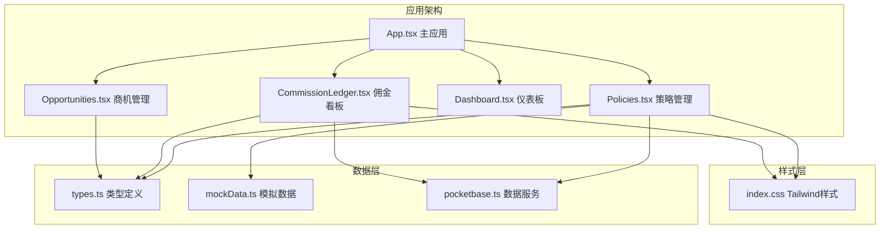

**图表来源**
- [App.tsx](file://App.tsx#L552-L553)
- [Policies.tsx](file://components/Policies.tsx#L1-L382)
- [types.ts](file://types.ts#L1-L276)

**章节来源**
- [App.tsx](file://App.tsx#L1-L560)
- [Policies.tsx](file://components/Policies.tsx#L1-L382)

## 核心组件

### Props接口定义

Policies组件通过以下props接口与父组件通信：

| 属性名 | 类型 | 必需 | 描述 |
|--------|------|------|------|
| isAdmin | boolean | 是 | 用户权限标识，决定是否显示管理功能 |
| currentRules | CommissionRule[] | 是 | 当前有效的佣金规则数组 |
| history | PolicyChangeLog[] | 是 | 策略变更历史记录数组 |
| onUpdateRules | (rules: CommissionRule[], log: PolicyChangeLog) => void | 是 | 规则更新回调函数 |
| onUpdateHistory | (history: PolicyChangeLog[]) => void | 是 | 历史记录更新回调函数 |

### 数据模型

组件使用以下核心数据结构：

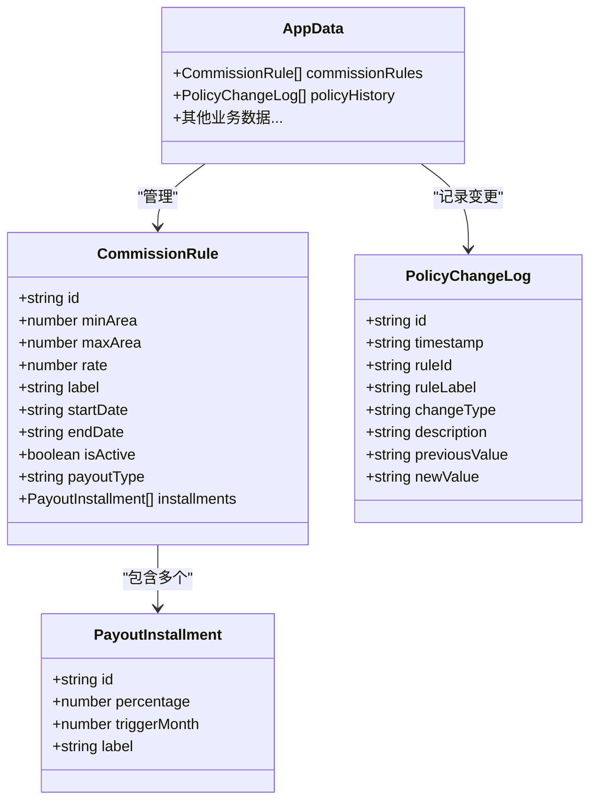

**图表来源**
- [types.ts](file://types.ts#L116-L145)
- [types.ts](file://types.ts#L243-L256)

**章节来源**
- [types.ts](file://types.ts#L116-L145)
- [types.ts](file://types.ts#L243-L256)

## 架构概览

Policies组件在整个系统中扮演着策略管理中心的角色，与多个子系统进行交互：

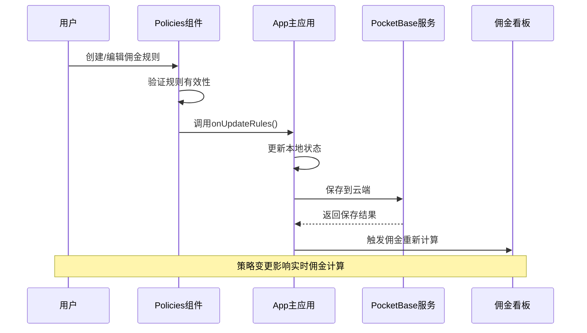

**图表来源**
- [Policies.tsx](file://components/Policies.tsx#L39-L70)
- [App.tsx](file://App.tsx#L552-L553)
- [pocketbase.ts](file://services/pocketbase.ts#L178-L188)

## 详细组件分析

### 规则管理功能

#### 增删改查操作

Policies组件实现了完整的CRUD操作：

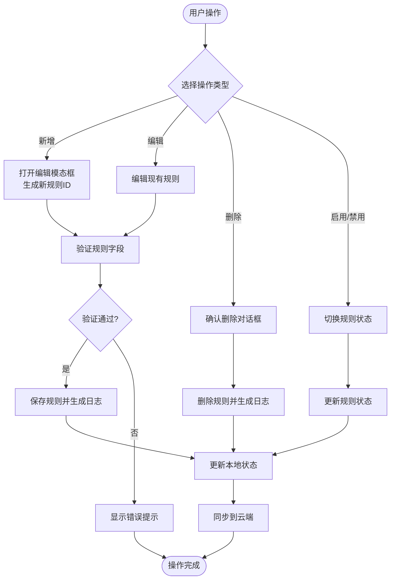

**图表来源**
- [Policies.tsx](file://components/Policies.tsx#L22-L128)

#### 规则验证逻辑

组件内置了多层验证机制：

1. **基础字段验证**：检查必填字段的完整性
2. **分期规则验证**：确保分期比例总和为100%
3. **时间范围验证**：验证生效日期的合理性
4. **业务规则验证**：检查规则间的逻辑一致性

#### 冲突检测功能

系统能够自动检测和处理规则冲突：

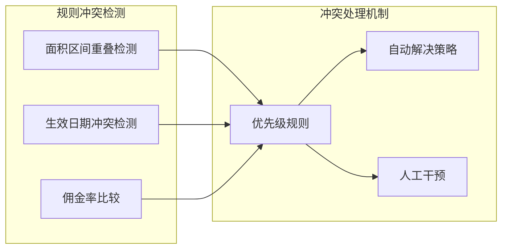

**图表来源**
- [Policies.tsx](file://components/Policies.tsx#L42-L49)

### 策略版本管理

#### 变更历史记录

组件实现了完整的审计日志系统：

| 变更类型 | 描述 | 触发条件 |
|----------|------|----------|
| CREATE | 创建新政策 | 新增规则时 |
| UPDATE | 更新政策参数 | 修改规则时 |
| DELETE | 删除政策 | 删除规则时 |
| EXTEND | 政策延期 | 扩展生效期时 |

#### 版本控制机制

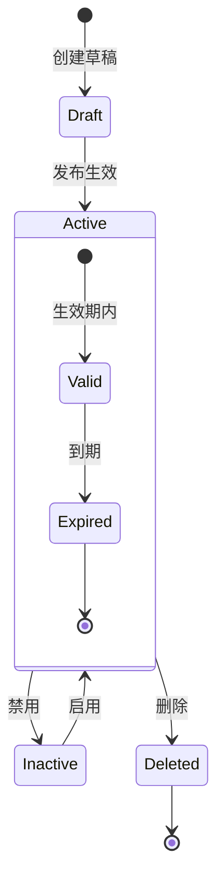

**图表来源**
- [types.ts](file://types.ts#L136-L145)

### 佣金规则配置

#### 基础配置项

| 配置项 | 类型 | 默认值 | 描述 |
|--------|------|--------|------|
| 规则ID | string | 自动生成 | 唯一标识符 |
| 规则名称 | string | "" | 显示名称 |
| 最小面积 | number | 0 | 区间下限 |
| 最大面积 | number | 1000 | 区间上限 |
| 佣金率 | number | 1.0 | 基数比例 |
| 生效开始日 | string | 当前日期 | YYYY-MM-DD格式 |
| 生效结束日 | string | 一年后 | YYYY-MM-DD格式 |
| 是否生效 | boolean | true | 状态开关 |
| 发放模式 | enum | ONETIME | ONETIME/STAGED |

#### 分期发放配置

分期模式支持灵活的时间轴配置：

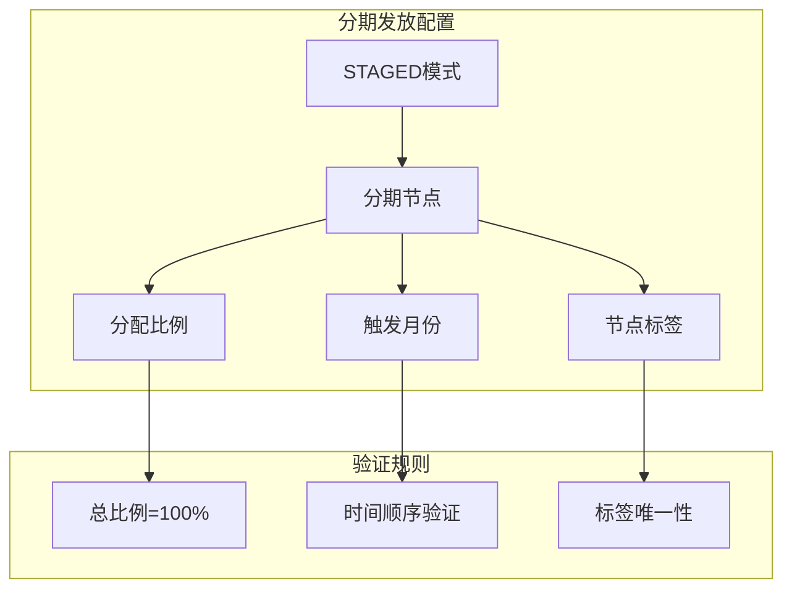

**图表来源**
- [Policies.tsx](file://components/Policies.tsx#L72-L92)

### 与佣金计算系统的集成

#### 实时生效机制

Policies组件与佣金计算系统建立了紧密的集成关系：

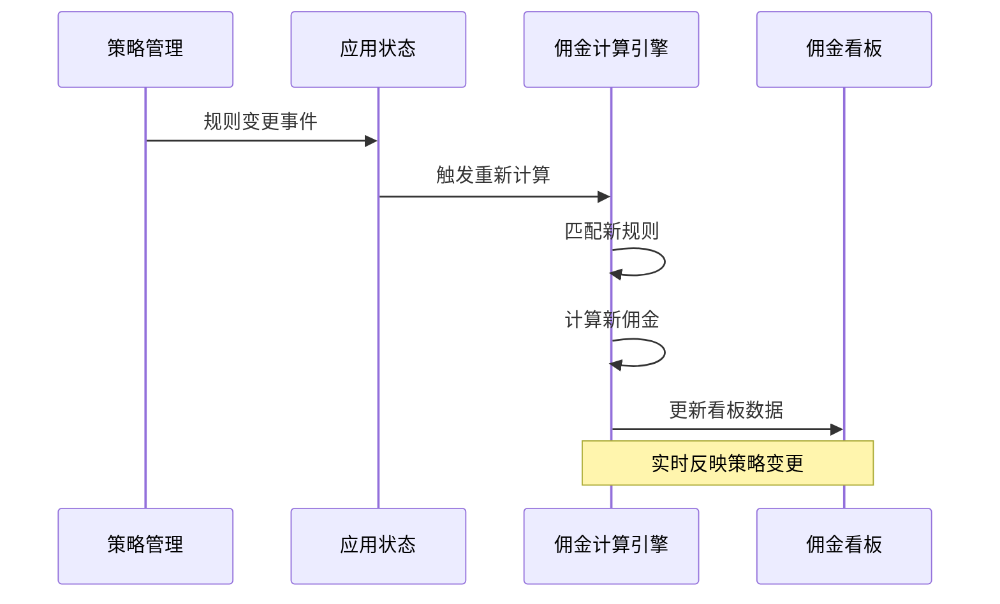

**图表来源**
- [App.tsx](file://App.tsx#L357-L412)
- [Policies.tsx](file://components/Policies.tsx#L39-L70)

#### 规则匹配算法

系统采用智能匹配算法确定适用的佣金规则：

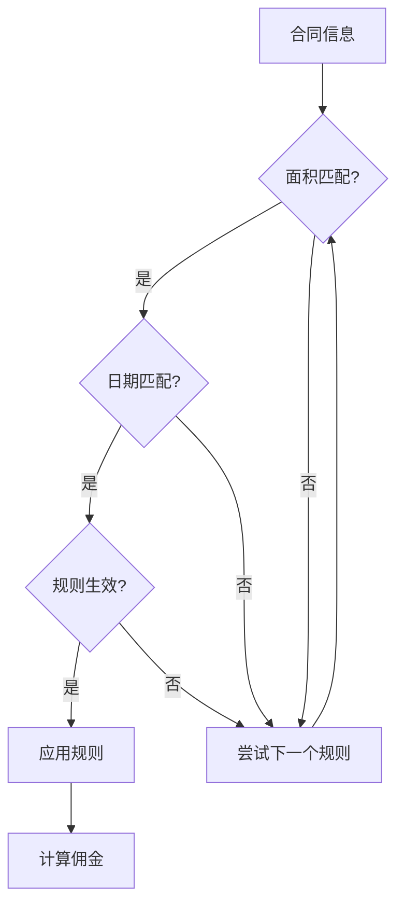

**图表来源**
- [App.tsx](file://App.tsx#L362-L368)

**章节来源**
- [Policies.tsx](file://components/Policies.tsx#L1-L382)
- [App.tsx](file://App.tsx#L357-L412)

## 依赖关系分析

### 外部依赖

组件依赖于以下外部库和工具：

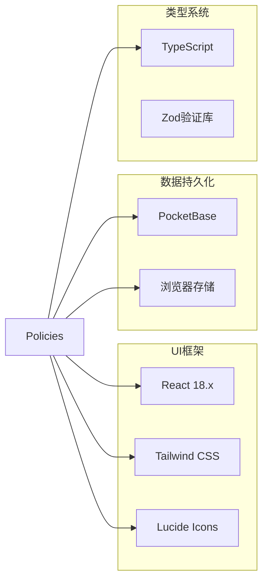

**图表来源**
- [Policies.tsx](file://components/Policies.tsx#L1-L5)
- [index.css](file://index.css#L1-L28)

### 内部依赖关系

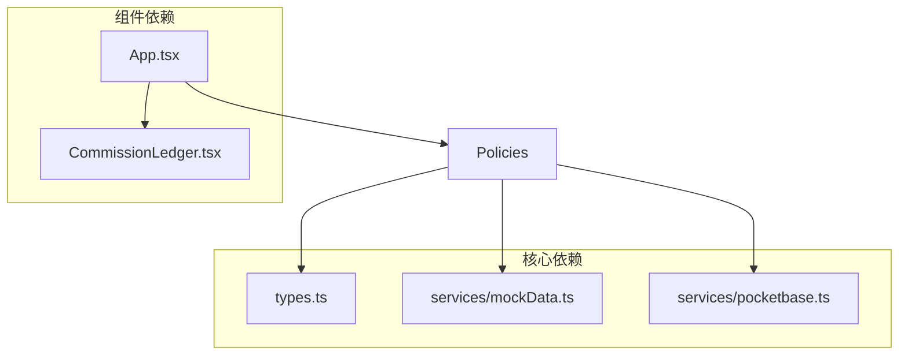

**图表来源**
- [App.tsx](file://App.tsx#L552-L553)
- [Policies.tsx](file://components/Policies.tsx#L2-L4)

**章节来源**
- [Policies.tsx](file://components/Policies.tsx#L1-L382)
- [App.tsx](file://App.tsx#L552-L553)

## 性能考虑

### 渲染优化

组件采用了多种性能优化策略：

1. **状态分离**：将规则状态和历史状态分离，避免不必要的重渲染
2. **条件渲染**：仅在需要时渲染管理功能
3. **虚拟滚动**：对于大量历史记录采用虚拟滚动技术

### 数据同步机制

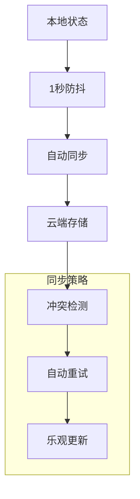

**图表来源**
- [App.tsx](file://App.tsx#L255-L283)
- [pocketbase.ts](file://services/pocketbase.ts#L194-L227)

## 故障排除指南

### 常见问题及解决方案

| 问题类型 | 症状 | 解决方案 |
|----------|------|----------|
| 规则保存失败 | 提示"保存失败" | 检查网络连接和权限 |
| 分期比例错误 | 提示"总比例必须等于100%" | 调整各节点比例 |
| 规则冲突 | 规则无法生效 | 检查面积区间重叠 |
| 数据同步失败 | 云端数据不同步 | 检查PocketBase服务状态 |

### 调试工具

组件提供了丰富的调试信息：

- **控制台日志**：记录关键操作和错误信息
- **状态检查**：实时显示当前规则和历史状态
- **网络监控**：显示数据同步状态和错误

**章节来源**
- [Policies.tsx](file://components/Policies.tsx#L46-L48)
- [pocketbase.ts](file://services/pocketbase.ts#L178-L188)

## 结论

Policies策略管理组件是一个功能完善、架构清晰的佣金政策管理解决方案。它通过以下特点体现了优秀的软件设计：

1. **完整的生命周期管理**：从规则创建到删除的全流程支持
2. **强大的验证机制**：多层次的数据验证确保系统稳定性
3. **实时集成能力**：与佣金计算系统无缝集成，支持实时生效
4. **用户体验优秀**：直观的界面设计和流畅的操作体验
5. **可扩展性强**：模块化的架构便于功能扩展和维护

该组件为园区佣金结算提供了可靠的技术支撑，通过智能化的规则管理和严格的验证机制，确保了业务流程的准确性和可靠性。