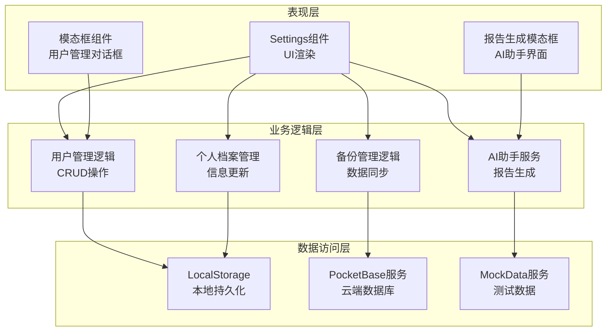
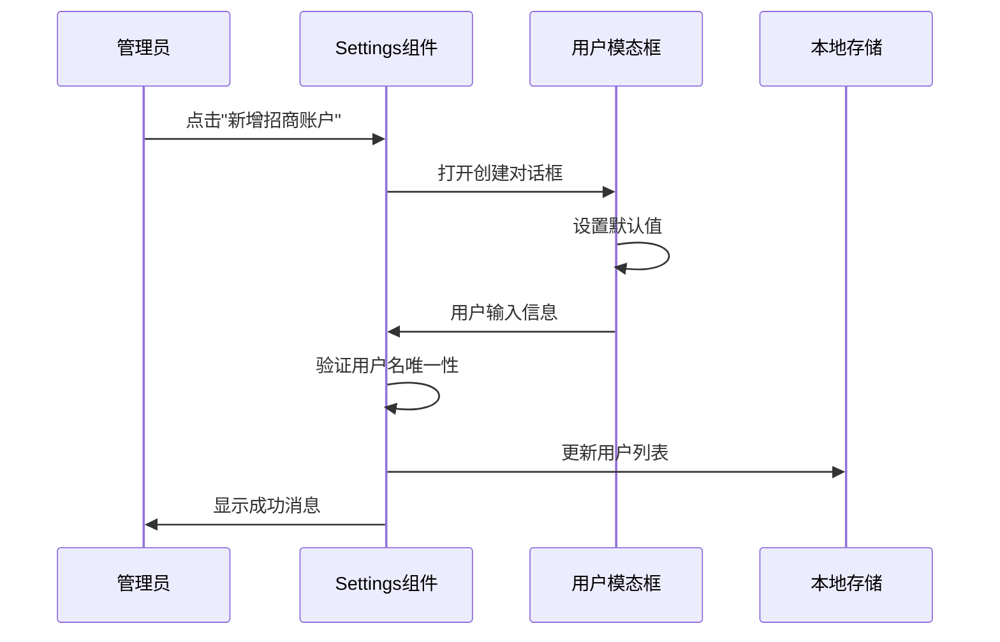
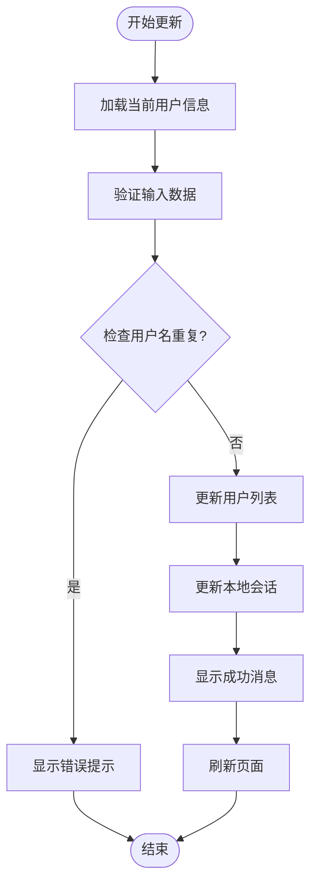
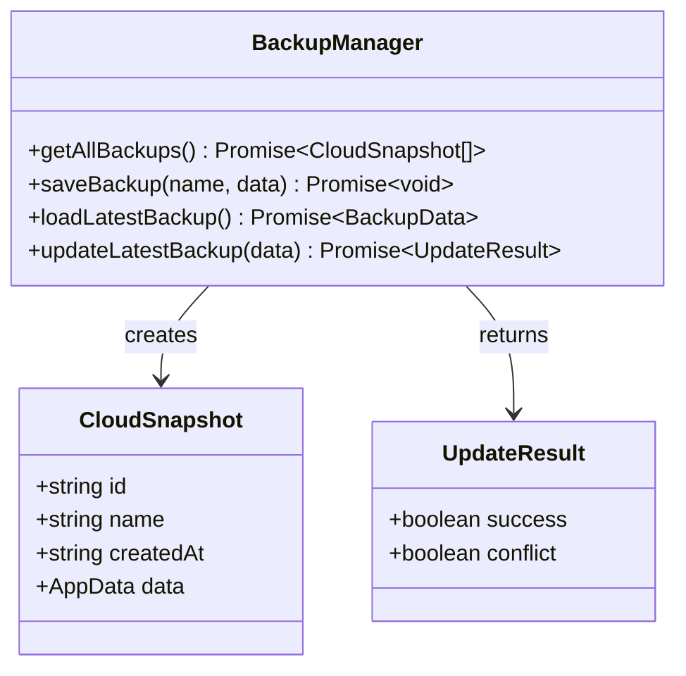
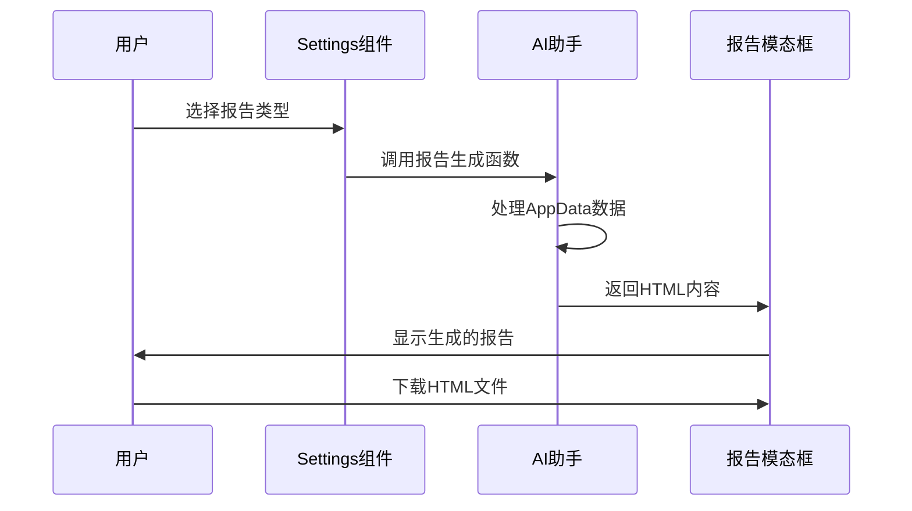
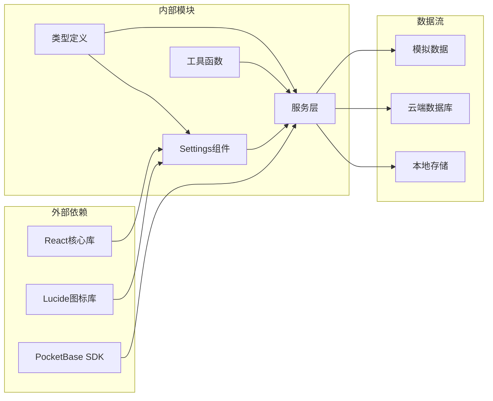

# Settings系统设置组件API

<cite>
**本文档引用的文件**
- [components/Settings.tsx](file://components/Settings.tsx)
- [services/pocketbase.ts](file://services/pocketbase.ts)
- [types.ts](file://types.ts)
- [App.tsx](file://App.tsx)
- [services/mockData.ts](file://services/mockData.ts)
- [pb_migrations/1770189507_created_park_leasing_backups.js](file://pb_migrations/1770189507_created_park_leasing_backups.js)
- [.env.local](file://.env.local)
</cite>

## 目录
1. [简介](#简介)
2. [项目结构](#项目结构)
3. [核心组件](#核心组件)
4. [架构概览](#架构概览)
5. [详细组件分析](#详细组件分析)
6. [依赖关系分析](#依赖关系分析)
7. [性能考虑](#性能考虑)
8. [故障排除指南](#故障排除指南)
9. [结论](#结论)

## 简介

Settings系统设置组件是上海商机及渠道管理系统的核心管理界面，提供了完整的用户权限管理、系统配置维护和数据备份恢复功能。该组件采用React函数式组件设计，集成了PocketBase数据库服务和AI智能助手功能，为招商经理提供了便捷的系统管理工具。

该组件支持管理员级别的用户账户管理、个人档案维护、云端数据同步、AI报告生成等核心功能，确保系统数据的一致性和安全性。

## 项目结构

Settings组件位于components目录下，与应用的其他核心模块协同工作：

```mermaid
graph TB
subgraph "应用结构"
App[App.tsx<br/>主应用容器]
Settings[Settings.tsx<br/>设置组件]
Services[Services目录<br/>服务层]
Types[Types.ts<br/>类型定义]
end
subgraph "服务层"
PocketBase[pocketbase.ts<br/>数据库服务]
MockData[mockData.ts<br/>模拟数据]
end
subgraph "数据存储"
LocalStorage[LocalStorage<br/>本地存储]
PocketBaseDB[(PocketBase)<br/>云端数据库]
Migration[Migration<br/>数据库迁移]
end
App --> Settings
Settings --> Services
Services --> PocketBase
Services --> MockData
Settings --> LocalStorage
PocketBase --> PocketBaseDB
PocketBaseDB --> Migration
Types --> Settings
```

**图表来源**
- [components/Settings.tsx](file://components/Settings.tsx#L1-L409)
- [services/pocketbase.ts](file://services/pocketbase.ts#L1-L274)
- [types.ts](file://types.ts#L1-L276)

**章节来源**
- [components/Settings.tsx](file://components/Settings.tsx#L1-L409)
- [services/pocketbase.ts](file://services/pocketbase.ts#L1-L274)
- [types.ts](file://types.ts#L1-L276)

## 核心组件

Settings组件是一个功能完整的React函数式组件，具备以下核心特性：

### 主要功能模块

1. **用户权限管理**
   - 管理员账户创建和编辑
   - 用户角色权限控制
   - 账户删除保护机制

2. **个人档案维护**
   - 用户基本信息修改
   - 密码安全更新
   - 实时会话同步

3. **数据备份管理**
   - 云端备份列表查看
   - 备份数据恢复
   - 自动同步机制

4. **AI智能助手**
   - 多周期报告生成
   - HTML格式导出
   - 实时状态反馈

### Props接口定义

```typescript
interface SettingsProps {
  isAdmin: boolean;                    // 是否为管理员
  users: User[];                       // 用户列表
  onUpdateUsers: (users: User[]) => void; // 用户列表更新回调
  currentData: AppData;               // 当前应用数据
  onRestoreData: (data: AppData) => void; // 数据恢复回调
}
```

**章节来源**
- [components/Settings.tsx](file://components/Settings.tsx#L7-L13)
- [types.ts](file://types.ts#L67-L76)

## 架构概览

Settings组件采用分层架构设计，确保了良好的代码组织和可维护性：



**图表来源**
- [components/Settings.tsx](file://components/Settings.tsx#L17-L409)
- [services/pocketbase.ts](file://services/pocketbase.ts#L1-L274)

## 详细组件分析

### 用户权限管理模块

用户权限管理是Settings组件的核心功能之一，主要通过以下接口实现：

#### 用户管理接口



**图表来源**
- [components/Settings.tsx](file://components/Settings.tsx#L86-L115)

#### 权限控制机制

组件通过UserRole枚举实现细粒度的权限控制：

| 角色 | 权限范围 | 可执行操作 |
|------|----------|------------|
| ADMIN | 系统管理员 | 创建、编辑、删除用户账户 |
| USER | 一般账户 | 仅能修改个人档案 |

**章节来源**
- [components/Settings.tsx](file://components/Settings.tsx#L62-L123)
- [types.ts](file://types.ts#L62-L65)

### 个人档案维护模块

个人档案维护功能允许用户更新自己的基本信息，具备以下特性：

#### 档案更新流程



**图表来源**
- [components/Settings.tsx](file://components/Settings.tsx#L53-L84)

#### 安全验证机制

个人档案维护包含多重安全验证：

1. **用户名唯一性检查**
2. **当前用户身份验证**
3. **密码强度验证**
4. **会话一致性保证**

**章节来源**
- [components/Settings.tsx](file://components/Settings.tsx#L53-L84)

### 数据备份恢复模块

数据备份恢复功能基于PocketBase数据库实现，提供完整的数据管理能力：

#### 备份管理接口



**图表来源**
- [services/pocketbase.ts](file://services/pocketbase.ts#L257-L273)
- [types.ts](file://types.ts#L258-L263)

#### 备份同步机制

组件实现了自动同步和手动刷新两种模式：

1. **自动同步**：基于防抖机制，1秒内数据变化自动保存
2. **手动刷新**：用户可随时从云端加载最新数据

**章节来源**
- [services/pocketbase.ts](file://services/pocketbase.ts#L178-L227)
- [App.tsx](file://App.tsx#L255-L283)

### AI智能助手模块

AI智能助手模块提供了多周期的报告生成功能，支持HTML格式导出：

#### 报告生成流程



**图表来源**
- [components/Settings.tsx](file://components/Settings.tsx#L126-L165)

#### 支持的报告类型

| 报告类型 | 生成周期 | 文件格式 | 功能描述 |
|----------|----------|----------|----------|
| weekly | 周度 | HTML | 本周招商工作总结 |
| monthly | 月度 | HTML | 月度经营分析报告 |
| quarterly | 季度 | HTML | 季度业绩总结分析 |
| annual | 年度 | HTML | 年度全面总结报告 |

**章节来源**
- [components/Settings.tsx](file://components/Settings.tsx#L126-L165)

## 依赖关系分析

Settings组件的依赖关系体现了清晰的分层架构：



**图表来源**
- [components/Settings.tsx](file://components/Settings.tsx#L1-L6)
- [services/pocketbase.ts](file://services/pocketbase.ts#L1-L10)

### 核心依赖关系

1. **React生态系统**：使用useState、useEffect等Hooks管理组件状态
2. **图标系统**：集成Lucide React图标库提供丰富的UI元素
3. **数据库服务**：通过PocketBase SDK实现云端数据同步
4. **类型系统**：完整的TypeScript类型定义确保类型安全

**章节来源**
- [components/Settings.tsx](file://components/Settings.tsx#L1-L6)
- [services/pocketbase.ts](file://services/pocketbase.ts#L1-L10)

## 性能考虑

Settings组件在设计时充分考虑了性能优化：

### 状态管理优化

1. **局部状态分离**：将用户管理、个人档案、AI报告等状态独立管理
2. **防抖机制**：自动同步采用1秒防抖，避免频繁的云端写入
3. **条件渲染**：根据用户权限动态渲染功能模块

### 数据处理优化

1. **懒加载策略**：备份数据列表仅加载基础信息，避免大数据传输
2. **内存管理**：及时清理Blob URL，避免内存泄漏
3. **错误边界**：完善的错误处理机制，确保组件稳定性

## 故障排除指南

### 常见问题及解决方案

#### 用户权限相关问题

| 问题描述 | 可能原因 | 解决方案 |
|----------|----------|----------|
| 无法创建管理员账户 | 非管理员用户 | 确保当前用户具有ADMIN权限 |
| 用户名重复 | 数据库中已存在 | 修改用户名或联系管理员 |
| 删除账户失败 | 系统内置账户保护 | 不可删除U-ADMIN账户 |

#### 数据同步问题

| 问题描述 | 可能原因 | 解决方案 |
|----------|----------|----------|
| 备份保存失败 | 网络连接异常 | 检查PocketBase服务状态 |
| 数据加载超时 | 云端数据过大 | 清理不必要的历史数据 |
| 同步冲突 | 并发写入冲突 | 等待自动重试或手动刷新 |

#### AI报告生成问题

| 问题描述 | 可能原因 | 解决方案 |
|----------|----------|----------|
| 报告生成失败 | API密钥配置错误 | 检查.env.local中的API密钥 |
| HTML导出异常 | 浏览器兼容性问题 | 使用现代浏览器重新尝试 |
| 内容为空 | 数据格式不匹配 | 验证AppData结构完整性 |

**章节来源**
- [components/Settings.tsx](file://components/Settings.tsx#L56-L61)
- [services/pocketbase.ts](file://services/pocketbase.ts#L178-L188)

## 结论

Settings系统设置组件是一个功能完整、架构清晰的管理界面，具备以下优势：

### 核心优势

1. **完整的权限体系**：通过UserRole枚举实现细粒度的权限控制
2. **安全的数据管理**：多重验证机制确保数据安全性和一致性
3. **智能化的功能集成**：AI助手提供自动化报告生成功能
4. **可靠的同步机制**：基于PocketBase的云端数据同步确保数据可靠性

### 技术特色

- **TypeScript类型安全**：完整的类型定义确保开发体验和运行时安全
- **响应式设计**：适配不同屏幕尺寸的现代化UI设计
- **模块化架构**：清晰的组件分离便于维护和扩展
- **错误处理完善**：全面的错误处理和用户反馈机制

该组件为招商经理提供了高效、安全的系统管理工具，是整个Leasing Cmdr.系统的重要组成部分。