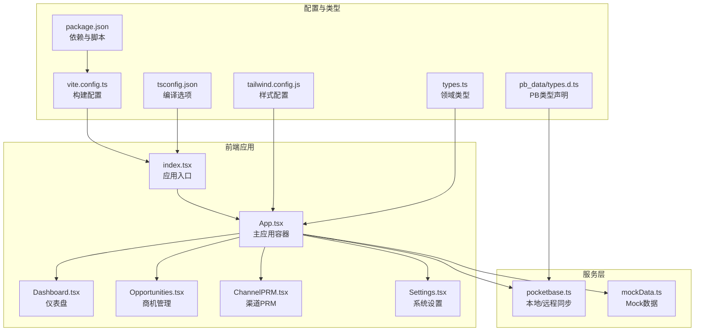
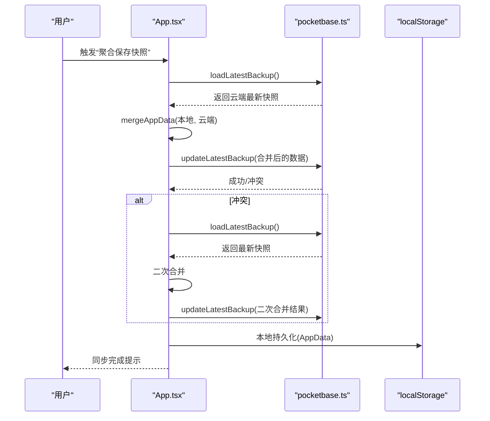
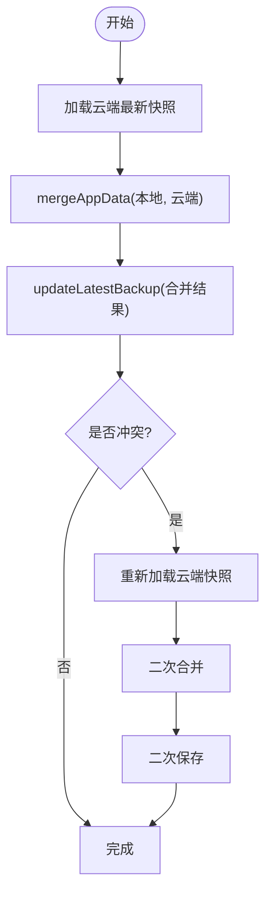
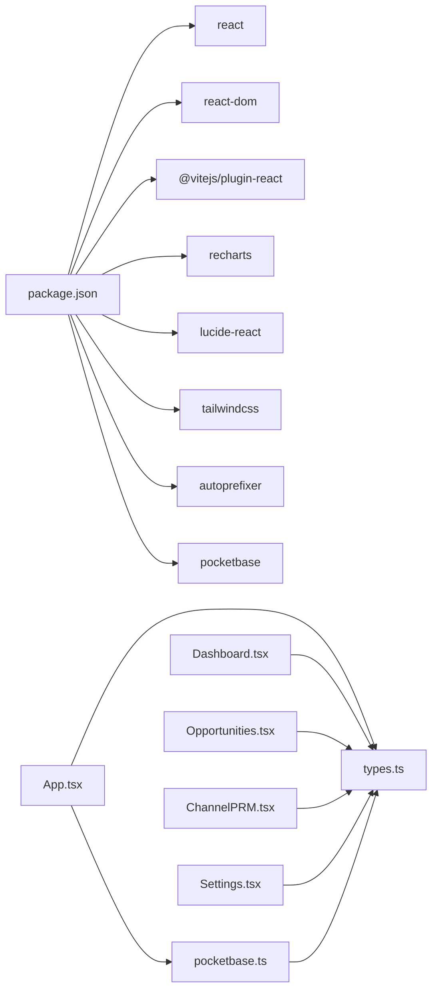

# 代码规范

<cite>
**本文引用的文件**
- [package.json](file://package.json)
- [tsconfig.json](file://tsconfig.json)
- [types.ts](file://types.ts)
- [index.tsx](file://index.tsx)
- [App.tsx](file://App.tsx)
- [Dashboard.tsx](file://components/Dashboard.tsx)
- [Opportunities.tsx](file://components/Opportunities.tsx)
- [ChannelPRM.tsx](file://components/ChannelPRM.tsx)
- [Settings.tsx](file://components/Settings.tsx)
- [pocketbase.ts](file://services/pocketbase.ts)
- [mockData.ts](file://services/mockData.ts)
- [vite.config.ts](file://vite.config.ts)
- [tailwind.config.js](file://tailwind.config.js)
- [README.md](file://README.md)
- [types.d.ts](file://pb_data/types.d.ts)
</cite>

## 目录
1. [简介](#简介)
2. [项目结构](#项目结构)
3. [核心组件](#核心组件)
4. [架构总览](#架构总览)
5. [详细组件分析](#详细组件分析)
6. [依赖关系分析](#依赖关系分析)
7. [性能考量](#性能考量)
8. [故障排查指南](#故障排查指南)
9. [结论](#结论)
10. [附录](#附录)

## 简介
本文件为“上海商机及渠道管理系统（v5.0）”制定统一的代码规范与最佳实践，覆盖 TypeScript 编码标准、React 组件开发规范、文件组织结构、导入导出规范、注释标准、代码格式化与静态分析工具使用指南，以及代码审查检查清单与质量保证流程。旨在提升团队协作效率、降低维护成本、保障系统稳定性与可扩展性。

## 项目结构
项目采用前端单页应用（Vite + React + TypeScript）与本地/远程数据存储（PocketBase）相结合的架构。核心目录与职责如下：
- components：按功能划分的 React 组件模块（仪表盘、商机、渠道 PRM、设置等）
- services：业务服务封装（本地/远程数据同步、Mock 数据）
- pb_data：PocketBase 生成的类型声明文件
- 入口：index.tsx、App.tsx
- 构建与样式：vite.config.ts、tailwind.config.js、tsconfig.json、package.json

图表来源
- [index.tsx](file://index.tsx#L1-L16)
- [App.tsx](file://App.tsx#L1-L620)
- [Dashboard.tsx](file://components/Dashboard.tsx#L1-L315)
- [Opportunities.tsx](file://components/Opportunities.tsx#L1-L804)
- [ChannelPRM.tsx](file://components/ChannelPRM.tsx#L1-L476)
- [Settings.tsx](file://components/Settings.tsx#L1-L291)
- [pocketbase.ts](file://services/pocketbase.ts#L1-L226)
- [mockData.ts](file://services/mockData.ts#L1-L81)
- [vite.config.ts](file://vite.config.ts#L1-L27)
- [tailwind.config.js](file://tailwind.config.js#L1-L13)
- [tsconfig.json](file://tsconfig.json#L1-L29)
- [package.json](file://package.json#L1-L28)
- [types.ts](file://types.ts#L1-L261)
- [types.d.ts](file://pb_data/types.d.ts#L1-L800)

章节来源
- [index.tsx](file://index.tsx#L1-L16)
- [App.tsx](file://App.tsx#L1-L620)
- [vite.config.ts](file://vite.config.ts#L1-L27)
- [tailwind.config.js](file://tailwind.config.js#L1-L13)
- [tsconfig.json](file://tsconfig.json#L1-L29)
- [package.json](file://package.json#L1-L28)
- [types.ts](file://types.ts#L1-L261)
- [types.d.ts](file://pb_data/types.d.ts#L1-L800)

## 核心组件
- 应用入口与挂载：index.tsx 负责创建根节点并渲染 App
- 主应用容器：App.tsx 负责全局状态、路由式侧边栏导航、登录/登出、云同步与聚合、数据持久化与恢复
- 功能组件：Dashboard、Opportunities、ChannelPRM、Settings 分别承担数据分析、商机管理、渠道 PRM、系统设置与用户管理
- 服务层：pocketbase.ts 封装本地/远程同步、备份读写、并发冲突处理；mockData.ts 提供 Mock 数据与辅助计算
- 类型体系：types.ts 定义领域模型与枚举；pb_data/types.d.ts 提供 PocketBase 生成的类型声明

章节来源
- [index.tsx](file://index.tsx#L1-L16)
- [App.tsx](file://App.tsx#L1-L620)
- [Dashboard.tsx](file://components/Dashboard.tsx#L1-L315)
- [Opportunities.tsx](file://components/Opportunities.tsx#L1-L804)
- [ChannelPRM.tsx](file://components/ChannelPRM.tsx#L1-L476)
- [Settings.tsx](file://components/Settings.tsx#L1-L291)
- [pocketbase.ts](file://services/pocketbase.ts#L1-L226)
- [mockData.ts](file://services/mockData.ts#L1-L81)
- [types.ts](file://types.ts#L1-L261)
- [types.d.ts](file://pb_data/types.d.ts#L1-L800)

## 架构总览
系统采用“前端应用 + 本地/远程数据存储”的双轨架构：
- 前端：React + TypeScript，组件间通过 Props 与回调通信，状态集中于 App.tsx 并通过 ref 保持最新
- 数据层：本地持久化（localStorage）、云端同步（PocketBase）与 Mock 数据
- 同步策略：合并算法确保本地与云端数据一致性，支持并发冲突检测与自动重试

图表来源
- [App.tsx](file://App.tsx#L302-L378)
- [pocketbase.ts](file://services/pocketbase.ts#L146-L204)

章节来源
- [App.tsx](file://App.tsx#L17-L75)
- [App.tsx](file://App.tsx#L302-L378)
- [pocketbase.ts](file://services/pocketbase.ts#L146-L204)

## 详细组件分析

### TypeScript 编码标准
- 接口命名约定
  - 使用名词短语或抽象概念命名接口，如 User、Unit、Opportunity、Commission 等
  - 对于只读/只写场景，使用 Partial<T> 或 Omit<T, K> 表达意图
- 类型定义规范
  - 优先使用字面量联合类型表达枚举值，如 OpportunityStage、UnitStatus、UserRole 等
  - 对外暴露的公共类型集中在 types.ts，避免分散定义
  - PocketBase 自动生成类型位于 pb_data/types.d.ts，避免手写重复
- 函数签名设计
  - 明确参数与返回值类型，必要时使用泛型约束
  - 对副作用函数（如保存、删除）明确错误处理与返回值
  - 使用 React.FC<Props> 明确组件 Props 结构，避免 any
- 可选属性与默认值
  - 对可选字段使用 ? 标记并在调用处提供默认值或防御性判断
  - 对复杂对象使用解构赋值 + 默认值，避免运行时访问空属性

章节来源
- [types.ts](file://types.ts#L2-L261)
- [types.d.ts](file://pb_data/types.d.ts#L1-L800)
- [App.tsx](file://App.tsx#L1-L620)

### React 组件开发规范
- 组件命名
  - 文件名与导出组件名一致，如 Dashboard.tsx -> export const Dashboard
  - 展示组件使用名词短语，容器组件使用动词短语（如 Login、Settings）
- Props 设计
  - 使用接口显式定义 Props，区分必需与可选字段
  - 对回调函数使用明确的签名，避免隐式 any
  - 对外部传入的数组/对象使用浅拷贝或不可变更新策略
- State 管理模式
  - 将全局状态收敛在 App.tsx，通过回调向下传递
  - 使用 React.useMemo 优化昂贵计算，避免重复渲染
  - 使用 React.useRef 保存最新状态，解决闭包过期问题
  - 对表单与临时状态使用局部状态，减少全局污染
- 事件与副作用
  - 在 useEffect 中处理副作用，注意清理与依赖数组
  - 对异步操作使用 try/catch 并设置状态反馈
- 组件拆分与复用
  - 将可复用 UI 片段抽取为独立组件，保持单一职责
  - 对复杂交互使用自定义 Hook 封装逻辑

章节来源
- [Dashboard.tsx](file://components/Dashboard.tsx#L1-L315)
- [Opportunities.tsx](file://components/Opportunities.tsx#L1-L804)
- [ChannelPRM.tsx](file://components/ChannelPRM.tsx#L1-L476)
- [Settings.tsx](file://components/Settings.tsx#L1-L291)
- [App.tsx](file://App.tsx#L179-L281)

### 文件组织结构与导入导出规范
- 目录组织
  - components：按功能域划分，每个组件一个文件
  - services：业务服务与数据访问封装
  - pb_data：PocketBase 生成类型声明
- 导入路径
  - 使用相对路径与 @ 别名（vite.config.ts 配置）统一管理
  - 避免循环依赖，尽量自上而下传递依赖
- 导出策略
  - 组件默认导出，常量与工具函数具名导出
  - 对外暴露的类型在 types.ts 中集中导出

章节来源
- [vite.config.ts](file://vite.config.ts#L17-L21)
- [Dashboard.tsx](file://components/Dashboard.tsx#L1-L315)
- [Opportunities.tsx](file://components/Opportunities.tsx#L1-L804)
- [ChannelPRM.tsx](file://components/ChannelPRM.tsx#L1-L476)
- [Settings.tsx](file://components/Settings.tsx#L1-L291)
- [types.ts](file://types.ts#L1-L261)

### 注释标准
- 文件头注释：简述模块职责与关键行为
- 函数注释：说明用途、参数含义、返回值与异常
- 复杂逻辑注释：解释关键步骤与边界条件
- TODO/NOTE 注释：标注待完善或需要注意的地方

章节来源
- [pocketbase.ts](file://services/pocketbase.ts#L1-L226)
- [App.tsx](file://App.tsx#L17-L75)

### 代码格式化与静态分析
- 代码格式化
  - 使用 Prettier（通过 Vite 插件链路）统一格式风格
- TypeScript 检查
  - tsconfig.json 已启用严格模式相关选项，确保类型安全
- Lint 规则
  - 建议引入 ESLint + @typescript-eslint，结合 React Hooks 规则
- 构建与运行
  - package.json 提供 dev/build/preview 脚本
  - vite.config.ts 配置端口、别名与环境变量注入

章节来源
- [tsconfig.json](file://tsconfig.json#L1-L29)
- [package.json](file://package.json#L1-L28)
- [vite.config.ts](file://vite.config.ts#L1-L27)

### 云同步与数据一致性流程
- 合并策略
  - 基于 ID 去重，优先保留本地最新数据
  - 删除标记（deletedIds）用于防止子数据复活
  - 用户数据特殊处理：云端空数据时不覆盖本地有效数据
- 并发控制
  - updateLatestBackup 使用乐观锁检测冲突，失败时自动重试
- 状态反馈
  - 通过状态机（IDLE/SAVING/MERGING/SUCCESS/ERROR）向用户反馈进度

图表来源
- [App.tsx](file://App.tsx#L302-L378)
- [pocketbase.ts](file://services/pocketbase.ts#L146-L179)

章节来源
- [App.tsx](file://App.tsx#L17-L75)
- [App.tsx](file://App.tsx#L302-L378)
- [pocketbase.ts](file://services/pocketbase.ts#L146-L179)

## 依赖关系分析
- 外部依赖
  - React 生态：react、react-dom、@vitejs/plugin-react
  - 图表库：recharts
  - UI 图标：lucide-react
  - 样式：tailwindcss、autoprefixer
  - 数据库：pocketbase
- 内部依赖
  - types.ts 定义的领域模型被各组件与服务共享
  - services/pocketbase.ts 与 App.tsx 强耦合，负责云同步
  - components 之间通过 Props 与回调通信，避免跨组件直接共享状态

图表来源
- [package.json](file://package.json#L11-L26)
- [App.tsx](file://App.tsx#L1-L620)
- [pocketbase.ts](file://services/pocketbase.ts#L1-L226)
- [types.ts](file://types.ts#L1-L261)

章节来源
- [package.json](file://package.json#L1-L28)
- [App.tsx](file://App.tsx#L1-L620)
- [pocketbase.ts](file://services/pocketbase.ts#L1-L226)
- [types.ts](file://types.ts#L1-L261)

## 性能考量
- 渲染优化
  - 使用 React.useMemo 缓存昂贵计算（如图表数据、统计指标）
  - 使用 React.useCallback 优化回调传递，减少子组件重渲染
- 状态管理
  - 将全局状态收敛在 App.tsx，避免多处重复状态
  - 使用 dataRef 保存最新状态，解决异步回调闭包过期
- 数据加载
  - 云端数据加载采用分页与过滤，避免一次性加载过多
  - 对 Mock 数据与真实数据采用统一接口，便于切换
- 样式与资源
  - Tailwind 按需引入，避免打包冗余样式
  - 图标库 lucide-react 按需引入，减少体积

章节来源
- [Dashboard.tsx](file://components/Dashboard.tsx#L20-L90)
- [Opportunities.tsx](file://components/Opportunities.tsx#L60-L71)
- [ChannelPRM.tsx](file://components/ChannelPRM.tsx#L36-L52)
- [App.tsx](file://App.tsx#L254-L281)
- [tailwind.config.js](file://tailwind.config.js#L1-L13)

## 故障排查指南
- 云同步失败
  - 检查 PocketBase 服务可用性与网络连接
  - 查看并发冲突日志，确认是否触发二次合并
- 登录与权限
  - 确认用户数据完整性，避免空数组覆盖
  - 检查用户角色与权限位，确保操作可见性
- 数据恢复
  - 使用“数据备份快照”列表进行历史版本恢复
  - 注意恢复后对用户数据的兜底策略
- 开发调试
  - 使用浏览器开发者工具观察状态变化与请求响应
  - 在 Vite 环境中通过环境变量注入 API Key

章节来源
- [pocketbase.ts](file://services/pocketbase.ts#L184-L204)
- [App.tsx](file://App.tsx#L179-L286)
- [Settings.tsx](file://components/Settings.tsx#L17-L48)
- [README.md](file://README.md#L16-L21)

## 结论
本规范在现有项目基础上，明确了 TypeScript 编码、React 组件开发、文件组织、注释与质量保障等方面的最佳实践。建议团队在日常开发中严格执行，并持续通过代码审查与自动化工具提升代码质量与交付效率。

## 附录

### 代码审查检查清单
- 类型安全
  - 是否使用明确的接口与类型约束？
  - 是否避免 any 与隐式类型？
- 组件设计
  - Props 是否清晰、可测试？
  - 是否存在过度耦合或状态分散？
- 性能
  - 是否使用 useMemo/useCallback 优化渲染？
  - 是否避免不必要的全局状态更新？
- 数据一致性
  - 云同步是否考虑并发冲突与幂等？
  - 删除标记与级联删除是否正确实现？
- 可维护性
  - 注释是否清晰、及时更新？
  - 错误处理是否完善、用户可见？

### 质量保证流程
- 提交前
  - 本地运行格式化与类型检查
  - 执行最小化回归测试
- 提交流程
  - 通过 CI 进行静态分析与测试
  - 代码审查至少一名同事
- 发布流程
  - 生成变更日志与迁移说明
  - 部署后进行端到端验证