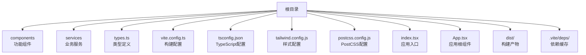
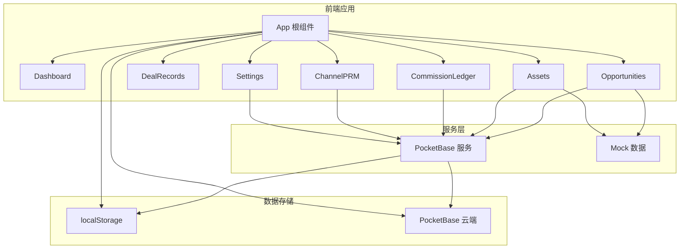
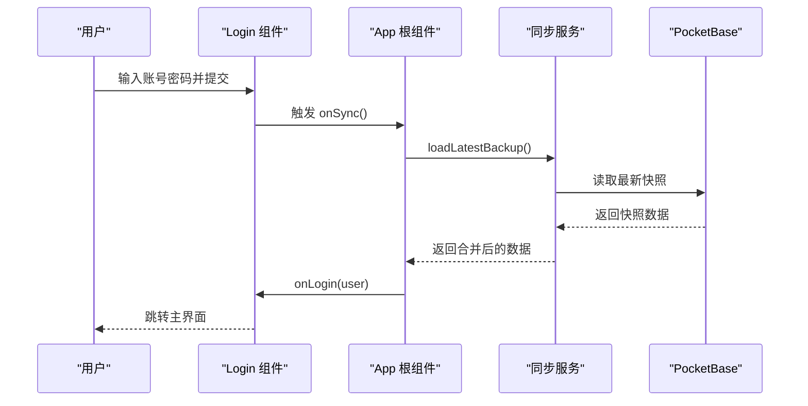
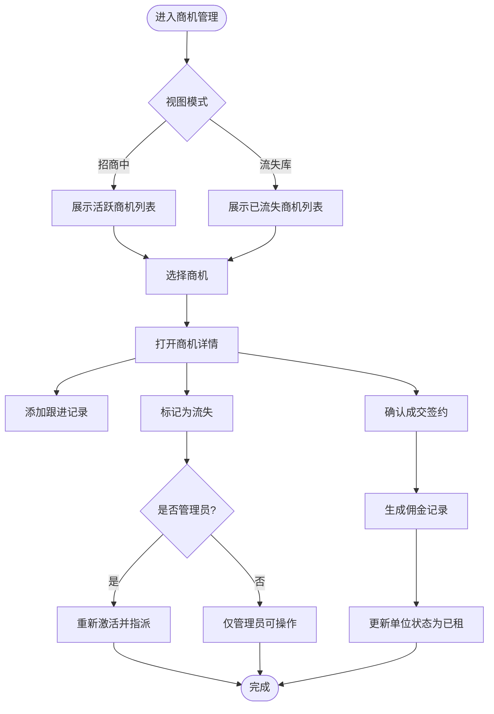
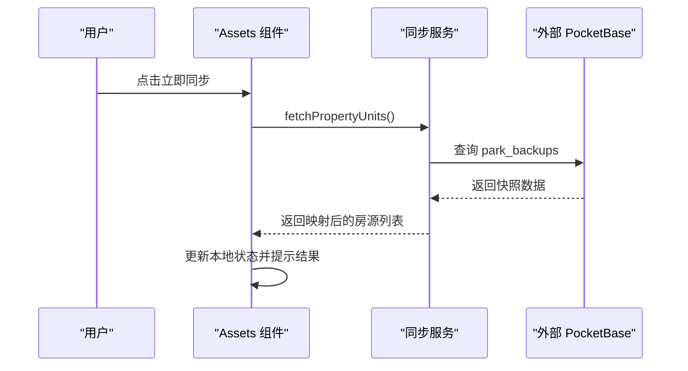
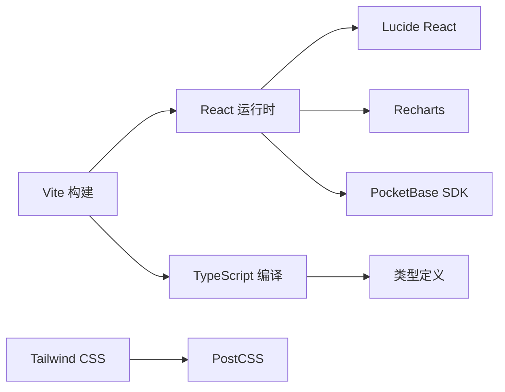

# 开发指南

<cite>
**本文档引用的文件**
- [package.json](file://package.json)
- [tsconfig.json](file://tsconfig.json)
- [vite.config.ts](file://vite.config.ts)
- [tailwind.config.js](file://tailwind.config.js)
- [postcss.config.js](file://postcss.config.js)
- [index.tsx](file://index.tsx)
- [App.tsx](file://App.tsx)
- [types.ts](file://types.ts)
- [services/pocketbase.ts](file://services/pocketbase.ts)
- [services/mockData.ts](file://services/mockData.ts)
- [components/Dashboard.tsx](file://components/Dashboard.tsx)
- [components/Opportunities.tsx](file://components/Opportunities.tsx)
- [components/ChannelPRM.tsx](file://components/ChannelPRM.tsx)
- [components/Assets.tsx](file://components/Assets.tsx)
- [components/CommissionLedger.tsx](file://components/CommissionLedger.tsx)
- [components/DealRecords.tsx](file://components/DealRecords.tsx)
</cite>

## 目录
1. [简介](#简介)
2. [项目结构](#项目结构)
3. [核心组件](#核心组件)
4. [架构概览](#架构概览)
5. [详细组件分析](#详细组件分析)
6. [依赖关系分析](#依赖关系分析)
7. [性能考虑](#性能考虑)
8. [故障排查指南](#故障排查指南)
9. [结论](#结论)
10. [附录](#附录)

## 简介
本指南面向新加入的开发者，提供「上海商机及渠道管理系统」的完整开发工作流程。内容涵盖开发环境搭建、代码规范、组件开发、测试策略、性能优化、调试技巧、代码审查标准以及持续集成流程。项目采用 TypeScript + React + Vite + Tailwind CSS 技术栈，结合 PocketBase 实现本地与云端数据同步。

## 项目结构
项目采用按功能模块划分的目录组织方式，核心入口位于根目录，组件按页面功能拆分至 components 目录，业务服务封装在 services 目录，类型定义集中于 types.ts，构建与样式配置分别位于 vite.config.ts、tsconfig.json、tailwind.config.js 和 postcss.config.js。

**图表来源**
- [index.tsx](file://index.tsx#L1-L16)
- [App.tsx](file://App.tsx#L1-L620)
- [vite.config.ts](file://vite.config.ts#L1-L27)
- [tsconfig.json](file://tsconfig.json#L1-L29)
- [tailwind.config.js](file://tailwind.config.js#L1-L13)
- [postcss.config.js](file://postcss.config.js#L1-L6)

**章节来源**
- [index.tsx](file://index.tsx#L1-L16)
- [App.tsx](file://App.tsx#L1-L620)
- [vite.config.ts](file://vite.config.ts#L1-L27)
- [tsconfig.json](file://tsconfig.json#L1-L29)
- [tailwind.config.js](file://tailwind.config.js#L1-L13)
- [postcss.config.js](file://postcss.config.js#L1-L6)

## 核心组件
- 应用根组件 App：负责全局状态管理、登录流程、数据持久化与云端同步、路由切换与模态框控制。
- 功能组件：Dashboard（总控大屏）、Opportunities（商机管理）、Assets（资产销控）、DealRecords（成交台账）、CommissionLedger（佣金结算）、ChannelPRM（渠道 PRM）、Policies（政策配置）、Settings（系统设置）。
- 服务模块：pocketbase（本地/云端数据同步）、mockData（演示数据）。
- 类型系统：types.ts（统一的数据模型与枚举）。

**章节来源**
- [App.tsx](file://App.tsx#L1-L620)
- [components/Dashboard.tsx](file://components/Dashboard.tsx#L1-L315)
- [components/Opportunities.tsx](file://components/Opportunities.tsx#L1-L804)
- [components/Assets.tsx](file://components/Assets.tsx#L1-L368)
- [components/DealRecords.tsx](file://components/DealRecords.tsx#L1-L252)
- [components/CommissionLedger.tsx](file://components/CommissionLedger.tsx#L1-L201)
- [components/ChannelPRM.tsx](file://components/ChannelPRM.tsx#L1-L476)
- [services/pocketbase.ts](file://services/pocketbase.ts#L1-L226)
- [services/mockData.ts](file://services/mockData.ts#L1-L81)
- [types.ts](file://types.ts#L1-L261)

## 架构概览
系统采用前端单页应用架构，通过 App 根组件协调各功能模块。数据流主要分为两条路径：
- 本地状态：使用 React hooks 在组件内维护状态，并通过 localStorage 持久化。
- 云端同步：通过 PocketBase 服务实现与本地/云端快照的聚合与冲突处理。

**图表来源**
- [App.tsx](file://App.tsx#L1-L620)
- [services/pocketbase.ts](file://services/pocketbase.ts#L1-L226)
- [services/mockData.ts](file://services/mockData.ts#L1-L81)

**章节来源**
- [App.tsx](file://App.tsx#L1-L620)
- [services/pocketbase.ts](file://services/pocketbase.ts#L1-L226)

## 详细组件分析

### App 根组件与状态管理
- 登录流程：Login 组件负责用户认证与云端数据同步，支持全量恢复与增量聚合两种模式。
- 全局状态：使用 useState/ useEffect 管理用户、商机、资产、佣金、政策等数据，并通过 localStorage 持久化。
- 云端同步：mergeAppData 实现本地与云端数据的深度合并，确保删除记录的级联过滤与去重。
- 自动同步：通过 useRef 与定时器实现 3 秒防抖的自动聚合保存，避免频繁写入。

**图表来源**
- [App.tsx](file://App.tsx#L77-L177)
- [App.tsx](file://App.tsx#L302-L329)
- [services/pocketbase.ts](file://services/pocketbase.ts#L184-L204)

**章节来源**
- [App.tsx](file://App.tsx#L77-L177)
- [App.tsx](file://App.tsx#L179-L617)
- [App.tsx](file://App.tsx#L17-L75)
- [services/pocketbase.ts](file://services/pocketbase.ts#L146-L179)

### 商机管理组件 Opportunities
- 功能特性：商机创建、跟进记录、成交确认、流失标记、佣金生成、单位状态联动。
- 性能优化：使用 useMemo 过滤有效活动记录，避免已删除商机残留数据影响统计。
- 权限控制：管理员可激活已流失商机并重新指派负责人。

**图表来源**
- [components/Opportunities.tsx](file://components/Opportunities.tsx#L28-L506)
- [components/Opportunities.tsx](file://components/Opportunities.tsx#L107-L136)
- [components/Opportunities.tsx](file://components/Opportunities.tsx#L138-L164)

**章节来源**
- [components/Opportunities.tsx](file://components/Opportunities.tsx#L28-L506)
- [components/Opportunities.tsx](file://components/Opportunities.tsx#L60-L64)

### 资产销控组件 Assets
- 功能特性：楼宇筛选、楼层布局、房源状态可视化、云端资产同步。
- 云端同步：通过 fetchPropertyUnits 从招商管理系统的 PocketBase 获取最新资产快照，并进行状态映射与校验。

**图表来源**
- [components/Assets.tsx](file://components/Assets.tsx#L109-L142)
- [services/pocketbase.ts](file://services/pocketbase.ts#L50-L125)

**章节来源**
- [components/Assets.tsx](file://components/Assets.tsx#L16-L368)
- [services/pocketbase.ts](file://services/pocketbase.ts#L50-L125)

### 佣金结算组件 CommissionLedger
- 功能特性：待结佣金监控、分期节点管理、财务状态变更。
- 数据过滤：根据搜索条件与财务状态进行过滤与排序。

**章节来源**
- [components/CommissionLedger.tsx](file://components/CommissionLedger.tsx#L14-L201)

### 渠道 PRM 组件 ChannelPRM
- 功能特性：合作商档案管理、联系人维护、佣金统计与财务修正。
- 权限控制：管理员可设置归属人与协同维护人员。

**章节来源**
- [components/ChannelPRM.tsx](file://components/ChannelPRM.tsx#L21-L476)

### 总控大屏组件 Dashboard
- 功能特性：年度累计签约面积、商机总量、带看与转化分析、待租房源分布、商机来源与面积段占比。
- 性能优化：使用 useMemo 构建合法轨迹集合，减少无效渲染。

**章节来源**
- [components/Dashboard.tsx](file://components/Dashboard.tsx#L20-L315)

### 成交台账组件 DealRecords
- 功能特性：年度成交统计、招商经理绩效、按月分组展示。
- 数据解析：提供高级房号解析逻辑，兼容多种编号格式。

**章节来源**
- [components/DealRecords.tsx](file://components/DealRecords.tsx#L13-L252)

## 依赖关系分析
- 构建工具：Vite 提供开发服务器与打包能力，支持 React 插件与环境变量注入。
- 样式系统：Tailwind CSS + PostCSS，通过 content 配置扫描组件样式类。
- 类型系统：TypeScript 配置启用 bundler 模块解析与 JSX 转换。
- 运行时依赖：React 生态、Lucide React 图标库、Recharts 图表库、PocketBase SDK。

**图表来源**
- [package.json](file://package.json#L1-L28)
- [vite.config.ts](file://vite.config.ts#L1-L27)
- [tsconfig.json](file://tsconfig.json#L1-L29)
- [tailwind.config.js](file://tailwind.config.js#L1-L13)
- [postcss.config.js](file://postcss.config.js#L1-L6)

**章节来源**
- [package.json](file://package.json#L1-L28)
- [vite.config.ts](file://vite.config.ts#L1-L27)
- [tsconfig.json](file://tsconfig.json#L1-L29)
- [tailwind.config.js](file://tailwind.config.js#L1-L13)
- [postcss.config.js](file://postcss.config.js#L1-L6)

## 性能考虑
- 渲染优化
  - 使用 useMemo 对大型列表与统计计算进行缓存，避免重复计算。
  - 通过 useRef 保存最新状态引用，解决闭包过期导致的异步逻辑问题。
- 网络与同步
  - 云端聚合采用乐观锁与冲突检测，失败时自动重试合并。
  - 本地自动同步设置 3 秒防抖，降低频繁写入对用户体验的影响。
- 样式与资源
  - Tailwind content 配置精确扫描，避免无用 CSS。
  - Vite 依赖预构建与模块解析优化，减少冷启动时间。

**章节来源**
- [App.tsx](file://App.tsx#L254-L281)
- [App.tsx](file://App.tsx#L331-L378)
- [tailwind.config.js](file://tailwind.config.js#L3-L8)
- [vite.config.ts](file://vite.config.ts#L22-L24)

## 故障排查指南
- 云端同步失败
  - 检查 PocketBase URL 环境变量与实例连通性。
  - 查看 loadLatestBackup 与 updateLatestBackup 的错误返回，确认冲突与重试逻辑。
- 数据不一致
  - 使用 mergeAppData 的删除 ID 过滤机制，确保子数据不会复活。
  - 确认 deletedIds 的正确传播与级联删除。
- 样式未生效
  - 确认 Tailwind content 路径包含组件文件。
  - 检查 PostCSS 插件顺序与版本兼容性。
- 构建问题
  - 检查 Vite 插件与环境变量注入配置。
  - 确认 TypeScript 模块解析与路径别名配置。

**章节来源**
- [services/pocketbase.ts](file://services/pocketbase.ts#L146-L179)
- [services/pocketbase.ts](file://services/pocketbase.ts#L184-L204)
- [App.tsx](file://App.tsx#L17-L75)
- [tailwind.config.js](file://tailwind.config.js#L3-L8)
- [postcss.config.js](file://postcss.config.js#L1-L6)
- [vite.config.ts](file://vite.config.ts#L13-L16)

## 结论
本项目通过清晰的模块划分与完善的同步机制，实现了本地与云端数据的一致性与可用性。建议在后续迭代中进一步完善自动化测试、日志埋点与可观测性方案，以提升系统的稳定性与可维护性。

## 附录

### 开发环境搭建
- 安装依赖：使用包管理器安装项目依赖。
- 启动开发服务器：运行 Vite 开发命令，访问本地端口查看效果。
- 环境变量：根据需要配置 PocketBase 相关环境变量。

**章节来源**
- [package.json](file://package.json#L6-L10)
- [vite.config.ts](file://vite.config.ts#L8-L11)

### 代码规范
- TypeScript
  - 使用严格模式与 bundler 模块解析，确保类型安全。
  - 路径别名统一使用 @/*，便于跨层级导入。
- React
  - 组件按功能拆分，遵循单一职责原则。
  - 使用 hooks 管理状态，避免过度嵌套与副作用。
- 样式
  - Tailwind 类名语义化，避免内联样式。
  - 通过 content 精确扫描，减少未使用样式体积。

**章节来源**
- [tsconfig.json](file://tsconfig.json#L21-L27)
- [tailwind.config.js](file://tailwind.config.js#L3-L8)

### 组件开发最佳实践
- 状态管理
  - 将可复用的状态逻辑抽象为自定义 hooks。
  - 使用 useRef 保存最新引用，避免闭包陷阱。
- 数据同步
  - 云端聚合采用合并策略与冲突检测，保证一致性。
  - 提供全量恢复与增量聚合两种模式，满足不同场景。
- 可访问性
  - 为交互元素提供明确的标题与提示信息。
  - 控制可见性与禁用状态，避免误操作。

**章节来源**
- [App.tsx](file://App.tsx#L254-L281)
- [App.tsx](file://App.tsx#L302-L329)
- [App.tsx](file://App.tsx#L331-L378)

### 测试策略
- 单元测试
  - 针对纯函数与工具方法编写测试用例，覆盖边界条件。
- 集成测试
  - 模拟云端同步流程，验证合并与冲突处理逻辑。
- 端到端测试
  - 使用自动化测试框架覆盖关键用户流程，如登录、商机创建、成交确认等。

[本节为通用指导，无需具体文件引用]

### 调试技巧
- 日志与断点
  - 在关键流程（登录、同步、聚合）添加日志输出。
  - 使用浏览器开发者工具断点定位异步问题。
- 状态检查
  - 利用 React DevTools 检查组件状态与 props。
  - 通过 localStorage 快速回放与对比状态差异。

[本节为通用指导，无需具体文件引用]

### 代码审查标准
- 代码质量
  - 保持函数简洁、参数合理、错误处理完备。
  - 避免魔法数字与字符串，使用常量与枚举。
- 安全性
  - 对用户输入进行校验与清理，防止注入与越权。
  - 云端请求增加超时与重试策略。
- 可维护性
  - 注释清晰、命名规范、模块解耦。
  - 异步逻辑使用 Promise/async-await，避免回调地狱。

[本节为通用指导，无需具体文件引用]

### 持续集成流程
- 构建与测试
  - 在 CI 中执行构建与测试脚本，确保通过后再合并。
- 部署
  - 使用 Vite 构建生产包，上传至静态托管或反向代理。
- 监控
  - 集成错误上报与性能监控，及时发现并修复问题。

[本节为通用指导，无需具体文件引用]