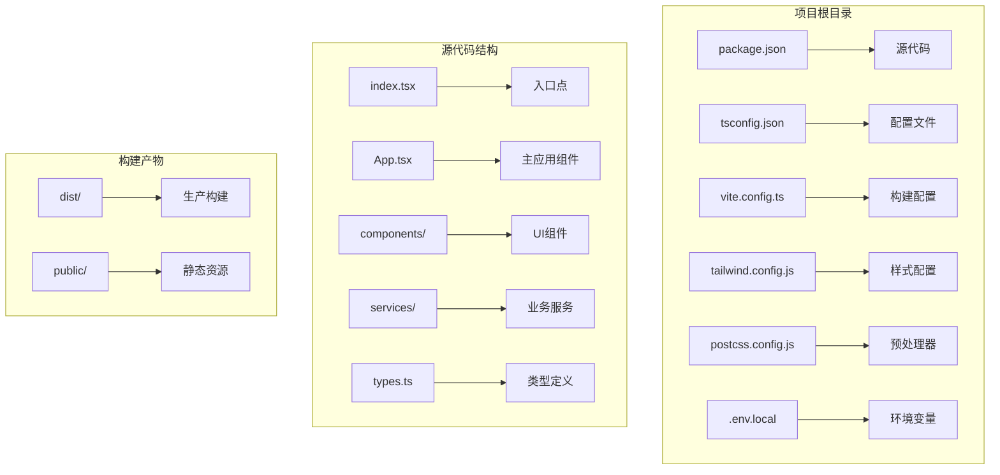
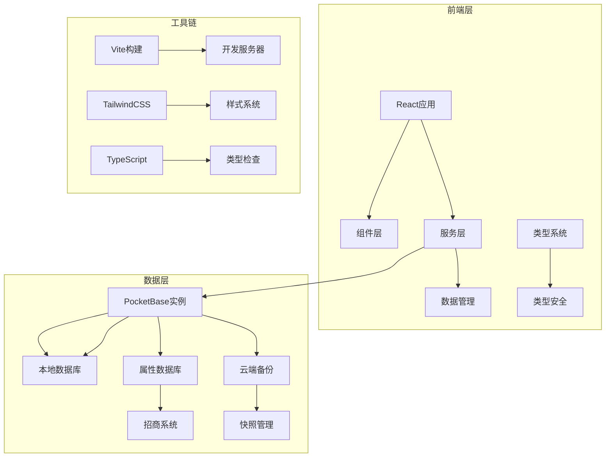
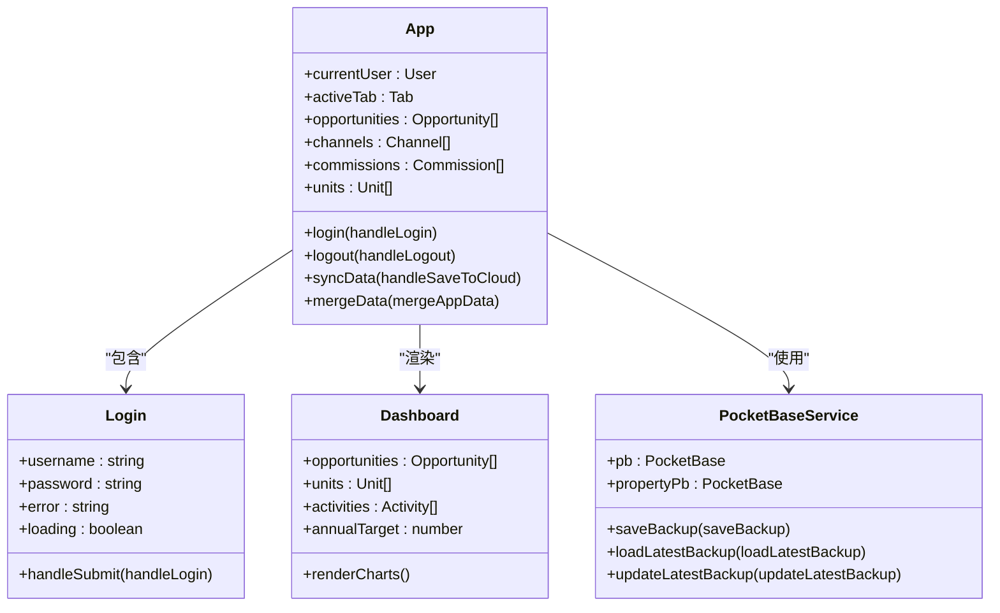
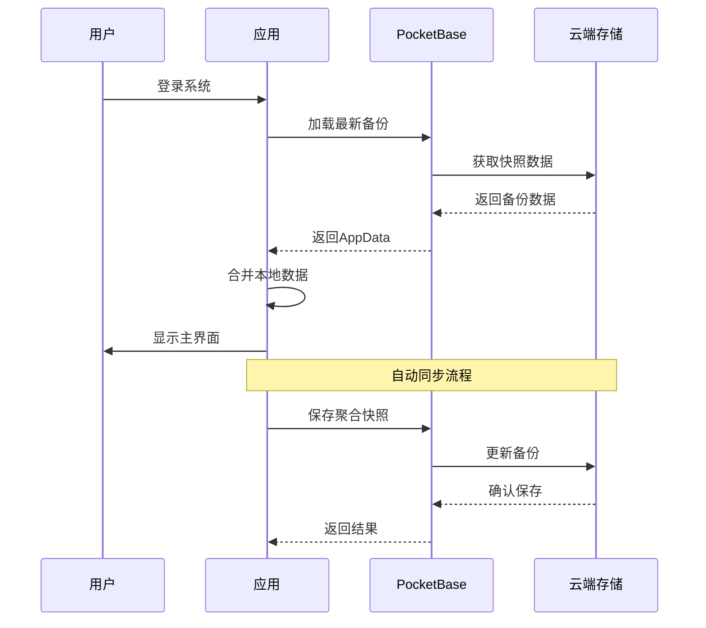

# 开发环境搭建

<cite>
**本文档引用的文件**
- [package.json](file://package.json)
- [tsconfig.json](file://tsconfig.json)
- [vite.config.ts](file://vite.config.ts)
- [tailwind.config.js](file://tailwind.config.js)
- [postcss.config.js](file://postcss.config.js)
- [.env.local](file://.env.local)
- [README.md](file://README.md)
- [index.tsx](file://index.tsx)
- [App.tsx](file://App.tsx)
- [services/pocketbase.ts](file://services/pocketbase.ts)
- [types.ts](file://types.ts)
- [scripts/setup-pocketbase.sh](file://scripts/setup-pocketbase.sh)
- [scripts/export-supabase-data.ts](file://scripts/export-supabase-data.ts)
</cite>

## 目录
1. [简介](#简介)
2. [项目结构](#项目结构)
3. [核心组件](#核心组件)
4. [架构概览](#架构概览)
5. [详细组件分析](#详细组件分析)
6. [依赖关系分析](#依赖关系分析)
7. [性能考虑](#性能考虑)
8. [故障排除指南](#故障排除指南)
9. [结论](#结论)

## 简介

这是一个基于React 19、TypeScript 5.8、Vite 6和TailwindCSS的现代化前端项目，集成了PocketBase作为数据存储解决方案。项目采用模块化设计，支持云端数据同步功能，提供完整的商机管理和渠道管理系统。

## 项目结构

项目采用现代前端工程化标准，主要目录结构如下：



**图表来源**
- [package.json](file://package.json#L1-L28)
- [tsconfig.json](file://tsconfig.json#L1-L29)
- [vite.config.ts](file://vite.config.ts#L1-L27)

**章节来源**
- [package.json](file://package.json#L1-L28)
- [README.md](file://README.md#L1-L21)

## 核心组件

### 依赖管理

项目使用npm作为包管理器，核心依赖包括：
- **React 19.2.3**: 用户界面框架
- **TypeScript 5.8.2**: 类型安全的JavaScript扩展
- **Vite 6.2.0**: 现代化构建工具
- **TailwindCSS 3.4.19**: 实用优先的CSS框架
- **PocketBase 0.21.5**: 云端数据库解决方案

### TypeScript配置详解

项目采用严格的TypeScript配置，关键配置项说明：

| 配置项 | 值 | 作用 |
|--------|-----|------|
| target | ES2022 | 编译目标JavaScript版本 |
| experimentalDecorators | true | 启用装饰器实验特性 |
| module | ESNext | 模块系统 |
| lib | ES2022, DOM, DOM.Iterable | 支持的库类型 |
| skipLibCheck | true | 跳过库文件类型检查 |
| moduleResolution | bundler | 使用打包器解析模块 |
| jsx | react-jsx | JSX编译选项 |
| paths | @/* -> ./* | 路径别名配置 |

**章节来源**
- [tsconfig.json](file://tsconfig.json#L1-L29)

### Vite构建配置

Vite配置提供了完整的开发体验：
- **开发服务器**: 监听0.0.0.0:3000端口
- **插件系统**: React插件支持
- **路径别名**: @指向项目根目录
- **环境变量**: 支持API密钥注入

**章节来源**
- [vite.config.ts](file://vite.config.ts#L1-L27)

## 架构概览

系统采用分层架构设计，实现前后端分离的数据管理模式：



**图表来源**
- [App.tsx](file://App.tsx#L1-L620)
- [services/pocketbase.ts](file://services/pocketbase.ts#L1-L226)
- [types.ts](file://types.ts#L1-L261)

## 详细组件分析

### 应用主组件分析

App.tsx实现了完整的业务逻辑，包括：



**图表来源**
- [App.tsx](file://App.tsx#L179-L617)
- [services/pocketbase.ts](file://services/pocketbase.ts#L1-L226)

### 数据同步流程

系统实现了智能的数据同步机制：



**图表来源**
- [App.tsx](file://App.tsx#L302-L378)
- [services/pocketbase.ts](file://services/pocketbase.ts#L130-L204)

### 环境变量配置

项目支持多种环境变量配置：

| 变量名 | 默认值 | 用途 |
|--------|--------|------|
| GEMINI_API_KEY | PLACEHOLDER_API_KEY | Gemini AI API密钥 |
| POCKETBASE_URL | http://127.0.0.1:8091 | 本地PocketBase地址 |
| POCKETBASE_PROPERTY_URL | http://127.0.0.1:8090 | 属性数据库地址 |

**章节来源**
- [.env.local](file://.env.local#L1-L4)
- [vite.config.ts](file://vite.config.ts#L13-L16)

### 路径别名配置

项目使用@符号作为路径别名，简化了模块导入：

```mermaid
flowchart TD
A[源代码] --> B[相对路径导入]
C[路径别名] --> D[@/components]
C --> E[@/services]
C --> F[@/types]
B --> G[./components/...]
D --> G
E --> H[../services/...]
F --> I[../types/...]
```

**图表来源**
- [tsconfig.json](file://tsconfig.json#L21-L25)
- [vite.config.ts](file://vite.config.ts#L17-L21)

**章节来源**
- [tsconfig.json](file://tsconfig.json#L21-L25)
- [vite.config.ts](file://vite.config.ts#L17-L21)

## 依赖关系分析

项目依赖关系呈现清晰的层次结构：

```mermaid
graph TB
subgraph "运行时依赖"
A[react] --> B[react-dom]
C[lucide-react] --> D[图标组件]
E[pocketbase] --> F[数据库客户端]
G[recharts] --> H[数据可视化]
end
subgraph "开发依赖"
I[typescript] --> J[类型定义]
K[@types/node] --> L[Node.js类型]
M[vite] --> N[构建工具]
O[@vitejs/plugin-react] --> P[React支持]
Q[tailwindcss] --> R[样式框架]
S[autoprefixer] --> T[CSS后处理器]
end
subgraph "构建工具"
U[postcss] --> V[CSS处理]
W[tsconfig] --> X[TypeScript配置]
Y[vite.config] --> Z[Vite配置]
end
```

**图表来源**
- [package.json](file://package.json#L11-L26)

**章节来源**
- [package.json](file://package.json#L11-L26)

## 性能考虑

### 构建优化

项目采用多项性能优化策略：
- **Tree Shaking**: 通过ES模块系统实现按需导入
- **代码分割**: Vite自动进行代码分割
- **缓存策略**: 依赖预构建和浏览器缓存
- **压缩优化**: 生产环境自动压缩

### 内存管理

应用实现了智能的数据管理：
- **引用优化**: 使用useRef避免闭包陷阱
- **状态分离**: 将大型状态分解为多个小状态
- **防抖机制**: 3秒防抖避免频繁同步
- **增量更新**: 仅更新变化的数据

## 故障排除指南

### 常见环境问题

#### Node.js版本兼容性
- **问题**: Node.js版本过低导致依赖安装失败
- **解决方案**: 确保使用Node.js 18+版本
- **验证命令**: `node --version`

#### 依赖安装问题
- **问题**: npm install失败
- **解决方案**: 清理缓存后重试
  ```bash
  npm cache clean --force
  rm -rf node_modules package-lock.json
  npm install
  ```

#### 端口占用问题
- **问题**: 端口3000被占用
- **解决方案**: 修改vite.config.ts中的端口号
  ```javascript
  server: {
    port: 3001, // 更改为其他可用端口
    host: '0.0.0.0',
  }
  ```

#### PocketBase连接失败
- **问题**: 无法连接到PocketBase数据库
- **解决方案**: 
  1. 启动本地PocketBase服务
  2. 检查.env.local中的URL配置
  3. 验证数据库连接

#### TypeScript编译错误
- **问题**: 装饰器实验特性编译失败
- **解决方案**: 确保experimentalDecorators设置为true

### 调试技巧

#### 开发模式调试
```bash
# 启动开发服务器
npm run dev

# 查看构建日志
npm run build -- --mode development

# 预览生产构建
npm run preview
```

#### 环境变量调试
```bash
# 检查环境变量是否正确加载
echo $GEMINI_API_KEY
echo $POCKETBASE_URL

# 验证Vite环境变量注入
curl -s http://localhost:3000/env.js
```

**章节来源**
- [README.md](file://README.md#L16-L20)
- [scripts/setup-pocketbase.sh](file://scripts/setup-pocketbase.sh#L1-L55)

## 结论

本项目提供了一个完整的现代化前端开发环境，具备以下特点：

1. **技术栈先进**: React 19 + TypeScript 5.8 + Vite 6的组合确保了最佳的开发体验
2. **架构清晰**: 分层设计使得代码易于维护和扩展
3. **功能完整**: 包含数据同步、云端备份、用户认证等核心功能
4. **配置灵活**: 支持多种环境配置和自定义选项
5. **部署友好**: 提供完整的构建和部署配置

建议开发者在开始开发前：
- 确保Node.js版本满足要求
- 完成PocketBase数据库初始化
- 配置必要的环境变量
- 理解项目的数据流和状态管理机制

通过遵循本指南，开发者可以快速搭建并运行这个现代化的前端应用。