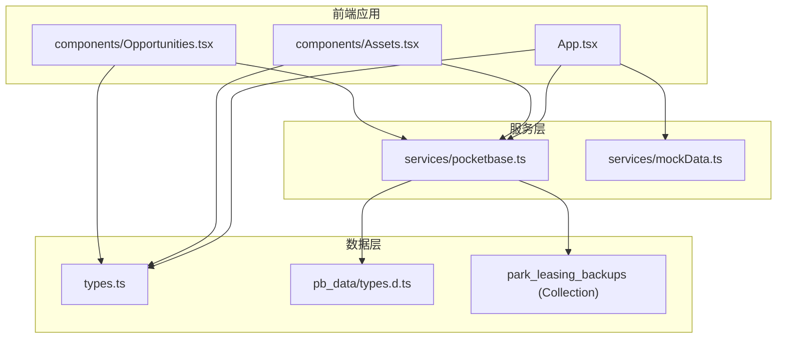
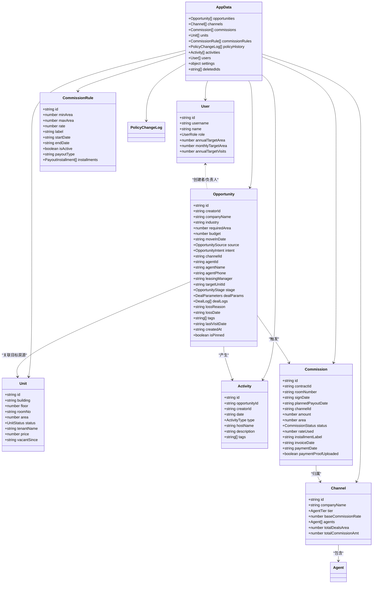
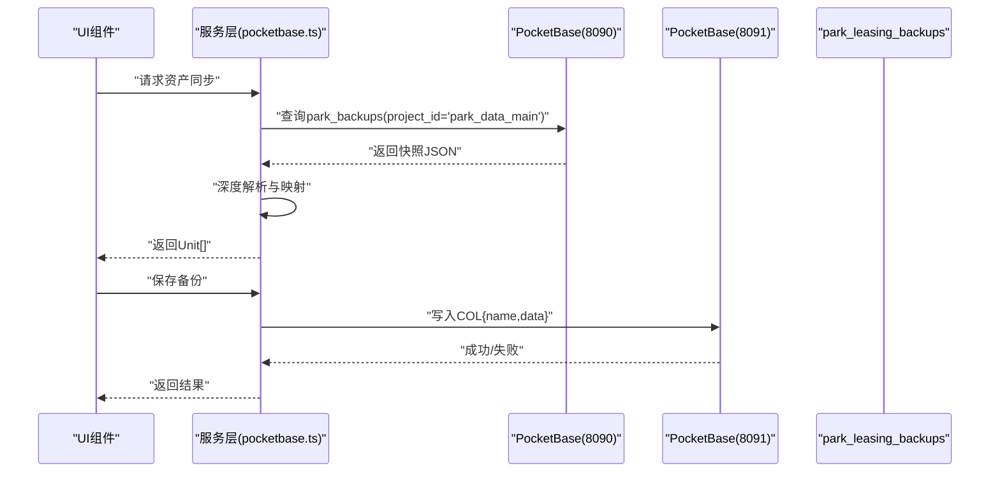
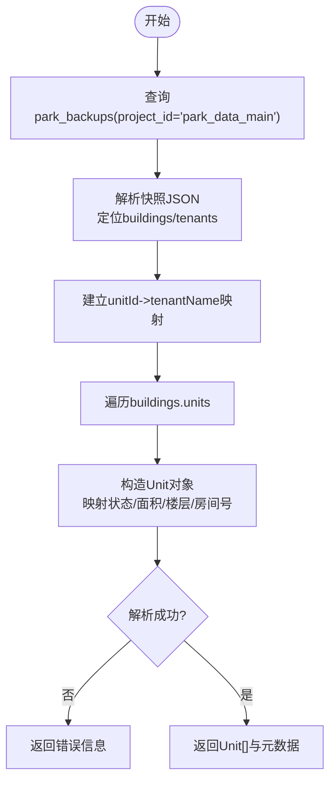
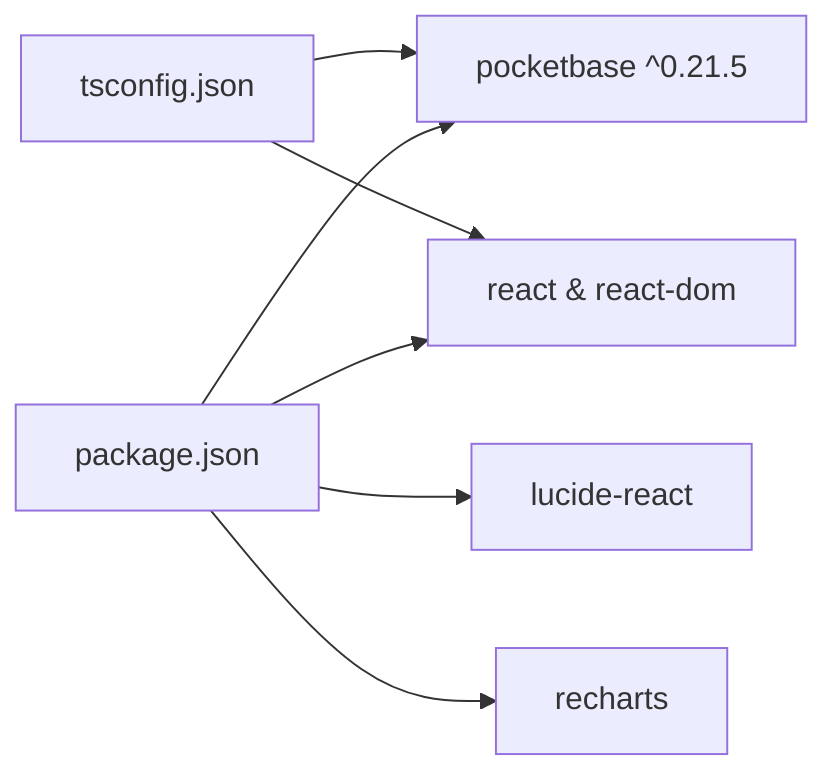

# 数据模型

<cite>
**本文引用的文件**
- [types.ts](file://types.ts)
- [pb_data/types.d.ts](file://pb_data/types.d.ts)
- [services/pocketbase.ts](file://services/pocketbase.ts)
- [services/mockData.ts](file://services/mockData.ts)
- [MIGRATION_SUMMARY.md](file://MIGRATION_SUMMARY.md)
- [pb_migrations/1770189507_created_park_leasing_backups.js](file://pb_migrations/1770189507_created_park_leasing_backups.js)
- [App.tsx](file://App.tsx)
- [components/Assets.tsx](file://components/Assets.tsx)
- [components/Opportunities.tsx](file://components/Opportunities.tsx)
- [package.json](file://package.json)
- [tsconfig.json](file://tsconfig.json)
</cite>

## 目录
1. [简介](#简介)
2. [项目结构](#项目结构)
3. [核心数据模型](#核心数据模型)
4. [架构总览](#架构总览)
5. [详细组件分析](#详细组件分析)
6. [依赖关系分析](#依赖关系分析)
7. [性能考量](#性能考量)
8. [故障排查指南](#故障排查指南)
9. [结论](#结论)
10. [附录](#附录)

## 简介
本指南面向数据模型设计与演进，聚焦于本项目的TypeScript接口定义规范、PocketBase数据模型映射关系、字段约束与索引设计、验证规则与类型安全、数据迁移策略、Mock数据与模拟测试、数据层抽象设计以及模型演进与版本兼容性处理方案。文档以仓库中的实际代码为依据，结合服务层与组件层的使用方式，给出可落地的设计与实践建议。

## 项目结构
项目采用前端React + TypeScript + PocketBase的架构，数据模型主要由以下部分组成：
- 类型定义：统一的TS接口与枚举，位于 types.ts
- PocketBase类型声明：pb_data/types.d.ts 提供JS钩子上下文下的类型辅助
- 服务层：封装PocketBase客户端、数据同步与备份读写逻辑，位于 services/pocketbase.ts
- Mock数据：用于开发与测试的静态数据，位于 services/mockData.ts
- 组件层：各业务界面消费数据模型，如资产与商机模块
- 迁移与配置：迁移摘要、集合迁移脚本、依赖与编译配置

图表来源
- [App.tsx](file://App.tsx#L1-L200)
- [components/Assets.tsx](file://components/Assets.tsx#L1-L200)
- [components/Opportunities.tsx](file://components/Opportunities.tsx#L1-L200)
- [services/pocketbase.ts](file://services/pocketbase.ts#L1-L226)
- [services/mockData.ts](file://services/mockData.ts#L1-L81)
- [types.ts](file://types.ts#L1-L261)
- [pb_data/types.d.ts](file://pb_data/types.d.ts#L1-L200)
- [pb_migrations/1770189507_created_park_leasing_backups.js](file://pb_migrations/1770189507_created_park_leasing_backups.js#L1-L54)

章节来源
- [App.tsx](file://App.tsx#L1-L200)
- [components/Assets.tsx](file://components/Assets.tsx#L1-L200)
- [components/Opportunities.tsx](file://components/Opportunities.tsx#L1-L200)
- [services/pocketbase.ts](file://services/pocketbase.ts#L1-L226)
- [services/mockData.ts](file://services/mockData.ts#L1-L81)
- [types.ts](file://types.ts#L1-L261)
- [pb_data/types.d.ts](file://pb_data/types.d.ts#L1-L200)
- [pb_migrations/1770189507_created_park_leasing_backups.js](file://pb_migrations/1770189507_created_park_leasing_backups.js#L1-L54)

## 核心数据模型
本项目的核心数据模型由一组TS接口与枚举构成，涵盖用户、房源、渠道、佣金、商机、活动等业务实体。这些接口在服务层与组件层广泛使用，确保了类型安全与一致性。

- 枚举类型：用于规范化状态与分类，如机会阶段、意向等级、来源、佣金状态、代理等级、活动类型、单元状态、角色等
- 实体接口：描述业务对象的结构，如用户、房源、渠道、佣金规则、政策变更日志、交易参数、交易日志、机会、活动、佣金、应用数据快照等
- 联合类型：在某些场景下用于表达字段的多种可能取值，例如支付节点类型

图表来源
- [types.ts](file://types.ts#L67-L261)

章节来源
- [types.ts](file://types.ts#L1-L261)

## 架构总览
应用通过服务层与PocketBase交互，实现数据的读写与同步。核心流程包括：
- 从招商管理PocketBase拉取资产快照，映射为本地Unit模型
- 将应用数据快照保存到本地PocketBase的park_leasing_backups集合
- 在登录时同步云端数据，合并本地与云端数据，保证一致性与删除标记的级联处理

图表来源
- [services/pocketbase.ts](file://services/pocketbase.ts#L50-L125)
- [services/pocketbase.ts](file://services/pocketbase.ts#L130-L179)
- [pb_migrations/1770189507_created_park_leasing_backups.js](file://pb_migrations/1770189507_created_park_leasing_backups.js#L1-L54)

章节来源
- [services/pocketbase.ts](file://services/pocketbase.ts#L1-L226)
- [MIGRATION_SUMMARY.md](file://MIGRATION_SUMMARY.md#L1-L224)
- [pb_migrations/1770189507_created_park_leasing_backups.js](file://pb_migrations/1770189507_created_park_leasing_backups.js#L1-L54)

## 详细组件分析

### TypeScript接口定义规范
- 接口命名：采用名词短语，首字母大写，如User、Unit、Channel、Opportunity、Activity、Commission、AppData
- 可选字段：使用?标记可选属性，如password、tenantName、price、vacantSince等
- 数值字段：明确单位与含义，如面积area（平方米）、单价price（元/天/㎡）、佣金amount（元）
- 时间字段：统一使用ISO字符串格式，便于排序与比较
- 枚举映射：通过枚举类型保证状态与分类的取值范围，减少魔法字符串
- 联合类型：在需要表达多态或可选节点时使用联合类型，如支付类型

章节来源
- [types.ts](file://types.ts#L1-L261)

### PocketBase数据模型映射关系
- 集合park_leasing_backups
  - 字段：name（文本），data（JSON）
  - 规则：允许无认证访问（迁移摘要中说明）
  - 索引：当前未设置索引
- 数据映射
  - 从招商管理PocketBase的快照中抽取buildings与tenants，建立租户映射
  - 将不同来源的状态字段映射为本地UnitStatus枚举
  - 生成Unit列表并返回给前端

图表来源
- [services/pocketbase.ts](file://services/pocketbase.ts#L50-L125)

章节来源
- [services/pocketbase.ts](file://services/pocketbase.ts#L1-L226)
- [MIGRATION_SUMMARY.md](file://MIGRATION_SUMMARY.md#L159-L176)
- [pb_migrations/1770189507_created_park_leasing_backups.js](file://pb_migrations/1770189507_created_park_leasing_backups.js#L1-L54)

### 数据验证规则与类型安全
- 类型安全
  - 使用TS接口与枚举，确保字段存在性与取值范围
  - 在服务层对JSON进行深度解析与校验，避免空值导致的异常
- 验证规则
  - 登录前先同步云端数据，确保用户信息可用
  - 资产同步时对返回数据进行有效性检查，失败时返回错误信息
  - 合并策略中对删除标记进行级联过滤，防止僵尸数据复活

章节来源
- [App.tsx](file://App.tsx#L77-L104)
- [components/Assets.tsx](file://components/Assets.tsx#L109-L142)
- [services/pocketbase.ts](file://services/pocketbase.ts#L146-L179)

### 数据迁移策略
- 迁移摘要
  - 从Supabase迁移到PocketBase，独立运行两个PocketBase实例（8090与8091）
  - 通过服务层实现数据的读取、写入与同步
- 集合迁移
  - 通过迁移脚本创建park_leasing_backups集合，定义name与data字段
- 回滚方案
  - 提供回滚到Supabase的步骤与注意事项

章节来源
- [MIGRATION_SUMMARY.md](file://MIGRATION_SUMMARY.md#L1-L224)
- [pb_migrations/1770189507_created_park_leasing_backups.js](file://pb_migrations/1770189507_created_park_leasing_backups.js#L1-L54)

### Mock数据生成与模拟测试
- Mock数据
  - 提供用户、房源、渠道、佣金规则等Mock数据，便于开发与演示
  - 提供计算函数，如年度成交面积统计与逾期判断
- 模拟测试
  - 在组件中直接消费Mock数据，验证UI与交互
  - 通过服务层的同步与备份接口，验证数据流

章节来源
- [services/mockData.ts](file://services/mockData.ts#L1-L81)
- [components/Assets.tsx](file://components/Assets.tsx#L1-L200)
- [components/Opportunities.tsx](file://components/Opportunities.tsx#L1-L200)

### 数据层抽象设计
- 服务层职责
  - 封装PocketBase客户端与集合操作
  - 提供备份保存、加载、更新与列表查询
  - 提供资产同步与状态映射
- 组件层职责
  - 消费数据模型，渲染UI与处理用户交互
  - 调用服务层接口，实现业务操作

章节来源
- [services/pocketbase.ts](file://services/pocketbase.ts#L1-L226)
- [components/Assets.tsx](file://components/Assets.tsx#L1-L200)
- [components/Opportunities.tsx](file://components/Opportunities.tsx#L1-L200)

### 数据模型演进与版本兼容性
- 合并策略
  - 基于ID的去重与覆盖，优先保留本地最新数据
  - 对删除标记进行级联过滤，防止僵尸子数据复活
  - 用户数据合并时避免云端空数据覆盖本地有效用户
- 版本兼容
  - 通过JSON字段承载AppData，便于未来扩展
  - 服务层对字段名差异进行兼容映射（如status/unit_status）

章节来源
- [App.tsx](file://App.tsx#L17-L75)
- [services/pocketbase.ts](file://services/pocketbase.ts#L21-L28)

## 依赖关系分析
- 依赖管理
  - 前端依赖：React、Lucide图标、Recharts、PocketBase SDK
  - 开发依赖：TypeScript、TailwindCSS、PostCSS、Vite
- 编译配置
  - ES2022目标、ESNext模块、React JSX、路径别名等

图表来源
- [package.json](file://package.json#L1-L28)
- [tsconfig.json](file://tsconfig.json#L1-L29)

章节来源
- [package.json](file://package.json#L1-L28)
- [tsconfig.json](file://tsconfig.json#L1-L29)

## 性能考量
- 房源同步策略：建议手动触发，避免频繁自动同步
- 备份策略：保持现有合并策略
- 本地缓存：可考虑添加房源数据缓存（5-10分钟）
- 轮询间隔：建议不少于30秒

章节来源
- [MIGRATION_SUMMARY.md](file://MIGRATION_SUMMARY.md#L201-L207)

## 故障排查指南
- 连接问题
  - 确认PocketBase 8090与8091端口均正常运行
  - 检查CORS配置，允许前端域名访问
- 数据格式问题
  - 若云端快照格式变更，解析引擎会返回错误信息，需手动适配
- 并发冲突
  - 更新备份时可能出现409冲突，服务层已识别并返回冲突标志

章节来源
- [MIGRATION_SUMMARY.md](file://MIGRATION_SUMMARY.md#L82-L87)
- [services/pocketbase.ts](file://services/pocketbase.ts#L171-L178)
- [components/Assets.tsx](file://components/Assets.tsx#L188-L200)

## 结论
本项目通过统一的TS数据模型、严谨的服务层抽象与完善的迁移策略，实现了从Supabase到PocketBase的平滑过渡。类型安全与合并策略保障了数据一致性，Mock数据与组件层解耦提升了开发效率。建议在后续迭代中持续完善字段约束与索引设计，以进一步提升查询性能与稳定性。

## 附录
- 集合字段与约束
  - name：文本，必填
  - data：JSON，必填
- 索引设计建议
  - 当前未设置索引，建议根据查询模式（如按时间、状态、ID）增加索引
- API与类型参考
  - PocketBase JS钩子类型声明位于pb_data/types.d.ts

章节来源
- [pb_migrations/1770189507_created_park_leasing_backups.js](file://pb_migrations/1770189507_created_park_leasing_backups.js#L1-L54)
- [pb_data/types.d.ts](file://pb_data/types.d.ts#L1-L200)