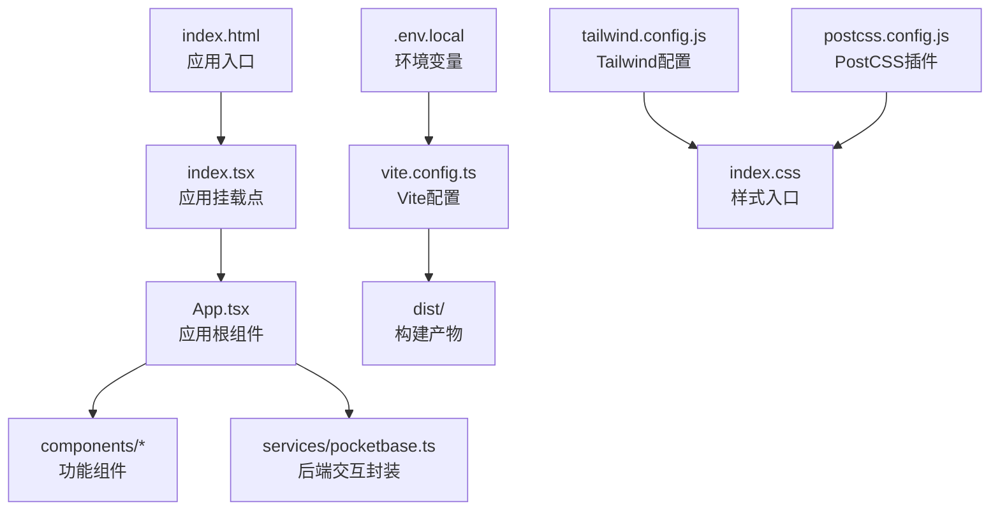
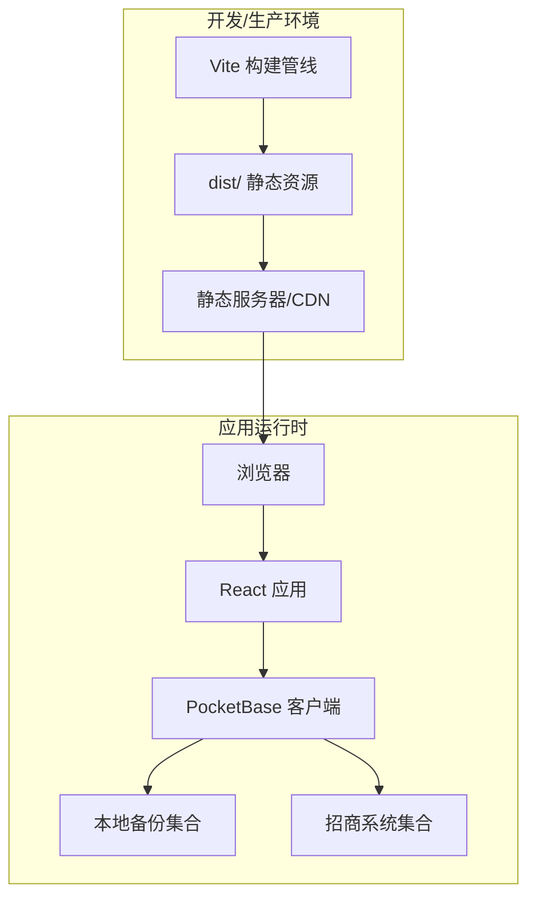
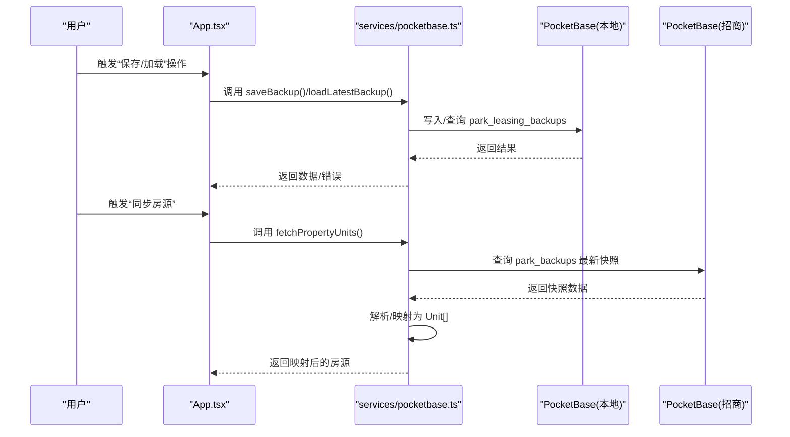
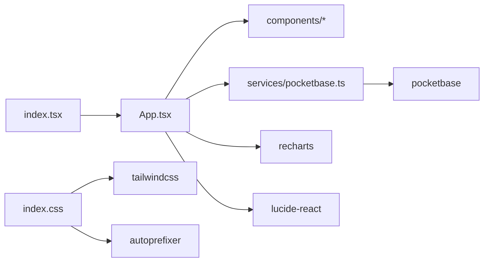

# 构建与部署

<cite>
**本文引用的文件**
- [package.json](file://package.json)
- [vite.config.ts](file://vite.config.ts)
- [index.html](file://index.html)
- [index.tsx](file://index.tsx)
- [index.css](file://index.css)
- [tailwind.config.js](file://tailwind.config.js)
- [postcss.config.js](file://postcss.config.js)
- [.env.local](file://.env.local)
- [README.md](file://README.md)
- [MIGRATION_SUMMARY.md](file://MIGRATION_SUMMARY.md)
- [services/pocketbase.ts](file://services/pocketbase.ts)
</cite>

## 目录
1. [简介](#简介)
2. [项目结构](#项目结构)
3. [核心组件](#核心组件)
4. [架构总览](#架构总览)
5. [详细组件分析](#详细组件分析)
6. [依赖关系分析](#依赖关系分析)
7. [性能考量](#性能考量)
8. [故障排查指南](#故障排查指南)
9. [结论](#结论)
10. [附录](#附录)

## 简介
本指南面向“上海商机及渠道管理系统（v5.0）”项目的构建与部署，聚焦于Vite构建配置优化、打包策略、资源优化与代码分割、生产环境构建流程（含环境变量注入、静态资源处理与缓存策略）、部署选项（静态文件部署、CDN配置、HTTPS设置）、CI/CD流水线与自动化测试集成、发布流程管理，以及部署故障排查与性能监控方案。文档内容严格基于仓库现有配置与实现，确保可操作性与可追溯性。

## 项目结构
该项目采用前端单页应用（SPA）架构，使用 React + TypeScript + TailwindCSS + PostCSS + Vite 开发，构建产物输出至 dist 目录，入口 HTML 与入口 TSX 分别位于根目录。TailwindCSS 与 PostCSS 通过配置文件启用按需扫描与自动前缀，环境变量通过 .env.local 注入，Vite 提供开发服务器与构建能力。

图表来源
- [index.html](file://index.html#L1-L14)
- [index.tsx](file://index.tsx#L1-L16)
- [App.tsx](file://App.tsx#L1-L588)
- [vite.config.ts](file://vite.config.ts#L1-L27)
- [tailwind.config.js](file://tailwind.config.js#L1-L13)
- [postcss.config.js](file://postcss.config.js#L1-L6)
- [.env.local](file://.env.local#L1-L4)

章节来源
- [index.html](file://index.html#L1-L14)
- [index.tsx](file://index.tsx#L1-L16)
- [vite.config.ts](file://vite.config.ts#L1-L27)
- [tailwind.config.js](file://tailwind.config.js#L1-L13)
- [postcss.config.js](file://postcss.config.js#L1-L6)
- [.env.local](file://.env.local#L1-L4)

## 核心组件
- Vite 构建配置：定义开发服务器端口与主机、插件、路径别名、依赖优化排除、环境变量注入等。
- React 入口：应用挂载与渲染，负责将根组件挂载到 DOM。
- 样式体系：TailwindCSS + PostCSS，按需扫描组件与模板，生成最小化样式。
- 环境变量：通过 .env.local 注入，Vite 在构建时以 define 方式注入到客户端代码。
- 后端交互：通过 PocketBase 客户端封装，实现备份保存、加载与房源同步。

章节来源
- [vite.config.ts](file://vite.config.ts#L5-L26)
- [index.tsx](file://index.tsx#L1-L16)
- [index.css](file://index.css#L1-L28)
- [tailwind.config.js](file://tailwind.config.js#L1-L13)
- [postcss.config.js](file://postcss.config.js#L1-L6)
- [.env.local](file://.env.local#L1-L4)
- [services/pocketbase.ts](file://services/pocketbase.ts#L1-L200)

## 架构总览
前端应用通过 Vite 构建，产出静态资源；运行时通过 PocketBase 读写本地备份与从招商系统同步房源数据。开发与生产环境均通过 Vite 管理，构建产物位于 dist 目录，可直接部署到静态服务器或 CDN。

图表来源
- [vite.config.ts](file://vite.config.ts#L5-L26)
- [services/pocketbase.ts](file://services/pocketbase.ts#L1-L200)

## 详细组件分析

### Vite 构建配置与优化
- 开发服务器：端口与主机开放，便于多机访问与容器化部署。
- 插件链：React 插件提供 JSX/TSX 支持与 HMR；可扩展其他插件（如压缩、分析）。
- 路径别名：将 @ 映射到项目根目录，简化导入路径。
- 依赖优化排除：将 pocketbase 排除在预构建之外，避免不必要的依赖扫描与打包。
- 环境变量注入：通过 define 将 API_KEY 注入到客户端代码，确保在构建阶段生效。
- 代码分割：Vite 默认按需分块；可通过动态 import 进一步优化路由与组件级别的分割。
- 静态资源处理：Vite 将静态资源哈希命名并输出到 dist/assets，配合 CDN 缓存策略。
- 生产构建：使用 npm run build 输出 dist，包含 HTML、JS、CSS、资源文件。

章节来源
- [vite.config.ts](file://vite.config.ts#L5-L26)
- [package.json](file://package.json#L6-L10)

### 样式与构建管线
- TailwindCSS：content 扫描范围覆盖根目录、src 与 components，确保按需生成样式。
- PostCSS：启用 tailwindcss 与 autoprefixer，自动添加浏览器前缀。
- 样式入口：index.css 引入 Tailwind 层与自定义滚动条样式。

章节来源
- [tailwind.config.js](file://tailwind.config.js#L1-L13)
- [postcss.config.js](file://postcss.config.js#L1-L6)
- [index.css](file://index.css#L1-L28)

### 环境变量与注入
- .env.local：包含 GEMINI_API_KEY、POCKETBASE_URL、POCKETBASE_PROPERTY_URL。
- Vite define：将 GEMINI_API_KEY 注入到 process.env.GEMINI_API_KEY，供运行时使用。
- 运行时读取：服务层通过 import.meta.env 读取 POCKETBASE_URL 等变量。

章节来源
- [.env.local](file://.env.local#L1-L4)
- [vite.config.ts](file://vite.config.ts#L13-L16)
- [services/pocketbase.ts](file://services/pocketbase.ts#L5-L12)

### 应用入口与挂载
- index.html：设置语言、字体、基础样式与入口脚本。
- index.tsx：创建根节点并挂载 App，包含严格模式包裹。

章节来源
- [index.html](file://index.html#L1-L14)
- [index.tsx](file://index.tsx#L1-L16)

### 后端交互与数据流
- 本地备份：通过 PocketBase 集合 park_leasing_backups 存储/更新最新快照。
- 房源同步：从招商系统 PocketBase 集合 park_backups 获取快照，解析并映射为本地 Unit 结构。
- 并发控制：更新最新备份采用乐观锁，检测冲突后重试合并。

图表来源
- [services/pocketbase.ts](file://services/pocketbase.ts#L50-L125)
- [services/pocketbase.ts](file://services/pocketbase.ts#L130-L200)

章节来源
- [services/pocketbase.ts](file://services/pocketbase.ts#L1-L200)

### 构建与发布流程（生产环境）
- 本地开发：npm run dev 启动 Vite 开发服务器。
- 生产构建：npm run build 生成 dist 目录。
- 预览：npm run preview 本地预览构建产物。
- 部署：将 dist 目录部署到静态服务器或 CDN；如需 HTTPS，可在反向代理或 CDN 层开启。

章节来源
- [package.json](file://package.json#L6-L10)
- [README.md](file://README.md#L11-L21)

### 代码分割与资源优化
- 路由级分割：建议将大型页面组件通过动态 import 实现懒加载。
- 第三方库：将不常变动的依赖（如 recharts、lucide-react）拆分为 vendor chunk。
- 图片与字体：通过 Vite 处理并生成哈希文件名，结合 CDN 缓存策略。
- Tree-shaking：确保模块化导入，减少无效代码进入产物。

（本节为通用实践说明，无需特定文件引用）

### 缓存策略
- 静态资源：dist/assets 下的文件名包含哈希，适合长期缓存；HTML 可短缓存或不缓存。
- 版本号：可在构建时注入版本号，用于刷新缓存。
- CDN：为静态资源配置长缓存（如一年），HTML 与动态接口短缓存或协商缓存。

（本节为通用实践说明，无需特定文件引用）

### 部署选项
- 静态文件部署：将 dist 目录上传至任意静态托管（如 GitHub Pages、Vercel、Nginx/Apache）。
- CDN 配置：启用 gzip/br 压缩、HTTP/2 或 HTTP/3、边缘缓存；为 JS/CSS 设置长缓存。
- HTTPS 设置：在反向代理（Nginx/Caddy）或 CDN 层启用 TLS；确保 API 域名与证书一致。

（本节为通用实践说明，无需特定文件引用）

### CI/CD 流水线与自动化
- 构建与测试：在 CI 中执行安装依赖、类型检查、单元测试、构建与预览。
- 发布策略：构建完成后上传 dist 到托管平台或 CDN；支持蓝绿/金丝雀发布。
- 环境变量：在 CI 中注入密钥与后端地址，避免硬编码。
- 自动化测试：结合 Vitest/Jest 与 Playwright（如需端到端测试）。

（本节为通用实践说明，无需特定文件引用）

## 依赖关系分析
- 应用入口依赖 React 与 ReactDOM，根组件负责状态管理与页面导航。
- 样式依赖 TailwindCSS 与 PostCSS，按需生成样式。
- 运行时依赖 PocketBase 客户端，实现备份与房源数据交互。
- 构建依赖 Vite、React 插件、TypeScript 类型检查。

图表来源
- [index.tsx](file://index.tsx#L1-L16)
- [App.tsx](file://App.tsx#L1-L588)
- [services/pocketbase.ts](file://services/pocketbase.ts#L1-L200)
- [index.css](file://index.css#L1-L28)
- [tailwind.config.js](file://tailwind.config.js#L1-L13)
- [postcss.config.js](file://postcss.config.js#L1-L6)

章节来源
- [package.json](file://package.json#L11-L26)
- [index.tsx](file://index.tsx#L1-L16)
- [App.tsx](file://App.tsx#L1-L588)
- [services/pocketbase.ts](file://services/pocketbase.ts#L1-L200)

## 性能考量
- 代码分割：按路由与组件拆分，减少首屏体积。
- 资源压缩：启用 JS/CSS 压缩与图片优化。
- 缓存策略：静态资源长缓存，HTML 短缓存或协商缓存。
- 预加载与预连接：对关键资源使用 preload/prefetch。
- 懒加载：图片与重型组件使用懒加载。
- Tailwind 按需：content 范围合理配置，避免生成冗余样式。

（本节为通用实践说明，无需特定文件引用）

## 故障排查指南
- 构建失败
  - 检查 Vite 配置与插件是否正确加载。
  - 确认环境变量文件存在且格式正确。
- 运行时错误
  - 确认 PocketBase 地址与端口可达，检查 CORS 配置。
  - 检查集合是否存在、字段是否匹配。
- 静态资源 404
  - 确认构建产物路径与服务器根目录一致。
  - 检查 CDN 缓存是否命中旧版本。
- API 跨域
  - 在 PocketBase 管理后台设置 Allowed Origins，添加前端域名。
- 端口占用
  - 开发服务器默认 3000，如被占用请修改 Vite server.port。

章节来源
- [MIGRATION_SUMMARY.md](file://MIGRATION_SUMMARY.md#L82-L87)
- [vite.config.ts](file://vite.config.ts#L8-L11)
- [.env.local](file://.env.local#L2-L4)

## 结论
本项目基于 Vite + React + TailwindCSS + PocketBase，具备清晰的构建与运行时架构。通过合理的代码分割、资源优化与缓存策略，可显著提升首屏性能与用户体验。结合静态托管或 CDN 的 HTTPS 部署，以及 CI/CD 自动化流水线，可实现稳定高效的发布与运维。

## 附录
- 快速启动与部署参考
  - 本地运行：安装依赖后，设置 .env.local 中的 API 与 PocketBase 地址，运行 npm run dev。
  - 生产构建：执行 npm run build，将 dist 目录部署到静态服务器或 CDN。
  - 迁移与配置：参考迁移摘要文档中的 PocketBase 配置步骤与启动流程。

章节来源
- [README.md](file://README.md#L11-L21)
- [MIGRATION_SUMMARY.md](file://MIGRATION_SUMMARY.md#L90-L111)