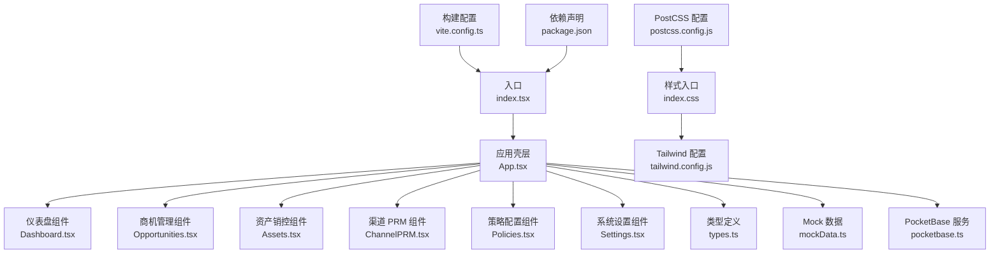
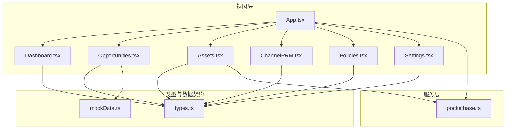
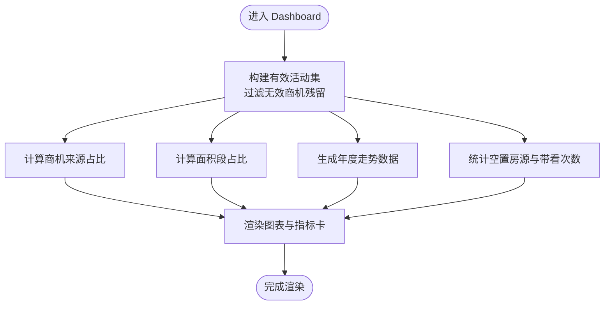
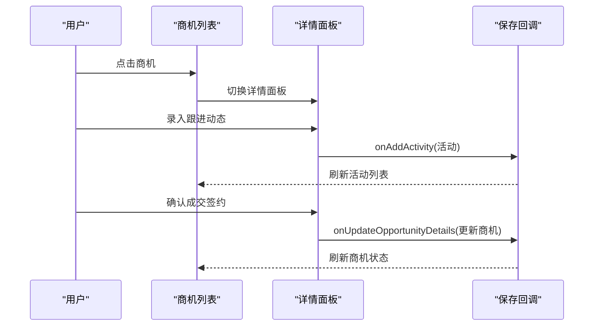
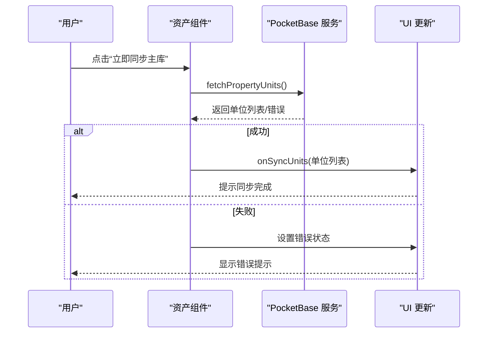
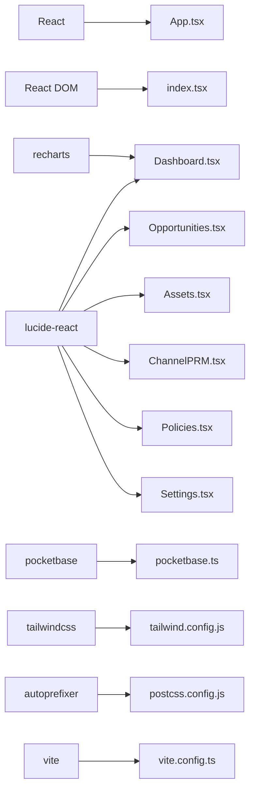

# 组件开发

<cite>
**本文引用的文件**
- [App.tsx](file://App.tsx)
- [index.tsx](file://index.tsx)
- [components/Dashboard.tsx](file://components/Dashboard.tsx)
- [components/Opportunities.tsx](file://components/Opportunities.tsx)
- [components/Assets.tsx](file://components/Assets.tsx)
- [components/ChannelPRM.tsx](file://components/ChannelPRM.tsx)
- [components/Settings.tsx](file://components/Settings.tsx)
- [components/Policies.tsx](file://components/Policies.tsx)
- [types.ts](file://types.ts)
- [services/mockData.ts](file://services/mockData.ts)
- [services/pocketbase.ts](file://services/pocketbase.ts)
- [tailwind.config.js](file://tailwind.config.js)
- [postcss.config.js](file://postcss.config.js)
- [index.css](file://index.css)
- [vite.config.ts](file://vite.config.ts)
- [package.json](file://package.json)
</cite>

## 目录
1. [简介](#简介)
2. [项目结构](#项目结构)
3. [核心组件](#核心组件)
4. [架构总览](#架构总览)
5. [详细组件分析](#详细组件分析)
6. [依赖关系分析](#依赖关系分析)
7. [性能考量](#性能考量)
8. [故障排查指南](#故障排查指南)
9. [结论](#结论)
10. [附录](#附录)

## 简介
本指南面向前端工程师与全栈开发者，系统梳理本项目中的组件开发方法论与最佳实践，涵盖函数组件与 Hooks 使用、状态管理策略、Props 接口设计、事件处理与生命周期管理、样式与响应式设计、主题定制、测试策略、性能优化与可访问性设计。文中结合真实组件文件进行代码级分析，并提供可视化图表帮助理解。

## 项目结构
项目采用以功能域划分的目录组织方式，核心入口位于根目录，组件集中于 components 目录，类型定义与服务层分别位于 types.ts 与 services 目录，样式通过 Tailwind CSS 与 PostCSS 配置统一管理，构建工具使用 Vite。

**图表来源**
- [index.tsx](file://index.tsx#L1-L16)
- [App.tsx](file://App.tsx#L1-L620)
- [components/Dashboard.tsx](file://components/Dashboard.tsx#L1-L315)
- [components/Opportunities.tsx](file://components/Opportunities.tsx#L1-L804)
- [components/Assets.tsx](file://components/Assets.tsx#L1-L368)
- [components/ChannelPRM.tsx](file://components/ChannelPRM.tsx#L1-L476)
- [components/Policies.tsx](file://components/Policies.tsx#L1-L382)
- [components/Settings.tsx](file://components/Settings.tsx#L1-L291)
- [types.ts](file://types.ts#L1-L261)
- [services/mockData.ts](file://services/mockData.ts#L1-L81)
- [services/pocketbase.ts](file://services/pocketbase.ts#L1-L226)
- [index.css](file://index.css#L1-L28)
- [tailwind.config.js](file://tailwind.config.js#L1-L13)
- [postcss.config.js](file://postcss.config.js#L1-L6)
- [vite.config.ts](file://vite.config.ts#L1-L27)
- [package.json](file://package.json#L1-L28)

**章节来源**
- [index.tsx](file://index.tsx#L1-L16)
- [vite.config.ts](file://vite.config.ts#L1-L27)
- [package.json](file://package.json#L1-L28)

## 核心组件
本项目的核心组件围绕“仪表盘、商机管理、资产销控、渠道 PRM、策略配置、系统设置”展开，均采用函数组件与 Hooks 管理状态与副作用，Props 接口清晰，事件处理与生命周期管理遵循 React 最佳实践。

- 仪表盘组件：负责多维度数据可视化与指标展示，使用 useMemo 优化数据计算与渲染。
- 商机管理组件：提供商机全生命周期管理、成交签约、流失归档、跟进轨迹等能力，大量使用 useMemo 过滤与聚合有效数据。
- 资产销控组件：对接外部资产库，支持云端同步、状态统计与房源编辑。
- 渠道 PRM 组件：管理渠道与代理、佣金统计与编辑。
- 策略配置组件：管理佣金政策与变更历史。
- 系统设置组件：个人档案维护、账户管理与备份列表。

**章节来源**
- [components/Dashboard.tsx](file://components/Dashboard.tsx#L1-L315)
- [components/Opportunities.tsx](file://components/Opportunities.tsx#L1-L804)
- [components/Assets.tsx](file://components/Assets.tsx#L1-L368)
- [components/ChannelPRM.tsx](file://components/ChannelPRM.tsx#L1-L476)
- [components/Policies.tsx](file://components/Policies.tsx#L1-L382)
- [components/Settings.tsx](file://components/Settings.tsx#L1-L291)

## 架构总览
应用采用“函数组件 + Hooks + 类型驱动 + 服务层”的分层架构。状态主要由父组件集中管理并通过 Props 下发，子组件通过回调函数向上游更新状态。数据持久化与云端同步通过服务层封装，类型系统贯穿前后端交互。

**图表来源**
- [App.tsx](file://App.tsx#L1-L620)
- [components/Dashboard.tsx](file://components/Dashboard.tsx#L1-L315)
- [components/Opportunities.tsx](file://components/Opportunities.tsx#L1-L804)
- [components/Assets.tsx](file://components/Assets.tsx#L1-L368)
- [components/ChannelPRM.tsx](file://components/ChannelPRM.tsx#L1-L476)
- [components/Policies.tsx](file://components/Policies.tsx#L1-L382)
- [components/Settings.tsx](file://components/Settings.tsx#L1-L291)
- [types.ts](file://types.ts#L1-L261)
- [services/mockData.ts](file://services/mockData.ts#L1-L81)
- [services/pocketbase.ts](file://services/pocketbase.ts#L1-L226)

## 详细组件分析

### 函数组件与 Hooks 使用
- 使用 useState 管理本地状态（模态框开关、表单字段、选中项等）。
- 使用 useEffect 执行副作用（定时同步、初始化加载、登录后同步）。
- 使用 useMemo 优化昂贵计算与过滤（商机/活动有效集、统计数据、排序与筛选）。
- 使用 useCallback 将回调稳定化，减少子组件重渲染。
- 使用 useRef 保存最新状态快照，避免闭包陷阱（如自动同步）。

示例路径
- [App.tsx](file://App.tsx#L179-L281)（useEffect、useMemo、useCallback、useRef）
- [components/Opportunities.tsx](file://components/Opportunities.tsx#L66-L71)（useEffect 计算月租金）
- [components/Dashboard.tsx](file://components/Dashboard.tsx#L25-L80)（useMemo 优化）

**章节来源**
- [App.tsx](file://App.tsx#L179-L281)
- [components/Opportunities.tsx](file://components/Opportunities.tsx#L66-L71)
- [components/Dashboard.tsx](file://components/Dashboard.tsx#L25-L80)

### Props 接口设计
- Props 明确职责边界：上游只传递必要数据与回调，下游只消费与触发。
- 可选与必填清晰标注，避免运行时错误。
- 对复杂对象（如 Opportunity、Commission、Unit）使用类型别名，提升可读性与一致性。

示例路径
- [components/Dashboard.tsx](file://components/Dashboard.tsx#L7-L15)（DashboardProps）
- [components/Opportunities.tsx](file://components/Opportunities.tsx#L6-L26)（OpportunitiesProps）
- [components/Assets.tsx](file://components/Assets.tsx#L7-L14)（AssetsProps）
- [components/ChannelPRM.tsx](file://components/ChannelPRM.tsx#L6-L19)（ChannelPRMProps）
- [components/Policies.tsx](file://components/Policies.tsx#L6-L12)（PoliciesProps）
- [components/Settings.tsx](file://components/Settings.tsx#L7-L13)（SettingsProps）

**章节来源**
- [components/Dashboard.tsx](file://components/Dashboard.tsx#L7-L15)
- [components/Opportunities.tsx](file://components/Opportunities.tsx#L6-L26)
- [components/Assets.tsx](file://components/Assets.tsx#L7-L14)
- [components/ChannelPRM.tsx](file://components/ChannelPRM.tsx#L6-L19)
- [components/Policies.tsx](file://components/Policies.tsx#L6-L12)
- [components/Settings.tsx](file://components/Settings.tsx#L7-L13)

### 事件处理机制
- 表单输入通过受控组件处理，onChange 同步更新本地状态。
- 模态框通过布尔状态控制显隐，保存按钮调用回调并清理状态。
- 列表项点击切换详情面板，避免重复渲染。
- 权限控制：仅管理员可执行删除、编辑等危险操作。

示例路径
- [components/Opportunities.tsx](file://components/Opportunities.tsx#L107-L136)（成交确认与流失归档）
- [components/Assets.tsx](file://components/Assets.tsx#L96-L107)（新增/编辑保存）
- [components/ChannelPRM.tsx](file://components/ChannelPRM.tsx#L128-L149)（渠道保存）
- [components/Policies.tsx](file://components/Policies.tsx#L39-L70)（政策保存）

**章节来源**
- [components/Opportunities.tsx](file://components/Opportunities.tsx#L107-L136)
- [components/Assets.tsx](file://components/Assets.tsx#L96-L107)
- [components/ChannelPRM.tsx](file://components/ChannelPRM.tsx#L128-L149)
- [components/Policies.tsx](file://components/Policies.tsx#L39-L70)

### 生命周期管理
- 初始化：组件挂载时读取本地缓存与 Mock 数据，确保首次渲染可用。
- 更新：useEffect 监听状态变化，触发本地存储与云端同步。
- 销毁：清理定时器与副作用，避免内存泄漏。

示例路径
- [App.tsx](file://App.tsx#L196-L252)（初始化状态与本地缓存）
- [App.tsx](file://App.tsx#L260-L281)（useEffect 触发自动同步）
- [components/Assets.tsx](file://components/Assets.tsx#L32-L34)（useEffect 初始化同步）

**章节来源**
- [App.tsx](file://App.tsx#L196-L252)
- [App.tsx](file://App.tsx#L260-L281)
- [components/Assets.tsx](file://components/Assets.tsx#L32-L34)

### 状态管理策略
- 集中式状态：App.tsx 统一管理应用级状态（用户、商机、资产、佣金、规则等）。
- 单向数据流：通过 Props 下发，通过回调上行更新。
- 本地持久化：使用 localStorage 缓存应用数据与认证信息。
- 云端聚合：通过 PocketBase 快照合并策略，保证并发安全与数据一致性。

示例路径
- [App.tsx](file://App.tsx#L179-L378)（状态集中与聚合逻辑）
- [services/pocketbase.ts](file://services/pocketbase.ts#L146-L179)（乐观锁更新最新备份）
- [services/pocketbase.ts](file://services/pocketbase.ts#L184-L204)（加载最新备份）

**章节来源**
- [App.tsx](file://App.tsx#L179-L378)
- [services/pocketbase.ts](file://services/pocketbase.ts#L146-L179)
- [services/pocketbase.ts](file://services/pocketbase.ts#L184-L204)

### 组件样式编写规范
- 使用 Tailwind CSS 类名，遵循语义化命名与原子化风格。
- 响应式设计：使用断点类名适配不同屏幕尺寸。
- 主题定制：通过 tailwind.config.js 的 theme.extend 扩展颜色与字体。
- 自定义滚动条：通过 index.css 的自定义工具类实现一致的滚动条样式。

示例路径
- [index.css](file://index.css#L11-L27)（自定义滚动条）
- [tailwind.config.js](file://tailwind.config.js#L1-L13)（内容扫描与主题扩展）
- [postcss.config.js](file://postcss.config.js#L1-L6)（PostCSS 插件链）

**章节来源**
- [index.css](file://index.css#L11-L27)
- [tailwind.config.js](file://tailwind.config.js#L1-L13)
- [postcss.config.js](file://postcss.config.js#L1-L6)

### 组件测试策略
- 单元测试：针对纯函数与 Hook 辅助函数（如数据计算、过滤逻辑）编写测试。
- 集成测试：模拟 Props 与回调，验证组件渲染与交互行为。
- 端到端测试：使用自动化测试框架覆盖关键流程（登录、同步、新增/编辑、删除）。
- 可访问性测试：确保键盘导航、焦点顺序与 ARIA 属性正确。

[本节为通用指导，无需特定文件引用]

### 性能优化技巧
- 使用 useMemo 与 useCallback 缓存昂贵计算与回调。
- 列表渲染使用稳定 key，避免不必要的重排。
- 按需渲染：详情面板与模态框仅在需要时渲染。
- 异步加载与防抖：自动同步使用防抖与并发冲突处理。
- 图表与大数据集：使用 ResponsiveContainer 与虚拟滚动（如需）降低渲染压力。

示例路径
- [components/Dashboard.tsx](file://components/Dashboard.tsx#L25-L80)（useMemo 优化）
- [components/Opportunities.tsx](file://components/Opportunities.tsx#L60-L64)（有效活动集过滤）
- [App.tsx](file://App.tsx#L260-L281)（自动同步防抖）

**章节来源**
- [components/Dashboard.tsx](file://components/Dashboard.tsx#L25-L80)
- [components/Opportunities.tsx](file://components/Opportunities.tsx#L60-L64)
- [App.tsx](file://App.tsx#L260-L281)

### 可访问性设计原则
- 语义化标签：使用 h1-h6、p、ul/li 等语义化元素。
- 键盘可达：确保所有交互可通过 Tab 键聚焦，Enter/Space 触发。
- 文本对比度：确保文本与背景满足对比度要求。
- 屏幕阅读器友好：为图标与按钮提供替代文本或隐藏文本。
- 焦点可见：为可聚焦元素提供可见焦点指示器。

[本节为通用指导，无需特定文件引用]

### 具体组件开发示例与最佳实践

#### 仪表盘组件（Dashboard）
- 设计要点：多图表组合、指标面板、年份切换。
- 性能优化：useMemo 计算来源占比、面积段占比、走势数据、空置房源统计。
- 样式规范：卡片圆角、阴影、渐变背景与图标对齐。

**图表来源**
- [components/Dashboard.tsx](file://components/Dashboard.tsx#L25-L89)

**章节来源**
- [components/Dashboard.tsx](file://components/Dashboard.tsx#L20-L315)

#### 商机管理组件（Opportunities）
- 设计要点：列表/详情双栏布局、状态切换（招商中/流失）、跟进轨迹、成交签约、流失归档。
- 性能优化：useMemo 过滤有效商机与活动，计算用户绩效与逾期状态。
- 交互细节：置顶、删除、编辑、新增、模态框联动。

**图表来源**
- [components/Opportunities.tsx](file://components/Opportunities.tsx#L420-L496)

**章节来源**
- [components/Opportunities.tsx](file://components/Opportunities.tsx#L28-L506)

#### 资产销控组件（Assets）
- 设计要点：楼宇/楼层筛选、房源卡片状态色、空置天数计算、云端同步状态。
- 交互细节：新增/编辑模态框、同步按钮、错误提示。
- 服务集成：对接外部资产库，解析并映射为内部 Unit 结构。

**图表来源**
- [components/Assets.tsx](file://components/Assets.tsx#L109-L142)
- [services/pocketbase.ts](file://services/pocketbase.ts#L50-L125)

**章节来源**
- [components/Assets.tsx](file://components/Assets.tsx#L16-L368)
- [services/pocketbase.ts](file://services/pocketbase.ts#L50-L125)

#### 渠道 PRM 组件（ChannelPRM）
- 设计要点：渠道与代理管理、佣金统计、共享权限、搜索与排序。
- 性能优化：useMemo 计算渠道统计与有效用户列表降级读取。

**章节来源**
- [components/ChannelPRM.tsx](file://components/ChannelPRM.tsx#L21-L200)

#### 策略配置组件（Policies）
- 设计要点：佣金规则编辑、分期计划校验、历史记录查看。
- 交互细节：新增/编辑/删除、启用/禁用、校验比例之和。

**章节来源**
- [components/Policies.tsx](file://components/Policies.tsx#L14-L200)

#### 系统设置组件（Settings）
- 设计要点：个人档案维护、账户管理、备份列表。
- 安全注意：管理员权限控制、重复用户名校验、当前会话同步。

**章节来源**
- [components/Settings.tsx](file://components/Settings.tsx#L17-L200)

## 依赖关系分析
- React 生态：React、React DOM、lucide-react、recharts。
- 构建与样式：Vite、Tailwind CSS、PostCSS、autoprefixer。
- 数据与云：pocketbase（本地与资产库）。

**图表来源**
- [package.json](file://package.json#L11-L26)
- [index.tsx](file://index.tsx#L1-L16)
- [App.tsx](file://App.tsx#L1-L14)
- [tailwind.config.js](file://tailwind.config.js#L1-L13)
- [postcss.config.js](file://postcss.config.js#L1-L6)
- [vite.config.ts](file://vite.config.ts#L1-L27)
- [services/pocketbase.ts](file://services/pocketbase.ts#L1-L12)

**章节来源**
- [package.json](file://package.json#L11-L26)

## 性能考量
- 渲染优化：合理使用 useMemo/useCallback，避免不必要的重渲染。
- 数据过滤：在上游构建有效数据集，减少下游重复计算。
- 异步与并发：使用乐观锁与冲突检测，保障数据一致性。
- 样式体积：按需引入图标与图表，避免打包冗余。
- 构建优化：Vite 默认开启模块预构建与热更新，生产构建压缩资源。

[本节为通用指导，无需特定文件引用]

## 故障排查指南
- 云端同步失败：检查 PocketBase 地址与网络连通性，查看错误提示与状态码。
- 数据不一致：确认合并策略与删除标记（deletedIds）是否正确传播。
- 本地缓存异常：清理 localStorage 并重启应用，确认初始化逻辑。
- 样式不生效：检查 Tailwind 内容扫描路径与自定义工具类是否正确引入。

**章节来源**
- [services/pocketbase.ts](file://services/pocketbase.ts#L184-L204)
- [App.tsx](file://App.tsx#L302-L329)

## 结论
本项目通过函数组件与 Hooks 的组合，实现了清晰的状态管理与高效的渲染性能；通过类型系统与服务层封装，提升了可维护性与可扩展性；借助 Tailwind CSS 与响应式设计，提供了良好的用户体验。建议在后续迭代中补充单元测试与端到端测试，持续优化性能与可访问性。

## 附录
- 入口与构建：入口文件、Vite 配置、依赖声明。
- 样式与主题：Tailwind 配置、PostCSS 插件、自定义滚动条。
- 类型与服务：类型定义、Mock 数据、PocketBase 服务。

**章节来源**
- [index.tsx](file://index.tsx#L1-L16)
- [vite.config.ts](file://vite.config.ts#L1-L27)
- [package.json](file://package.json#L1-L28)
- [tailwind.config.js](file://tailwind.config.js#L1-L13)
- [postcss.config.js](file://postcss.config.js#L1-L6)
- [index.css](file://index.css#L1-L28)
- [types.ts](file://types.ts#L1-L261)
- [services/mockData.ts](file://services/mockData.ts#L1-L81)
- [services/pocketbase.ts](file://services/pocketbase.ts#L1-L226)