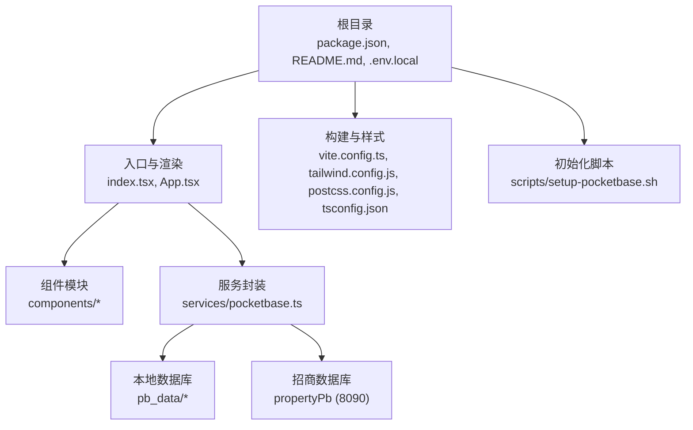
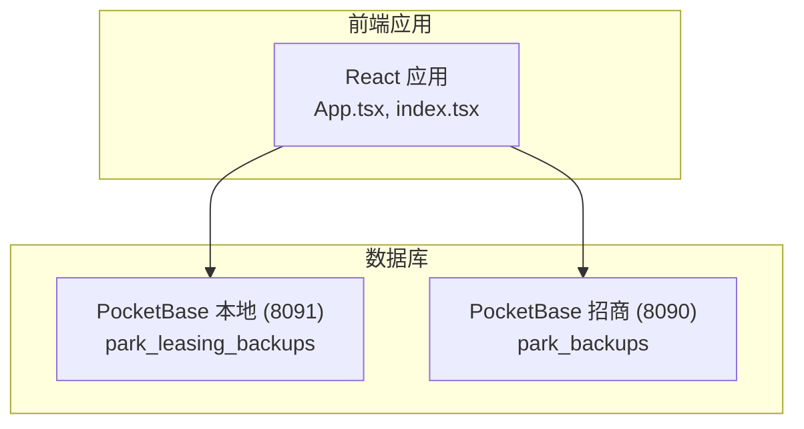
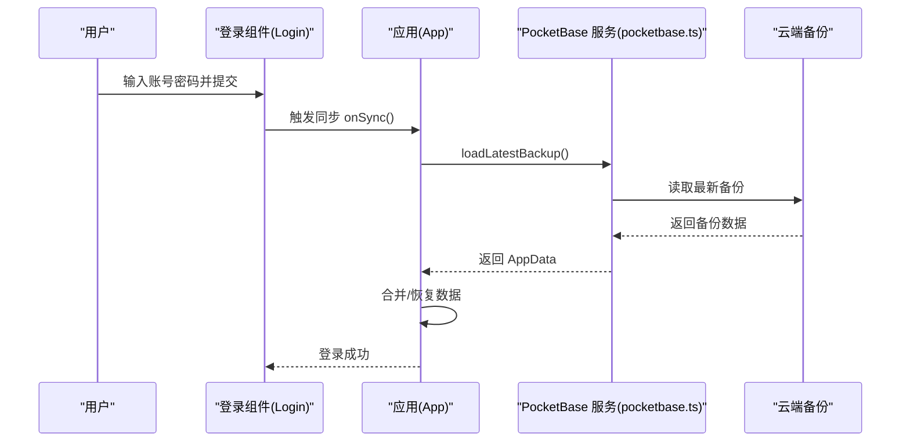
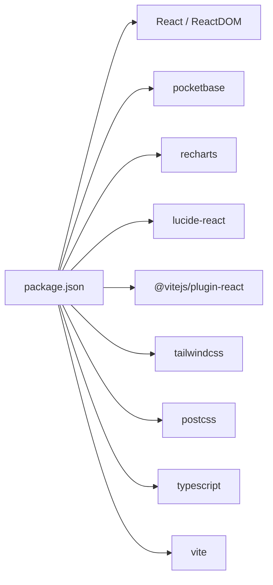

# 快速开始

<cite>
**本文引用的文件**
- [package.json](file://package.json)
- [README.md](file://README.md)
- [.env.local](file://.env.local)
- [vite.config.ts](file://vite.config.ts)
- [scripts/setup-pocketbase.sh](file://scripts/setup-pocketbase.sh)
- [services/pocketbase.ts](file://services/pocketbase.ts)
- [index.tsx](file://index.tsx)
- [App.tsx](file://App.tsx)
- [types.ts](file://types.ts)
- [tailwind.config.js](file://tailwind.config.js)
- [postcss.config.js](file://postcss.config.js)
- [tsconfig.json](file://tsconfig.json)
</cite>

## 目录
1. [简介](#简介)
2. [项目结构](#项目结构)
3. [核心组件](#核心组件)
4. [架构总览](#架构总览)
5. [详细组件分析](#详细组件分析)
6. [依赖关系分析](#依赖关系分析)
7. [性能注意事项](#性能注意事项)
8. [故障排除指南](#故障排除指南)
9. [结论](#结论)
10. [附录](#附录)

## 简介
本指南面向初学者，帮助你在本地快速搭建“上海商机及渠道管理系统（v5.0）”。你将完成环境准备、安装依赖、配置 Gemini API 密钥与 PocketBase 数据库、启动开发服务器，并进行基本功能验证。文档同时提供常见问题排查与验证步骤，确保你能顺利运行系统。

## 项目结构
该系统采用前端单页应用（React + TypeScript），通过 Vite 提供开发服务器，TailwindCSS 作为样式框架，PocketBase 作为本地与招商系统的双数据库后端。关键目录与文件如下：
- 根目录包含入口文件、配置文件与脚本
- components 存放页面组件
- services 封装数据访问与同步逻辑
- pb_data 与 pb_migrations 为 PocketBase 的本地数据与迁移文件
- scripts 提供数据库初始化与数据导出脚本

图表来源
- [index.tsx](file://index.tsx#L1-L16)
- [App.tsx](file://App.tsx#L1-L620)
- [vite.config.ts](file://vite.config.ts#L1-L27)
- [tailwind.config.js](file://tailwind.config.js#L1-L13)
- [postcss.config.js](file://postcss.config.js#L1-L6)
- [tsconfig.json](file://tsconfig.json#L1-L29)
- [services/pocketbase.ts](file://services/pocketbase.ts#L1-L226)
- [scripts/setup-pocketbase.sh](file://scripts/setup-pocketbase.sh#L1-L55)

章节来源
- [package.json](file://package.json#L1-L28)
- [README.md](file://README.md#L1-L21)
- [vite.config.ts](file://vite.config.ts#L1-L27)
- [tailwind.config.js](file://tailwind.config.js#L1-L13)
- [postcss.config.js](file://postcss.config.js#L1-L6)
- [tsconfig.json](file://tsconfig.json#L1-L29)

## 核心组件
- 开发服务器与构建工具：Vite（开发端口 3000，默认主机 0.0.0.0）
- 前端框架：React 19 与 TypeScript
- 样式框架：TailwindCSS + PostCSS
- 数据访问：PocketBase 客户端（本地 8091，招商系统 8090）
- 环境变量：GEMINI_API_KEY、POCKETBASE_URL、POCKETBASE_PROPERTY_URL

章节来源
- [package.json](file://package.json#L6-L10)
- [vite.config.ts](file://vite.config.ts#L8-L11)
- [services/pocketbase.ts](file://services/pocketbase.ts#L5-L12)
- [.env.local](file://.env.local#L1-L4)

## 架构总览
系统采用“前端应用 + 双数据库”的架构：
- 前端通过 PocketBase 客户端连接本地数据库（8091）与招商系统数据库（8090）
- 登录时可选择与云端数据进行聚合或全量同步
- 数据变更通过防抖自动同步至云端，支持并发冲突处理

图表来源
- [services/pocketbase.ts](file://services/pocketbase.ts#L5-L12)
- [App.tsx](file://App.tsx#L179-L493)

章节来源
- [services/pocketbase.ts](file://services/pocketbase.ts#L1-L226)
- [App.tsx](file://App.tsx#L179-L493)

## 详细组件分析

### 环境与依赖准备
- Node.js 版本：根据项目配置，使用现代 Node.js 运行时（建议使用长期支持版本 LTS）
- 包管理器：npm（项目中使用 npm run dev/build/preview）

章节来源
- [package.json](file://package.json#L1-L28)
- [README.md](file://README.md#L13-L20)

### 安装与启动步骤
1) 安装依赖
- 在项目根目录执行安装命令以拉取依赖
- 参考路径：[package.json](file://package.json#L16-L18)

2) 配置环境变量
- 复制示例环境文件并在本地创建 .env.local
- 设置 GEMINI_API_KEY、POCKETBASE_URL、POCKETBASE_PROPERTY_URL
- 参考路径：[.env.local](file://.env.local#L1-L4)

3) 启动开发服务器
- 执行开发命令启动 Vite 本地服务（默认端口 3000）
- 参考路径：[package.json](file://package.json#L7-L9)，[vite.config.ts](file://vite.config.ts#L8-L11)

4) 启动 PocketBase（本地与招商数据库）
- 本地数据库（8091）：参考初始化脚本中的说明，先启动服务再进行后续操作
- 招商数据库（8090）：按需启动，用于资产数据同步
- 参考路径：[scripts/setup-pocketbase.sh](file://scripts/setup-pocketbase.sh#L8-L17)，[services/pocketbase.ts](file://services/pocketbase.ts#L5-L12)

5) 首次登录与数据同步
- 登录后可选择“增量聚合”或“全量同步”，系统会自动与云端数据对齐
- 参考路径：[App.tsx](file://App.tsx#L485-L493)，[services/pocketbase.ts](file://services/pocketbase.ts#L184-L204)

章节来源
- [README.md](file://README.md#L16-L20)
- [.env.local](file://.env.local#L1-L4)
- [package.json](file://package.json#L6-L10)
- [vite.config.ts](file://vite.config.ts#L8-L11)
- [scripts/setup-pocketbase.sh](file://scripts/setup-pocketbase.sh#L8-L17)
- [services/pocketbase.ts](file://services/pocketbase.ts#L5-L12)
- [App.tsx](file://App.tsx#L485-L493)

### 数据库初始化与校验
- 本地数据库初始化
  - 使用初始化脚本提示在管理后台创建 park_leasing_backups 集合，并添加必要字段
  - 参考路径：[scripts/setup-pocketbase.sh](file://scripts/setup-pocketbase.sh#L21-L50)

- 招商数据库数据同步
  - 系统会从 propertyPb 的 park_backups 集合读取最新快照并解析为本地单位数据
  - 参考路径：[services/pocketbase.ts](file://services/pocketbase.ts#L50-L125)

- 数据一致性与并发控制
  - 云端更新采用“更新最新备份”策略，支持并发冲突检测与重合并
  - 参考路径：[services/pocketbase.ts](file://services/pocketbase.ts#L146-L179)

章节来源
- [scripts/setup-pocketbase.sh](file://scripts/setup-pocketbase.sh#L21-L50)
- [services/pocketbase.ts](file://services/pocketbase.ts#L50-L125)
- [services/pocketbase.ts](file://services/pocketbase.ts#L146-L179)

### 登录与数据流

图表来源
- [App.tsx](file://App.tsx#L77-L104)
- [App.tsx](file://App.tsx#L302-L329)
- [services/pocketbase.ts](file://services/pocketbase.ts#L184-L204)

章节来源
- [App.tsx](file://App.tsx#L77-L104)
- [App.tsx](file://App.tsx#L302-L329)
- [services/pocketbase.ts](file://services/pocketbase.ts#L184-L204)

### 数据模型与状态
- 应用数据结构（AppData）包含商机、渠道、佣金、单位、规则、活动、用户、设置与删除标记
- 状态持久化与自动同步：本地 localStorage + 云端 PocketBase
- 参考路径：[types.ts](file://types.ts#L240-L261)，[App.tsx](file://App.tsx#L17-L75)

章节来源
- [types.ts](file://types.ts#L240-L261)
- [App.tsx](file://App.tsx#L17-L75)

## 依赖关系分析
- 前端依赖：React、React DOM、Lucide React、Recharts、PocketBase
- 开发依赖：@vitejs/plugin-react、TailwindCSS、PostCSS、TypeScript、Vite
- 构建与运行：Vite 提供开发服务器与打包能力；TailwindCSS 与 PostCSS 负责样式管线

图表来源
- [package.json](file://package.json#L11-L26)

章节来源
- [package.json](file://package.json#L11-L26)

## 性能注意事项
- 自动同步防抖：数据变更后 3 秒内防抖，避免频繁写入云端
- 并发冲突处理：检测到冲突时自动重合并更新
- 图表渲染优化：使用 React.memo 与 useMemo 缓存计算结果，减少不必要的重渲染
- 建议：在开发阶段保持本地数据库与招商数据库稳定运行，避免频繁重启导致重复同步

章节来源
- [App.tsx](file://App.tsx#L264-L281)
- [services/pocketbase.ts](file://services/pocketbase.ts#L174-L178)

## 故障排除指南
- 无法连接 PocketBase（8091/8090）
  - 确认服务已启动且端口可用
  - 检查 .env.local 中的 POCKETBASE_URL 与 POCKETBASE_PROPERTY_URL
  - 参考路径：[scripts/setup-pocketbase.sh](file://scripts/setup-pocketbase.sh#L13-L17)，[services/pocketbase.ts](file://services/pocketbase.ts#L5-L12)，[.env.local](file://.env.local#L2-L3)

- 登录后无数据或同步失败
  - 确认云端存在最新备份；如不存在，先创建并填充数据
  - 检查集合字段与 API 规则（无认证访问）
  - 参考路径：[scripts/setup-pocketbase.sh](file://scripts/setup-pocketbase.sh#L21-L50)，[services/pocketbase.ts](file://services/pocketbase.ts#L184-L204)

- 本地开发服务器无法启动
  - 确认端口 3000 未被占用；可在 vite.config.ts 中调整端口与主机
  - 参考路径：[vite.config.ts](file://vite.config.ts#L8-L11)

- 样式未生效
  - 确认 TailwindCSS 已正确配置，content 路径包含组件目录
  - 参考路径：[tailwind.config.js](file://tailwind.config.js#L3-L7)

- TypeScript 类型错误
  - 检查 tsconfig.json 的模块解析与路径别名配置
  - 参考路径：[tsconfig.json](file://tsconfig.json#L21-L25)

章节来源
- [scripts/setup-pocketbase.sh](file://scripts/setup-pocketbase.sh#L13-L17)
- [services/pocketbase.ts](file://services/pocketbase.ts#L5-L12)
- [.env.local](file://.env.local#L2-L3)
- [vite.config.ts](file://vite.config.ts#L8-L11)
- [tailwind.config.js](file://tailwind.config.js#L3-L7)
- [tsconfig.json](file://tsconfig.json#L21-L25)

## 结论
通过以上步骤，你可以在本地完成环境准备、数据库初始化、密钥配置与开发服务器启动，并成功登录系统进行数据同步与日常操作。遇到问题时，可依据故障排除指南逐项验证。建议在开发过程中保持数据库稳定运行，充分利用自动同步与冲突处理机制，确保数据一致性与开发效率。

## 附录
- 快速验证清单
  - 已安装依赖并可执行 npm run dev
  - 已设置 .env.local 中的 GEMINI_API_KEY、POCKETBASE_URL、POCKETBASE_PROPERTY_URL
  - 本地与招商数据库均已启动并可通过脚本检测
  - 登录后可选择“增量聚合”或“全量同步”，界面显示云端就绪状态
  - 修改数据后 3 秒内自动同步至云端，无频繁闪烁

章节来源
- [README.md](file://README.md#L16-L20)
- [.env.local](file://.env.local#L1-L4)
- [scripts/setup-pocketbase.sh](file://scripts/setup-pocketbase.sh#L13-L17)
- [App.tsx](file://App.tsx#L524-L542)
- [services/pocketbase.ts](file://services/pocketbase.ts#L264-L281)