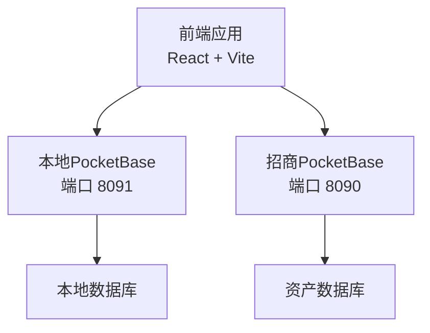
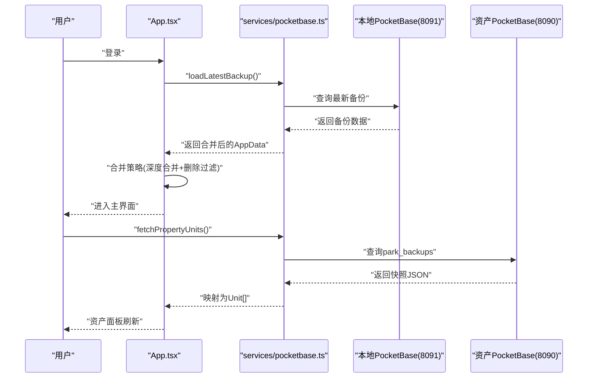
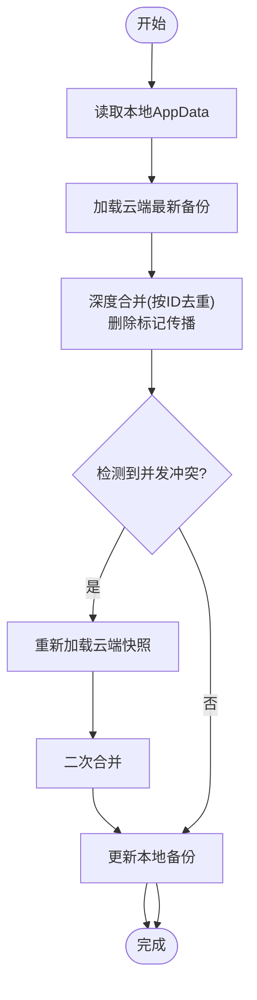
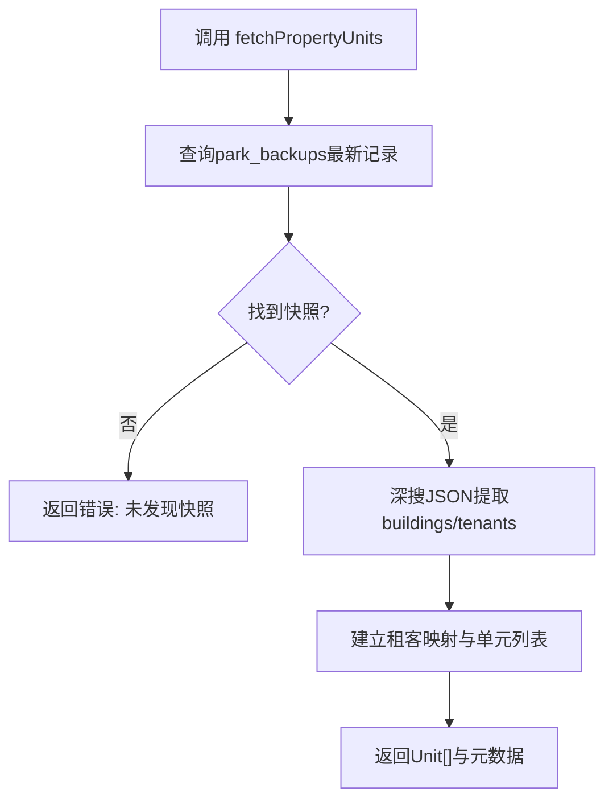
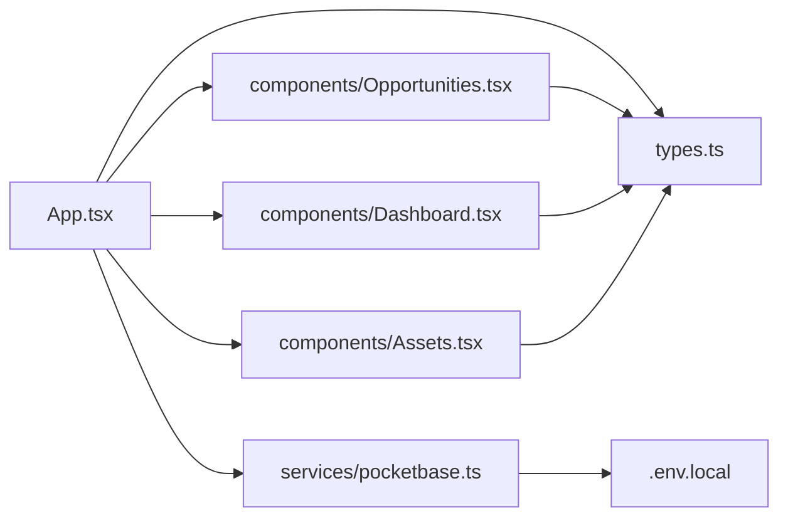

# 故障排查

<cite>
**本文引用的文件**
- [README.md](file://README.md)
- [package.json](file://package.json)
- [App.tsx](file://App.tsx)
- [services/pocketbase.ts](file://services/pocketbase.ts)
- [types.ts](file://types.ts)
- [components/Dashboard.tsx](file://components/Dashboard.tsx)
- [components/Opportunities.tsx](file://components/Opportunities.tsx)
- [components/Assets.tsx](file://components/Assets.tsx)
- [services/mockData.ts](file://services/mockData.ts)
- [.env.local](file://.env.local)
- [scripts/setup-pocketbase.sh](file://scripts/setup-pocketbase.sh)
- [MIGRATION_SUMMARY.md](file://MIGRATION_SUMMARY.md)
</cite>

## 目录
1. [简介](#简介)
2. [项目结构](#项目结构)
3. [核心组件](#核心组件)
4. [架构总览](#架构总览)
5. [详细组件分析](#详细组件分析)
6. [依赖关系分析](#依赖关系分析)
7. [性能考量](#性能考量)
8. [故障排查指南](#故障排查指南)
9. [结论](#结论)
10. [附录](#附录)

## 简介
本指南面向技术支持与运维团队，聚焦“上海商机及渠道管理系统”的常见故障场景，提供系统化的诊断思路、解决方案与预防措施。内容涵盖数据同步问题、PocketBase连接异常、组件渲染错误、性能问题等，并给出健康检查清单、监控指标与容量规划建议。

## 项目结构
系统采用前端单页应用（React + Vite），通过 PocketBase 提供两类数据服务：
- 本地备份与业务快照：端口 8091
- 招商管理资产数据源：端口 8090

图表来源
- [App.tsx](file://App.tsx#L1-L620)
- [services/pocketbase.ts](file://services/pocketbase.ts#L1-L226)
- [.env.local](file://.env.local#L1-L4)

章节来源
- [README.md](file://README.md#L1-L21)
- [package.json](file://package.json#L1-L28)
- [.env.local](file://.env.local#L1-L4)

## 核心组件
- 应用入口与状态管理：负责用户登录、云端数据拉取与合并、本地持久化、自动同步与冲突处理。
- 数据服务层：封装对两个 PocketBase 实例的读写、资产同步与备份管理。
- 业务组件：仪表盘、商机管理、资产销控、佣金结算、渠道管理、策略配置、系统设置。
- 类型定义：统一的数据模型与枚举，确保前后端一致性。

章节来源
- [App.tsx](file://App.tsx#L1-L620)
- [services/pocketbase.ts](file://services/pocketbase.ts#L1-L226)
- [types.ts](file://types.ts#L1-L261)
- [components/Dashboard.tsx](file://components/Dashboard.tsx#L1-L315)
- [components/Opportunities.tsx](file://components/Opportunities.tsx#L1-L804)
- [components/Assets.tsx](file://components/Assets.tsx#L1-L368)

## 架构总览
系统采用“前端直连两套 PocketBase”的架构，通过服务层抽象实现：
- 本地备份：保存业务快照，支持增量合并与并发冲突检测。
- 资产同步：从招商管理的 PocketBase 拉取资产快照，映射为本地 Unit 结构。
- 登录与同步：登录前先拉取云端最新快照，再进行本地校验，保证数据一致性。

图表来源
- [App.tsx](file://App.tsx#L302-L378)
- [services/pocketbase.ts](file://services/pocketbase.ts#L50-L125)

## 详细组件分析

### 数据合并与冲突处理（App.tsx）
- 深度合并策略：以 ID 为主键去重，云端优先，本地覆盖，支持删除标记传播，防止“僵尸子数据复活”。
- 并发冲突：更新本地最新备份时，若检测到冲突，自动重新拉取并二次合并。
- 自动同步：本地数据变更后 3 秒防抖，避免频繁写入。

图表来源
- [App.tsx](file://App.tsx#L17-L75)
- [App.tsx](file://App.tsx#L331-L378)

章节来源
- [App.tsx](file://App.tsx#L17-L75)
- [App.tsx](file://App.tsx#L331-L378)

### 资产同步与状态映射（services/pocketbase.ts）
- 从招商管理的 PocketBase 读取最新快照，定位 buildings/tenants 等关键容器。
- 将租客映射到对应单元，生成本地 Unit 列表。
- 错误处理：返回结构包含 error 字段，便于上层展示与告警。

图表来源
- [services/pocketbase.ts](file://services/pocketbase.ts#L50-L125)

章节来源
- [services/pocketbase.ts](file://services/pocketbase.ts#L50-L125)

### 业务组件渲染与性能（Dashboard/Opportunities/Assets）
- Dashboard：基于有效商机轨迹过滤，避免无效活动导致统计偏差。
- Opportunities：根据当前用户角色与创建者限制可见范围，使用 useMemo 降低重算成本。
- Assets：连接态指示、错误提示、同步元数据展示，支持手动触发同步。

章节来源
- [components/Dashboard.tsx](file://components/Dashboard.tsx#L25-L30)
- [components/Opportunities.tsx](file://components/Opportunities.tsx#L60-L64)
- [components/Assets.tsx](file://components/Assets.tsx#L109-L142)

## 依赖关系分析
- 前端依赖：React、React DOM、Recharts、Lucide React、PocketBase SDK。
- 环境变量：POCKETBASE_URL、POCKETBASE_PROPERTY_URL、GEMINI_API_KEY。
- 服务层：封装对两个 PocketBase 实例的访问，提供统一接口。

图表来源
- [App.tsx](file://App.tsx#L1-L15)
- [services/pocketbase.ts](file://services/pocketbase.ts#L1-L12)
- [types.ts](file://types.ts#L1-L261)
- [components/Dashboard.tsx](file://components/Dashboard.tsx#L1-L15)
- [components/Opportunities.tsx](file://components/Opportunities.tsx#L1-L26)
- [components/Assets.tsx](file://components/Assets.tsx#L1-L14)
- [.env.local](file://.env.local#L1-L4)

章节来源
- [package.json](file://package.json#L11-L16)
- [.env.local](file://.env.local#L1-L4)

## 性能考量
- 渲染性能
  - 使用 useMemo 缓存计算结果，减少无效重渲染。
  - 仅对有效商机轨迹进行统计，避免无效数据干扰。
- 同步性能
  - 本地变更 3 秒防抖，降低写入频率。
  - 资产同步建议手动触发，避免频繁拉取。
- 数据模型
  - 删除标记传播：确保级联删除不复活子数据，减少脏数据。
  - 状态映射：统一映射规则，避免解析异常导致的重复渲染。

章节来源
- [components/Dashboard.tsx](file://components/Dashboard.tsx#L25-L30)
- [components/Opportunities.tsx](file://components/Opportunities.tsx#L60-L64)
- [App.tsx](file://App.tsx#L260-L281)
- [services/pocketbase.ts](file://services/pocketbase.ts#L21-L28)

## 故障排查指南

### 一、数据同步问题
- 现象
  - 登录后未显示云端快照或数据不同步。
  - 资产面板“连接态”显示断开或错误提示。
- 诊断步骤
  1) 确认本地与资产 PocketBase 服务均在运行（端口 8091/8090）。
  2) 检查环境变量是否正确（POCKETBASE_URL、POCKETBASE_PROPERTY_URL）。
  3) 在登录流程中观察“加载最新备份”与“合并策略”是否执行成功。
  4) 资产同步时查看错误提示与元数据，确认快照是否存在。
- 可能原因
  - 本地或资产 PocketBase 未启动。
  - 网络或 CORS 配置问题。
  - 快照数据为空或结构不符合预期。
- 解决方案
  - 启动两套 PocketBase 实例后再启动应用。
  - 如遇跨域，于 PocketBase 管理后台设置 Allowed Origins。
  - 若快照为空，检查上游数据源是否包含有效快照。
- 预防措施
  - 定期检查两套服务健康状态。
  - 资产同步改为手动触发，避免频繁拉取。

章节来源
- [App.tsx](file://App.tsx#L302-L329)
- [App.tsx](file://App.tsx#L331-L378)
- [components/Assets.tsx](file://components/Assets.tsx#L109-L142)
- [MIGRATION_SUMMARY.md](file://MIGRATION_SUMMARY.md#L82-L87)

### 二、PocketBase 连接异常
- 现象
  - “连接中断”或“握手交互”状态持续。
  - 控制台出现网络错误或超时。
- 诊断步骤
  1) 使用 curl 检查端口健康：curl -s http://127.0.0.1:8091/api/health。
  2) 检查管理后台 URL 是否可达：http://127.0.0.1:8091/_/。
  3) 确认 Collection park_leasing_backups 已创建并开放 API 规则。
- 可能原因
  - 服务未启动或端口占用。
  - 管理后台未完成管理员账号创建。
  - Collection 字段缺失或 API 规则未放开。
- 解决方案
  - 按脚本指引创建 Collection 与字段，设置 API 规则允许访问。
  - 使用提供的启动命令分别启动两套服务。
- 预防措施
  - 启动前执行健康检查脚本。
  - 定期验证 Collection 结构与 API 权限。

章节来源
- [scripts/setup-pocketbase.sh](file://scripts/setup-pocketbase.sh#L1-L55)
- [MIGRATION_SUMMARY.md](file://MIGRATION_SUMMARY.md#L49-L68)
- [MIGRATION_SUMMARY.md](file://MIGRATION_SUMMARY.md#L90-L105)

### 三、组件渲染错误
- 现象
  - 仪表盘图表空白或数据不显示。
  - 商机列表不更新或显示异常。
  - 资产面板状态颜色与预期不符。
- 诊断步骤
  1) 检查数据源是否为空或结构异常（如单位面积为 0）。
  2) 确认过滤逻辑（仅有效商机轨迹）是否正确。
  3) 校验状态映射函数（UnitStatus）是否覆盖所有值。
- 可能原因
  - 上游数据为空或字段缺失。
  - 过滤条件导致数据集为空。
  - 状态映射未覆盖新状态。
- 解决方案
  - 补充缺失字段或修正上游数据。
  - 调整过滤条件，确保至少有少量有效数据。
  - 扩展状态映射函数，覆盖所有可能值。
- 预防措施
  - 在服务层增加健壮性检查与默认值。
  - 对关键字段进行前端校验。

章节来源
- [components/Dashboard.tsx](file://components/Dashboard.tsx#L25-L30)
- [components/Opportunities.tsx](file://components/Opportunities.tsx#L60-L64)
- [services/pocketbase.ts](file://services/pocketbase.ts#L21-L28)

### 四、性能问题
- 现象
  - 页面卡顿、图表渲染缓慢。
  - 同步过程中 UI 闪烁或冻结。
- 诊断步骤
  1) 检查是否有大量无效数据参与计算。
  2) 观察是否频繁触发同步或渲染。
  3) 分析浏览器性能面板，定位瓶颈。
- 可能原因
  - 未使用 useMemo 导致重复计算。
  - 同步过于频繁或数据量过大。
- 解决方案
  - 使用 useMemo 缓存计算结果。
  - 增加防抖时间或改为手动触发。
  - 对大数据集分页或懒加载。
- 预防措施
  - 在组件层统一引入缓存策略。
  - 设定合理的同步策略与轮询间隔。

章节来源
- [components/Dashboard.tsx](file://components/Dashboard.tsx#L25-L30)
- [components/Opportunities.tsx](file://components/Opportunities.tsx#L60-L64)
- [App.tsx](file://App.tsx#L260-L281)
- [MIGRATION_SUMMARY.md](file://MIGRATION_SUMMARY.md#L201-L207)

### 五、调试工具与日志分析
- 调试工具
  - 浏览器开发者工具：Network、Console、Performance。
  - PocketBase 管理后台：查看请求日志与 Collection 结构。
- 日志分析
  - 服务层错误返回包含 error 字段，可在 UI 层展示并记录。
  - 控制台输出“Cloud Sync Error”等关键信息，便于定位。
- 错误代码解释
  - 并发冲突：更新备份时返回冲突标志，触发二次合并。
  - 快照为空：上游未提供有效 JSON，需检查数据源。
  - 网络异常：跨域或端口不通，需检查 CORS 与服务状态。

章节来源
- [services/pocketbase.ts](file://services/pocketbase.ts#L171-L178)
- [services/pocketbase.ts](file://services/pocketbase.ts#L122-L124)
- [App.tsx](file://App.tsx#L371-L373)

### 六、系统健康检查清单
- 服务端
  - 本地 PocketBase（8091）：健康检查、Collection 存在、API 规则放开。
  - 资产 PocketBase（8090）：健康检查、快照存在。
- 应用端
  - 环境变量：POCKETBASE_URL、POCKETBASE_PROPERTY_URL、GEMINI_API_KEY。
  - 登录流程：云端快照加载与合并成功。
  - 资产面板：连接态、错误提示、元数据显示正常。
- 运维建议
  - 定期巡检两套服务健康状态。
  - 限制资产同步频率，避免影响上游系统。
  - 对关键字段增加默认值与校验。

章节来源
- [MIGRATION_SUMMARY.md](file://MIGRATION_SUMMARY.md#L142-L156)
- [MIGRATION_SUMMARY.md](file://MIGRATION_SUMMARY.md#L82-L87)
- [.env.local](file://.env.local#L1-L4)

### 七、性能监控指标与容量规划
- 监控指标
  - 同步成功率与失败率。
  - 资产同步耗时与返回数据量。
  - 页面渲染耗时与重渲染次数。
- 容量规划
  - 评估数据增长趋势，合理设置同步策略与缓存。
  - 对热点图表与列表进行分页或虚拟化。
  - 为两套 PocketBase 预留足够磁盘与 CPU 资源。

章节来源
- [MIGRATION_SUMMARY.md](file://MIGRATION_SUMMARY.md#L201-L207)

## 结论
通过明确的诊断流程、完善的错误处理与预防措施，可以有效降低系统故障率并提升稳定性。建议团队在日常运维中严格执行健康检查清单与监控指标，结合本文提供的排障步骤与最佳实践，确保系统长期稳定运行。

## 附录
- 快速启动命令参考
  - 启动资产 PocketBase（8090）、本地 PocketBase（8091）、前端应用。
- 回滚方案
  - 如需回退到 Supabase，按迁移摘要中的步骤恢复相关文件与依赖。

章节来源
- [MIGRATION_SUMMARY.md](file://MIGRATION_SUMMARY.md#L90-L105)
- [MIGRATION_SUMMARY.md](file://MIGRATION_SUMMARY.md#L179-L189)