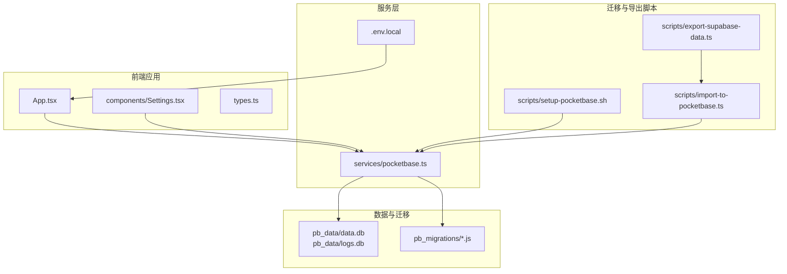
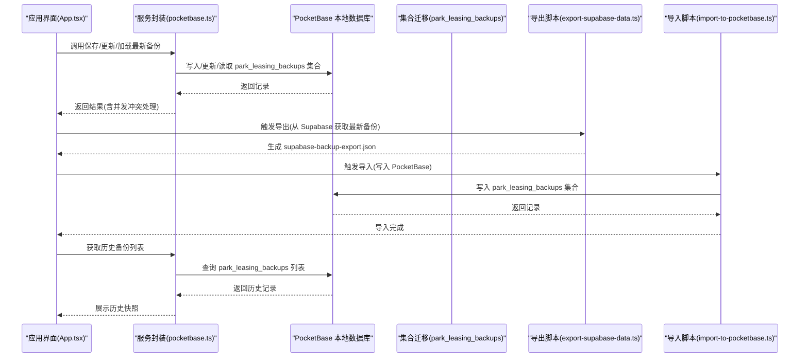
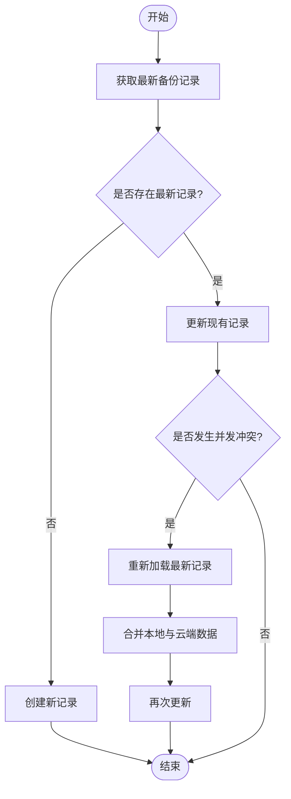
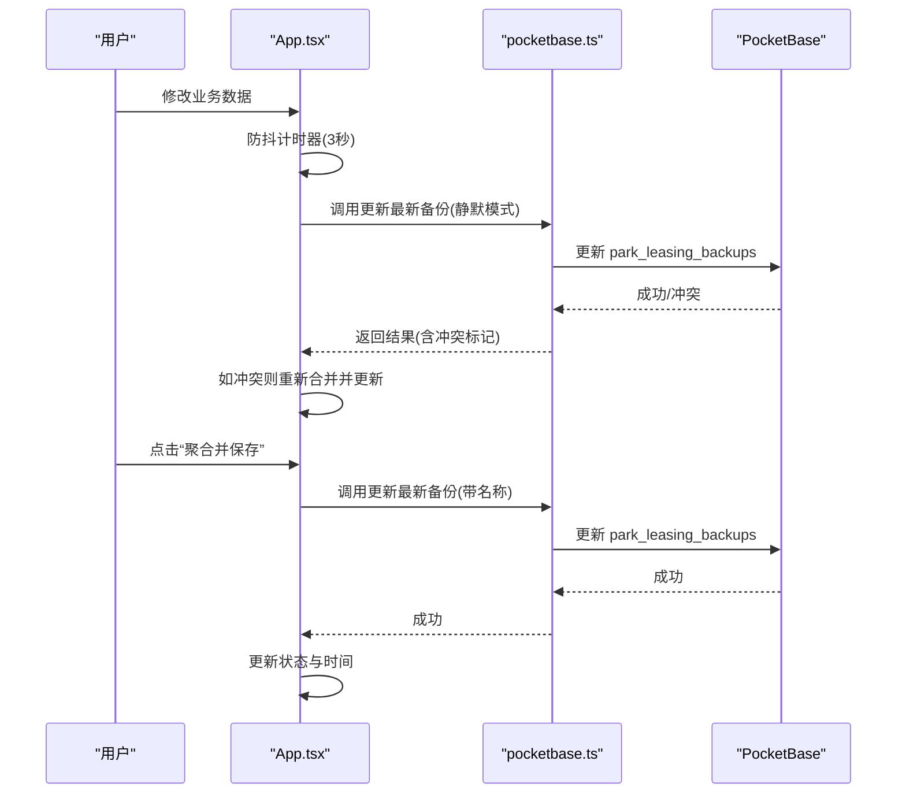
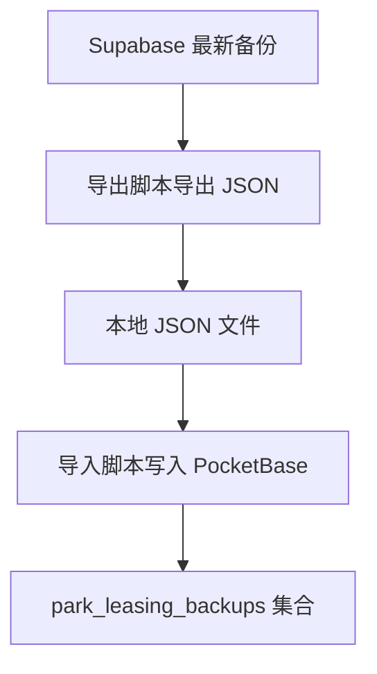
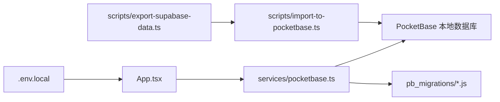

# 数据备份与恢复

<cite>
**本文引用的文件**
- [README.md](file://README.md)
- [package.json](file://package.json)
- [.env.local](file://.env.local)
- [App.tsx](file://App.tsx)
- [services/pocketbase.ts](file://services/pocketbase.ts)
- [components/Settings.tsx](file://components/Settings.tsx)
- [scripts/setup-pocketbase.sh](file://scripts/setup-pocketbase.sh)
- [scripts/export-supabase-data.ts](file://scripts/export-supabase-data.ts)
- [scripts/import-to-pocketbase.ts](file://scripts/import-to-pocketbase.ts)
- [pb_migrations/1770189507_created_park_leasing_backups.js](file://pb_migrations/1770189507_created_park_leasing_backups.js)
- [types.ts](file://types.ts)
</cite>

## 目录
1. [简介](#简介)
2. [项目结构](#项目结构)
3. [核心组件](#核心组件)
4. [架构总览](#架构总览)
5. [详细组件分析](#详细组件分析)
6. [依赖关系分析](#依赖关系分析)
7. [性能考虑](#性能考虑)
8. [故障排查指南](#故障排查指南)
9. [结论](#结论)
10. [附录](#附录)

## 简介
本技术文档围绕“数据备份与恢复”主题，系统梳理本项目中基于 PocketBase 的本地数据库备份策略、备份文件格式与存储位置、数据导出导入流程、Supabase 数据迁移与历史快照管理、备份触发条件与自动备份配置、手动备份操作、数据恢复流程与完整性校验、恢复失败处理方案、备份性能优化与存储空间管理、备份安全保护措施，以及管理员的备份监控、告警设置与灾难恢复演练指导。

## 项目结构
本项目采用前端 React 应用 + PocketBase 本地数据库的架构。数据备份与恢复相关的关键目录与文件如下：
- 本地数据库与迁移：pb_data、pb_migrations
- 备份与迁移脚本：scripts/
- 应用入口与备份逻辑：App.tsx
- 服务封装：services/pocketbase.ts
- 设置界面与历史快照展示：components/Settings.tsx
- 类型定义：types.ts
- 环境变量：.env.local
- 项目说明：README.md、package.json

图表来源
- [App.tsx](file://App.tsx#L179-L378)
- [services/pocketbase.ts](file://services/pocketbase.ts#L1-L226)
- [components/Settings.tsx](file://components/Settings.tsx#L1-L291)
- [scripts/setup-pocketbase.sh](file://scripts/setup-pocketbase.sh#L1-L55)
- [scripts/export-supabase-data.ts](file://scripts/export-supabase-data.ts#L1-L70)
- [scripts/import-to-pocketbase.ts](file://scripts/import-to-pocketbase.ts#L1-L66)
- [pb_migrations/1770189507_created_park_leasing_backups.js](file://pb_migrations/1770189507_created_park_leasing_backups.js#L1-L54)
- [.env.local](file://.env.local#L1-L4)

章节来源
- [README.md](file://README.md#L1-L21)
- [package.json](file://package.json#L1-L28)
- [App.tsx](file://App.tsx#L179-L378)
- [services/pocketbase.ts](file://services/pocketbase.ts#L1-L226)
- [components/Settings.tsx](file://components/Settings.tsx#L1-L291)
- [scripts/setup-pocketbase.sh](file://scripts/setup-pocketbase.sh#L1-L55)
- [scripts/export-supabase-data.ts](file://scripts/export-supabase-data.ts#L1-L70)
- [scripts/import-to-pocketbase.ts](file://scripts/import-to-pocketbase.ts#L1-L66)
- [pb_migrations/1770189507_created_park_leasing_backups.js](file://pb_migrations/1770189507_created_park_leasing_backups.js#L1-L54)
- [.env.local](file://.env.local#L1-L4)

## 核心组件
- 备份与恢复服务封装：提供保存、更新、加载最新备份与获取历史备份列表的能力，支持乐观锁并发控制。
- 应用入口备份逻辑：实现本地数据与云端快照的增量聚合与全量同步，自动保存与手动触发。
- 设置界面历史快照展示：列出历史备份并支持恢复。
- 迁移与导出脚本：从 Supabase 导出最新备份到 JSON 文件，再导入到 PocketBase。
- 数据库迁移：定义 park_leasing_backups 集合结构与字段。

章节来源
- [services/pocketbase.ts](file://services/pocketbase.ts#L127-L226)
- [App.tsx](file://App.tsx#L179-L378)
- [components/Settings.tsx](file://components/Settings.tsx#L220-L249)
- [scripts/export-supabase-data.ts](file://scripts/export-supabase-data.ts#L1-L70)
- [scripts/import-to-pocketbase.ts](file://scripts/import-to-pocketbase.ts#L1-L66)
- [pb_migrations/1770189507_created_park_leasing_backups.js](file://pb_migrations/1770189507_created_park_leasing_backups.js#L1-L54)

## 架构总览
下图展示了从应用侧发起备份，到云端集合存储，再到导出导入与历史快照管理的整体流程。

图表来源
- [App.tsx](file://App.tsx#L302-L378)
- [services/pocketbase.ts](file://services/pocketbase.ts#L127-L226)
- [scripts/export-supabase-data.ts](file://scripts/export-supabase-data.ts#L20-L69)
- [scripts/import-to-pocketbase.ts](file://scripts/import-to-pocketbase.ts#L13-L66)

## 详细组件分析

### 备份服务封装（pocketbase.ts）
- 功能职责
  - 保存备份：向 park_leasing_backups 集合写入新记录。
  - 更新现有备份：获取最新记录并更新，使用乐观锁机制处理并发冲突。
  - 加载最新备份：按创建时间倒序取第一条记录。
  - 获取历史备份列表：返回 id、name、created 字段。
- 数据模型
  - 备份记录包含 name 与 data 字段，其中 data 为 AppData 结构体。
- 并发控制
  - 若更新失败且判定为冲突，返回 conflict 标记，调用方可重新加载并合并后再次更新。

图表来源
- [services/pocketbase.ts](file://services/pocketbase.ts#L146-L179)

章节来源
- [services/pocketbase.ts](file://services/pocketbase.ts#L127-L226)
- [types.ts](file://types.ts#L240-L261)

### 应用入口备份逻辑（App.tsx）
- 自动同步
  - 数据变更时，通过防抖定时器在 3 秒后自动调用云端聚合保存。
- 手动备份
  - 提供“聚合并保存”弹窗，支持自定义快照名称。
- 增量聚合与全量同步
  - 登录或退出时可选择增量聚合（基于 mergeAppData）或全量同步。
- 状态与提示
  - 通过 cloudStatus 与 lastSyncDate 反馈同步状态与时间。

图表来源
- [App.tsx](file://App.tsx#L254-L378)
- [services/pocketbase.ts](file://services/pocketbase.ts#L146-L179)

章节来源
- [App.tsx](file://App.tsx#L179-L378)

### 设置界面历史快照（Settings.tsx）
- 功能职责
  - 拉取历史备份列表并在界面展示。
  - 支持点击“恢复”按钮触发 onRestoreData 回调，将备份数据还原到应用状态。
- 注意事项
  - 列表仅展示基础字段，不加载完整 data，避免大对象传输。

章节来源
- [components/Settings.tsx](file://components/Settings.tsx#L220-L249)

### Supabase 数据迁移与导出导入
- 导出流程
  - 从 Supabase 的 park_leasing_backups 表查询最新记录，写入本地 JSON 文件 supabase-backup-export.json。
- 导入流程
  - 读取 JSON 文件，写入 PocketBase 的 park_leasing_backups 集合。
- 迁移脚本
  - setup-pocketbase.sh：引导创建集合与字段。
  - export-supabase-data.ts：导出最新备份。
  - import-to-pocketbase.ts：导入备份到 PocketBase。

图表来源
- [scripts/export-supabase-data.ts](file://scripts/export-supabase-data.ts#L20-L69)
- [scripts/import-to-pocketbase.ts](file://scripts/import-to-pocketbase.ts#L13-L66)

章节来源
- [scripts/setup-pocketbase.sh](file://scripts/setup-pocketbase.sh#L21-L54)
- [scripts/export-supabase-data.ts](file://scripts/export-supabase-data.ts#L1-L70)
- [scripts/import-to-pocketbase.ts](file://scripts/import-to-pocketbase.ts#L1-L66)

### 数据库迁移与集合结构
- 集合名称：park_leasing_backups
- 字段
  - name：文本类型
  - data：JSON 类型，最大大小限制
- 索引：无
- 规则：允许无认证访问（用于演示目的）

章节来源
- [pb_migrations/1770189507_created_park_leasing_backups.js](file://pb_migrations/1770189507_created_park_leasing_backups.js#L1-L54)

## 依赖关系分析
- 应用层依赖服务层，服务层依赖 PocketBase 本地数据库与集合迁移。
- 迁移脚本与导出导入脚本独立于前端，可单独运行。
- 环境变量 POCKETBASE_URL 控制服务端地址。

图表来源
- [App.tsx](file://App.tsx#L14-L14)
- [services/pocketbase.ts](file://services/pocketbase.ts#L1-L10)
- [scripts/export-supabase-data.ts](file://scripts/export-supabase-data.ts#L1-L18)
- [scripts/import-to-pocketbase.ts](file://scripts/import-to-pocketbase.ts#L1-L11)
- [.env.local](file://.env.local#L2-L3)

章节来源
- [package.json](file://package.json#L11-L16)
- [App.tsx](file://App.tsx#L14-L14)
- [services/pocketbase.ts](file://services/pocketbase.ts#L1-L10)
- [scripts/export-supabase-data.ts](file://scripts/export-supabase-data.ts#L1-L18)
- [scripts/import-to-pocketbase.ts](file://scripts/import-to-pocketbase.ts#L1-L11)
- [.env.local](file://.env.local#L2-L3)

## 性能考虑
- 自动同步防抖：数据变更后 3 秒内多次修改仅触发一次云端聚合保存，降低写入压力。
- 并发冲突处理：更新失败时自动重试，避免重复写入与数据丢失。
- 历史快照列表优化：仅拉取必要字段，避免大对象传输。
- 导入导出：建议在低峰时段执行，避免影响在线业务。

## 故障排查指南
- PocketBase 未运行
  - 现象：脚本报错提示未运行。
  - 处理：确保 ./pocketbase serve --http=127.0.0.1:8091 已启动。
- 并发冲突
  - 现象：更新失败并提示冲突。
  - 处理：自动重试合并后更新；如仍失败，等待片刻后重试。
- 导出文件缺失
  - 现象：导入脚本找不到 supabase-backup-export.json。
  - 处理：先运行导出脚本生成 JSON 文件后再导入。
- 集合未创建
  - 现象：无法查询或写入 park_leasing_backups。
  - 处理：按 setup 脚本指引在管理后台创建集合与字段，并开放 API 规则。

章节来源
- [scripts/setup-pocketbase.sh](file://scripts/setup-pocketbase.sh#L13-L17)
- [services/pocketbase.ts](file://services/pocketbase.ts#L171-L178)
- [scripts/import-to-pocketbase.ts](file://scripts/import-to-pocketbase.ts#L24-L28)

## 结论
本项目通过服务封装与应用入口实现了自动与手动双通道备份，结合导出导入脚本与集合迁移，形成了完整的备份与恢复闭环。建议在生产环境中进一步完善并发控制、监控告警与灾难演练，确保数据安全与业务连续性。

## 附录

### 备份策略与触发条件
- 自动备份
  - 触发条件：本地业务数据发生变化（防抖 3 秒）。
  - 执行动作：增量聚合后更新最新备份。
- 手动备份
  - 触发条件：用户点击“聚合并保存”，可自定义快照名称。
  - 执行动作：同上，但带有用户交互与命名。

章节来源
- [App.tsx](file://App.tsx#L264-L281)
- [App.tsx](file://App.tsx#L331-L378)

### 备份文件格式与存储位置
- 备份文件格式：JSON，包含 name、data、created_at 字段。
- 存储位置：
  - 导出文件：项目根目录下的 supabase-backup-export.json。
  - 本地数据库：PocketBase 默认数据目录（pb_data/data.db）。

章节来源
- [scripts/export-supabase-data.ts](file://scripts/export-supabase-data.ts#L44-L52)
- [scripts/import-to-pocketbase.ts](file://scripts/import-to-pocketbase.ts#L25-L30)

### 数据导出导入流程
- 导出
  - 从 Supabase 查询最新备份记录，写入 JSON 文件。
- 导入
  - 读取 JSON 文件，写入 PocketBase 的 park_leasing_backups 集合。

章节来源
- [scripts/export-supabase-data.ts](file://scripts/export-supabase-data.ts#L20-L69)
- [scripts/import-to-pocketbase.ts](file://scripts/import-to-pocketbase.ts#L13-L66)

### Supabase 数据迁移与历史快照管理
- 迁移
  - 通过集合迁移脚本定义 park_leasing_backups 的结构与字段。
- 历史快照
  - 通过设置界面列出历史备份并支持恢复。

章节来源
- [pb_migrations/1770189507_created_park_leasing_backups.js](file://pb_migrations/1770189507_created_park_leasing_backups.js#L1-L54)
- [components/Settings.tsx](file://components/Settings.tsx#L220-L249)

### 数据恢复流程与完整性验证
- 恢复流程
  - 全量同步：直接用云端快照替换本地状态。
  - 增量聚合：基于 mergeAppData 合并本地与云端差异，保留本地最新数据。
- 完整性验证
  - 导入后读取最新记录进行比对，确认数量与关键字段一致。

章节来源
- [App.tsx](file://App.tsx#L302-L329)
- [App.tsx](file://App.tsx#L17-L75)
- [scripts/import-to-pocketbase.ts](file://scripts/import-to-pocketbase.ts#L44-L58)

### 恢复失败处理方案
- 并发冲突：自动重试合并后更新。
- 导入失败：检查导出文件是否存在与内容是否正确，重新执行导出与导入。
- 集合缺失：按 setup 脚本指引创建集合与字段。

章节来源
- [services/pocketbase.ts](file://services/pocketbase.ts#L171-L178)
- [scripts/import-to-pocketbase.ts](file://scripts/import-to-pocketbase.ts#L24-L28)
- [scripts/setup-pocketbase.sh](file://scripts/setup-pocketbase.sh#L21-L54)

### 备份性能优化与存储空间管理
- 性能优化
  - 防抖与并发冲突重试减少无效写入。
  - 历史快照列表仅取必要字段。
- 存储空间管理
  - 控制 JSON 字段大小上限，避免单条记录过大。
  - 定期清理不再需要的历史快照。

章节来源
- [services/pocketbase.ts](file://services/pocketbase.ts#L146-L179)
- [pb_migrations/1770189507_created_park_leasing_backups.js](file://pb_migrations/1770189507_created_park_leasing_backups.js#L33-L35)

### 备份安全保护措施
- API 规则：当前示例允许无认证访问，建议在生产环境收紧规则。
- 环境变量：通过 .env.local 配置 PocketBase 地址，避免硬编码。

章节来源
- [pb_migrations/1770189507_created_park_leasing_backups.js](file://pb_migrations/1770189507_created_park_leasing_backups.js#L39-L44)
- [.env.local](file://.env.local#L2-L3)

### 管理员备份监控、告警与演练
- 监控
  - 通过应用状态栏查看云同步状态与时间。
- 告警
  - 建议在 CI/CD 或运维平台增加健康检查与失败告警。
- 演练
  - 定期进行全量与增量恢复演练，验证数据一致性与恢复速度。

章节来源
- [App.tsx](file://App.tsx#L524-L542)
- [components/Settings.tsx](file://components/Settings.tsx#L236-L248)