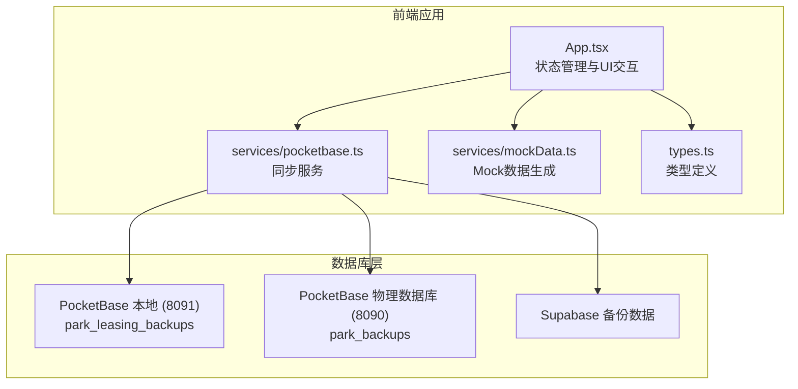
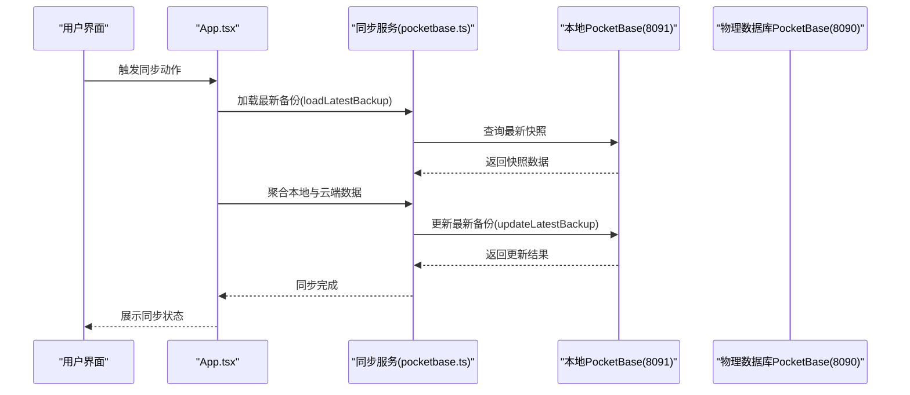
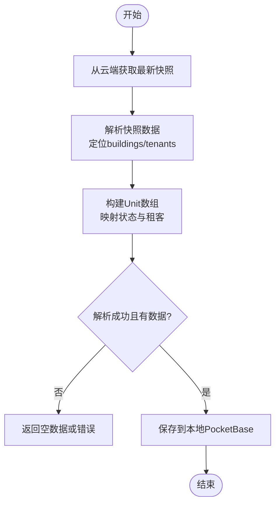
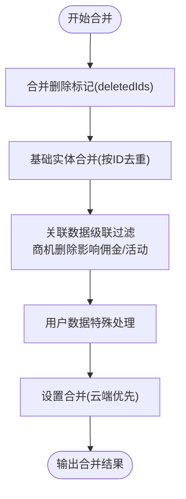
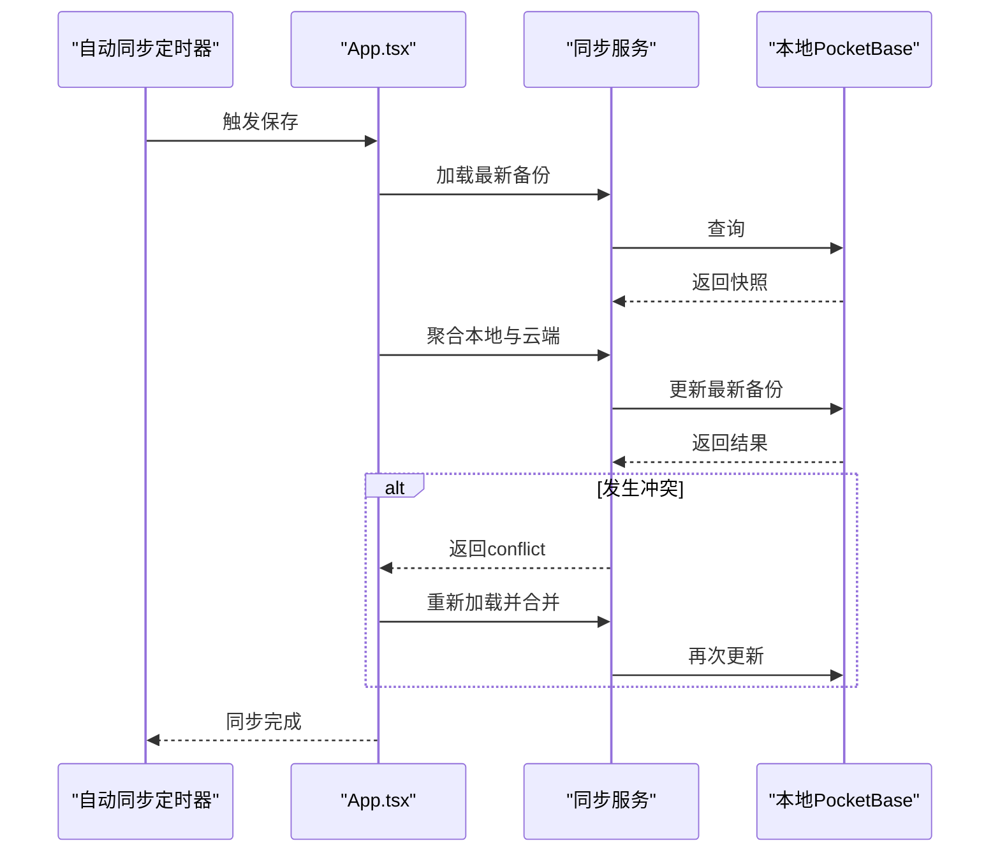
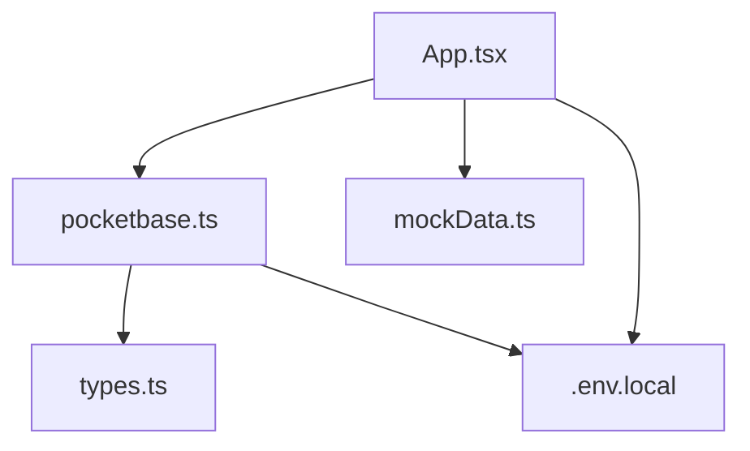

# 数据库同步机制

<cite>
**本文引用的文件**
- [services/pocketbase.ts](file://services/pocketbase.ts)
- [services/mockData.ts](file://services/mockData.ts)
- [scripts/setup-pocketbase.sh](file://scripts/setup-pocketbase.sh)
- [scripts/export-supabase-data.ts](file://scripts/export-supabase-data.ts)
- [types.ts](file://types.ts)
- [App.tsx](file://App.tsx)
- [package.json](file://package.json)
- [.env.local](file://.env.local)
</cite>

## 目录
1. [简介](#简介)
2. [项目结构](#项目结构)
3. [核心组件](#核心组件)
4. [架构概览](#架构概览)
5. [详细组件分析](#详细组件分析)
6. [依赖关系分析](#依赖关系分析)
7. [性能考虑](#性能考虑)
8. [故障排除指南](#故障排除指南)
9. [结论](#结论)
10. [附录](#附录)

## 简介
本技术文档详细阐述了该系统中数据库同步机制的设计与实现，涵盖PocketBase云端数据库与本地数据库之间的数据同步策略、冲突解决算法、版本控制机制以及增量同步方案。文档同时提供了Mock数据生成机制、测试数据准备流程、数据一致性保证措施、性能优化策略、批量操作处理以及离线数据缓存方案，并给出调试方法与故障排除指南，帮助开发者快速理解和维护该同步体系。

## 项目结构
该项目采用前端React应用与本地/云端PocketBase数据库相结合的架构。核心同步逻辑集中在服务层，UI层负责触发同步动作并展示状态反馈。关键目录与文件如下：
- services/pocketbase.ts：同步服务的核心实现，包括云端数据拉取、本地备份保存与更新、乐观锁冲突处理等
- services/mockData.ts：Mock数据生成模块，用于开发与测试环境的数据准备
- scripts/setup-pocketbase.sh：PocketBase集合初始化脚本，指导如何创建所需的集合与字段
- scripts/export-supabase-data.ts：Supabase数据导出脚本，用于从Supabase迁移数据到PocketBase
- types.ts：类型定义，包括AppData结构、实体枚举与接口
- App.tsx：应用入口与状态管理，包含深度合并算法、自动同步与冲突处理
- package.json：依赖声明，包含pocketbase客户端
- .env.local：环境变量配置，指定PocketBase服务地址

图表来源
- [services/pocketbase.ts](file://services/pocketbase.ts#L1-L226)
- [App.tsx](file://App.tsx#L1-L620)
- [types.ts](file://types.ts#L240-L261)
- [scripts/setup-pocketbase.sh](file://scripts/setup-pocketbase.sh#L1-L55)
- [scripts/export-supabase-data.ts](file://scripts/export-supabase-data.ts#L1-L70)

章节来源
- [services/pocketbase.ts](file://services/pocketbase.ts#L1-L226)
- [App.tsx](file://App.tsx#L1-L620)
- [types.ts](file://types.ts#L240-L261)
- [scripts/setup-pocketbase.sh](file://scripts/setup-pocketbase.sh#L1-L55)
- [scripts/export-supabase-data.ts](file://scripts/export-supabase-data.ts#L1-L70)

## 核心组件
- 同步服务（services/pocketbase.ts）
  - 提供从云端物理数据库拉取最新快照的能力
  - 将解析后的业务数据保存到本地PocketBase集合
  - 支持更新现有备份并使用乐观锁机制处理并发冲突
  - 提供加载最新备份与获取历史备份列表的功能
- 应用主程序（App.tsx）
  - 实现深度合并算法，确保本地与云端数据的一致性
  - 自动同步：监听状态变化，3秒防抖后触发云端聚合保存
  - 冲突处理：检测并发冲突并重新合并
  - 用户界面：提供登录前同步、手动聚合保存、退出前聚合同步等功能
- 类型定义（types.ts）
  - 定义AppData结构，包含商机、渠道、佣金、资产、规则、政策、活动、用户等核心实体
  - 定义删除标记deletedIds，用于防止云端数据复活已删除项
- Mock数据（services/mockData.ts）
  - 提供开发与测试所需的Mock数据，包括用户、资产、渠道、佣金规则等
- 脚本工具
  - setup-pocketbase.sh：指导创建park_leasing_backups集合与字段
  - export-supabase-data.ts：从Supabase导出最新备份数据

章节来源
- [services/pocketbase.ts](file://services/pocketbase.ts#L1-L226)
- [App.tsx](file://App.tsx#L17-L75)
- [types.ts](file://types.ts#L240-L261)
- [services/mockData.ts](file://services/mockData.ts#L1-L81)
- [scripts/setup-pocketbase.sh](file://scripts/setup-pocketbase.sh#L1-L55)
- [scripts/export-supabase-data.ts](file://scripts/export-supabase-data.ts#L1-L70)

## 架构概览
系统采用双PocketBase架构：
- 本地PocketBase（8091端口）：存储本系统的业务快照，集合名为park_leasing_backups
- 物理数据库PocketBase（8090端口）：存储招商管理系统的业务快照，集合名为park_backups
- Supabase：作为历史备份数据源，提供数据导出能力

图表来源
- [App.tsx](file://App.tsx#L302-L378)
- [services/pocketbase.ts](file://services/pocketbase.ts#L146-L179)

## 详细组件分析

### 同步服务（pocketbase.ts）
- 云端数据拉取
  - 从物理数据库PocketBase的park_backups集合按项目ID筛选最新快照
  - 使用深度数组搜索定位buildings与tenants容器，建立租客映射索引
  - 解析嵌套结构，构建Unit数组，映射状态与租户信息
- 本地备份管理
  - 保存备份：创建新快照记录
  - 更新现有备份：使用乐观锁机制，避免并发冲突
  - 加载最新备份：获取最近一次快照
  - 获取历史备份：列出所有备份记录
- 错误处理
  - 对解析异常、网络错误进行捕获与返回
  - 在并发冲突场景下返回conflict标志，由上层逻辑重新合并

图表来源
- [services/pocketbase.ts](file://services/pocketbase.ts#L50-L125)

章节来源
- [services/pocketbase.ts](file://services/pocketbase.ts#L1-L226)

### 深度合并算法（App.tsx）
- 合并策略
  - 基于ID去重，云端快照优先，随后本地最新数据覆盖
  - 合并删除标记（deletedIds），防止云端复活已删除项
  - 关联数据级联过滤：商机删除时，其下的佣金与活动记录也被过滤
  - 用户数据特殊处理：若云端用户为空，则回退到本地或Mock数据
- 设置合并
  - settings字段采用云端优先、本地覆盖的策略，年目标面积回退到默认值

图表来源
- [App.tsx](file://App.tsx#L17-L75)

章节来源
- [App.tsx](file://App.tsx#L17-L75)

### 自动同步与冲突处理（App.tsx）
- 自动同步
  - 监听状态变化，使用3秒防抖避免频繁更新
  - 使用ref保存最新状态，确保异步操作获取到最新数据
- 冲突处理
  - 更新备份时检测并发冲突（HTTP 409或冲突消息）
  - 若发生冲突，重新加载最新备份并再次合并更新
- 用户交互
  - 登录前可选择全量同步或增量聚合
  - 退出前可选择聚合同步并退出

图表来源
- [App.tsx](file://App.tsx#L257-L281)
- [App.tsx](file://App.tsx#L331-L378)
- [services/pocketbase.ts](file://services/pocketbase.ts#L146-L179)

章节来源
- [App.tsx](file://App.tsx#L257-L281)
- [App.tsx](file://App.tsx#L331-L378)
- [services/pocketbase.ts](file://services/pocketbase.ts#L146-L179)

### Mock数据生成机制（mockData.ts）
- Mock数据用途
  - 开发与测试阶段提供初始数据，确保应用可正常运行
  - 包含用户、资产、渠道、佣金规则等核心实体
- 数据结构
  - 用户：管理员与普通用户
  - 资产：楼宇、楼层、房间号、面积、状态、租户等
  - 渠道：公司名称、等级、基础佣金率、代理列表等
  - 佣金规则：面积区间、费率、支付方式（一次性/分期）、分期节点
- 工具函数
  - 年度累计计算
  - 逾期判断

章节来源
- [services/mockData.ts](file://services/mockData.ts#L1-L81)

### 数据库初始化与迁移（setup-pocketbase.sh, export-supabase-data.ts）
- 初始化脚本
  - 指导创建park_leasing_backups集合与字段（name: text, data: json）
  - 允许无认证访问，便于前端直接调用
- Supabase迁移
  - 导出最新备份到JSON文件，便于导入PocketBase
  - 支持手动导入或通过API导入

章节来源
- [scripts/setup-pocketbase.sh](file://scripts/setup-pocketbase.sh#L1-L55)
- [scripts/export-supabase-data.ts](file://scripts/export-supabase-data.ts#L1-L70)

## 依赖关系分析
- 依赖声明
  - pocketbase：用于与本地/云端PocketBase数据库交互
  - react/react-dom：前端框架
  - lucide-react：图标库
  - recharts：图表库
- 环境变量
  - POCKETBASE_URL：本地PocketBase地址
  - POCKETBASE_PROPERTY_URL：物理数据库PocketBase地址

图表来源
- [package.json](file://package.json#L11-L26)
- [.env.local](file://.env.local#L1-L4)

章节来源
- [package.json](file://package.json#L1-L28)
- [.env.local](file://.env.local#L1-L4)

## 性能考虑
- 防抖机制
  - 自动同步使用3秒防抖，减少频繁写入，提升用户体验
- 乐观锁与冲突重试
  - 更新备份时检测并发冲突并自动重试，避免数据丢失
- 深度合并优化
  - 基于Map的ID去重与覆盖，降低重复遍历成本
- 批量操作建议
  - 合并多个状态更新后再触发同步，减少同步次数
  - 使用ref保存最新状态，避免闭包过期导致的重复计算
- 离线缓存
  - 本地持久化存储（localStorage）保存完整AppData，确保浏览器刷新后数据不丢失
  - 删除标记deletedIds在本地持久化，保证跨会话一致性

## 故障排除指南
- PocketBase服务未启动
  - 症状：初始化脚本提示服务未运行
  - 处理：启动本地PocketBase服务（8091端口），再执行初始化脚本
- 集合或字段缺失
  - 症状：无法创建park_leasing_backups集合或字段
  - 处理：按照初始化脚本指引，在管理后台创建集合与字段
- 并发冲突
  - 症状：更新备份返回conflict
  - 处理：系统自动重试，若仍失败，检查网络与服务状态
- 登录失败
  - 症状：登录时报网络错误
  - 处理：确保云端数据可访问，先执行登录前同步
- 数据格式变更
  - 症状：资产同步提示云端数据格式已变更
  - 处理：根据提示调整解析逻辑，保护当前数据不被重置

章节来源
- [scripts/setup-pocketbase.sh](file://scripts/setup-pocketbase.sh#L13-L17)
- [App.tsx](file://App.tsx#L77-L104)
- [App.tsx](file://App.tsx#L187-L189)

## 结论
该同步机制通过双PocketBase架构实现了云端与本地数据的高效协同，结合深度合并算法与乐观锁冲突处理，确保了数据一致性与可靠性。Mock数据生成与迁移脚本为开发与部署提供了便利。通过防抖、批处理与离线缓存等优化策略，系统在性能与用户体验方面表现良好。建议在生产环境中进一步完善网络异常处理与监控告警，以提升系统的稳定性与可观测性。

## 附录
- 同步触发条件
  - 状态变化：本地状态变化触发3秒防抖自动同步
  - 用户操作：登录前同步、手动聚合保存、退出前聚合同步
- 数据传输协议
  - 使用PocketBase REST API进行数据读写
  - 云端快照以JSON格式存储，包含完整的AppData结构
- 增量同步方案
  - 基于最新备份的增量聚合，优先保留本地最新数据
  - 删除标记deletedIds确保云端复活已删除项的风险控制
- 测试数据准备
  - 使用mockData.ts提供的Mock数据初始化开发环境
  - 通过Supabase导出脚本准备迁移数据
- 数据一致性保证
  - 深度合并算法与删除标记机制
  - 乐观锁与冲突重试
  - 本地持久化存储与ref状态管理