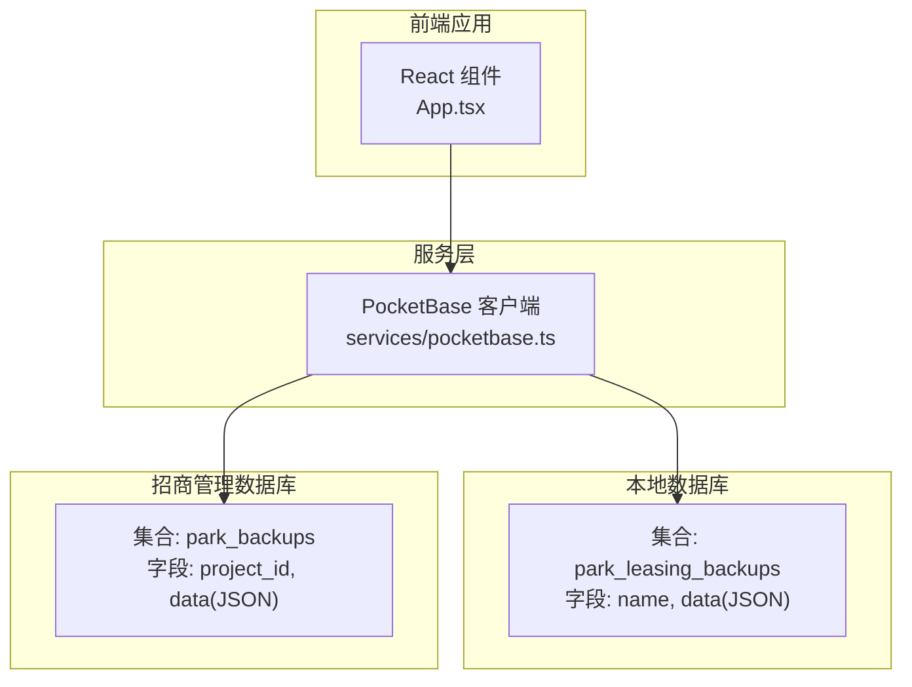
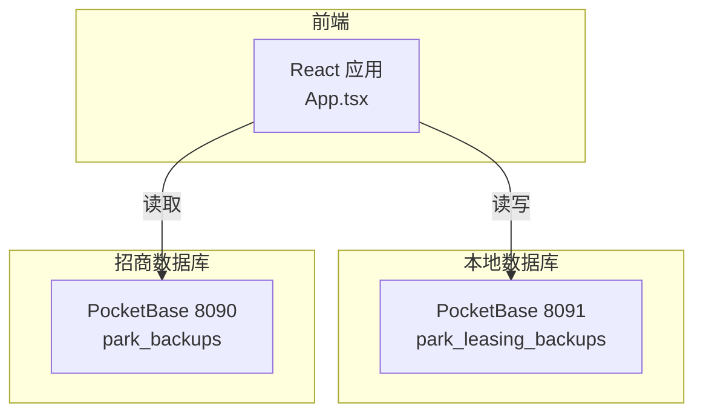
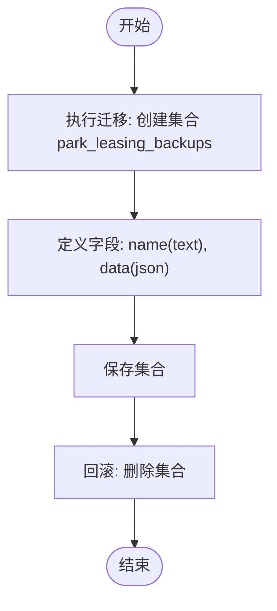
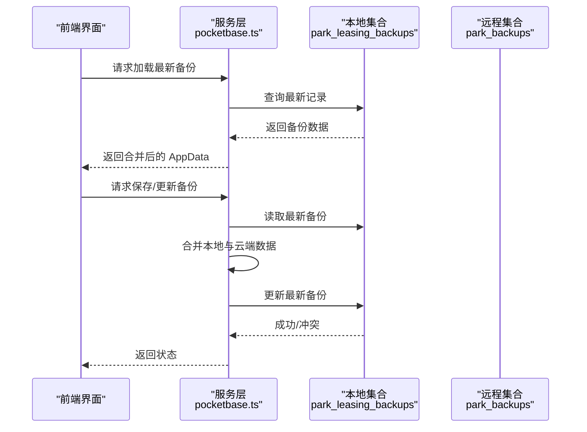
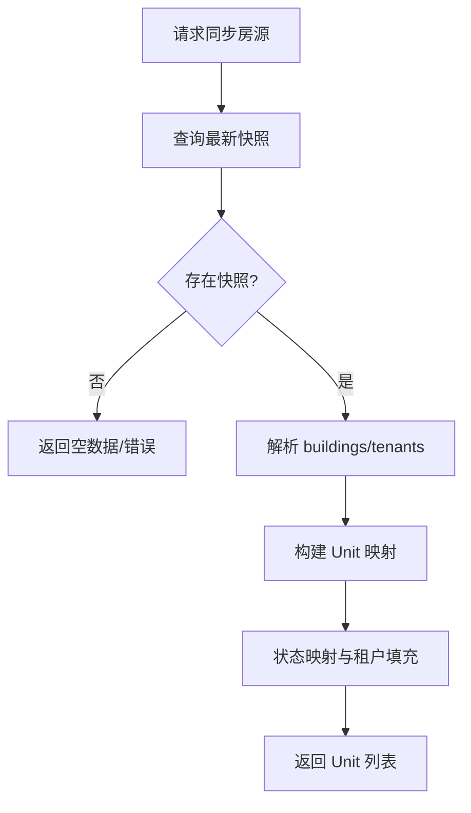
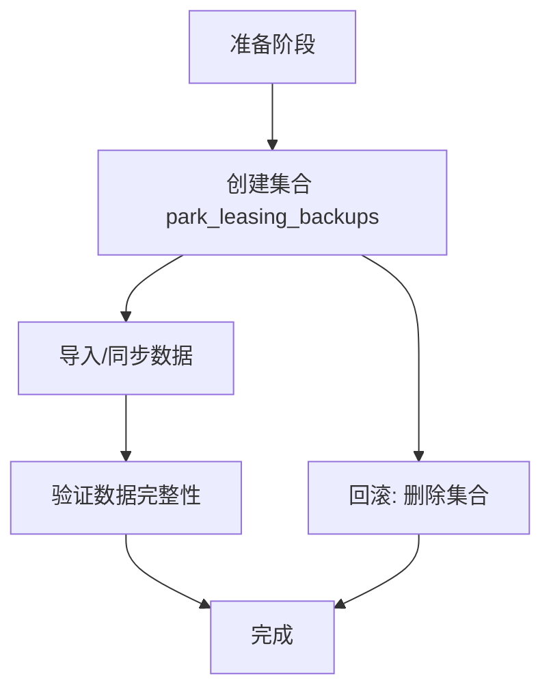
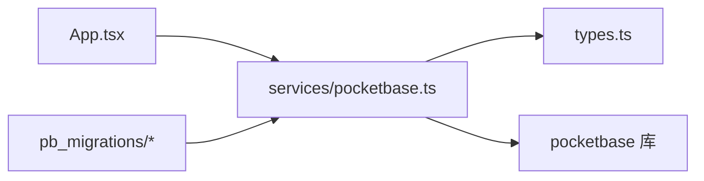

# 数据库迁移

<cite>
**本文档引用的文件**
- [MIGRATION_SUMMARY.md](file://MIGRATION_SUMMARY.md)
- [README.md](file://README.md)
- [pb_migrations/1770189507_created_park_leasing_backups.js](file://pb_migrations/1770189507_created_park_leasing_backups.js)
- [scripts/setup-pocketbase.sh](file://scripts/setup-pocketbase.sh)
- [scripts/export-supabase-data.ts](file://scripts/export-supabase-data.ts)
- [services/pocketbase.ts](file://services/pocketbase.ts)
- [types.ts](file://types.ts)
- [App.tsx](file://App.tsx)
- [package.json](file://package.json)
</cite>

## 目录
1. [简介](#简介)
2. [项目结构](#项目结构)
3. [核心组件](#核心组件)
4. [架构总览](#架构总览)
5. [详细组件分析](#详细组件分析)
6. [依赖关系分析](#依赖关系分析)
7. [性能考量](#性能考量)
8. [故障排查指南](#故障排查指南)
9. [结论](#结论)
10. [附录](#附录)

## 简介
本文件面向开发者，系统性阐述该应用从 Supabase 迁移到 PocketBase 的数据库迁移策略与技术实现，重点覆盖：
- 迁移流程与版本管理机制
- 迁移脚本编写规范、执行顺序与回滚策略
- 数据结构演进、字段变更与索引优化方案
- 迁移前后数据备份、迁移过程中的数据完整性校验与迁移后验证机制
- 最佳实践、常见问题与性能优化建议
- 迁移脚本编写指导与测试验证方法

## 项目结构
该项目采用前端 React + PocketBase 的本地化部署架构，核心迁移涉及：
- 本地备份集合：park_leasing_backups（JSON 存储 AppData）
- 房源同步集合：park_backups（招商管理端导出的快照）
- 服务层封装：统一调用本地与招商管理端 PocketBase
- 迁移脚本：定义集合结构与字段



图表来源
- [services/pocketbase.ts](file://services/pocketbase.ts#L1-L226)
- [pb_migrations/1770189507_created_park_leasing_backups.js](file://pb_migrations/1770189507_created_park_leasing_backups.js#L1-L54)

章节来源
- [MIGRATION_SUMMARY.md](file://MIGRATION_SUMMARY.md#L1-L224)
- [README.md](file://README.md#L1-L21)

## 核心组件
- 本地备份集合 park_leasing_backups：用于存储聚合后的业务快照，字段包括 name 与 data（JSON）。迁移脚本定义了集合结构与字段约束。
- 房源同步集合 park_backups：招商管理端导出的快照集合，包含项目标识与 JSON 数据。
- 服务层 pocketbase.ts：封装本地与招商管理端 PocketBase 客户端，提供备份保存、加载、更新与房源同步等能力。
- 类型定义 types.ts：定义 AppData 及各业务实体接口，确保前后端数据结构一致。
- 迁移脚本 pb_migrations/1770189507_created_park_leasing_backups.js：定义 park_leasing_backups 集合的创建与删除逻辑。
- 启动与配置脚本 scripts/setup-pocketbase.sh：引导用户在管理后台创建集合与字段，并设置 API 规则。
- 数据导出脚本 scripts/export-supabase-data.ts：从 Supabase 导出现有备份，便于迁移导入 PocketBase。

章节来源
- [services/pocketbase.ts](file://services/pocketbase.ts#L1-L226)
- [types.ts](file://types.ts#L1-L261)
- [pb_migrations/1770189507_created_park_leasing_backups.js](file://pb_migrations/1770189507_created_park_leasing_backups.js#L1-L54)
- [scripts/setup-pocketbase.sh](file://scripts/setup-pocketbase.sh#L1-L55)
- [scripts/export-supabase-data.ts](file://scripts/export-supabase-data.ts#L1-L70)

## 架构总览
迁移后的系统由前端应用、服务层与两个 PocketBase 实例组成：
- 本地 PocketBase（8091）：承载业务快照与本地数据
- 招商管理 PocketBase（8090）：提供房源数据快照



图表来源
- [MIGRATION_SUMMARY.md](file://MIGRATION_SUMMARY.md#L90-L111)
- [services/pocketbase.ts](file://services/pocketbase.ts#L4-L12)

## 详细组件分析

### 迁移脚本与集合结构
- 集合 park_leasing_backups 的创建与删除逻辑由迁移脚本定义，包含字段 name（文本）与 data（JSON），并设置集合选项。
- 迁移脚本遵循 PocketBase 的 migrate 接口，提供 up/down 两阶段逻辑，便于版本化管理与回滚。



图表来源
- [pb_migrations/1770189507_created_park_leasing_backups.js](file://pb_migrations/1770189507_created_park_leasing_backups.js#L2-L47)
- [pb_migrations/1770189507_created_park_leasing_backups.js](file://pb_migrations/1770189507_created_park_leasing_backups.js#L48-L53)

章节来源
- [pb_migrations/1770189507_created_park_leasing_backups.js](file://pb_migrations/1770189507_created_park_leasing_backups.js#L1-L54)

### 服务层与数据流
- 本地客户端 pb：指向本地 PocketBase（8091），负责备份的保存、加载与更新。
- 房源客户端 propertyPb：指向招商管理端 PocketBase（8090），负责获取最新快照并解析为本地 Unit 结构。
- 数据合并策略：在保存与加载时，使用 mergeAppData 将本地与云端数据进行增量聚合，确保删除标记与关联数据的一致性。



图表来源
- [services/pocketbase.ts](file://services/pocketbase.ts#L184-L204)
- [services/pocketbase.ts](file://services/pocketbase.ts#L146-L179)
- [App.tsx](file://App.tsx#L302-L378)

章节来源
- [services/pocketbase.ts](file://services/pocketbase.ts#L1-L226)
- [App.tsx](file://App.tsx#L17-L75)
- [App.tsx](file://App.tsx#L302-L378)

### 房源同步与状态映射
- 从招商管理端集合 park_backups 中按项目标识筛选最新快照，解析其中的 buildings 与 tenants，建立租户映射，最终生成本地 Unit 列表。
- 状态映射逻辑将远端状态转换为本地 UnitStatus 枚举，确保状态一致性。



图表来源
- [services/pocketbase.ts](file://services/pocketbase.ts#L50-L125)

章节来源
- [services/pocketbase.ts](file://services/pocketbase.ts#L47-L125)

### 数据模型与字段演进
- AppData：包含商机、渠道、佣金、单位、规则、政策、活动、用户、设置等核心业务实体。
- Unit：包含楼宇、楼层、房间号、面积、状态、租户名等字段。
- 迁移后新增字段：park_leasing_backups 集合的 name 与 data 字段，满足快照存储需求。

```mermaid
erDiagram
APPDATA {
json settings
string[] deletedIds
}
OPPORTUNITY ||--o{ ACTIVITY : "关联"
OPPORTUNITY ||--o{ COMMISSION : "关联"
CHANNEL ||--o{ COMMISSION : "关联"
UNIT ||--o{ ACTIVITY : "被使用"
APPDATA ||--o{ OPPORTUNITY
APPDATA ||--o{ CHANNEL
APPDATA ||--o{ COMMISSION
APPDATA ||--o{ UNIT
APPDATA ||--o{ COMMISSIONRULE
APPDATA ||--o{ POLICYCHANGELOG
APPDATA ||--o{ ACTIVITY
APPDATA ||--o{ USER
```

图表来源
- [types.ts](file://types.ts#L240-L261)
- [types.ts](file://types.ts#L78-L88)

章节来源
- [types.ts](file://types.ts#L1-L261)

### 迁移流程与版本管理
- 版本号：迁移脚本以时间戳命名（例如 1770189507），天然具备顺序性与唯一性。
- 执行顺序：先创建本地备份集合，再进行数据导入或同步。
- 回滚策略：通过 down 函数删除集合，恢复到迁移前状态。



图表来源
- [pb_migrations/1770189507_created_park_leasing_backups.js](file://pb_migrations/1770189507_created_park_leasing_backups.js#L2-L47)
- [pb_migrations/1770189507_created_park_leasing_backups.js](file://pb_migrations/1770189507_created_park_leasing_backups.js#L48-L53)

章节来源
- [MIGRATION_SUMMARY.md](file://MIGRATION_SUMMARY.md#L49-L81)
- [pb_migrations/1770189507_created_park_leasing_backups.js](file://pb_migrations/1770189507_created_park_leasing_backups.js#L1-L54)

### 迁移前的数据备份与迁移后的验证
- 迁移前：使用导出脚本从 Supabase 导出现有备份，保存为 JSON 文件，便于后续导入 PocketBase。
- 迁移后：通过前端界面与服务层接口验证备份加载、更新与房源同步功能。

章节来源
- [scripts/export-supabase-data.ts](file://scripts/export-supabase-data.ts#L1-L70)
- [MIGRATION_SUMMARY.md](file://MIGRATION_SUMMARY.md#L142-L156)

## 依赖关系分析
- 前端应用依赖 pocketbase 客户端库，通过服务层封装访问本地与招商数据库。
- 服务层依赖类型定义，保证数据结构一致性。
- 迁移脚本依赖 PocketBase 的迁移框架，定义集合结构。



图表来源
- [package.json](file://package.json#L11-L16)
- [services/pocketbase.ts](file://services/pocketbase.ts#L1-L10)
- [types.ts](file://types.ts#L1-L261)

章节来源
- [package.json](file://package.json#L1-L28)
- [services/pocketbase.ts](file://services/pocketbase.ts#L1-L226)

## 性能考量
- 房源同步策略：建议手动触发，避免频繁自动同步，降低数据库压力。
- 备份策略：保持现有合并策略，减少冗余快照数量。
- 本地缓存：可在前端增加短期缓存（如 5-10 分钟），减少重复请求。
- 轮询间隔：建议不少于 30 秒，避免过度刷新。

章节来源
- [MIGRATION_SUMMARY.md](file://MIGRATION_SUMMARY.md#L201-L207)

## 故障排查指南
- 端口与服务：确认本地与招商数据库服务均在指定端口运行。
- CORS 配置：如遇跨域问题，在 PocketBase 管理后台设置允许来源。
- 并发冲突：自动更新备份时可能遇到并发冲突，服务层已内置重试与合并逻辑。
- 数据完整性：加载/保存失败时，检查集合字段与 API 规则配置。

章节来源
- [MIGRATION_SUMMARY.md](file://MIGRATION_SUMMARY.md#L82-L87)
- [services/pocketbase.ts](file://services/pocketbase.ts#L171-L178)
- [scripts/setup-pocketbase.sh](file://scripts/setup-pocketbase.sh#L1-L55)

## 结论
本项目通过 PocketBase 实现了从 Supabase 的平滑迁移，建立了本地备份与招商数据同步的双数据库架构。迁移脚本以时间戳命名，具备明确的版本管理与回滚路径；服务层封装了备份与同步逻辑，前端通过数据合并策略保障一致性。建议在生产环境中结合缓存与合理的同步策略，持续优化性能与可靠性。

## 附录

### 迁移脚本编写规范
- 使用时间戳作为版本号，确保顺序与唯一性。
- 在 up 中创建集合与字段，在 down 中删除集合，保证可逆。
- 在脚本中定义字段类型、必填与大小限制，避免后续变更带来的不一致。

章节来源
- [pb_migrations/1770189507_created_park_leasing_backups.js](file://pb_migrations/1770189507_created_park_leasing_backups.js#L1-L54)

### 执行顺序与回滚策略
- 先执行迁移脚本创建集合，再进行数据导入或同步。
- 如需回滚，执行 down 逻辑删除集合，恢复到迁移前状态。

章节来源
- [pb_migrations/1770189507_created_park_leasing_backups.js](file://pb_migrations/1770189507_created_park_leasing_backups.js#L2-L53)

### 数据结构演进与字段变更
- 新增集合 park_leasing_backups，包含 name 与 data 字段。
- 字段大小限制与必填约束在迁移脚本中定义，确保数据质量。

章节来源
- [pb_migrations/1770189507_created_park_leasing_backups.js](file://pb_migrations/1770189507_created_park_leasing_backups.js#L10-L36)

### 索引优化方案
- 当前迁移脚本未定义索引。若后续查询量增大，可在集合上为常用过滤字段（如 created、project_id）添加索引，提升查询性能。

章节来源
- [pb_migrations/1770189507_created_park_leasing_backups.js](file://pb_migrations/1770189507_created_park_leasing_backups.js#L38-L38)

### 迁移前的数据备份与迁移后的验证
- 使用导出脚本从 Supabase 导出现有备份，保存为 JSON 文件。
- 迁移后通过前端界面与服务层接口验证备份加载、更新与房源同步功能。

章节来源
- [scripts/export-supabase-data.ts](file://scripts/export-supabase-data.ts#L1-L70)
- [MIGRATION_SUMMARY.md](file://MIGRATION_SUMMARY.md#L142-L156)

### 最佳实践与常见问题
- 最佳实践：手动触发同步、合理设置轮询间隔、启用本地缓存、定期清理冗余快照。
- 常见问题：端口未启动、CORS 限制、并发冲突、字段不匹配。对应处理方式见故障排查指南。

章节来源
- [MIGRATION_SUMMARY.md](file://MIGRATION_SUMMARY.md#L201-L207)
- [MIGRATION_SUMMARY.md](file://MIGRATION_SUMMARY.md#L82-L87)

### 测试验证方法
- 启动流程：分别启动招商管理与本地 PocketBase，再启动前端应用。
- 功能验证：登录页云端同步、Dashboard 加载备份、手动保存备份、资产页面同步房源、状态映射正确性、编辑与新增功能、业务模块数据持久化。

章节来源
- [MIGRATION_SUMMARY.md](file://MIGRATION_SUMMARY.md#L90-L111)
- [MIGRATION_SUMMARY.md](file://MIGRATION_SUMMARY.md#L142-L156)