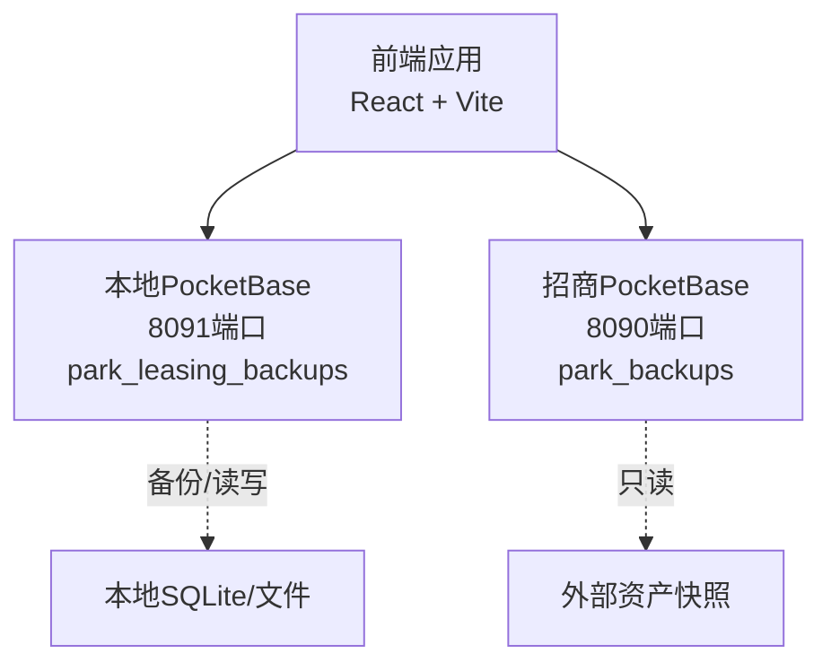
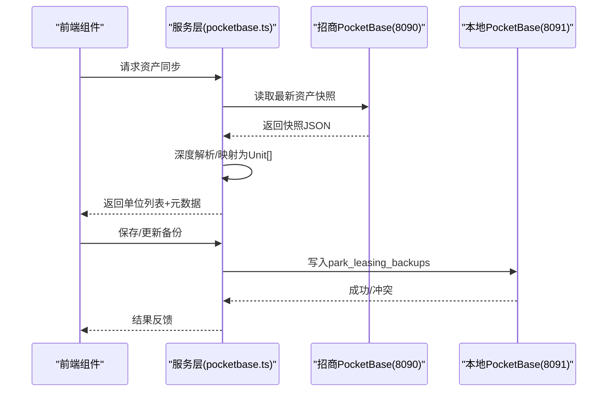
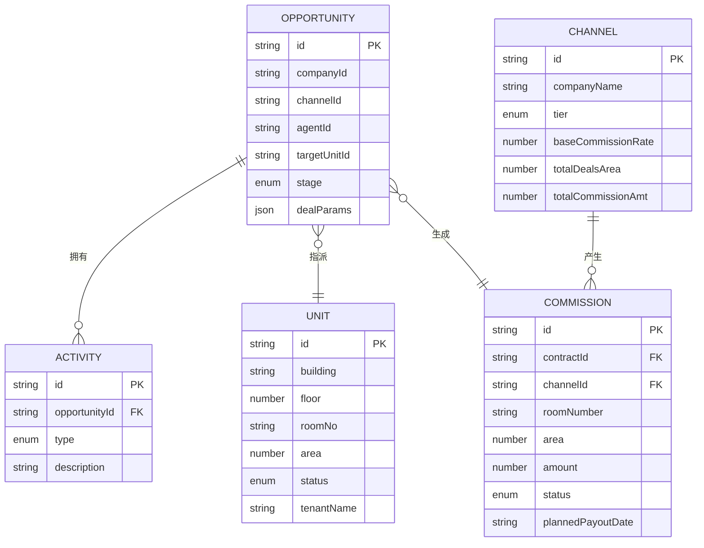
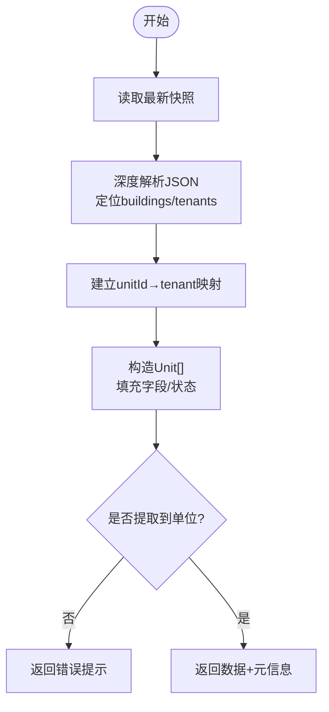
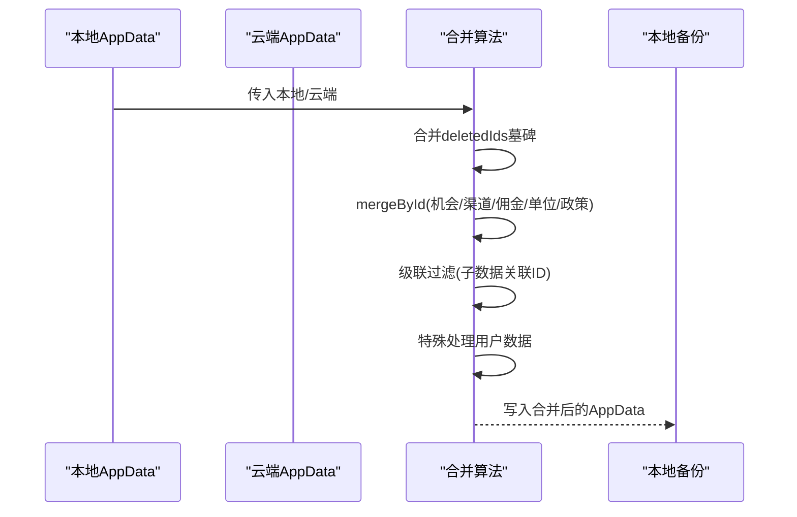
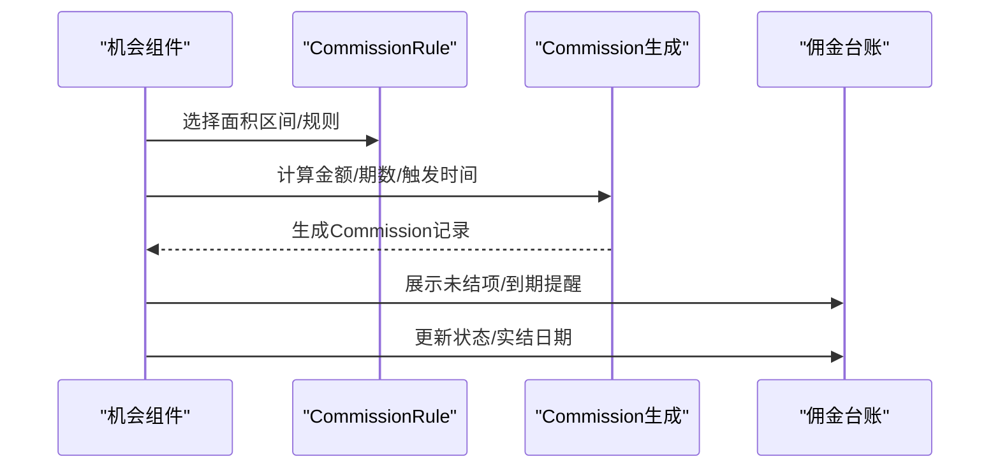
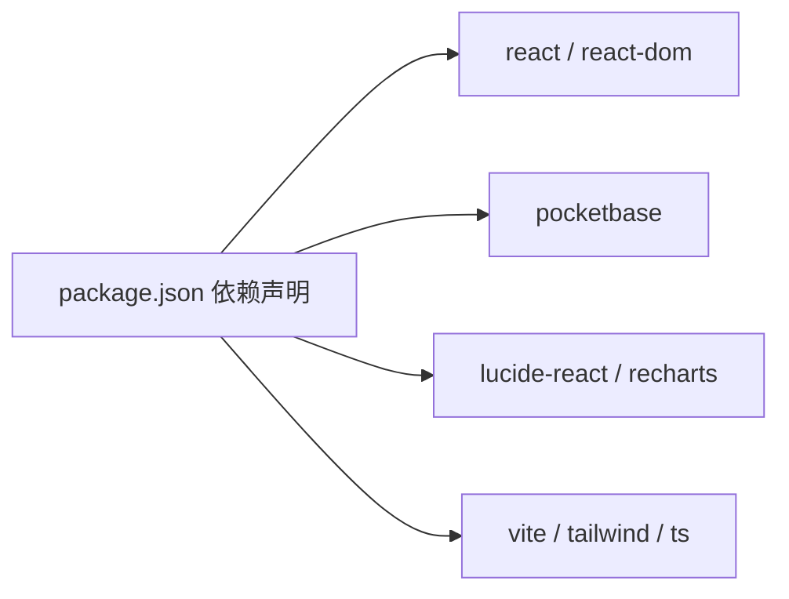

# 数据架构

<cite>
**本文引用的文件**
- [types.ts](file://types.ts)
- [pocketbase.ts](file://services/pocketbase.ts)
- [MIGRATION_SUMMARY.md](file://MIGRATION_SUMMARY.md)
- [1770189507_created_park_leasing_backups.js](file://pb_migrations/1770189507_created_park_leasing_backups.js)
- [Assets.tsx](file://components/Assets.tsx)
- [Opportunities.tsx](file://components/Opportunities.tsx)
- [CommissionLedger.tsx](file://components/CommissionLedger.tsx)
- [mockData.ts](file://services/mockData.ts)
- [setup-pocketbase.sh](file://scripts/setup-pocketbase.sh)
- [export-supabase-data.ts](file://scripts/export-supabase-data.ts)
- [App.tsx](file://App.tsx)
- [Settings.tsx](file://components/Settings.tsx)
- [package.json](file://package.json)
</cite>

## 目录
1. [简介](#简介)
2. [项目结构](#项目结构)
3. [核心组件](#核心组件)
4. [架构总览](#架构总览)
5. [详细组件分析](#详细组件分析)
6. [依赖分析](#依赖分析)
7. [性能考量](#性能考量)
8. [故障排查指南](#故障排查指南)
9. [结论](#结论)
10. [附录](#附录)

## 简介
本文件面向开发者与数据工程师，系统性阐述“上海商机及渠道管理系统”的数据架构，涵盖 TypeScript 类型定义、PocketBase 数据模型、数据库迁移策略、数据同步机制、核心实体关系与数据流转过程，并提供数据验证规则、缓存策略、错误处理与性能优化建议，以及备份恢复与版本管理说明。

## 项目结构
系统采用前端 React + PocketBase 的双实例架构：
- 前端应用通过 PocketBase SDK 与本地备份实例通信，负责业务数据的持久化与读取。
- 另一个 PocketBase 实例承载“招商管理”系统的房源数据，前端通过服务层从该实例拉取资产快照并映射为本地 Unit 类型。
- 迁移总结文档与迁移脚本确保从 Supabase 平滑过渡到 PocketBase。

图表来源
- [pocketbase.ts](file://services/pocketbase.ts#L1-L226)
- [MIGRATION_SUMMARY.md](file://MIGRATION_SUMMARY.md#L90-L111)

章节来源
- [pocketbase.ts](file://services/pocketbase.ts#L1-L226)
- [MIGRATION_SUMMARY.md](file://MIGRATION_SUMMARY.md#L1-L224)

## 核心组件
- 类型系统与枚举：统一定义 Opportunity、Unit、Channel、Commission、Policy 等核心实体及其状态/来源/等级等枚举，保证前后端一致的数据契约。
- 服务层：封装与本地/招商 PocketBase 的交互，包括资产同步、备份保存/加载、乐观更新等。
- 组件层：机会线索、资产、佣金台账等界面组件消费类型与服务层能力，驱动数据展示与变更。
- 迁移与脚本：从 Supabase 到 PocketBase 的迁移路径、Collection 初始化脚本与数据导出脚本。

章节来源
- [types.ts](file://types.ts#L1-L261)
- [pocketbase.ts](file://services/pocketbase.ts#L1-L226)
- [Assets.tsx](file://components/Assets.tsx#L1-L200)
- [Opportunities.tsx](file://components/Opportunities.tsx#L1-L200)
- [CommissionLedger.tsx](file://components/CommissionLedger.tsx#L1-L200)
- [MIGRATION_SUMMARY.md](file://MIGRATION_SUMMARY.md#L1-L224)
- [setup-pocketbase.sh](file://scripts/setup-pocketbase.sh#L1-L55)
- [export-supabase-data.ts](file://scripts/export-supabase-data.ts#L1-L70)

## 架构总览
系统围绕“机会线索—资产—渠道—佣金”主线构建，数据在本地与招商系统之间双向流动：
- 本地 PocketBase 存储业务快照与配置，前端通过服务层进行读写。
- 招商 PocketBase 提供资产快照，前端服务层解析并映射为本地 Unit 类型。
- 合并策略保障本地与云端数据一致性，删除标记（墓碑）防止僵尸子数据复活。

图表来源
- [pocketbase.ts](file://services/pocketbase.ts#L50-L125)
- [pocketbase.ts](file://services/pocketbase.ts#L130-L179)
- [Assets.tsx](file://components/Assets.tsx#L109-L142)

章节来源
- [pocketbase.ts](file://services/pocketbase.ts#L1-L226)
- [Assets.tsx](file://components/Assets.tsx#L1-L200)

## 详细组件分析

### 类型与实体模型
- 实体与枚举：Opportunity、Unit、Channel、Commission、CommissionRule、Activity、User、PolicyChangeLog 等。
- 关系要点：
  - Opportunity 与 Unit 通过 targetUnitId/roomNo 关联；Contract 阶段后生成 Commission。
  - Channel 包含多个 Agent，Commission 与 Channel/Opportunity 关联。
  - AppData 作为聚合根，包含多类实体与 deletedIds 墓碑标记，支撑合并与级联过滤。

图表来源
- [types.ts](file://types.ts#L78-L238)
- [types.ts](file://types.ts#L184-L221)

章节来源
- [types.ts](file://types.ts#L1-L261)

### 数据同步与映射（资产）
- 来源：招商 PocketBase 的 park_backups 集合，按 project_id 定位快照。
- 解析：深度搜索快照中的 buildings/tenants，建立 unitId→tenantName 映射。
- 映射：将外部字段映射为本地 Unit 字段，状态映射规则见服务层。
- 错误处理：返回 error 字段，前端根据状态提示与保护当前数据。

图表来源
- [pocketbase.ts](file://services/pocketbase.ts#L50-L125)

章节来源
- [pocketbase.ts](file://services/pocketbase.ts#L1-L226)
- [Assets.tsx](file://components/Assets.tsx#L109-L142)

### 备份与合并策略
- 本地备份：park_leasing_backups 集合，保存 AppData JSON。
- 乐观更新：尝试更新最新记录，捕获并发冲突（HTTP 409），回退到新建记录。
- 数据合并：基于 ID 去重，云端优先，本地覆盖；删除标记（deletedIds）级联过滤子数据，防止僵尸数据复活；用户数据特殊处理，避免云端空覆盖本地有效数据。

图表来源
- [App.tsx](file://App.tsx#L16-L75)
- [1770189507_created_park_leasing_backups.js](file://pb_migrations/1770189507_created_park_leasing_backups.js#L1-L54)

章节来源
- [App.tsx](file://App.tsx#L1-L200)
- [1770189507_created_park_leasing_backups.js](file://pb_migrations/1770189507_created_park_leasing_backups.js#L1-L54)

### 佣金与结算流程
- 生成：Contract 阶段后，根据 CommissionRule 与 DealParameters 生成 Commission 记录。
- 分期：支持一次性与分期两种 payoutType，installments 描述各期比例与触发条件。
- 状态机：PENDING → TRIGGERED → APPROVING → PAYABLE → PAID，前端台账按状态筛选与排序。

图表来源
- [types.ts](file://types.ts#L123-L134)
- [CommissionLedger.tsx](file://components/CommissionLedger.tsx#L1-L200)
- [Opportunities.tsx](file://components/Opportunities.tsx#L107-L120)

章节来源
- [types.ts](file://types.ts#L123-L134)
- [CommissionLedger.tsx](file://components/CommissionLedger.tsx#L1-L200)
- [Opportunities.tsx](file://components/Opportunities.tsx#L1-L200)

### 数据验证与边界
- 前端校验：新增/编辑时对必填字段进行即时校验，阻止无效提交。
- 服务层校验：资产同步返回 error 字段，前端据此提示并保护当前数据。
- 合并健壮性：通过 deletedIds 墓碑与级联过滤，避免删除后残留的子数据复活。

章节来源
- [Assets.tsx](file://components/Assets.tsx#L96-L107)
- [pocketbase.ts](file://services/pocketbase.ts#L122-L125)
- [App.tsx](file://App.tsx#L16-L75)

## 依赖分析
- 前端依赖：React、Lucide-React、Recharts、PocketBase SDK。
- 运行时：Vite 开发服务器（3000）、两个 PocketBase 实例（8090/8091）。
- 迁移与脚本：Shell 初始化脚本、Supabase 导出脚本。

图表来源
- [package.json](file://package.json#L11-L26)

章节来源
- [package.json](file://package.json#L1-L28)

## 性能考量
- 同步策略：建议手动触发资产同步，避免频繁自动轮询；可引入本地缓存（如5-10分钟）减少重复请求。
- 查询优化：前端组件使用 useMemo 缓存计算结果（如指标统计、过滤列表），降低渲染成本。
- 并发控制：本地备份更新采用乐观锁，冲突时回退新建，避免死锁与数据丢失。
- 网络与存储：合理设置 CORS 与端口，确保 8090/8091 端口可达；本地 SQLite 文件与 JSON 字段大小受约束，注意单条记录上限。

章节来源
- [MIGRATION_SUMMARY.md](file://MIGRATION_SUMMARY.md#L201-L208)
- [Assets.tsx](file://components/Assets.tsx#L36-L44)
- [pocketbase.ts](file://services/pocketbase.ts#L146-L179)

## 故障排查指南
- 连接问题
  - 检查端口占用与服务状态：8090（招商）、8091（本地）。
  - 确认 CORS 配置允许前端域名访问。
- Collection 未创建
  - 使用初始化脚本或手动在管理后台创建 park_leasing_backups，字段 name（text）、data（json）。
- 并发冲突
  - 乐观更新失败时，服务层返回 conflict 标志，前端应提示并重试或新建。
- 数据格式变更
  - 资产快照字段可能调整，解析引擎需适配；前端提示保护当前数据不被重置。
- 备份与恢复
  - 通过设置页列出历史备份，支持恢复到任意历史快照；导出/导入可通过 PocketBase 管理后台或脚本完成。

章节来源
- [setup-pocketbase.sh](file://scripts/setup-pocketbase.sh#L1-L55)
- [pocketbase.ts](file://services/pocketbase.ts#L146-L179)
- [Assets.tsx](file://components/Assets.tsx#L188-L200)
- [Settings.tsx](file://components/Settings.tsx#L17-L48)
- [export-supabase-data.ts](file://scripts/export-supabase-data.ts#L1-L70)

## 结论
本系统通过清晰的类型定义、稳定的 PocketBase 数据模型与严谨的合并/同步策略，实现了商机、资产、渠道与佣金的闭环管理。迁移总结与脚本确保了从 Supabase 到 PocketBase 的平滑过渡，配合本地缓存与并发控制，兼顾了可用性与一致性。建议持续完善字段校验、日志追踪与自动化测试，以进一步提升稳定性与可观测性。

## 附录

### 数据模型设计指导与最佳实践
- 字段设计
  - 使用明确的枚举与受限字符串，避免自由文本带来的歧义。
  - 对于 JSON 字段（如 AppData.data），控制单条记录大小，必要时拆分集合。
- 关系建模
  - 通过 ID 引用而非嵌套对象，便于合并与查询。
  - 使用墓碑（deletedIds）标记删除，避免物理删除导致的级联不一致。
- 状态机
  - 对关键流程（机会阶段、佣金状态）采用有限状态机，前端与服务层保持一致的转换规则。
- 同步与合并
  - 云端优先、本地覆盖；合并前先做墓碑合并与级联过滤。
  - 对外只读接口（如资产快照）严格限制写权限，避免污染源数据。

### 版本管理与迁移
- 迁移脚本：pb_migrations 中的 JS 脚本用于创建/删除 Collection，确保数据库结构与代码一致。
- 迁移总结：MIGRATION_SUMMARY.md 记录了环境、配置、功能对照与回滚方案，便于审计与复盘。
- 回滚路径：可恢复 Supabase 相关文件与依赖，快速切回旧方案。

章节来源
- [1770189507_created_park_leasing_backups.js](file://pb_migrations/1770189507_created_park_leasing_backups.js#L1-L54)
- [MIGRATION_SUMMARY.md](file://MIGRATION_SUMMARY.md#L179-L224)