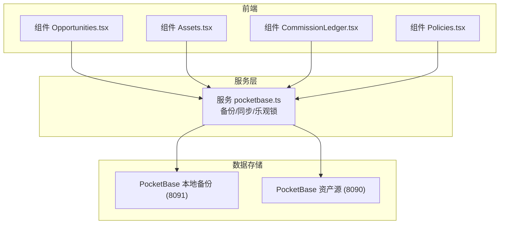
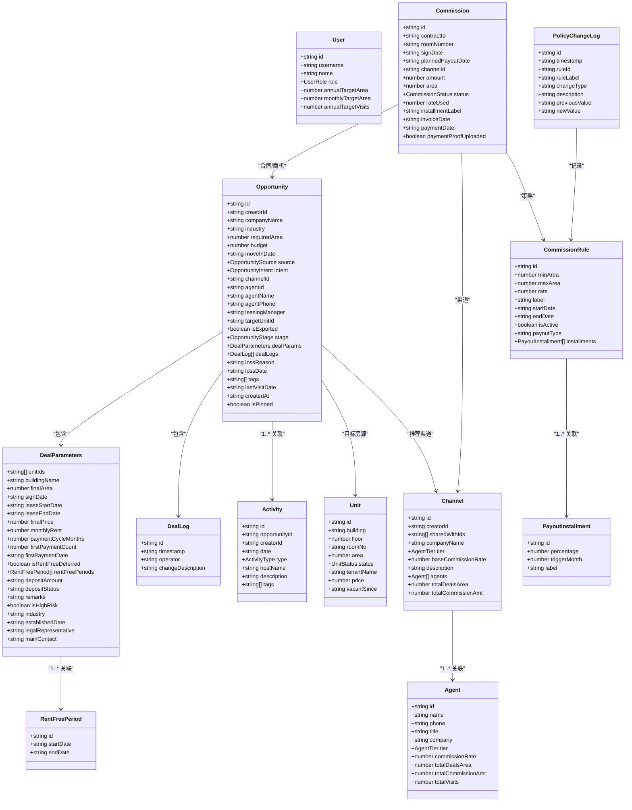
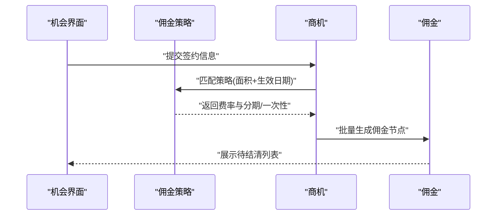
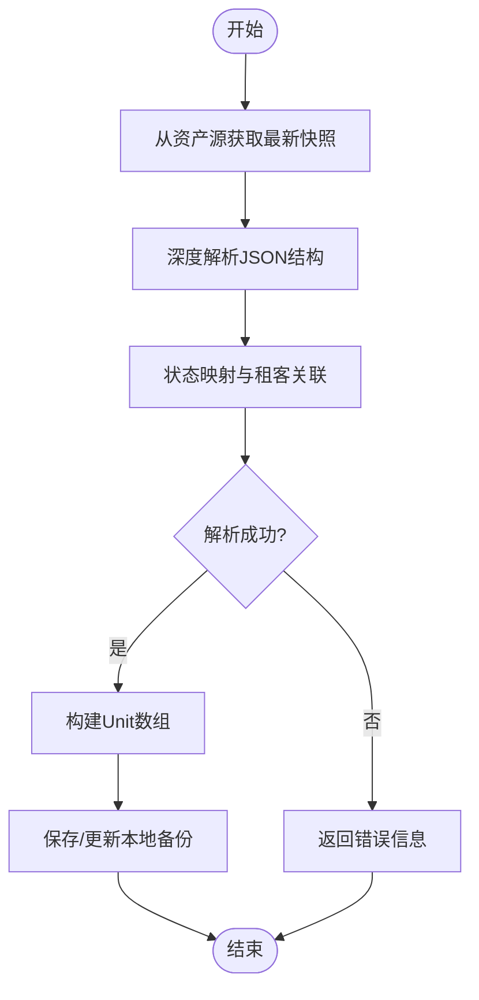
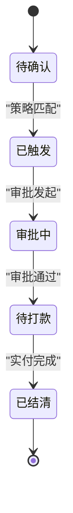
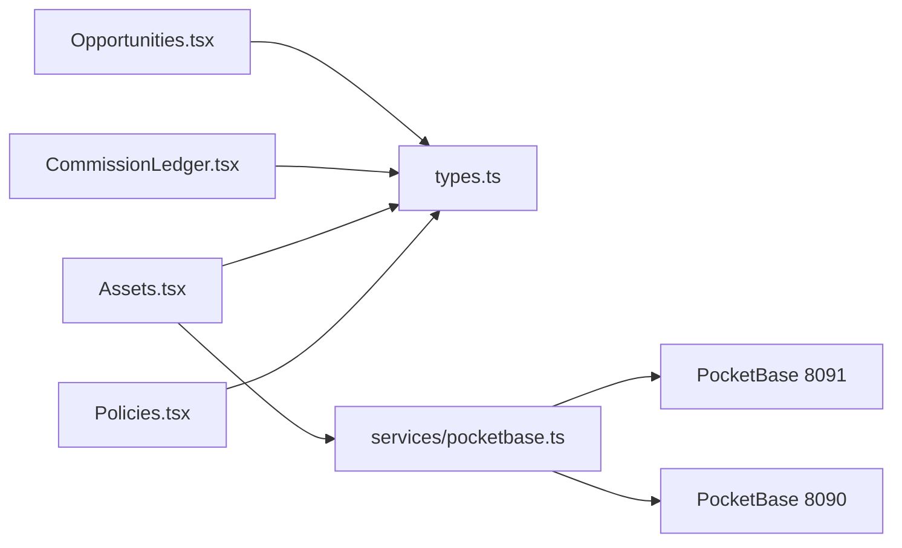

# 数据模型

<cite>
**本文引用的文件**
- [types.ts](file://types.ts)
- [pocketbase.ts](file://services/pocketbase.ts)
- [mockData.ts](file://services/mockData.ts)
- [Opportunities.tsx](file://components/Opportunities.tsx)
- [CommissionLedger.tsx](file://components/CommissionLedger.tsx)
- [Assets.tsx](file://components/Assets.tsx)
- [Policies.tsx](file://components/Policies.tsx)
- [App.tsx](file://App.tsx)
- [MIGRATION_SUMMARY.md](file://MIGRATION_SUMMARY.md)
- [README.md](file://README.md)
- [metadata.json](file://metadata.json)
</cite>

## 目录
1. [简介](#简介)
2. [项目结构](#项目结构)
3. [核心数据模型](#核心数据模型)
4. [架构总览](#架构总览)
5. [详细组件分析](#详细组件分析)
6. [依赖关系分析](#依赖关系分析)
7. [性能考量](#性能考量)
8. [故障排查指南](#故障排查指南)
9. [结论](#结论)
10. [附录](#附录)

## 简介
本文件面向开发者与数据工程师，系统化梳理“上海商机及渠道管理系统”的数据模型与业务规则，覆盖核心实体（User、Opportunity、Unit、Channel、Commission、Activity、Agent、CommissionRule、PolicyChangeLog、DealParameters、DealLog、RentFreePeriod、PayoutInstallment）及其枚举类型（OpportunityStage、UnitStatus、CommissionStatus、AgentTier、ActivityType、UserRole、OpportunitySource、OpportunityIntent、ResistanceType）。文档同时给出字段语义、数据类型、约束条件、默认值与长度限制建议、验证规则、关系图与外键约束说明，并提供最佳实践与扩展指导。

## 项目结构
系统采用前端 TypeScript + React + PocketBase 的轻量架构：
- 前端组件负责业务交互与视图渲染，调用服务层接口与本地/云端 PocketBase 进行数据持久化与同步。
- 服务层封装与外部系统的集成（如招商管理系统的资产数据），并提供备份/恢复能力。
- 数据模型定义集中在 TypeScript 接口与枚举中，作为前后端契约。

图表来源
- [pocketbase.ts](file://services/pocketbase.ts#L1-L226)
- [Opportunities.tsx](file://components/Opportunities.tsx#L1-L200)
- [Assets.tsx](file://components/Assets.tsx#L1-L200)
- [CommissionLedger.tsx](file://components/CommissionLedger.tsx#L1-L200)
- [Policies.tsx](file://components/Policies.tsx#L157-L296)

章节来源
- [README.md](file://README.md#L1-L21)
- [metadata.json](file://metadata.json#L1-L5)

## 核心数据模型

### 枚举类型与取值范围
- OpportunityStage：线索、带看、谈判、签约、流失
- UnitStatus：待租、已租、预留、自用
- CommissionStatus：待确认、已触发、审批中、待打款、已结清
- AgentTier：金牌、潜力、低效
- ActivityType：带看、电访、报价、谈判、签约
- UserRole：管理员、一般账户
- OpportunitySource：渠道推荐、自拓、园区客户转介绍、线下主动拜访、线上自媒体渠道、其他
- OpportunityIntent：高意向、一般意向、不确定
- ResistanceType：价格、地段、产品、配套、无

章节来源
- [types.ts](file://types.ts#L10-L65)

### 实体与字段定义

#### User（用户）
- 字段
  - id: string（主键）
  - username: string（唯一标识）
  - password?: string（敏感信息，建议加密存储）
  - name: string（显示名）
  - role: UserRole（角色）
  - annualTargetArea?: number（年目标面积）
  - monthlyTargetArea?: number（月目标面积）
  - annualTargetVisits?: number（年目标带看次数）
- 约束与规则
  - username 唯一性由系统保证
  - password 建议使用安全散列存储
  - 年度/月度指标为可选，用于目标管理与看板展示
- 默认值与长度
  - 无固定默认值；字符串长度建议在 32 字节以内，避免过长导致索引膨胀

章节来源
- [types.ts](file://types.ts#L67-L76)

#### Opportunity（商机）
- 字段
  - id: string（主键）
  - creatorId: string（创建者）
  - companyName: string（企业名称）
  - industry: string（行业）
  - requiredArea: number（需求面积）
  - budget: number（预算）
  - moveInDate: string（预计入驻日期）
  - source: OpportunitySource（来源）
  - intent: OpportunityIntent（意向）
  - channelId?: string（渠道ID）
  - agentId?: string（经纪人ID）
  - agentName?: string（冗余字段，便于展示）
  - agentPhone?: string（冗余字段）
  - leasingManager: string（招商经理）
  - targetUnitId?: string（目标房源ID）
  - isExported?: boolean（是否导出）
  - stage: OpportunityStage（所处阶段）
  - dealParams?: DealParameters（成交参数）
  - dealLogs?: DealLog[]（成交日志）
  - lossReason?: string（流失原因）
  - lossDate?: string（流失日期）
  - tags: string[]（标签）
  - lastVisitDate?: string（最后跟进日期）
  - createdAt: string（创建时间）
  - isPinned?: boolean（是否置顶）
- 约束与规则
  - 必填校验：创建时要求企业名称与需求面积
  - 签约后自动触发佣金生成
  - 流失时记录原因与日期
  - 关联 Activity 通过 opportunityId 维护
- 默认值与长度
  - tags 默认空数组
  - 字符串字段长度建议控制在 255 字节以内，避免索引过大

章节来源
- [types.ts](file://types.ts#L184-L210)
- [Opportunities.tsx](file://components/Opportunities.tsx#L73-L100)
- [Opportunities.tsx](file://components/Opportunities.tsx#L107-L120)

#### Unit（房源）
- 字段
  - id: string（主键）
  - building: string（楼宇）
  - floor: number（楼层）
  - roomNo: string（房号/房间号）
  - area: number（面积）
  - status: UnitStatus（状态）
  - tenantName?: string（承租方）
  - price?: number（单价）
  - vacantSince?: string（空置起始日期）
- 约束与规则
  - 状态映射：支持从外部系统状态映射为内部状态
  - 自用/预留/占用状态互斥
  - 空置天数计算基于 vacantSince
- 默认值与长度
  - 无固定默认值；roomNo 建议唯一，便于展示与检索

章节来源
- [types.ts](file://types.ts#L78-L88)
- [pocketbase.ts](file://services/pocketbase.ts#L21-L28)
- [Assets.tsx](file://components/Assets.tsx#L67-L71)

#### Channel（渠道）
- 字段
  - id: string（主键）
  - creatorId?: string（创建者）
  - sharedWithIds?: string[]（共享给哪些用户）
  - companyName: string（公司名称）
  - tier: AgentTier（渠道等级）
  - baseCommissionRate: number（基础佣金费率）
  - description?: string（描述）
  - agents: Agent[]（关联经纪人）
  - totalDealsArea: number（累计成交面积）
  - totalCommissionAmt: number（累计佣金金额）
- 约束与规则
  - agents 为内嵌对象集合，支持多经纪人
  - 佣金统计与策略联动
- 默认值与长度
  - 无固定默认值；字符串长度建议控制在 255 字节以内

章节来源
- [types.ts](file://types.ts#L103-L114)

#### Agent（经纪人）
- 字段
  - id: string（主键）
  - name: string（姓名）
  - phone: string（电话）
  - title?: string（头衔）
  - company?: string（所属公司）
  - tier?: AgentTier（等级）
  - commissionRate?: number（个人抽成率）
  - totalDealsArea?: number（累计成交面积）
  - totalCommissionAmt?: number（累计佣金）
  - totalVisits?: number（累计带看次数）
- 约束与规则
  - 与 Channel 一对多关系
  - 可参与佣金分配
- 默认值与长度
  - 无固定默认值

章节来源
- [types.ts](file://types.ts#L90-L101)

#### Commission（佣金）
- 字段
  - id: string（主键）
  - contractId: string（合同/商机ID）
  - roomNumber: string（房间号拼接）
  - signDate: string（签约日期）
  - plannedPayoutDate: string（计划发放日期）
  - channelId: string（渠道ID）
  - amount: number（金额）
  - area: number（面积）
  - status: CommissionStatus（状态）
  - rateUsed: number（使用费率）
  - installmentLabel: string（分期标识，如“1/2”或“一次性”）
  - invoiceDate?: string（开票日期）
  - paymentDate?: string（实付日期）
  - paymentProofUploaded: boolean（是否上传付款凭证）
- 约束与规则
  - 签约后按策略拆分为分期或一次性
  - 管理员可调整状态与计划发放日期
  - 超期判断：开票日期超过15天视为超期
- 默认值与长度
  - 无固定默认值；installmentLabel 建议不超过 32 字节

章节来源
- [types.ts](file://types.ts#L223-L238)
- [App.tsx](file://App.tsx#L380-L435)
- [CommissionLedger.tsx](file://components/CommissionLedger.tsx#L19-L36)

#### Activity（活动轨迹）
- 字段
  - id: string（主键）
  - opportunityId: string（商机ID）
  - creatorId: string（创建者）
  - date: string（日期）
  - type: ActivityType（类型）
  - hostName: string（组织人）
  - description: string（内容）
  - tags?: string[]（标签）
- 约束与规则
  - 与 Opportunity 外键关联
  - 用于记录带看、电访、报价、谈判、签约等行为
- 默认值与长度
  - 无固定默认值；description 建议不超过 1000 字节

章节来源
- [types.ts](file://types.ts#L212-L221)
- [Opportunities.tsx](file://components/Opportunities.tsx#L151-L159)

#### CommissionRule（佣金策略）
- 字段
  - id: string（主键）
  - minArea: number（门槛面积）
  - maxArea: number（封顶面积）
  - rate: number（费率）
  - label: string（策略名称）
  - startDate: string（生效起始日）
  - endDate: string（生效截止日）
  - isActive: boolean（是否启用）
  - payoutType: 'ONETIME' | 'STAGED'（一次性/分期）
  - installments: PayoutInstallment[]（分期节点）
- 约束与规则
  - 按面积区间匹配，结合生效日期
  - 分期策略支持多个节点，按月触发
- 默认值与长度
  - 无固定默认值；label 建议不超过 128 字节

章节来源
- [types.ts](file://types.ts#L123-L134)

#### PayoutInstallment（分期节点）
- 字段
  - id: string（主键）
  - percentage: number（比例，0-100）
  - triggerMonth: number（触发延迟月数，0 表示签约当月）
  - label: string（节点名称）
- 约束与规则
  - 与 CommissionRule 一对多
  - 触发日期 = 签约日期 + triggerMonth
- 默认值与长度
  - 无固定默认值；label 建议不超过 64 字节

章节来源
- [types.ts](file://types.ts#L116-L121)

#### PolicyChangeLog（策略变更日志）
- 字段
  - id: string（主键）
  - timestamp: string（变更时间）
  - ruleId: string（策略ID）
  - ruleLabel: string（策略名称）
  - changeType: 'CREATE' | 'UPDATE' | 'EXTEND' | 'DELETE'（变更类型）
  - description: string（描述）
  - previousValue?: string（变更前值）
  - newValue?: string（变更后值）
- 约束与规则
  - 记录策略生命周期内的所有变更
- 默认值与长度
  - 无固定默认值；description 建议不超过 500 字节

章节来源
- [types.ts](file://types.ts#L136-L145)

#### DealParameters（成交参数）
- 字段
  - unitIds: string[]（签约单元ID列表）
  - buildingName: string（签约建筑名）
  - finalArea: number（最终面积）
  - signDate: string（签约日期）
  - leaseStartDate: string（起租日期）
  - leaseEndDate: string（到期日期）
  - finalPrice: number（最终单价）
  - monthlyRent: number（月租金）
  - paymentCycleMonths: number（缴费周期，月）
  - firstPaymentCount: number（首期缴费期数）
  - firstPaymentDate: string（首期缴费日期）
  - isRentFreeDeferred: boolean（免租期是否延期）
  - rentFreePeriods: RentFreePeriod[]（免租期列表）
  - depositAmount: string（押金金额）
  - depositStatus: string（押金状态）
  - remarks: string（备注）
  - isHighRisk?: boolean（是否高风险）
  - industry?: string（企业行业）
  - establishedDate?: string（成立日期）
  - legalRepresentative?: string（法人代表）
  - mainContact?: string（主要联系人）
- 约束与规则
  - 月租由面积×单价估算得出
  - 免租期支持多个时间段
- 默认值与长度
  - 无固定默认值；remarks 建议不超过 500 字节

章节来源
- [types.ts](file://types.ts#L153-L175)

#### DealLog（成交日志）
- 字段
  - id: string（主键）
  - timestamp: string（时间戳）
  - operator: string（操作人）
  - changeDescription: string（变更描述）
- 约束与规则
  - 记录成交过程中的关键变更
- 默认值与长度
  - 无固定默认值；changeDescription 建议不超过 500 字节

章节来源
- [types.ts](file://types.ts#L177-L182)

#### RentFreePeriod（免租期）
- 字段
  - id: string（主键）
  - startDate: string（开始日期）
  - endDate: string（结束日期）
- 约束与规则
  - 与 DealParameters 关联
- 默认值与长度
  - 无固定默认值

章节来源
- [types.ts](file://types.ts#L147-L151)

#### AppData（应用数据聚合）
- 字段
  - opportunities: Opportunity[]
  - channels: Channel[]
  - commissions: Commission[]
  - units: Unit[]
  - commissionRules: CommissionRule[]
  - policyHistory: PolicyChangeLog[]
  - activities: Activity[]
  - users: User[]
  - settings: { annualTargetArea: number }
  - deletedIds?: string[]（已删除ID追踪）
- 约束与规则
  - 作为本地备份与同步的数据载体
- 默认值与长度
  - 无固定默认值

章节来源
- [types.ts](file://types.ts#L240-L253)

## 架构总览
系统通过组件驱动数据流，服务层负责与外部系统对接与本地备份管理，数据模型在前端以 TypeScript 接口形式定义，确保类型安全与一致性。

图表来源
- [types.ts](file://types.ts#L67-L253)

## 详细组件分析

### 机会生命周期与佣金生成流程

图表来源
- [App.tsx](file://App.tsx#L380-L435)
- [types.ts](file://types.ts#L123-L134)
- [types.ts](file://types.ts#L223-L238)

章节来源
- [App.tsx](file://App.tsx#L380-L435)

### 资产同步与状态映射

图表来源
- [pocketbase.ts](file://services/pocketbase.ts#L50-L125)
- [pocketbase.ts](file://services/pocketbase.ts#L21-L28)

章节来源
- [pocketbase.ts](file://services/pocketbase.ts#L50-L125)

### 佣金状态流转

图表来源
- [types.ts](file://types.ts#L33-L39)
- [CommissionLedger.tsx](file://components/CommissionLedger.tsx#L139-L147)

章节来源
- [types.ts](file://types.ts#L33-L39)
- [CommissionLedger.tsx](file://components/CommissionLedger.tsx#L139-L147)

### 数据验证与默认值
- 必填校验
  - 创建商机：企业名称、需求面积
  - 新增/编辑房源：房号、面积、楼宇
- 默认值
  - tags: []
  - isPinned: false
  - paymentProofUploaded: false
  - 其他数值字段默认 0
- 长度限制建议
  - 文本字段：不超过 255 字节
  - 描述类：不超过 500 字节
  - 策略名称：不超过 128 字节
  - 分期标签：不超过 64 字节
- 业务规则
  - 月租 = 面积 × 单价 × 30.42（估算）
  - 超期判断：开票日期超过15天

章节来源
- [Opportunities.tsx](file://components/Opportunities.tsx#L73-L100)
- [Opportunities.tsx](file://components/Opportunities.tsx#L96-L100)
- [Assets.tsx](file://components/Assets.tsx#L96-L107)
- [App.tsx](file://App.tsx#L66-L71)
- [mockData.ts](file://services/mockData.ts#L73-L80)

## 依赖关系分析
- 组件依赖
  - Opportunities.tsx 依赖 Opportunity、Activity、Unit、Channel、Agent、DealParameters、DealLog、UserRole、OpportunityStage、OpportunitySource、OpportunityIntent、UnitStatus
  - CommissionLedger.tsx 依赖 Commission、CommissionStatus、Channel、Opportunity
  - Assets.tsx 依赖 Unit、UnitStatus、pocketbase.ts
  - Policies.tsx 依赖 CommissionRule、PayoutInstallment、PolicyChangeLog
- 服务依赖
  - pocketbase.ts 依赖本地与资产源两个 PocketBase 实例，提供备份/恢复与资产同步能力
- 外部系统
  - 资产源：招商管理系统的资产快照（park_backups）
  - 本地备份：park_leasing_backups（JSON 存储）

图表来源
- [Opportunities.tsx](file://components/Opportunities.tsx#L1-L32)
- [CommissionLedger.tsx](file://components/CommissionLedger.tsx#L1-L12)
- [Assets.tsx](file://components/Assets.tsx#L1-L14)
- [Policies.tsx](file://components/Policies.tsx#L157-L296)
- [pocketbase.ts](file://services/pocketbase.ts#L1-L226)

章节来源
- [Opportunities.tsx](file://components/Opportunities.tsx#L1-L32)
- [CommissionLedger.tsx](file://components/CommissionLedger.tsx#L1-L12)
- [Assets.tsx](file://components/Assets.tsx#L1-L14)
- [Policies.tsx](file://components/Policies.tsx#L157-L296)
- [pocketbase.ts](file://services/pocketbase.ts#L1-L226)

## 性能考量
- 查询与过滤
  - 使用 useMemo 缓存有效活动集合，避免重复过滤
  - CommissionLedger 对未结清佣金进行排序与统计，减少渲染成本
- 状态映射
  - 在资产同步时统一映射外部状态，降低前端分支判断
- 备份策略
  - 乐观锁更新本地备份，避免并发冲突导致的回滚
- 建议
  - 对高频字段建立索引（如 Opportunity.stage、Commission.contractId、Unit.status）
  - 控制单次查询返回数量，分页加载大列表

章节来源
- [Opportunities.tsx](file://components/Opportunities.tsx#L60-L64)
- [CommissionLedger.tsx](file://components/CommissionLedger.tsx#L19-L36)
- [pocketbase.ts](file://services/pocketbase.ts#L146-L179)

## 故障排查指南
- 同步失败
  - 现象：资产同步提示错误
  - 排查：检查资产源 PocketBase 是否运行、网络连通性、快照结构是否变化
  - 处理：根据错误信息调整解析逻辑，保持现有数据不被重置
- 备份异常
  - 现象：保存/更新备份失败或并发冲突
  - 排查：检查本地备份 Collection 配置、API 规则、并发更新
  - 处理：启用乐观锁重试，必要时重建 Collection
- 策略不生效
  - 现象：佣金未按预期生成
  - 排查：核对 CommissionRule 的生效日期、面积区间、是否启用
  - 处理：修正策略配置并记录 PolicyChangeLog

章节来源
- [Assets.tsx](file://components/Assets.tsx#L188-L200)
- [pocketbase.ts](file://services/pocketbase.ts#L130-L140)
- [pocketbase.ts](file://services/pocketbase.ts#L146-L179)
- [Policies.tsx](file://components/Policies.tsx#L157-L296)

## 结论
本数据模型围绕商机全生命周期与佣金结算设计，通过清晰的枚举与实体边界、严格的验证规则与合理的默认值，支撑前端组件的高效交互与服务层的稳定集成。建议在生产环境中进一步完善索引策略、审计日志与容灾备份，持续演进以满足业务增长。

## 附录

### 外键与关系说明
- Opportunity 与 Unit：一对一或多对多（通过 DealParameters.unitIds）
- Opportunity 与 Channel/Agent：一对一（通过 channelId/agentId）
- Opportunity 与 Activity：一对多（opportunityId）
- Commission 与 Opportunity/Channel：一对多（contractId/channelId）
- CommissionRule 与 PayoutInstallment：一对多
- PolicyChangeLog 与 CommissionRule：记录策略变更

章节来源
- [types.ts](file://types.ts#L184-L210)
- [types.ts](file://types.ts#L212-L221)
- [types.ts](file://types.ts#L223-L238)
- [types.ts](file://types.ts#L123-L134)
- [types.ts](file://types.ts#L136-L145)

### 最佳实践与扩展指导
- 字段设计
  - 优先使用枚举而非自由文本，提升一致性与可维护性
  - 对高频查询字段建立索引，避免全表扫描
- 数据治理
  - 引入审计字段（创建/更新时间、操作人）与软删除标记
  - 对敏感字段（password）进行加密存储
- 扩展方向
  - 引入渠道分级与抽成分摊规则
  - 增加佣金发票与付款凭证的附件管理
  - 支持多租户隔离与权限矩阵

章节来源
- [types.ts](file://types.ts#L67-L76)
- [types.ts](file://types.ts#L103-L114)
- [types.ts](file://types.ts#L223-L238)
- [MIGRATION_SUMMARY.md](file://MIGRATION_SUMMARY.md#L49-L87)