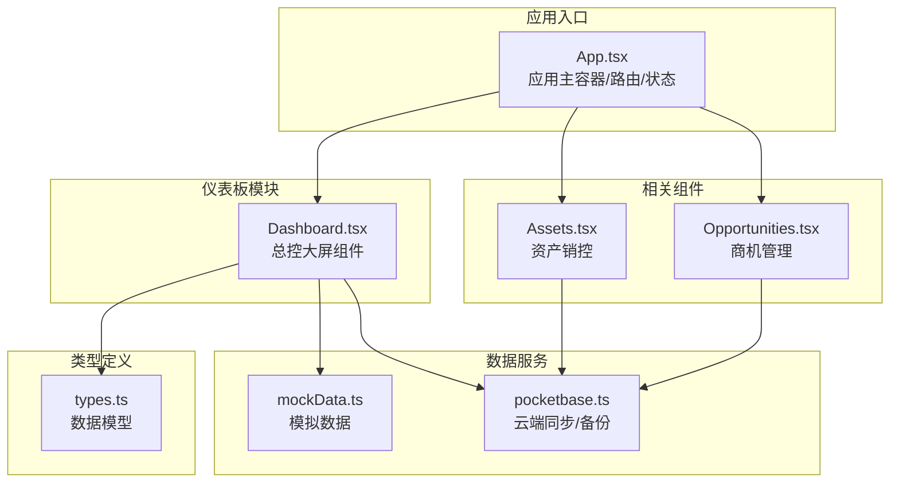
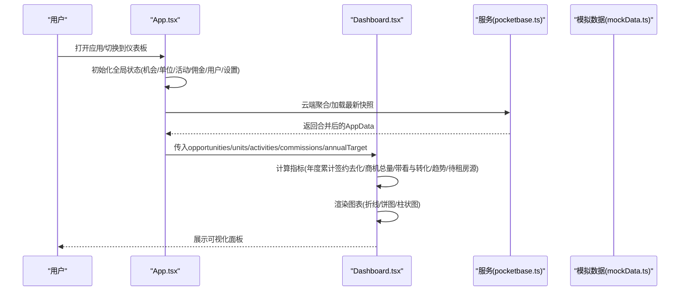
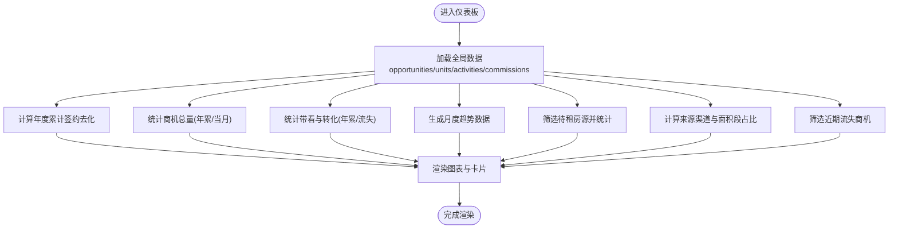
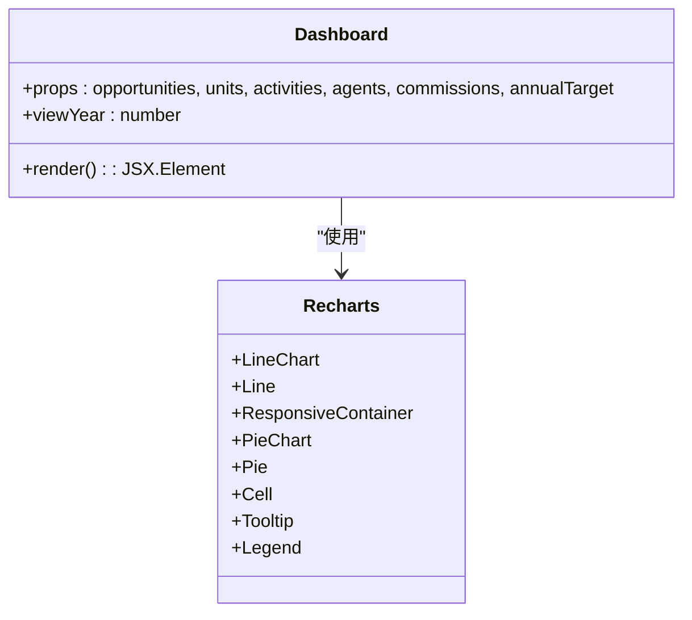
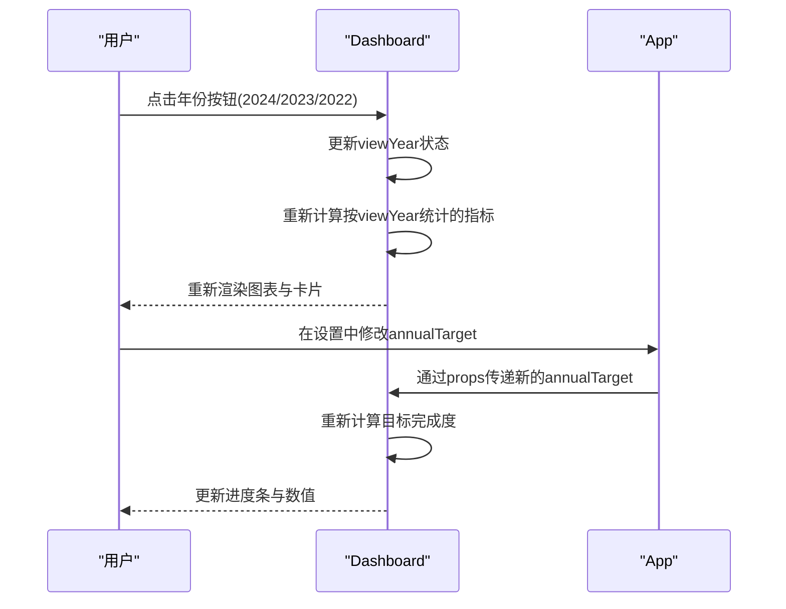
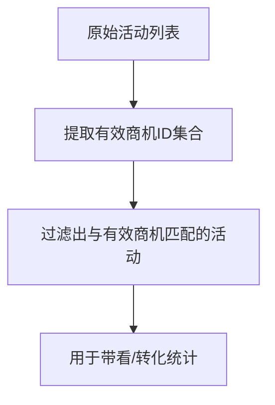
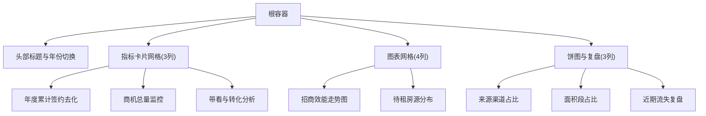
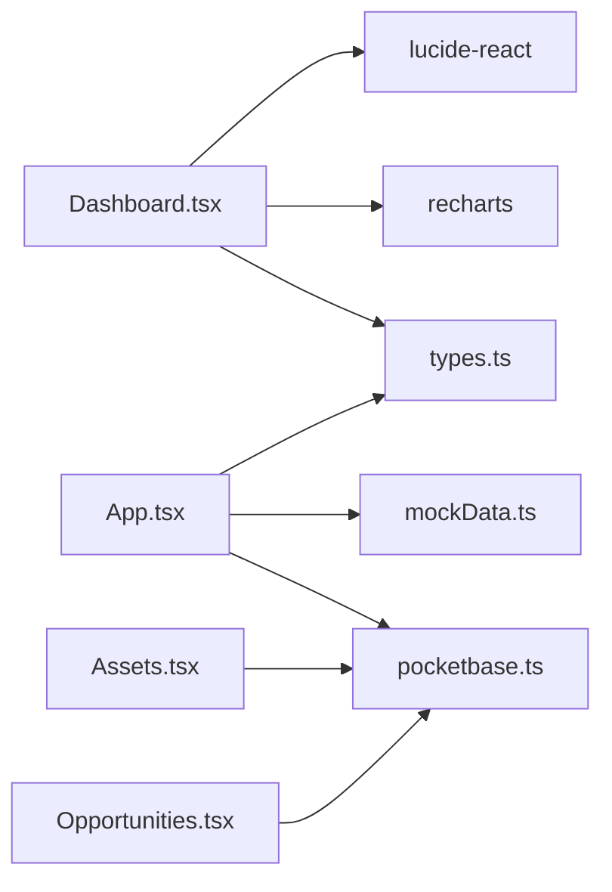

# 仪表板模块

<cite>
**本文引用的文件**
- [components/Dashboard.tsx](file://components/Dashboard.tsx)
- [App.tsx](file://App.tsx)
- [services/mockData.ts](file://services/mockData.ts)
- [services/pocketbase.ts](file://services/pocketbase.ts)
- [types.ts](file://types.ts)
- [components/Assets.tsx](file://components/Assets.tsx)
- [components/Opportunities.tsx](file://components/Opportunities.tsx)
- [package.json](file://package.json)
- [tailwind.config.js](file://tailwind.config.js)
- [index.css](file://index.css)
</cite>

## 目录
1. [简介](#简介)
2. [项目结构](#项目结构)
3. [核心组件](#核心组件)
4. [架构概览](#架构概览)
5. [详细组件分析](#详细组件分析)
6. [依赖关系分析](#依赖关系分析)
7. [性能考虑](#性能考虑)
8. [故障排查指南](#故障排查指南)
9. [结论](#结论)
10. [附录](#附录)

## 简介
本文件为“园区运营总控大屏”仪表板模块的详细技术文档。该模块面向招商运营管理者与决策者，提供年度累计签约去化、商机总量监控、带看与转化分析等核心指标的可视化展示，并通过折线图、饼图、柱状图等图表组件实现多维度数据洞察。文档涵盖数据可视化组件实现、年度目标设定、数据筛选与时间维度切换、布局设计与响应式适配、性能优化策略以及不同角色用户的使用场景与决策支持价值。

## 项目结构
仪表板模块位于前端组件目录下，采用按功能分层的组织方式：
- 组件层：Dashboard.tsx 为核心仪表板组件，负责指标计算与图表渲染
- 应用入口：App.tsx 管理全局状态、路由与侧边栏导航，将仪表板作为主界面之一
- 数据服务：mockData.ts 提供模拟数据，pocketbase.ts 提供云端同步能力
- 类型定义：types.ts 定义了商机、单位、活动、佣金等核心数据模型
- 其他相关组件：Assets.tsx（资产销控）、Opportunities.tsx（商机管理）与仪表板形成协同

**图表来源**
- [App.tsx](file://App.tsx#L495-L573)
- [components/Dashboard.tsx](file://components/Dashboard.tsx#L1-L315)
- [services/mockData.ts](file://services/mockData.ts#L1-L81)
- [services/pocketbase.ts](file://services/pocketbase.ts#L1-L226)
- [types.ts](file://types.ts#L1-L261)
- [components/Assets.tsx](file://components/Assets.tsx#L1-L200)
- [components/Opportunities.tsx](file://components/Opportunities.tsx#L1-L200)

**章节来源**
- [App.tsx](file://App.tsx#L495-L573)
- [components/Dashboard.tsx](file://components/Dashboard.tsx#L1-L315)
- [services/mockData.ts](file://services/mockData.ts#L1-L81)
- [services/pocketbase.ts](file://services/pocketbase.ts#L1-L226)
- [types.ts](file://types.ts#L1-L261)
- [components/Assets.tsx](file://components/Assets.tsx#L1-L200)
- [components/Opportunities.tsx](file://components/Opportunities.tsx#L1-L200)

## 核心组件
- Dashboard 组件：负责年度累计签约去化、商机总量监控、带看与转化分析、招商效能走势、待租房源分布、来源渠道与面积段占比、近期商机流失复盘等指标的计算与可视化渲染。
- App 主容器：承载仪表板与其他模块，维护全局状态（机会、单位、活动、佣金、用户、设置等），并提供云端聚合与同步能力。
- 数据服务：mockData.ts 提供初始数据与辅助计算；pocketbase.ts 提供云端备份读写、最新快照更新与资产同步。
- 类型系统：types.ts 定义 Opportunity、Unit、Activity、Commission、CommissionRule 等核心实体与枚举，确保数据一致性与可扩展性。

**章节来源**
- [components/Dashboard.tsx](file://components/Dashboard.tsx#L1-L315)
- [App.tsx](file://App.tsx#L179-L617)
- [services/mockData.ts](file://services/mockData.ts#L1-L81)
- [services/pocketbase.ts](file://services/pocketbase.ts#L1-L226)
- [types.ts](file://types.ts#L1-L261)

## 架构概览
仪表板模块采用“组件-服务-类型”的分层架构：
- 视图层：Dashboard.tsx 使用 Recharts 渲染图表，结合 TailwindCSS 实现响应式布局与主题风格
- 业务层：App.tsx 管理全局数据与状态，负责数据持久化、云端聚合与合并
- 数据层：mockData.ts 提供初始数据，pocketbase.ts 提供云端备份与资产同步
- 类型层：types.ts 提供强类型约束，确保跨模块数据一致

**图表来源**
- [App.tsx](file://App.tsx#L179-L617)
- [components/Dashboard.tsx](file://components/Dashboard.tsx#L20-L315)
- [services/pocketbase.ts](file://services/pocketbase.ts#L146-L204)
- [services/mockData.ts](file://services/mockData.ts#L63-L81)

## 详细组件分析

### 仪表板核心指标与可视化
Dashboard 组件通过 useMemo 对数据进行高效计算与缓存，避免重复渲染带来的性能损耗。主要指标包括：
- 年度累计签约去化：基于合同阶段与成交参数中的签约日期与最终面积进行统计，支持年度目标完成度展示
- 商机总量监控：年度累计与当月新增商机数量
- 带看与转化分析：年度带看总数与年度流失商机数量
- 招商效能走势图：按月展示商机入库与客户带看趋势
- 待租房源分布：按待租面积与带看次数排序，展示园区待租单元的实时分布
- 来源渠道占比与客户需求面积段占比：使用饼图展示商机来源与面积段分布
- 近期商机流失复盘：展示最近流失的商机及其复盘原因

**图表来源**
- [components/Dashboard.tsx](file://components/Dashboard.tsx#L20-L315)

**章节来源**
- [components/Dashboard.tsx](file://components/Dashboard.tsx#L20-L315)

### 图表组件与交互逻辑
- 折线图：用于展示招商效能走势，包含商机入库与客户带看两条曲线，支持响应式容器与自定义 Tooltip/网格样式
- 饼图：用于展示来源渠道占比与客户需求面积段占比，支持图例与 Tooltip
- 卡片与进度条：用于展示年度累计签约去化与目标完成度，支持动态宽度与百分比显示
- 列表与表格：用于展示待租房源与近期流失商机，支持排序与滚动查看

**图表来源**
- [components/Dashboard.tsx](file://components/Dashboard.tsx#L1-L315)

**章节来源**
- [components/Dashboard.tsx](file://components/Dashboard.tsx#L177-L311)

### 年度目标设定与时间维度切换
- 年度目标：通过 App.tsx 的 annualTarget 状态与 Dashboard 的 annualTarget 属性进行绑定，支持在设置模块中调整目标值
- 时间维度切换：通过视图年份选择器在当前年、前一年、前两年之间切换，影响所有按年统计的指标与趋势图

**图表来源**
- [components/Dashboard.tsx](file://components/Dashboard.tsx#L23-L122)
- [App.tsx](file://App.tsx#L238-L241)

**章节来源**
- [components/Dashboard.tsx](file://components/Dashboard.tsx#L23-L122)
- [App.tsx](file://App.tsx#L238-L241)

### 数据筛选与有效性校验
- 有效轨迹集合：通过 useMemo 过滤掉已删除或不存在商机的活动记录，避免脏数据污染统计
- 有效商机集合：在计算待租房源与带看次数时，仅对当前存在的商机进行统计
- 级联删除：删除商机时，同时记录其关联的佣金与活动ID，防止云端合并时“僵尸子数据复活”

**图表来源**
- [components/Dashboard.tsx](file://components/Dashboard.tsx#L25-L29)
- [App.tsx](file://App.tsx#L457-L468)

**章节来源**
- [components/Dashboard.tsx](file://components/Dashboard.tsx#L25-L29)
- [App.tsx](file://App.tsx#L457-L468)

### 仪表板布局设计与响应式适配
- 布局结构：采用栅格系统(grid)与卡片(card)组合，实现指标卡片与图表区域的灵活排列
- 响应式策略：使用 TailwindCSS 断点控制在不同屏幕尺寸下的列数与间距，确保在桌面与平板上的良好体验
- 滚动与交互：侧边栏与内容区域均支持自定义滚动条样式，提升视觉一致性

**图表来源**
- [components/Dashboard.tsx](file://components/Dashboard.tsx#L104-L311)
- [tailwind.config.js](file://tailwind.config.js#L1-L13)
- [index.css](file://index.css#L11-L27)

**章节来源**
- [components/Dashboard.tsx](file://components/Dashboard.tsx#L104-L311)
- [tailwind.config.js](file://tailwind.config.js#L1-L13)
- [index.css](file://index.css#L11-L27)

### 不同角色用户的使用场景与决策支持
- 管理员：关注整体目标完成度、资产销控与政策配置，通过仪表板了解年度签约去化与带看转化情况，指导资源分配与策略调整
- 招商经理：关注个人/团队业绩、商机来源与面积段分布，结合待租房源分布制定带看计划与转化策略
- 决策者：通过年度累计签约去化与趋势图把握运营节奏，结合来源渠道与面积段占比识别市场机会与风险

[本节为概念性说明，无需代码来源]

## 依赖关系分析
- 组件依赖：Dashboard 依赖 Recharts 进行图表渲染，依赖 Lucide React 图标库，依赖 types.ts 的类型定义
- 应用依赖：App.tsx 作为全局状态容器，依赖 pocketbase.ts 进行云端聚合与备份，依赖 mockData.ts 提供初始数据
- 外部依赖：React、Recharts、Lucide React、PocketBase

**图表来源**
- [components/Dashboard.tsx](file://components/Dashboard.tsx#L1-L6)
- [App.tsx](file://App.tsx#L1-L14)
- [services/pocketbase.ts](file://services/pocketbase.ts#L1-L12)
- [services/mockData.ts](file://services/mockData.ts#L1-L2)
- [package.json](file://package.json#L11-L26)

**章节来源**
- [components/Dashboard.tsx](file://components/Dashboard.tsx#L1-L6)
- [App.tsx](file://App.tsx#L1-L14)
- [services/pocketbase.ts](file://services/pocketbase.ts#L1-L12)
- [services/mockData.ts](file://services/mockData.ts#L1-L2)
- [package.json](file://package.json#L11-L26)

## 性能考虑
- 计算优化：大量指标通过 useMemo 缓存，避免每次渲染都重新计算；仅在依赖变化时更新
- 数据过滤：在计算带看与转化时，先构建有效商机ID集合，再过滤活动记录，减少无效遍历
- 渲染优化：使用响应式容器与轻量级图表配置，降低重排与重绘成本
- 状态持久化：全局状态通过 localStorage 与云端备份相结合，减少重复计算与网络请求
- 并发控制：云端聚合采用乐观锁与冲突检测，避免重复合并与闪烁

[本节提供通用性能建议，无需特定代码来源]

## 故障排查指南
- 云端同步失败：检查 PocketBase 服务地址与网络连通性，查看同步状态提示与错误信息
- 数据不一致：确认是否启用了“增量聚合”，避免全量覆盖导致的数据丢失
- 图表空白：检查数据源是否为空或字段缺失，确认时间维度与筛选条件
- 性能卡顿：确认是否频繁触发状态更新，避免不必要的重渲染；检查是否有大量未使用的图表同时渲染

**章节来源**
- [services/pocketbase.ts](file://services/pocketbase.ts#L146-L204)
- [App.tsx](file://App.tsx#L302-L378)

## 结论
仪表板模块通过清晰的组件划分、强类型的数据模型与高效的计算缓存，在保证性能的同时提供了全面的运营洞察。年度累计签约去化、商机总量监控、带看与转化分析等核心指标与多种图表组件相结合，能够满足不同角色用户的使用场景与决策支持需求。配合云端聚合与本地持久化，系统实现了稳定可靠的数据管理与可视化呈现。

[本节为总结性内容，无需代码来源]

## 附录
- 相关组件：Assets.tsx（资产销控）、Opportunities.tsx（商机管理）与仪表板形成完整的运营体系
- 技术栈：React + Recharts + Lucide React + TailwindCSS + PocketBase
- 类型系统：统一的数据模型与枚举，确保跨模块一致性与可维护性

**章节来源**
- [components/Assets.tsx](file://components/Assets.tsx#L1-L200)
- [components/Opportunities.tsx](file://components/Opportunities.tsx#L1-L200)
- [package.json](file://package.json#L11-L26)
- [types.ts](file://types.ts#L1-L261)