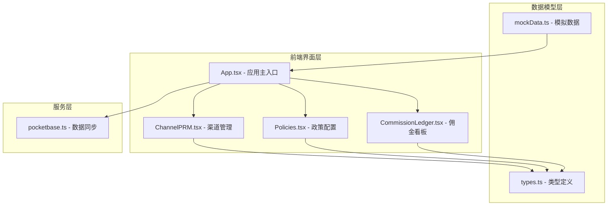
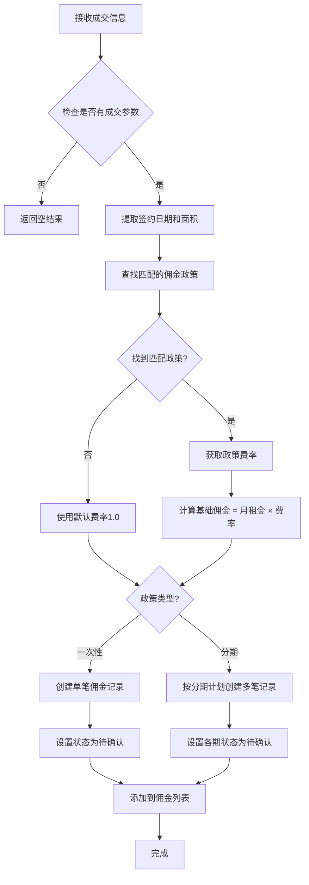
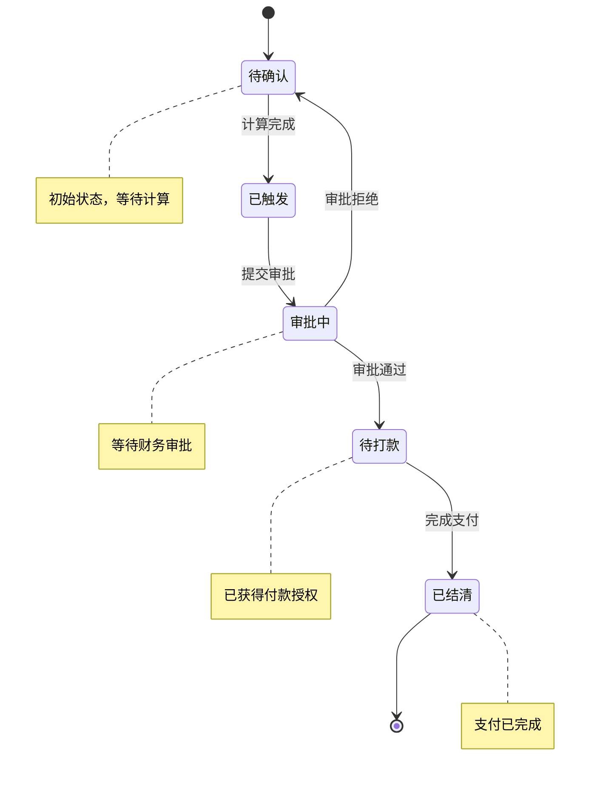
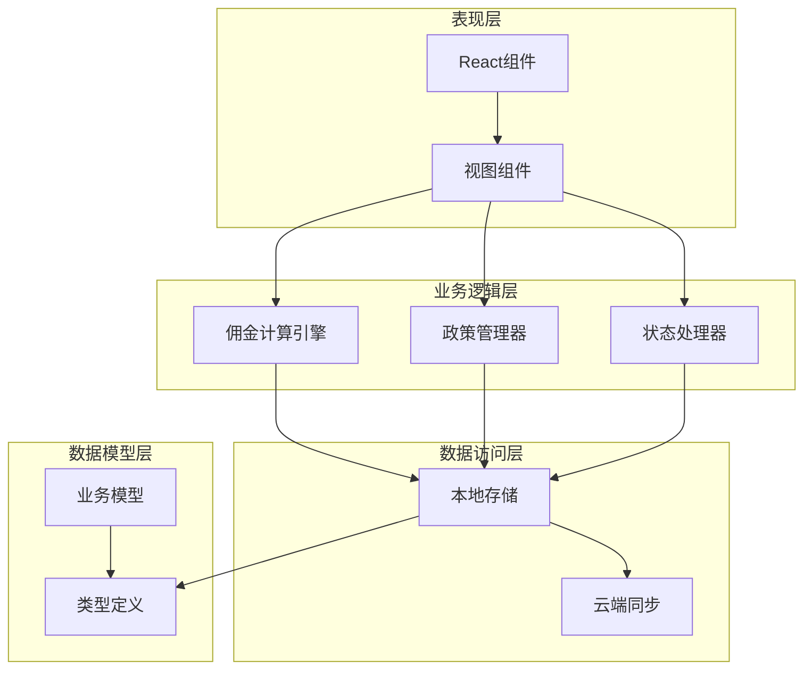
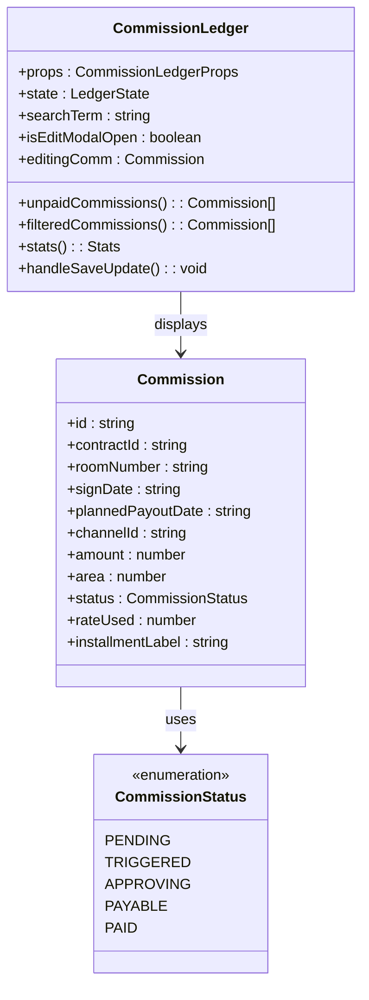
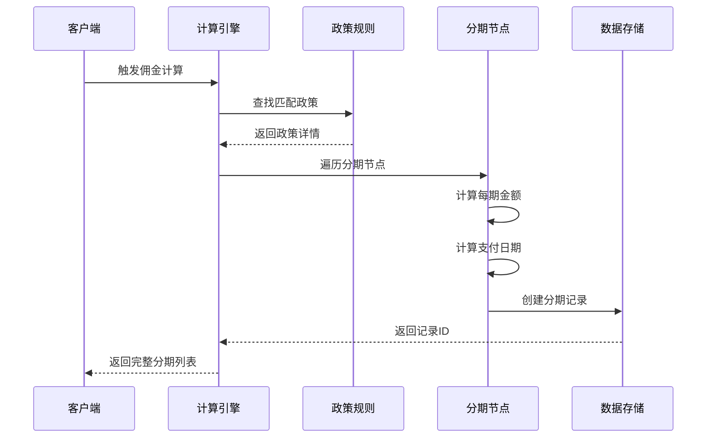
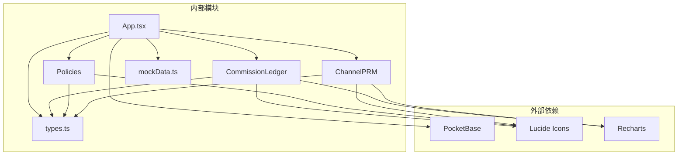
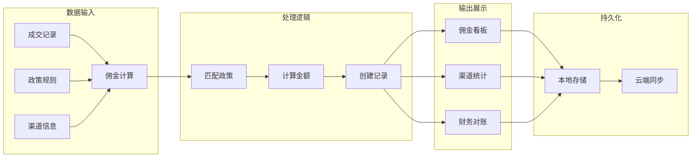

# 佣金管理模块

<cite>
**本文档引用的文件**
- [App.tsx](file://App.tsx)
- [CommissionLedger.tsx](file://components/CommissionLedger.tsx)
- [Policies.tsx](file://components/Policies.tsx)
- [ChannelPRM.tsx](file://components/ChannelPRM.tsx)
- [types.ts](file://types.ts)
- [mockData.ts](file://services/mockData.ts)
- [pocketbase.ts](file://services/pocketbase.ts)
</cite>

## 目录
1. [简介](#简介)
2. [项目结构](#项目结构)
3. [核心组件](#核心组件)
4. [架构概览](#架构概览)
5. [详细组件分析](#详细组件分析)
6. [依赖关系分析](#依赖关系分析)
7. [性能考虑](#性能考虑)
8. [故障排除指南](#故障排除指南)
9. [结论](#结论)
10. [附录](#附录)

## 简介

佣金管理模块是上海商机及渠道管理系统的核心功能之一，负责处理园区租赁业务中的佣金计算、发放和对账管理。该模块实现了完整的佣金生命周期管理，包括政策制定、佣金计算、分期发放、状态跟踪和财务对账等功能。

系统采用React + TypeScript技术栈构建，通过PocketBase作为数据存储后端，实现了云端同步和本地备份功能。模块支持多种佣金计算策略，包括基础佣金、阶梯奖励和特殊政策等复杂计算逻辑。

## 项目结构

佣金管理模块主要由以下核心文件组成：

**图表来源**
- [App.tsx](file://App.tsx#L1-L620)
- [CommissionLedger.tsx](file://components/CommissionLedger.tsx#L1-L201)
- [Policies.tsx](file://components/Policies.tsx#L1-L382)
- [ChannelPRM.tsx](file://components/ChannelPRM.tsx#L1-L476)
- [types.ts](file://types.ts#L1-L261)

**章节来源**
- [App.tsx](file://App.tsx#L1-L620)
- [types.ts](file://types.ts#L1-L261)

## 核心组件

### 佣金计算引擎

佣金计算引擎是模块的核心逻辑组件，负责根据成交信息和政策规则计算应得佣金。其工作流程如下：

**图表来源**
- [App.tsx](file://App.tsx#L380-L435)

### 佣金状态管理

系统实现了完整的佣金状态流转机制，确保每个佣金记录都有明确的状态标识：

**图表来源**
- [types.ts](file://types.ts#L33-L39)

### 政策配置管理

政策配置模块允许管理员灵活设置佣金计算规则，支持多种计算策略：

| 政策类型 | 特征 | 适用场景 |
|---------|------|----------|
| 基础佣金 | 固定费率，一次性支付 | 标准业务场景 |
| 大面积激励 | 超过特定面积享受额外奖励 | 大客户激励 |
| 大户直通车 | 特殊优惠政策，高额奖励 | 重要客户 |
| 年终冲刺 | 季节性促销活动 | 业务旺季激励 |

**章节来源**
- [App.tsx](file://App.tsx#L380-L435)
- [Policies.tsx](file://components/Policies.tsx#L1-L382)
- [types.ts](file://types.ts#L123-L134)

## 架构概览

佣金管理模块采用分层架构设计，确保各组件职责清晰、耦合度低：

**图表来源**
- [App.tsx](file://App.tsx#L1-L620)
- [types.ts](file://types.ts#L1-L261)

## 详细组件分析

### 佣金看板组件

佣金看板提供了实时的佣金监控和管理功能：

#### 核心功能特性

1. **智能筛选和排序**
   - 支持按企业名称、渠道名称、房间号搜索
   - 按计划支付日期自动排序
   - 实时统计待支付总额和节点数量

2. **状态可视化**
   - 不同状态使用不同颜色标识
   - 即将到期的佣金高亮显示
   - 分期节点的清晰标识

3. **管理员功能**
   - 直接修改佣金金额
   - 更新支付状态
   - 调整计划支付日期

**图表来源**
- [CommissionLedger.tsx](file://components/CommissionLedger.tsx#L1-L201)
- [types.ts](file://types.ts#L223-L238)

**章节来源**
- [CommissionLedger.tsx](file://components/CommissionLedger.tsx#L1-L201)
- [types.ts](file://types.ts#L223-L238)

### 政策配置组件

政策配置组件提供了灵活的佣金政策管理功能：

#### 政策规则定义

政策规则包含以下关键属性：

| 属性名 | 类型 | 描述 | 示例值 |
|--------|------|------|--------|
| id | string | 政策唯一标识符 | R1, R2, R3 |
| minArea | number | 最小面积阈值 | 0, 300, 800 |
| maxArea | number | 最大面积阈值 | 300, 800, 99999 |
| rate | number | 佣金费率 | 1.0, 1.2, 1.5 |
| label | string | 政策名称 | "标准面积段", "大面积激励" |
| startDate | string | 生效开始日期 | "2024-01-01" |
| endDate | string | 生效结束日期 | "2025-12-31" |
| isActive | boolean | 是否启用 | true, false |
| payoutType | 'ONETIME' \| 'STAGED' | 发放类型 | "ONETIME", "STAGED" |
| installments | PayoutInstallment[] | 分期计划 | 空数组, 两个分期节点 |

#### 分期发放机制

分期发放支持复杂的多节点支付计划：

**图表来源**
- [App.tsx](file://App.tsx#L397-L435)
- [Policies.tsx](file://components/Policies.tsx#L318-L362)

**章节来源**
- [Policies.tsx](file://components/Policies.tsx#L1-L382)
- [mockData.ts](file://services/mockData.ts#L49-L61)

### 渠道管理组件

渠道管理组件提供了佣金分配和统计功能：

#### 渠道统计指标

系统为每个渠道提供全面的统计分析：

| 指标类型 | 名称 | 计算方式 | 用途 |
|----------|------|----------|------|
| 年度指标 | 年度成交面积 | 当年签约面积总和 | 评估渠道贡献 |
| 月度指标 | 月度成交面积 | 当月签约面积总和 | 月度业绩评估 |
| 年度指标 | 年度商机数量 | 当年创建商机数量 | 渠道活跃度 |
| 财务指标 | 已结清佣金 | 已支付佣金总和 | 实际收益 |
| 财务指标 | 待结清佣金 | 未支付佣金总和 | 应收账款 |
| 行为指标 | 最近行动日期 | 最近带看或成交日期 | 渠道活跃度 |

**章节来源**
- [ChannelPRM.tsx](file://components/ChannelPRM.tsx#L54-L98)

## 依赖关系分析

佣金管理模块的依赖关系体现了清晰的分层架构：

**图表来源**
- [App.tsx](file://App.tsx#L1-L620)
- [CommissionLedger.tsx](file://components/CommissionLedger.tsx#L1-L201)
- [Policies.tsx](file://components/Policies.tsx#L1-L382)
- [ChannelPRM.tsx](file://components/ChannelPRM.tsx#L1-L476)

### 数据流分析

佣金管理的数据流遵循严格的处理流程：

**图表来源**
- [App.tsx](file://App.tsx#L380-L435)

**章节来源**
- [App.tsx](file://App.tsx#L1-L620)
- [pocketbase.ts](file://services/pocketbase.ts#L1-L226)

## 性能考虑

### 内存优化策略

1. **虚拟化渲染**
   - 大数据集采用虚拟滚动技术
   - 按需加载和渲染组件
   - 避免不必要的DOM操作

2. **状态管理优化**
   - 使用useMemo缓存计算结果
   - 优化组件重渲染频率
   - 合理的useState使用策略

3. **数据结构优化**
   - 使用Map和Set提高查找效率
   - 避免深层对象复制
   - 合理的数据扁平化

### 网络性能优化

1. **批量操作**
   - 合并多个API调用
   - 防抖处理高频操作
   - 智能缓存策略

2. **同步机制**
   - 增量同步减少数据传输
   - 并发冲突检测和处理
   - 断线重连机制

## 故障排除指南

### 常见问题及解决方案

#### 佣金计算异常

**问题症状**：佣金金额计算不正确
**可能原因**：
- 政策规则配置错误
- 成交面积超出范围
- 签约日期不在有效期内

**解决步骤**：
1. 检查政策规则的有效性
2. 验证成交面积的合理性
3. 确认签约日期在有效期内

#### 状态更新延迟

**问题症状**：佣金状态更新不及时
**可能原因**：
- 数据同步延迟
- 浏览器缓存问题
- 网络连接不稳定

**解决步骤**：
1. 手动刷新页面
2. 检查网络连接状态
3. 清除浏览器缓存

#### 权限控制问题

**问题症状**：管理员功能无法使用
**可能原因**：
- 用户角色权限不足
- 会话过期
- 浏览器兼容性问题

**解决步骤**：
1. 确认用户具有管理员权限
2. 重新登录系统
3. 更换浏览器或更新版本

**章节来源**
- [mockData.ts](file://services/mockData.ts#L73-L80)

## 结论

佣金管理模块通过精心设计的架构和完善的业务逻辑，为园区租赁业务提供了全面的佣金管理解决方案。模块具备以下优势：

1. **功能完整性**：涵盖了从政策制定到最终支付的完整流程
2. **灵活性**：支持多种佣金计算策略和分期模式
3. **可扩展性**：模块化设计便于功能扩展和维护
4. **用户体验**：直观的界面设计和实时的状态反馈
5. **数据安全**：完善的权限控制和数据同步机制

该模块不仅满足了当前的业务需求，还为未来的功能扩展奠定了坚实的基础。

## 附录

### API接口定义

| 接口名称 | 方法 | 路径 | 功能描述 |
|----------|------|------|----------|
| 获取最新备份 | GET | /api/backups/latest | 获取云端最新数据快照 |
| 保存备份 | POST | /api/backups | 保存本地数据到云端 |
| 更新备份 | PUT | /api/backups/{id} | 更新现有云端备份 |
| 获取备份列表 | GET | /api/backups | 获取所有备份历史记录 |

### 配置选项

| 配置项 | 默认值 | 描述 |
|--------|--------|------|
| 同步间隔 | 3秒 | 自动同步的时间间隔 |
| 最大重试次数 | 3次 | 网络请求失败的重试次数 |
| 缓存大小 | 100MB | 本地数据缓存的最大容量 |
| 日志级别 | INFO | 系统日志的详细程度 |

### 错误码定义

| 错误码 | 错误类型 | 描述 |
|--------|----------|------|
| 400 | 参数错误 | 请求参数格式不正确 |
| 401 | 权限不足 | 用户没有足够的权限 |
| 404 | 资源不存在 | 请求的资源不存在 |
| 500 | 服务器错误 | 服务器内部错误 |
| 503 | 服务不可用 | 服务暂时不可用 |