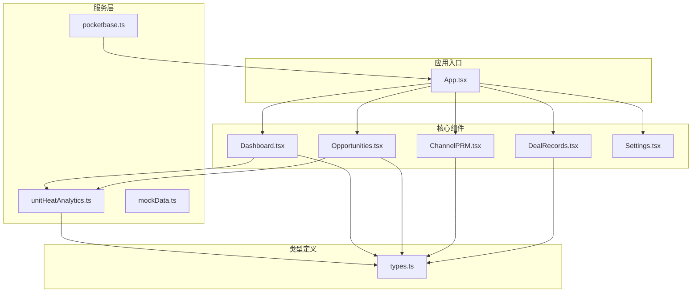
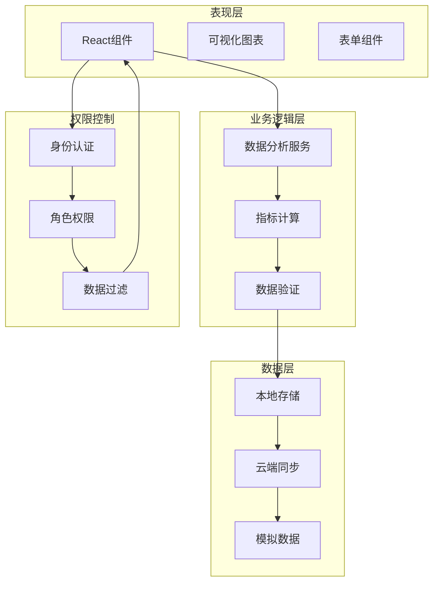
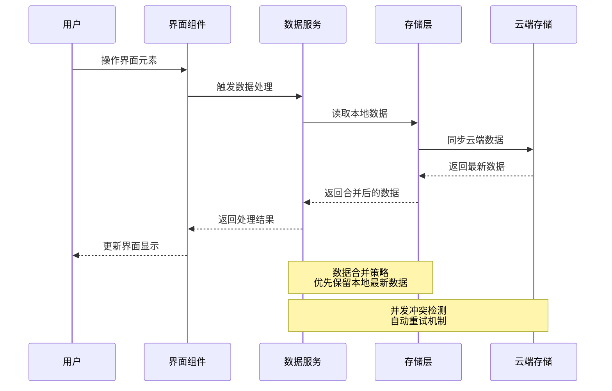
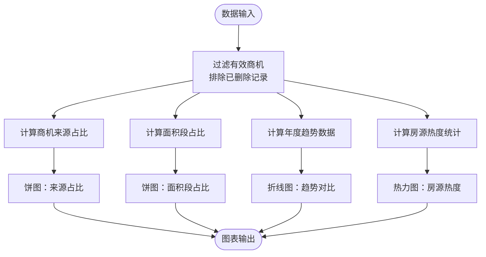
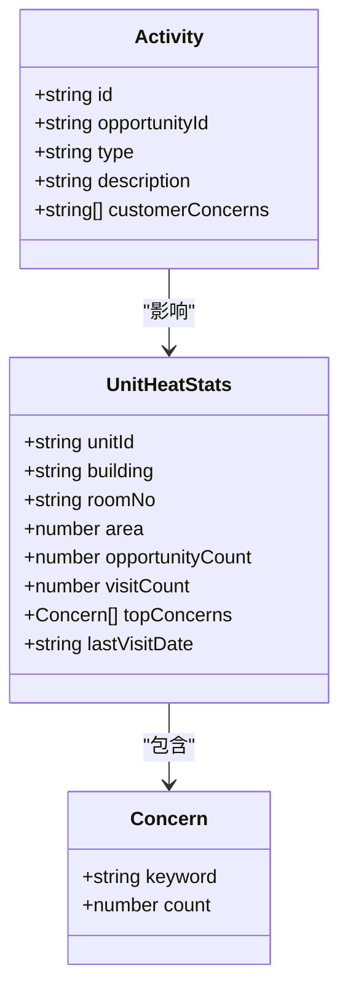
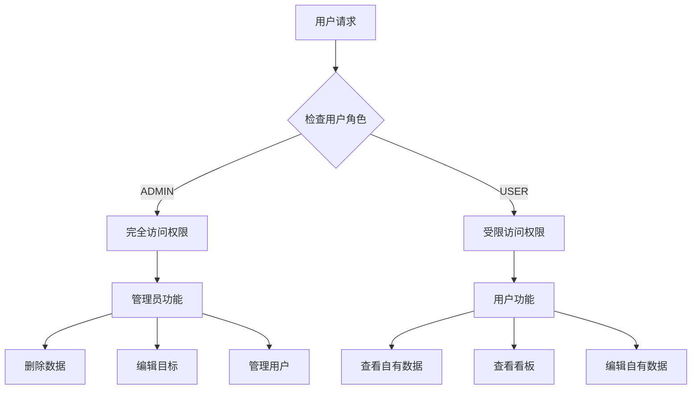
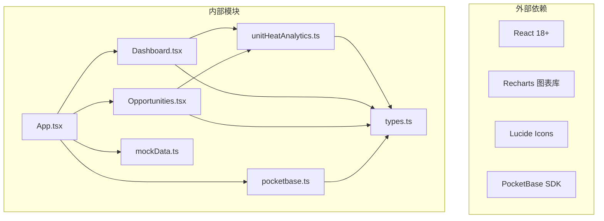

# 业务分析看板

<cite>
**本文引用的文件**
- [App.tsx](file://App.tsx)
- [Dashboard.tsx](file://components/Dashboard.tsx)
- [Opportunities.tsx](file://components/Opportunities.tsx)
- [unitHeatAnalytics.ts](file://services/unitHeatAnalytics.ts)
- [pocketbase.ts](file://services/pocketbase.ts)
- [types.ts](file://types.ts)
- [mockData.ts](file://services/mockData.ts)
- [Settings.tsx](file://components/Settings.tsx)
- [ChannelPRM.tsx](file://components/ChannelPRM.tsx)
- [DealRecords.tsx](file://components/DealRecords.tsx)
</cite>

## 目录
1. [简介](#简介)
2. [项目结构](#项目结构)
3. [核心组件](#核心组件)
4. [架构概览](#架构概览)
5. [详细组件分析](#详细组件分析)
6. [依赖关系分析](#依赖关系分析)
7. [性能考虑](#性能考虑)
8. [故障排除指南](#故障排除指南)
9. [结论](#结论)

## 简介

上海商机及渠道管理系统是一个基于React和TypeScript开发的综合性业务分析平台，专注于园区招商管理和数据分析。该系统提供了完整的业务分析看板功能，包括全园招商效能全景看板和个人绩效看板，能够实时展示关键业务指标并提供深度的数据洞察。

系统采用现代化的技术栈，结合云端数据同步、权限控制和实时可视化，为企业管理层提供决策支持工具。通过直观的图表展示和详细的指标计算，帮助管理者全面了解招商运营状况。

## 项目结构

该项目采用模块化的前端架构设计，主要分为以下几个核心部分：

**图表来源**
- [App.tsx](file://App.tsx#L1-L590)
- [Dashboard.tsx](file://components/Dashboard.tsx#L1-L393)
- [Opportunities.tsx](file://components/Opportunities.tsx#L1-L1105)

**章节来源**
- [App.tsx](file://App.tsx#L1-L590)
- [types.ts](file://types.ts#L1-L276)

## 核心组件

### 全园招商效能全景看板

全园招商效能全景看板是系统的核心分析界面，提供多维度的业务指标展示：

#### 关键指标计算逻辑

1. **年度签约总面积**
   - 计算规则：筛选阶段为"签约"的商机，汇总dealParams.finalArea字段
   - 数据来源：opportunities数组中stage为CONTRACT的记录
   - 实现位置：Dashboard组件第276行

2. **存量活跃商机**
   - 计算规则：筛选stage既不是CONTRACT也不是CLOSED_LOST的商机数量
   - 实现位置：Dashboard组件第281行

3. **本月新带看次数**
   - 计算规则：使用validActivities过滤，筛选type为VISIT且date以当前年月开头的活动
   - 实现位置：Dashboard组件第286行

4. **年度总目标**
   - 设置方式：管理员通过目标管理界面更新annualTargetArea
   - 实现位置：Dashboard组件第294行

#### 数据可视化图表

系统采用多种图表类型展示业务数据：

- **折线图**：展示年度商机和带看走势对比
- **饼图**：展示商机来源渠道占比和客户需求面积段占比
- **热力图**：展示房源关注度排行
- **卡片式指标**：展示关键业务指标的实时状态

**章节来源**
- [Dashboard.tsx](file://components/Dashboard.tsx#L1-L393)

### 招商经理个人绩效看板

个人绩效看板为每个招商经理提供个性化的业绩分析：

#### 绩效指标构成

1. **商机数/带看**
   - 年度累计商机数：opportunities.filter(o => o.leasingManager === user.name && new Date(o.createdAt).getFullYear() === currentYear).length
   - 年度累计带看次数：validActivities.filter(a => a.hostName === user.name && a.type === ActivityType.VISIT && new Date(a.date).getFullYear() === currentYear).length

2. **当前活跃商机**
   - 计算规则：筛选stage既不是CONTRACT也不是CLOSED_LOST的商机数量

3. **本月带看强度**
   - 计算规则：筛选当前月的带看活动数量

4. **流失率 (YTD)**
   - 计算公式：(年度流失商机数 / 年度总商机数) × 100%
   - 实现位置：Opportunities.tsx第247行

**章节来源**
- [Opportunities.tsx](file://components/Opportunities.tsx#L235-L250)

### 管理员目标管理功能

管理员可以通过目标管理功能设置和调整年度招商目标：

#### 目标设置流程

1. **访问目标管理界面**
   - 通过"年度总目标"卡片右上角的编辑图标进入
   - 仅管理员可见和可编辑

2. **目标更新机制**
   - 实时更新annualTarget状态
   - 自动保存到localStorage
   - 影响全园看板的目标完成度展示

3. **目标完成度计算**
   - 完成度 = (实际完成面积 / 年度目标) × 100%
   - 目标完成度进度条实时更新

**章节来源**
- [Opportunities.tsx](file://components/Opportunities.tsx#L575-L591)

## 架构概览

系统采用分层架构设计，确保各组件职责清晰、耦合度低：

**图表来源**
- [App.tsx](file://App.tsx#L179-L587)
- [pocketbase.ts](file://services/pocketbase.ts#L1-L274)

### 数据流设计

系统采用双向数据流设计，确保数据的一致性和实时性：

**图表来源**
- [App.tsx](file://App.tsx#L17-L75)
- [pocketbase.ts](file://services/pocketbase.ts#L194-L227)

## 详细组件分析

### Dashboard组件分析

Dashboard组件是整个系统的核心分析界面，负责展示全园招商效能的全景视图。

#### 核心功能特性

1. **实时数据更新**
   - 使用useMemo进行数据缓存，避免重复计算
   - 自动响应数据变化，实时更新图表显示

2. **多维度指标展示**
   - 年度签约面积完成度
   - 商机总量监控
   - 带看与转化分析
   - 房源热度排行

3. **交互式图表**
   - 支持年份切换，查看不同年度数据
   - 响应式设计，适配不同屏幕尺寸

#### 数据处理流程

**图表来源**
- [Dashboard.tsx](file://components/Dashboard.tsx#L26-L65)

**章节来源**
- [Dashboard.tsx](file://components/Dashboard.tsx#L1-L393)

### unitHeatAnalytics服务分析

unitHeatAnalytics服务专门负责房源热度统计和客户关注点分析：

#### 核心算法实现

1. **关注点关键词提取**
   - 预定义关注点词库：价格、位置、环境、面积、配套等
   - 支持中英文关键词匹配
   - 去重处理，确保关注点唯一性

2. **热度计算模型**
   - 热度值 = 商机数 × 2 + 带看次数
   - 商机权重高于带看次数，体现商机质量
   - 支持按热度降序排列

3. **数据兼容性处理**
   - 兼容新旧数据格式
   - 支持relatedUnitIds和targetUnitId两种关联方式
   - 自动过滤无效数据

#### 关键数据结构

**图表来源**
- [unitHeatAnalytics.ts](file://services/unitHeatAnalytics.ts#L266-L275)
- [types.ts](file://types.ts#L265-L275)

**章节来源**
- [unitHeatAnalytics.ts](file://services/unitHeatAnalytics.ts#L1-L203)

### 权限控制机制

系统实现了完善的权限控制机制，确保数据安全和功能访问的合理性：

#### 用户角色定义

1. **管理员 (ADMIN)**
   - 完全访问权限
   - 可以编辑年度目标
   - 可以管理用户账户
   - 可以删除商机和渠道信息

2. **一般账户 (USER)**
   - 仅能查看自己的商机数据
   - 不能编辑年度目标
   - 不能管理用户账户

#### 数据访问控制

**图表来源**
- [App.tsx](file://App.tsx#L253-L260)
- [Opportunities.tsx](file://components/Opportunities.tsx#L252-L260)

**章节来源**
- [types.ts](file://types.ts#L62-L76)
- [App.tsx](file://App.tsx#L61-L66)

## 依赖关系分析

系统采用模块化设计，各组件间依赖关系清晰明确：

**图表来源**
- [App.tsx](file://App.tsx#L1-L14)
- [Dashboard.tsx](file://components/Dashboard.tsx#L1-L6)
- [Opportunities.tsx](file://components/Opportunities.tsx#L1-L4)

### 数据依赖链

系统中的数据流向呈现清晰的依赖关系：

1. **原始数据来源**：localStorage中的AppData对象
2. **处理中间层**：各组件的useMemo计算和数据过滤
3. **服务层**：unitHeatAnalytics的数据处理和统计
4. **展示层**：React组件的渲染和图表绘制

**章节来源**
- [App.tsx](file://App.tsx#L253-L279)
- [unitHeatAnalytics.ts](file://services/unitHeatAnalytics.ts#L37-L152)

## 性能考虑

系统在设计时充分考虑了性能优化，采用了多种策略确保良好的用户体验：

### 内存优化策略

1. **数据缓存机制**
   - 使用useMemo避免重复计算
   - localStorage持久化存储减少重复加载
   - 数据引用优化，避免不必要的重新渲染

2. **虚拟滚动**
   - 大数据集采用虚拟滚动技术
   - 限制DOM节点数量，提升渲染性能

### 网络性能优化

1. **智能同步策略**
   - 3秒防抖机制，避免频繁云端同步
   - 并发冲突检测和自动重试
   - 增量更新机制，只同步变化的数据

2. **数据合并算法**
   - 深度合并算法，确保数据一致性
   - 删除标记ID集合，防止僵尸数据复活
   - 云端快照合并，避免数据丢失

### 图表性能优化

1. **响应式图表**
   - 使用ResponsiveContainer自适应调整
   - 懒加载图表组件，减少初始渲染负担
   - 图表数据分页加载，避免大数据量渲染

**章节来源**
- [App.tsx](file://App.tsx#L255-L279)
- [pocketbase.ts](file://services/pocketbase.ts#L194-L227)

## 故障排除指南

### 常见问题及解决方案

#### 数据同步问题

**问题现象**：云端数据不同步或显示异常

**可能原因**：
1. 网络连接不稳定
2. PocketBase服务未启动
3. 并发冲突导致的数据丢失

**解决方案**：
1. 检查网络连接状态
2. 确认PocketBase服务正常运行
3. 重新加载页面，系统会自动重试
4. 使用"聚合并保存"功能手动同步

#### 权限访问问题

**问题现象**：无法访问某些功能或数据

**可能原因**：
1. 用户角色权限不足
2. 数据访问范围限制
3. 浏览器缓存问题

**解决方案**：
1. 确认当前用户角色为ADMIN
2. 检查数据过滤逻辑
3. 清除浏览器缓存后重新登录
4. 联系系统管理员获取相应权限

#### 图表显示异常

**问题现象**：图表无法正常显示或数据不准确

**可能原因**：
1. 数据格式不符合预期
2. 图表组件渲染异常
3. 数据计算错误

**解决方案**：
1. 检查数据格式和字段完整性
2. 刷新页面重新加载数据
3. 检查console是否有错误信息
4. 使用开发者工具调试数据流

**章节来源**
- [pocketbase.ts](file://services/pocketbase.ts#L47-L87)
- [App.tsx](file://App.tsx#L300-L326)

## 结论

上海商机及渠道管理系统通过精心设计的业务分析看板功能，为企业提供了全面的招商运营洞察。系统的主要优势包括：

### 核心价值

1. **实时数据洞察**：通过全园招商效能全景看板，管理者可以实时了解园区招商状况
2. **个性化绩效分析**：为每个招商经理提供个性化的业绩分析和改进建议
3. **智能数据可视化**：采用多种图表类型，直观展示复杂的业务数据
4. **完善权限控制**：确保数据安全和功能访问的合理性

### 技术亮点

1. **现代化架构设计**：采用React Hooks和TypeScript，确保代码质量和可维护性
2. **高性能数据处理**：通过缓存机制和智能算法，确保大数据量下的流畅体验
3. **云端数据同步**：支持多端数据同步和版本控制
4. **灵活的权限体系**：基于角色的细粒度权限控制

### 应用前景

该系统不仅适用于当前的招商管理场景，还可以扩展到其他业务分析领域。通过模块化设计和标准化的数据接口，可以轻松集成更多的业务功能和分析维度，为企业数字化转型提供强有力的支持。

系统通过直观的界面设计和强大的数据处理能力，真正实现了"数据驱动决策"的理念，为企业的可持续发展提供了重要的技术支撑。