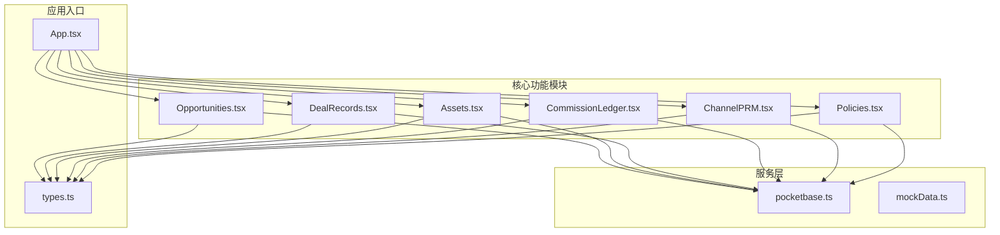
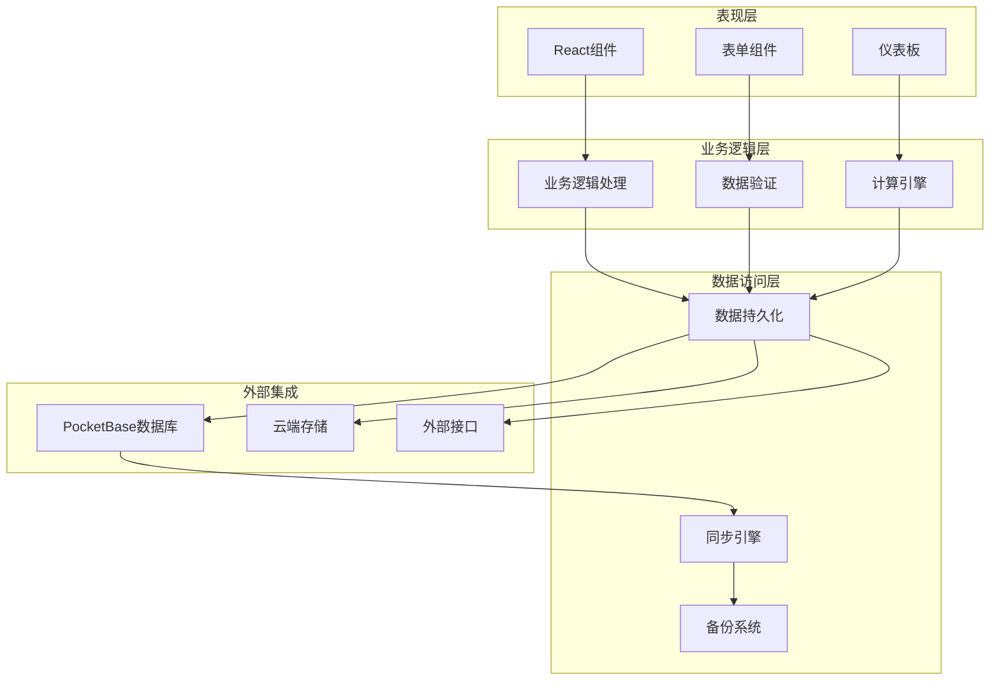
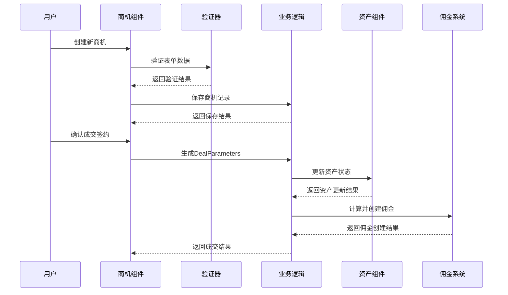
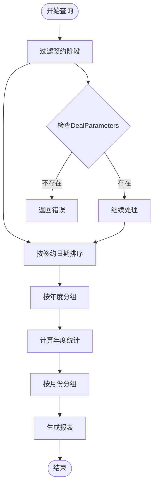
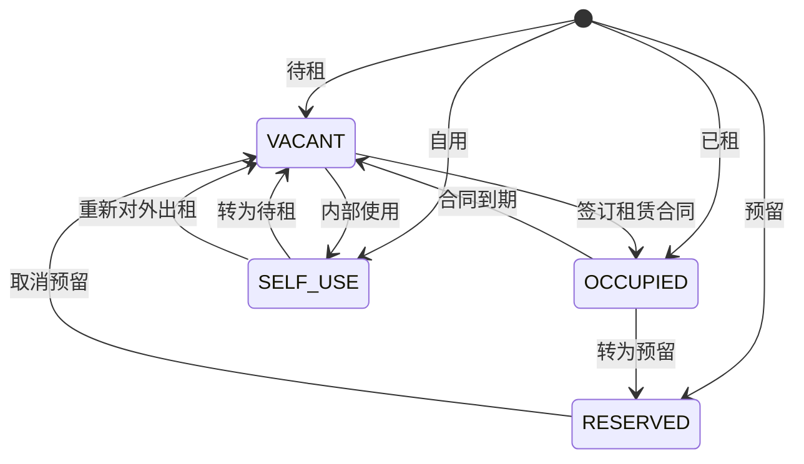
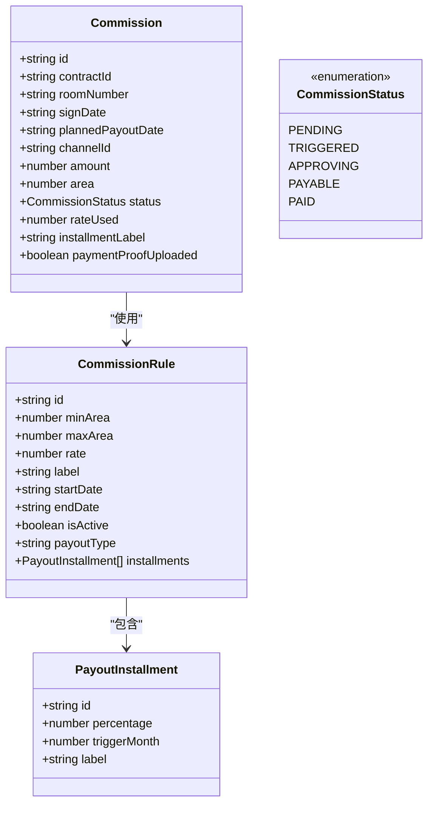
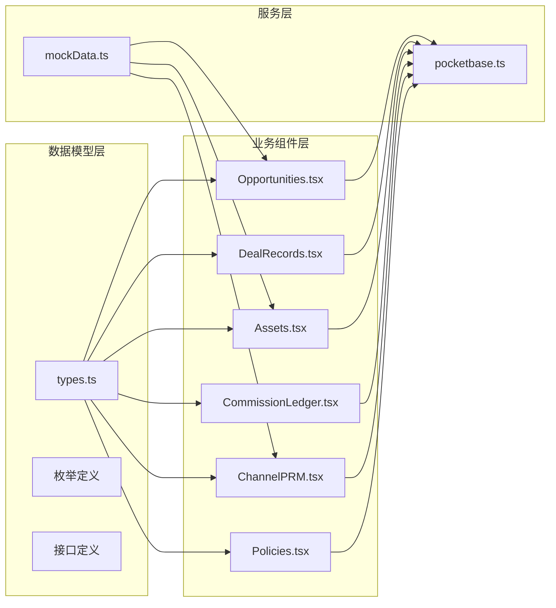

# 合同成交管理

<cite>
**本文档引用的文件**
- [App.tsx](file://App.tsx)
- [types.ts](file://types.ts)
- [Opportunities.tsx](file://components/Opportunities.tsx)
- [DealRecords.tsx](file://components/DealRecords.tsx)
- [Assets.tsx](file://components/Assets.tsx)
- [CommissionLedger.tsx](file://components/CommissionLedger.tsx)
- [ChannelPRM.tsx](file://components/ChannelPRM.tsx)
- [Policies.tsx](file://components/Policies.tsx)
- [pocketbase.ts](file://services/pocketbase.ts)
- [mockData.ts](file://services/mockData.ts)
</cite>

## 目录
1. [简介](#简介)
2. [项目结构](#项目结构)
3. [核心组件](#核心组件)
4. [架构概览](#架构概览)
5. [详细组件分析](#详细组件分析)
6. [依赖关系分析](#依赖关系分析)
7. [性能考虑](#性能考虑)
8. [故障排除指南](#故障排除指南)
9. [结论](#结论)

## 简介

合同成交管理功能是上海商机及渠道管理系统（v5.0）的核心模块，负责管理从商机到正式合同的完整生命周期。该系统实现了先进的合同参数配置、租赁合同要素管理、佣金结算自动化以及资产状态跟踪等功能。

系统采用现代化的React技术栈，结合TypeScript类型安全和PocketBase数据库，提供了完整的合同成交管理解决方案。通过直观的用户界面和强大的数据模型，实现了从商机挖掘到合同执行的全流程数字化管理。

## 项目结构

系统采用模块化的组件架构，主要文件组织如下：

**图表来源**
- [App.tsx](file://App.tsx#L1-L590)
- [types.ts](file://types.ts#L1-L276)

**章节来源**
- [App.tsx](file://App.tsx#L1-L590)
- [types.ts](file://types.ts#L1-L276)

## 核心组件

### 合同参数模型（DealParameters）

合同参数是整个成交管理的核心数据结构，定义了租赁合同的所有关键要素：

| 字段名 | 类型 | 描述 | 必填 |
|--------|------|------|------|
| unitIds | string[] | 关联的房源ID列表 | 是 |
| buildingName | string | 建筑物名称 | 是 |
| finalArea | number | 最终成交面积（㎡） | 是 |
| signDate | string | 签约日期 | 是 |
| leaseStartDate | string | 租赁开始日期 | 是 |
| leaseEndDate | string | 租赁结束日期 | 是 |
| finalPrice | number | 最终成交单价（元/㎡/天） | 是 |
| monthlyRent | number | 月租金总额 | 是 |
| paymentCycleMonths | number | 付款周期（月） | 是 |
| firstPaymentCount | number | 首期付款期数 | 是 |
| firstPaymentDate | string | 首期付款日期 | 是 |
| isRentFreeDeferred | boolean | 免租期是否延期 | 否 |
| rentFreePeriods | RentFreePeriod[] | 免租期时间段列表 | 否 |
| depositAmount | string | 押金金额 | 是 |
| depositStatus | string | 押金状态 | 是 |
| remarks | string | 备注说明 | 否 |
| isHighRisk | boolean | 是否高风险 | 否 |
| industry | string | 行业类别 | 否 |
| establishedDate | string | 成立日期 | 否 |
| legalRepresentative | string | 法人代表 | 否 |
| mainContact | string | 主要联系人 | 否 |

### 租赁合同核心要素

系统支持完整的租赁合同要素管理，包括：

**基础信息**
- 建筑面积：精确到平方米的成交面积
- 租赁期限：从开始日期到结束日期的完整租期
- 租金标准：按㎡/天计算的单价
- 付款方式：支持月付、季付等多种周期

**附加条款**
- 押金要求：明确的押金金额和状态
- 免租期：灵活的免租期设置和延期选项
- 特殊约定：支持自定义备注和风险标识

**章节来源**
- [types.ts](file://types.ts#L153-L175)

## 架构概览

系统采用分层架构设计，确保各模块间的松耦合和高内聚：

**图表来源**
- [App.tsx](file://App.tsx#L1-L590)
- [pocketbase.ts](file://services/pocketbase.ts#L1-L274)

## 详细组件分析

### 商机管理组件（Opportunities）

商机管理组件是合同成交流程的起点，负责从潜在客户到正式合同的全过程管理：

**图表来源**
- [Opportunities.tsx](file://components/Opportunities.tsx#L146-L159)
- [App.tsx](file://App.tsx#L377-L432)

**核心功能特性**：
- 商机生命周期管理（线索→带看→谈判→签约→流失）
- 多维度商机筛选和排序
- 关联房源智能匹配
- 实时状态更新和通知

**章节来源**
- [Opportunities.tsx](file://components/Opportunities.tsx#L1-L800)

### 合同成交记录（DealRecords）

成交记录组件提供完整的合同执行监控和数据分析功能：

**图表来源**
- [DealRecords.tsx](file://components/DealRecords.tsx#L17-L43)

**主要功能**：
- 年度成交统计和趋势分析
- 招商经理绩效评估
- 月度成交明细展示
- 自定义搜索和筛选

**章节来源**
- [DealRecords.tsx](file://components/DealRecords.tsx#L1-L252)

### 资产状态管理（Assets）

资产状态管理确保租赁合同与物理资产的准确对应：

**图表来源**
- [Assets.tsx](file://components/Assets.tsx#L49-L68)
- [types.ts](file://types.ts#L55-L60)

**功能特点**：
- 实时资产状态跟踪
- 空置期计算和预警
- 租客信息管理
- 资产热力图分析

**章节来源**
- [Assets.tsx](file://components/Assets.tsx#L1-L445)

### 佣金结算系统（CommissionLedger）

佣金结算系统实现了自动化的佣金计算和分期发放：

**图表来源**
- [CommissionLedger.tsx](file://components/CommissionLedger.tsx#L1-L201)
- [types.ts](file://types.ts#L123-L134)

**章节来源**
- [CommissionLedger.tsx](file://components/CommissionLedger.tsx#L1-L201)

### 渠道合作伙伴管理（ChannelPRM）

渠道合作伙伴管理系统负责管理外部合作商的绩效和佣金：

**核心指标计算**：
- 月度贡献面积（MTD Area）
- 年度贡献面积（YTD Area）
- 月度带看次数（MTD Visits）
- 年度带看次数（YTD Visits）
- 最近活跃日期（Latest Action Date）

**章节来源**
- [ChannelPRM.tsx](file://components/ChannelPRM.tsx#L1-L476)

### 政策配置管理（Policies）

政策配置系统允许管理员灵活管理佣金计算规则：

**政策类型**：
- 一次性发放（ONETIME）
- 分期发放（STAGED）

**分期节点配置**：
- 节点标签（label）
- 分配比例（percentage）
- 触发时间（triggerMonth）

**章节来源**
- [Policies.tsx](file://components/Policies.tsx#L1-L382)

## 依赖关系分析

系统采用模块化设计，各组件间通过清晰的接口进行通信：

**图表来源**
- [App.tsx](file://App.tsx#L1-L590)
- [types.ts](file://types.ts#L1-L276)

**依赖特点**：
- 强类型约束确保数据完整性
- 松耦合设计便于功能扩展
- 明确的职责分离提高代码可维护性

**章节来源**
- [App.tsx](file://App.tsx#L1-L590)
- [types.ts](file://types.ts#L1-L276)

## 性能考虑

系统在设计时充分考虑了性能优化：

**前端性能优化**：
- React.memo和useMemo减少不必要的重渲染
- 虚拟滚动处理大量数据
- 懒加载和代码分割
- 防抖和节流机制

**数据同步优化**：
- 自动同步间隔控制（3秒防抖）
- 并发冲突检测和处理
- 增量备份和恢复
- 离线数据缓存

**数据库优化**：
- 索引优化查询性能
- 批量操作减少网络往返
- 数据压缩和存储优化

## 故障排除指南

### 常见问题及解决方案

**数据同步问题**：
- 检查PocketBase服务状态
- 验证网络连接稳定性
- 查看同步日志获取详细错误信息

**表单验证错误**：
- 确保必填字段完整
- 检查数据类型和范围
- 验证业务规则约束

**性能问题**：
- 清理浏览器缓存
- 减少同时打开的标签页
- 检查系统资源使用情况

**章节来源**
- [pocketbase.ts](file://services/pocketbase.ts#L93-L173)
- [App.tsx](file://App.tsx#L300-L375)

## 结论

合同成交管理功能通过精心设计的架构和完善的业务逻辑，为商业地产租赁管理提供了全面的数字化解决方案。系统不仅实现了从商机到合同的完整流程管理，还提供了强大的数据分析和监控能力。

**主要优势**：
- 完整的合同生命周期管理
- 灵活的配置和扩展能力
- 实时的数据同步和备份
- 直观的用户界面和良好的用户体验
- 强大的数据分析和报告功能

**未来发展方向**：
- 集成更多外部系统和API
- 增强移动端支持
- 优化AI辅助决策功能
- 扩展多租户和权限管理

该系统为现代商业地产管理提供了坚实的技术基础，能够有效提升运营效率和管理水平。