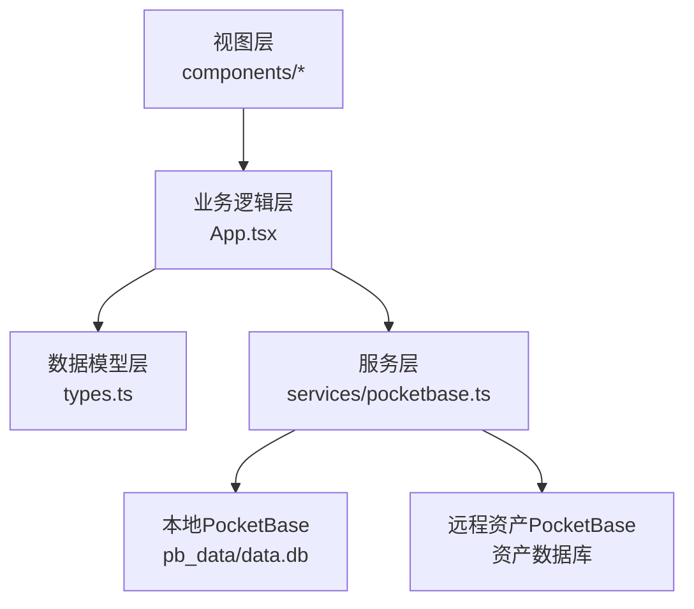
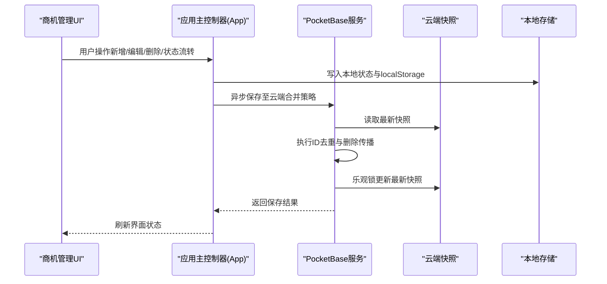
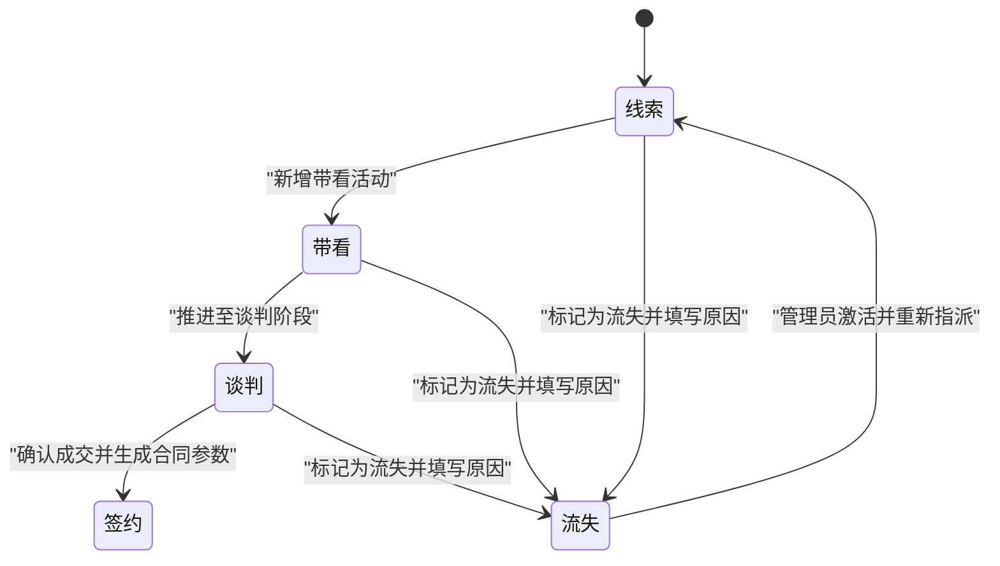
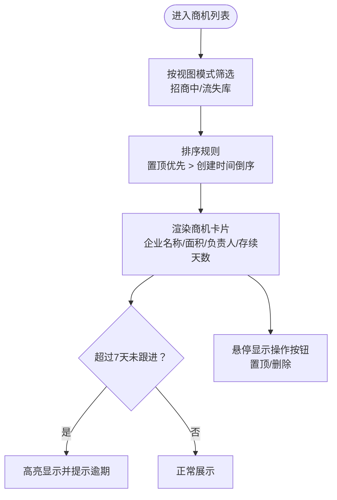
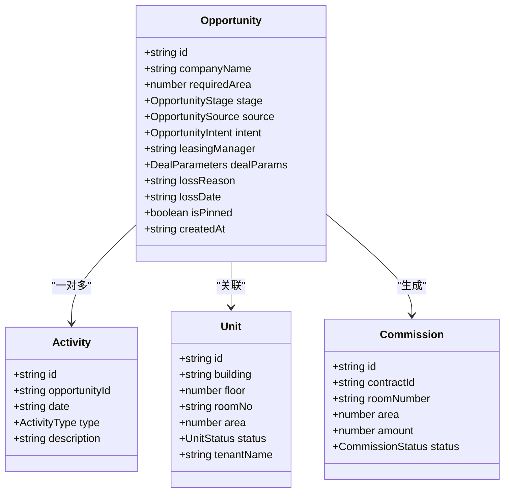
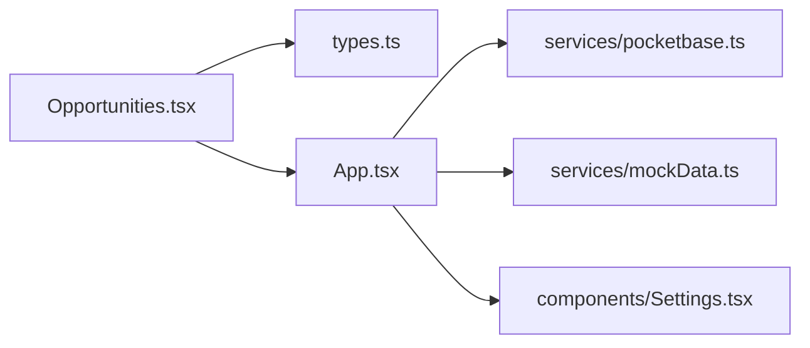

# 商机生命周期管理

<cite>
**本文引用的文件**
- [components/Opportunities.tsx](file://components/Opportunities.tsx)
- [services/pocketbase.ts](file://services/pocketbase.ts)
- [types.ts](file://types.ts)
- [App.tsx](file://App.tsx)
- [services/mockData.ts](file://services/mockData.ts)
- [components/Settings.tsx](file://components/Settings.tsx)
</cite>

## 目录
1. [简介](#简介)
2. [项目结构](#项目结构)
3. [核心组件](#核心组件)
4. [架构概览](#架构概览)
5. [详细组件分析](#详细组件分析)
6. [依赖关系分析](#依赖关系分析)
7. [性能考虑](#性能考虑)
8. [故障排查指南](#故障排查指南)
9. [结论](#结论)

## 简介
本系统为“上海商机及渠道管理系统（v5.0）”中的商机生命周期管理模块，围绕商业机会从线索到签约的完整流程进行设计与实现。系统支持商机的创建、编辑、删除、状态流转、可视化展示、优先级管理（置顶）、批量操作（通过筛选与视图模式实现）以及与资产销控、佣金结算、渠道PRM等模块的协同工作。

## 项目结构
系统采用前端单页应用架构，主要由以下层次组成：
- 视图层：负责用户交互与界面渲染（如商机管理页面、仪表盘、设置等）
- 业务逻辑层：负责状态管理、数据合并与持久化（如App.tsx中的状态与同步逻辑）
- 数据模型层：定义商机、活动、佣金、单位等核心实体及其枚举类型（types.ts）
- 服务层：提供与本地/云端数据存储的交互能力（services/pocketbase.ts）

图表来源
- [App.tsx](file://App.tsx#L179-L588)
- [services/pocketbase.ts](file://services/pocketbase.ts#L1-L274)
- [types.ts](file://types.ts#L1-L276)

章节来源
- [App.tsx](file://App.tsx#L179-L588)
- [services/pocketbase.ts](file://services/pocketbase.ts#L1-L274)
- [types.ts](file://types.ts#L1-L276)

## 核心组件
- 商机管理组件（Opportunities.tsx）：负责商机列表展示、详情查看、状态流转、新增/编辑/删除、置顶、跟进轨迹录入等
- 应用主控制器（App.tsx）：集中管理用户登录、数据加载/保存、状态合并、路由切换与模块挂载
- 类型定义（types.ts）：定义商机阶段、来源、意图、活动类型、单位状态、用户角色等枚举与实体接口
- 服务封装（services/pocketbase.ts）：提供资产同步、备份/恢复、乐观锁更新等能力
- 设置模块（components/Settings.tsx）：提供用户档案维护与账户管理（管理员权限）

章节来源
- [components/Opportunities.tsx](file://components/Opportunities.tsx#L28-L798)
- [App.tsx](file://App.tsx#L179-L588)
- [types.ts](file://types.ts#L10-L224)
- [services/pocketbase.ts](file://services/pocketbase.ts#L1-L274)
- [components/Settings.tsx](file://components/Settings.tsx#L1-L200)

## 架构概览
系统采用“本地状态 + 云端快照”的双轨数据架构：
- 本地状态：React组件状态与浏览器本地存储，保证快速响应与离线体验
- 云端快照：通过PocketBase进行聚合与持久化，支持多端同步与冲突解决
- 数据合并策略：以ID为主键去重，优先保留本地最新数据；删除记录通过墓碑ID传播，确保云端与本地一致

图表来源
- [App.tsx](file://App.tsx#L328-L375)
- [services/pocketbase.ts](file://services/pocketbase.ts#L194-L227)

章节来源
- [App.tsx](file://App.tsx#L328-L375)
- [services/pocketbase.ts](file://services/pocketbase.ts#L194-L227)

## 详细组件分析

### 商机生命周期与状态流转
系统定义了完整的商机阶段枚举，涵盖从线索到签约再到流失的全过程。状态流转由UI按钮触发，结合业务规则进行约束与提示。

图表来源
- [types.ts](file://types.ts#L10-L16)
- [components/Opportunities.tsx](file://components/Opportunities.tsx#L122-L128)
- [components/Opportunities.tsx](file://components/Opportunities.tsx#L138-L164)

业务规则与触发时机
- 创建商机：必填企业名称与需求面积，来源为渠道时可关联中介人信息
- 状态流转：
  - “确认成交签约”按钮仅在非签约状态下可用，点击后进入签约表单
  - “标记商机流失”按钮仅在非签约状态下可用，需填写流失原因
  - 管理员可对已流失商机进行“重新激活并流转”，将状态重置为线索并指派给指定招商经理
- 成交后处理：生成佣金记录，更新相关房源状态为已租

章节来源
- [components/Opportunities.tsx](file://components/Opportunities.tsx#L73-L100)
- [components/Opportunities.tsx](file://components/Opportunities.tsx#L107-L120)
- [components/Opportunities.tsx](file://components/Opportunities.tsx#L122-L128)
- [components/Opportunities.tsx](file://components/Opportunities.tsx#L138-L164)
- [App.tsx](file://App.tsx#L377-L432)

### 商机可视化展示
商机列表采用卡片式布局，支持按活跃/流失视图切换、置顶高亮、逾期提醒与跟进统计。

图表来源
- [components/Opportunities.tsx](file://components/Opportunities.tsx#L213-L221)
- [components/Opportunities.tsx](file://components/Opportunities.tsx#L314-L377)
- [components/Opportunities.tsx](file://components/Opportunities.tsx#L324-L325)

状态展示要点
- 颜色编码：活跃商机使用蓝色主题，流失商机使用灰色主题
- 图标标识：带看活动使用绿色标签，跟进次数与最后更新日期辅助判断
- 描述信息：显示存续天数、负责人、需求面积等关键字段

章节来源
- [components/Opportunities.tsx](file://components/Opportunities.tsx#L314-L377)
- [components/Opportunities.tsx](file://components/Opportunities.tsx#L353-L355)

### 商机优先级管理与置顶
- 置顶功能：通过点击卡片右侧置顶按钮实现，置顶商机在列表中优先显示
- 排序规则：置顶优先于创建时间倒序，便于聚焦重点客户
- 管理员删除：管理员可在列表中直接删除商机，同时级联删除相关活动与佣金记录

章节来源
- [components/Opportunities.tsx](file://components/Opportunities.tsx#L102-L105)
- [components/Opportunities.tsx](file://components/Opportunities.tsx#L213-L221)
- [components/Opportunities.tsx](file://components/Opportunities.tsx#L130-L136)
- [App.tsx](file://App.tsx#L453-L464)

### 商机创建、编辑、删除实现细节
- 创建流程：校验必填项，根据渠道来源自动填充中介人信息，初始状态为线索，创建时间与置顶标志初始化
- 编辑流程：支持在详情页修改合同参数（签约状态下），或在新增模式下完善房源落位与价格信息
- 删除流程：弹窗二次确认，删除时写入墓碑ID并级联清理相关活动与佣金，避免“僵尸数据”复活

章节来源
- [components/Opportunities.tsx](file://components/Opportunities.tsx#L73-L100)
- [components/Opportunities.tsx](file://components/Opportunities.tsx#L166-L179)
- [components/Opportunities.tsx](file://components/Opportunities.tsx#L130-L136)
- [App.tsx](file://App.tsx#L453-L464)

### 签约与佣金生成
- 签约表单：支持楼宇选择、单元勾选、面积计算、日租单价与月租总额联动、支付周期、首期支付日、押金状态、免租期设置、客户背景与风控标记
- 佣金规则：根据成交面积匹配佣金规则，支持一次性与分期两种派发方式，自动生成多期佣金记录
- 状态变更：签约完成后更新商机状态为“签约”，并触发佣金生成与房源状态更新

章节来源
- [components/Opportunities.tsx](file://components/Opportunities.tsx#L107-L120)
- [components/Opportunities.tsx](file://components/Opportunities.tsx#L614-L795)
- [App.tsx](file://App.tsx#L377-L432)
- [services/mockData.ts](file://services/mockData.ts#L49-L61)

### 数据模型与枚举
系统通过强类型枚举与接口定义，确保业务一致性与可维护性。

图表来源
- [types.ts](file://types.ts#L184-L224)
- [types.ts](file://types.ts#L213-L224)
- [types.ts](file://types.ts#L78-L88)
- [types.ts](file://types.ts#L226-L241)

章节来源
- [types.ts](file://types.ts#L10-L224)

## 依赖关系分析
- 组件耦合：商机管理组件依赖类型定义与服务层，同时通过回调函数与应用主控制器进行状态同步
- 外部依赖：PocketBase用于云端快照与资产同步，Lucide图标库提供统一视觉元素
- 数据一致性：通过墓碑ID传播与乐观锁更新，确保多端并发场景下的数据一致性

图表来源
- [components/Opportunities.tsx](file://components/Opportunities.tsx#L1-L10)
- [App.tsx](file://App.tsx#L1-L15)
- [services/pocketbase.ts](file://services/pocketbase.ts#L1-L12)
- [services/mockData.ts](file://services/mockData.ts#L1-L2)
- [components/Settings.tsx](file://components/Settings.tsx#L1-L5)

章节来源
- [components/Opportunities.tsx](file://components/Opportunities.tsx#L1-L10)
- [App.tsx](file://App.tsx#L1-L15)
- [services/pocketbase.ts](file://services/pocketbase.ts#L1-L12)
- [services/mockData.ts](file://services/mockData.ts#L1-L2)
- [components/Settings.tsx](file://components/Settings.tsx#L1-L5)

## 性能考虑
- 列表渲染优化：使用Memo与排序逻辑减少不必要的重渲染
- 数据过滤：全局过滤有效活动记录，避免无效数据影响统计与展示
- 异步同步：3秒防抖与乐观锁更新，降低频繁写入带来的性能开销
- 可视化反馈：通过动画与高亮提示提升用户体验，同时保持界面响应速度

## 故障排查指南
- 云端同步失败：检查PocketBase连接状态与网络环境，确认快照名称与内容格式正确
- 数据不一致：确认墓碑ID传播是否生效，检查合并策略是否正确应用
- 签约失败：核对签约表单必填项与房源状态，确保免租期与支付周期设置合理
- 权限问题：管理员方可删除商机与激活已流失商机，普通用户仅能查看与编辑自身负责的商机

章节来源
- [services/pocketbase.ts](file://services/pocketbase.ts#L93-L173)
- [App.tsx](file://App.tsx#L328-L375)
- [components/Opportunities.tsx](file://components/Opportunities.tsx#L107-L120)
- [components/Opportunities.tsx](file://components/Opportunities.tsx#L138-L164)

## 结论
本商机生命周期管理模块通过清晰的阶段划分、严格的业务规则与完善的可视化展示，实现了从线索到签约的全流程闭环管理。配合云端快照与墓碑ID传播机制，系统在多端协作与数据一致性方面具备良好表现。建议在后续版本中进一步扩展批量操作能力与报表分析功能，以满足更复杂的运营需求。