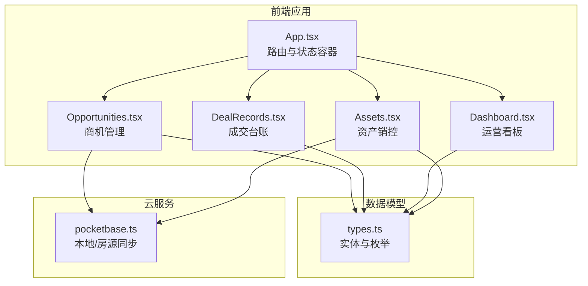
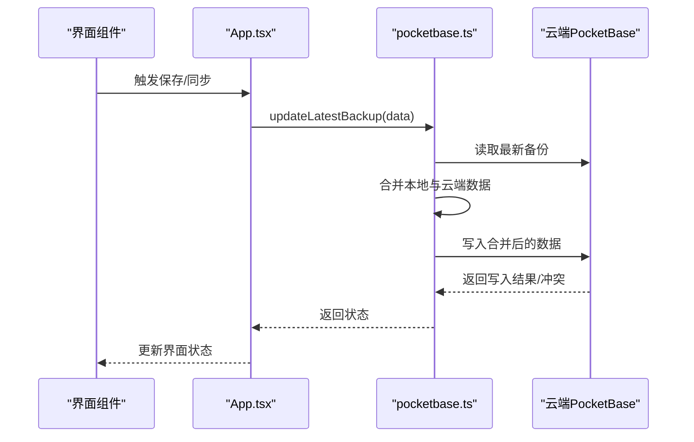
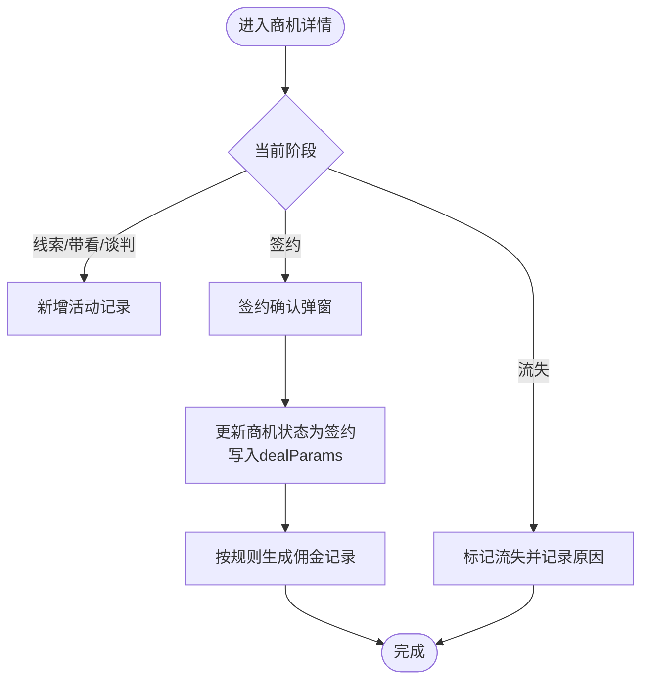
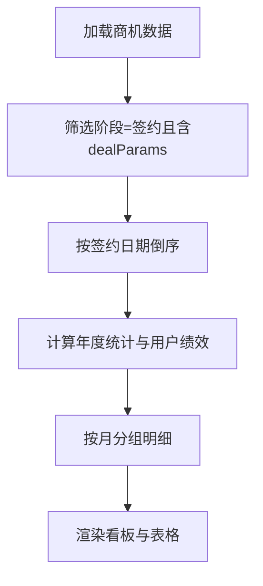
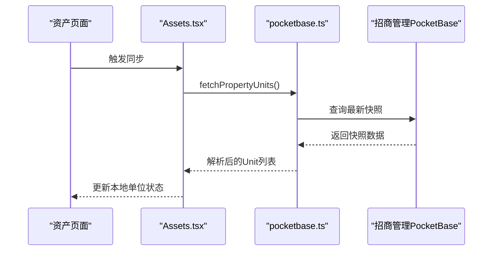
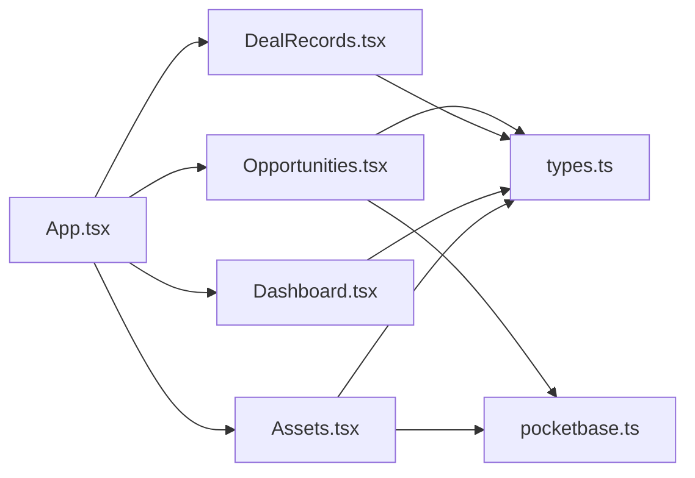

# 商机管理模块

<cite>
**本文引用的文件**
- [App.tsx](file://App.tsx)
- [Opportunities.tsx](file://components/Opportunities.tsx)
- [DealRecords.tsx](file://components/DealRecords.tsx)
- [Dashboard.tsx](file://components/Dashboard.tsx)
- [Assets.tsx](file://components/Assets.tsx)
- [types.ts](file://types.ts)
- [pocketbase.ts](file://services/pocketbase.ts)
- [mockData.ts](file://services/mockData.ts)
- [README.md](file://README.md)
- [MIGRATION_SUMMARY.md](file://MIGRATION_SUMMARY.md)
</cite>

## 目录
1. [简介](#简介)
2. [项目结构](#项目结构)
3. [核心组件](#核心组件)
4. [架构总览](#架构总览)
5. [详细组件分析](#详细组件分析)
6. [依赖关系分析](#依赖关系分析)
7. [性能考量](#性能考量)
8. [故障排查指南](#故障排查指南)
9. [结论](#结论)
10. [附录](#附录)

## 简介
本模块围绕“商业机会全生命周期管理”展开，覆盖商机创建、编辑、状态跟踪、活动记录、流失管理、数据分析与DealRecords交易记录管理，并与合同管理形成闭环。系统采用前端状态驱动与本地/云端备份结合的方式，确保数据一致性与可追溯性。

## 项目结构
- 模块入口与路由：App.tsx 提供导航与各子模块挂载点
- 商机管理：Opportunities.tsx 负责商机列表、详情、活动轨迹、状态流转、成交与流失
- 成交记录：DealRecords.tsx 展示成交台账、年度统计与转化分析
- 资产销控：Assets.tsx 对接招商管理PocketBase，同步房源状态
- 数据模型：types.ts 定义商机、活动、佣金、单位等核心类型
- 云服务：pocketbase.ts 封装本地/房源两套PocketBase实例的数据同步与备份
- 示例数据：mockData.ts 提供演示用的用户、渠道、佣金规则等

图表来源
- [App.tsx](file://App.tsx#L545-L572)
- [Opportunities.tsx](file://components/Opportunities.tsx#L28-L32)
- [DealRecords.tsx](file://components/DealRecords.tsx#L13-L11)
- [Dashboard.tsx](file://components/Dashboard.tsx#L20-L15)
- [Assets.tsx](file://components/Assets.tsx#L16-L14)
- [types.ts](file://types.ts#L10-L261)
- [pocketbase.ts](file://services/pocketbase.ts#L1-L226)

章节来源
- [App.tsx](file://App.tsx#L545-L572)
- [README.md](file://README.md#L1-L21)

## 核心组件
- 商机管理（Opportunities.tsx）
  - 支持商机创建、编辑、置顶、删除、状态流转（线索→带看→谈判→签约→流失）
  - 活动轨迹记录与展示（带看、电访、报价、谈判、签约）
  - 成交流程（签约确认、房源落位、租金与支付、免租期、风控标记）
  - 流失管理（标记流失、原因归档、管理员激活再分配）
  - 绩效看板（年度签约面积、活跃商机、带看次数、流失率）
- 成交记录（DealRecords.tsx）
  - 年度成交统计（宗数、面积、收益）、按月分组明细
  - 招商经理转化率与签约面积排行
- 资产销控（Assets.tsx）
  - 从招商管理PocketBase拉取房源快照，映射状态与租户信息
- 数据模型（types.ts）
  - 定义商机阶段、意图、来源、活动类型、单位状态、角色、佣金状态等
- 云服务（pocketbase.ts）
  - 本地备份与合并、云端房源同步、乐观锁更新

章节来源
- [Opportunities.tsx](file://components/Opportunities.tsx#L28-L500)
- [DealRecords.tsx](file://components/DealRecords.tsx#L13-L252)
- [Assets.tsx](file://components/Assets.tsx#L16-L200)
- [types.ts](file://types.ts#L10-L261)
- [pocketbase.ts](file://services/pocketbase.ts#L1-L226)

## 架构总览
系统采用“前端状态 + 本地/云端备份”的架构：
- 前端状态容器（App.tsx）维护商机、活动、佣金、用户、设置等全量数据
- 本地备份：通过PocketBase本地实例持久化全量业务快照，支持增量聚合与冲突处理
- 房源同步：从招商管理PocketBase拉取资产快照，映射为本地Unit类型
- 组件职责分离：Opportunities负责商机全生命周期；DealRecords负责成交分析；Dashboard负责运营看板；Assets负责资产销控

图表来源
- [App.tsx](file://App.tsx#L331-L378)
- [pocketbase.ts](file://services/pocketbase.ts#L146-L179)

## 详细组件分析

### 商机管理（Opportunities.tsx）
- 状态与视图
  - ACTIVE/LOST 双视图模式，支持筛选与排序
  - 列表项显示创建时间、跟进次数、最后更新、是否置顶、逾期标记
- 商机创建
  - 表单字段：公司名、行业、需求面积、入驻日期、来源、意向等级、渠道/中介关联
  - 默认阶段：线索（LEAD），初始标签为空，置顶关闭
- 活动记录
  - 支持带看、电访、报价、谈判、签约五类活动
  - 活动按日期倒序展示，支持新增与删除
- 成交流程
  - 签约确认弹窗：楼宇、单元、签约/起租/到期、单价、月租、支付周期、首期支付日、押金、备注、高风险标记
  - 免租期可多段配置，支持增删
  - 成交后触发佣金生成（根据面积区间与规则）
- 流失管理
  - 标记为流失时需填写原因；管理员可将已流失商机重新激活并指派给其他招商经理
- 绩效看板
  - 年度签约面积、活跃商机、本月新带看、年度总目标
  - 招商经理YTD商机数/带看、当前活跃商机、本月带看强度、流失率

图表来源
- [Opportunities.tsx](file://components/Opportunities.tsx#L107-L128)
- [Opportunities.tsx](file://components/Opportunities.tsx#L166-L179)
- [App.tsx](file://App.tsx#L380-L435)

章节来源
- [Opportunities.tsx](file://components/Opportunities.tsx#L28-L500)
- [App.tsx](file://App.tsx#L380-L435)

### 成交记录（DealRecords.tsx）
- 数据筛选
  - 年度筛选、企业名称搜索
  - 按月分组展示成交明细
- 统计指标
  - 年度签约宗数、累计去化面积、年度租金资产收益
  - 招商经理年度签约数量、累计成交面积、商机转化率
- 展示形式
  - 卡片式概览 + 明细表格，支持高亮转化率表现优异的招商经理

图表来源
- [DealRecords.tsx](file://components/DealRecords.tsx#L17-L100)
- [DealRecords.tsx](file://components/DealRecords.tsx#L102-L252)

章节来源
- [DealRecords.tsx](file://components/DealRecords.tsx#L13-L252)

### 资产销控（Assets.tsx）
- 房源同步
  - 从招商管理PocketBase拉取最新快照，解析楼宇/单元/租户映射
  - 状态映射：已租/待租/预留/自用，支持空置时长计算
- 本地维护
  - 管理员可新增/编辑/删除房源，支持手动同步
- 连接状态
  - 显示云端连接态、实例标识、源表信息与错误提示

图表来源
- [Assets.tsx](file://components/Assets.tsx#L109-L142)
- [pocketbase.ts](file://services/pocketbase.ts#L50-L125)

章节来源
- [Assets.tsx](file://components/Assets.tsx#L16-L200)
- [pocketbase.ts](file://services/pocketbase.ts#L1-L226)

### 数据模型（types.ts）
- 商机阶段与来源/意图/活动类型枚举
- 商机、活动、佣金、单位、渠道、用户等实体接口
- 交易参数（dealParams）与交易日志（dealLogs）

章节来源
- [types.ts](file://types.ts#L10-L261)

### 云服务（pocketbase.ts）
- 本地备份：保存/加载/列出备份，支持自动更新最新备份
- 房源同步：从招商管理PocketBase获取快照，深度解析嵌套结构，建立租户映射
- 并发控制：乐观锁检测冲突并重试

章节来源
- [pocketbase.ts](file://services/pocketbase.ts#L1-L226)

## 依赖关系分析
- 组件耦合
  - App.tsx 作为状态中心，向子组件注入回调与数据，降低耦合
  - Opportunities 依赖 types.ts 的枚举与接口，依赖 pocketbase.ts 的备份能力
  - DealRecords 依赖 Opportunities 的成交数据与 types.ts
  - Assets 依赖 pocketbase.ts 的房源同步
- 外部依赖
  - PocketBase 本地与房源实例
  - Recharts 用于 Dashboard 图表渲染
  - Lucide React 图标库

图表来源
- [App.tsx](file://App.tsx#L545-L572)
- [Opportunities.tsx](file://components/Opportunities.tsx#L28-L32)
- [DealRecords.tsx](file://components/DealRecords.tsx#L13-L11)
- [Dashboard.tsx](file://components/Dashboard.tsx#L20-L15)
- [Assets.tsx](file://components/Assets.tsx#L16-L14)
- [types.ts](file://types.ts#L10-L261)
- [pocketbase.ts](file://services/pocketbase.ts#L1-L226)

## 性能考量
- 数据过滤与计算
  - 使用 useMemo 缓存有效活动集合、用户绩效、成交分组等，减少重复计算
- 渲染优化
  - 列表项采用虚拟滚动友好布局，避免超大列表全量渲染
- 云同步
  - 本地3秒防抖自动保存，避免频繁写入
  - 并发冲突采用乐观锁重试，保证一致性
- 房源同步
  - 云端快照解析采用深度搜索与映射，避免二次请求

[本节为通用指导，无需特定文件引用]

## 故障排查指南
- 登录与同步
  - 若登录后无法加载云端数据，检查本地与云端PocketBase实例端口与URL配置
  - 查看云同步状态指示器，确认是否处于“聚合/保存/错误”状态
- 房源同步失败
  - 检查招商管理PocketBase是否运行，以及park_backups集合是否存在
  - 查看错误提示，确认快照数据结构是否符合解析预期
- 数据冲突
  - 若出现并发冲突，系统会自动重试合并；如仍失败，建议手动触发聚合
- 权限与操作
  - 流失商机仅管理员可激活再分配
  - 删除商机会级联删除活动与佣金记录，并在合并时防止“僵尸数据复活”

章节来源
- [MIGRATION_SUMMARY.md](file://MIGRATION_SUMMARY.md#L144-L156)
- [App.tsx](file://App.tsx#L302-L329)
- [pocketbase.ts](file://services/pocketbase.ts#L146-L179)

## 结论
本模块通过清晰的组件边界、完善的生命周期管理与数据模型，实现了从商机创建到成交落位的全链路闭环。配合成交台账与运营看板，为企业决策提供了可靠的数据支撑。云服务层保障了数据的一致性与可追溯性，适合在多端协作场景下稳定运行。

[本节为总结性内容，无需特定文件引用]

## 附录

### 商机状态流转机制与业务规则
- 状态枚举与含义
  - 线索（LEAD）、带看（VISIT）、谈判（NEGOTIATION）、签约（CONTRACT）、流失（CLOSED_LOST）
- 转换条件
  - 线索→带看：新增带看活动
  - 带看→谈判：新增谈判活动
  - 谈判→签约：完成签约确认并写入dealParams
  - 签约→流失：标记为流失并记录原因
  - 流失→线索：管理员激活并重新指派
- 业务规则
  - 成交后按面积区间与生效日期匹配佣金规则，生成一次性或分期佣金
  - 删除商机会级联删除活动与佣金，并在合并时过滤“已删除ID”

章节来源
- [types.ts](file://types.ts#L10-L16)
- [App.tsx](file://App.tsx#L380-L435)
- [Opportunities.tsx](file://components/Opportunities.tsx#L107-L128)

### 商机活动轨迹记录与展示
- 活动类型：带看、电访、报价、谈判、签约
- 展示方式：按日期倒序的时间轴卡片，左侧时间线节点
- 数据来源：活动表与商机表关联，支持搜索与筛选

章节来源
- [types.ts](file://types.ts#L47-L53)
- [Opportunities.tsx](file://components/Opportunities.tsx#L420-L434)

### 商机数据分析
- 来源统计：按商机来源分类统计数量
- 转化率分析：商机转化率 = 成交数 / 年度商机数
- 流失原因分析：按时间维度查看最近流失商机并归档原因
- 带看与转化：年度带看总数、年度流失商机数

章节来源
- [Dashboard.tsx](file://components/Dashboard.tsx#L31-L59)
- [DealRecords.tsx](file://components/DealRecords.tsx#L45-L56)

### DealRecords交易记录管理与合同集成
- 交易记录管理
  - 年度筛选、企业搜索、按月分组明细
  - 年度统计：宗数、面积、收益
- 与合同管理的集成
  - dealParams包含签约日期、楼宇/单元、单价、月租、支付周期、押金等关键字段
  - 成交后触发佣金生成，支持一次性与分期两种支付模式

章节来源
- [DealRecords.tsx](file://components/DealRecords.tsx#L17-L100)
- [types.ts](file://types.ts#L153-L175)
- [App.tsx](file://App.tsx#L380-L435)