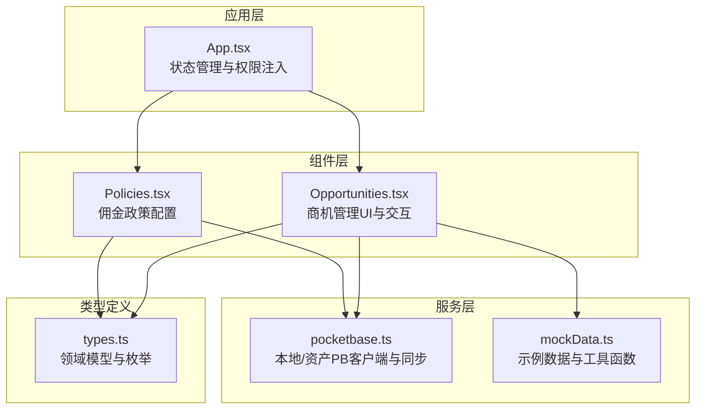
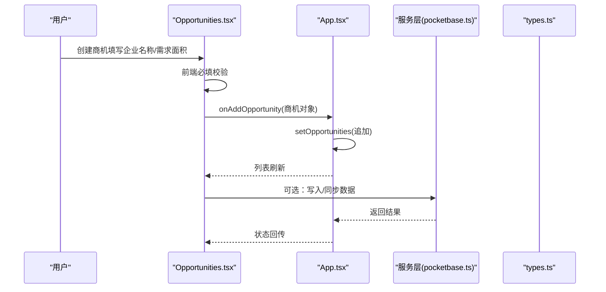
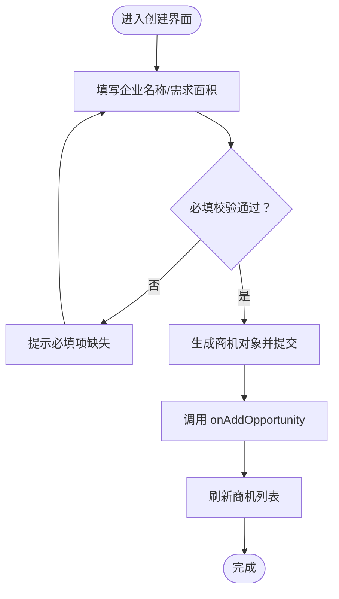
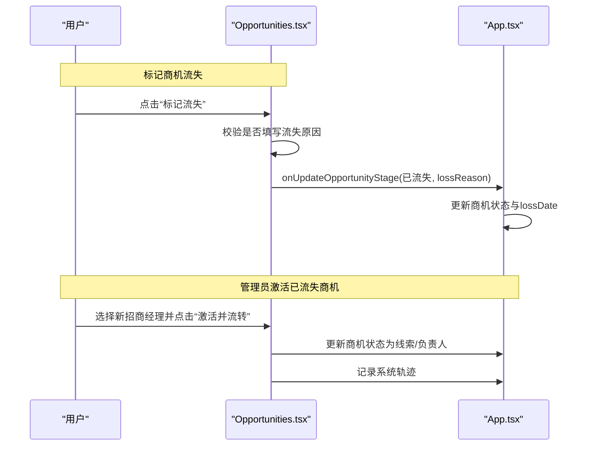
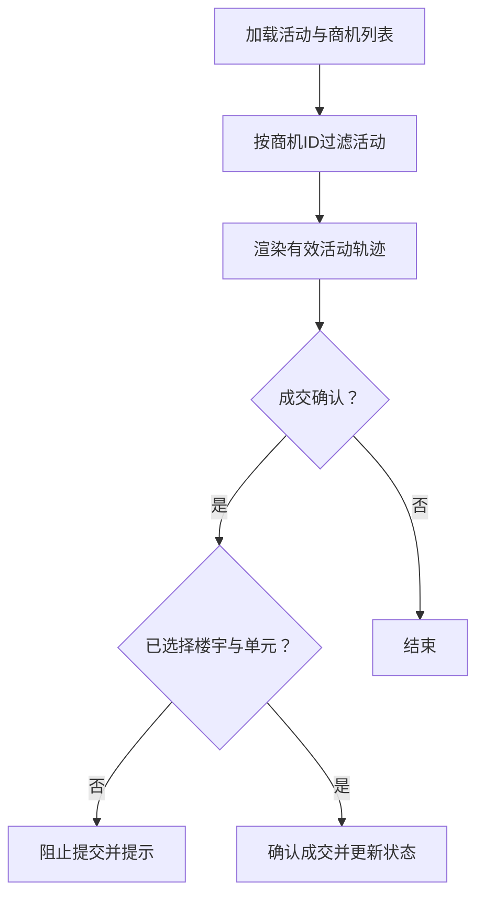
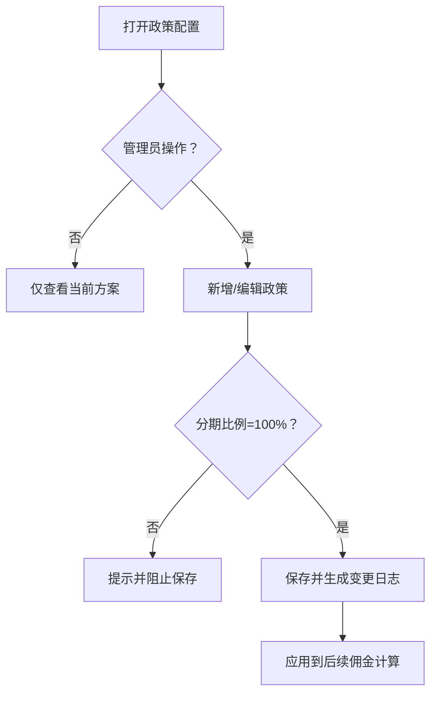
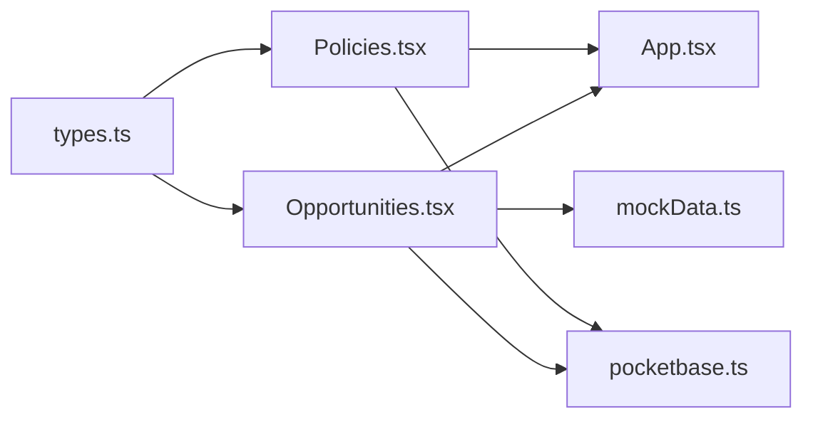

# 数据校验与规则

<cite>
**本文引用的文件**
- [README.md](file://README.md)
- [types.ts](file://types.ts)
- [Opportunities.tsx](file://components/Opportunities.tsx)
- [App.tsx](file://App.tsx)
- [pocketbase.ts](file://services/pocketbase.ts)
- [mockData.ts](file://services/mockData.ts)
- [Policies.tsx](file://components/Policies.tsx)
</cite>

## 目录
1. [简介](#简介)
2. [项目结构](#项目结构)
3. [核心组件](#核心组件)
4. [架构总览](#架构总览)
5. [详细组件分析](#详细组件分析)
6. [依赖关系分析](#依赖关系分析)
7. [性能考量](#性能考量)
8. [故障排查指南](#故障排查指南)
9. [结论](#结论)
10. [附录](#附录)

## 简介
本文件聚焦商机管理模块的数据校验与业务规则，围绕以下主题展开：
- 商机创建时的必填字段校验机制（企业名称、需求面积等）
- 商机状态转换的业务规则与权限控制（管理员可激活已流失商机；招商经理可标记商机流失）
- 数据完整性检查（活动轨迹与商机关联有效性）
- 错误处理与用户提示最佳实践
- 数据一致性保障措施
- 业务规则配置与动态调整（佣金政策）的实现方案

## 项目结构
本项目采用前端单页应用架构，商机管理功能位于商机模块组件中，通过顶层应用组件进行状态管理与权限注入。

图表来源
- [App.tsx](file://App.tsx#L541-L547)
- [Opportunities.tsx](file://components/Opportunities.tsx#L1-L120)
- [Policies.tsx](file://components/Policies.tsx#L22-L70)
- [pocketbase.ts](file://services/pocketbase.ts#L1-L30)
- [mockData.ts](file://services/mockData.ts#L49-L80)
- [types.ts](file://types.ts#L184-L224)

章节来源
- [README.md](file://README.md#L1-L21)
- [App.tsx](file://App.tsx#L541-L547)

## 核心组件
- 商机实体与枚举：定义商机、活动、用户、单位、佣金等核心数据模型与状态枚举，为校验与规则提供统一语义基础。
- 商机管理组件：负责商机创建、编辑、状态转换、活动录入、成交确认等交互流程，并内置前端校验与权限判断。
- 政策配置组件：负责佣金政策的增删改查、生效状态切换与历史记录，体现业务规则的动态调整能力。
- 应用层状态管理：集中维护商机、活动、佣金、单位等全局状态，提供统一的更新与删除接口，确保数据一致性。

章节来源
- [types.ts](file://types.ts#L184-L224)
- [Opportunities.tsx](file://components/Opportunities.tsx#L75-L102)
- [Policies.tsx](file://components/Policies.tsx#L22-L70)
- [App.tsx](file://App.tsx#L426-L444)

## 架构总览
商机管理模块遵循“组件驱动 + 应用状态”的设计，组件负责用户交互与前端校验，应用层负责状态更新与权限控制，服务层负责外部数据同步与持久化。

图表来源
- [Opportunities.tsx](file://components/Opportunities.tsx#L75-L102)
- [App.tsx](file://App.tsx#L430-L431)
- [pocketbase.ts](file://services/pocketbase.ts#L178-L188)
- [types.ts](file://types.ts#L184-L211)

## 详细组件分析

### 商机创建与必填校验
- 必填字段
  - 企业名称：创建时若为空则阻止提交并提示。
  - 需求面积：创建时若为0或空则阻止提交并提示。
- 其他关键字段
  - 来源、意向等级、预计入驻日期、关联房源等，创建时可选，但后续流程（如成交）对楼宇与单元有必填约束。
- 交互流程
  - 打开新建弹窗 → 输入必填项 → 点击创建 → 触发前端校验 → 成功后调用应用层添加接口 → 刷新列表。

图表来源
- [Opportunities.tsx](file://components/Opportunities.tsx#L75-L102)
- [App.tsx](file://App.tsx#L430-L431)

章节来源
- [Opportunities.tsx](file://components/Opportunities.tsx#L75-L102)
- [App.tsx](file://App.tsx#L430-L431)

### 商机状态转换与权限控制
- 状态枚举
  - 阶段：线索、带看、谈判、签约、已流失。
- 权限规则
  - 标记流失：仅招商经理可执行，需填写流失原因。
  - 激活已流失商机：仅管理员可执行，需选择新的招商经理并生成系统轨迹。
- 状态更新
  - 已流失：写入流失原因与日期。
  - 激活：重置阶段为线索，更新负责人并记录系统轨迹。

图表来源
- [Opportunities.tsx](file://components/Opportunities.tsx#L161-L203)
- [App.tsx](file://App.tsx#L426-L428)

章节来源
- [Opportunities.tsx](file://components/Opportunities.tsx#L161-L203)
- [App.tsx](file://App.tsx#L426-L428)

### 数据完整性检查（活动轨迹与商机关联）
- 有效轨迹过滤
  - 在渲染前对活动集合进行过滤，仅保留存在于当前商机列表中的活动，避免“已删除商机残留”的脏数据污染。
- 关联有效性
  - 成交确认时，若未选择楼宇与单元，则阻止提交。
  - 激活已流失商机时，需选择有效的招商经理，确保责任人可追溯。

图表来源
- [Opportunities.tsx](file://components/Opportunities.tsx#L62-L66)
- [Opportunities.tsx](file://components/Opportunities.tsx#L146-L159)

章节来源
- [Opportunities.tsx](file://components/Opportunities.tsx#L62-L66)
- [Opportunities.tsx](file://components/Opportunities.tsx#L146-L159)

### 错误处理与用户提示最佳实践
- 明确的前端校验与即时反馈
  - 必填项缺失时立即弹出提示，避免无效提交。
  - 对于敏感操作（删除、激活、策略变更），使用二次确认对话框降低误操作风险。
- 系统级容错
  - 服务层提供超时与重试机制，提升外部数据同步的稳定性。
  - 备份/恢复采用乐观锁与冲突检测，避免并发写入导致的数据不一致。

章节来源
- [Opportunities.tsx](file://components/Opportunities.tsx#L75-L102)
- [Opportunities.tsx](file://components/Opportunities.tsx#L161-L167)
- [pocketbase.ts](file://services/pocketbase.ts#L50-L87)
- [pocketbase.ts](file://services/pocketbase.ts#L194-L227)

### 数据一致性保障措施
- 级联删除
  - 删除商机时，同时记录并清理其关联的佣金与活动ID，防止“幽灵数据”残留。
- 状态原子更新
  - 应用层通过替换式更新（map）保证状态变更的原子性与可追踪性。
- 数据来源一致性
  - 通过统一的服务层接口进行数据读写，避免多处分散逻辑引发的不一致。

章节来源
- [App.tsx](file://App.tsx#L434-L444)
- [App.tsx](file://App.tsx#L426-L428)

### 业务规则配置与动态调整（佣金政策）
- 规则维度
  - 面积区间、生效日期、是否一次性/分期、分期节点与比例等。
- 动态调整
  - 管理员可新增、编辑、启用/禁用、删除政策，并生成变更日志。
  - 分期规则需满足比例之和为100%，否则阻止保存。
- 影响范围
  - 策略变更影响后续佣金计算与结算流程，需结合商机成交面积自动匹配。

图表来源
- [Policies.tsx](file://components/Policies.tsx#L22-L70)
- [Policies.tsx](file://components/Policies.tsx#L94-L128)

章节来源
- [Policies.tsx](file://components/Policies.tsx#L22-L70)
- [Policies.tsx](file://components/Policies.tsx#L94-L128)
- [mockData.ts](file://services/mockData.ts#L49-L61)

## 依赖关系分析
- 类型依赖
  - 商机、活动、用户、单位、佣金等模型由统一类型文件定义，组件与应用层均依赖这些类型进行数据建模与校验。
- 组件耦合
  - 商机组件与应用层通过回调接口解耦，便于测试与扩展。
- 服务依赖
  - 服务层提供统一的备份/恢复与同步接口，减少组件对具体实现的关注。

图表来源
- [types.ts](file://types.ts#L184-L224)
- [Opportunities.tsx](file://components/Opportunities.tsx#L1-L30)
- [Policies.tsx](file://components/Policies.tsx#L22-L40)
- [App.tsx](file://App.tsx#L541-L547)
- [pocketbase.ts](file://services/pocketbase.ts#L1-L30)
- [mockData.ts](file://services/mockData.ts#L49-L61)

章节来源
- [types.ts](file://types.ts#L184-L224)
- [Opportunities.tsx](file://components/Opportunities.tsx#L1-L30)
- [Policies.tsx](file://components/Policies.tsx#L22-L40)
- [App.tsx](file://App.tsx#L541-L547)
- [pocketbase.ts](file://services/pocketbase.ts#L1-L30)
- [mockData.ts](file://services/mockData.ts#L49-L61)

## 性能考量
- 渲染优化
  - 使用记忆化过滤有效活动，避免重复计算与渲染。
  - 列表排序与筛选在内存中完成，减少不必要的DOM更新。
- 网络与同步
  - 服务层提供超时与重试机制，降低外部依赖不稳定带来的影响。
- 数据规模
  - 对于大规模数据，建议分页加载与懒渲染，避免一次性渲染过多节点。

章节来源
- [Opportunities.tsx](file://components/Opportunities.tsx#L62-L66)
- [pocketbase.ts](file://services/pocketbase.ts#L50-L87)

## 故障排查指南
- 登录与数据同步
  - 登录前先进行云端数据同步，若失败检查网络与服务端状态。
- 备份/恢复问题
  - 若备份保存/更新失败，检查并发冲突与服务端响应码。
- 商机删除后残留活动
  - 确认应用层是否正确记录并清理关联ID，避免“幽灵活动”出现。
- 成交确认失败
  - 检查楼宇与单元是否已选择，确保必填项完整。

章节来源
- [App.tsx](file://App.tsx#L77-L104)
- [pocketbase.ts](file://services/pocketbase.ts#L178-L227)
- [App.tsx](file://App.tsx#L434-L444)
- [Opportunities.tsx](file://components/Opportunities.tsx#L146-L159)

## 结论
本模块通过明确的前端校验、严格的权限控制与完善的级联删除机制，确保了商机数据的完整性与一致性。同时，政策配置的动态调整能力为业务提供了灵活的规则支撑。建议在后续迭代中进一步引入后端校验与审计日志，以增强跨端一致性与可追溯性。

## 附录
- 关键字段与校验清单
  - 创建：企业名称、需求面积（必填）
  - 成交：楼宇、单元（必填）
  - 流失：流失原因（必填）
- 权限对照
  - 标记流失：招商经理
  - 激活已流失：管理员
  - 政策配置：管理员