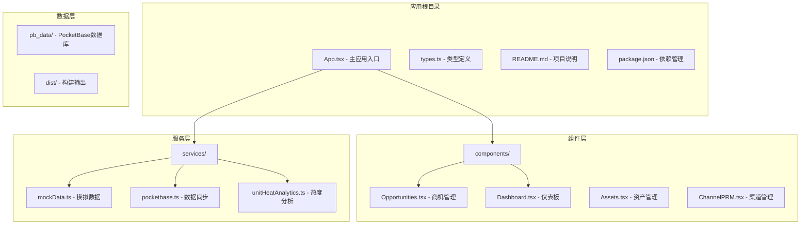
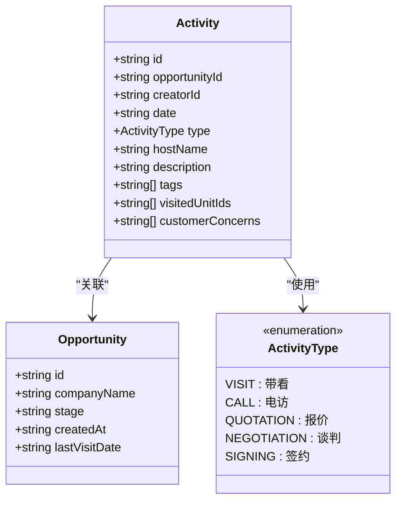
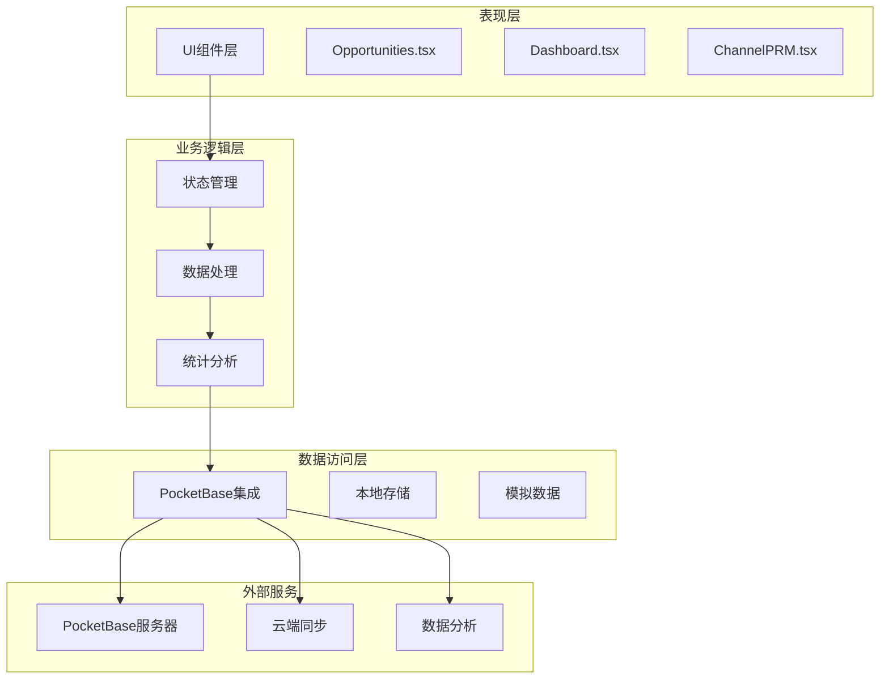
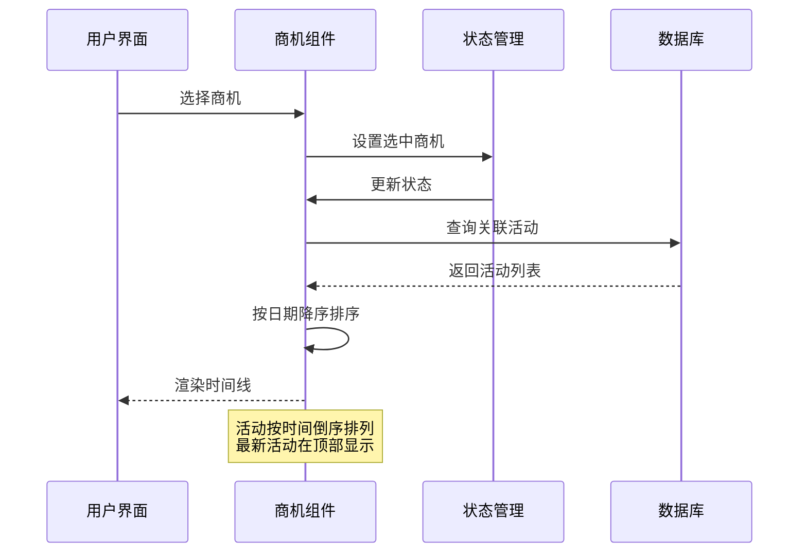
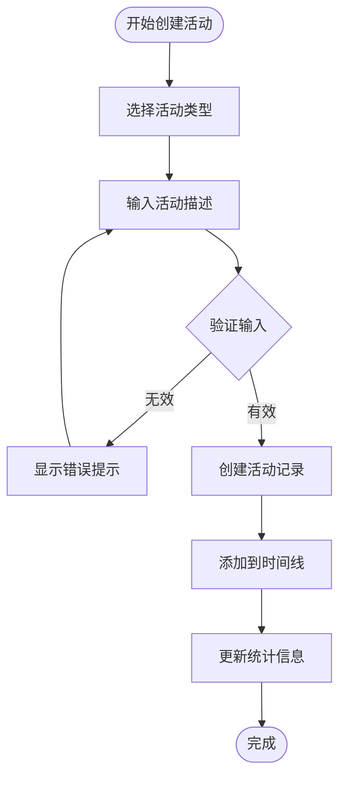
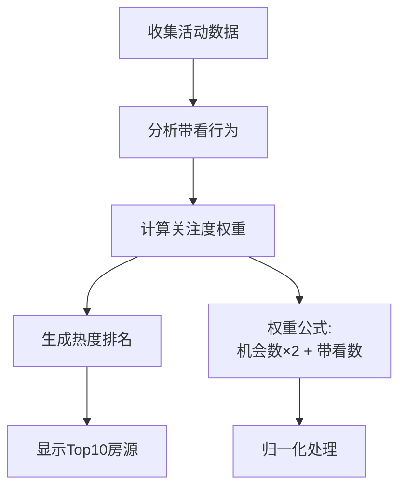
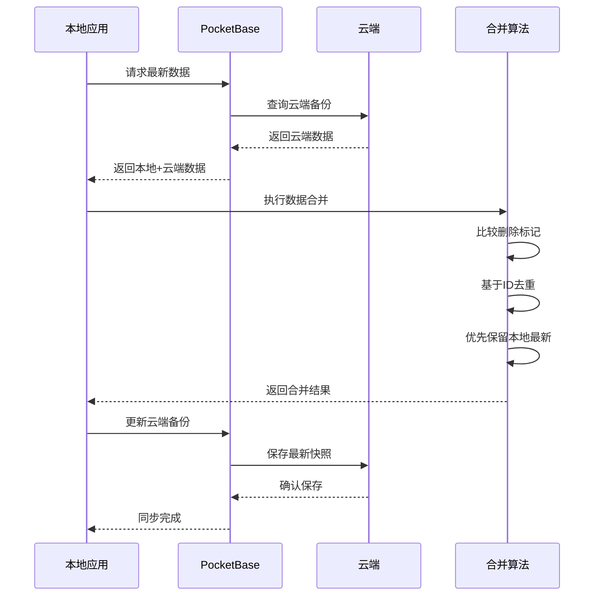
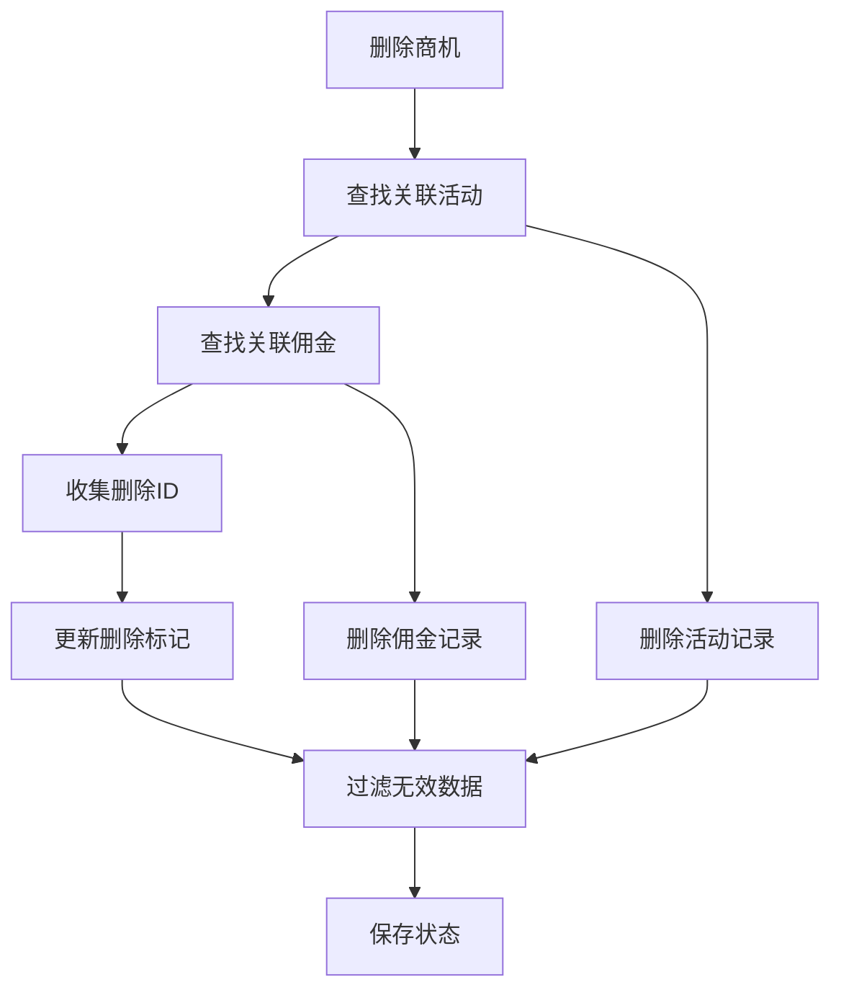
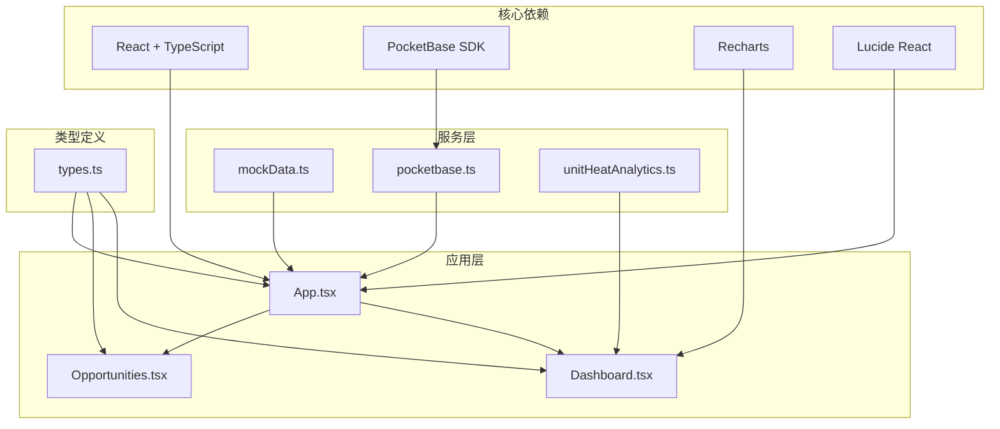
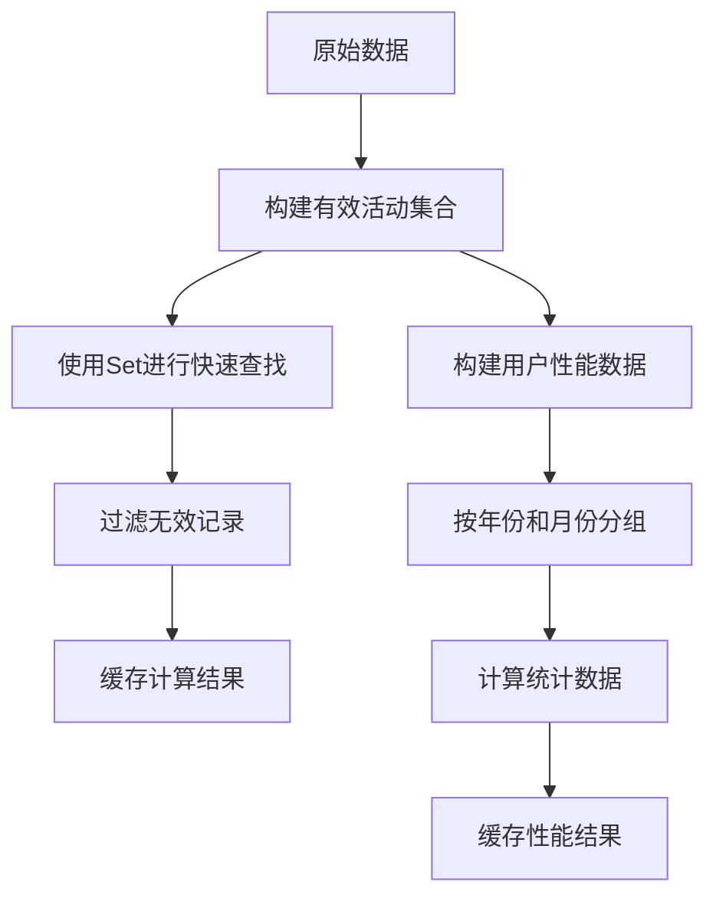

# 活动轨迹追踪系统

<cite>
**本文档引用的文件**
- [App.tsx](file://App.tsx)
- [types.ts](file://types.ts)
- [Opportunities.tsx](file://components/Opportunities.tsx)
- [Dashboard.tsx](file://components/Dashboard.tsx)
- [mockData.ts](file://services/mockData.ts)
- [pocketbase.ts](file://services/pocketbase.ts)
- [unitHeatAnalytics.ts](file://services/unitHeatAnalytics.ts)
</cite>

## 目录
1. [简介](#简介)
2. [项目结构](#项目结构)
3. [核心组件](#核心组件)
4. [架构概览](#架构概览)
5. [详细组件分析](#详细组件分析)
6. [依赖关系分析](#依赖关系分析)
7. [性能考虑](#性能考虑)
8. [故障排除指南](#故障排除指南)
9. [结论](#结论)

## 简介

活动轨迹追踪系统是一个完整的商机跟进活动记录机制，专门用于记录和分析客户跟进过程中的各种活动类型。该系统支持多种活动类型，包括VISIT（带看）、CALL（电话）、QUOTATION（报价）、NEGOTIATION（谈判）、SIGNING（签约）等，为招商管理人员提供了全面的客户关系管理工具。

系统的核心功能包括：
- 完整的活动记录机制，涵盖客户跟进的各个阶段
- 实时的时间线展示和排序规则
- 活动与商机的紧密关联关系
- 多维度的统计分析功能
- 用户友好的界面交互设计

## 项目结构

该项目采用React + TypeScript技术栈构建，整体架构清晰，模块化程度高。主要目录结构如下：



**图表来源**
- [App.tsx](file://App.tsx#L1-L590)
- [types.ts](file://types.ts#L1-L276)

**章节来源**
- [App.tsx](file://App.tsx#L1-L590)
- [types.ts](file://types.ts#L1-L276)

## 核心组件

### 活动类型定义

系统定义了完整的活动类型体系，每种活动类型都有明确的使用场景和业务含义：



**图表来源**
- [types.ts](file://types.ts#L47-L53)
- [types.ts](file://types.ts#L213-L224)

### 数据模型结构

系统采用标准化的数据模型设计，确保数据的一致性和完整性：

| 字段名 | 类型 | 描述 | 必填 |
|--------|------|------|------|
| id | string | 活动唯一标识符 | 是 |
| opportunityId | string | 关联商机ID | 是 |
| creatorId | string | 创建者ID | 是 |
| date | string | 活动日期 | 是 |
| type | ActivityType | 活动类型 | 是 |
| hostName | string | 执行人姓名 | 是 |
| description | string | 活动描述 | 是 |
| tags | string[] | 标签数组 | 否 |
| visitedUnitIds | string[] | 带看房源ID列表 | 否 |
| customerConcerns | string[] | 客户关注点 | 否 |

**章节来源**
- [types.ts](file://types.ts#L47-L53)
- [types.ts](file://types.ts#L213-L224)

## 架构概览

系统采用分层架构设计，确保各层职责清晰，便于维护和扩展：



**图表来源**
- [App.tsx](file://App.tsx#L17-L75)
- [pocketbase.ts](file://services/pocketbase.ts#L1-L274)

系统的核心特性包括：

1. **实时数据同步**：通过PocketBase实现云端和本地数据的实时同步
2. **智能合并算法**：防止数据冲突，确保数据一致性
3. **级联删除机制**：删除商机时自动清理关联的活动记录
4. **性能优化**：使用Memoization和虚拟滚动提升大数据量下的响应速度

**章节来源**
- [App.tsx](file://App.tsx#L17-L75)
- [App.tsx](file://App.tsx#L453-L464)

## 详细组件分析

### 商机管理组件

商机管理组件是活动轨迹追踪系统的核心，提供了完整的商机生命周期管理功能：

#### 时间线展示机制

系统采用时间倒序的方式展示活动轨迹，确保最新的跟进记录显示在最上方：



**图表来源**
- [Opportunities.tsx](file://components/Opportunities.tsx#L423-L432)

#### 活动创建流程

用户可以通过简洁的界面创建新的活动记录：



**图表来源**
- [Opportunities.tsx](file://components/Opportunities.tsx#L492-L494)

#### 活动类型与使用场景

| 活动类型 | 使用场景 | 关键特征 |
|----------|----------|----------|
| VISIT | 实地带看客户 | 记录带看房源、客户关注点 |
| CALL | 电话沟通跟进 | 保持电话沟通记录 |
| QUOTATION | 提供报价方案 | 详细记录报价内容 |
| NEGOTIATION | 商务谈判过程 | 记录谈判要点和进展 |
| SIGNING | 合同签署完成 | 标志性里程碑事件 |

**章节来源**
- [Opportunities.tsx](file://components/Opportunities.tsx#L489-L494)
- [Opportunities.tsx](file://components/Opportunities.tsx#L423-L432)

### 仪表板统计分析

仪表板提供了多维度的统计分析功能，帮助管理者全面了解招商运营状况：

#### 用户绩效分析

系统为每个招商经理提供个性化的绩效分析：

```mermaid
graph LR
subgraph "用户维度"
A[招商经理A]
B[招商经理B]
C[招商经理C]
end
subgraph "指标维度"
D[年度商机数]
E[年度带看数]
F[当前活跃商机]
G[本月带看强度]
H[流失率(YTD)]
end
A --> D
A --> E
A --> F
A --> G
A --> H
```

**图表来源**
- [Opportunities.tsx](file://components/Opportunities.tsx#L196-L211)

#### 房源热度统计

系统实现了智能的房源关注度分析：



**图表来源**
- [Dashboard.tsx](file://components/Dashboard.tsx#L62-L65)

**章节来源**
- [Opportunities.tsx](file://components/Opportunities.tsx#L196-L211)
- [Dashboard.tsx](file://components/Dashboard.tsx#L62-L65)

### 数据同步与持久化

系统采用了先进的数据同步机制，确保数据的安全性和一致性：

#### 云端同步流程



**图表来源**
- [App.tsx](file://App.tsx#L300-L375)
- [pocketbase.ts](file://services/pocketbase.ts#L194-L227)

#### 级联删除机制

系统实现了智能的级联删除功能，防止数据不一致：



**图表来源**
- [App.tsx](file://App.tsx#L453-L464)

**章节来源**
- [App.tsx](file://App.tsx#L300-L375)
- [App.tsx](file://App.tsx#L453-L464)
- [pocketbase.ts](file://services/pocketbase.ts#L194-L227)

## 依赖关系分析

系统采用模块化设计，各组件之间的依赖关系清晰明确：



**图表来源**
- [App.tsx](file://App.tsx#L1-L15)
- [types.ts](file://types.ts#L1-L276)

### 外部依赖管理

系统对外部依赖进行了精心管理，确保版本兼容性和安全性：

| 依赖包 | 版本 | 用途 | 重要性 |
|--------|------|------|--------|
| react | 最新稳定版 | 核心框架 | 高 |
| react-dom | 最新稳定版 | DOM渲染 | 高 |
| pocketbase | 最新版本 | 数据库服务 | 高 |
| recharts | ^2.12.7 | 图表可视化 | 中 |
| lucide-react | ^0.446.0 | 图标库 | 中 |
| typescript | ^5.4.5 | 类型系统 | 高 |

**章节来源**
- [App.tsx](file://App.tsx#L1-L15)
- [types.ts](file://types.ts#L1-L276)

## 性能考虑

系统在设计时充分考虑了性能优化，特别是在处理大量数据时的表现：

### 内存优化策略

1. **Memoization优化**：使用useMemo缓存计算结果，避免重复计算
2. **虚拟滚动**：对长列表使用虚拟滚动技术，减少DOM节点数量
3. **懒加载**：按需加载组件和数据，提升初始加载速度

### 数据处理优化



**图表来源**
- [Opportunities.tsx](file://components/Opportunities.tsx#L60-L64)
- [Opportunities.tsx](file://components/Opportunities.tsx#L196-L211)

### 网络性能优化

1. **防抖机制**：自动保存功能使用3秒防抖，避免频繁网络请求
2. **重试机制**：网络请求包含自动重试逻辑，提高成功率
3. **超时控制**：所有网络请求都有超时保护，防止长时间挂起

## 故障排除指南

### 常见问题及解决方案

#### 数据同步问题

**问题症状**：数据不同步或显示异常
**可能原因**：
- PocketBase服务未启动
- 网络连接不稳定
- 数据格式不匹配

**解决方案**：
1. 检查PocketBase服务状态
2. 验证网络连接稳定性
3. 查看浏览器控制台错误信息
4. 重新加载页面尝试

#### 性能问题

**问题症状**：页面响应缓慢或卡顿
**可能原因**：
- 数据量过大
- 组件渲染过多
- 内存泄漏

**解决方案**：
1. 检查数据量大小，考虑分页加载
2. 优化组件渲染逻辑
3. 使用浏览器开发者工具检查内存使用
4. 清理不必要的事件监听器

#### 活动记录丢失

**问题症状**：活动记录无法显示或消失
**可能原因**：
- 商机被删除导致级联删除
- 数据合并时被过滤
- 浏览器缓存问题

**解决方案**：
1. 检查商机状态是否正常
2. 验证删除标记是否正确
3. 清除浏览器缓存后重试
4. 检查云端备份数据

**章节来源**
- [App.tsx](file://App.tsx#L300-L375)
- [pocketbase.ts](file://services/pocketbase.ts#L72-L87)

## 结论

活动轨迹追踪系统是一个功能完整、架构清晰的商业应用。系统通过合理的数据模型设计、智能的统计分析功能和可靠的同步机制，为招商管理工作提供了强有力的技术支撑。

### 主要优势

1. **完整的活动类型支持**：涵盖了客户跟进的所有关键环节
2. **智能统计分析**：提供多维度的业务洞察
3. **可靠的数据同步**：确保数据的一致性和安全性
4. **优秀的用户体验**：直观的界面设计和流畅的交互体验

### 技术亮点

1. **先进的合并算法**：有效防止数据冲突
2. **智能的性能优化**：确保大数据量下的良好性能
3. **完善的错误处理**：提供可靠的故障恢复机制
4. **模块化的架构设计**：便于维护和扩展

该系统为招商管理提供了全面的数字化解决方案，能够显著提升工作效率和管理水平。随着业务的发展，系统还具备良好的扩展性，可以支持更多高级功能的集成。