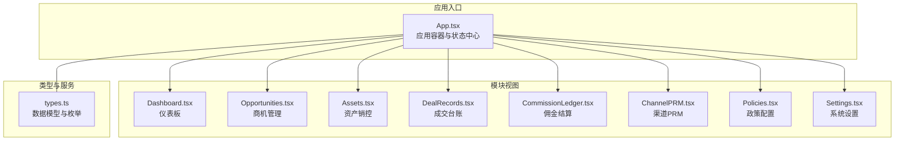
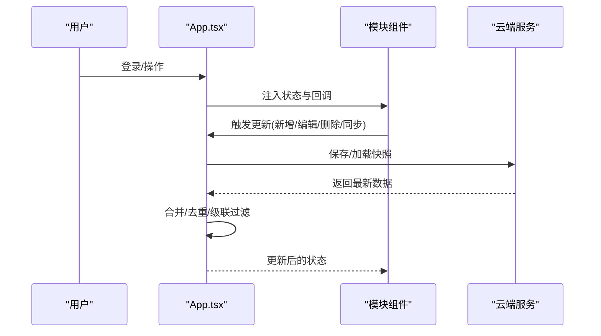
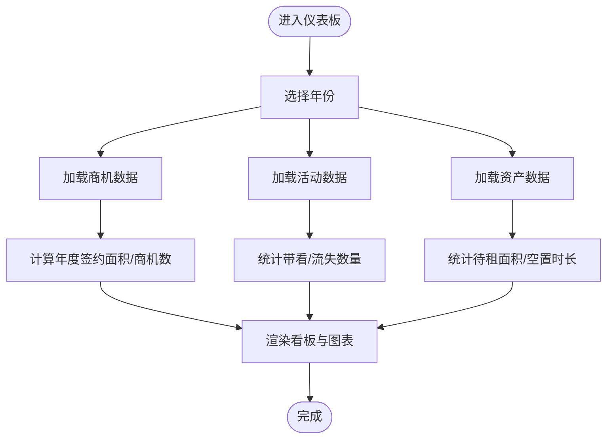
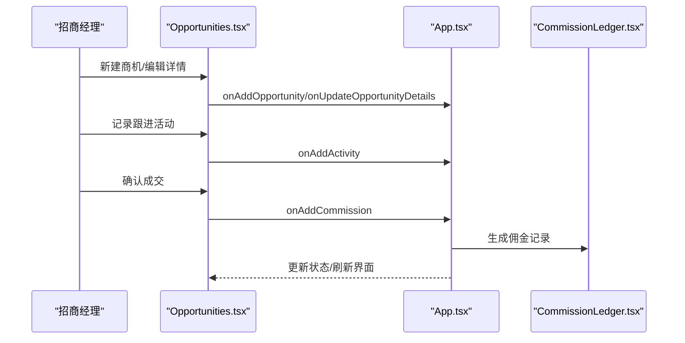
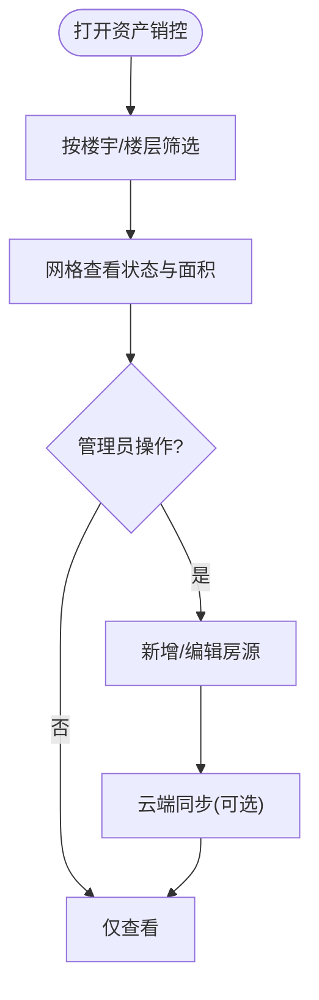
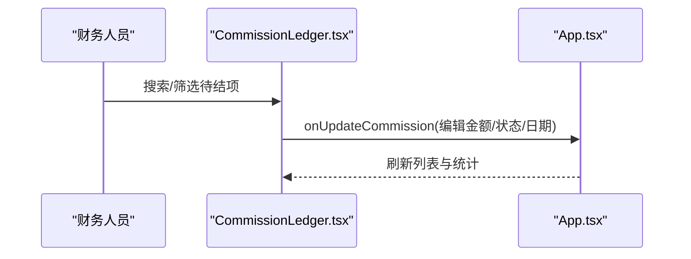
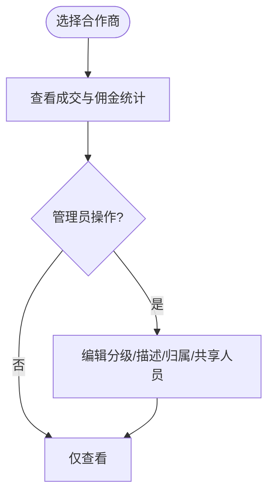
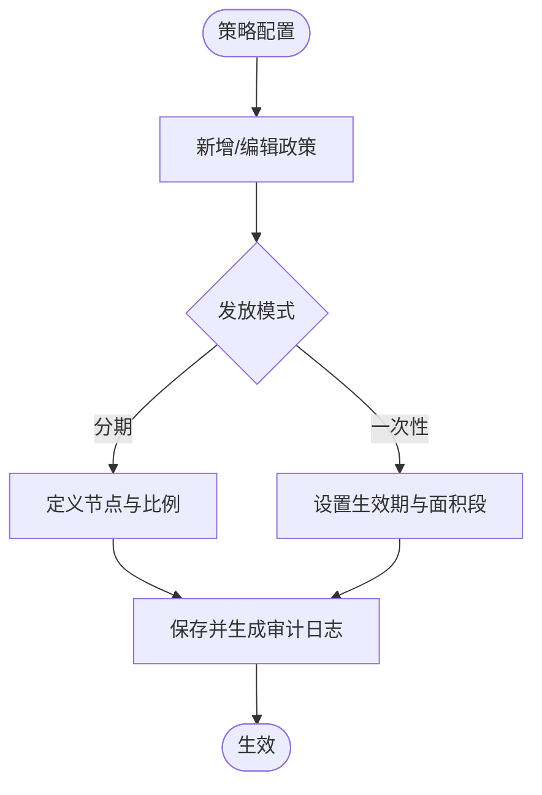
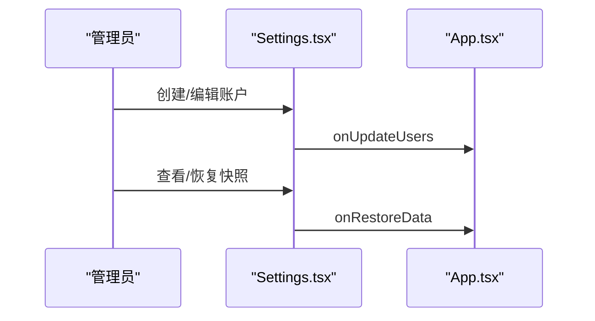
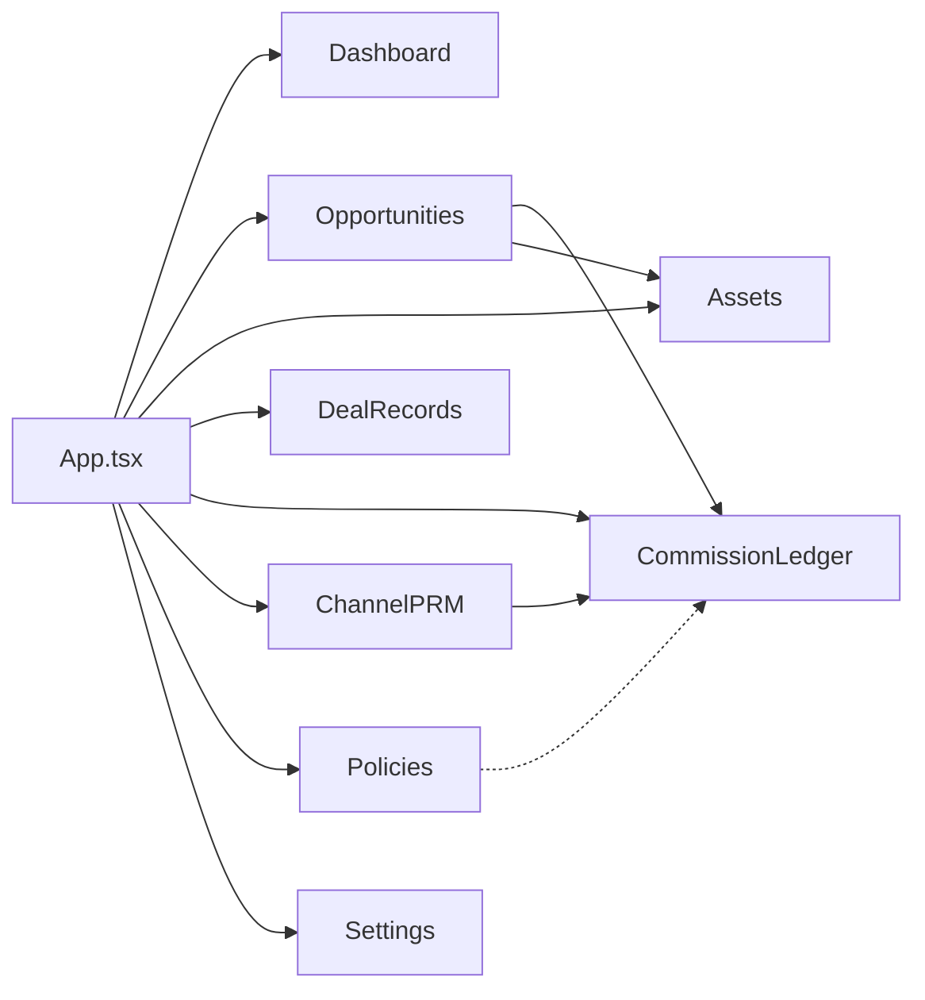

# 核心功能模块

<cite>
**本文引用的文件**
- [App.tsx](file://App.tsx)
- [Dashboard.tsx](file://components/Dashboard.tsx)
- [Opportunities.tsx](file://components/Opportunities.tsx)
- [Assets.tsx](file://components/Assets.tsx)
- [CommissionLedger.tsx](file://components/CommissionLedger.tsx)
- [ChannelPRM.tsx](file://components/ChannelPRM.tsx)
- [Policies.tsx](file://components/Policies.tsx)
- [Settings.tsx](file://components/Settings.tsx)
- [DealRecords.tsx](file://components/DealRecords.tsx)
- [types.ts](file://types.ts)
</cite>

## 目录
1. [简介](#简介)
2. [项目结构](#项目结构)
3. [核心组件](#核心组件)
4. [架构总览](#架构总览)
5. [详细组件分析](#详细组件分析)
6. [依赖分析](#依赖分析)
7. [性能考虑](#性能考虑)
8. [故障排查指南](#故障排查指南)
9. [结论](#结论)
10. [附录](#附录)

## 简介
本文件面向“上海商机及渠道管理系统（v5.0）”，对七大核心功能模块进行全面说明：仪表板、商机管理、资产管理、佣金管理、渠道管理、策略管理和系统设置。文档解释各模块的功能特性、业务流程、用户界面与数据关系，阐述模块间集成方式与数据流转，并提供使用场景、操作流程与最佳实践，以及针对不同角色用户的使用指导。

## 项目结构
系统采用前端单页应用架构，以路由式侧边栏导航组织模块，核心状态集中于顶层 App 组件并通过 props 下发至各模块。数据持久化采用本地存储与云端快照聚合机制，确保多端协同与版本控制。

图表来源
- [App.tsx](file://App.tsx#L179-L617)
- [Dashboard.tsx](file://components/Dashboard.tsx#L20-L314)
- [Opportunities.tsx](file://components/Opportunities.tsx#L28-L798)
- [Assets.tsx](file://components/Assets.tsx#L16-L367)
- [DealRecords.tsx](file://components/DealRecords.tsx#L13-L251)
- [CommissionLedger.tsx](file://components/CommissionLedger.tsx#L14-L200)
- [ChannelPRM.tsx](file://components/ChannelPRM.tsx#L21-L469)
- [Policies.tsx](file://components/Policies.tsx#L14-L375)
- [Settings.tsx](file://components/Settings.tsx#L17-L289)
- [types.ts](file://types.ts#L10-L261)

章节来源
- [App.tsx](file://App.tsx#L179-L617)

## 核心组件
- 仪表板：汇总年度签约面积、商机总量、带看与转化、待租房源分布与来源分析，支持按年切换与目标完成度展示。
- 商机管理：线索到签约全流程管理，支持新增、跟进、成交、标记流失、删除、置顶、目标设定与团队绩效看板。
- 资产管理：房源状态可视化与批量维护，支持云端主库同步、状态统计与空置时长计算。
- 佣金管理：待结佣金节点监控与分期流水管理，支持金额、状态与计划发放日期调整。
- 渠道管理：合作商与对接人管理、成交与佣金统计、权限共享与编辑。
- 策略管理：佣金政策方案的创建、启用/禁用、更新与历史审计。
- 系统设置：个人档案维护、账户管理、数据快照与运维安全。

章节来源
- [Dashboard.tsx](file://components/Dashboard.tsx#L20-L314)
- [Opportunities.tsx](file://components/Opportunities.tsx#L28-L798)
- [Assets.tsx](file://components/Assets.tsx#L16-L367)
- [CommissionLedger.tsx](file://components/CommissionLedger.tsx#L14-L200)
- [ChannelPRM.tsx](file://components/ChannelPRM.tsx#L21-L469)
- [Policies.tsx](file://components/Policies.tsx#L14-L375)
- [Settings.tsx](file://components/Settings.tsx#L17-L289)

## 架构总览
系统采用“状态集中、事件驱动”的前端架构。顶层 App 维护应用状态（商机、资产、佣金、政策、活动、用户、设置等），通过 props 将数据与回调方法注入各模块。模块内部通过受控表单与按钮触发回调，实现状态更新与持久化。云端同步采用“聚合快照”策略，支持全量恢复与增量合并，保障并发一致性。

图表来源
- [App.tsx](file://App.tsx#L17-L75)
- [App.tsx](file://App.tsx#L302-L378)
- [App.tsx](file://App.tsx#L437-L476)

章节来源
- [App.tsx](file://App.tsx#L17-L75)
- [App.tsx](file://App.tsx#L302-L378)
- [App.tsx](file://App.tsx#L437-L476)

## 详细组件分析

### 仪表板模块（Dashboard）
- 功能要点
  - 年度累计签约面积与目标完成度
  - 商机总量与当月新增
  - 带看与流失趋势对比
  - 待租房源分布与空置时长
  - 商机来源与面积段占比分析
  - 近期流失复盘看板
- 数据关系
  - 机会数据驱动面积统计与趋势
  - 资产数据驱动待租房源看板
  - 活动数据驱动带看与流失分析
- 使用场景
  - 总裁/运营总监周会数据速览
  - 制定/调整年度目标依据
- 最佳实践
  - 按年切换查看趋势变化
  - 结合“商机管理”定位高价值线索

图表来源
- [Dashboard.tsx](file://components/Dashboard.tsx#L20-L314)

章节来源
- [Dashboard.tsx](file://components/Dashboard.tsx#L20-L314)

### 商机管理模块（Opportunities）
- 功能要点
  - 新建/编辑/删除商机
  - 跟进轨迹（带看/电访/报价/谈判/签约）
  - 成交确认（落位、面积、单价、支付周期、免租期、风控）
  - 标记流失与复盘
  - 置顶/搜索/筛选
  - 年度目标设定与团队绩效看板
- 数据关系
  - 商机与成交参数联动生成佣金
  - 跟进活动与商机关联
  - 渠道/中介信息与商机关联
- 使用场景
  - 招商经理日常跟进
  - 成交流程闭环
  - 流失原因归档与复盘
- 最佳实践
  - 成交前完成带看与谈判记录
  - 及时标记流失并填写原因
  - 使用置顶聚焦高优先级商机

图表来源
- [Opportunities.tsx](file://components/Opportunities.tsx#L73-L120)
- [Opportunities.tsx](file://components/Opportunities.tsx#L107-L120)
- [App.tsx](file://App.tsx#L380-L435)
- [CommissionLedger.tsx](file://components/CommissionLedger.tsx#L14-L44)

章节来源
- [Opportunities.tsx](file://components/Opportunities.tsx#L28-L798)
- [App.tsx](file://App.tsx#L380-L435)
- [CommissionLedger.tsx](file://components/CommissionLedger.tsx#L14-L44)

### 资产管理模块（Assets）
- 功能要点
  - 楼宇/楼层筛选与房源网格展示
  - 状态颜色区分（待租/已租/预留/自用）
  - 空置时长计算与带看次数统计
  - 新增/编辑房源（管理员）
  - 云端主库同步与错误提示
- 数据关系
  - 资产状态影响销控看板
  - 空置起始时间参与空置时长计算
- 使用场景
  - 资产运营日常巡检
  - 销控与带看效率分析
- 最佳实践
  - 及时补录空置起始时间
  - 与“商机管理”联动指派房源

图表来源
- [Assets.tsx](file://components/Assets.tsx#L16-L367)

章节来源
- [Assets.tsx](file://components/Assets.tsx#L16-L367)

### 佣金管理模块（CommissionLedger）
- 功能要点
  - 待结佣金节点列表与统计
  - 搜索（企业/渠道/房号）
  - 分期逻辑与状态监控
  - 管理员编辑（金额/状态/计划日期）
- 数据关系
  - 佣金由商机成交自动触发生成
  - 渠道信息用于统计与结算
- 使用场景
  - 财务月结与付款安排
  - 分期节点提醒与核对
- 最佳实践
  - 按计划日期及时核对状态
  - 与“策略管理”联动校验佣金基数

图表来源
- [CommissionLedger.tsx](file://components/CommissionLedger.tsx#L14-L200)
- [App.tsx](file://App.tsx#L568-L568)

章节来源
- [CommissionLedger.tsx](file://components/CommissionLedger.tsx#L14-L200)

### 渠道管理模块（ChannelPRM）
- 功能要点
  - 合作商注册与分级（金牌/潜力/低效）
  - 对接人管理（姓名/电话/职位）
  - 成交流水与佣金统计
  - 权限共享与归属管理（管理员）
  - 搜索与排序（成交面积权重）
- 数据关系
  - 渠道与商机/佣金强关联
  - 成交面积决定佣金基数与结算
- 使用场景
  - 渠道伙伴绩效评估
  - 结算与分成对账
- 最佳实践
  - 定期校验对接人信息
  - 与“策略管理”联动优化激励方案

图表来源
- [ChannelPRM.tsx](file://components/ChannelPRM.tsx#L21-L469)

章节来源
- [ChannelPRM.tsx](file://components/ChannelPRM.tsx#L21-L469)

### 策略管理模块（Policies）
- 功能要点
  - 创建/启用/禁用/删除佣金政策
  - 一次性/分期两种发放模式
  - 分期节点定义与比例校验
  - 政策变更审计日志
- 数据关系
  - 政策规则匹配成交面积段
  - 决定佣金基数与分期节奏
- 使用场景
  - 季度/年度激励方案制定
  - 政策变更追溯与合规
- 最佳实践
  - 分期比例合计必须为100%
  - 变更前评估对财务的影响

图表来源
- [Policies.tsx](file://components/Policies.tsx#L14-L375)

章节来源
- [Policies.tsx](file://components/Policies.tsx#L14-L375)

### 系统设置模块（Settings）
- 功能要点
  - 个人档案维护（账号/姓名/密码）
  - 账户管理（创建/编辑/删除）
  - 数据快照列表与恢复
  - 运维与安全（导出/导入）
- 数据关系
  - 用户角色决定模块访问与编辑权限
  - 快照用于跨设备/跨浏览器数据恢复
- 使用场景
  - 新员工入职与权限分配
  - 数据迁移与备份
- 最佳实践
  - 定期导出离线备份
  - 管理员谨慎删除账户

图表来源
- [Settings.tsx](file://components/Settings.tsx#L17-L289)
- [App.tsx](file://App.tsx#L571-L571)

章节来源
- [Settings.tsx](file://components/Settings.tsx#L17-L289)

### 成交台账模块（DealRecords）
- 功能要点
  - 年度成交统计与收益概览
  - 招商经理年度绩效看板
  - 按月分组展示成交明细
  - 房源落位解析与搜索
- 数据关系
  - 仅展示已签约商机
  - 与资产/用户/活动数据联动
- 使用场景
  - 年度总结与KPI核算
  - 月度复盘与预测
- 最佳实践
  - 成交前务必落位与定价
  - 月度复盘关注转化率与面积结构

章节来源
- [DealRecords.tsx](file://components/DealRecords.tsx#L13-L251)

## 依赖分析
- 组件耦合
  - App 作为状态中心，向各模块下放数据与回调，模块间通过 App 的状态更新间接耦合。
  - 佣金模块与商机模块强耦合（成交触发佣金生成）。
  - 资产模块与商机模块弱耦合（落位与销控）。
- 外部依赖
  - 云端快照服务（聚合/保存/加载）
  - 类型定义统一于 types.ts，保证模块间契约一致
- 潜在循环依赖
  - 无直接循环依赖，状态更新通过 App 单向传播

图表来源
- [App.tsx](file://App.tsx#L545-L571)
- [types.ts](file://types.ts#L10-L261)

章节来源
- [App.tsx](file://App.tsx#L545-L571)
- [types.ts](file://types.ts#L10-L261)

## 性能考虑
- 渲染优化
  - 使用 useMemo 缓存计算结果（仪表板、商机列表、渠道统计、成交列表等），减少重复计算。
  - 有效轨迹过滤（validActivities）避免无效数据参与统计。
- 状态更新
  - 3秒防抖自动同步云端，降低频繁写入压力。
  - 级联删除标记（deletedIds）避免子数据复活。
- 交互体验
  - 模态弹窗按需渲染，减少常驻 DOM。
  - 表格/列表滚动条与分页式加载，提升大数据量下的流畅性。

章节来源
- [App.tsx](file://App.tsx#L254-L281)
- [App.tsx](file://App.tsx#L17-L75)
- [Dashboard.tsx](file://components/Dashboard.tsx#L25-L29)
- [Opportunities.tsx](file://components/Opportunities.tsx#L60-L64)
- [ChannelPRM.tsx](file://components/ChannelPRM.tsx#L36-L52)

## 故障排查指南
- 登录与同步
  - 若登录失败，检查网络与云端可用性；登录前会先同步最新数据。
  - 云同步状态异常时，查看“上次云同步”时间与错误提示。
- 数据不一致
  - 使用“增量聚合”或“全量同步”恢复；确认 deletedIds 是否正确传播。
- 佣金未生成
  - 检查商机是否进入“签约”阶段并完成成交录入。
  - 核对策略规则生效期与面积段。
- 资产同步失败
  - 查看云端连接状态与错误提示；必要时手动重试同步。
- 权限问题
  - 管理员方可编辑/删除；普通用户仅可见自身负责的商机/渠道。

章节来源
- [App.tsx](file://App.tsx#L77-L104)
- [App.tsx](file://App.tsx#L302-L329)
- [App.tsx](file://App.tsx#L380-L435)
- [Assets.tsx](file://components/Assets.tsx#L109-L142)
- [ChannelPRM.tsx](file://components/ChannelPRM.tsx#L174-L180)

## 结论
本系统围绕“商机—资产—佣金—渠道—策略—设置”形成闭环，通过统一状态中心与云端聚合机制，实现多角色协作与数据一致性。仪表板提供全局洞察，各模块职责清晰、边界明确，既满足日常运营需要，又便于扩展与维护。

## 附录
- 角色权限
  - 管理员：可编辑/删除、权限共享、账户管理、策略启停、佣金编辑、资产新增/编辑、渠道删除。
  - 一般账户：仅可查看与编辑自身负责的商机/渠道，不可删除他人数据。
- 数据模型概览
  - 商机、资产、佣金、渠道、政策、活动、用户等核心实体及其关系由 types.ts 定义。

章节来源
- [types.ts](file://types.ts#L62-L261)
- [ChannelPRM.tsx](file://components/ChannelPRM.tsx#L174-L180)
- [Settings.tsx](file://components/Settings.tsx#L129-L133)