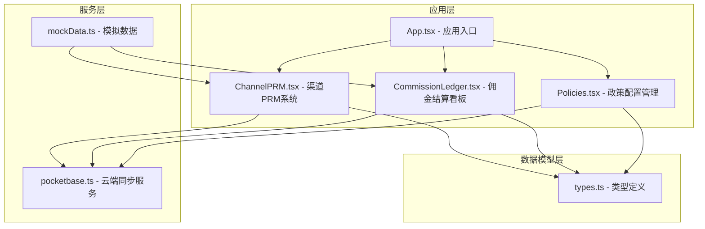
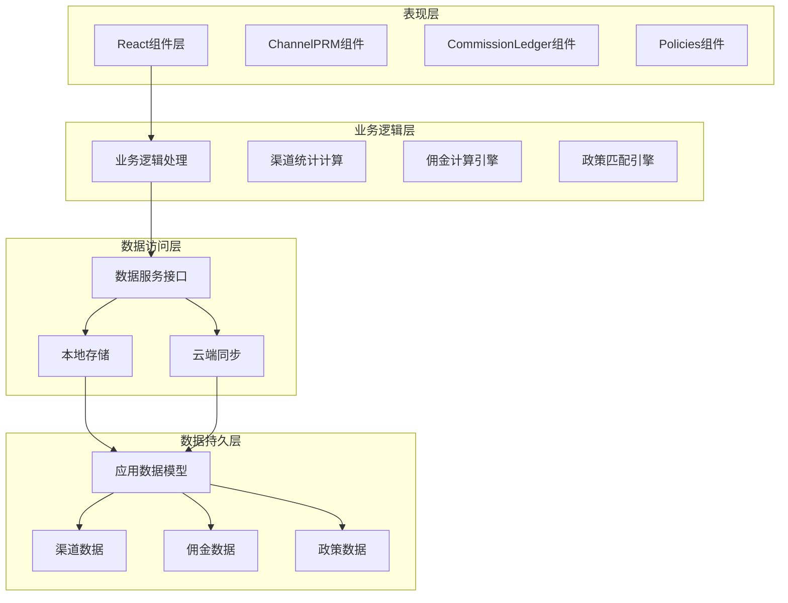
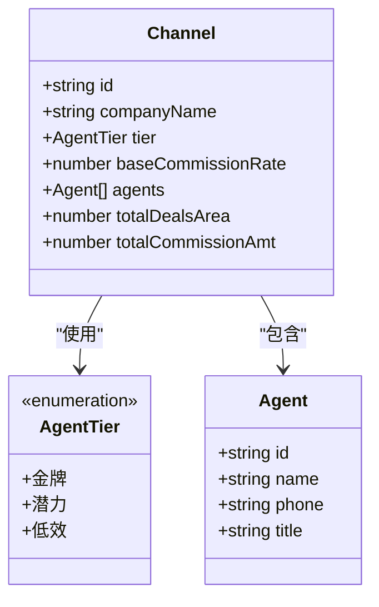
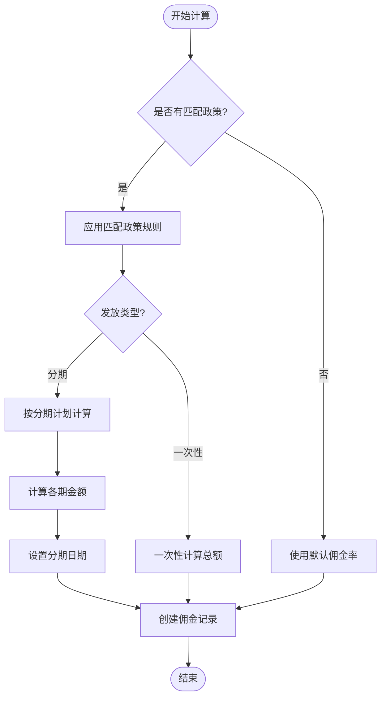
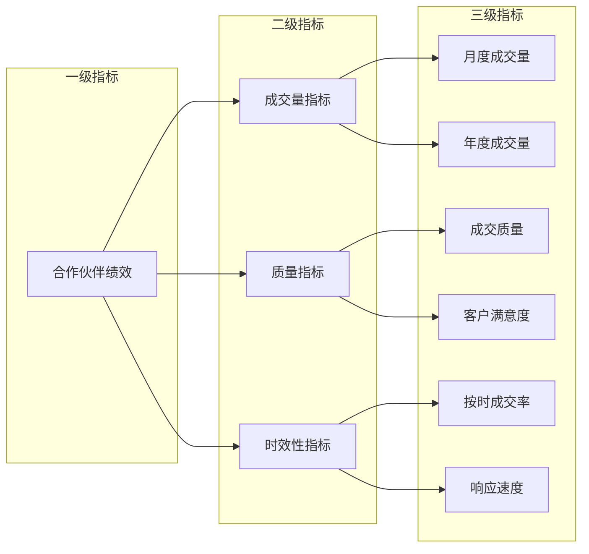
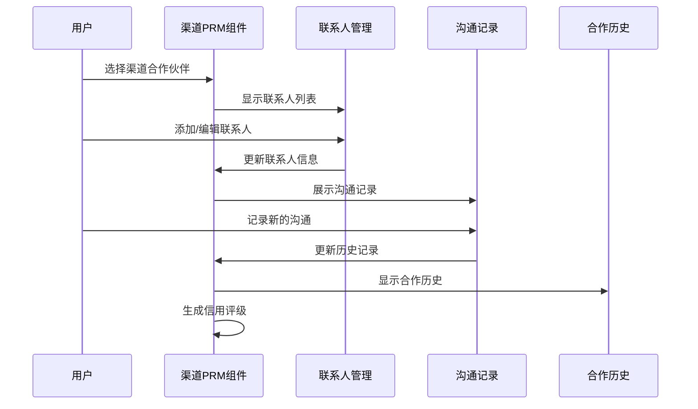
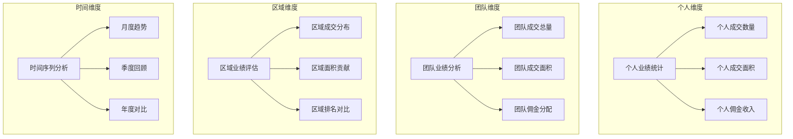
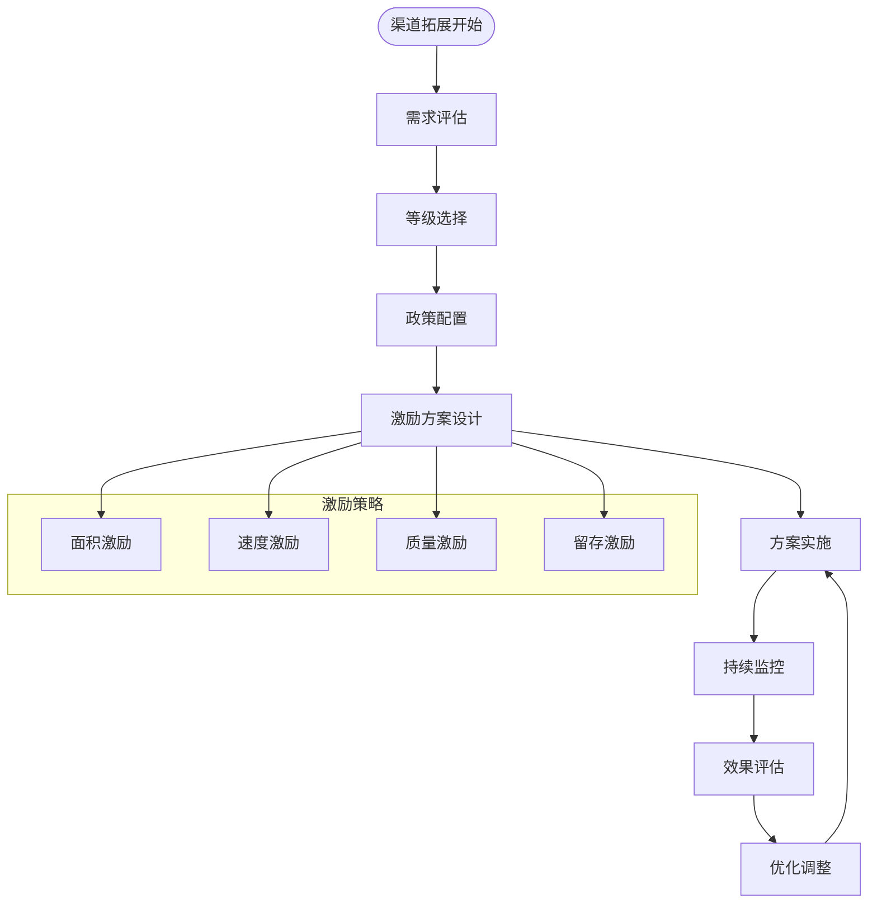
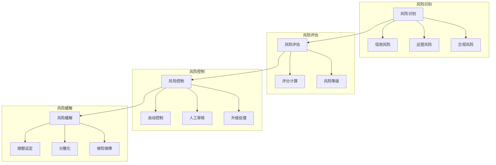
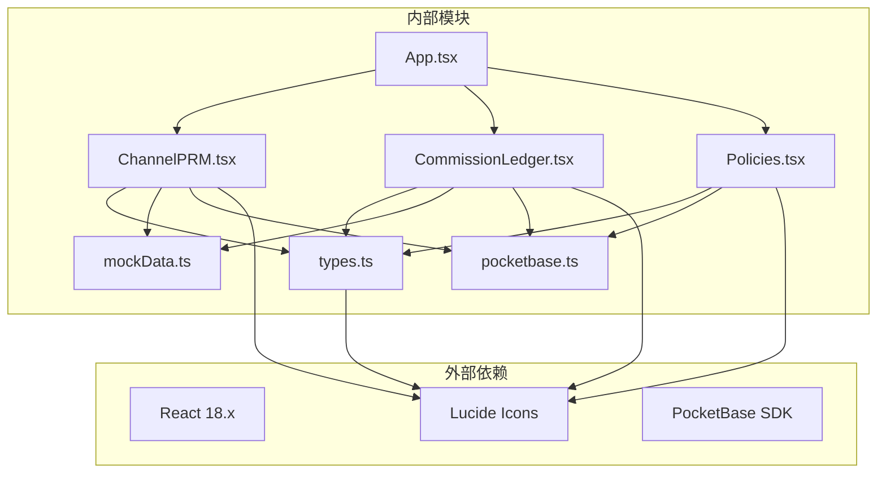

# 渠道管理模块

<cite>
**本文档引用的文件**
- [App.tsx](file://App.tsx)
- [ChannelPRM.tsx](file://components/ChannelPRM.tsx)
- [CommissionLedger.tsx](file://components/CommissionLedger.tsx)
- [Policies.tsx](file://components/Policies.tsx)
- [pocketbase.ts](file://services/pocketbase.ts)
- [types.ts](file://types.ts)
- [mockData.ts](file://services/mockData.ts)
</cite>

## 目录
1. [简介](#简介)
2. [项目结构](#项目结构)
3. [核心组件](#核心组件)
4. [架构概览](#架构概览)
5. [详细组件分析](#详细组件分析)
6. [依赖关系分析](#依赖关系分析)
7. [性能考虑](#性能考虑)
8. [故障排除指南](#故障排除指南)
9. [结论](#结论)

## 简介

渠道管理模块是上海商机及渠道管理系统的核心功能模块，专注于渠道合作伙伴关系管理。该模块提供了完整的渠道伙伴生命周期管理功能，包括合作伙伴信息维护、业绩统计分析、佣金结算管理和政策配置管理。

系统采用React + TypeScript技术栈构建，通过PocketBase实现云端数据同步和备份管理。模块支持多维度的渠道等级分类、灵活的佣金分配策略和全面的绩效评估体系。

## 项目结构

渠道管理模块主要由以下核心组件构成：

**图表来源**
- [App.tsx](file://App.tsx#L1-L588)
- [ChannelPRM.tsx](file://components/ChannelPRM.tsx#L1-L476)
- [CommissionLedger.tsx](file://components/CommissionLedger.tsx#L1-L201)
- [Policies.tsx](file://components/Policies.tsx#L1-L382)
- [pocketbase.ts](file://services/pocketbase.ts#L1-L226)

**章节来源**
- [App.tsx](file://App.tsx#L1-L588)
- [types.ts](file://types.ts#L1-L261)

## 核心组件

### 渠道伙伴关系管理 (ChannelPRM)

ChannelPRM组件是渠道管理模块的核心，提供完整的渠道伙伴关系管理功能：

- **合作伙伴档案管理**：支持新增、编辑、删除渠道合作伙伴信息
- **多维度业绩统计**：提供月度(MTD)、年度(YTD)业绩对比分析
- **智能排序机制**：基于最近成交、等级权重和面积贡献进行排序
- **权限控制**：区分普通用户和管理员的不同操作权限
- **联系人管理**：支持为每个渠道添加多个对接联系人

### 佣金结算看板 (CommissionLedger)

佣金结算看板专注于佣金结算流程的可视化管理：

- **待结佣金监控**：实时显示所有待支付的佣金节点
- **分期计划管理**：支持一次性发放和多次分期两种模式
- **财务状态跟踪**：从待确认到已结清的完整状态流转
- **到期提醒机制**：自动标识即将到期的支付节点

### 政策配置中心 (Policies)

政策配置中心提供灵活的佣金政策管理能力：

- **面积区间策略**：根据不同成交面积设置不同的佣金比例
- **时间窗口管理**：支持临时促销政策的时间限制
- **分期节奏定义**：精确控制佣金的分期发放时间和比例
- **变更审计日志**：完整记录所有政策变更的历史记录

**章节来源**
- [ChannelPRM.tsx](file://components/ChannelPRM.tsx#L21-L476)
- [CommissionLedger.tsx](file://components/CommissionLedger.tsx#L14-L201)
- [Policies.tsx](file://components/Policies.tsx#L14-L382)

## 架构概览

系统采用分层架构设计，确保各组件职责清晰、耦合度低：

**图表来源**
- [App.tsx](file://App.tsx#L17-L75)
- [pocketbase.ts](file://services/pocketbase.ts#L130-L225)

系统的核心特性包括：

1. **实时数据同步**：通过PocketBase实现云端与本地数据的双向同步
2. **智能合并算法**：采用深度合并策略处理并发冲突
3. **权限分离**：区分渠道伙伴和管理员的不同操作权限
4. **多维度统计**：支持个人、团队、区域等多层级的业绩分析

**章节来源**
- [App.tsx](file://App.tsx#L17-L75)
- [pocketbase.ts](file://services/pocketbase.ts#L130-L225)

## 详细组件分析

### 渠道等级分类体系

系统实现了三级渠道等级分类，每级都有明确的定义和管理策略：

**图表来源**
- [types.ts](file://types.ts#L41-L45)
- [types.ts](file://types.ts#L103-L114)
- [types.ts](file://types.ts#L90-L101)

等级分类的管理逻辑：

- **金牌合作伙伴**：享受最优佣金比例和优先资源支持
- **潜力合作伙伴**：提供成长指导和政策倾斜
- **低效合作伙伴**：实施整改计划和降级处理

**章节来源**
- [types.ts](file://types.ts#L41-L45)
- [ChannelPRM.tsx](file://components/ChannelPRM.tsx#L117-L126)

### 佣金分配策略引擎

系统采用灵活的佣金分配策略，支持多种计算模式：

**图表来源**
- [App.tsx](file://App.tsx#L377-L432)
- [types.ts](file://types.ts#L123-L134)

策略计算的关键要素：

- **面积区间匹配**：根据成交面积自动匹配最合适的政策
- **时间窗口验证**：确保政策在有效期内生效
- **分期节奏控制**：精确控制佣金的分期发放时间和比例

**章节来源**
- [App.tsx](file://App.tsx#L377-L432)
- [mockData.ts](file://services/mockData.ts#L49-L61)

### 绩效评估体系

系统建立了全面的绩效评估指标体系：

**图表来源**
- [ChannelPRM.tsx](file://components/ChannelPRM.tsx#L54-L98)

评估指标的具体实现：

- **成交量分析**：月度(MTD)和年度(YTD)成交面积对比
- **活跃度监测**：最近带看次数和成交频率
- **收益贡献**：累计佣金收入和区域贡献度
- **合规性检查**：合同签署完整性和财务状态

**章节来源**
- [ChannelPRM.tsx](file://components/ChannelPRM.tsx#L54-L98)

### 渠道关系维护工具

系统提供了完善的渠道关系维护工具集：

**图表来源**
- [ChannelPRM.tsx](file://components/ChannelPRM.tsx#L151-L172)
- [ChannelPRM.tsx](file://components/ChannelPRM.tsx#L364-L377)

工具功能包括：

- **联系人管理**：支持多联系人的添加、编辑和删除
- **沟通记录追踪**：完整记录每次沟通的时间、内容和结果
- **合作历史查询**：提供详细的过往合作记录和里程碑事件
- **信用评级系统**：基于历史表现和合作质量生成综合评级

**章节来源**
- [ChannelPRM.tsx](file://components/ChannelPRM.tsx#L151-L172)
- [ChannelPRM.tsx](file://components/ChannelPRM.tsx#L364-L377)

### 多维度业绩统计分析

系统提供多层次的业绩统计分析功能：

**图表来源**
- [ChannelPRM.tsx](file://components/ChannelPRM.tsx#L54-L98)

统计分析的核心功能：

- **实时数据更新**：所有统计数据随业务进展实时更新
- **多维度对比**：支持横向和纵向的多角度对比分析
- **趋势预测**：基于历史数据提供业绩趋势预测
- **异常检测**：自动识别异常波动和潜在风险

**章节来源**
- [ChannelPRM.tsx](file://components/ChannelPRM.tsx#L54-L98)

### 渠道拓展支持与激励政策

系统内置了完善的渠道拓展支持和激励政策机制：

**图表来源**
- [Policies.tsx](file://components/Policies.tsx#L14-L382)
- [mockData.ts](file://services/mockData.ts#L49-L61)

激励政策的设计原则：

- **差异化定价**：根据渠道等级和贡献度提供差异化佣金
- **阶梯式激励**：设置不同层次的奖励梯度
- **时间敏感性**：针对不同阶段设置相应的激励措施
- **风险控制**：平衡激励力度与风险承受能力

**章节来源**
- [Policies.tsx](file://components/Policies.tsx#L14-L382)
- [mockData.ts](file://services/mockData.ts#L49-L61)

### 风险控制机制

系统建立了多层次的风险控制机制：

**图表来源**
- [ChannelPRM.tsx](file://components/ChannelPRM.tsx#L54-L98)
- [types.ts](file://types.ts#L33-L39)

风险控制的具体措施：

- **信用额度管理**：根据历史表现设置合理的信用额度
- **交易限额控制**：对单笔和累计交易设置限额
- **异常交易监控**：实时监控异常交易行为
- **分级授权机制**：不同级别的交易需要不同级别的授权

**章节来源**
- [ChannelPRM.tsx](file://components/ChannelPRM.tsx#L54-L98)
- [types.ts](file://types.ts#L33-L39)

## 依赖关系分析

系统各组件之间的依赖关系如下：

**图表来源**
- [App.tsx](file://App.tsx#L1-L14)
- [ChannelPRM.tsx](file://components/ChannelPRM.tsx#L1-L5)
- [CommissionLedger.tsx](file://components/CommissionLedger.tsx#L1-L5)
- [Policies.tsx](file://components/Policies.tsx#L1-L5)

**章节来源**
- [App.tsx](file://App.tsx#L1-L14)
- [types.ts](file://types.ts#L1-L261)

## 性能考虑

系统在性能优化方面采用了多项策略：

1. **虚拟滚动**：对于大量数据的列表展示，采用虚拟滚动技术提升渲染性能
2. **懒加载**：非关键组件采用懒加载方式，减少初始加载时间
3. **缓存机制**：重要数据采用本地缓存，减少重复计算
4. **批量更新**：通过React的批量更新机制减少不必要的重渲染
5. **云端同步优化**：采用增量同步和冲突检测机制，避免全量数据传输

## 故障排除指南

### 常见问题及解决方案

**问题1：渠道数据无法同步**
- 检查PocketBase服务连接状态
- 验证云端数据格式是否正确
- 确认网络连接稳定性

**问题2：佣金计算异常**
- 检查政策配置的有效性
- 验证成交面积是否在政策范围内
- 确认时间窗口是否正确

**问题3：界面显示异常**
- 刷新页面清除缓存
- 检查浏览器兼容性
- 确认React版本兼容性

**章节来源**
- [pocketbase.ts](file://services/pocketbase.ts#L130-L225)

## 结论

渠道管理模块通过精心设计的架构和丰富的功能特性，为渠道合作伙伴关系管理提供了完整的解决方案。模块不仅满足了当前的业务需求，还具备良好的扩展性和维护性。

系统的主要优势包括：

1. **完整的功能覆盖**：从合作伙伴管理到佣金结算的全流程支持
2. **灵活的配置能力**：支持多样化的佣金政策和激励方案
3. **强大的数据分析**：提供多维度的业绩统计和趋势分析
4. **可靠的技术架构**：采用现代前端技术和云端同步机制
5. **完善的风控体系**：建立多层次的风险控制和监控机制

未来可以进一步优化的方向包括：增加移动端适配、引入AI辅助决策、扩展更多分析维度等。