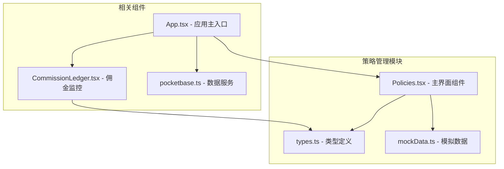
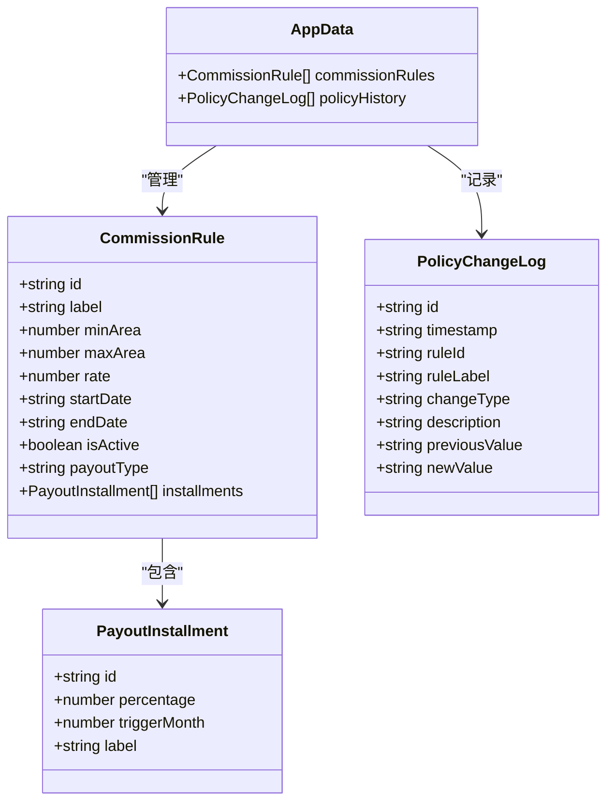
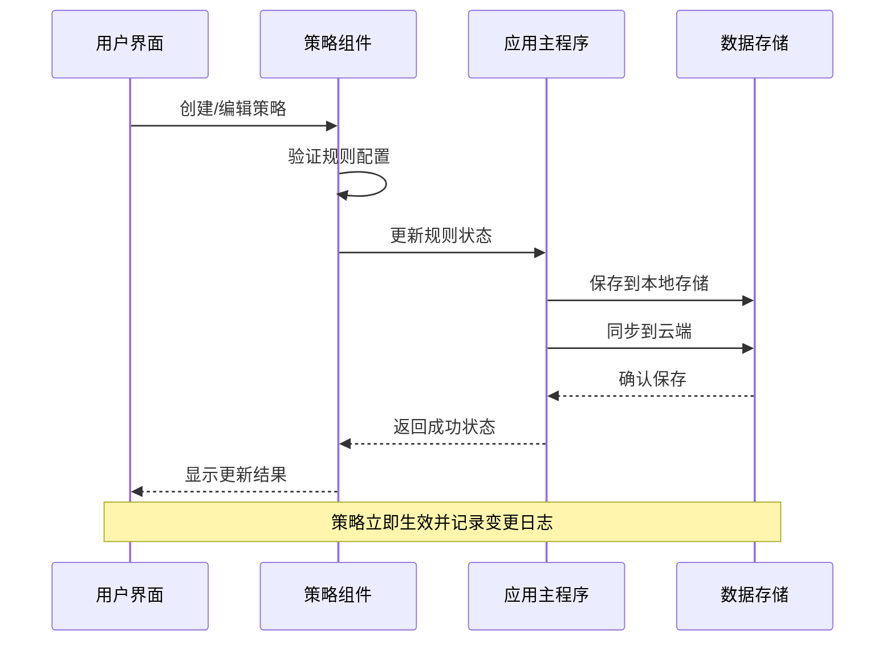
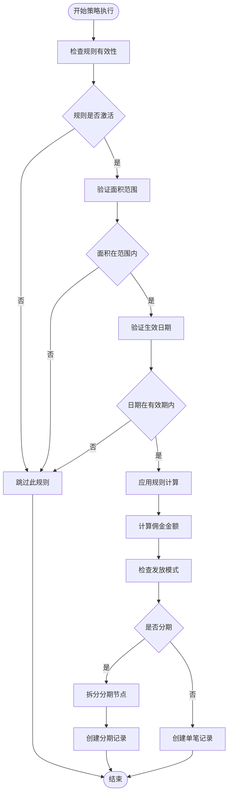
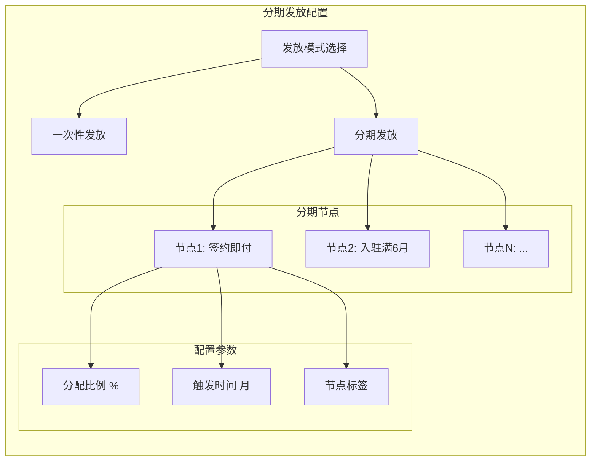
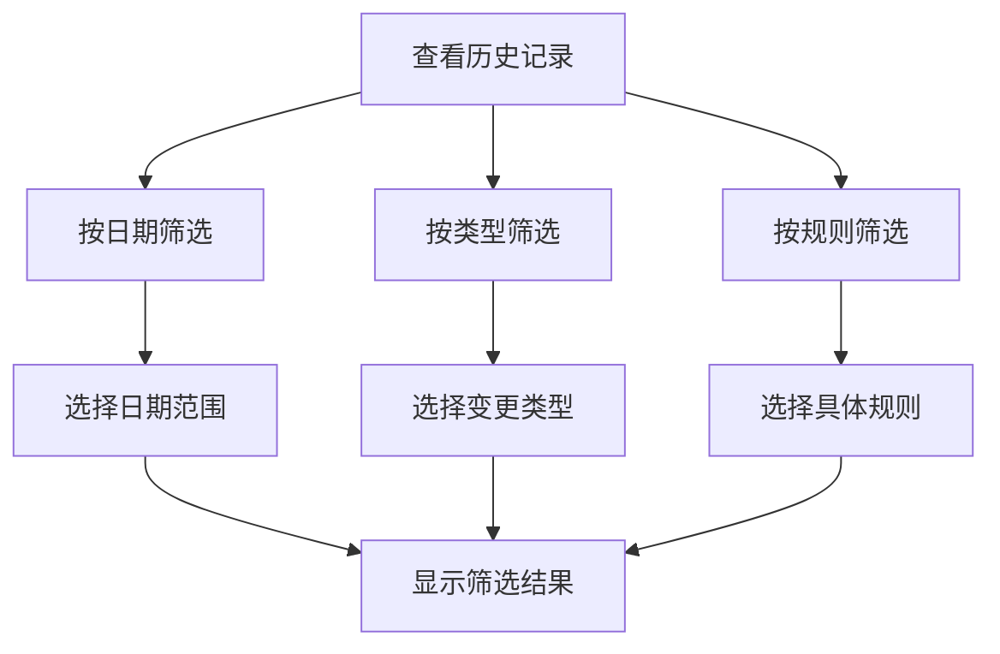
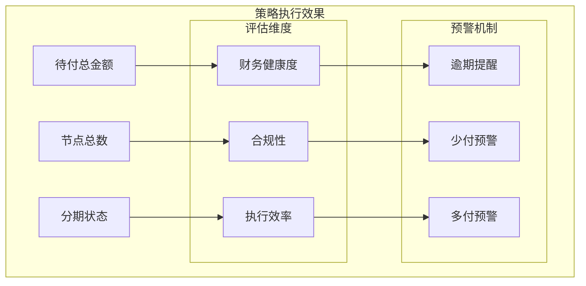
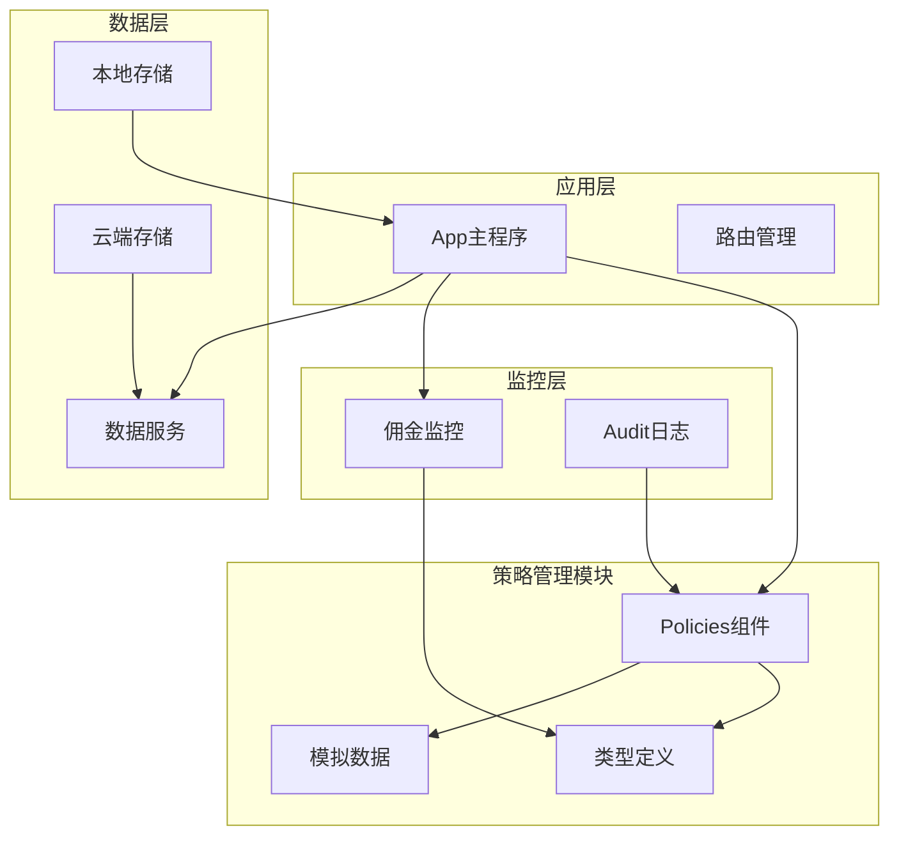
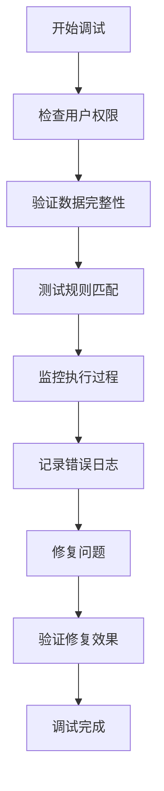

# 策略管理模块

<cite>
**本文档引用的文件**
- [Policies.tsx](file://components/Policies.tsx)
- [App.tsx](file://App.tsx)
- [types.ts](file://types.ts)
- [mockData.ts](file://services/mockData.ts)
- [CommissionLedger.tsx](file://components/CommissionLedger.tsx)
- [pocketbase.ts](file://services/pocketbase.ts)
</cite>

## 目录
1. [简介](#简介)
2. [项目结构](#项目结构)
3. [核心组件](#核心组件)
4. [架构概览](#架构概览)
5. [详细组件分析](#详细组件分析)
6. [依赖关系分析](#依赖关系分析)
7. [性能考虑](#性能考虑)
8. [故障排除指南](#故障排除指南)
9. [结论](#结论)

## 简介

策略管理模块是上海商机及渠道管理系统的核心功能之一，专门负责佣金规则配置、策略变更历史管理和规则生效机制。该模块提供了完整的策略生命周期管理能力，包括策略制定、配置、执行、监控和审计等功能。

系统采用React + TypeScript构建，通过分层架构实现了策略配置的可视化管理、实时生效控制和完整的审计追踪。模块支持多种佣金计算模式，包括一次性发放和分期发放两种主要类型，并提供了灵活的阶梯奖励标准配置。

## 项目结构

策略管理模块位于前端组件系统中，采用功能模块化组织方式：

**图表来源**
- [Policies.tsx](file://components/Policies.tsx#L1-L382)
- [App.tsx](file://App.tsx#L1-L588)

**章节来源**
- [Policies.tsx](file://components/Policies.tsx#L1-L382)
- [App.tsx](file://App.tsx#L1-L588)

## 核心组件

策略管理模块由多个核心组件构成，每个组件都有明确的职责分工：

### 主要组件架构

| 组件名称 | 职责描述 | 关键功能 |
|---------|----------|----------|
| Policies | 策略配置管理界面 | 规则编辑、历史查看、状态切换 |
| CommissionRule | 佣金规则数据模型 | 基础佣金率、阶梯奖励、生效时间 |
| PolicyChangeLog | 变更日志记录 | 审计追踪、版本对比、回滚支持 |
| PayoutInstallment | 分期发放节点 | 时间轴定义、比例分配 |

### 数据模型设计

**图表来源**
- [types.ts](file://types.ts#L116-L145)

**章节来源**
- [types.ts](file://types.ts#L116-L145)

## 架构概览

策略管理模块采用事件驱动的架构模式，通过状态管理和事件处理实现策略的实时生效和监控：

**图表来源**
- [Policies.tsx](file://components/Policies.tsx#L39-L70)
- [App.tsx](file://App.tsx#L328-L375)

### 策略执行流程

**图表来源**
- [App.tsx](file://App.tsx#L377-L432)

**章节来源**
- [App.tsx](file://App.tsx#L377-L432)

## 详细组件分析

### 策略配置界面组件

策略配置界面提供了直观的可视化操作环境，支持管理员进行策略的创建、编辑和删除操作：

#### 核心功能特性

| 功能类别 | 具体实现 | 用户体验 |
|---------|----------|----------|
| 规则创建 | 表单验证、默认值填充 | 一键创建新策略 |
| 规则编辑 | 实时预览、分步配置 | 灵活调整参数 |
| 状态管理 | 启用/禁用切换 | 即时生效控制 |
| 删除保护 | 确认对话框 | 防误操作 |

#### 分期发放配置

**图表来源**
- [Policies.tsx](file://components/Policies.tsx#L318-L362)

**章节来源**
- [Policies.tsx](file://components/Policies.tsx#L14-L128)

### 策略变更历史管理

策略变更历史模块提供了完整的审计追踪功能，确保所有策略调整都有据可查：

#### 历史记录结构

| 字段名称 | 数据类型 | 描述 | 示例 |
|---------|----------|------|------|
| id | string | 日志唯一标识 | LOG-1700000000000 |
| timestamp | string | 变更时间戳 | 2024-01-01T12:00:00Z |
| ruleId | string | 关联规则ID | R1 |
| ruleLabel | string | 规则显示名称 | 大面积激励 |
| changeType | enum | 变更类型 | CREATE/UPDATE/DELETE |
| description | string | 变更描述 | 创建新政策: 大面积激励 |
| previousValue | string | 旧值JSON | {"rate":1.0,"area":300} |
| newValue | string | 新值JSON | {"rate":1.2,"area":300} |

#### 历史查询功能

**图表来源**
- [Policies.tsx](file://components/Policies.tsx#L236-L257)

**章节来源**
- [Policies.tsx](file://components/Policies.tsx#L236-L257)

### 策略执行监控

佣金监控组件实时跟踪策略执行效果，提供可视化的执行状态展示：

#### 监控指标

| 指标类型 | 计算方式 | 展示形式 |
|---------|----------|----------|
| 待付总金额 | 所有未结佣金金额求和 | 大数字展示 |
| 待支付节点数 | 未结佣金记录数量 | 统计卡片 |
| 分期执行状态 | 自动拆分逻辑验证 | 状态指示器 |

#### 执行效果评估

**图表来源**
- [CommissionLedger.tsx](file://components/CommissionLedger.tsx#L32-L88)

**章节来源**
- [CommissionLedger.tsx](file://components/CommissionLedger.tsx#L1-L200)

## 依赖关系分析

策略管理模块与其他系统组件存在紧密的依赖关系：

**图表来源**
- [App.tsx](file://App.tsx#L1-L588)
- [pocketbase.ts](file://services/pocketbase.ts#L1-L274)

### 数据流依赖

策略管理模块的数据流遵循严格的依赖层次：

1. **类型定义层**：提供统一的数据结构规范
2. **组件层**：实现具体的业务逻辑和UI交互
3. **服务层**：处理数据持久化和外部集成
4. **监控层**：提供执行效果追踪和分析

**章节来源**
- [types.ts](file://types.ts#L1-L261)
- [pocketbase.ts](file://services/pocketbase.ts#L1-L274)

## 性能考虑

策略管理模块在设计时充分考虑了性能优化：

### 内存管理
- 使用React.memo优化组件渲染
- 采用useMemo缓存计算结果
- 避免不必要的状态更新

### 数据处理优化
- 分页加载历史记录
- 懒加载大型数据集
- 防抖处理高频操作

### 存储优化
- 本地缓存减少网络请求
- 增量同步避免全量传输
- 智能清理过期数据

## 故障排除指南

### 常见问题及解决方案

| 问题类型 | 症状描述 | 解决方案 |
|---------|----------|----------|
| 策略不生效 | 规则创建后无反应 | 检查isActive状态和生效日期 |
| 分期比例错误 | 提示"总比例必须等于100%" | 调整各节点比例使合计为100% |
| 历史记录缺失 | 变更日志不完整 | 检查权限设置和数据同步 |
| 执行延迟 | 策略更新后立即生效 | 等待3秒自动同步完成 |

### 调试工具

**章节来源**
- [Policies.tsx](file://components/Policies.tsx#L42-L49)

## 结论

策略管理模块通过精心设计的架构和完善的功能实现，为用户提供了一个强大而易用的佣金策略管理平台。模块具备以下核心优势：

1. **完整的生命周期管理**：从策略创建到执行监控的全流程覆盖
2. **灵活的配置选项**：支持多种佣金计算模式和阶梯奖励标准
3. **强大的审计功能**：完整的变更追踪和历史记录
4. **实时监控能力**：策略执行效果的可视化监控
5. **安全可靠的架构**：权限控制和数据安全保障

该模块不仅满足了当前的业务需求，还为未来的功能扩展奠定了坚实的基础。通过持续的优化和完善，策略管理模块将成为系统中不可或缺的重要组成部分。