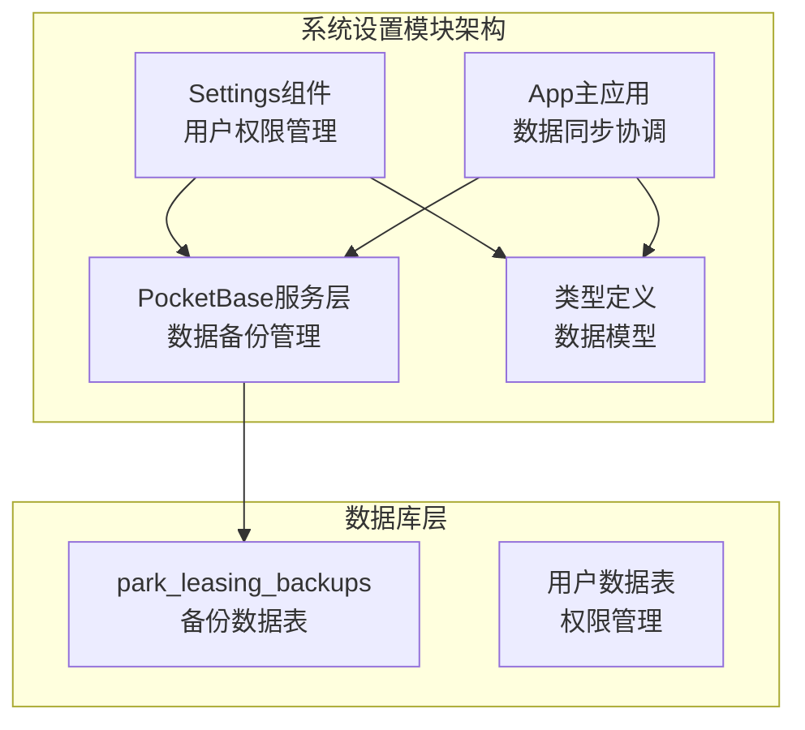
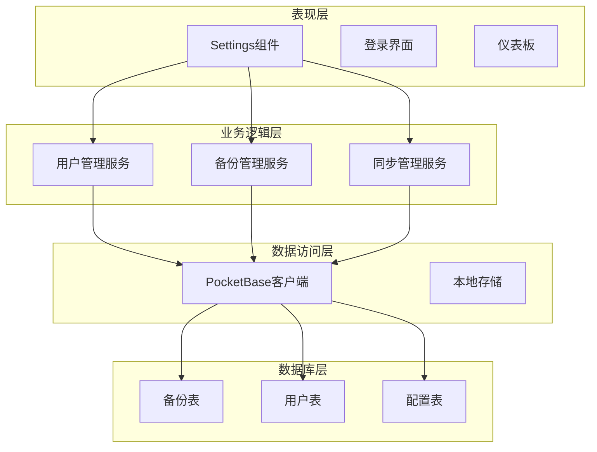
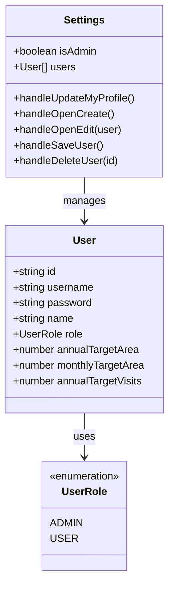
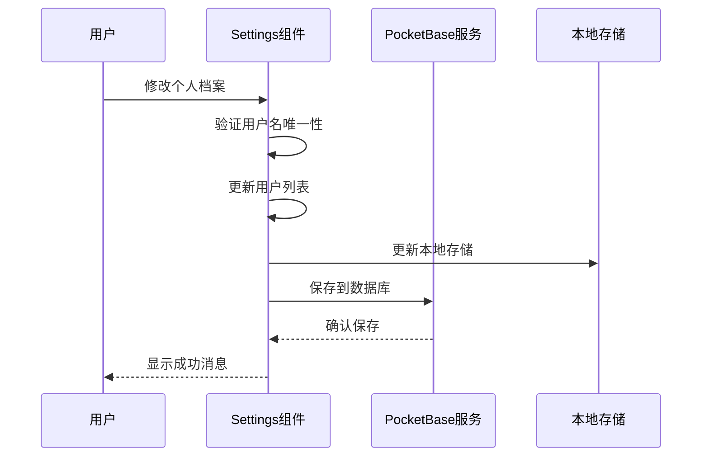
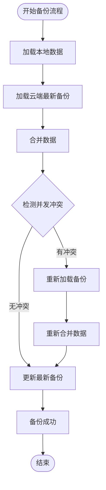
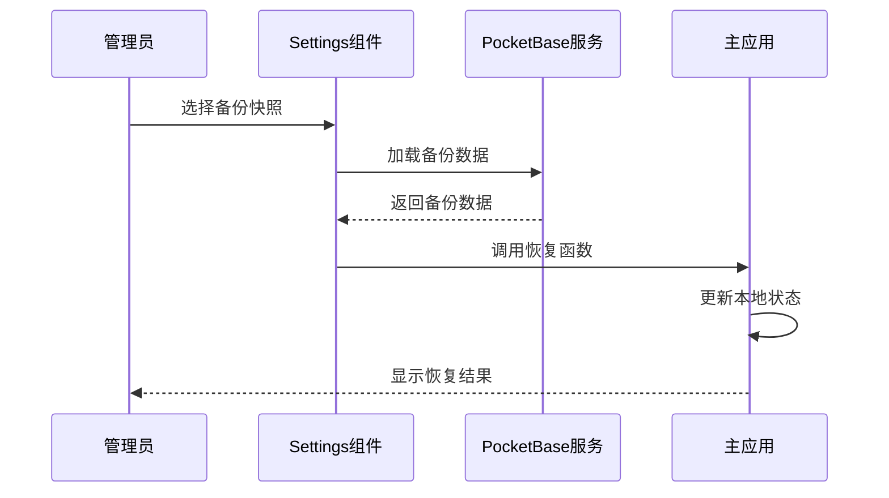
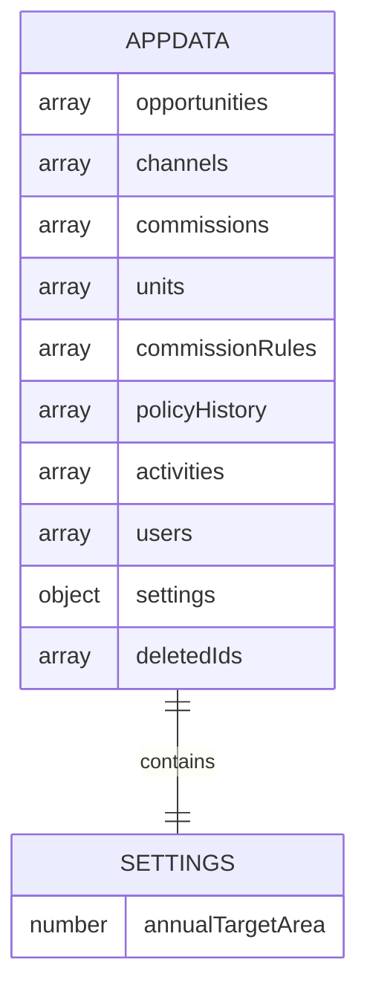
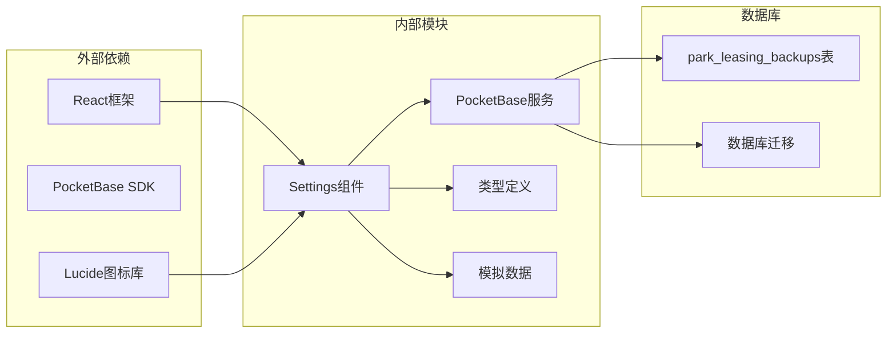

# 系统设置模块

<cite>
**本文档引用的文件**
- [components/Settings.tsx](file://components/Settings.tsx)
- [services/pocketbase.ts](file://services/pocketbase.ts)
- [App.tsx](file://App.tsx)
- [types.ts](file://types.ts)
- [pb_migrations/1770189507_created_park_leasing_backups.js](file://pb_migrations/1770189507_created_park_leasing_backups.js)
- [scripts/setup-pocketbase.sh](file://scripts/setup-pocketbase.sh)
- [MIGRATION_SUMMARY.md](file://MIGRATION_SUMMARY.md)
- [services/mockData.ts](file://services/mockData.ts)
</cite>

## 目录
1. [简介](#简介)
2. [项目结构](#项目结构)
3. [核心组件](#核心组件)
4. [架构概览](#架构概览)
5. [详细组件分析](#详细组件分析)
6. [依赖关系分析](#依赖关系分析)
7. [性能考虑](#性能考虑)
8. [故障排除指南](#故障排除指南)
9. [结论](#结论)

## 简介

系统设置模块是上海商机及渠道管理系统的核心管理功能，负责用户权限管理、系统配置维护和数据备份恢复。该模块提供了完整的用户账户管理、权限控制机制、数据备份策略和系统监控功能。

系统设置模块采用React组件架构，集成了PocketBase作为后端数据库，实现了云端数据同步、用户权限管理和系统配置维护的完整解决方案。

## 项目结构

系统设置模块主要由以下几个核心部分组成：

**图表来源**
- [components/Settings.tsx](file://components/Settings.tsx#L1-L291)
- [services/pocketbase.ts](file://services/pocketbase.ts#L1-L274)
- [App.tsx](file://App.tsx#L1-L588)

**章节来源**
- [components/Settings.tsx](file://components/Settings.tsx#L1-L291)
- [services/pocketbase.ts](file://services/pocketbase.ts#L1-L274)
- [App.tsx](file://App.tsx#L1-L588)

## 核心组件

系统设置模块包含以下核心组件和功能：

### 用户权限管理组件
- **用户档案管理**：个人资料修改、密码更新
- **用户账户管理**：管理员创建、编辑、删除用户账户
- **权限控制**：基于角色的访问控制机制
- **用户状态管理**：在线状态显示、权限标识

### 数据备份管理组件
- **备份快照管理**：查看、恢复历史备份
- **数据同步**：云端数据与本地数据的双向同步
- **备份策略**：自动更新最新备份而非创建新快照
- **冲突处理**：并发更新时的乐观锁机制

### 系统配置组件
- **业务参数配置**：年度目标面积设置
- **界面设置**：主题、布局配置
- **通知配置**：系统通知和提醒设置
- **系统监控**：健康检查和状态监控

**章节来源**
- [components/Settings.tsx](file://components/Settings.tsx#L17-L291)
- [types.ts](file://types.ts#L62-L76)

## 架构概览

系统设置模块采用分层架构设计，确保功能模块的清晰分离和良好的可维护性：

**图表来源**
- [components/Settings.tsx](file://components/Settings.tsx#L1-L291)
- [services/pocketbase.ts](file://services/pocketbase.ts#L1-L274)
- [App.tsx](file://App.tsx#L1-L588)

## 详细组件分析

### 用户权限管理组件

#### 角色定义和权限分配

系统采用基于枚举的角色模型，定义了两种基本用户角色：

**图表来源**
- [types.ts](file://types.ts#L62-L76)
- [components/Settings.tsx](file://components/Settings.tsx#L67-L76)

#### 访问控制机制

系统实现了多层次的访问控制机制：

1. **路由级权限控制**：根据用户角色显示不同功能
2. **功能级权限控制**：管理员才能访问用户管理功能
3. **数据级权限控制**：用户只能修改自己的档案
4. **操作级权限控制**：删除操作的条件限制

#### 用户档案管理流程

**图表来源**
- [components/Settings.tsx](file://components/Settings.tsx#L50-L81)
- [services/pocketbase.ts](file://services/pocketbase.ts#L178-L188)

**章节来源**
- [components/Settings.tsx](file://components/Settings.tsx#L17-L291)
- [types.ts](file://types.ts#L62-L76)

### 数据备份和恢复功能

#### 备份管理架构

系统实现了完整的备份管理功能，包括全量备份、增量备份和数据恢复：

**图表来源**
- [services/pocketbase.ts](file://services/pocketbase.ts#L328-L375)

#### 备份策略实现

系统采用了智能的备份策略：

1. **自动更新策略**：使用乐观锁机制防止并发冲突
2. **冲突检测**：通过HTTP 409状态码检测并发更新
3. **数据合并**：使用深度合并算法处理数据冲突
4. **版本控制**：通过时间戳实现版本管理

#### 数据恢复流程

**图表来源**
- [components/Settings.tsx](file://components/Settings.tsx#L225-L233)
- [App.tsx](file://App.tsx#L286-L298)

**章节来源**
- [services/pocketbase.ts](file://services/pocketbase.ts#L178-L273)
- [components/Settings.tsx](file://components/Settings.tsx#L220-L249)
- [App.tsx](file://App.tsx#L286-L326)

### 系统配置管理

#### 配置数据模型

系统配置采用扁平化的数据结构，便于管理和维护：

**图表来源**
- [types.ts](file://types.ts#L240-L253)

#### 配置参数说明

系统配置主要包括以下参数：

1. **业务参数**：年度目标面积（annualTargetArea）
2. **界面设置**：主题、布局、显示选项
3. **通知配置**：系统通知、提醒设置
4. **安全配置**：密码策略、会话管理

**章节来源**
- [types.ts](file://types.ts#L240-L253)
- [App.tsx](file://App.tsx#L236-L239)

## 依赖关系分析

系统设置模块的依赖关系体现了清晰的分层架构：

**图表来源**
- [components/Settings.tsx](file://components/Settings.tsx#L1-L10)
- [services/pocketbase.ts](file://services/pocketbase.ts#L1-L12)
- [types.ts](file://types.ts#L1-L10)

**章节来源**
- [components/Settings.tsx](file://components/Settings.tsx#L1-L10)
- [services/pocketbase.ts](file://services/pocketbase.ts#L1-L12)
- [types.ts](file://types.ts#L1-L10)

## 性能考虑

系统设置模块在设计时充分考虑了性能优化：

### 数据同步优化
- **防抖机制**：3秒防抖延迟避免频繁更新
- **增量更新**：只更新变化的数据而非全量同步
- **缓存策略**：本地存储减少重复加载

### 并发控制
- **乐观锁机制**：防止多个用户同时更新造成数据冲突
- **重试机制**：自动重试失败的操作
- **超时控制**：15秒超时防止长时间阻塞

### 内存管理
- **引用优化**：使用useRef避免不必要的重渲染
- **状态分离**：将用户状态与业务状态分离
- **数据压缩**：JSON数据存储优化

## 故障排除指南

### 常见问题及解决方案

#### 用户权限问题
1. **问题**：管理员无法看到用户管理功能
   - **原因**：用户角色未正确设置
   - **解决**：检查用户表中的role字段

2. **问题**：用户无法修改自己的档案
   - **原因**：权限验证失败
   - **解决**：确认当前用户的session状态

#### 备份恢复问题
1. **问题**：备份数据无法加载
   - **原因**：数据库连接失败或数据格式错误
   - **解决**：检查PocketBase服务状态和数据完整性

2. **问题**：并发更新冲突
   - **原因**：多个用户同时更新数据
   - **解决**：等待系统自动重试或手动重新加载

#### 系统配置问题
1. **问题**：配置参数不生效
   - **原因**：配置数据未正确保存
   - **解决**：检查配置表结构和数据格式

**章节来源**
- [services/pocketbase.ts](file://services/pocketbase.ts#L72-L87)
- [components/Settings.tsx](file://components/Settings.tsx#L114-L120)

## 结论

系统设置模块为上海商机及渠道管理系统提供了完整的权限管理、数据备份和系统配置功能。通过采用PocketBase作为后端数据库，实现了云端数据同步和本地数据管理的有机结合。

模块的主要优势包括：
- **完整的权限控制**：基于角色的细粒度权限管理
- **可靠的数据备份**：智能备份策略和冲突处理机制
- **灵活的配置管理**：支持多种系统参数的动态配置
- **良好的扩展性**：清晰的架构设计便于功能扩展

未来可以考虑的功能改进：
- 增加审计日志功能
- 实现更精细的权限控制
- 添加数据迁移工具
- 优化用户体验界面