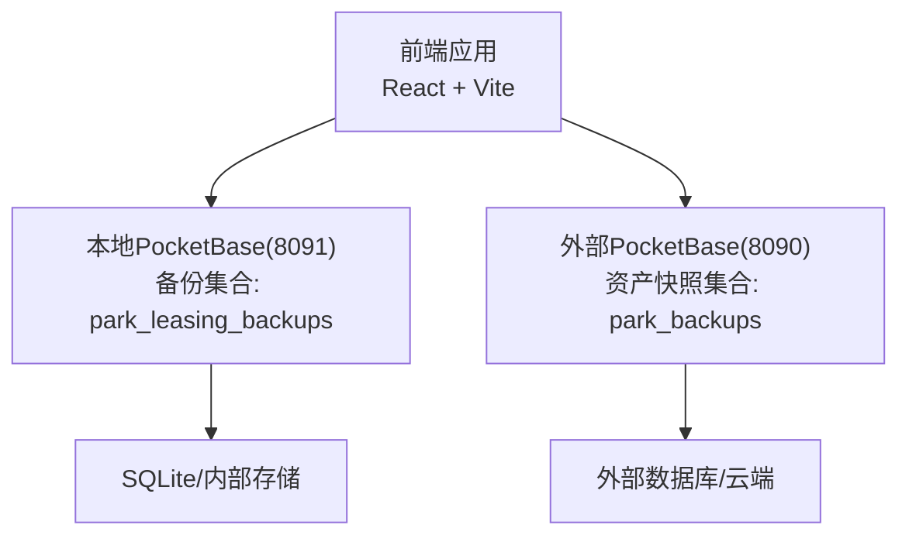
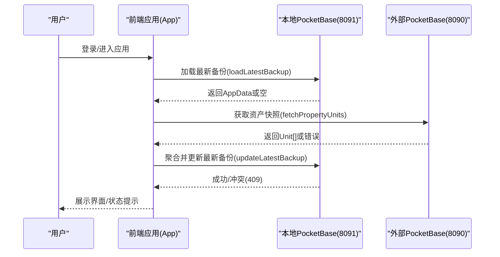
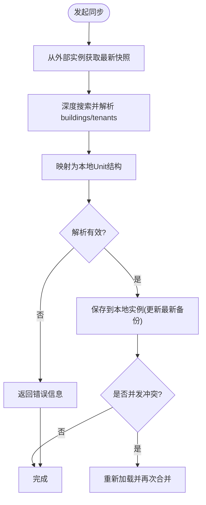
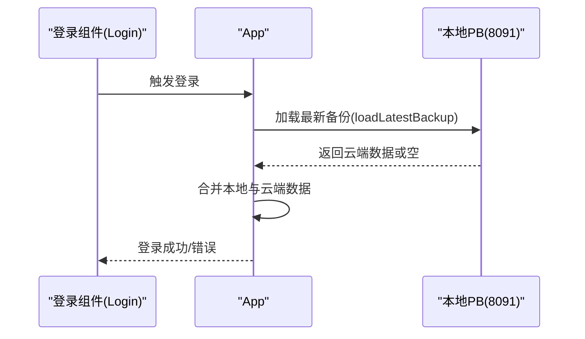
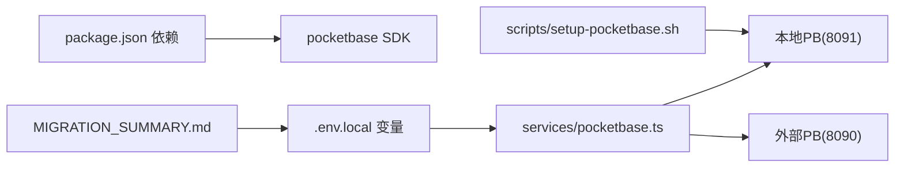

# 故障排查

<cite>
**本文引用的文件**
- [README.md](file://README.md)
- [package.json](file://package.json)
- [services/pocketbase.ts](file://services/pocketbase.ts)
- [components/Assets.tsx](file://components/Assets.tsx)
- [components/Opportunities.tsx](file://components/Opportunities.tsx)
- [App.tsx](file://App.tsx)
- [types.ts](file://types.ts)
- [scripts/setup-pocketbase.sh](file://scripts/setup-pocketbase.sh)
- [.env.local](file://.env.local)
- [MIGRATION_SUMMARY.md](file://MIGRATION_SUMMARY.md)
- [index.tsx](file://index.tsx)
- [pb_data/types.d.ts](file://pb_data/types.d.ts)
</cite>

## 目录
1. [简介](#简介)
2. [项目结构](#项目结构)
3. [核心组件](#核心组件)
4. [架构总览](#架构总览)
5. [详细组件分析](#详细组件分析)
6. [依赖关系分析](#依赖关系分析)
7. [性能考量](#性能考量)
8. [故障排查指南](#故障排查指南)
9. [结论](#结论)
10. [附录](#附录)

## 简介
本故障排查文档面向“上海商机及渠道管理系统（v5.0）”的技术支持与运维人员，聚焦于系统在本地开发与生产环境中的常见问题，涵盖 PocketBase 连接失败、数据同步异常、API 调用错误、前端加载问题等。文档提供日志分析方法、错误代码与状态码解读、调试技巧、网络/数据库/权限/性能问题排查流程、系统健康检查清单、关键指标监控与预警阈值、紧急修复流程与临时方案、长期改进措施，以及标准化问题处理流程与知识库建设指导。

## 项目结构
系统采用前端 React + Vite 开发，后端使用 PocketBase 作为本地备份与外部房源数据源。核心文件与职责如下：
- 前端入口与路由：index.tsx、App.tsx
- 业务模型与枚举：types.ts
- PocketBase 服务封装：services/pocketbase.ts
- 组件模块：components 下各功能模块（资产、商机、渠道、佣金、策略、设置、仪表盘、成交记录）
- 环境变量：.env.local
- PocketBase 初始化与配置脚本：scripts/setup-pocketbase.sh
- 迁移与部署说明：MIGRATION_SUMMARY.md
- 依赖与脚本：package.json

图表来源
- [services/pocketbase.ts](file://services/pocketbase.ts#L1-L226)
- [components/Assets.tsx](file://components/Assets.tsx#L1-L200)
- [App.tsx](file://App.tsx#L1-L620)
- [.env.local](file://.env.local#L1-L4)

章节来源
- [README.md](file://README.md#L1-L21)
- [package.json](file://package.json#L1-L28)
- [MIGRATION_SUMMARY.md](file://MIGRATION_SUMMARY.md#L1-L224)

## 核心组件
- 服务层（PocketBase 封装）
  - 本地备份读写与更新：保存、加载最新备份、列出备份、乐观锁冲突处理
  - 房源同步：从外部 PocketBase 获取资产快照并映射为本地 Unit 结构
- 应用层（App.tsx）
  - 登录前云端同步、自动/手动聚合保存、并发冲突重试、状态可视化
- 组件层（Assets.tsx、Opportunities.tsx 等）
  - 资产页面的云端连接态展示、错误提示、手动同步触发
- 类型与模型（types.ts）
  - AppData、Unit、Commission、Opportunity 等核心数据结构与状态枚举

章节来源
- [services/pocketbase.ts](file://services/pocketbase.ts#L1-L226)
- [App.tsx](file://App.tsx#L1-L620)
- [components/Assets.tsx](file://components/Assets.tsx#L1-L200)
- [types.ts](file://types.ts#L1-L261)

## 架构总览
系统采用“前端直连两套 PocketBase”的双实例架构：
- 本地实例（8091）：存放业务快照与本地备份
- 外部实例（8090）：提供资产快照数据源
- 前端通过 PocketBase SDK 进行 CRUD、列表查询与更新，配合乐观锁避免并发冲突

图表来源
- [services/pocketbase.ts](file://services/pocketbase.ts#L146-L179)
- [services/pocketbase.ts](file://services/pocketbase.ts#L50-L125)
- [App.tsx](file://App.tsx#L302-L378)
- [components/Assets.tsx](file://components/Assets.tsx#L109-L142)

## 详细组件分析

### 服务层：PocketBase 封装（services/pocketbase.ts）
- 关键能力
  - 从外部实例读取资产快照并映射为本地 Unit 列表
  - 本地备份的保存、加载、列出与更新（乐观锁）
  - 错误返回结构统一，便于前端展示
- 并发控制
  - 更新最新备份时若返回 409 或包含“conflict”，判定为并发冲突，触发重载+再合并
- 端口与 URL
  - 本地实例：POCKETBASE_URL，默认 8091
  - 外部实例：POCKETBASE_PROPERTY_URL，默认 8090
- 环境变量来源：.env.local

图表来源
- [services/pocketbase.ts](file://services/pocketbase.ts#L50-L125)
- [services/pocketbase.ts](file://services/pocketbase.ts#L146-L179)

章节来源
- [services/pocketbase.ts](file://services/pocketbase.ts#L1-L226)
- [.env.local](file://.env.local#L1-L4)

### 应用层：登录与云端同步（App.tsx）
- 登录流程
  - 登录前先拉取云端最新备份并合并本地数据
  - 支持“增量聚合/全量覆盖”两种模式
- 自动同步
  - 本地数据变化后 3 秒防抖，自动触发聚合保存
  - 支持静默模式避免 UI 闪烁
- 并发冲突
  - 若检测到冲突，自动重载并二次合并
- 状态可视化
  - 顶部云同步状态指示（聚合/保存/成功/错误）

图表来源
- [App.tsx](file://App.tsx#L77-L104)
- [App.tsx](file://App.tsx#L302-L329)

章节来源
- [App.tsx](file://App.tsx#L1-L620)

### 组件层：资产页面同步（components/Assets.tsx）
- 能力
  - 页面挂载时自动触发一次同步
  - 提供“立即同步主库”按钮
  - 显示云端连接态（连接中/已连接/断开）、实例标识、源表名与元数据
- 错误处理
  - 将错误信息透传到 UI，提示“云端数据格式已变更，解析引擎需手动适配”
- 环境变量
  - 外部实例地址显示常量来自服务层

章节来源
- [components/Assets.tsx](file://components/Assets.tsx#L1-L200)
- [services/pocketbase.ts](file://services/pocketbase.ts#L8-L12)

### 类型与数据模型（types.ts）
- 核心实体
  - AppData：包含商机、渠道、佣金、单位、政策、活动、用户、设置等
  - Unit：资产单元，含状态映射（待租/已租/预留/自用）
  - Commission、Opportunity 等
- 作用
  - 保证前后端数据结构一致，支撑合并与冲突处理

章节来源
- [types.ts](file://types.ts#L1-L261)

## 依赖关系分析
- 前端依赖
  - pocketbase SDK：用于与本地/外部 PocketBase 通信
  - react、react-dom：UI 框架
  - vite：开发与构建工具
- 环境变量
  - POCKETBASE_URL、POCKETBASE_PROPERTY_URL：决定 PocketBase 实例地址
- 迁移与脚本
  - setup-pocketbase.sh：引导创建集合与 API 规则
  - MIGRATION_SUMMARY.md：迁移状态、端口使用、测试清单

图表来源
- [package.json](file://package.json#L11-L16)
- [.env.local](file://.env.local#L2-L3)
- [services/pocketbase.ts](file://services/pocketbase.ts#L4-L10)
- [scripts/setup-pocketbase.sh](file://scripts/setup-pocketbase.sh#L1-L55)
- [MIGRATION_SUMMARY.md](file://MIGRATION_SUMMARY.md#L107-L111)

章节来源
- [package.json](file://package.json#L1-L28)
- [.env.local](file://.env.local#L1-L4)
- [MIGRATION_SUMMARY.md](file://MIGRATION_SUMMARY.md#L1-L224)

## 性能考量
- 房源同步策略：建议手动触发，避免频繁自动同步
- 备份策略：保持现有合并策略，减少冗余写入
- 本地缓存：可考虑对房源数据做短期缓存（5-10 分钟）
- 轮询间隔：建议不低于 30 秒
- 并发冲突：乐观锁与重试机制已内置，避免重复写入

章节来源
- [MIGRATION_SUMMARY.md](file://MIGRATION_SUMMARY.md#L201-L207)

## 故障排查指南

### 一、网络连接问题
- 症状
  - 资产页面显示“连接中断”或“握手交互”
  - 登录时无法加载云端备份
- 排查步骤
  1. 确认 PocketBase 服务端口
     - 本地实例：8091（备份集合 park_leasing_backups）
     - 外部实例：8090（资产快照集合 park_backups）
  2. 检查环境变量
     - POCKETBASE_URL、POCKETBASE_PROPERTY_URL 是否指向正确地址
  3. 检查 CORS
     - 如遇跨域，可在 PocketBase 管理后台设置“Allowed origins”包含前端地址
  4. 使用健康检查
     - 本地健康接口：curl http://127.0.0.1:8091/api/health
- 临时方案
  - 在 .env.local 中修正端口与地址
  - 通过脚本一键检查：./scripts/setup-pocketbase.sh
- 长期改进
  - 前端增加健康探针与重试退避
  - 增加网络异常提示与自动切换策略

章节来源
- [MIGRATION_SUMMARY.md](file://MIGRATION_SUMMARY.md#L82-L87)
- [scripts/setup-pocketbase.sh](file://scripts/setup-pocketbase.sh#L1-L55)
- [.env.local](file://.env.local#L2-L3)

### 二、数据库连接问题（PocketBase）
- 症状
  - 保存/加载备份时报错或返回空
  - 并发冲突（409）频繁出现
- 排查步骤
  1. 确认集合存在且字段正确
     - 集合：park_leasing_backups
     - 字段：name（Text，必填），data（JSON，必填）
  2. 确认 API 规则
     - 允许无认证访问（List/Search/View/Create/Update/Delete 均留空）
  3. 检查数据完整性
     - data 字段为合法 JSON
- 临时方案
  - 通过管理后台手动创建集合与字段
  - 使用脚本引导创建：./scripts/setup-pocketbase.sh
- 长期改进
  - 在应用启动时进行集合校验与自动初始化
  - 增加失败重试与降级策略

章节来源
- [MIGRATION_SUMMARY.md](file://MIGRATION_SUMMARY.md#L49-L81)
- [scripts/setup-pocketbase.sh](file://scripts/setup-pocketbase.sh#L21-L51)
- [services/pocketbase.ts](file://services/pocketbase.ts#L130-L140)

### 三、权限认证问题
- 症状
  - 无权限访问集合或记录
  - 登录后仍提示权限不足
- 排查步骤
  1. 确认 API 规则允许无认证访问
  2. 检查管理后台的管理员账号是否创建
  3. 检查前端是否正确使用 SDK 进行匿名访问
- 临时方案
  - 在管理后台设置 API 规则为“允许所有”
- 长期改进
  - 引入最小权限原则与鉴权中间件
  - 前端增加鉴权失败的统一提示与重试

章节来源
- [MIGRATION_SUMMARY.md](file://MIGRATION_SUMMARY.md#L61-L63)
- [scripts/setup-pocketbase.sh](file://scripts/setup-pocketbase.sh#L43-L48)

### 四、API 调用错误
- 常见错误与解读
  - 409 冲突：更新最新备份时发生并发冲突，系统会自动重试
  - 空数据/结构变更：外部快照结构变化导致解析失败，需调整解析逻辑
- 日志与错误码
  - 前端控制台输出：Cloud Sync Error、同步错误信息
  - 服务层返回统一错误对象，包含 error 字段
- 调试技巧
  - 打印请求与响应体（在开发环境下）
  - 使用浏览器开发者工具 Network 面板观察请求与状态码
  - 在服务层增加 try/catch 并记录上下文信息

章节来源
- [services/pocketbase.ts](file://services/pocketbase.ts#L171-L178)
- [services/pocketbase.ts](file://services/pocketbase.ts#L122-L124)
- [App.tsx](file://App.tsx#L371-L377)

### 五、前端加载问题
- 症状
  - 页面空白或白屏
  - 根节点未挂载
- 排查步骤
  1. 检查 index.html 中是否存在 id 为 root 的元素
  2. 检查 index.tsx 的根节点挂载逻辑
  3. 检查打包产物与静态资源路径
- 临时方案
  - 重启开发服务器
  - 清理缓存后重新构建
- 长期改进
  - 增加根节点缺失的友好提示
  - 增加构建产物校验与回退策略

章节来源
- [index.tsx](file://index.tsx#L1-L16)

### 六、数据同步异常
- 症状
  - 资产同步失败或未更新
  - 合并后数据丢失或重复
- 排查步骤
  1. 检查外部实例的 park_backups 集合是否存在有效快照
  2. 检查解析逻辑是否能正确提取 buildings/tenants
  3. 检查本地集合 park_leasing_backups 的数据结构
- 临时方案
  - 手动触发同步并查看错误提示
  - 降低同步频率，避免并发冲突
- 长期改进
  - 增加解析失败的告警与回滚
  - 对快照结构变更增加版本兼容层

章节来源
- [services/pocketbase.ts](file://services/pocketbase.ts#L50-L125)
- [components/Assets.tsx](file://components/Assets.tsx#L109-L142)

### 七、系统健康检查清单
- 端口与服务
  - 8090（外部）：curl http://127.0.0.1:8090/api/health
  - 8091（本地）：curl http://127.0.0.1:8091/api/health
- 集合与字段
  - park_backups（外部）：存在且包含有效快照
  - park_leasing_backups（本地）：存在且字段正确
- 权限规则
  - 允许无认证访问（List/Search/View/Create/Update/Delete）
- 前端
  - 登录页可加载云端备份
  - 资产页面可手动同步并显示连接态

章节来源
- [scripts/setup-pocketbase.sh](file://scripts/setup-pocketbase.sh#L12-L19)
- [MIGRATION_SUMMARY.md](file://MIGRATION_SUMMARY.md#L142-L156)

### 八、关键指标监控与预警阈值
- 指标建议
  - 同步成功率（近 N 次同步成功次数 / 总次数）
  - 并发冲突率（409 次数 / 更新总次数）
  - 同步耗时（从发起到完成的平均时长）
  - 房源解析命中率（解析有效单位数 / 请求单位数）
- 预警阈值
  - 同步成功率 < 95%
  - 并发冲突率 > 5%
  - 同步耗时 > 10 秒
  - 房源解析命中率 < 80%

章节来源
- [MIGRATION_SUMMARY.md](file://MIGRATION_SUMMARY.md#L201-L207)

### 九、紧急修复流程与临时方案
- 紧急修复流程
  1. 识别症状与错误码
  2. 快速定位服务端口与集合
  3. 临时绕过：关闭自动同步，改为手动同步
  4. 修复后回归测试
- 临时方案
  - 修正 .env.local 中的端口与地址
  - 通过脚本重新创建集合与字段
  - 降低同步频率与并发写入
- 长期改进
  - 增加健康探针与自动恢复
  - 增加失败重试与熔断机制
  - 增加版本兼容与灰度发布

章节来源
- [scripts/setup-pocketbase.sh](file://scripts/setup-pocketbase.sh#L1-L55)
- [services/pocketbase.ts](file://services/pocketbase.ts#L146-L179)

### 十、标准化问题处理流程与知识库建设
- 标准化流程
  - 问题登记 → 快速定位 → 临时方案 → 修复验证 → 归档总结
- 知识库建设
  - 按“症状-原因-处理-预防”四段式记录
  - 增加常见场景的自动化脚本与检查清单
  - 建立版本兼容与迁移文档

章节来源
- [MIGRATION_SUMMARY.md](file://MIGRATION_SUMMARY.md#L1-L224)

## 结论
本系统通过双实例 PocketBase 实现了本地备份与外部资产数据的解耦，具备良好的可维护性与扩展性。针对常见问题，建议从网络连通性、集合与字段、权限规则、并发冲突与前端加载五个维度入手排查，并结合健康检查与指标监控建立长效保障机制。通过标准化流程与知识库建设，可显著提升问题响应效率与系统稳定性。

## 附录

### A. 端口与集合对照
- 8090：外部 PocketBase（资产快照集合：park_backups）
- 8091：本地 PocketBase（备份集合：park_leasing_backups）

章节来源
- [MIGRATION_SUMMARY.md](file://MIGRATION_SUMMARY.md#L107-L111)

### B. 解析与映射参考
- 外部快照字段映射为本地 Unit，包含 id、building、floor、roomNo、area、status、tenantName、price、vacantSince 等
- 状态映射规则：occupied/vacant/reserved/self_use

章节来源
- [services/pocketbase.ts](file://services/pocketbase.ts#L21-L28)
- [services/pocketbase.ts](file://services/pocketbase.ts#L91-L101)

### C. 类型定义参考
- AppData、Unit、Commission、Opportunity 等核心类型定义
- 用于前后端数据一致性校验与错误定位

章节来源
- [types.ts](file://types.ts#L240-L261)
- [pb_data/types.d.ts](file://pb_data/types.d.ts#L1-L800)