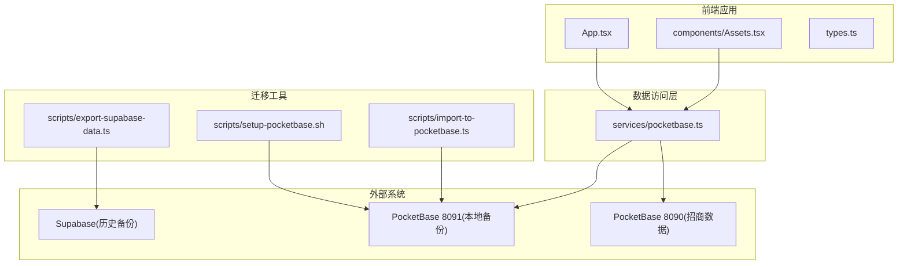
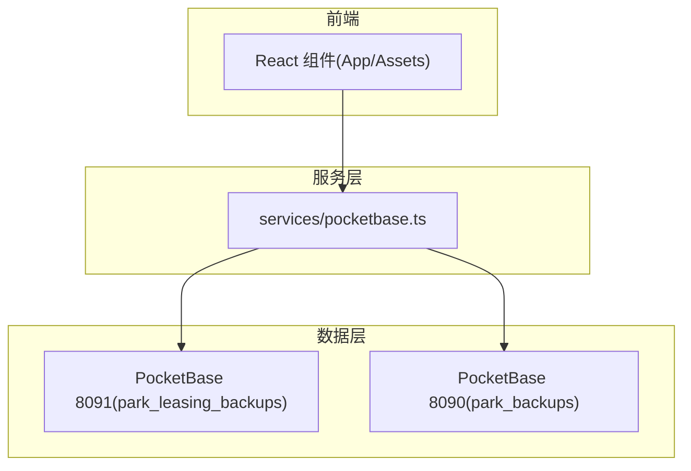
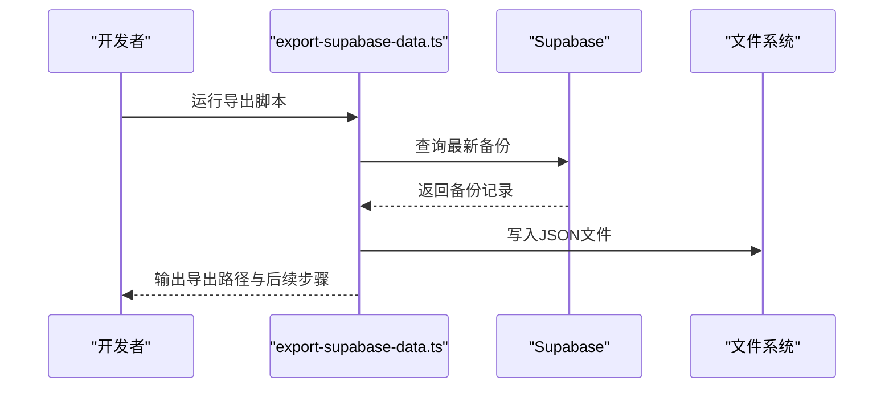
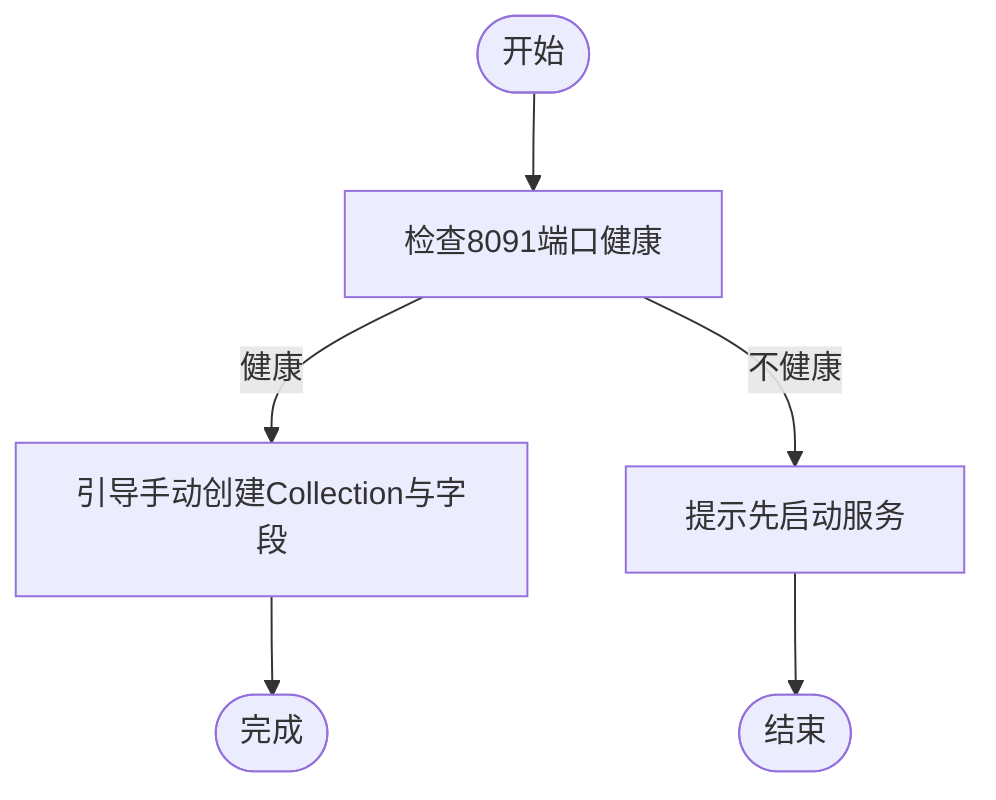
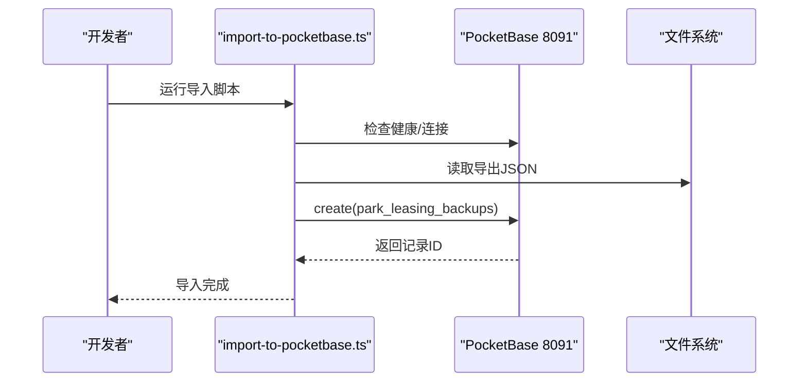
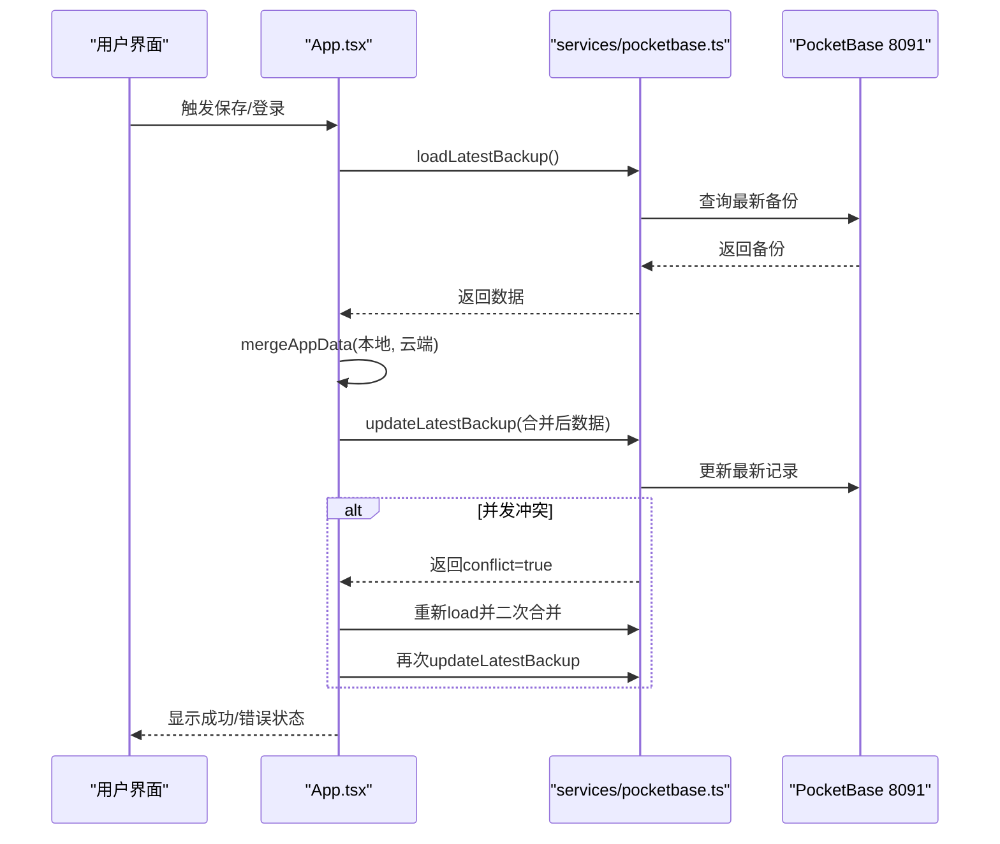
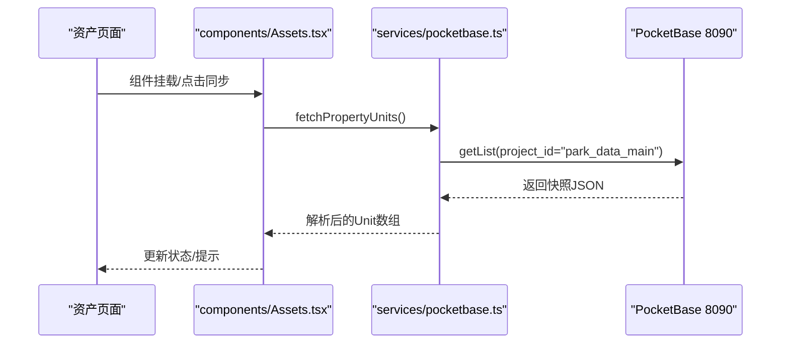
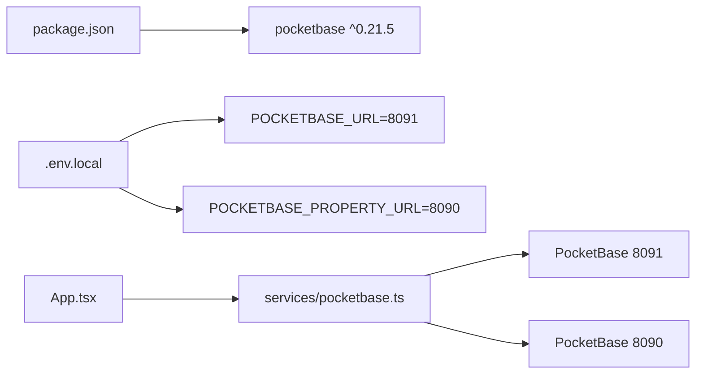

# 数据迁移

<cite>
**本文引用的文件**
- [scripts/export-supabase-data.ts](file://scripts/export-supabase-data.ts)
- [scripts/setup-pocketbase.sh](file://scripts/setup-pocketbase.sh)
- [scripts/import-to-pocketbase.ts](file://scripts/import-to-pocketbase.ts)
- [services/pocketbase.ts](file://services/pocketbase.ts)
- [App.tsx](file://App.tsx)
- [components/Assets.tsx](file://components/Assets.tsx)
- [types.ts](file://types.ts)
- [MIGRATION_SUMMARY.md](file://MIGRATION_SUMMARY.md)
- [package.json](file://package.json)
- [.env.local](file://.env.local)
</cite>

## 目录
1. [简介](#简介)
2. [项目结构](#项目结构)
3. [核心组件](#核心组件)
4. [架构总览](#架构总览)
5. [详细组件分析](#详细组件分析)
6. [依赖关系分析](#依赖关系分析)
7. [性能考量](#性能考量)
8. [故障排查指南](#故障排查指南)
9. [结论](#结论)
10. [附录](#附录)

## 简介
本文件面向数据管理员与运维人员，提供从 Supabase 到 PocketBase 的完整数据迁移与治理指导。内容涵盖：
- 数据导出脚本使用与数据格式转换
- 数据完整性验证与迁移前后校验
- 迁移脚本执行顺序、版本控制与回滚策略
- 备份与恢复（全量/增量）、灾难恢复
- 数据同步机制、冲突解决与一致性保证
- 迁移前清理、迁移过程校验与迁移后验证
- 数据治理与版本管理最佳实践

## 项目结构
项目采用前端 React/Vite + PocketBase 的本地化架构，迁移相关的关键位置如下：
- 迁移工具与脚本：scripts/
- 数据访问层：services/pocketbase.ts
- 应用入口与数据合并：App.tsx
- 资产页面与房源同步：components/Assets.tsx
- 类型定义：types.ts
- 迁移摘要与指引：MIGRATION_SUMMARY.md
- 依赖与环境变量：package.json、.env.local



图表来源
- [App.tsx](file://App.tsx#L1-L620)
- [components/Assets.tsx](file://components/Assets.tsx#L1-L368)
- [services/pocketbase.ts](file://services/pocketbase.ts#L1-L226)
- [scripts/export-supabase-data.ts](file://scripts/export-supabase-data.ts#L1-L70)
- [scripts/import-to-pocketbase.ts](file://scripts/import-to-pocketbase.ts#L1-L40)
- [scripts/setup-pocketbase.sh](file://scripts/setup-pocketbase.sh#L1-L55)

章节来源
- [MIGRATION_SUMMARY.md](file://MIGRATION_SUMMARY.md#L1-L224)
- [package.json](file://package.json#L1-L28)
- [.env.local](file://.env.local#L1-L4)

## 核心组件
- 数据导出脚本：从 Supabase 最新备份导出 JSON，供迁移或离线备份使用。
- PocketBase 初始化脚本：引导手动创建 Collection 及 API 规则。
- 数据导入脚本：将导出的 JSON 导入到本地 PocketBase。
- 数据访问层：封装对本地与招商数据源的读写、同步与合并。
- 应用层：负责自动/手动聚合保存、冲突检测与回滚、UI 展示与状态反馈。
- 类型定义：统一 AppData 结构与状态枚举，确保迁移前后数据模型一致。

章节来源
- [scripts/export-supabase-data.ts](file://scripts/export-supabase-data.ts#L1-L70)
- [scripts/setup-pocketbase.sh](file://scripts/setup-pocketbase.sh#L1-L55)
- [scripts/import-to-pocketbase.ts](file://scripts/import-to-pocketbase.ts#L1-L40)
- [services/pocketbase.ts](file://services/pocketbase.ts#L1-L226)
- [App.tsx](file://App.tsx#L1-L620)
- [types.ts](file://types.ts#L240-L261)

## 架构总览
迁移后系统由三部分组成：
- 本地备份：PocketBase 8091，存放业务快照与本地数据。
- 招商数据源：PocketBase 8090，提供房源快照与状态。
- 前端应用：通过服务层读写本地备份，按需从招商数据源拉取并映射为本地 Unit 类型。



图表来源
- [services/pocketbase.ts](file://services/pocketbase.ts#L1-L226)
- [App.tsx](file://App.tsx#L1-L620)
- [components/Assets.tsx](file://components/Assets.tsx#L1-L368)

## 详细组件分析

### 数据导出脚本（Supabase → 本地 JSON）
- 功能：连接 Supabase，查询最新备份记录，输出 JSON 文件，包含名称、数据与创建时间。
- 输出：supabase-backup-export.json
- 用途：迁移或离线备份，配合导入脚本或手动导入。



图表来源
- [scripts/export-supabase-data.ts](file://scripts/export-supabase-data.ts#L20-L67)

章节来源
- [scripts/export-supabase-data.ts](file://scripts/export-supabase-data.ts#L1-L70)

### PocketBase 初始化脚本（Collection 与 API 规则）
- 功能：检查服务健康，引导手动创建 Collection park_leasing_backups，字段 name(text)、data(json)，并设置 API 规则允许无认证访问。
- 适用：首次部署或重装环境时使用。



图表来源
- [scripts/setup-pocketbase.sh](file://scripts/setup-pocketbase.sh#L12-L17)
- [scripts/setup-pocketbase.sh](file://scripts/setup-pocketbase.sh#L21-L54)

章节来源
- [scripts/setup-pocketbase.sh](file://scripts/setup-pocketbase.sh#L1-L55)

### 数据导入脚本（本地 JSON → PocketBase）
- 功能：连接本地 PocketBase，读取导出的 JSON，创建备份记录。
- 注意：需先完成 Collection 初始化与 API 规则配置。



图表来源
- [scripts/import-to-pocketbase.ts](file://scripts/import-to-pocketbase.ts#L13-L40)

章节来源
- [scripts/import-to-pocketbase.ts](file://scripts/import-to-pocketbase.ts#L1-L40)

### 数据访问层（服务封装）
- 本地备份读写：保存、加载最新备份、列出历史备份。
- 招商数据同步：从 8090 端口获取快照，深度解析 JSON，建立租客映射，生成本地 Unit 列表。
- 冲突处理：自动更新最新备份时检测并发冲突，必要时重试合并。

```mermaid
classDiagram
class PocketBaseService {
+fetchPropertyUnits() SyncResponse
+saveBackup(name, data) void
+updateLatestBackup(data) Promise~{success, conflict?}~
+loadLatestBackup() Promise~{name,data,created} | null~
+getAllBackups() Promise~[{id,name,created}]~
}
class AppData {
+opportunities : Opportunity[]
+channels : Channel[]
+commissions : Commission[]
+units : Unit[]
+commissionRules : CommissionRule[]
+policyHistory : PolicyChangeLog[]
+activities : Activity[]
+users : User[]
+settings : object
+deletedIds : string[]
}
PocketBaseService --> AppData : "读写/同步"
```

图表来源
- [services/pocketbase.ts](file://services/pocketbase.ts#L14-L226)
- [types.ts](file://types.ts#L240-L261)

章节来源
- [services/pocketbase.ts](file://services/pocketbase.ts#L1-L226)
- [types.ts](file://types.ts#L240-L261)

### 应用层（自动/手动聚合保存与冲突处理）
- 自动保存：数据变化后 3 秒防抖，合并本地与云端最新快照，调用更新最新备份接口。
- 手动保存：弹窗输入快照名称，执行聚合保存。
- 冲突检测：若返回并发冲突，重新加载并再次合并，确保一致性。
- 登录前同步：登录时可选择全量恢复或增量聚合。



图表来源
- [App.tsx](file://App.tsx#L302-L378)
- [App.tsx](file://App.tsx#L331-L378)
- [services/pocketbase.ts](file://services/pocketbase.ts#L146-L179)

章节来源
- [App.tsx](file://App.tsx#L302-L378)
- [services/pocketbase.ts](file://services/pocketbase.ts#L146-L179)

### 资产页面（从招商数据源同步）
- 自动/手动触发：组件挂载时自动同步一次；管理员可点击立即同步。
- 错误处理：解析失败时显示错误提示，保护本地数据不被重置。
- 元数据展示：显示连接状态、实例ID、源表名与快照时间。



图表来源
- [components/Assets.tsx](file://components/Assets.tsx#L109-L142)
- [services/pocketbase.ts](file://services/pocketbase.ts#L50-L125)

章节来源
- [components/Assets.tsx](file://components/Assets.tsx#L1-L368)
- [services/pocketbase.ts](file://services/pocketbase.ts#L50-L125)

## 依赖关系分析
- 依赖管理：移除了 @supabase/supabase-js，新增 pocketbase ^0.21.5。
- 环境变量：POCKETBASE_URL 指向本地备份实例，POCKETBASE_PROPERTY_URL 指向招商数据源。
- 端口分工：前端 3000，本地备份 8091，招商数据 8090。



图表来源
- [package.json](file://package.json#L11-L17)
- [.env.local](file://.env.local#L2-L3)
- [App.tsx](file://App.tsx#L14-L14)
- [services/pocketbase.ts](file://services/pocketbase.ts#L4-L12)

章节来源
- [package.json](file://package.json#L1-L28)
- [.env.local](file://.env.local#L1-L4)
- [MIGRATION_SUMMARY.md](file://MIGRATION_SUMMARY.md#L107-L111)

## 性能考量
- 房源同步策略：建议手动触发，避免频繁自动同步。
- 备份策略：保持现有合并策略，减少冗余快照。
- 本地缓存：可考虑为房源数据添加短期缓存（5-10 分钟）。
- 轮询间隔：建议不短于 30 秒，降低请求压力。

章节来源
- [MIGRATION_SUMMARY.md](file://MIGRATION_SUMMARY.md#L201-L207)

## 故障排查指南
- 无法连接本地备份（8091）：确认服务已启动且端口可用；检查 API 规则是否允许访问。
- 无法连接招商数据源（8090）：确认目标实例运行正常；检查网络与防火墙。
- 导入失败：确认已执行 Collection 初始化与 API 规则配置；检查导出文件是否存在。
- 并发冲突：自动更新时若出现冲突，系统会自动重试合并；如仍失败，检查网络波动与并发写入。
- 登录/同步异常：查看前端状态栏提示；必要时关闭自动同步，手动聚合保存。

章节来源
- [scripts/setup-pocketbase.sh](file://scripts/setup-pocketbase.sh#L12-L17)
- [scripts/import-to-pocketbase.ts](file://scripts/import-to-pocketbase.ts#L17-L22)
- [services/pocketbase.ts](file://services/pocketbase.ts#L171-L178)
- [App.tsx](file://App.tsx#L528-L534)

## 结论
本次迁移以脚本化与手动配置相结合的方式，完成了从 Supabase 到 PocketBase 的平滑过渡。通过服务层抽象与应用层的自动/手动聚合保存机制，系统实现了数据一致性、冲突处理与可观测的状态反馈。建议在生产环境中结合本文的备份与恢复策略，持续完善数据治理与版本管理。

## 附录

### A. 数据迁移流程与执行顺序
- 步骤 1：启动招商数据源（8090）与本地备份（8091）
- 步骤 2：执行初始化脚本，手动创建 Collection 与字段，配置 API 规则
- 步骤 3：可选：使用导出脚本获取 Supabase 最新备份，再导入到 8091
- 步骤 4：启动前端应用，登录后选择全量恢复或增量聚合
- 步骤 5：日常运营中，通过自动/手动保存维持本地快照

章节来源
- [MIGRATION_SUMMARY.md](file://MIGRATION_SUMMARY.md#L90-L111)
- [scripts/setup-pocketbase.sh](file://scripts/setup-pocketbase.sh#L66-L68)
- [scripts/export-supabase-data.ts](file://scripts/export-supabase-data.ts#L74-L80)

### B. 版本控制与回滚策略
- 版本控制：通过本地快照记录每次聚合保存的名称与时间，形成可追溯的历史。
- 回滚策略：如需回退 Supabase，停止本地服务，恢复旧版服务文件与依赖，回退应用代码，即可切换回 Supabase。

章节来源
- [MIGRATION_SUMMARY.md](file://MIGRATION_SUMMARY.md#L179-L190)

### C. 备份与恢复（全量/增量/灾难恢复）
- 全量备份：手动保存快照，记录名称与时间，作为全量恢复依据。
- 增量聚合：登录时选择增量聚合，自动合并本地与云端差异。
- 灾难恢复：从最近一次成功快照恢复；若无可用快照，可从 Supabase 导出脚本恢复。

章节来源
- [App.tsx](file://App.tsx#L302-L329)
- [App.tsx](file://App.tsx#L331-L378)
- [scripts/export-supabase-data.ts](file://scripts/export-supabase-data.ts#L44-L52)

### D. 数据同步机制、冲突解决与一致性保证
- 同步机制：资产页面与应用层分别从 8090 与 8091 拉取数据；应用层统一合并策略。
- 冲突解决：自动更新最新备份时检测并发冲突，自动重试合并。
- 一致性保证：通过 deletedIds 与级联删除过滤，防止“僵尸子数据复活”。

章节来源
- [services/pocketbase.ts](file://services/pocketbase.ts#L146-L179)
- [App.tsx](file://App.tsx#L17-L75)

### E. 迁移前清理与迁移后验证
- 迁移前清理：移除 Supabase 相关依赖与服务文件，确保环境干净。
- 迁移后验证：检查 8090/8091 端口连通性、登录页云端同步、仪表盘加载、资产同步、状态映射与功能可用性。

章节来源
- [MIGRATION_SUMMARY.md](file://MIGRATION_SUMMARY.md#L39-L42)
- [MIGRATION_SUMMARY.md](file://MIGRATION_SUMMARY.md#L142-L156)

### F. 数据治理与版本管理最佳实践
- 命名规范：快照名称应包含时间戳与场景标识，便于检索。
- 审计日志：利用历史备份列表记录变更轨迹。
- 权限与安全：API 规则按需开放，生产环境建议最小权限原则。
- 监控与告警：关注前端状态栏与错误提示，及时响应异常。

章节来源
- [services/pocketbase.ts](file://services/pocketbase.ts#L209-L225)
- [MIGRATION_SUMMARY.md](file://MIGRATION_SUMMARY.md#L82-L87)