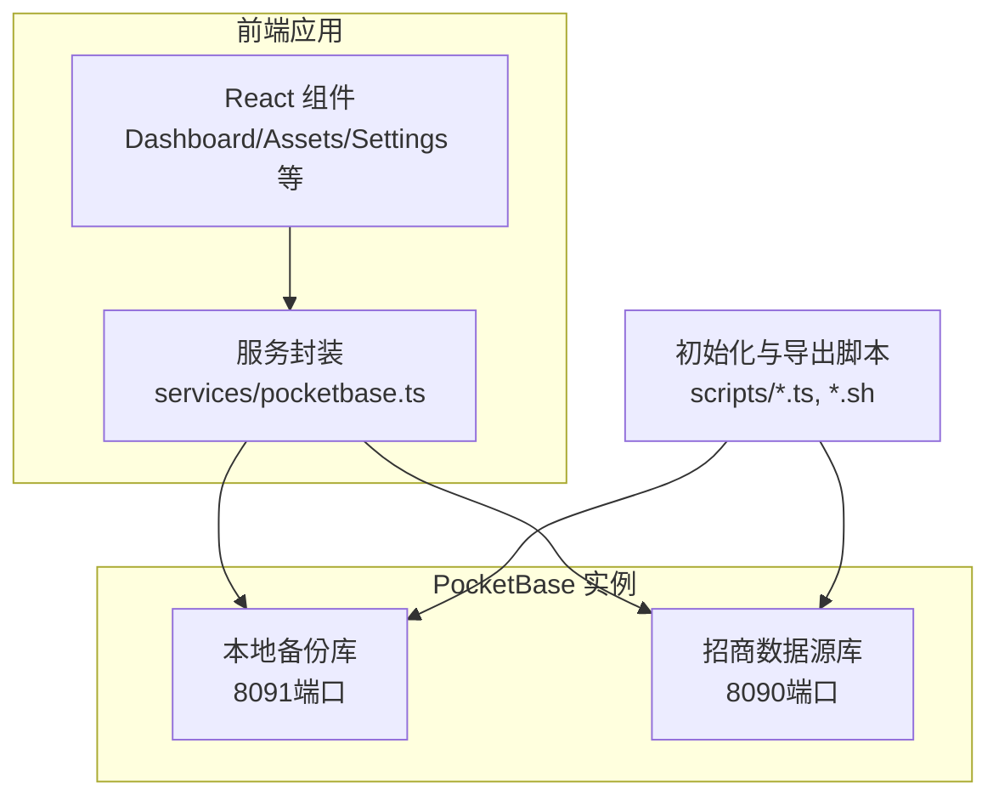
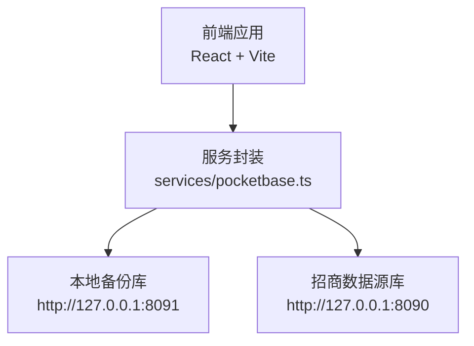
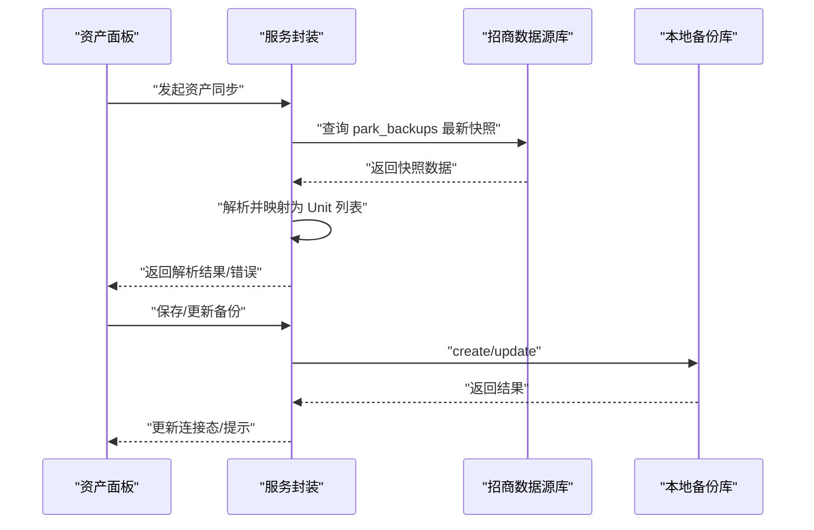
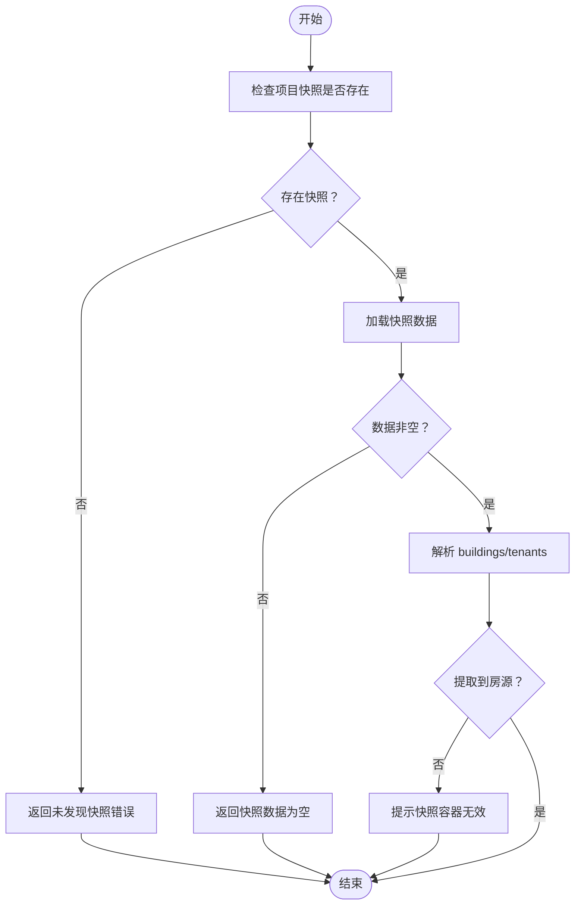
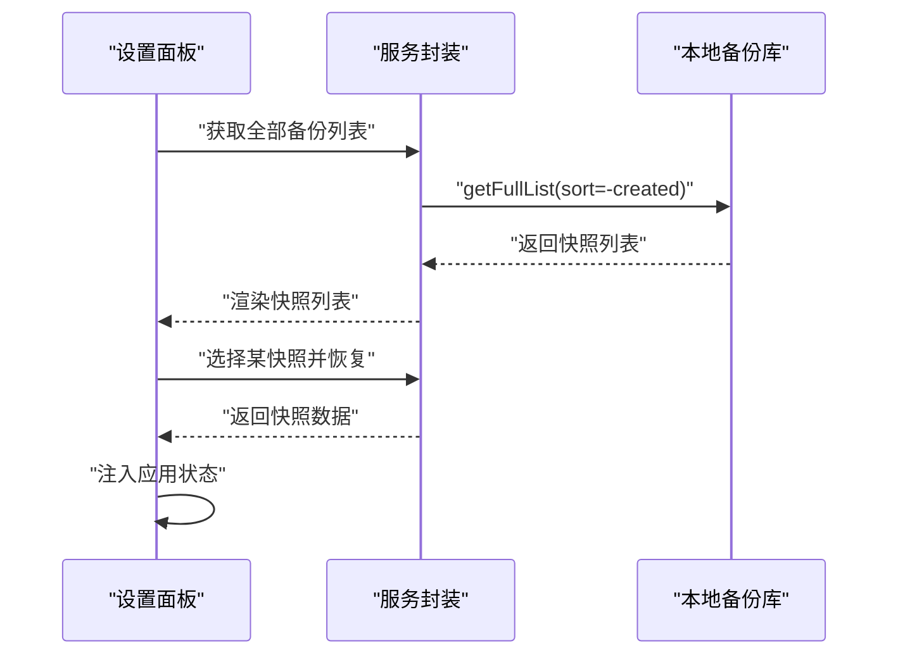
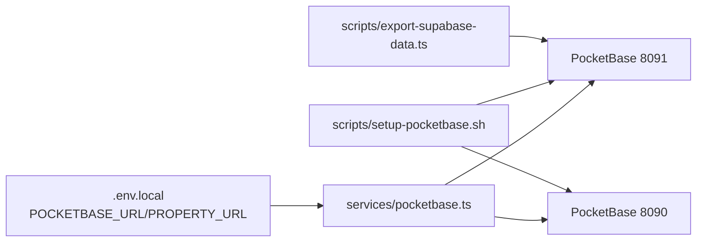

# 监控运维

<cite>
**本文引用的文件**
- [README.md](file://README.md)
- [package.json](file://package.json)
- [scripts/setup-pocketbase.sh](file://scripts/setup-pocketbase.sh)
- [scripts/export-supabase-data.ts](file://scripts/export-supabase-data.ts)
- [services/pocketbase.ts](file://services/pocketbase.ts)
- [.env.local](file://.env.local)
- [components/Assets.tsx](file://components/Assets.tsx)
- [components/Dashboard.tsx](file://components/Dashboard.tsx)
- [components/Settings.tsx](file://components/Settings.tsx)
- [App.tsx](file://App.tsx)
- [MIGRATION_SUMMARY.md](file://MIGRATION_SUMMARY.md)
</cite>

## 目录
1. [简介](#简介)
2. [项目结构](#项目结构)
3. [核心组件](#核心组件)
4. [架构总览](#架构总览)
5. [详细组件分析](#详细组件分析)
6. [依赖关系分析](#依赖关系分析)
7. [性能考量](#性能考量)
8. [故障排查指南](#故障排查指南)
9. [结论](#结论)
10. [附录](#附录)

## 简介
本文件面向“上海商机及渠道管理系统”的运维团队，提供一套可落地的监控与运维方案，覆盖系统健康检查、数据库连接监控、API 响应时间监控、日志管理策略、性能瓶颈诊断、数据备份与恢复、用户行为与系统资源监控、第三方服务监控、告警与应急响应，以及日常巡检、性能优化与容量规划建议。  
系统采用前端 React + Vite 构建，后端数据依赖 PocketBase（本地 8091、招商数据源 8090），并通过脚本完成 Supabase 数据导出与 PocketBase 初始化。

## 项目结构
- 前端应用位于根目录，使用 Vite + React + TypeScript 构建，依赖 pocketbase 客户端进行数据交互。
- 服务侧脚本位于 scripts/，包含 PocketBase 初始化与 Supabase 数据导出脚本。
- 数据持久化依赖 pb_data/ 目录下的 SQLite 数据库与 PocketBase 集合。
- 环境变量通过 .env.local 配置 PocketBase 地址等参数。

图表来源
- [services/pocketbase.ts](file://services/pocketbase.ts#L1-L226)
- [scripts/setup-pocketbase.sh](file://scripts/setup-pocketbase.sh#L1-L55)
- [scripts/export-supabase-data.ts](file://scripts/export-supabase-data.ts#L1-L70)
- [.env.local](file://.env.local#L1-L4)

章节来源
- [README.md](file://README.md#L1-L21)
- [package.json](file://package.json#L1-L28)
- [scripts/setup-pocketbase.sh](file://scripts/setup-pocketbase.sh#L1-L55)
- [scripts/export-supabase-data.ts](file://scripts/export-supabase-data.ts#L1-L70)
- [.env.local](file://.env.local#L1-L4)

## 核心组件
- PocketBase 客户端封装：负责与本地与招商数据源两个 PocketBase 实例通信，提供备份保存/加载、最新备份更新、房源同步等功能。
- 前端组件：
  - 资产面板：展示资产同步状态、连接态指示、错误提示，并支持手动同步。
  - 仪表盘：展示商机、带看、转化等关键指标。
  - 设置面板：展示备份快照列表，支持一键恢复。
- 应用入口：负责云存取的合并与恢复逻辑，维护云端状态机。

章节来源
- [services/pocketbase.ts](file://services/pocketbase.ts#L1-L226)
- [components/Assets.tsx](file://components/Assets.tsx#L1-L200)
- [components/Dashboard.tsx](file://components/Dashboard.tsx#L1-L200)
- [components/Settings.tsx](file://components/Settings.tsx#L1-L232)
- [App.tsx](file://App.tsx#L288-L587)

## 架构总览
系统由前端应用与两个 PocketBase 实例组成。前端通过服务封装调用本地备份库与招商数据源库，实现业务数据的读写、合并与可视化。

图表来源
- [services/pocketbase.ts](file://services/pocketbase.ts#L1-L226)
- [.env.local](file://.env.local#L1-L4)

## 详细组件分析

### 1) PocketBase 健康检查与连接监控
- 健康检查：初始化脚本通过轮询 8091 端口健康接口判断服务可用性。
- 连接监控：前端资产面板根据同步结果更新连接态（连接中/已连接/断开），并在错误时显示提示。
- 可观测性建议：
  - 在 CI/CD 中增加对 8091/8090 的健康探针。
  - 将连接失败次数、延迟纳入外部监控系统（如 Prometheus/Grafana）。
  - 对 8091/8090 的请求成功率与 P95 延迟建立阈值告警。

章节来源
- [scripts/setup-pocketbase.sh](file://scripts/setup-pocketbase.sh#L10-L17)
- [components/Assets.tsx](file://components/Assets.tsx#L144-L168)

### 2) 数据库连接与集合管理
- 本地备份集合：park_leasing_backups（名称、JSON 数据）。
- 招商数据源集合：park_backups（含项目标识、数据快照、排序与筛选）。
- 集合规则：初始化脚本要求创建集合与字段，并允许匿名访问以支持自动化导入。

章节来源
- [scripts/setup-pocketbase.sh](file://scripts/setup-pocketbase.sh#L28-L50)
- [services/pocketbase.ts](file://services/pocketbase.ts#L130-L140)
- [services/pocketbase.ts](file://services/pocketbase.ts#L50-L62)

### 3) API 响应时间监控
- 本地备份写入/更新：saveBackup/updateLatestBackup/loadLatestBackup/getAllBackups。
- 招商数据源读取：fetchPropertyUnits 从 park_backups 列表获取最新快照并解析。
- 性能建议：
  - 为上述 API 调用埋点（开始/结束时间、状态码、错误信息）。
  - 对 getList/更新操作设置超时与重试策略。
  - 对解析流程（deepSeekArray、映射状态）进行耗时统计。

图表来源
- [services/pocketbase.ts](file://services/pocketbase.ts#L50-L125)
- [services/pocketbase.ts](file://services/pocketbase.ts#L130-L179)
- [components/Assets.tsx](file://components/Assets.tsx#L109-L142)

章节来源
- [services/pocketbase.ts](file://services/pocketbase.ts#L50-L125)
- [services/pocketbase.ts](file://services/pocketbase.ts#L130-L179)
- [components/Assets.tsx](file://components/Assets.tsx#L109-L142)

### 4) 日志管理策略
- 控制台日志：服务封装与组件中使用 console.error 输出错误；资产面板在同步异常时显示错误提示。
- 建议：
  - 将前端日志统一接入结构化日志（如 Sentry 或自建日志平台），采集错误堆栈、上下文、用户会话。
  - 区分不同级别（info/warn/error），并按天切割与归档。
  - 对关键路径（同步、保存、更新）埋点，记录请求参数摘要、耗时与结果。

章节来源
- [services/pocketbase.ts](file://services/pocketbase.ts#L137-L138)
- [services/pocketbase.ts](file://services/pocketbase.ts#L172-L178)
- [services/pocketbase.ts](file://services/pocketbase.ts#L201-L203)
- [components/Assets.tsx](file://components/Assets.tsx#L188-L201)

### 5) 错误日志分析与性能瓶颈诊断
- 常见错误场景：
  - 未发现项目快照：解析阶段返回“未发现项目...”。
  - 快照数据为空：返回“快照数据为空”。
  - 解析成功但未提取到房源：提示确认快照容器有效性。
  - 并发冲突：更新失败返回 409 或包含 conflict 的消息。
- 诊断方法：
  - 结合前端连接态与错误弹窗定位问题范围（网络/解析/权限）。
  - 在服务封装中增加重试与指数退避，避免抖动放大。
  - 对解析函数 deepSeekArray 增加边界检查与超时控制。

图表来源
- [services/pocketbase.ts](file://services/pocketbase.ts#L50-L125)

章节来源
- [services/pocketbase.ts](file://services/pocketbase.ts#L50-L125)

### 6) 数据备份策略与恢复流程
- 备份集合：park_leasing_backups（名称、数据体）。
- 备份能力：
  - 保存最新备份：create。
  - 更新最新备份：update（乐观锁，冲突时返回 conflict）。
  - 加载最新备份：getList 排序取第一条。
  - 获取全部备份列表：getFullList。
- 恢复流程：
  - 设置面板列出历史快照，点击“恢复”将数据注入应用状态。
  - 应用入口支持全量恢复与增量合并（基于本地最新状态与云端快照合并）。

图表来源
- [services/pocketbase.ts](file://services/pocketbase.ts#L209-L225)
- [components/Settings.tsx](file://components/Settings.tsx#L220-L232)
- [App.tsx](file://App.tsx#L288-L329)

章节来源
- [services/pocketbase.ts](file://services/pocketbase.ts#L130-L179)
- [services/pocketbase.ts](file://services/pocketbase.ts#L184-L204)
- [services/pocketbase.ts](file://services/pocketbase.ts#L209-L225)
- [components/Settings.tsx](file://components/Settings.tsx#L220-L232)
- [App.tsx](file://App.tsx#L288-L329)

### 7) 用户行为监控与系统资源监控
- 用户行为：
  - 带看/转化分析：仪表盘基于活动数据与商机数据计算年度带看数、流失商机、转化率等。
  - 空置房源看板：结合活动与商机目标单元统计空置天数与带看频次。
- 系统资源：
  - 建议在部署环境（Node/Vite）启用资源监控（CPU/内存/磁盘/网络）。
  - 对 PocketBase 进程设置资源限制与健康检查。

章节来源
- [components/Dashboard.tsx](file://components/Dashboard.tsx#L61-L80)
- [components/Dashboard.tsx](file://components/Dashboard.tsx#L82-L91)
- [components/Opportunities.tsx](file://components/Opportunities.tsx#L196-L290)

### 8) 第三方服务监控
- Supabase 数据导出：脚本从 Supabase 查询最新备份并导出为 JSON，供后续导入 PocketBase。
- 建议：
  - 对 Supabase 的查询与写入增加重试与熔断。
  - 记录导出时间、大小、错误码，形成 SLA 报告。

章节来源
- [scripts/export-supabase-data.ts](file://scripts/export-supabase-data.ts#L20-L66)

### 9) 运维告警与应急响应
- 告警维度：
  - 健康检查失败（8091/8090）、连接断开、解析异常、并发冲突、备份写入失败。
- 告警阈值建议：
  - 连接失败率 > 1%、P95 同步耗时 > 5s、备份更新失败率 > 0.5%。
- 应急响应：
  - 快速切换至备用数据源（若存在）、回滚最近一次备份、重启 PocketBase。
  - 临时关闭高负载功能，释放资源。

章节来源
- [scripts/setup-pocketbase.sh](file://scripts/setup-pocketbase.sh#L10-L17)
- [services/pocketbase.ts](file://services/pocketbase.ts#L172-L178)
- [components/Assets.tsx](file://components/Assets.tsx#L188-L201)

### 10) 日常巡检与容量规划
- 巡检清单（摘自迁移总结）：
  - PocketBase 8091/8090 端口启动正常。
  - 应用启动无报错。
  - 登录页云端同步功能。
  - Dashboard 加载备份数据。
  - 手动保存备份到 PocketBase。
  - 资产页面同步房源数据。
  - 房源状态正确映射。
  - 新增/编辑房源功能。
  - 所有业务模块数据持久化。
- 容量规划：
  - 基于历史数据增长趋势估算集合条目与 JSON 大小，评估磁盘与内存占用。
  - 对高频查询（如 getList 排序）建立索引与缓存策略。

章节来源
- [MIGRATION_SUMMARY.md](file://MIGRATION_SUMMARY.md#L142-L156)

## 依赖关系分析
- 前端依赖 pocketbase 客户端，通过环境变量指定两个 PocketBase 实例地址。
- 服务封装集中处理集合操作与错误处理。
- 初始化脚本与导出脚本为运维提供自动化工具。

图表来源
- [.env.local](file://.env.local#L1-L4)
- [services/pocketbase.ts](file://services/pocketbase.ts#L1-L226)
- [scripts/setup-pocketbase.sh](file://scripts/setup-pocketbase.sh#L1-L55)
- [scripts/export-supabase-data.ts](file://scripts/export-supabase-data.ts#L1-L70)

章节来源
- [.env.local](file://.env.local#L1-L4)
- [package.json](file://package.json#L11-L16)
- [services/pocketbase.ts](file://services/pocketbase.ts#L1-L226)

## 性能考量
- 读写路径：
  - 读取：getList + sort(-created) + getFullList(fields)。
  - 写入：create/update（含乐观锁）。
- 优化建议：
  - 对频繁查询的字段建立索引（如 created、project_id）。
  - 缓存最近一次备份，减少重复拉取。
  - 对解析流程增加超时与分片处理，避免阻塞主线程。
  - 对网络请求设置超时与重试，避免前端卡顿。

章节来源
- [services/pocketbase.ts](file://services/pocketbase.ts#L146-L179)
- [services/pocketbase.ts](file://services/pocketbase.ts#L184-L204)
- [services/pocketbase.ts](file://services/pocketbase.ts#L209-L225)

## 故障排查指南
- 健康检查失败
  - 确认 8091/8090 端口监听与 Admin API 可达。
  - 查看初始化脚本输出与日志。
- 连接断开/解析异常
  - 检查资产面板连接态与错误弹窗。
  - 核对集合字段定义与 API 规则。
- 并发冲突
  - 捕获 409 或包含 conflict 的错误，重新加载并合并后重试。
- 备份失败
  - 检查集合权限与字段类型。
  - 查看控制台错误日志与网络请求状态。

章节来源
- [scripts/setup-pocketbase.sh](file://scripts/setup-pocketbase.sh#L10-L17)
- [components/Assets.tsx](file://components/Assets.tsx#L144-L168)
- [services/pocketbase.ts](file://services/pocketbase.ts#L172-L178)
- [services/pocketbase.ts](file://services/pocketbase.ts#L137-L138)

## 结论
本方案围绕 PocketBase 的健康检查、数据库连接、API 响应时间、日志与错误分析、备份与恢复、用户行为与系统资源监控、第三方服务监控、告警与应急响应等方面提供了系统化的运维实践。建议在生产环境中引入结构化日志、指标埋点与告警系统，持续迭代优化查询与写入路径，确保系统稳定与可观测。

## 附录
- 迁移与测试要点参考：迁移总结文档中的测试清单与技术架构变更说明。

章节来源
- [MIGRATION_SUMMARY.md](file://MIGRATION_SUMMARY.md#L114-L178)