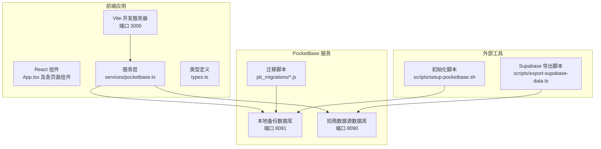
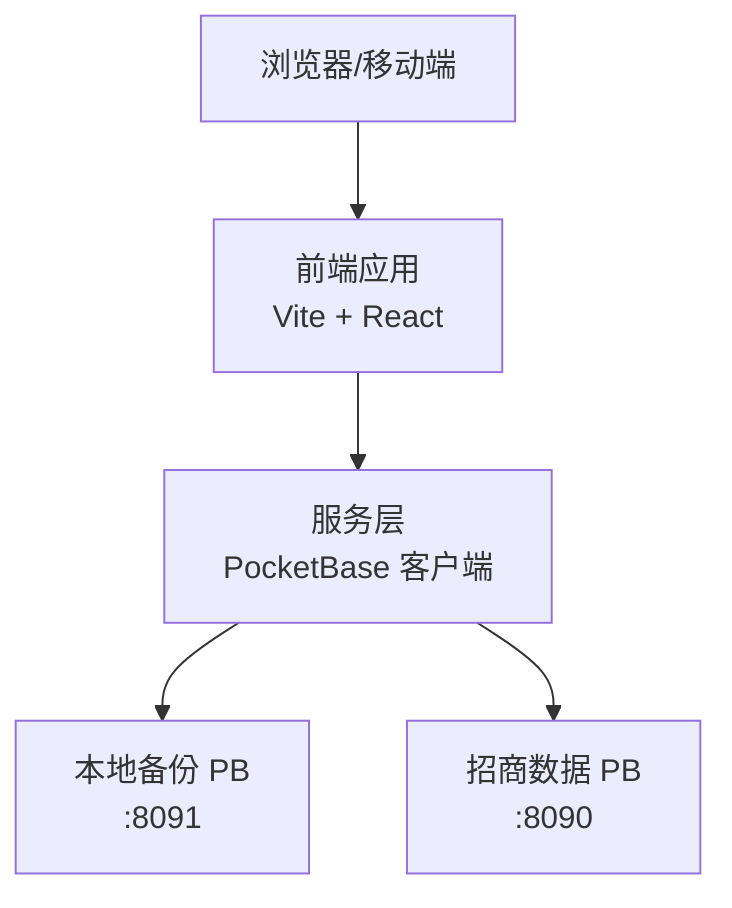
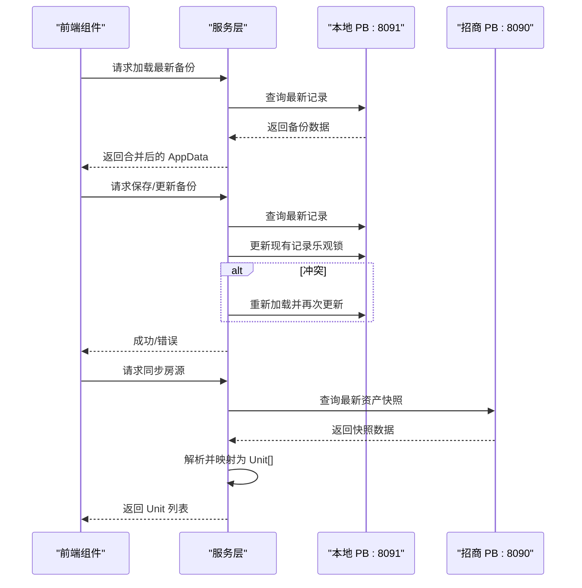
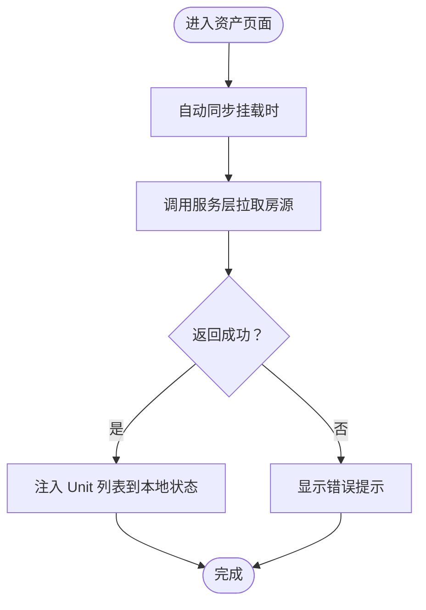
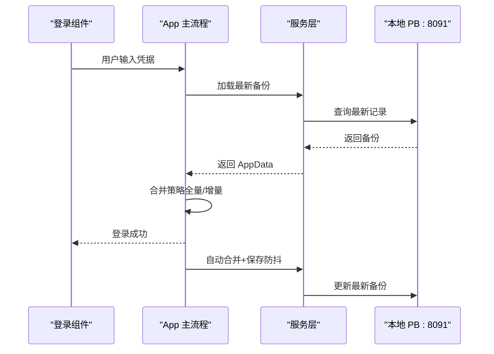
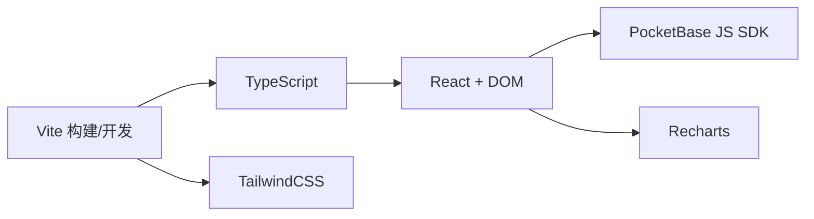

# 部署运维

<cite>
**本文引用的文件**   
- [package.json](file://package.json)
- [README.md](file://README.md)
- [MIGRATION_SUMMARY.md](file://MIGRATION_SUMMARY.md)
- [.env.local](file://.env.local)
- [vite.config.ts](file://vite.config.ts)
- [tailwind.config.js](file://tailwind.config.js)
- [scripts/setup-pocketbase.sh](file://scripts/setup-pocketbase.sh)
- [scripts/export-supabase-data.ts](file://scripts/export-supabase-data.ts)
- [services/pocketbase.ts](file://services/pocketbase.ts)
- [types.ts](file://types.ts)
- [App.tsx](file://App.tsx)
- [components/Assets.tsx](file://components/Assets.tsx)
- [components/Dashboard.tsx](file://components/Dashboard.tsx)
- [pb_migrations/1770189507_created_park_leasing_backups.js](file://pb_migrations/1770189507_created_park_leasing_backups.js)
</cite>

## 目录
1. [简介](#简介)
2. [项目结构](#项目结构)
3. [核心组件](#核心组件)
4. [架构总览](#架构总览)
5. [详细组件分析](#详细组件分析)
6. [依赖关系分析](#依赖关系分析)
7. [性能考量](#性能考量)
8. [故障排查指南](#故障排查指南)
9. [结论](#结论)
10. [附录](#附录)

## 简介
本部署运维文档面向“上海商机及渠道管理系统（v5.0）”，聚焦生产环境部署与运维，涵盖以下要点：
- 生产环境部署配置与端口规划
- PocketBase 服务器设置与 API 规则配置
- Supabase 数据迁移与导入策略
- 系统监控与健康检查方案
- 环境变量与网络、安全配置
- 自动化部署脚本使用说明
- 日志管理、错误告警与数据备份策略
- 故障排查、系统维护流程与升级更新方案

## 项目结构
该系统采用前端 Vite + React + TailwindCSS，后端使用 PocketBase 作为本地数据库与备份存储，同时对接招商管理系统的 PocketBase 数据源。

**图表来源**
- [vite.config.ts](file://vite.config.ts#L8-L11)
- [services/pocketbase.ts](file://services/pocketbase.ts#L4-L12)
- [pb_migrations/1770189507_created_park_leasing_backups.js](file://pb_migrations/1770189507_created_park_leasing_backups.js#L1-L54)
- [scripts/setup-pocketbase.sh](file://scripts/setup-pocketbase.sh#L1-L55)
- [scripts/export-supabase-data.ts](file://scripts/export-supabase-data.ts#L1-L70)

**章节来源**
- [package.json](file://package.json#L6-L10)
- [vite.config.ts](file://vite.config.ts#L8-L11)
- [tailwind.config.js](file://tailwind.config.js#L1-L13)

## 核心组件
- 前端应用与路由：由 App.tsx 提供登录、导航与各业务模块入口，组件间通过状态共享与本地持久化协同。
- 服务层封装：services/pocketbase.ts 封装了本地备份写入/读取、最新备份更新（含并发冲突处理）、以及从招商系统 PocketBase 拉取房源数据。
- 类型系统：types.ts 定义了商机、渠道、佣金、单位等核心领域模型，确保前后端数据契约一致。
- 构建与开发：vite.config.ts 配置开发服务器端口与环境变量注入；TailwindCSS 用于样式工程化。
- PocketBase 迁移：pb_migrations/...js 定义了本地备份集合 park_leasing_backups 的结构与权限规则。
- 自动化脚本：scripts/setup-pocketbase.sh 用于引导初始化；scripts/export-supabase-data.ts 用于从 Supabase 导出现有备份数据。

**章节来源**
- [App.tsx](file://App.tsx#L179-L620)
- [services/pocketbase.ts](file://services/pocketbase.ts#L1-L226)
- [types.ts](file://types.ts#L240-L261)
- [vite.config.ts](file://vite.config.ts#L5-L26)
- [tailwind.config.js](file://tailwind.config.js#L1-L13)
- [pb_migrations/1770189507_created_park_leasing_backups.js](file://pb_migrations/1770189507_created_park_leasing_backups.js#L1-L54)
- [scripts/setup-pocketbase.sh](file://scripts/setup-pocketbase.sh#L1-L55)
- [scripts/export-supabase-data.ts](file://scripts/export-supabase-data.ts#L1-L70)

## 架构总览
系统采用“前端单页应用 + 本地 PocketBase 备份 + 招商系统 PocketBase 数据源”的三层架构。前端通过服务层与两个 PocketBase 实例通信，实现业务数据的本地备份与招商数据的实时同步。

**图表来源**
- [services/pocketbase.ts](file://services/pocketbase.ts#L4-L12)
- [MIGRATION_SUMMARY.md](file://MIGRATION_SUMMARY.md#L107-L111)

## 详细组件分析

### 服务层：PocketBase 客户端与数据流
- 本地备份集合 park_leasing_backups 的创建与迁移由 pb_migrations/...js 完成，字段包含 name 与 data（JSON）。
- 服务层提供：
  - 从招商系统 PB 拉取最新资产快照并映射为本地 Unit 列表
  - 保存/更新本地备份（自动更新最新快照，避免重复创建）
  - 并发冲突处理：检测 409 冲突后重新合并并更新
  - 加载最新备份与获取历史列表

**图表来源**
- [services/pocketbase.ts](file://services/pocketbase.ts#L50-L125)
- [services/pocketbase.ts](file://services/pocketbase.ts#L130-L179)
- [services/pocketbase.ts](file://services/pocketbase.ts#L184-L204)

**章节来源**
- [services/pocketbase.ts](file://services/pocketbase.ts#L1-L226)
- [pb_migrations/1770189507_created_park_leasing_backups.js](file://pb_migrations/1770189507_created_park_leasing_backups.js#L1-L54)

### 资产页面：房源同步与状态展示
- 资产页面在挂载时自动触发一次同步，随后支持手动刷新。
- 云端连接状态通过图标与文字反馈，错误时弹窗提示。
- 同步成功后，将返回的 Unit 列表注入到本地状态，用于后续销售与运营分析。

**图表来源**
- [components/Assets.tsx](file://components/Assets.tsx#L32-L142)

**章节来源**
- [components/Assets.tsx](file://components/Assets.tsx#L1-L368)

### 登录与数据聚合：云端同步与本地持久化
- 登录前先从云端加载最新备份，支持“全量覆盖”或“增量聚合”两种模式。
- 本地数据通过 localStorage 持久化，每次变更后进行防抖合并并自动同步到云端。
- 退出登录时可选择聚合同步并退出，确保离线修改不丢失。

**图表来源**
- [App.tsx](file://App.tsx#L302-L378)
- [services/pocketbase.ts](file://services/pocketbase.ts#L130-L179)

**章节来源**
- [App.tsx](file://App.tsx#L179-L620)
- [services/pocketbase.ts](file://services/pocketbase.ts#L130-L179)

## 依赖关系分析
- 前端依赖：React、React DOM、PocketBase JS SDK、Recharts、TailwindCSS。
- 构建与开发：Vite、TypeScript、PostCSS、TailwindCSS 插件。
- 运行时：Node.js（满足 README 的运行前置条件）。

**图表来源**
- [package.json](file://package.json#L11-L26)
- [vite.config.ts](file://vite.config.ts#L1-L26)

**章节来源**
- [package.json](file://package.json#L1-L28)
- [vite.config.ts](file://vite.config.ts#L1-L26)

## 性能考量
- 房源同步策略：建议手动触发，避免频繁自动同步，降低对招商系统 PB 的压力。
- 备份策略：保持现有合并策略，避免重复创建快照，减少数据库写放大。
- 本地缓存：可在前端增加短期缓存（如 5-10 分钟），减少重复请求。
- 轮询间隔：建议不低于 30 秒，避免过度轮询。
- 图表渲染：Dashboard 使用 useMemo 优化数据计算与渲染，避免不必要的重算。

**章节来源**
- [MIGRATION_SUMMARY.md](file://MIGRATION_SUMMARY.md#L201-L207)
- [components/Dashboard.tsx](file://components/Dashboard.tsx#L25-L89)

## 故障排查指南
- PocketBase 未启动或端口占用
  - 确认本地 PB（:8091）与招商 PB（:8090）均已启动。
  - 若脚本提示未运行，先启动对应实例再重试。
- CORS 跨域问题
  - 在 PocketBase 管理后台设置允许来源，添加前端开发地址。
- 集合未创建或字段缺失
  - 按初始化脚本指引创建 park_leasing_backups 集合与字段。
- 并发冲突
  - 服务层检测到 409 冲突会自动重试合并，若仍失败，检查网络与并发写入。
- 登录与同步失败
  - 检查 .env.local 中的 POCKETBASE_URL 与 POCKETBASE_PROPERTY_URL 是否正确。
  - 确认网络可达性与防火墙放行。

**章节来源**
- [scripts/setup-pocketbase.sh](file://scripts/setup-pocketbase.sh#L13-L17)
- [MIGRATION_SUMMARY.md](file://MIGRATION_SUMMARY.md#L82-L87)
- [services/pocketbase.ts](file://services/pocketbase.ts#L171-L178)
- [.env.local](file://.env.local#L2-L3)

## 结论
本系统通过本地 PocketBase 实现业务数据的可靠备份与聚合，同时对接招商系统的实时数据源，形成“本地备份 + 外部数据源”的双轨架构。配合自动化脚本与明确的运维流程，可实现稳定、可审计、可扩展的生产部署与日常运维。

## 附录

### 环境变量与配置
- 环境变量
  - GEMINI_API_KEY：用于前端集成 Gemini API（如需）。
  - POCKETBASE_URL：本地备份 PB 地址（默认 127.0.0.1:8091）。
  - POCKETBASE_PROPERTY_URL：招商数据 PB 地址（默认 127.0.0.1:8090）。
- 开发服务器
  - Vite 默认监听 0.0.0.0:3000，便于容器或局域网访问。

**章节来源**
- [.env.local](file://.env.local#L1-L4)
- [vite.config.ts](file://vite.config.ts#L8-L11)

### 网络与安全配置
- 端口规划
  - 3000：前端开发服务器
  - 8090：招商系统 PB（房源数据源）
  - 8091：本地备份 PB（业务快照）
- CORS
  - 在 PocketBase 管理后台设置允许来源，确保前端可访问。
- API 规则
  - park_leasing_backups 集合建议设置为“允许所有”以支持无认证写入，生产环境建议结合鉴权策略调整。

**章节来源**
- [MIGRATION_SUMMARY.md](file://MIGRATION_SUMMARY.md#L107-L111)
- [MIGRATION_SUMMARY.md](file://MIGRATION_SUMMARY.md#L82-L87)
- [pb_migrations/1770189507_created_park_leasing_backups.js](file://pb_migrations/1770189507_created_park_leasing_backups.js#L39-L43)

### 自动化部署脚本使用说明
- 初始化 PocketBase 集合
  - 执行脚本，按提示在管理后台创建 park_leasing_backups 集合与字段。
- Supabase 数据导出与导入
  - 先导出 Supabase 最新备份快照，再导入到本地 PB 或通过管理后台导入。
- 启动顺序
  - 先启动招商 PB（:8090），再启动本地 PB（:8091），最后启动前端应用。

**章节来源**
- [scripts/setup-pocketbase.sh](file://scripts/setup-pocketbase.sh#L1-L55)
- [scripts/export-supabase-data.ts](file://scripts/export-supabase-data.ts#L1-L70)
- [MIGRATION_SUMMARY.md](file://MIGRATION_SUMMARY.md#L90-L111)

### 日志管理与错误告警
- 日志位置
  - 前端：浏览器控制台与应用内状态提示。
  - PocketBase：内置日志与数据库日志文件（位于 pb_data 目录）。
- 错误告警
  - 登录与同步失败时，前端弹窗提示具体错误信息。
  - 建议在生产环境接入统一日志收集与告警平台（如 Loki + Grafana + Alertmanager）。

**章节来源**
- [components/Assets.tsx](file://components/Assets.tsx#L188-L201)
- [services/pocketbase.ts](file://services/pocketbase.ts#L122-L124)

### 数据备份策略
- 本地备份
  - 使用 park_leasing_backups 集合保存业务快照，支持历史列表查询。
- 外部数据源
  - 招商系统 PB 作为只读数据源，定期同步至本地。
- 回滚方案
  - 如需回滚至 Supabase，可恢复相关服务与依赖，回退代码并重新安装依赖。

**章节来源**
- [services/pocketbase.ts](file://services/pocketbase.ts#L209-L225)
- [MIGRATION_SUMMARY.md](file://MIGRATION_SUMMARY.md#L179-L189)

### 系统维护流程与升级更新
- 维护流程
  - 升级前先备份本地 PB 数据与前端静态产物。
  - 按迁移摘要核对集合结构与 API 规则。
  - 逐步替换服务层实现，验证登录、同步与备份功能。
- 升级更新
  - 前端：npm run build 生成 dist，部署至静态服务器或容器。
  - 后端：更新 PocketBase 版本后，检查迁移脚本与集合结构。

**章节来源**
- [README.md](file://README.md#L16-L20)
- [MIGRATION_SUMMARY.md](file://MIGRATION_SUMMARY.md#L1-L224)