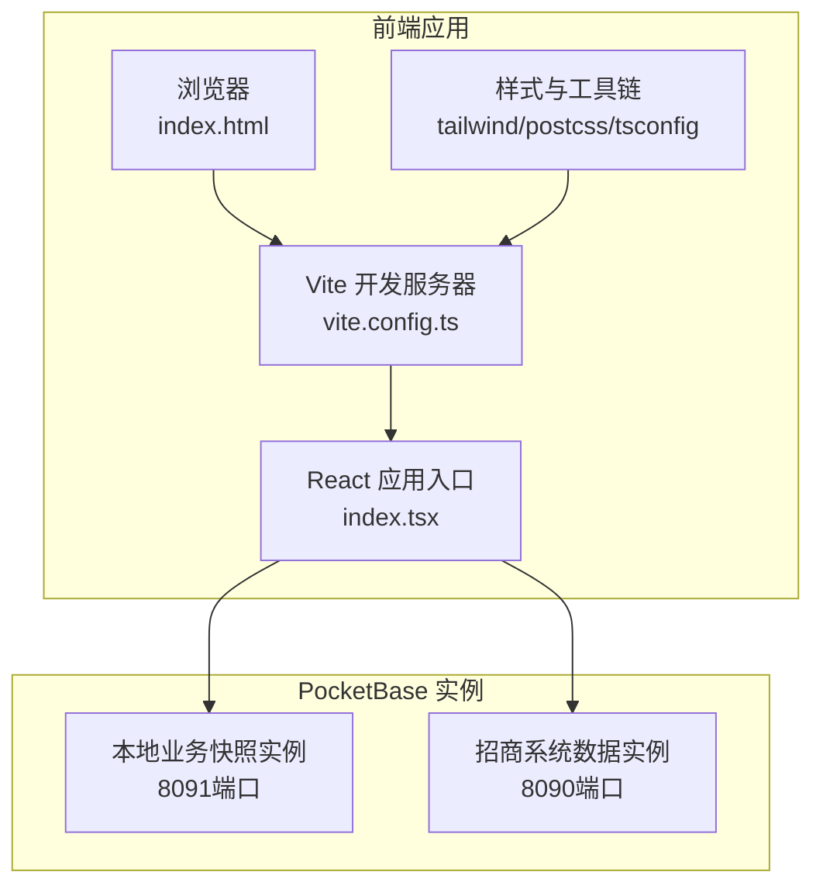
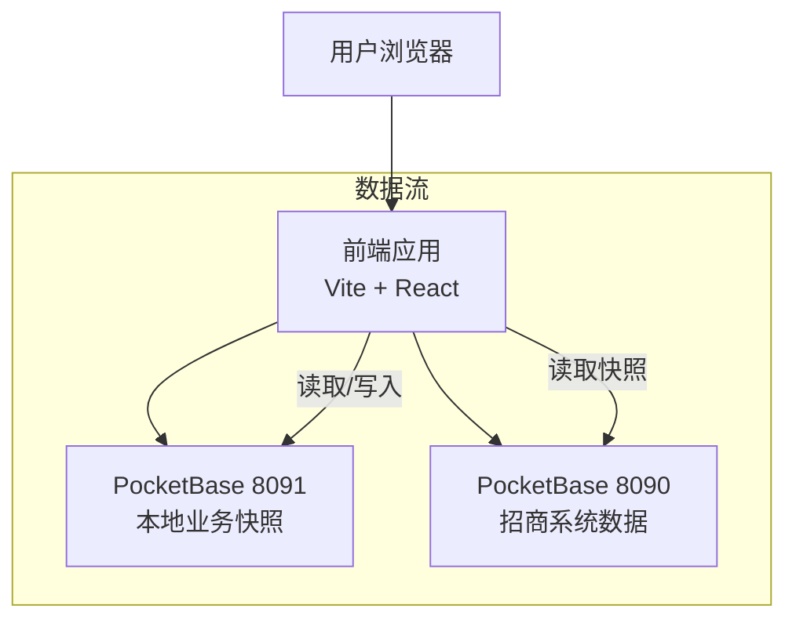
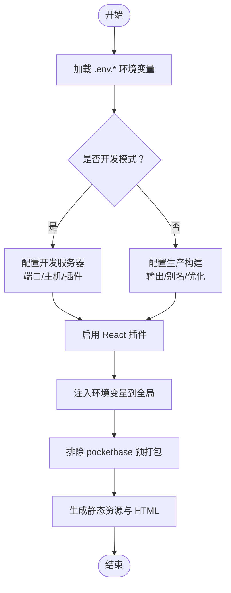
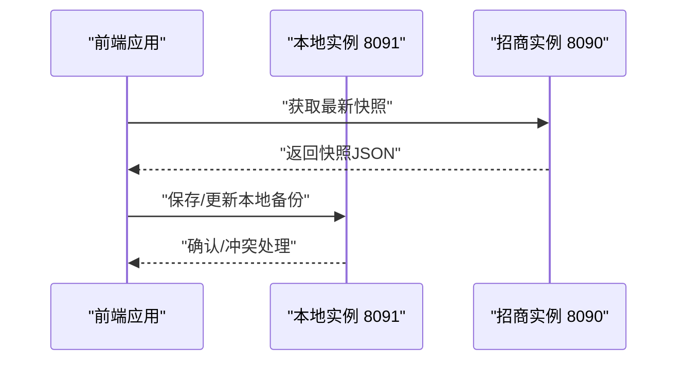
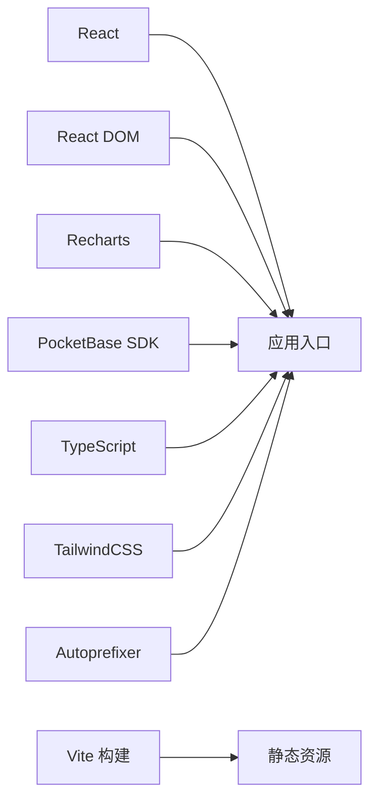

# 部署配置

<cite>
**本文引用的文件**
- [package.json](file://package.json)
- [vite.config.ts](file://vite.config.ts)
- [services/pocketbase.ts](file://services/pocketbase.ts)
- [scripts/setup-pocketbase.sh](file://scripts/setup-pocketbase.sh)
- [.env.local](file://.env.local)
- [index.html](file://index.html)
- [dist/index.html](file://dist/index.html)
- [README.md](file://README.md)
- [tailwind.config.js](file://tailwind.config.js)
- [postcss.config.js](file://postcss.config.js)
- [tsconfig.json](file://tsconfig.json)
- [types.ts](file://types.ts)
</cite>

## 目录
1. [简介](#简介)
2. [项目结构](#项目结构)
3. [核心组件](#核心组件)
4. [架构总览](#架构总览)
5. [详细组件分析](#详细组件分析)
6. [依赖关系分析](#依赖关系分析)
7. [性能考虑](#性能考虑)
8. [故障排查指南](#故障排查指南)
9. [结论](#结论)
10. [附录](#附录)

## 简介
本部署配置文档面向“上海商机及渠道管理系统”的生产环境部署与运维，覆盖以下要点：
- 生产环境部署要求：Node.js 版本、依赖安装、环境变量配置、服务器要求
- Vite 构建配置与产物特性
- PocketBase 集成配置与端口规划
- 网络端口与反向代理建议
- Docker 部署方案与 Nginx 反向代理配置思路
- 静态资源部署、CDN 与缓存策略
- 从开发到生产的完整部署流程

## 项目结构
该前端项目基于 React + TypeScript，使用 Vite 作为构建工具，TailwindCSS 作为样式框架，PocketBase 作为数据存储与同步后端。项目采用多集合设计，包含本地业务快照集合与招商系统数据集合，通过 API 进行跨实例通信。

图表来源
- [vite.config.ts](file://vite.config.ts#L1-L27)
- [services/pocketbase.ts](file://services/pocketbase.ts#L4-L12)
- [index.html](file://index.html#L1-L14)
- [dist/index.html](file://dist/index.html#L1-L27)

章节来源
- [package.json](file://package.json#L1-L28)
- [vite.config.ts](file://vite.config.ts#L1-L27)
- [tailwind.config.js](file://tailwind.config.js#L1-L13)
- [postcss.config.js](file://postcss.config.js#L1-L6)
- [tsconfig.json](file://tsconfig.json#L1-L29)

## 核心组件
- 构建与打包：Vite 6.x，React 插件，ESNext 模块化输出，生产构建生成静态资源与 HTML
- 样式与工具链：TailwindCSS + Autoprefixer，按需扫描模板路径
- 数据层：两个 PocketBase 实例（8090/8091），分别承载招商系统数据与本地业务快照
- 环境变量：API 密钥与 PocketBase 地址，支持开发与生产切换
- 类型定义：统一的业务模型与状态枚举，便于前后端协作

章节来源
- [package.json](file://package.json#L6-L10)
- [vite.config.ts](file://vite.config.ts#L5-L26)
- [services/pocketbase.ts](file://services/pocketbase.ts#L4-L12)
- [.env.local](file://.env.local#L1-L4)
- [types.ts](file://types.ts#L1-L261)

## 架构总览
系统由前端应用与两个 PocketBase 实例组成。前端通过 API 与两个实例交互，实现数据拉取、备份与恢复、以及业务状态同步。

图表来源
- [services/pocketbase.ts](file://services/pocketbase.ts#L4-L12)
- [dist/index.html](file://dist/index.html#L9-L20)

## 详细组件分析

### Vite 构建与运行时配置
- 开发服务器：监听 3000 端口，允许外部访问
- 别名与路径：根目录别名 @，便于模块导入
- 依赖优化：排除 pocketbase，避免预打包问题
- 环境变量注入：将 GEMINI_API_KEY 注入到全局作用域
- 生产构建：生成静态资源与 HTML，HTML 中通过 importmap 引入 ESM 依赖

图表来源
- [vite.config.ts](file://vite.config.ts#L5-L26)
- [dist/index.html](file://dist/index.html#L9-L20)

章节来源
- [vite.config.ts](file://vite.config.ts#L5-L26)
- [dist/index.html](file://dist/index.html#L9-L20)

### PocketBase 集成与端口规划
- 本地业务快照实例：默认 8091 端口，用于保存应用的备份与状态
- 招商系统数据实例：默认 8090 端口，提供云端资产快照与租户信息
- 前端通过环境变量控制实例地址，支持本地与远程部署
- 初始化脚本：提供集合创建与 API 规则设置指引，确保无认证访问以满足前端直连需求

图表来源
- [services/pocketbase.ts](file://services/pocketbase.ts#L4-L12)
- [services/pocketbase.ts](file://services/pocketbase.ts#L50-L125)
- [services/pocketbase.ts](file://services/pocketbase.ts#L130-L179)

章节来源
- [services/pocketbase.ts](file://services/pocketbase.ts#L4-L12)
- [scripts/setup-pocketbase.sh](file://scripts/setup-pocketbase.sh#L1-L55)

### 环境变量与配置清单
- 必填项
  - GEMINI_API_KEY：AI 接口密钥
  - POCKETBASE_URL：本地业务快照实例地址（默认 8091）
  - POCKETBASE_PROPERTY_URL：招商系统数据实例地址（默认 8090）
- 可选项
  - NODE_ENV：开发/生产模式（Vite 自动加载 .env.development/.env.production）
  - 其他业务相关变量：根据实际功能扩展

章节来源
- [.env.local](file://.env.local#L1-L4)
- [vite.config.ts](file://vite.config.ts#L13-L16)

### 样式与工具链
- TailwindCSS：内容扫描路径包含根目录与 components 子目录，确保按需生成样式
- PostCSS：启用 Tailwind 与 Autoprefixer 插件
- TypeScript：ESNext 模块解析，Bundler 打包检测，JSX 支持

章节来源
- [tailwind.config.js](file://tailwind.config.js#L1-L13)
- [postcss.config.js](file://postcss.config.js#L1-L6)
- [tsconfig.json](file://tsconfig.json#L1-L29)

## 依赖关系分析
- 前端依赖：React、React DOM、Recharts、Lucide-React、PocketBase SDK
- 开发依赖：Vite、@vitejs/plugin-react、TypeScript、TailwindCSS、Autoprefixer
- 运行时：浏览器原生 ESM 与 importmap，无需 Node.js 运行时

图表来源
- [package.json](file://package.json#L11-L26)
- [dist/index.html](file://dist/index.html#L9-L20)

章节来源
- [package.json](file://package.json#L11-L26)

## 性能考虑
- 构建优化：生产构建开启 Tree-shaking 与模块化输出，减少体积
- 资源加载：HTML 通过 importmap 引入 ESM 依赖，降低打包体积
- 缓存策略：静态资源具备指纹命名，可长期缓存；HTML 不缓存或短缓存
- 端口与网络：开发端口 3000，生产建议通过反向代理暴露 80/443

## 故障排查指南
- PocketBase 未启动或端口占用
  - 检查 8090/8091 端口是否可用
  - 使用初始化脚本进行集合与规则配置
- 前端无法连接实例
  - 校验环境变量 POCKETBASE_URL 与 POCKETBASE_PROPERTY_URL
  - 确认实例允许无认证访问（参考初始化脚本中的 API 规则说明）
- 构建或运行报错
  - 清理 node_modules 与 .vite 缓存后重装依赖
  - 确保 Node.js 版本满足 Vite/TS 要求

章节来源
- [scripts/setup-pocketbase.sh](file://scripts/setup-pocketbase.sh#L12-L17)
- [services/pocketbase.ts](file://services/pocketbase.ts#L4-L12)
- [README.md](file://README.md#L13-L21)

## 结论
本项目采用轻量级前端架构与双实例 PocketBase 设计，适合中小规模业务场景的快速部署与迭代。生产部署建议通过反向代理统一对外暴露，结合 CDN 与缓存策略提升访问性能，并确保数据安全与备份策略完善。

## 附录

### 生产环境部署要求
- Node.js 版本：满足 Vite 6 与 TypeScript 5 的最低版本要求
- 依赖安装：执行安装命令后，确保 node_modules 与 .vite 缓存正常
- 服务器要求：至少 1 核 CPU、1GB 内存，建议 2 核 2GB 起步
- 端口开放：开发端口 3000（仅内网调试），生产通过反向代理暴露 80/443

章节来源
- [README.md](file://README.md#L13-L21)
- [package.json](file://package.json#L18-L26)

### Vite 构建配置要点
- 开发服务器：端口 3000，host 0.0.0.0
- 环境变量注入：GEMINI_API_KEY
- 依赖排除：pocketbase 预打包
- 别名：@ 指向项目根目录
- 生产构建：生成静态资源与 HTML，HTML 包含 importmap

章节来源
- [vite.config.ts](file://vite.config.ts#L5-L26)
- [dist/index.html](file://dist/index.html#L9-L20)

### PocketBase 集成配置
- 本地业务快照实例：8091 端口，集合 park_leasing_backups
- 招商系统数据实例：8090 端口，提供快照与租户数据
- 初始化脚本：集合创建与 API 规则设置指引

章节来源
- [services/pocketbase.ts](file://services/pocketbase.ts#L4-L12)
- [scripts/setup-pocketbase.sh](file://scripts/setup-pocketbase.sh#L21-L51)

### 网络端口与反向代理
- 开发端口：3000
- 生产建议：通过 Nginx 将 80/443 转发至前端静态资源或反向代理
- SSL 证书：建议使用 Let’s Encrypt 自动签发与续期

章节来源
- [vite.config.ts](file://vite.config.ts#L8-L11)

### Docker 部署方案（思路）
- 基础镜像：nginx:alpine
- 构建产物：将 dist 目录作为静态站点根目录
- 反向代理：将 /api 或特定路径转发至 8090/8091（视部署架构而定）
- 环境变量：通过构建参数或挂载卷注入 .env.local 对应值
- 健康检查：Nginx 返回 200，PocketBase 健康接口可达

章节来源
- [dist/index.html](file://dist/index.html#L1-L27)

### Nginx 反向代理与 SSL 配置（思路）
- 监听 80/443，强制 HTTPS
- 静态资源：直接由 Nginx 提供，开启 gzip 与缓存
- API 转发：将 /api/* 转发至 8090/8091（根据路由规则）
- SSL：Let’s Encrypt 自动证书与 301 重定向

章节来源
- [dist/index.html](file://dist/index.html#L1-L27)

### 静态资源部署、CDN 与缓存策略
- 静态资源：dist 目录下的 JS/CSS/Favicon 等
- CDN：将静态资源托管至 CDN，利用指纹命名实现强缓存
- 缓存策略：CSS/JS 长缓存，HTML 短缓存或不缓存
- 预加载：关键资源通过 importmap 与 preload 优化首屏

章节来源
- [dist/index.html](file://dist/index.html#L9-L22)

### 环境变量清单与配置示例
- 必填
  - GEMINI_API_KEY：AI 接口密钥
  - POCKETBASE_URL：本地业务快照实例地址（默认 8091）
  - POCKETBASE_PROPERTY_URL：招商系统数据实例地址（默认 8090）
- 可选
  - NODE_ENV：development/production
- 示例格式（仅展示键名与用途，不包含具体值）
  - GEMINI_API_KEY：用于 AI 功能的鉴权
  - POCKETBASE_URL：本地业务快照实例地址
  - POCKETBASE_PROPERTY_URL：招商系统数据实例地址
  - NODE_ENV：开发/生产模式

章节来源
- [.env.local](file://.env.local#L1-L4)
- [vite.config.ts](file://vite.config.ts#L13-L16)

### 从开发到生产的完整部署流程
- 开发阶段
  - 安装依赖
  - 配置 .env.local
  - 启动本地开发服务器
- 构建阶段
  - 执行生产构建
  - 校验 dist 目录产物
- 生产部署
  - 部署静态资源至 Web 服务器或 CDN
  - 配置反向代理与 SSL
  - 启动/验证两个 PocketBase 实例
  - 验证数据同步与备份功能

章节来源
- [README.md](file://README.md#L16-L21)
- [package.json](file://package.json#L6-L10)
- [scripts/setup-pocketbase.sh](file://scripts/setup-pocketbase.sh#L1-L55)