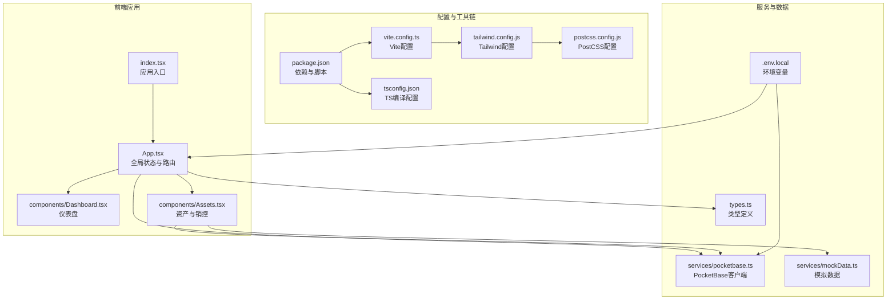
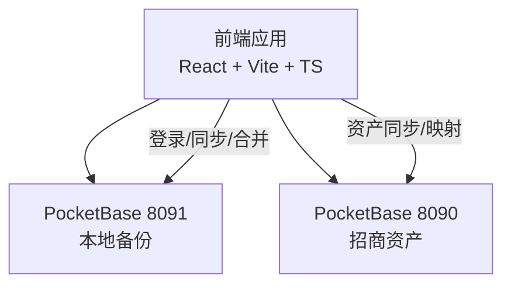
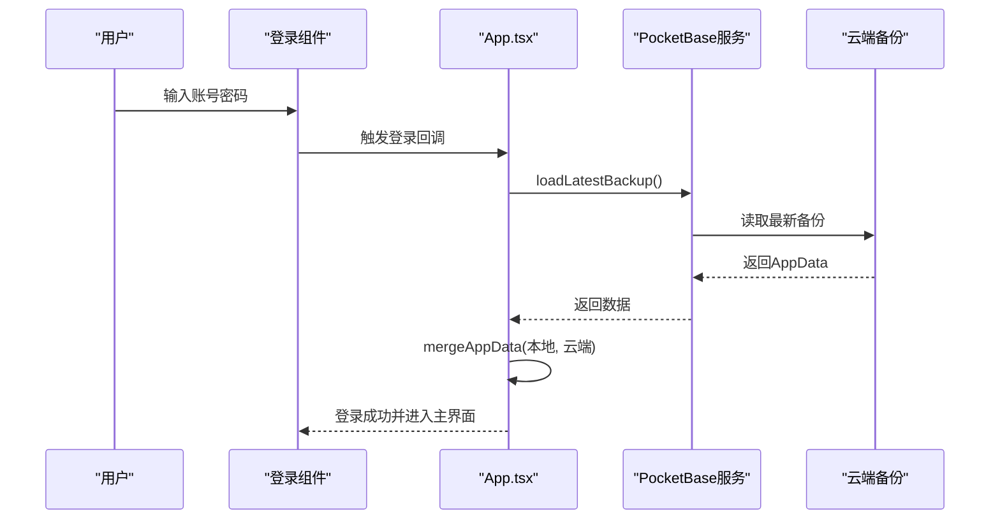
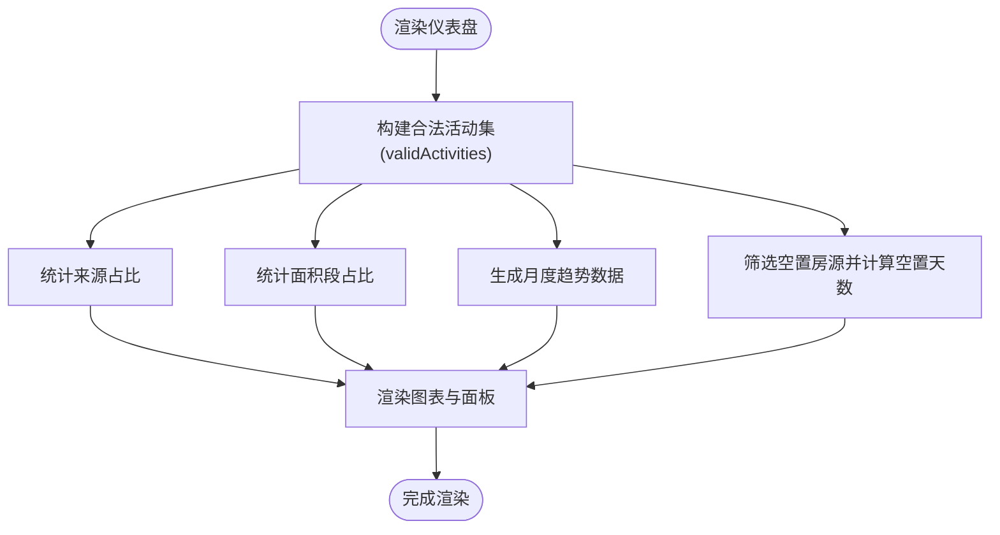
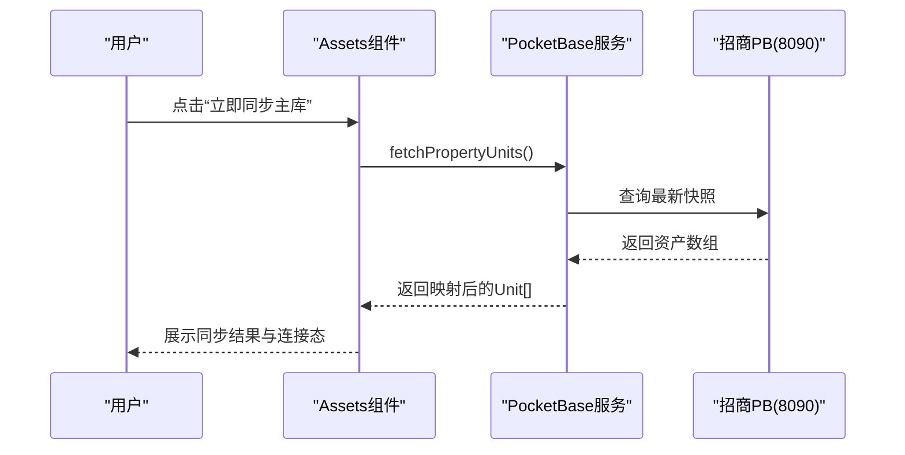
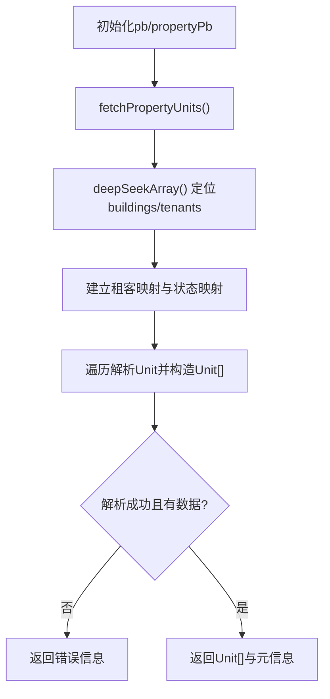
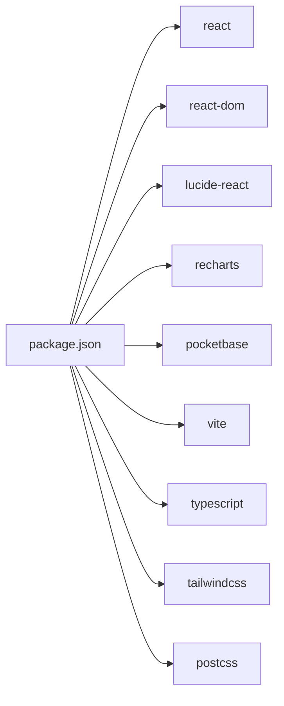

# 技术栈

<cite>
**本文引用的文件**
- [package.json](file://package.json)
- [tsconfig.json](file://tsconfig.json)
- [vite.config.ts](file://vite.config.ts)
- [tailwind.config.js](file://tailwind.config.js)
- [postcss.config.js](file://postcss.config.js)
- [index.tsx](file://index.tsx)
- [App.tsx](file://App.tsx)
- [types.ts](file://types.ts)
- [services/pocketbase.ts](file://services/pocketbase.ts)
- [.env.local](file://.env.local)
- [MIGRATION_SUMMARY.md](file://MIGRATION_SUMMARY.md)
- [README.md](file://README.md)
- [components/Dashboard.tsx](file://components/Dashboard.tsx)
- [components/Assets.tsx](file://components/Assets.tsx)
- [services/mockData.ts](file://services/mockData.ts)
</cite>

## 目录
1. [简介](#简介)
2. [项目结构](#项目结构)
3. [核心组件](#核心组件)
4. [架构总览](#架构总览)
5. [详细组件分析](#详细组件分析)
6. [依赖关系分析](#依赖关系分析)
7. [性能考量](#性能考量)
8. [故障排查指南](#故障排查指南)
9. [结论](#结论)
10. [附录](#附录)

## 简介
本技术栈文档面向“上海商机及渠道管理系统（v5.0）”，系统采用现代化前端技术栈：React 19.2.3、TypeScript、Vite 6.2.0、Tailwind CSS 3.4.19，并通过 Lucide React 0.561.0 提供统一图标体系，Recharts 3.6.0 构建数据可视化图表。云端服务采用 PocketBase 0.21.5 作为数据存储与同步服务，实现本地备份与招商管理系统的资产数据双向联动。

该系统强调：
- 现代化开发体验：Vite 提供极速热更新与按需编译，TypeScript 提升类型安全与可维护性。
- 可视化与交互：Tailwind CSS 快速构建界面，Recharts 提供丰富的图表能力。
- 数据一致性与可靠性：基于 PocketBase 的备份/恢复与合并策略，确保多端协作与离线场景下的数据安全。
- 可扩展性：模块化组件与清晰的数据模型，便于后续迭代与功能扩展。

## 项目结构
项目采用以功能模块为中心的组织方式，核心入口与配置如下：
- 入口与渲染：index.tsx 负责挂载 React 根节点，App.tsx 作为全局状态与路由容器。
- 配置层：package.json 管理依赖与脚本；tsconfig.json 定义 TypeScript 编译选项；vite.config.ts 配置开发服务器与插件；tailwind/postcss 配置样式管线。
- 业务层：components 下的模块化组件承载页面功能；services 提供数据服务抽象（PocketBase 客户端与模拟数据）；types 定义强类型数据模型。
- 云端集成：通过 services/pocketbase.ts 封装备份读写、资产同步与乐观锁更新；.env.local 提供运行时环境变量。

**图表来源**
- [index.tsx](file://index.tsx#L1-L16)
- [App.tsx](file://App.tsx#L1-L620)
- [components/Dashboard.tsx](file://components/Dashboard.tsx#L1-L315)
- [components/Assets.tsx](file://components/Assets.tsx#L1-L368)
- [services/pocketbase.ts](file://services/pocketbase.ts#L1-L226)
- [services/mockData.ts](file://services/mockData.ts#L1-L81)
- [types.ts](file://types.ts#L1-L261)
- [package.json](file://package.json#L1-L28)
- [tsconfig.json](file://tsconfig.json#L1-L29)
- [vite.config.ts](file://vite.config.ts#L1-L27)
- [tailwind.config.js](file://tailwind.config.js#L1-L13)
- [postcss.config.js](file://postcss.config.js#L1-L6)
- [.env.local](file://.env.local#L1-L4)

**章节来源**
- [package.json](file://package.json#L1-L28)
- [tsconfig.json](file://tsconfig.json#L1-L29)
- [vite.config.ts](file://vite.config.ts#L1-L27)
- [tailwind.config.js](file://tailwind.config.js#L1-L13)
- [postcss.config.js](file://postcss.config.js#L1-L6)
- [index.tsx](file://index.tsx#L1-L16)
- [App.tsx](file://App.tsx#L1-L620)

## 核心组件
- React 19.2.3：提供组件化 UI 与状态管理，配合 StrictMode 提升开发期可见性。
- TypeScript 5.8.x：启用 bundler 模块解析、隔离模块与 JSX 支持，结合严格类型约束保障代码质量。
- Vite 6.2.0：提供快速冷启动与热更新，内置 React 插件与环境变量注入。
- Tailwind CSS 3.4.19：实用优先的原子类样式框架，结合 PostCSS 自动化处理。
- Lucide React 0.561.0：轻量图标库，统一界面视觉语言。
- Recharts 3.6.0：基于 SVG 的图表库，满足仪表盘与统计展示需求。
- PocketBase 0.21.5：轻量级后端即服务，提供数据库、认证与实时订阅能力，支撑本地备份与资产同步。

**章节来源**
- [package.json](file://package.json#L11-L26)
- [tsconfig.json](file://tsconfig.json#L2-L27)
- [vite.config.ts](file://vite.config.ts#L1-L27)
- [tailwind.config.js](file://tailwind.config.js#L1-L13)
- [postcss.config.js](file://postcss.config.js#L1-L6)
- [App.tsx](file://App.tsx#L1-L620)
- [components/Dashboard.tsx](file://components/Dashboard.tsx#L1-L315)
- [services/pocketbase.ts](file://services/pocketbase.ts#L1-L226)

## 架构总览
系统采用“前端单页应用 + 本地/云端双 PocketBase 实例”的混合架构：
- 本地 PocketBase（8091）：存放业务应用的备份快照，支持自动合并与乐观锁更新。
- 招商管理 PocketBase（8090）：提供资产数据源，前端通过服务层拉取并映射为本地 Unit 类型。
- 前端通过 App.tsx 统一调度登录、备份加载/保存、数据合并与页面渲染；组件层负责具体业务展示与交互。

**图表来源**
- [services/pocketbase.ts](file://services/pocketbase.ts#L1-L226)
- [.env.local](file://.env.local#L1-L4)
- [App.tsx](file://App.tsx#L1-L620)
- [MIGRATION_SUMMARY.md](file://MIGRATION_SUMMARY.md#L107-L111)

**章节来源**
- [services/pocketbase.ts](file://services/pocketbase.ts#L1-L226)
- [.env.local](file://.env.local#L1-L4)
- [MIGRATION_SUMMARY.md](file://MIGRATION_SUMMARY.md#L107-L111)

## 详细组件分析

### 数据模型与类型系统（types.ts）
- 定义了 Opportunity、Unit、Channel、Commission、CommissionRule、Activity、User 等核心实体与枚举，确保跨组件一致的数据契约。
- AppData 作为应用状态聚合体，包含机会、渠道、佣金、资产、规则、活动、用户与设置等字段，并引入 deletedIds 以支持软删除与合并时的级联过滤。

```mermaid
classDiagram
class AppData {
+Opportunity[] opportunities
+Channel[] channels
+Commission[] commissions
+Unit[] units
+CommissionRule[] commissionRules
+PolicyChangeLog[] policyHistory
+Activity[] activities
+User[] users
+settings
+string[] deletedIds
}
class Opportunity
class Unit
class Channel
class Commission
class CommissionRule
class Activity
class User
AppData --> Opportunity
AppData --> Unit
AppData --> Channel
AppData --> Commission
AppData --> CommissionRule
AppData --> Activity
AppData --> User
```

**图表来源**
- [types.ts](file://types.ts#L240-L261)

**章节来源**
- [types.ts](file://types.ts#L1-L261)

### 应用入口与渲染（index.tsx）
- 负责创建根节点并渲染 App 组件，确保在挂载元素不存在时抛出明确错误，保证运行时健壮性。

**章节来源**
- [index.tsx](file://index.tsx#L1-L16)

### 全局状态与同步（App.tsx）
- 状态管理：使用 useState/useEffect/useRef 管理用户、机会、渠道、佣金、资产、活动、规则、目标与删除标记等。
- 数据持久化：通过 localStorage 与 PocketBase 双向同步，实现离线可用与在线协同。
- 合并策略：mergeAppData 实现 ID 去重与级联删除过滤，确保云端与本地数据一致且不复活已删除项。
- 自动同步：3 秒防抖，避免频繁写入；支持手动保存与退出前聚合同步。
- 登录流程：登录前先拉取云端最新快照，支持全量恢复或增量聚合。

**图表来源**
- [App.tsx](file://App.tsx#L302-L329)
- [services/pocketbase.ts](file://services/pocketbase.ts#L184-L204)

**章节来源**
- [App.tsx](file://App.tsx#L17-L75)
- [App.tsx](file://App.tsx#L302-L378)
- [services/pocketbase.ts](file://services/pocketbase.ts#L184-L204)

### 图表与可视化（Dashboard.tsx）
- 使用 Recharts 构建折线图、饼图与列表，展示商机来源、面积段分布、带看趋势、空置房源等关键指标。
- 通过 useMemo 优化数据计算与渲染性能，减少无效重绘。

**图表来源**
- [components/Dashboard.tsx](file://components/Dashboard.tsx#L25-L89)

**章节来源**
- [components/Dashboard.tsx](file://components/Dashboard.tsx#L1-L315)

### 资产与销控（Assets.tsx）
- 支持楼宇/楼层筛选、房源状态可视化与编辑；管理员可新增/编辑房源。
- 与招商管理 PocketBase（8090）对接，通过 fetchPropertyUnits 同步资产快照，并进行状态映射与租客关联。
- 云端连接态显示与错误提示，保障用户体验与问题定位。

**图表来源**
- [components/Assets.tsx](file://components/Assets.tsx#L109-L142)
- [services/pocketbase.ts](file://services/pocketbase.ts#L50-L125)

**章节来源**
- [components/Assets.tsx](file://components/Assets.tsx#L1-L368)
- [services/pocketbase.ts](file://services/pocketbase.ts#L1-L226)

### 云端服务集成（PocketBase）
- 客户端封装：pb（本地备份）、propertyPb（资产数据源），分别指向不同端口实例。
- 备份操作：保存、更新（乐观锁）、加载、列出历史。
- 资产同步：从招商管理 PB 获取快照，深度搜索业务数组，建立租客映射，解析嵌套结构，返回标准化 Unit 列表。
- 错误处理：对空数据、解析异常与并发冲突进行分类处理与反馈。

**图表来源**
- [services/pocketbase.ts](file://services/pocketbase.ts#L33-L125)

**章节来源**
- [services/pocketbase.ts](file://services/pocketbase.ts#L1-L226)
- [.env.local](file://.env.local#L1-L4)

### 模拟数据与演示（mockData.ts）
- 提供 MOCK_USERS、MOCK_UNITS、MOCK_CHANNELS、MOCK_COMMISSION_RULES 等初始数据，用于开发与演示。
- 包含辅助函数如 calculateYearTotal 与 isCommissionOverdue，便于统计与校验。

**章节来源**
- [services/mockData.ts](file://services/mockData.ts#L1-L81)

## 依赖关系分析
- 前端运行时依赖：React、ReactDOM、Lucide React、Recharts、PocketBase。
- 开发依赖：Vite、TypeScript、Tailwind CSS、PostCSS、Autoprefixer、@vitejs/plugin-react。
- 模块解析与打包：TypeScript 使用 bundler 解析，Vite 以插件形式集成 React JSX 转换与环境变量注入。

**图表来源**
- [package.json](file://package.json#L11-L26)

**章节来源**
- [package.json](file://package.json#L1-L28)

## 性能考量
- 构建与开发体验
  - Vite 6.2.0 提供快速冷启动与热更新，减少等待时间。
  - TypeScript 5.8.x 与 bundler 模块解析提升类型检查效率。
- 运行时性能
  - Recharts 使用 SVG 渲染，适合静态/半静态图表；通过 useMemo 降低重复计算。
  - App.tsx 中对数据引用使用 useRef，避免闭包过期导致的异步竞态。
  - 3 秒防抖写入，避免频繁同步造成性能与并发问题。
- 样式与体积
  - Tailwind CSS 3.4.19 与 PostCSS/Autoprefixer 组合，按需生成样式，减少冗余。
  - 通过别名 @/* 简化路径引用，提升可维护性。

[本节为通用性能建议，无需特定文件引用]

## 故障排查指南
- 环境变量与端口
  - 确认 .env.local 中 POCKETBASE_URL 与 POCKETBASE_PROPERTY_URL 指向正确的本地实例端口。
  - 确认 Vite 开发服务器端口 3000 可用，且 CORS 已在 PocketBase 后台允许。
- 同步失败
  - 检查招商 PB（8090）是否启动并返回有效快照；查看 Assets 组件中的错误提示与连接态。
  - 若出现并发冲突，系统会自动重试合并并更新；可在日志中观察状态码与错误信息。
- 类型与编译
  - 若出现模块解析或 JSX 转换问题，检查 tsconfig.json 的 moduleResolution 与 jsx 配置。
- 迁移相关
  - 如需回滚至 Supabase，参考迁移摘要文档中的回滚步骤与注意事项。

**章节来源**
- [.env.local](file://.env.local#L1-L4)
- [MIGRATION_SUMMARY.md](file://MIGRATION_SUMMARY.md#L82-L87)
- [MIGRATION_SUMMARY.md](file://MIGRATION_SUMMARY.md#L179-L190)
- [services/pocketbase.ts](file://services/pocketbase.ts#L171-L178)
- [components/Assets.tsx](file://components/Assets.tsx#L188-L201)

## 结论
本技术栈以 React 19、TypeScript、Vite、Tailwind 与 Recharts 为基础，结合 Lucide React 提供一致的视觉语言，通过 PocketBase 实现可靠的云端备份与资产同步。整体架构具备良好的可维护性、扩展性与开发体验，适合在本地化部署与多端协作场景下长期演进。

[本节为总结性内容，无需特定文件引用]

## 附录

### 版本兼容性与升级路径
- React 19.2.3 + TypeScript 5.8.x：建议保持 TS 5.8.x 系列，关注 React 19 的新特性与破坏性变更。
- Vite 6.2.0：关注 Vite 主版本升级节奏，注意插件生态与配置兼容性。
- Tailwind CSS 3.4.19：遵循官方发布说明，逐步升级以获得新特性与性能改进。
- Lucide React 0.561.0：小版本升级通常向后兼容，建议定期检查图标变更与废弃警告。
- Recharts 3.6.0：关注图表渲染与交互行为的变化，必要时调整主题与样式。
- PocketBase 0.21.5：遵循官方发布说明，关注数据库迁移与 API 变更；建议在测试环境先行验证。

[本节为通用升级建议，无需特定文件引用]

### 学习资源指引
- React 官方文档：https://react.dev
- TypeScript 官方文档：https://www.typescriptlang.org/docs
- Vite 官方文档：https://vitejs.dev/guide
- Tailwind CSS 官方文档：https://tailwindcss.com/docs
- Recharts 官方文档：https://recharts.org/en-US/guide
- Lucide React 官方文档：https://lucide.dev
- PocketBase 官方文档：https://pocketbase.io/docs/

**章节来源**
- [README.md](file://README.md#L1-L21)
- [MIGRATION_SUMMARY.md](file://MIGRATION_SUMMARY.md#L193-L197)