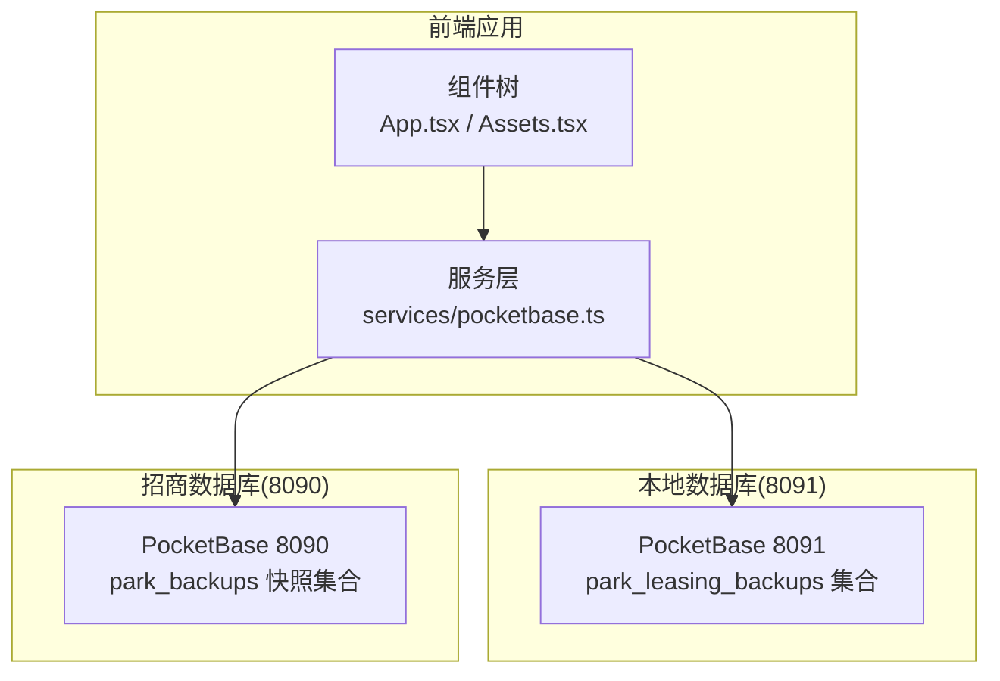
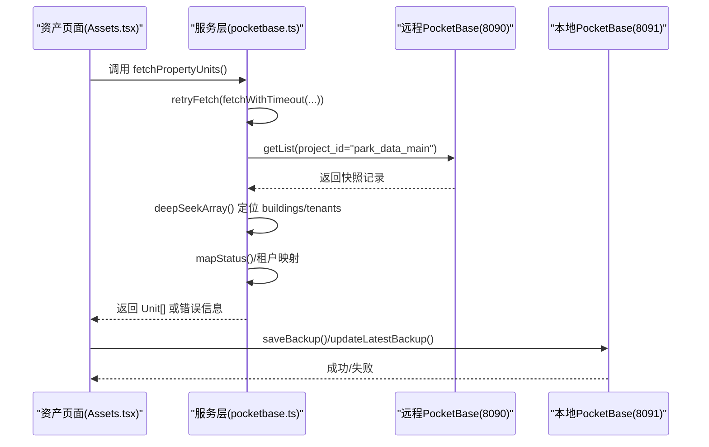
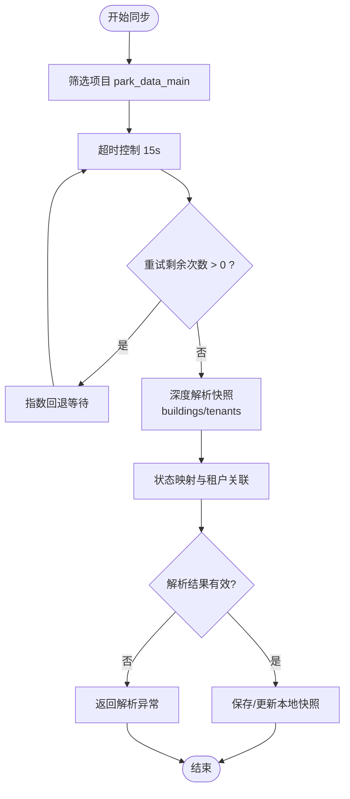
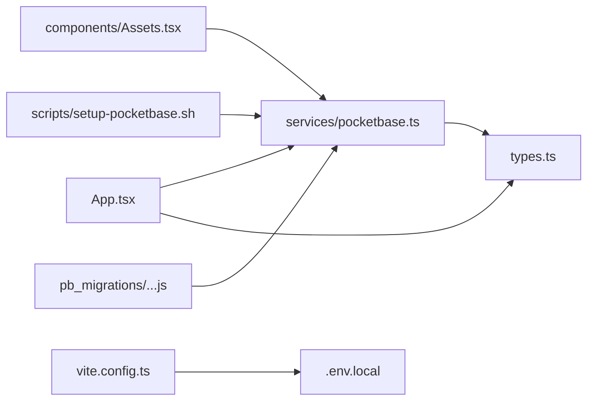

# PocketBase集成

<cite>
**本文引用的文件**
- [services/pocketbase.ts](file://services/pocketbase.ts)
- [.env.local](file://.env.local)
- [types.ts](file://types.ts)
- [components/Assets.tsx](file://components/Assets.tsx)
- [App.tsx](file://App.tsx)
- [scripts/setup-pocketbase.sh](file://scripts/setup-pocketbase.sh)
- [pb_migrations/1770189507_created_park_leasing_backups.js](file://pb_migrations/1770189507_created_park_leasing_backups.js)
- [MIGRATION_SUMMARY.md](file://MIGRATION_SUMMARY.md)
- [vite.config.ts](file://vite.config.ts)
- [index.tsx](file://index.tsx)
</cite>

## 目录
1. [简介](#简介)
2. [项目结构](#项目结构)
3. [核心组件](#核心组件)
4. [架构总览](#架构总览)
5. [详细组件分析](#详细组件分析)
6. [依赖关系分析](#依赖关系分析)
7. [性能考虑](#性能考虑)
8. [故障排查指南](#故障排查指南)
9. [结论](#结论)
10. [附录](#附录)

## 简介
本项目采用双数据库架构：本地业务数据库（8091端口）用于存储本系统的业务快照与本地备份；招商管理系统数据库（8090端口）作为资产数据源，提供房源快照与租户信息。前端通过两个PocketBase实例分别进行数据读写与同步，实现“本地快照存储 + 远程资产同步”的协同工作模式。

- 本地实例（8091）：负责业务快照的保存、加载与自动同步，确保本地数据持久化与离线可用性。
- 远程实例（8090）：提供招商管理系统的资产快照数据，前端定时或手动触发同步，将远端快照映射为本地Unit模型。

## 项目结构
项目采用前端React + PocketBase的前后端一体化架构，关键目录与文件如下：
- services/pocketbase.ts：定义两个PocketBase客户端、同步与备份相关方法、错误处理与重试逻辑。
- components/Assets.tsx：资产页面，负责调用同步方法、展示连接状态与错误信息。
- App.tsx：应用入口，负责自动保存、手动刷新、数据合并与状态管理。
- .env.local：环境变量，包含Gemini API密钥以及两个PocketBase实例的URL。
- scripts/setup-pocketbase.sh：初始化脚本，指导在8091端口创建park_leasing_backups集合。
- pb_migrations/1770189507_created_park_leasing_backups.js：集合迁移脚本，定义park_leasing_backups集合结构。
- vite.config.ts：Vite配置，定义开发服务器端口、环境变量注入与依赖优化。
- index.tsx：React根节点挂载入口。

图表来源
- [services/pocketbase.ts](file://services/pocketbase.ts#L1-L20)
- [components/Assets.tsx](file://components/Assets.tsx#L1-L40)
- [App.tsx](file://App.tsx#L179-L283)
- [pb_migrations/1770189507_created_park_leasing_backups.js](file://pb_migrations/1770189507_created_park_leasing_backups.js#L1-L54)

章节来源
- [services/pocketbase.ts](file://services/pocketbase.ts#L1-L20)
- [components/Assets.tsx](file://components/Assets.tsx#L1-L40)
- [App.tsx](file://App.tsx#L179-L283)
- [vite.config.ts](file://vite.config.ts#L1-L27)

## 核心组件
- 双实例客户端
  - 本地实例：用于业务快照存储与本地备份。
  - 远程实例：用于资产数据同步。
- 同步与备份接口
  - 从远程实例读取最新快照并解析为本地Unit模型。
  - 保存/更新/加载本地快照，支持乐观锁与冲突检测。
- 错误处理与重试
  - 超时控制与指数回退重试，区分超时、取消与业务错误。
- 数据模型
  - Unit、AppData等类型定义，确保数据结构一致性。

章节来源
- [services/pocketbase.ts](file://services/pocketbase.ts#L1-L274)
- [types.ts](file://types.ts#L78-L276)

## 架构总览
双数据库架构的关键流程：
- 启动阶段：分别启动8090（招商）与8091（本地）PocketBase实例，前端通过.env.local配置URL。
- 登录阶段：登录前从8091加载最新快照，确保本地数据可用。
- 日常使用：本地数据变化自动保存至8091；资产页面可手动或自动从8090拉取最新快照并映射为本地Unit。
- 错误处理：统一的超时与重试策略，错误分类与用户提示。

图表来源
- [components/Assets.tsx](file://components/Assets.tsx#L112-L169)
- [services/pocketbase.ts](file://services/pocketbase.ts#L93-L173)
- [services/pocketbase.ts](file://services/pocketbase.ts#L178-L227)

## 详细组件分析

### 服务层：双实例与同步逻辑
- 双实例初始化
  - 本地实例：http://127.0.0.1:8091
  - 远程实例：http://127.0.0.1:8090
- 同步流程
  - 从远程实例按项目筛选最新快照，超时15秒，最多重试2次。
  - 深度搜索快照中的buildings/tenants容器，建立租户映射。
  - 将远程单位映射为本地Unit模型，自动识别占用状态与租户名称。
- 备份与加载
  - 保存：create(name, data)
  - 更新：按最新记录ID更新，支持乐观锁冲突检测（409/冲突标识）
  - 加载：按创建时间倒序取第一条，或获取全量备份列表

图表来源
- [services/pocketbase.ts](file://services/pocketbase.ts#L93-L173)
- [services/pocketbase.ts](file://services/pocketbase.ts#L178-L227)

章节来源
- [services/pocketbase.ts](file://services/pocketbase.ts#L1-L274)

### 资产页面：连接状态与错误提示
- 连接状态
  - connected/disconnected/syncing 三态指示器，结合图标与颜色反馈。
- 错误分类
  - 超时、取消、业务异常分别提示不同信息，避免用户困惑。
- 同步元数据
  - 展示快照名称与创建时间，便于溯源。

章节来源
- [components/Assets.tsx](file://components/Assets.tsx#L112-L169)

### 应用入口：自动保存与手动刷新
- 自动保存
  - 数据变化时1秒防抖后调用updateLatestBackup，提升实时性。
- 手动刷新
  - 登录或手动点击“刷新数据”，从8091加载最新快照并还原到本地状态。
- 数据合并
  - 合并本地与云端数据，优先保留本地最新版本，同时维护删除标记以防止僵尸数据复活。

章节来源
- [App.tsx](file://App.tsx#L252-L283)
- [App.tsx](file://App.tsx#L304-L355)
- [App.tsx](file://App.tsx#L16-L75)

### 类型模型：Unit与AppData
- Unit：楼宇、楼层、房号、面积、状态、租户名称、价格、空置起始时间等字段。
- AppData：包含商机、渠道、佣金、单位、规则、政策历史、活动、用户、设置与删除ID集合。

章节来源
- [types.ts](file://types.ts#L78-L276)

## 依赖关系分析
- 服务层依赖
  - pocketbase：用于与两个PocketBase实例通信。
  - types：共享数据模型与枚举。
- 组件依赖
  - Assets.tsx依赖pocketbase服务与单位热度分析工具。
  - App.tsx依赖pocketbase服务与mock数据。
- 构建与环境
  - vite.config.ts定义开发服务器端口3000，注入环境变量，排除pocketbase依赖优化。
  - .env.local提供GEMINI_API_KEY与两个PocketBase URL。

图表来源
- [services/pocketbase.ts](file://services/pocketbase.ts#L1-L3)
- [types.ts](file://types.ts#L1-L20)
- [components/Assets.tsx](file://components/Assets.tsx#L1-L10)
- [App.tsx](file://App.tsx#L1-L20)
- [vite.config.ts](file://vite.config.ts#L1-L27)
- [scripts/setup-pocketbase.sh](file://scripts/setup-pocketbase.sh#L1-L55)
- [pb_migrations/1770189507_created_park_leasing_backups.js](file://pb_migrations/1770189507_created_park_leasing_backups.js#L1-L54)

章节来源
- [services/pocketbase.ts](file://services/pocketbase.ts#L1-L3)
- [types.ts](file://types.ts#L1-L20)
- [components/Assets.tsx](file://components/Assets.tsx#L1-L10)
- [App.tsx](file://App.tsx#L1-L20)
- [vite.config.ts](file://vite.config.ts#L1-L27)
- [scripts/setup-pocketbase.sh](file://scripts/setup-pocketbase.sh#L1-L55)
- [pb_migrations/1770189507_created_park_leasing_backups.js](file://pb_migrations/1770189507_created_park_leasing_backups.js#L1-L54)

## 性能考虑
- 自动保存防抖：1秒延迟减少频繁写入，平衡实时性与性能。
- 超时与重试：15秒超时+最多2次重试，避免长时间阻塞；指数回退降低瞬时压力。
- 乐观锁：更新冲突时返回冲突标志，避免数据覆盖。
- 依赖优化：Vite排除pocketbase以减少预打包体积，提升冷启动速度。

章节来源
- [App.tsx](file://App.tsx#L252-L283)
- [services/pocketbase.ts](file://services/pocketbase.ts#L47-L87)
- [vite.config.ts](file://vite.config.ts#L22-L24)

## 故障排查指南
- 端口与服务
  - 确认8090（招商）与8091（本地）PocketBase均已启动。
  - 前端通过.env.local配置URL，确保地址与端口一致。
- 集合与权限
  - 在8091管理后台创建park_leasing_backups集合，字段包含name与data，API规则允许无认证访问。
  - 如需自动化，可参考初始化脚本与迁移文件。
- 跨域问题
  - 若出现跨域，可在PocketBase管理后台的Application设置中添加允许来源。
- 常见错误
  - “未发现项目 park_data_main 的云端资产快照”：检查远程实例中是否存在该快照。
  - “解析成功但未提取到房源”：确认快照内buildings容器包含有效单元数据。
  - “同步超时/请求被取消”：检查网络与远程服务稳定性，适当延长超时或减少数据量。

章节来源
- [scripts/setup-pocketbase.sh](file://scripts/setup-pocketbase.sh#L1-L55)
- [pb_migrations/1770189507_created_park_leasing_backups.js](file://pb_migrations/1770189507_created_park_leasing_backups.js#L1-L54)
- [MIGRATION_SUMMARY.md](file://MIGRATION_SUMMARY.md#L49-L111)
- [services/pocketbase.ts](file://services/pocketbase.ts#L93-L173)

## 结论
本项目通过双数据库架构实现了“本地快照存储 + 远程资产同步”的稳健方案。本地实例保障业务数据的持久化与离线能力，远程实例提供权威的资产快照来源。配合完善的错误处理、重试与乐观锁机制，系统在复杂网络环境下仍能保持稳定与可靠。建议在生产环境中进一步完善监控与告警，确保两个实例的健康状态与数据一致性。

## 附录

### 环境变量与URL配置
- GEMINI_API_KEY：AI相关API密钥（前端使用）。
- POCKETBASE_URL：本地PocketBase地址（8091）。
- POCKETBASE_PROPERTY_URL：招商管理PocketBase地址（8090）。

章节来源
- [.env.local](file://.env.local#L1-L4)

### 启动与初始化流程
- 启动顺序
  - 先启动招商管理PocketBase（8090），再启动本地PocketBase（8091），最后启动前端应用。
- 初始化集合
  - 通过管理后台创建park_leasing_backups集合，或使用初始化脚本辅助。
- 迁移与导入
  - 可将Supabase导出数据导入到本地PocketBase集合。

章节来源
- [MIGRATION_SUMMARY.md](file://MIGRATION_SUMMARY.md#L90-L111)
- [scripts/setup-pocketbase.sh](file://scripts/setup-pocketbase.sh#L1-L55)
- [pb_migrations/1770189507_created_park_leasing_backups.js](file://pb_migrations/1770189507_created_park_leasing_backups.js#L1-L54)