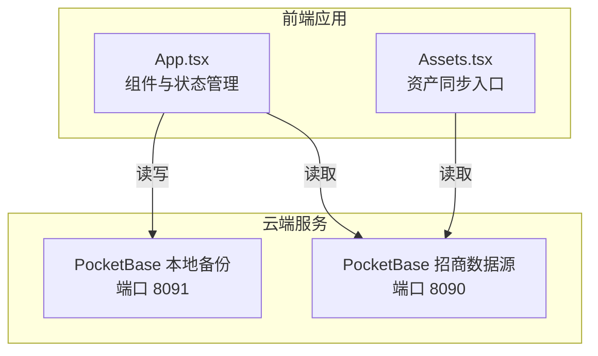
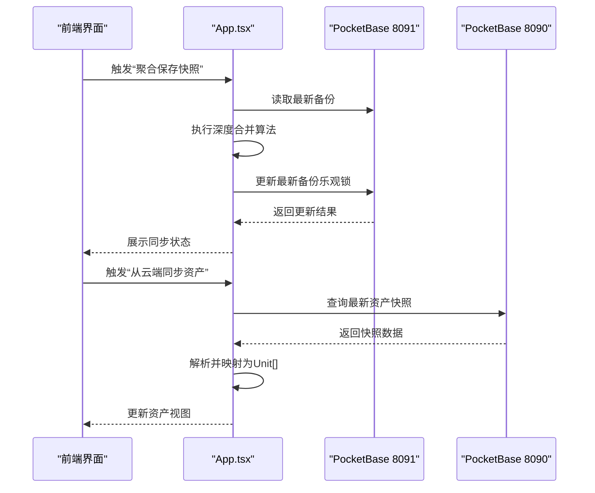
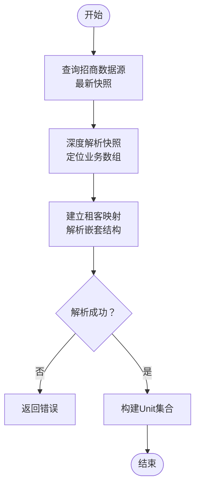
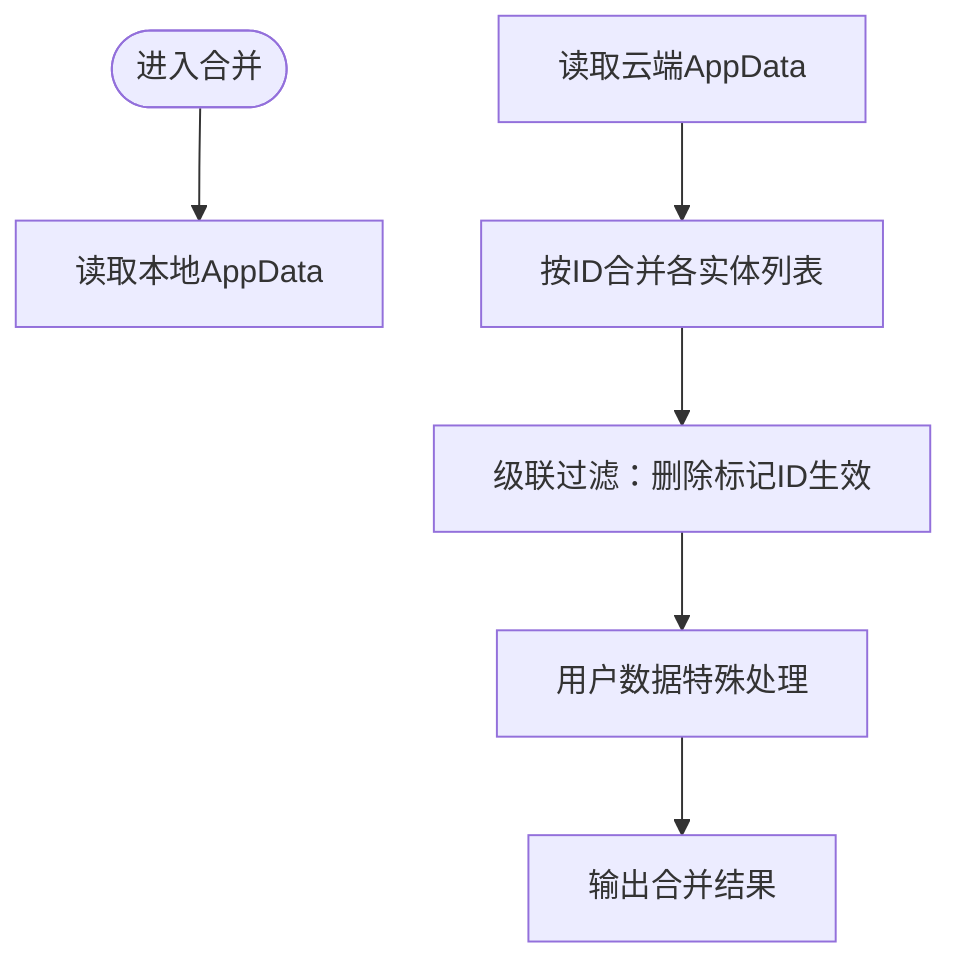
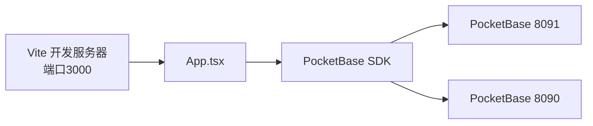

# 云端集成

<cite>
**本文档引用的文件**
- [services/pocketbase.ts](file://services/pocketbase.ts)
- [scripts/setup-pocketbase.sh](file://scripts/setup-pocketbase.sh)
- [pb_migrations/1770189507_created_park_leasing_backups.js](file://pb_migrations/1770189507_created_park_leasing_backups.js)
- [.env.local](file://.env.local)
- [types.ts](file://types.ts)
- [App.tsx](file://App.tsx)
- [components/Assets.tsx](file://components/Assets.tsx)
- [MIGRATION_SUMMARY.md](file://MIGRATION_SUMMARY.md)
- [README.md](file://README.md)
- [vite.config.ts](file://vite.config.ts)
- [services/mockData.ts](file://services/mockData.ts)
</cite>

## 目录
1. [简介](#简介)
2. [项目结构](#项目结构)
3. [核心组件](#核心组件)
4. [架构总览](#架构总览)
5. [详细组件分析](#详细组件分析)
6. [依赖关系分析](#依赖关系分析)
7. [性能考量](#性能考量)
8. [故障排查指南](#故障排查指南)
9. [结论](#结论)
10. [附录](#附录)

## 简介
本文件面向“上海商机及渠道管理系统（v5.0）”的云端集成架构，聚焦于PocketBase集成方案与云端数据同步机制。内容涵盖：
- 数据库连接配置与环境变量
- 数据同步机制与核心算法（深度合并、冲突检测与解决、并发控制）
- 数据快照管理（创建、更新、版本与历史追踪）
- 数据库迁移管理（结构变更、数据迁移、向后兼容）
- 云端服务配置（端口、网络、安全策略）
- 性能优化建议（压缩、批量、缓存）
- 故障恢复与监控告警、运维最佳实践

## 项目结构
系统采用前端React + Vite，后端以PocketBase作为本地数据库与云端备份存储，同时通过独立实例对接招商管理系统的云端数据源。

图表来源
- [App.tsx](file://App.tsx#L179-L589)
- [components/Assets.tsx](file://components/Assets.tsx#L1-L200)
- [services/pocketbase.ts](file://services/pocketbase.ts#L1-L274)
- [.env.local](file://.env.local#L1-L4)

章节来源
- [App.tsx](file://App.tsx#L179-L589)
- [components/Assets.tsx](file://components/Assets.tsx#L1-L200)
- [services/pocketbase.ts](file://services/pocketbase.ts#L1-L274)
- [.env.local](file://.env.local#L1-L4)

## 核心组件
- 服务层：PocketBase客户端封装与数据同步逻辑
- 应用层：深度合并算法、自动/手动同步、并发冲突处理
- 组件层：资产页面对接云端数据源
- 迁移层：Collection定义与初始化脚本

章节来源
- [services/pocketbase.ts](file://services/pocketbase.ts#L1-L274)
- [types.ts](file://types.ts#L243-L276)
- [App.tsx](file://App.tsx#L16-L75)
- [components/Assets.tsx](file://components/Assets.tsx#L1-L200)
- [pb_migrations/1770189507_created_park_leasing_backups.js](file://pb_migrations/1770189507_created_park_leasing_backups.js#L1-L54)

## 架构总览
系统通过两个PocketBase实例协同工作：
- 本地备份实例（8091）：存放应用聚合后的快照，支持自动/手动保存与历史版本管理
- 招商数据源实例（8090）：提供资产快照数据，供前端按需拉取并映射为本地Unit模型

图表来源
- [App.tsx](file://App.tsx#L300-L375)
- [services/pocketbase.ts](file://services/pocketbase.ts#L93-L173)
- [components/Assets.tsx](file://components/Assets.tsx#L112-L169)

## 详细组件分析

### 服务层：PocketBase集成与同步
- 客户端配置
  - 本地备份实例：http://127.0.0.1:8091
  - 招商数据源实例：http://127.0.0.1:8090
- 数据同步流程
  - 从招商数据源读取最新快照，定位业务数组，建立租客映射，解析嵌套结构，生成本地Unit集合
  - 将解析结果返回调用方，用于资产页面展示与后续聚合
- 备份管理
  - 保存：创建新记录
  - 更新：更新最新记录（带时间戳），用于自动同步场景
  - 加载：获取最新备份
  - 列表：获取历史备份列表
- 错误处理
  - 超时控制与自动重试
  - 并发冲突检测（HTTP 409或冲突消息）

图表来源
- [services/pocketbase.ts](file://services/pocketbase.ts#L93-L173)

章节来源
- [services/pocketbase.ts](file://services/pocketbase.ts#L1-L274)
- [.env.local](file://.env.local#L1-L4)

### 应用层：深度合并策略与并发控制
- 深度合并算法
  - 基于ID去重，云端优先（初始阶段），随后本地覆盖（优先级最高）
  - 特殊处理：用户数据在云端为空时保留本地有效数据
  - 级联删除过滤：删除标记ID集合统一生效，防止僵尸子数据复活
- 并发控制
  - 自动更新最新备份采用“更新现有记录”策略，避免创建过多快照
  - 冲突检测：当返回409或冲突信息时，重新加载并二次合并
  - 自动同步：3秒防抖，避免频繁写入
- 状态与UI反馈
  - 同步状态枚举：IDLE/SAVING/MERGING/SUCCESS/ERROR
  - 云端状态指示器与最后同步时间

图表来源
- [App.tsx](file://App.tsx#L16-L75)

章节来源
- [App.tsx](file://App.tsx#L16-L75)
- [App.tsx](file://App.tsx#L328-L375)

### 组件层：资产页面与云端数据源对接
- 自动同步：组件挂载时自动触发一次同步
- 手动同步：点击按钮触发，支持静默模式
- 错误分类：超时、取消、其他异常分别提示
- 连接状态：云端直连、握手交互、连接中断三态显示

章节来源
- [components/Assets.tsx](file://components/Assets.tsx#L1-L200)

### 数据模型与快照结构
- AppData：包含商机、渠道、佣金、单位、规则、日志、活动、用户、设置等
- CloudSnapshot：快照元数据（id/name/createdAt）+ 数据体
- Unit：资产单元，含楼栋、楼层、房号、面积、状态、租户等

章节来源
- [types.ts](file://types.ts#L243-L276)
- [types.ts](file://types.ts#L78-L88)

### 数据库迁移与Collection管理
- Collection定义：park_leasing_backups（文本字段name、JSON字段data）
- 迁移脚本：创建/删除Collection
- 初始化脚本：引导在管理后台创建Collection与API规则

章节来源
- [pb_migrations/1770189507_created_park_leasing_backups.js](file://pb_migrations/1770189507_created_park_leasing_backups.js#L1-L54)
- [scripts/setup-pocketbase.sh](file://scripts/setup-pocketbase.sh#L1-L55)
- [MIGRATION_SUMMARY.md](file://MIGRATION_SUMMARY.md#L1-L224)

## 依赖关系分析
- 前端依赖PocketBase SDK
- 开发服务器端口3000，Host绑定0.0.0.0
- 环境变量驱动PocketBase URL配置

图表来源
- [vite.config.ts](file://vite.config.ts#L1-L27)
- [services/pocketbase.ts](file://services/pocketbase.ts#L1-L10)
- [.env.local](file://.env.local#L1-L4)

章节来源
- [vite.config.ts](file://vite.config.ts#L1-L27)
- [services/pocketbase.ts](file://services/pocketbase.ts#L1-L10)
- [.env.local](file://.env.local#L1-L4)

## 性能考量
- 数据压缩
  - JSON字段最大大小限制已在迁移脚本中设定，避免单条记录过大
- 批量操作
  - 自动同步采用3秒防抖，减少频繁写入
  - 资产同步建议手动触发，避免频繁拉取
- 缓存策略
  - 可在前端增加资产数据缓存（例如5-10分钟），降低对数据源的压力
- 网络与超时
  - 同步过程内置超时与重试，建议结合业务场景调整重试次数与延迟倍数

章节来源
- [pb_migrations/1770189507_created_park_leasing_backups.js](file://pb_migrations/1770189507_created_park_leasing_backups.js#L33-L36)
- [services/pocketbase.ts](file://services/pocketbase.ts#L50-L87)
- [MIGRATION_SUMMARY.md](file://MIGRATION_SUMMARY.md#L201-L207)

## 故障排查指南
- PocketBase未运行或端口占用
  - 检查8091与8090端口是否启动
  - 按初始化脚本在管理后台创建Collection与API规则
- 跨域问题
  - 在PocketBase管理后台设置Allowed Origins，添加前端地址
- 同步失败
  - 超时：检查网络与数据源可用性
  - 取消/异常：查看控制台错误并重试
- 并发冲突
  - 自动重试与二次合并逻辑会自动处理；如仍失败，检查数据源一致性

章节来源
- [scripts/setup-pocketbase.sh](file://scripts/setup-pocketbase.sh#L1-L55)
- [MIGRATION_SUMMARY.md](file://MIGRATION_SUMMARY.md#L82-L87)
- [services/pocketbase.ts](file://services/pocketbase.ts#L93-L173)
- [components/Assets.tsx](file://components/Assets.tsx#L112-L169)

## 结论
本方案以PocketBase为核心，实现了本地快照聚合与云端数据源对接，具备完善的深度合并、冲突检测与并发控制能力。通过明确的迁移与初始化流程、合理的性能与容错设计，系统可在本地化部署下稳定支撑业务运行，并为后续扩展提供清晰路径。

## 附录

### 云端服务配置清单
- 环境变量
  - GEMINI_API_KEY：AI相关能力配置
  - POCKETBASE_URL：本地备份实例URL
  - POCKETBASE_PROPERTY_URL：招商数据源URL
- 端口
  - 3000：前端开发服务器
  - 8090：招商数据源（只读）
  - 8091：本地备份（读写）
- 网络与安全
  - 允许来源：根据实际域名配置
  - API规则：允许无认证访问（开发环境）

章节来源
- [.env.local](file://.env.local#L1-L4)
- [MIGRATION_SUMMARY.md](file://MIGRATION_SUMMARY.md#L82-L87)
- [vite.config.ts](file://vite.config.ts#L1-L27)

### 数据快照管理操作指引
- 创建快照
  - 手动触发“聚合并保存”，输入快照名称
- 更新快照
  - 自动同步：后台3秒防抖后更新最新备份
  - 并发冲突：检测到冲突后自动重载并二次合并
- 历史记录
  - 通过历史列表查看与回放

章节来源
- [App.tsx](file://App.tsx#L328-L375)
- [services/pocketbase.ts](file://services/pocketbase.ts#L178-L273)

### 数据库迁移与兼容性
- 结构变更
  - 通过迁移脚本创建/删除Collection
- 数据迁移
  - 可选：导出旧数据后导入新系统
- 向后兼容
  - 保持字段与模型兼容，必要时在迁移脚本中声明字段映射

章节来源
- [pb_migrations/1770189507_created_park_leasing_backups.js](file://pb_migrations/1770189507_created_park_leasing_backups.js#L1-L54)
- [MIGRATION_SUMMARY.md](file://MIGRATION_SUMMARY.md#L1-L224)