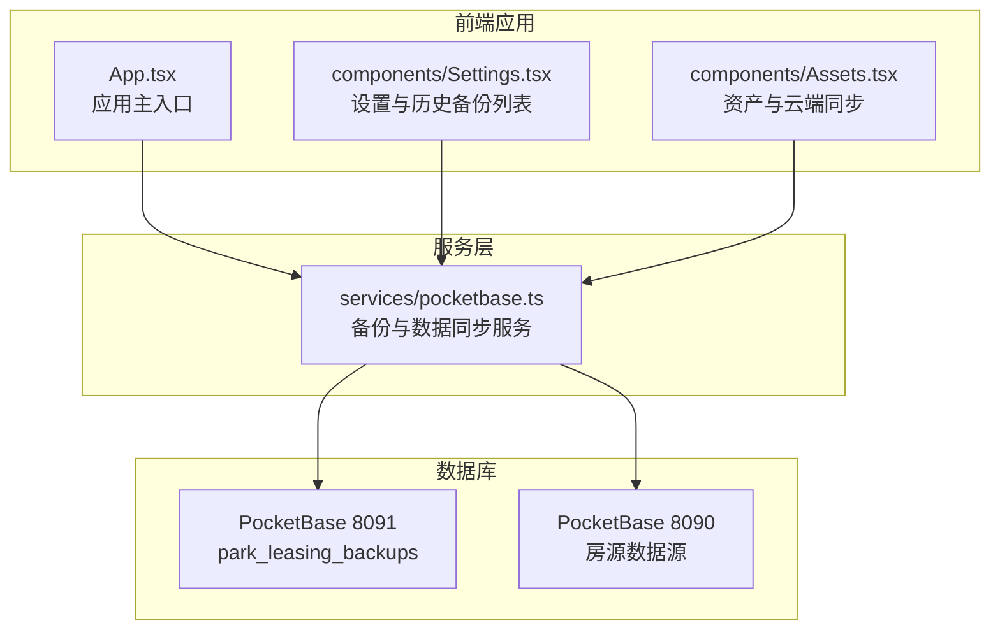
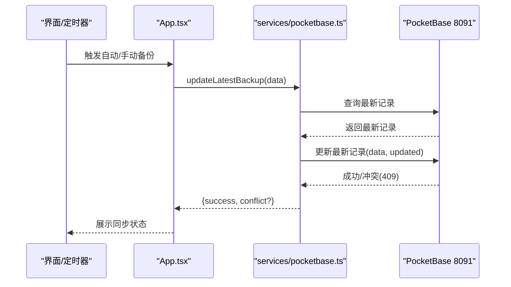
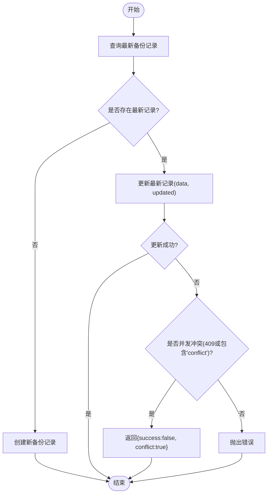
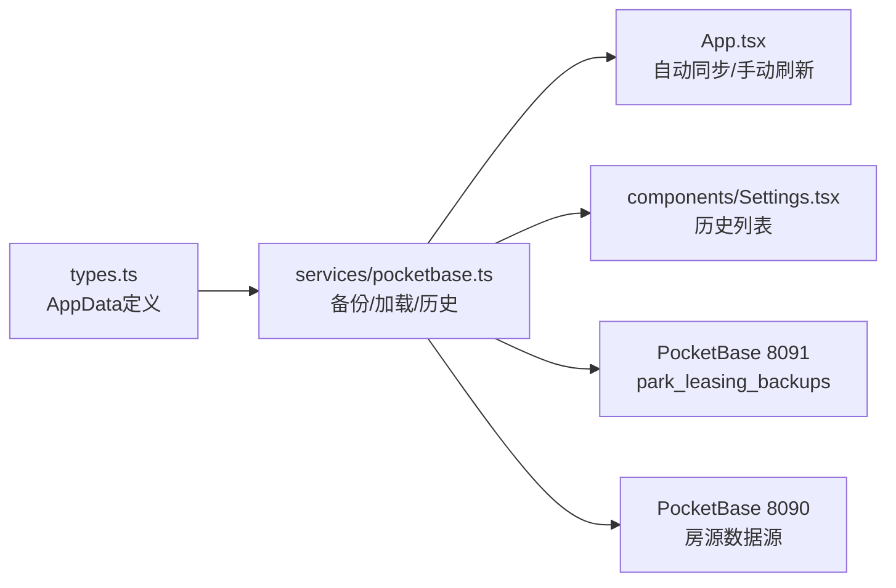

# 备份管理

<cite>
**本文引用的文件**
- [services/pocketbase.ts](file://services/pocketbase.ts)
- [types.ts](file://types.ts)
- [App.tsx](file://App.tsx)
- [components/Settings.tsx](file://components/Settings.tsx)
- [pb_migrations/1770189507_created_park_leasing_backups.js](file://pb_migrations/1770189507_created_park_leasing_backups.js)
- [MIGRATION_SUMMARY.md](file://MIGRATION_SUMMARY.md)
- [scripts/setup-pocketbase.sh](file://scripts/setup-pocketbase.sh)
- [components/Assets.tsx](file://components/Assets.tsx)
</cite>

## 目录
1. [简介](#简介)
2. [项目结构](#项目结构)
3. [核心组件](#核心组件)
4. [架构概览](#架构概览)
5. [详细组件分析](#详细组件分析)
6. [依赖关系分析](#依赖关系分析)
7. [性能考量](#性能考量)
8. [故障排查指南](#故障排查指南)
9. [结论](#结论)
10. [附录](#附录)

## 简介
本技术文档围绕备份管理系统展开，重点阐述备份创建(saveBackup)与更新(updateLatestBackup)的实现机制，解释乐观锁如何防止并发冲突，备份数据结构设计（名称、时间戳、业务数据存储格式），以及备份历史管理(getAllBackups)与最新备份加载(loadLatestBackup)的实现。同时涵盖数据库迁移策略、向后兼容性保障、备份恢复流程、数据完整性验证与存储空间管理的最佳实践。

## 项目结构
该项目采用前端React应用与PocketBase数据库结合的架构。备份数据存储于独立的PocketBase实例（端口8091），并与另一个用于房源数据的PocketBase实例（端口8090）协同工作。核心备份能力由服务层封装，应用层负责触发与展示。

图表来源
- [services/pocketbase.ts](file://services/pocketbase.ts#L1-L290)
- [App.tsx](file://App.tsx#L1-L560)
- [components/Settings.tsx](file://components/Settings.tsx#L1-L200)
- [components/Assets.tsx](file://components/Assets.tsx#L1-L200)

章节来源
- [services/pocketbase.ts](file://services/pocketbase.ts#L1-L290)
- [App.tsx](file://App.tsx#L1-L560)
- [components/Settings.tsx](file://components/Settings.tsx#L1-L200)
- [components/Assets.tsx](file://components/Assets.tsx#L1-L200)

## 核心组件
- 备份创建(saveBackup)：将当前应用状态以JSON形式写入park_leasing_backups集合，生成一条新的备份记录。
- 备份更新(updateLatestBackup)：在存在最新备份的前提下，对最新记录进行更新，使用乐观锁策略检测并发冲突。
- 最新备份加载(loadLatestBackup)：按创建时间倒序取第一条记录，返回名称、业务数据与创建时间。
- 备份历史管理(getAllBackups)：列出所有备份的标识、名称与创建时间，便于历史追溯与选择恢复点。
- 数据模型(types.ts)：定义AppData结构，包含商机、渠道、佣金、单位、政策、活动、用户等业务实体与设置项。
- 迁移与配置：通过迁移脚本与管理后台创建park_leasing_backups集合，确保字段与规则满足备份需求。

章节来源
- [services/pocketbase.ts](file://services/pocketbase.ts#L194-L243)
- [services/pocketbase.ts](file://services/pocketbase.ts#L248-L268)
- [services/pocketbase.ts](file://services/pocketbase.ts#L273-L289)
- [types.ts](file://types.ts#L243-L256)
- [pb_migrations/1770189507_created_park_leasing_backups.js](file://pb_migrations/1770189507_created_park_leasing_backups.js#L1-L54)

## 架构概览
备份系统采用“应用层触发+服务层封装+数据库持久化”的三层架构。应用层通过定时器与用户操作触发备份；服务层封装与数据库交互；数据库使用JSON字段存储完整的业务数据，确保可恢复性与可移植性。

图表来源
- [App.tsx](file://App.tsx#L255-L283)
- [services/pocketbase.ts](file://services/pocketbase.ts#L210-L243)

## 详细组件分析

### 备份创建(saveBackup)
- 功能：将传入的业务数据写入park_leasing_backups集合，生成一条新的备份记录。
- 输入：备份名称、AppData对象。
- 输出：无返回值，异常时抛出错误。
- 关键点：
  - 使用集合create接口写入。
  - JSON字段承载完整业务数据，便于后续恢复。
  - 异常统一捕获并抛出，便于上层处理。

章节来源
- [services/pocketbase.ts](file://services/pocketbase.ts#L194-L204)

### 备份更新(updateLatestBackup)与乐观锁
- 功能：在存在最新备份的前提下，更新最新记录的数据与更新时间戳；若发生并发冲突，返回冲突信号以便上层重试或回退。
- 并发冲突检测：
  - 若底层返回状态码409或消息包含“conflict”，判定为并发冲突。
  - 上层收到冲突信号后，可选择重试或降级处理。
- 冲突处理策略：
  - 重试：指数回退或固定延迟重试。
  - 回退：提示用户或记录日志，避免无限重试。
- 时间戳更新：
  - 更新时写入updated字段，确保排序与审计一致性。

图表来源
- [services/pocketbase.ts](file://services/pocketbase.ts#L210-L243)

章节来源
- [services/pocketbase.ts](file://services/pocketbase.ts#L210-L243)

### 最新备份加载(loadLatestBackup)
- 功能：按创建时间倒序取第一条记录，返回名称、业务数据与创建时间。
- 场景：登录时直接加载云端数据，或手动刷新数据。
- 异常处理：捕获并抛出错误，便于UI提示。

章节来源
- [services/pocketbase.ts](file://services/pocketbase.ts#L248-L268)
- [App.tsx](file://App.tsx#L304-L328)

### 备份历史管理(getAllBackups)
- 功能：获取所有备份的标识、名称与创建时间，用于历史列表展示。
- 实现：调用集合全量读取，限制字段，按创建时间倒序。
- 使用场景：设置页展示历史快照，供选择恢复点。

章节来源
- [services/pocketbase.ts](file://services/pocketbase.ts#L273-L289)
- [components/Settings.tsx](file://components/Settings.tsx#L42-L53)

### 数据模型与存储格式(AppData)
- 结构：包含商机、渠道、佣金、单位、政策、活动、用户、设置与删除ID集合等。
- 存储：以JSON字段存储在park_leasing_backups集合的data字段中，确保可恢复性与可移植性。
- 删除标记：deletedIds用于级联过滤，防止云端恢复时“僵尸数据”复活。

章节来源
- [types.ts](file://types.ts#L243-L256)

### 数据库迁移与集合创建
- 迁移脚本：定义park_leasing_backups集合，包含name与data(JSON)字段。
- 管理后台配置：通过脚本引导在管理后台创建集合、设置字段与API规则。
- 兼容性：迁移后原有业务逻辑无需改动，仅替换数据源。

章节来源
- [pb_migrations/1770189507_created_park_leasing_backups.js](file://pb_migrations/1770189507_created_park_leasing_backups.js#L1-L54)
- [MIGRATION_SUMMARY.md](file://MIGRATION_SUMMARY.md#L49-L87)
- [scripts/setup-pocketbase.sh](file://scripts/setup-pocketbase.sh#L1-L55)

## 依赖关系分析
- 应用层依赖服务层：App.tsx与Settings.tsx通过导入服务函数实现备份与历史管理。
- 服务层依赖数据库：pocketbase.ts封装与PocketBase的交互。
- 数据模型依赖：types.ts定义AppData，服务层与应用层均依赖该类型。

图表来源
- [types.ts](file://types.ts#L243-L256)
- [services/pocketbase.ts](file://services/pocketbase.ts#L1-L290)
- [App.tsx](file://App.tsx#L1-L560)
- [components/Settings.tsx](file://components/Settings.tsx#L1-L200)

章节来源
- [types.ts](file://types.ts#L243-L256)
- [services/pocketbase.ts](file://services/pocketbase.ts#L1-L290)
- [App.tsx](file://App.tsx#L1-L560)
- [components/Settings.tsx](file://components/Settings.tsx#L1-L200)

## 性能考量
- 自动同步频率：应用层采用1秒防抖，平衡实时性与性能开销。
- 并发冲突处理：乐观锁检测冲突后返回信号，上层可选择重试或回退，避免阻塞。
- 数据体积：JSON字段最大大小受集合配置约束，建议定期清理冗余数据或拆分备份。
- 网络与超时：服务层对外部请求设置超时与重试，降低不稳定因素影响。

章节来源
- [App.tsx](file://App.tsx#L255-L283)
- [services/pocketbase.ts](file://services/pocketbase.ts#L66-L103)

## 故障排查指南
- 未找到备份数据：loadLatestBackup返回null，需检查集合是否存在数据或权限设置。
- 并发冲突：updateLatestBackup返回{success:false, conflict:true}，建议增加重试与退避策略。
- 网络超时/取消：fetchWithTimeout与retryFetch封装了超时与重试，注意检查网络与服务端状态。
- 集合配置问题：确认park_leasing_backups集合已创建且API规则允许访问。

章节来源
- [services/pocketbase.ts](file://services/pocketbase.ts#L248-L268)
- [services/pocketbase.ts](file://services/pocketbase.ts#L210-L243)
- [services/pocketbase.ts](file://services/pocketbase.ts#L66-L103)
- [MIGRATION_SUMMARY.md](file://MIGRATION_SUMMARY.md#L49-L87)

## 结论
备份管理系统通过服务层抽象与数据库封装，实现了可靠的备份创建、更新与加载能力。乐观锁机制有效防止并发冲突，配合重试与回退策略提升稳定性。数据模型以JSON存储完整业务数据，确保可恢复性与可移植性。迁移与配置流程清晰，保障了向后兼容与平滑过渡。

## 附录

### 备份恢复流程最佳实践
- 选择恢复点：通过getAllBackups获取历史列表，选择合适的时间点。
- 数据完整性验证：恢复前对比关键指标（如单位数量、商机数量），确认数据一致性。
- 分阶段恢复：先恢复核心数据，再逐步恢复关联数据，减少冲突概率。
- 日志与审计：记录恢复过程与结果，便于问题追踪与责任界定。

章节来源
- [services/pocketbase.ts](file://services/pocketbase.ts#L273-L289)
- [App.tsx](file://App.tsx#L290-L302)

### 存储空间管理最佳实践
- 定期清理：删除不再需要的历史备份，保留关键节点。
- 压缩与归档：对旧数据进行压缩或归档，降低存储成本。
- 监控与告警：设置存储阈值告警，及时扩容或清理。
- 版本控制：对备份命名规范，便于检索与管理。

章节来源
- [pb_migrations/1770189507_created_park_leasing_backups.js](file://pb_migrations/1770189507_created_park_leasing_backups.js#L33-L36)