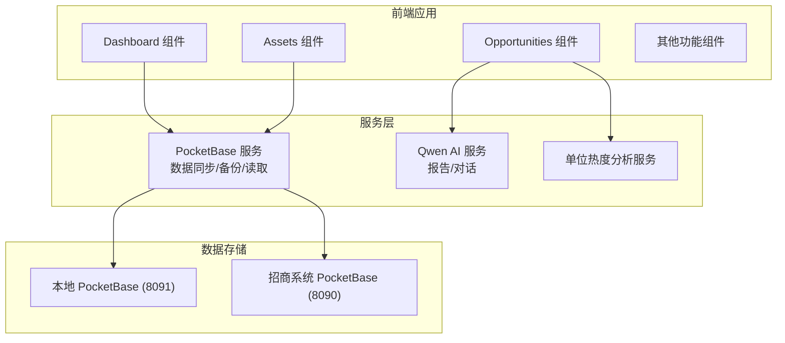
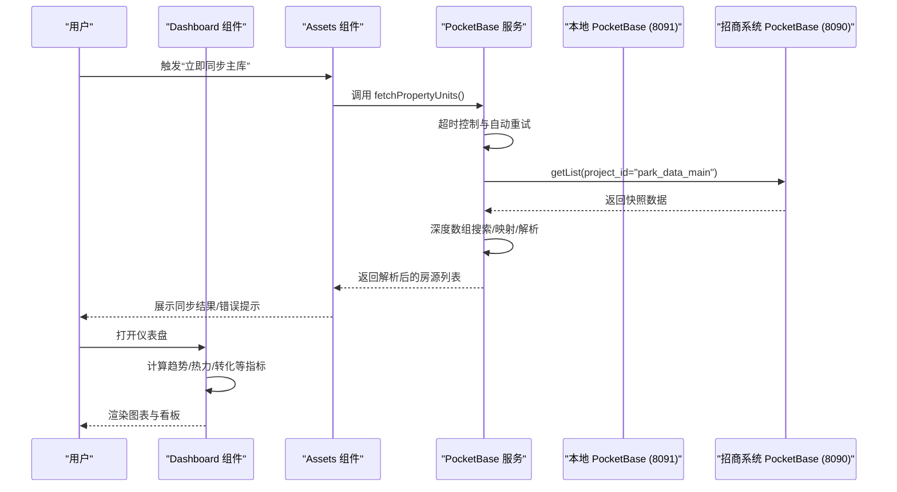
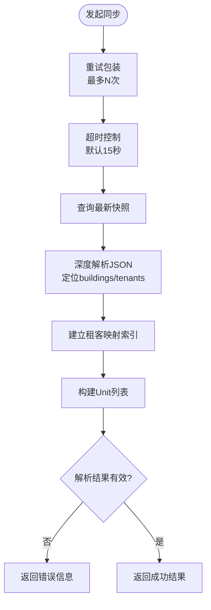
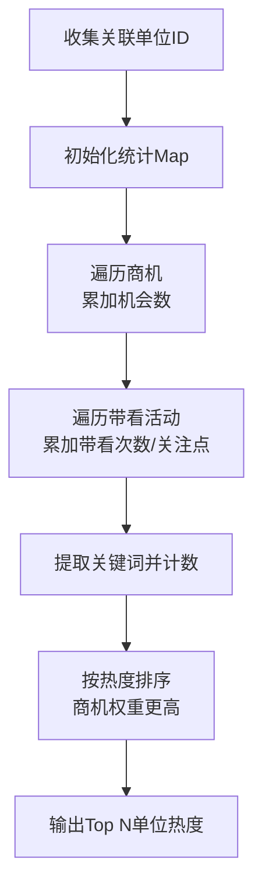
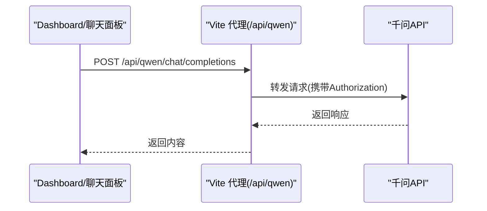
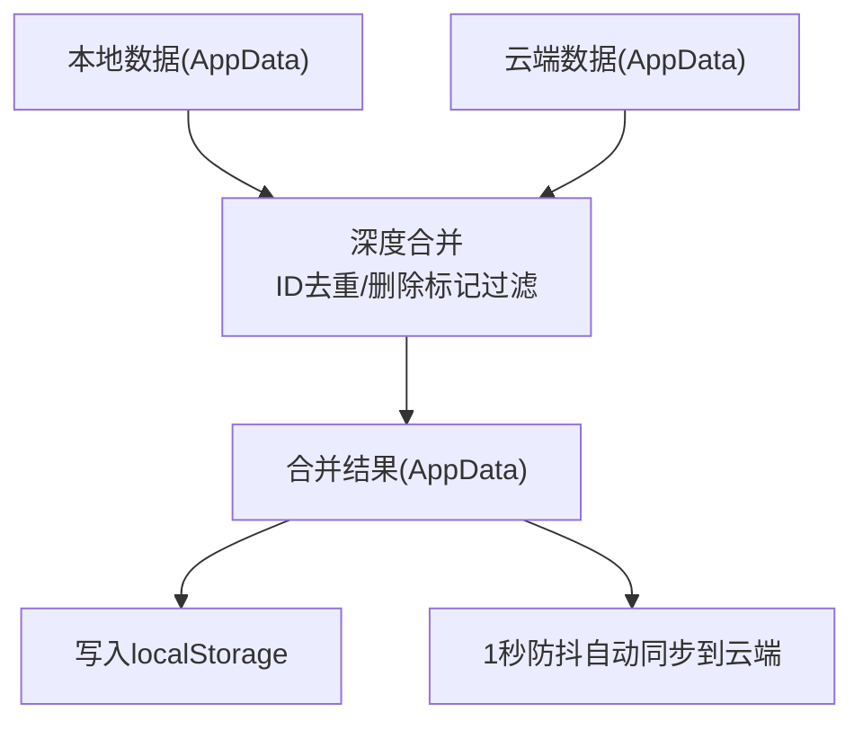
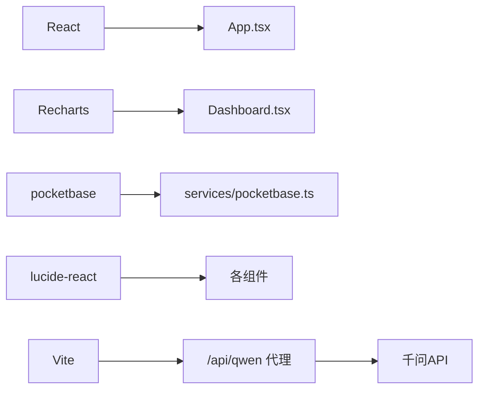

# 性能优化

<cite>
**本文引用的文件**
- [README.md](file://README.md)
- [package.json](file://package.json)
- [vite.config.ts](file://vite.config.ts)
- [tsconfig.json](file://tsconfig.json)
- [.env.local](file://.env.local)
- [services/pocketbase.ts](file://services/pocketbase.ts)
- [services/qwenAI.ts](file://services/qwenAI.ts)
- [services/unitHeatAnalytics.ts](file://services/unitHeatAnalytics.ts)
- [services/mockData.ts](file://services/mockData.ts)
- [types.ts](file://types.ts)
- [App.tsx](file://App.tsx)
- [components/Assets.tsx](file://components/Assets.tsx)
- [components/Dashboard.tsx](file://components/Dashboard.tsx)
</cite>

## 目录
1. [简介](#简介)
2. [项目结构](#项目结构)
3. [核心组件](#核心组件)
4. [架构总览](#架构总览)
5. [详细组件分析](#详细组件分析)
6. [依赖关系分析](#依赖关系分析)
7. [性能考量](#性能考量)
8. [故障排除指南](#故障排除指南)
9. [结论](#结论)
10. [附录](#附录)

## 简介
本技术文档聚焦于云端集成场景下的性能优化，围绕本项目中的数据压缩策略、批量操作优化、缓存机制设计、网络请求优化（连接复用、超时配置、重试机制）、数据库查询优化（索引策略、分页加载、批量读取）、内存管理最佳实践（数据清理、垃圾回收、资源释放）、性能监控指标、瓶颈识别方法、负载测试策略，以及生产环境部署优化建议与容量规划指导进行系统性梳理与落地建议。文档同时提供可操作的排障手册，帮助快速定位与解决问题。

## 项目结构
该项目采用前端单页应用（React + Vite）+ 本地/远程 PocketBase 数据库的架构。核心模块包括：
- 服务层：PocketBase 客户端封装、AI 对话与报告生成、单位热度分析工具
- 类型定义：统一的数据模型与枚举
- 页面组件：仪表盘、资产、商机、成交、佣金、渠道、策略、设置等
- 构建与运行：Vite 开发服务器、代理、环境变量、TypeScript 配置

**图表来源**
- [App.tsx](file://App.tsx#L179-L558)
- [components/Dashboard.tsx](file://components/Dashboard.tsx#L1-L656)
- [components/Assets.tsx](file://components/Assets.tsx#L1-L445)
- [services/pocketbase.ts](file://services/pocketbase.ts#L1-L290)
- [services/qwenAI.ts](file://services/qwenAI.ts#L1-L249)
- [services/unitHeatAnalytics.ts](file://services/unitHeatAnalytics.ts#L1-L203)

**章节来源**
- [README.md](file://README.md#L1-L21)
- [package.json](file://package.json#L1-L28)
- [vite.config.ts](file://vite.config.ts#L1-L39)
- [tsconfig.json](file://tsconfig.json#L1-L29)
- [.env.local](file://.env.local#L1-L4)

## 核心组件
- PocketBase 服务：负责云端数据同步、备份写入与读取、乐观锁更新、超时与重试控制
- 单位热度分析：基于商机与带看活动统计房源热度，支持关注点关键词提取与排行
- AI 报告与对话：通过代理访问千问 API，生成周/月/季/年报与智能问答
- 应用状态与合并：深度合并本地与云端数据，支持删除标记去重与级联过滤
- 组件层：仪表盘与资产界面承担大量数据渲染与交互，需关注渲染性能与内存占用

**章节来源**
- [services/pocketbase.ts](file://services/pocketbase.ts#L1-L290)
- [services/unitHeatAnalytics.ts](file://services/unitHeatAnalytics.ts#L1-L203)
- [services/qwenAI.ts](file://services/qwenAI.ts#L1-L249)
- [App.tsx](file://App.tsx#L17-L75)
- [components/Dashboard.tsx](file://components/Dashboard.tsx#L36-L40)
- [components/Assets.tsx](file://components/Assets.tsx#L112-L169)

## 架构总览
系统以 React 前端为核心，通过 PocketBase SDK 与本地/远程数据库交互；AI 能力通过 Vite 代理访问第三方服务。整体数据流如下：

**图表来源**
- [components/Assets.tsx](file://components/Assets.tsx#L112-L169)
- [services/pocketbase.ts](file://services/pocketbase.ts#L109-L189)
- [components/Dashboard.tsx](file://components/Dashboard.tsx#L78-L96)

## 详细组件分析

### 数据同步与备份（PocketBase 服务）
- 超时与重试：对远程请求封装超时控制与指数回退重试，避免瞬时网络波动导致失败
- 深度解析：针对复杂 JSON 结构进行递归定位关键业务数组，降低后续处理复杂度
- 乐观锁更新：在更新最新备份时捕获并发冲突，保障多端协作一致性
- 备份写入与读取：支持创建、更新、加载最新备份与全量备份列表

**图表来源**
- [services/pocketbase.ts](file://services/pocketbase.ts#L88-L103)
- [services/pocketbase.ts](file://services/pocketbase.ts#L66-L83)
- [services/pocketbase.ts](file://services/pocketbase.ts#L109-L189)

**章节来源**
- [services/pocketbase.ts](file://services/pocketbase.ts#L66-L103)
- [services/pocketbase.ts](file://services/pocketbase.ts#L109-L189)
- [services/pocketbase.ts](file://services/pocketbase.ts#L210-L243)
- [services/pocketbase.ts](file://services/pocketbase.ts#L248-L289)

### 单位热度分析（单位热度统计与关注点提取）
- 关注点关键词库：内置常见客户关注点，支持从带看描述中提取并统计
- 热度计算：综合商机关联次数与带看次数，按权重排序，支持按单位维度汇总
- 细节查询：支持查询某单位的关联商机、带看活动、关注点汇总

**图表来源**
- [services/unitHeatAnalytics.ts](file://services/unitHeatAnalytics.ts#L41-L152)

**章节来源**
- [services/unitHeatAnalytics.ts](file://services/unitHeatAnalytics.ts#L21-L32)
- [services/unitHeatAnalytics.ts](file://services/unitHeatAnalytics.ts#L37-L152)
- [services/unitHeatAnalytics.ts](file://services/unitHeatAnalytics.ts#L157-L202)

### AI 报告与对话（Qwen API 代理）
- 代理配置：开发环境通过 Vite 代理访问第三方 API，减少 CORS 问题
- 请求封装：统一消息格式与模型参数，包含温度与最大 token
- 错误处理：对网络失败与非 2xx 响应进行友好提示与日志记录

**图表来源**
- [services/qwenAI.ts](file://services/qwenAI.ts#L17-L64)
- [vite.config.ts](file://vite.config.ts#L11-L22)

**章节来源**
- [services/qwenAI.ts](file://services/qwenAI.ts#L3-L7)
- [services/qwenAI.ts](file://services/qwenAI.ts#L17-L64)
- [vite.config.ts](file://vite.config.ts#L11-L22)

### 应用状态合并与本地持久化
- 深度合并：以 ID 为主键去重，云端优先，本地覆盖，支持删除标记去重与级联过滤
- 本地存储：使用 localStorage 缓存应用数据与认证信息，减少重复加载
- 自动同步：数据变化时 1 秒防抖后写入云端，提升实时性与一致性

**图表来源**
- [App.tsx](file://App.tsx#L17-L75)
- [App.tsx](file://App.tsx#L255-L283)

**章节来源**
- [App.tsx](file://App.tsx#L17-L75)
- [App.tsx](file://App.tsx#L255-L283)
- [types.ts](file://types.ts#L243-L256)

### 组件渲染与内存管理
- Dashboard：大量 useMemo 与筛选逻辑，建议对大数据集进行分页/虚拟化
- Assets：渲染大量房源卡片，建议按楼层/楼宇分批渲染与懒加载
- 删除与级联：通过 deletedIds 防止“僵尸子数据复活”，减少无效渲染

**章节来源**
- [components/Dashboard.tsx](file://components/Dashboard.tsx#L36-L40)
- [components/Dashboard.tsx](file://components/Dashboard.tsx#L78-L96)
- [components/Assets.tsx](file://components/Assets.tsx#L29-L31)
- [App.tsx](file://App.tsx#L434-L444)

## 依赖关系分析
- 前端依赖：React、Recharts、pocketbase、lucide-react
- 构建工具：Vite、TailwindCSS、PostCSS、TypeScript
- 环境变量：API Key、PocketBase 地址
- 代理：开发环境代理千问 API，避免跨域

**图表来源**
- [package.json](file://package.json#L11-L17)
- [vite.config.ts](file://vite.config.ts#L11-L22)
- [services/qwenAI.ts](file://services/qwenAI.ts#L3-L7)

**章节来源**
- [package.json](file://package.json#L11-L17)
- [vite.config.ts](file://vite.config.ts#L1-L39)
- [.env.local](file://.env.local#L1-L4)

## 性能考量

### 数据压缩策略
- 当前未见显式压缩实现。建议：
  - 传输层：启用 Gzip/Brotli（由服务端或 CDN 控制）
  - 序列化：对大型对象进行字段裁剪与扁平化，减少冗余字段
  - 存储层：对历史快照进行归档压缩，仅保留必要字段

### 批量操作优化
- 同步流程：将多次小请求合并为一次批量读取，减少网络往返
- 本地合并：在前端进行批量去重与过滤，避免重复渲染
- 防抖策略：1 秒防抖写入云端，降低写入频率

**章节来源**
- [services/pocketbase.ts](file://services/pocketbase.ts#L109-L189)
- [App.tsx](file://App.tsx#L264-L276)

### 缓存机制设计
- 本地缓存：localStorage 存储 AppData 与认证信息，启动时快速恢复
- 组件缓存：Dashboard 使用 useMemo 缓存计算结果，避免重复计算
- 云端缓存：利用 PocketBase 的列表/全量接口缓存最新备份

**章节来源**
- [App.tsx](file://App.tsx#L180-L201)
- [components/Dashboard.tsx](file://components/Dashboard.tsx#L36-L40)
- [services/pocketbase.ts](file://services/pocketbase.ts#L248-L289)

### 网络请求优化
- 连接复用：使用浏览器默认 HTTP/1.1 或升级至 HTTP/2（由代理/服务端决定）
- 超时配置：默认 15 秒，可根据网络状况调整
- 重试机制：对超时与取消类错误进行指数回退重试
- 代理访问：开发环境通过 Vite 代理千问 API，减少跨域与证书问题

**章节来源**
- [services/pocketbase.ts](file://services/pocketbase.ts#L66-L103)
- [vite.config.ts](file://vite.config.ts#L11-L22)
- [services/qwenAI.ts](file://services/qwenAI.ts#L17-L64)

### 数据库查询优化
- 索引策略：在 PocketBase 中为常用过滤字段（如 created、project_id）建立索引
- 分页加载：getList 时限制页大小，避免一次性拉取过多数据
- 批量读取：优先使用 getFullList 获取最新备份，减少多次请求

**章节来源**
- [services/pocketbase.ts](file://services/pocketbase.ts#L114-L122)
- [services/pocketbase.ts](file://services/pocketbase.ts#L273-L289)

### 内存管理最佳实践
- 数据清理：组件卸载时清理定时器与事件监听
- 垃圾回收：避免在渲染路径创建临时大对象，使用 useMemo/useCallback
- 资源释放：关闭未使用的定时器与订阅，防止内存泄漏

**章节来源**
- [App.tsx](file://App.tsx#L278-L283)

### 性能监控指标
- 前端指标：首屏渲染时间、交互延迟、内存占用、CPU 使用率
- 网络指标：请求耗时、成功率、重试次数、缓存命中率
- 业务指标：数据同步耗时、热点数据计算耗时、图表渲染帧率

### 瓶颈识别方法
- 使用浏览器性能分析工具定位长任务与重绘
- 通过日志与错误上报收集超时与重试事件
- 对大数据集进行分段渲染与懒加载验证

### 负载测试策略
- 压测工具：使用 Lighthouse、WebPageTest、Artillery 等
- 关键场景：首页渲染、资产同步、AI 报告生成、大规模数据筛选
- 监控指标：P95/P99 响应时间、错误率、吞吐量

## 故障排除指南

### 同步失败
- 症状：提示“未发现项目 park_data_main 的云端资产快照”或“快照数据为空”
- 排查：确认远程 PocketBase 服务状态、项目 ID 与过滤条件、网络连通性
- 处理：检查返回数据结构变化，必要时更新解析逻辑

**章节来源**
- [services/pocketbase.ts](file://services/pocketbase.ts#L124-L126)
- [services/pocketbase.ts](file://services/pocketbase.ts#L132-L135)

### 超时与重试
- 症状：请求超时或被取消
- 排查：网络波动、服务端响应慢、代理配置问题
- 处理：调整超时阈值、增加重试次数与回退间隔

**章节来源**
- [services/pocketbase.ts](file://services/pocketbase.ts#L66-L83)
- [services/pocketbase.ts](file://services/pocketbase.ts#L88-L103)

### AI 无法访问
- 症状：网络连接失败、CORS 问题、API Key 错误
- 排查：代理是否生效、API Key 是否正确、网络连通性
- 处理：检查代理配置与环境变量，确保 Authorization 正确

**章节来源**
- [services/qwenAI.ts](file://services/qwenAI.ts#L17-L64)
- [vite.config.ts](file://vite.config.ts#L11-L22)

### 本地数据丢失或异常
- 症状：localStorage 数据损坏或为空
- 排查：浏览器存储限额、权限、跨域问题
- 处理：迁移至 IndexedDB 或服务端备份，增加校验与回退逻辑

**章节来源**
- [App.tsx](file://App.tsx#L192-L201)

## 结论
本项目在云端集成方面已具备完善的同步与备份能力，并通过超时与重试、本地缓存与深度合并等手段提升了稳定性与用户体验。为进一步提升性能，建议引入数据压缩、批量读取、索引优化、分页与虚拟化渲染、以及系统化的监控与压测体系。生产部署中应重点关注代理与网络配置、缓存策略与容量规划，确保在高并发与大数据场景下的稳定表现。

## 附录

### 生产环境部署优化建议
- 服务端：启用 HTTP/2、Gzip/Brotli、CDN 缓存、限流与健康检查
- 前端：开启 Tree Shaking、代码分割、预加载关键资源、SSR/静态导出
- 数据库：建立索引、合理分页、定期归档与压缩

### 容量规划指导
- 前端：按峰值并发估算内存与 CPU 需求，预留 20% 缓冲
- 网络：评估带宽与延迟，确保代理与第三方 API 的可用性
- 存储：评估快照体积与历史数据归档策略

### 常见问题速查
- 同步失败：检查远程服务状态与过滤条件
- 超时：增大超时阈值或优化网络
- AI 访问失败：检查代理与 API Key
- 渲染卡顿：启用分页/虚拟化与 useMemo