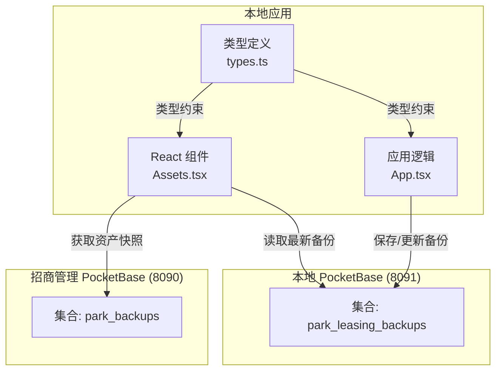
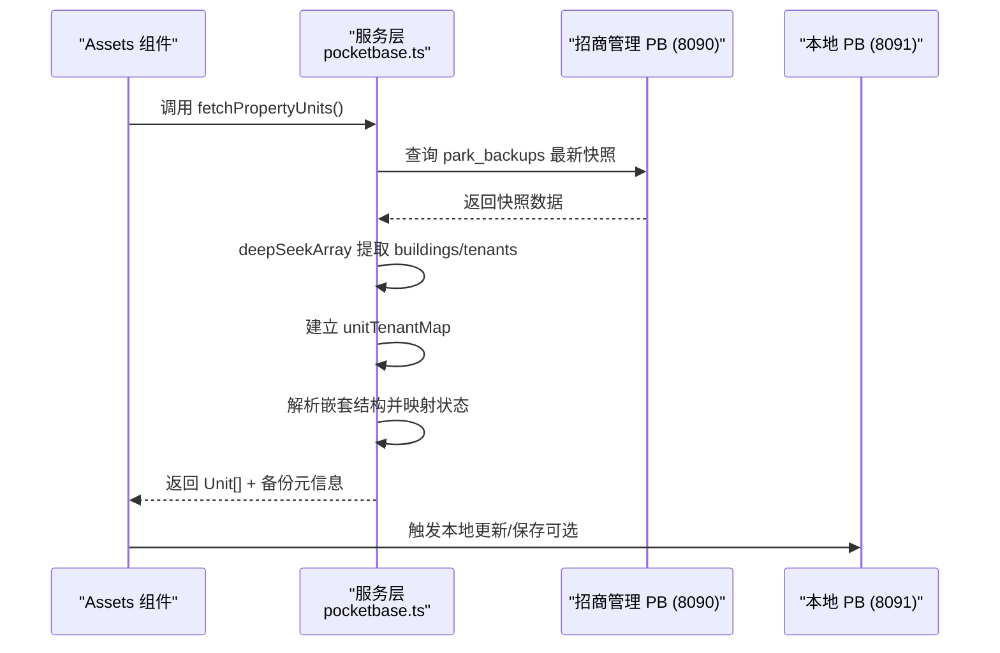
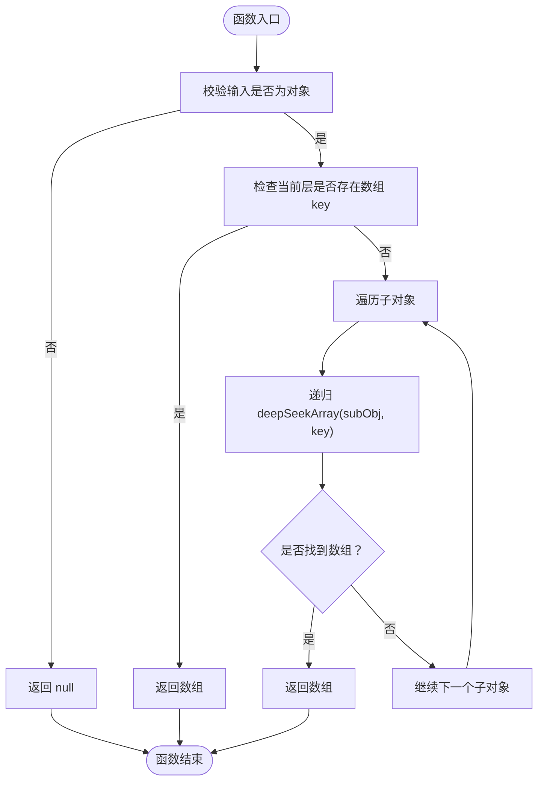
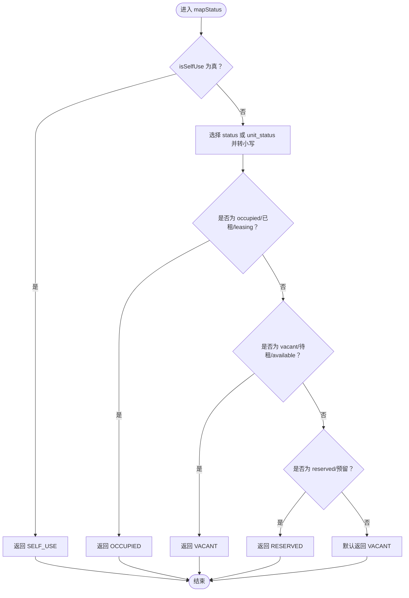
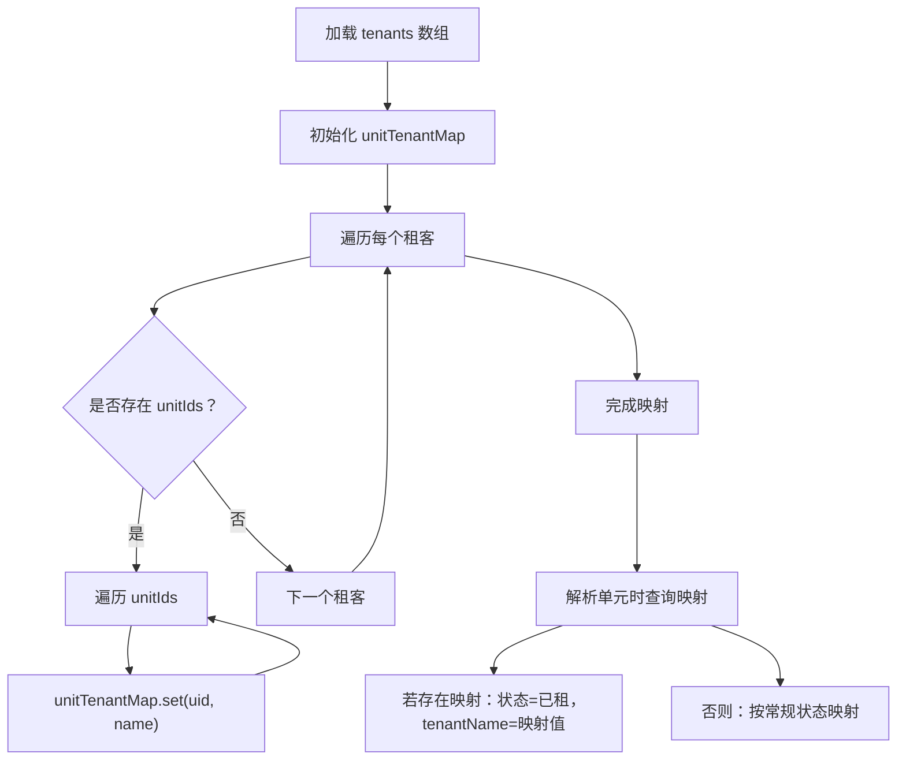
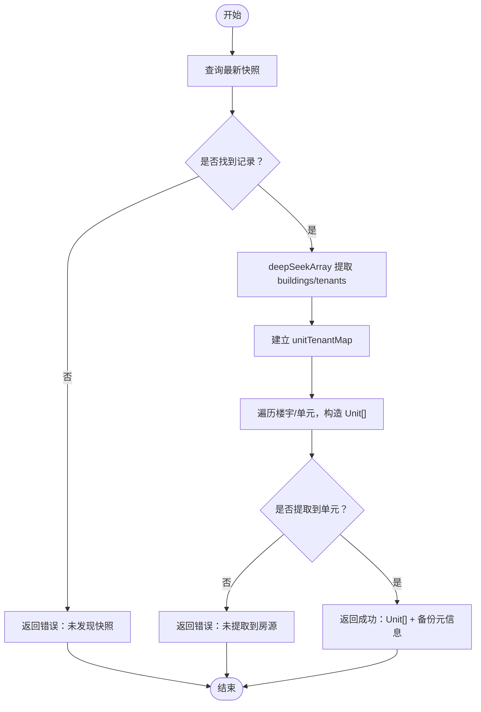
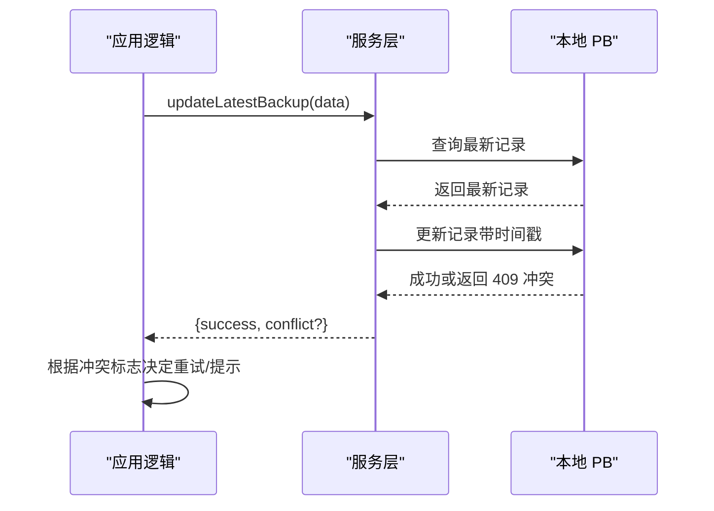
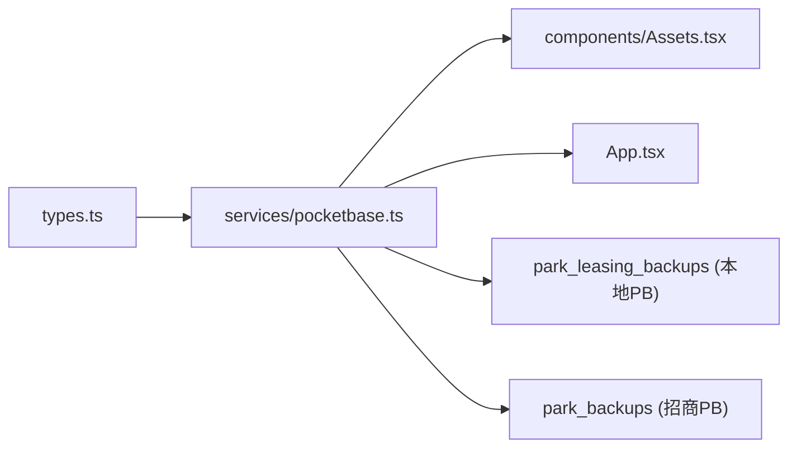

# 数据同步机制

<cite>
**本文引用的文件**
- [README.md](file://README.md)
- [package.json](file://package.json)
- [types.ts](file://types.ts)
- [services/pocketbase.ts](file://services/pocketbase.ts)
- [services/mockData.ts](file://services/mockData.ts)
- [services/unitHeatAnalytics.ts](file://services/unitHeatAnalytics.ts)
- [components/Assets.tsx](file://components/Assets.tsx)
- [App.tsx](file://App.tsx)
- [pb_migrations/1770189507_created_park_leasing_backups.js](file://pb_migrations/1770189507_created_park_leasing_backups.js)
- [MIGRATION_SUMMARY.md](file://MIGRATION_SUMMARY.md)
</cite>

## 目录
1. [简介](#简介)
2. [项目结构](#项目结构)
3. [核心组件](#核心组件)
4. [架构总览](#架构总览)
5. [详细组件分析](#详细组件分析)
6. [依赖分析](#依赖分析)
7. [性能考虑](#性能考虑)
8. [故障排查指南](#故障排查指南)
9. [结论](#结论)
10. [附录](#附录)

## 简介
本技术文档聚焦于“数据同步机制”，围绕以下目标展开：
- 深度数组搜索算法（deepSeekArray）的设计原理与实现细节
- 资产数据从招商管理系统到本地数据库的完整同步流程：快照获取、数据解析、状态映射、冲突检测
- 状态映射函数（mapStatus）如何处理不同来源的状态字段差异
- 租客映射机制如何建立单元与租客的关联关系
- 错误处理策略、数据验证规则、性能优化技巧
- 同步过程的调试方法与常见问题解决方案

## 项目结构
该项目采用前端 React + PocketBase 的双实例架构：本地应用通过 PocketBase 客户端访问本地备份集合，同时从招商管理系统的另一套 PocketBase 实例拉取资产快照，完成双向数据同步。

图表来源
- [components/Assets.tsx](file://components/Assets.tsx#L1-L445)
- [services/pocketbase.ts](file://services/pocketbase.ts#L1-L274)
- [App.tsx](file://App.tsx#L1-L560)
- [types.ts](file://types.ts#L1-L276)
- [pb_migrations/1770189507_created_park_leasing_backups.js](file://pb_migrations/1770189507_created_park_leasing_backups.js#L1-L54)

章节来源
- [README.md](file://README.md#L1-L21)
- [package.json](file://package.json#L1-L28)
- [components/Assets.tsx](file://components/Assets.tsx#L1-L445)
- [services/pocketbase.ts](file://services/pocketbase.ts#L1-L274)
- [App.tsx](file://App.tsx#L1-L560)
- [types.ts](file://types.ts#L1-L276)
- [pb_migrations/1770189507_created_park_leasing_backups.js](file://pb_migrations/1770189507_created_park_leasing_backups.js#L1-L54)

## 核心组件
- 深度数组搜索算法（deepSeekArray）：在复杂 JSON 结构中递归定位业务数组容器，提升解析健壮性
- 状态映射函数（mapStatus）：统一不同来源的状态字段差异，输出标准化枚举值
- 租客映射机制：基于租客集合中的单元 ID 列表，建立单元与租客的多对多索引
- 快照解析与校验：从招商管理快照中抽取 buildings/tenants，构建本地 Unit 列表
- 冲突检测与乐观更新：通过“最新备份”集合的更新操作进行并发冲突检测
- 错误处理与重试：超时控制 + 指数回退重试，提升网络不稳定场景下的成功率

章节来源
- [services/pocketbase.ts](file://services/pocketbase.ts#L30-L173)
- [types.ts](file://types.ts#L55-L88)

## 架构总览
资产同步的关键路径如下：
- 前端组件触发同步
- 服务层调用招商管理快照集合，获取最新快照
- 使用 deepSeekArray 定位 buildings/tenants
- 建立租客映射，解析嵌套结构，生成本地 Unit 列表
- 返回结果并更新 UI 状态

图表来源
- [components/Assets.tsx](file://components/Assets.tsx#L112-L169)
- [services/pocketbase.ts](file://services/pocketbase.ts#L93-L173)
- [App.tsx](file://App.tsx#L266-L283)

## 详细组件分析

### 深度数组搜索算法（deepSeekArray）
设计目标
- 在复杂、嵌套的 JSON 对象中，定位名为 key 的数组字段
- 通过递归遍历对象树，避免硬编码路径依赖
- 提升对不同快照结构的兼容性

实现要点
- 输入校验：非对象直接返回空
- 当前层级匹配：若 obj[key] 是数组，直接返回
- 子层级递归：对每个子对象递归调用，一旦命中即返回
- 未命中：返回空

图表来源
- [services/pocketbase.ts](file://services/pocketbase.ts#L33-L45)

章节来源
- [services/pocketbase.ts](file://services/pocketbase.ts#L30-L45)

### 状态映射函数（mapStatus）
设计目标
- 统一不同来源（英文/中文/别名）的状态字段，输出本地枚举值
- 优先处理自用/保留等特殊状态，再按常规映射规则处理

实现要点
- 自用优先：若 isSelfUse 为真，直接返回自用状态
- 字段选择：优先 status，其次 unit_status
- 归一化：统一转换为小写字符串
- 映射规则：occupied/已租/leasing → 已租；vacant/待租/available → 待租；reserved/预留 → 预留；默认 → 待租

图表来源
- [services/pocketbase.ts](file://services/pocketbase.ts#L21-L28)

章节来源
- [services/pocketbase.ts](file://services/pocketbase.ts#L21-L28)

### 租客映射机制
设计目标
- 将租客集合中的 unitIds 与单元 ID 建立映射，实现单元与租客的关联
- 在解析单元时，优先使用租客映射结果，确保已租状态与租客名称一致

实现要点
- 遍历租客集合，收集每个租客的 unitIds
- 建立 Map<unitId, tenantName>
- 解析单元时，若存在映射，则将状态置为已租，并填充租客名称

图表来源
- [services/pocketbase.ts](file://services/pocketbase.ts#L120-L126)
- [services/pocketbase.ts](file://services/pocketbase.ts#L135-L149)

章节来源
- [services/pocketbase.ts](file://services/pocketbase.ts#L117-L149)

### 快照获取与解析流程
- 获取最新快照：通过集合查询最新记录，限定项目标识
- 定位数据源：使用 deepSeekArray 提取 buildings 与 tenants
- 建立映射：构建 unit → tenant 的映射表
- 解析嵌套：遍历楼宇与单元，构造本地 Unit 对象
- 校验结果：若未提取到任何单元，返回错误提示

图表来源
- [services/pocketbase.ts](file://services/pocketbase.ts#L93-L173)

章节来源
- [services/pocketbase.ts](file://services/pocketbase.ts#L93-L173)

### 冲突检测与乐观更新
- 最新备份更新：尝试更新最新记录，若返回 409 或冲突信息，判定为并发冲突
- 降级策略：捕获冲突后返回标志，上层可选择重试或提示用户
- 本地持久化：通过本地集合保存/更新，避免跨实例一致性问题

图表来源
- [services/pocketbase.ts](file://services/pocketbase.ts#L194-L227)
- [App.tsx](file://App.tsx#L266-L283)

章节来源
- [services/pocketbase.ts](file://services/pocketbase.ts#L194-L227)
- [App.tsx](file://App.tsx#L266-L283)

### 错误处理与重试策略
- 超时控制：对网络请求设置超时阈值，避免长时间阻塞
- 指数回退重试：对超时/取消类错误进行有限次数重试，逐步增加延迟
- 友好提示：根据错误类型区分网络问题、服务不可达、数据格式变更等，向 UI 展示清晰提示

章节来源
- [services/pocketbase.ts](file://services/pocketbase.ts#L50-L87)
- [components/Assets.tsx](file://components/Assets.tsx#L112-L169)

## 依赖分析
- 类型系统：通过 types.ts 定义本地数据模型与枚举，保证前后端一致
- 服务层：pocketbase.ts 封装网络、解析、映射与持久化
- 组件层：Assets.tsx 负责触发同步、展示状态与错误信息
- 集合结构：本地集合用于保存/更新备份，招商集合用于读取快照

图表来源
- [types.ts](file://types.ts#L1-L276)
- [services/pocketbase.ts](file://services/pocketbase.ts#L1-L274)
- [components/Assets.tsx](file://components/Assets.tsx#L1-L445)
- [App.tsx](file://App.tsx#L1-L560)
- [pb_migrations/1770189507_created_park_leasing_backups.js](file://pb_migrations/1770189507_created_park_leasing_backups.js#L1-L54)

章节来源
- [types.ts](file://types.ts#L1-L276)
- [services/pocketbase.ts](file://services/pocketbase.ts#L1-L274)
- [components/Assets.tsx](file://components/Assets.tsx#L1-L445)
- [App.tsx](file://App.tsx#L1-L560)
- [pb_migrations/1770189507_created_park_leasing_backups.js](file://pb_migrations/1770189507_created_park_leasing_backups.js#L1-L54)

## 性能考虑
- 解析健壮性：使用深度数组搜索减少对固定路径的依赖，降低因快照结构调整导致的失败概率
- 映射优化：租客映射采用 Map 结构，查询复杂度 O(1)，适合大规模单元数据
- 重试与超时：在弱网环境下通过指数回退重试提升成功率，避免 UI 卡顿
- 本地持久化：通过本地集合保存/更新，减少跨实例通信带来的延迟
- 数据验证：解析完成后进行结果校验，尽早暴露问题，避免无效渲染

## 故障排查指南
常见问题与定位步骤
- 未发现快照
  - 现象：返回“未发现项目 park_data_main 的云端资产快照”
  - 排查：确认目标项目标识、集合名称、实例端口是否正确
- 快照数据为空
  - 现象：返回“快照数据为空”
  - 排查：检查快照生成流程与数据完整性
- 未提取到房源
  - 现象：解析成功但未提取到房源
  - 排查：确认快照内 buildings 容器是否包含有效单元数据；检查 deepSeekArray 的 key 是否正确
- 连接超时/请求取消
  - 现象：超时或取消错误
  - 排查：检查网络连通性、防火墙、服务端负载；适当增大超时阈值或减少数据量
- 并发冲突
  - 现象：更新失败并提示冲突
  - 排查：重试或等待一段时间后重试；避免同时多处修改同一记录

章节来源
- [services/pocketbase.ts](file://services/pocketbase.ts#L93-L173)
- [components/Assets.tsx](file://components/Assets.tsx#L112-L169)

## 结论
本项目通过“深度数组搜索 + 状态映射 + 租客映射”的组合，实现了对招商管理快照的稳健解析与本地化落地。配合超时控制、指数回退重试与冲突检测，显著提升了在复杂网络与数据结构变化场景下的可靠性。建议在后续迭代中：
- 增加对快照结构变更的版本化支持
- 引入增量同步以降低数据量
- 补充日志与埋点以便快速定位问题

## 附录
- 数据模型与集合结构参考
  - 本地集合：park_leasing_backups（名称、JSON 数据）
  - 招商集合：park_backups（项目标识、快照数据）

章节来源
- [pb_migrations/1770189507_created_park_leasing_backups.js](file://pb_migrations/1770189507_created_park_leasing_backups.js#L1-L54)
- [MIGRATION_SUMMARY.md](file://MIGRATION_SUMMARY.md#L114-L178)