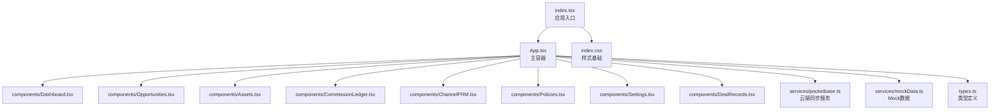
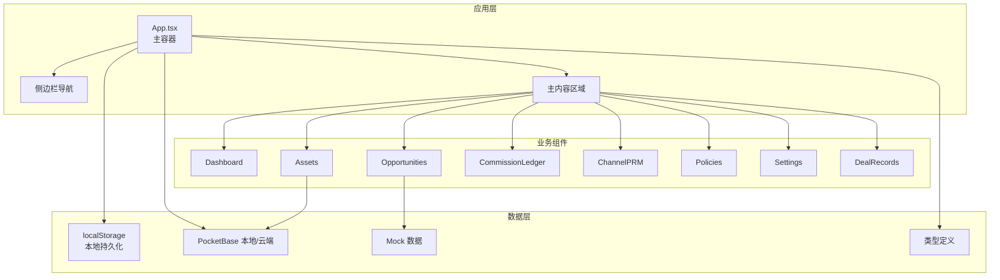
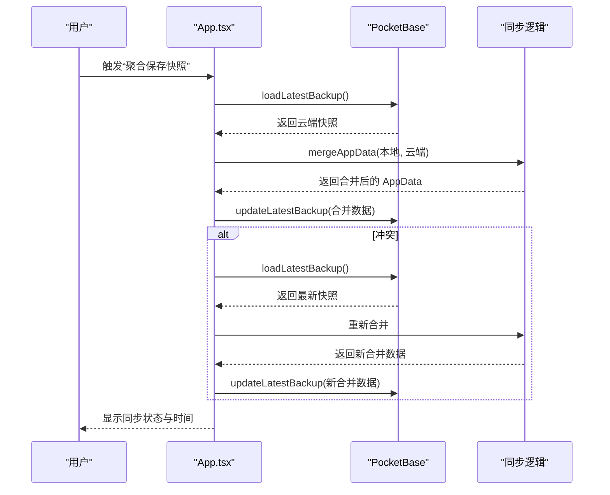
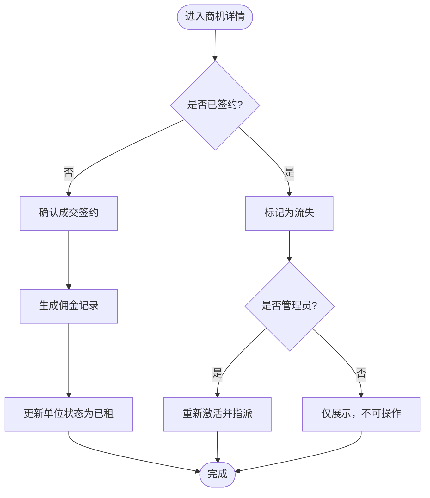
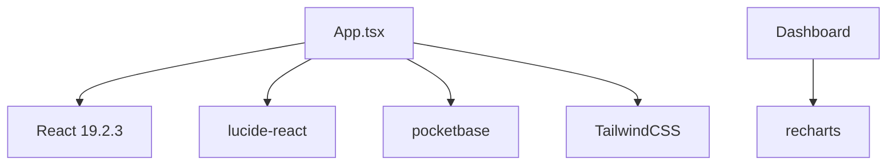

# 前端架构

<cite>
**本文档引用的文件**
- [App.tsx](file://App.tsx)
- [index.tsx](file://index.tsx)
- [package.json](file://package.json)
- [types.ts](file://types.ts)
- [pocketbase.ts](file://services/pocketbase.ts)
- [mockData.ts](file://services/mockData.ts)
- [Dashboard.tsx](file://components/Dashboard.tsx)
- [Opportunities.tsx](file://components/Opportunities.tsx)
- [Assets.tsx](file://components/Assets.tsx)
- [CommissionLedger.tsx](file://components/CommissionLedger.tsx)
- [ChannelPRM.tsx](file://components/ChannelPRM.tsx)
- [Policies.tsx](file://components/Policies.tsx)
- [Settings.tsx](file://components/Settings.tsx)
- [DealRecords.tsx](file://components/DealRecords.tsx)
- [index.css](file://index.css)
</cite>

## 目录
1. [简介](#简介)
2. [项目结构](#项目结构)
3. [核心组件](#核心组件)
4. [架构总览](#架构总览)
5. [详细组件分析](#详细组件分析)
6. [依赖关系分析](#依赖关系分析)
7. [性能考虑](#性能考虑)
8. [故障排查指南](#故障排查指南)
9. [结论](#结论)
10. [附录](#附录)

## 简介
本文件为“上海商机及渠道管理系统（v5.0）”的前端架构文档，基于 React 19.2.3 构建，采用组件化架构设计。系统围绕 App.tsx 主容器展开，统一管理全局状态、用户认证、数据同步与组件导航；业务模块包括仪表板、商机管理、资产管理、佣金结算、渠道管理、政策配置与系统设置等。系统通过本地持久化与云端快照实现数据一致性与并发冲突处理，并结合 TailwindCSS 提供一致的样式体系。

## 项目结构
项目采用按功能域划分的目录组织方式，核心入口为 index.tsx，应用根组件为 App.tsx，业务组件位于 components 目录，数据服务位于 services 目录，类型定义集中在 types.ts，样式通过 TailwindCSS 与自定义滚动条样式实现。

图表来源
- [index.tsx](file://index.tsx#L1-L16)
- [App.tsx](file://App.tsx#L1-L588)
- [Dashboard.tsx](file://components/Dashboard.tsx#L1-L315)
- [Opportunities.tsx](file://components/Opportunities.tsx#L1-L804)
- [Assets.tsx](file://components/Assets.tsx#L1-L412)
- [CommissionLedger.tsx](file://components/CommissionLedger.tsx#L1-L201)
- [ChannelPRM.tsx](file://components/ChannelPRM.tsx#L1-L476)
- [Policies.tsx](file://components/Policies.tsx#L1-L382)
- [Settings.tsx](file://components/Settings.tsx#L1-L291)
- [DealRecords.tsx](file://components/DealRecords.tsx#L1-L252)
- [pocketbase.ts](file://services/pocketbase.ts#L1-L274)
- [mockData.ts](file://services/mockData.ts#L1-L81)
- [types.ts](file://types.ts#L1-L261)
- [index.css](file://index.css#L1-L28)

章节来源
- [index.tsx](file://index.tsx#L1-L16)
- [package.json](file://package.json#L1-L28)

## 核心组件
- App.tsx：主容器，负责用户认证、全局状态管理、数据同步协调、组件导航控制与云端聚合合并。
- Dashboard：运营总控看板，展示商机来源、面积段、带看走势、待租房源等关键指标。
- Opportunities：商机全生命周期管理，支持新增、跟进、成交、流失标记与佣金生成。
- Assets：资产销控与云端同步，支持房源状态管理与批量补录。
- CommissionLedger：佣金结算看板，支持分期节点与财务状态管理。
- ChannelPRM：渠道伙伴 PRM 系统，支持合作商与对接人管理、成交与佣金统计。
- Policies：佣金政策配置与变更审计，支持一次性与分期发放策略。
- Settings：系统设置与账户管理，支持个人档案维护与账户增删改。
- DealRecords：成交资产台账，支持按年份与月份分组展示。

章节来源
- [App.tsx](file://App.tsx#L179-L585)
- [Dashboard.tsx](file://components/Dashboard.tsx#L20-L315)
- [Opportunities.tsx](file://components/Opportunities.tsx#L28-L800)
- [Assets.tsx](file://components/Assets.tsx#L16-L412)
- [CommissionLedger.tsx](file://components/CommissionLedger.tsx#L14-L201)
- [ChannelPRM.tsx](file://components/ChannelPRM.tsx#L21-L476)
- [Policies.tsx](file://components/Policies.tsx#L14-L382)
- [Settings.tsx](file://components/Settings.tsx#L17-L291)
- [DealRecords.tsx](file://components/DealRecords.tsx#L13-L252)

## 架构总览
系统采用“主容器 + 功能组件”的分层架构，App.tsx 作为全局状态中心，负责：
- 认证与会话：登录态持久化、登出与导航控制。
- 全局状态：商机、资产、佣金、渠道、政策、用户等数据的集中管理。
- 数据同步：本地持久化 + 云端快照聚合，支持并发冲突检测与自动重试。
- 组件导航：侧边栏切换与主内容区域渲染。

图表来源
- [App.tsx](file://App.tsx#L179-L585)
- [pocketbase.ts](file://services/pocketbase.ts#L1-L274)
- [mockData.ts](file://services/mockData.ts#L1-L81)
- [types.ts](file://types.ts#L1-L261)

## 详细组件分析

### App.tsx 主容器
职责概述
- 认证与会话：登录态读取与持久化、登出与导航重置。
- 全局状态：商机、资产、佣金、渠道、政策、活动、用户、目标面积等。
- 数据同步：本地持久化、云端快照聚合、冲突检测与自动重试。
- 组件导航：侧边栏按钮切换与主内容渲染。
- 业务编排：商机阶段变更、佣金生成、单位状态变更、删除级联标记。

关键机制
- 状态提升：所有业务数据均在 App.tsx 中声明与更新，通过 Props 下发到子组件。
- Ref 引用：dataRef 保证异步同步逻辑始终读取最新状态，避免闭包陷阱。
- 合并算法：mergeAppData 实现 ID 去重、删除标记传播与级联过滤，防止僵尸子数据复活。
- 并发控制：updateLatestBackup 使用乐观锁检测冲突，失败时自动重新合并。

图表来源
- [App.tsx](file://App.tsx#L300-L375)
- [pocketbase.ts](file://services/pocketbase.ts#L194-L227)

章节来源
- [App.tsx](file://App.tsx#L179-L585)

### Dashboard 仪表板
职责概述
- 展示年度累计签约面积、商机总量、带看与流失分析、待租房源分布与空置时长。
- 支持年份切换与目标面积完成度可视化。

优化策略
- 使用 useMemo 过滤有效活动轨迹，避免已删除商机残留数据影响统计。
- 按年份与活动类型聚合趋势数据，减少重复计算。

章节来源
- [Dashboard.tsx](file://components/Dashboard.tsx#L20-L315)

### Opportunities 商机管理
职责概述
- 商机全生命周期管理：新增、跟进、成交、流失标记与重新激活。
- 成交流程：生成佣金记录、更新单位状态、联动佣金生成。
- 权限控制：管理员可删除与重新分配，普通用户仅可见自身或创建的商机。
- 性能优化：使用 useMemo 过滤有效活动轨迹，避免脏数据污染。

关键流程
- 新增商机：校验必填字段，自动填充创建者与默认阶段。
- 成交确认：计算月租金、生成佣金节点（一次性或分期）、更新单位状态。
- 流失标记：记录流失原因与日期，支持管理员重新激活并指派。

图表来源
- [Opportunities.tsx](file://components/Opportunities.tsx#L107-L136)
- [Opportunities.tsx](file://components/Opportunities.tsx#L166-L179)

章节来源
- [Opportunities.tsx](file://components/Opportunities.tsx#L28-L800)

### Assets 资产销控
职责概述
- 资产数据来源：本地持久化 + 招商系统云端快照同步。
- 支持资产状态管理（已租/待租/预留/自用）、空置时长计算与价格标注。
- 管理员可新增/编辑房源，支持一键从云端补录。

关键流程
- 云端同步：fetchPropertyUnits 解析快照，映射为内部 Unit 结构。
- 状态展示：根据状态与空置时间动态着色与提示。
- 批量补录：管理员可批量导入并覆盖本地数据。

章节来源
- [Assets.tsx](file://components/Assets.tsx#L16-L412)
- [pocketbase.ts](file://services/pocketbase.ts#L93-L173)

### CommissionLedger 佣金结算
职责概述
- 展示待结清佣金总金额与节点数量，支持按企业/渠道/房号搜索。
- 管理员可编辑佣金金额、状态与计划发放日期。
- 支持分期节点与财务状态监控。

章节来源
- [CommissionLedger.tsx](file://components/CommissionLedger.tsx#L14-L201)

### ChannelPRM 渠道管理
职责概述
- 合作商档案管理：公司名称、分级标签、描述、归属与协同维护人员。
- 对接人管理：新增/编辑联系人，支持电话与职位信息。
- 成交与佣金统计：按年/月维度展示贡献面积、带看次数与佣金状态。
- 权限控制：管理员可删除合作商与调整归属。

章节来源
- [ChannelPRM.tsx](file://components/ChannelPRM.tsx#L21-L476)

### Policies 策略配置
职责概述
- 佣金政策管理：面积区间、生效日期、发放模式（一次性/分期）、分期节点与比例。
- 变更审计：记录创建、更新、启用/禁用与删除操作。
- 策略匹配：系统根据成交面积自动应用对应生效政策。

章节来源
- [Policies.tsx](file://components/Policies.tsx#L14-L382)

### Settings 系统设置
职责概述
- 个人档案维护：用户名、显示名、密码修改。
- 账户管理：管理员可创建/编辑/删除招商经理账户。
- 数据快照：列出云端备份快照，支持恢复。

章节来源
- [Settings.tsx](file://components/Settings.tsx#L17-L291)

### DealRecords 成交台账
职责概述
- 按年份与月份分组展示成交明细，支持企业名称搜索。
- 统计年度签约数量、累计去化面积与年度租金收益。
- 招商经理转化率与业绩卡片展示。

章节来源
- [DealRecords.tsx](file://components/DealRecords.tsx#L13-L252)

## 依赖关系分析
技术栈与外部依赖
- React 19.2.3：组件化与 Hooks 生态。
- lucide-react：图标库，统一视觉风格。
- pocketbase：本地/云端数据存储与同步。
- recharts：图表可视化。
- TailwindCSS：原子化样式框架。

图表来源
- [package.json](file://package.json#L11-L26)
- [App.tsx](file://App.tsx#L1-L15)
- [Dashboard.tsx](file://components/Dashboard.tsx#L1-L5)

章节来源
- [package.json](file://package.json#L1-L28)

## 性能考虑
- 状态提升与局部更新：所有业务数据在 App.tsx 集中管理，通过 Props 下发，避免跨层级状态共享带来的性能损耗。
- Memo 化优化：多处使用 useMemo 过滤有效数据集，减少无效渲染与计算。
- 引用与闭包：dataRef 确保异步同步读取最新状态，避免闭包过期导致的竞态条件。
- 并发冲突处理：云端更新采用乐观锁，失败时自动重试与重新合并，保障数据一致性。
- 样式优化：TailwindCSS 原子类减少样式体积与重绘，自定义滚动条样式提升交互体验。

## 故障排查指南
常见问题与处理
- 登录失败：检查网络与云端服务可用性，确认 onSync 在登录前已执行。
- 同步冲突：系统自动检测并重试，若仍失败，检查云端快照是否被其他客户端修改。
- 数据不一致：确认 deletedIds 是否正确传播，避免子数据“复活”。
- 图表渲染异常：检查数据源是否为空或格式不符，确保 useMemo 过滤逻辑生效。
- 资产同步失败：检查招商系统 PocketBase 服务状态与网络连接，查看错误提示并重试。

章节来源
- [App.tsx](file://App.tsx#L300-L375)
- [Assets.tsx](file://components/Assets.tsx#L109-L166)

## 结论
本系统通过 App.tsx 主容器实现了统一的状态管理与数据同步，配合功能组件的职责划分与性能优化策略，形成了稳定、可扩展的前端架构。通过云端快照聚合与并发冲突处理，系统在保证数据一致性的同时，提供了良好的用户体验与运维能力。

## 附录
- 类型系统：types.ts 定义了商机、资产、佣金、渠道、政策与用户等核心实体与枚举，确保组件间数据契约清晰。
- Mock 数据：mockData.ts 提供初始演示数据，便于开发与测试。
- 样式规范：index.css 引入 TailwindCSS 并定义自定义滚动条样式，统一视觉与交互体验。

章节来源
- [types.ts](file://types.ts#L1-L261)
- [mockData.ts](file://services/mockData.ts#L1-L81)
- [index.css](file://index.css#L1-L28)