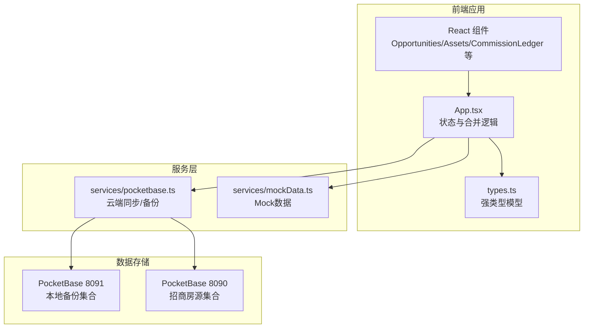
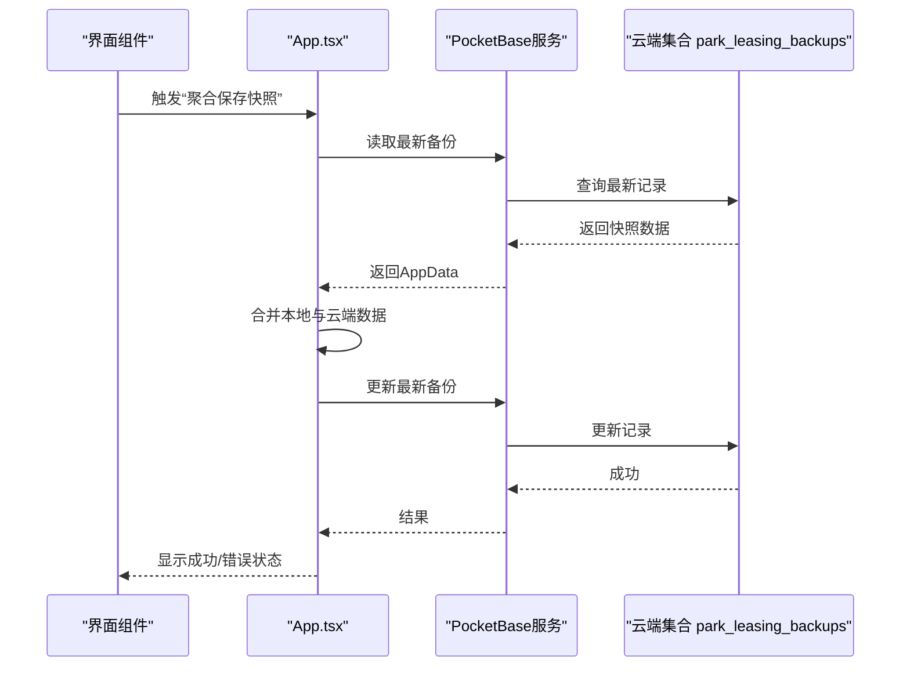
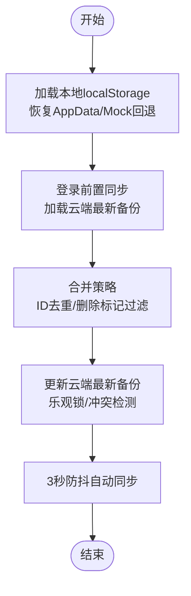
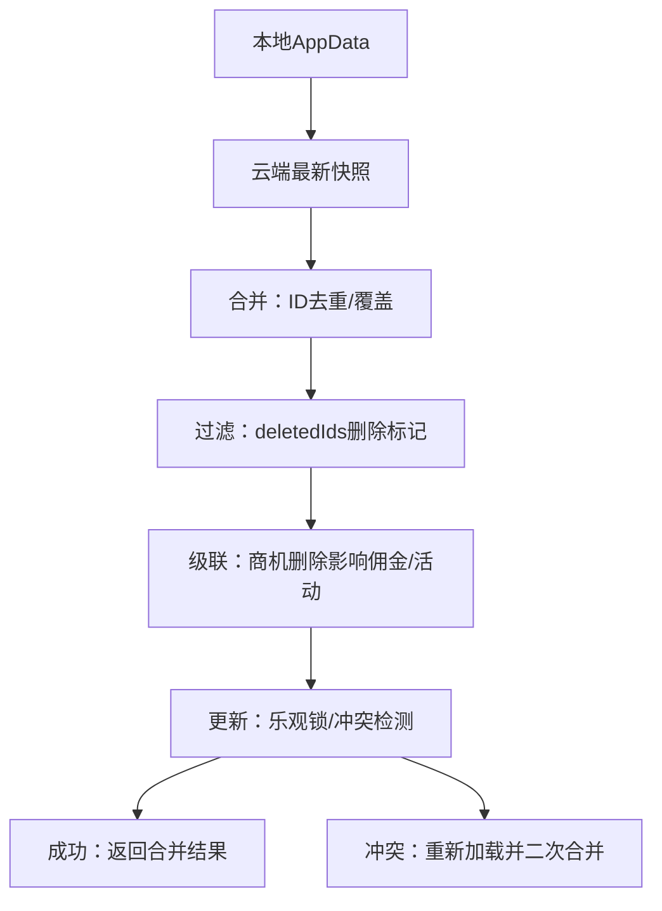
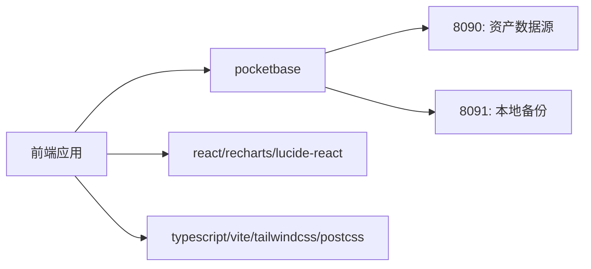

# 数据架构

<cite>
**本文档引用的文件**
- [types.ts](file://types.ts)
- [App.tsx](file://App.tsx)
- [services/pocketbase.ts](file://services/pocketbase.ts)
- [services/mockData.ts](file://services/mockData.ts)
- [components/Opportunities.tsx](file://components/Opportunities.tsx)
- [components/Assets.tsx](file://components/Assets.tsx)
- [components/CommissionLedger.tsx](file://components/CommissionLedger.tsx)
- [MIGRATION_SUMMARY.md](file://MIGRATION_SUMMARY.md)
- [package.json](file://package.json)
- [index.tsx](file://index.tsx)
</cite>

## 目录
1. [简介](#简介)
2. [项目结构](#项目结构)
3. [核心数据模型](#核心数据模型)
4. [架构概览](#架构概览)
5. [数据流与同步机制](#数据流与同步机制)
6. [Mock数据系统](#mock数据系统)
7. [数据验证与业务约束](#数据验证与业务约束)
8. [数据生命周期与缓存策略](#数据生命周期与缓存策略)
9. [冲突解决与合并策略](#冲突解决与合并策略)
10. [依赖关系分析](#依赖关系分析)
11. [性能考量](#性能考量)
12. [故障排查指南](#故障排查指南)
13. [扩展与版本兼容](#扩展与版本兼容)
14. [结论](#结论)

## 简介
本文件面向“上海商机及渠道管理系统（v5.0）”，系统采用TypeScript强类型设计，围绕商机（Opportunity）、资产（Unit）、渠道（Channel）、佣金（Commission）、活动（Activity）等核心实体构建数据模型，并通过本地与云端双PocketBase实例实现数据的本地状态管理、云端快照同步、增量合并与冲突解决。系统同时提供Mock数据体系用于演示与离线开发，确保在无网络或无云端时仍可稳定运行。

## 项目结构
系统采用前端React + TypeScript + TailwindCSS + Vite的现代前端栈，配合PocketBase作为本地与云端数据存储与同步后端。核心数据模型集中于types.ts，应用状态与合并逻辑位于App.tsx，云端同步与备份读写位于services/pocketbase.ts，Mock数据位于services/mockData.ts，业务组件按功能模块划分在components目录下。

图表来源
- [App.tsx](file://App.tsx#L179-L589)
- [services/pocketbase.ts](file://services/pocketbase.ts#L1-L274)
- [types.ts](file://types.ts#L1-L276)

章节来源
- [package.json](file://package.json#L1-L28)
- [index.tsx](file://index.tsx#L1-L16)

## 核心数据模型
系统以强类型接口定义核心业务实体，涵盖枚举与实体两大类，确保编译期约束与IDE智能提示。

- 枚举与状态
  - 机会阶段：线索、带看、谈判、签约、流失
  - 意向等级：高意向、一般意向、不确定
  - 来源类型：渠道推荐、自拓、转介绍、线下拜访、自媒体、其他
  - 佣金状态：待确认、已触发、审批中、待打款、已结清
  - 资产状态：待租、已租、预留、自用
  - 用户角色：管理员、一般账户
  - 代理等级：金牌、潜力、低效
  - 活动类型：带看、电访、报价、谈判、签约

- 实体模型
  - 用户（User）：身份、角色、指标
  - 资产（Unit）：楼宇、楼层、房号、面积、状态、租户、单价、空置起始日
  - 代理（Agent）：姓名、电话、头衔、公司、等级、提成率、累计成交面积/佣金、累计带看
  - 渠道（Channel）：公司名、等级、基础提成率、描述、代理列表、累计成交面积/佣金、共享范围
  - 佣金规则（CommissionRule）：面积区间、费率、标签、生效日期、是否启用、支付方式（一次性/分期）、分期节点
  - 政策变更日志（PolicyChangeLog）：变更类型、描述、前后值
  - 成交流水（DealParameters）：单位ID、建筑名、最终面积、签约/起租/到期日、最终价格、月租金、缴费周期、首付款、首付款日期、免租是否延期、免租期、押金、备注、风险等级、行业、成立日期、法人代表、主要联系人
  - 成交日志（DealLog）：时间戳、操作者、变更描述
  - 机会（Opportunity）：公司名、行业、需求面积、预算、搬迁日期、来源、意向、渠道/代理关联、租赁负责人、目标/关联资产、导出标记、阶段、成交参数、成交日志、流失原因/日期、标签、最后带看日期、创建时间、置顶标记
  - 活动（Activity）：机会ID、创建者、日期、类型、主持人、描述、标签、带看资产ID列表、客户关注点
  - 佣金（Commission）：合同ID、房间号、签约日期、计划发放日期、渠道ID、金额、面积、状态、使用费率、分期标签、发票/打款日期、凭证上传标记
  - 应用数据（AppData）：聚合各实体列表、设置、删除ID集合
  - 云端快照（CloudSnapshot）：名称、创建时间、数据内容

章节来源
- [types.ts](file://types.ts#L1-L276)

## 架构概览
系统采用“本地状态 + 云端快照”的混合架构：
- 本地状态：由React组件状态与localStorage持久化，形成AppData对象，包含所有核心实体与设置。
- 云端快照：通过PocketBase集合park_leasing_backups存储AppData，支持最新快照更新与历史备份列表查询。
- 双PocketBase实例：
  - 8091：本地备份实例，用于保存/更新/加载应用快照
  - 8090：招商房源实例，用于从资产系统拉取单位数据

图表来源
- [App.tsx](file://App.tsx#L328-L375)
- [services/pocketbase.ts](file://services/pocketbase.ts#L178-L227)

章节来源
- [MIGRATION_SUMMARY.md](file://MIGRATION_SUMMARY.md#L107-L111)
- [services/pocketbase.ts](file://services/pocketbase.ts#L1-L274)

## 数据流与同步机制
- 本地状态管理
  - 初始加载：从localStorage恢复AppData，若缺失则回退到Mock数据。
  - 实时更新：使用useRef维护dataRef，确保异步回调始终读取最新状态，避免闭包过期。
  - 防抖持久化：3秒防抖后自动保存到localStorage，减少频繁写入。
- 云端同步
  - 登录前置同步：登录前先从云端加载最新备份，确保用户与基础数据一致。
  - 手动聚合保存：弹出备份命名对话框，合并本地与云端后更新最新备份。
  - 自动后台同步：数据变化后触发3秒防抖，静默更新云端最新备份。
  - 并发冲突处理：检测409/冲突错误时，重新加载并再次合并，确保一致性。
- 房源同步
  - 从8090端口的招商系统PocketBase读取park_backups集合的最新快照，解析buildings/tenants容器，映射为本地Unit列表。
  - 提供超时与重试封装，支持错误分类与用户友好提示。

图表来源
- [App.tsx](file://App.tsx#L179-L589)
- [services/pocketbase.ts](file://services/pocketbase.ts#L93-L173)

章节来源
- [App.tsx](file://App.tsx#L194-L250)
- [components/Assets.tsx](file://components/Assets.tsx#L112-L169)

## Mock数据系统
- 设计目的
  - 在无云端或无网络时提供可用的演示数据，保障开发与测试体验。
  - 作为初始回退数据源，确保用户首次进入或云端异常时仍可使用系统。
- 数据构成
  - 用户（MOCK_USERS）：管理员与普通用户
  - 资产（MOCK_UNITS）：楼宇、楼层、房号、面积、状态、租户
  - 渠道（MOCK_CHANNELS）：公司名、等级、基础提成率、代理列表、累计成交
  - 佣金规则（MOCK_COMMISSION_RULES）：面积区间、费率、生效期、支付方式与分期节点
  - 空数组占位：MOCK_OPPORTUNITIES、MOCK_ACTIVITIES、MOCK_COMMISSIONS
- 使用场景
  - 初始化状态回退：当localStorage或云端无有效数据时，回退到Mock集合。
  - 开发调试：无需启动云端即可进行功能验证。
  - 离线演示：在无网络环境下展示系统能力。

章节来源
- [services/mockData.ts](file://services/mockData.ts#L1-L81)

## 数据验证与业务约束
- 编译期约束
  - 所有实体字段均在TypeScript接口中显式声明，避免运行期动态属性导致的不确定性。
  - 枚举类型统一管理状态与分类，减少字符串拼写错误。
- 运行期校验
  - 表单提交前的基础必填校验（如企业名称、需求面积、落位建筑与面积等），失败时阻止提交并提示。
  - 金额/面积/日期计算联动（如根据面积与单价计算月租金），确保数值一致性。
- 业务规则
  - 机会阶段变更：流失时自动记录流失原因与日期。
  - 佣金生成：依据成交参数与生效规则匹配，支持一次性与分期两种支付方式。
  - 删除级联：删除机会时，同时将关联的佣金与活动ID加入删除标记，防止云端合并时“僵尸子数据复活”。

章节来源
- [components/Opportunities.tsx](file://components/Opportunities.tsx#L73-L136)
- [App.tsx](file://App.tsx#L453-L464)

## 数据生命周期与缓存策略
- 生命周期
  - 创建：组件内生成唯一ID，填充必要字段，写入对应状态列表。
  - 更新：通过局部状态替换或合并策略更新，触发持久化与云端同步。
  - 删除：将主记录与关联子记录ID加入deletedIds，云端合并时过滤，避免复活。
  - 导出/归档：通过备份命名与云端保存实现快照归档。
- 缓存策略
  - 本地缓存：localStorage持久化AppData，减少重复加载成本。
  - 房源缓存：可在组件层增加短期缓存（如5-10分钟），避免频繁调用云端资产系统。
  - 防抖策略：3秒防抖合并与保存，降低网络压力与冲突概率。
- 版本与迁移
  - 通过AppData.settings与deletedIds承载系统设置与删除标记，便于未来版本演进。
  - 迁移总结文档明确从Supabase到PocketBase的端口与集合差异，指导配置与回滚。

章节来源
- [App.tsx](file://App.tsx#L246-L250)
- [MIGRATION_SUMMARY.md](file://MIGRATION_SUMMARY.md#L201-L207)

## 冲突解决与合并策略
- 合并算法
  - 基于ID去重：云端优先加载，随后本地覆盖，确保本地最新数据优先。
  - 删除标记过滤：合并时使用deletedIds集合，过滤掉已被删除的主记录及其子记录，防止“僵尸数据复活”。
  - 关联数据级联：商机删除时，同时将相关佣金与活动ID加入删除集合，确保合并后不再出现孤立子数据。
  - 用户数据特殊处理：若云端用户列表为空，则回退到本地用户；若本地为空则回退到Mock用户。
- 并发冲突
  - 乐观锁：更新最新备份时捕获409/冲突错误，触发重新加载与二次合并，确保一致性。
  - 超时与重试：云端资产同步封装了超时与指数退避重试，提升网络不稳定场景下的成功率。
- 云端快照
  - 仅更新最新记录，避免产生大量冗余快照，便于历史追溯与空间控制。

图表来源
- [App.tsx](file://App.tsx#L17-L75)
- [services/pocketbase.ts](file://services/pocketbase.ts#L194-L227)

章节来源
- [App.tsx](file://App.tsx#L17-L75)
- [services/pocketbase.ts](file://services/pocketbase.ts#L194-L227)

## 依赖关系分析
- 前端依赖
  - react/react-dom：UI渲染与生命周期管理
  - lucide-react：图标库
  - recharts：可视化图表
  - pocketbase：云端同步与备份
- 构建与样式
  - vite、tailwindcss、postcss、typescript：现代化开发与样式工具链
- 运行时端口
  - 3000：前端开发服务器
  - 8090：招商管理PocketBase（资产数据源）
  - 8091：本地备份PocketBase（应用快照）

图表来源
- [package.json](file://package.json#L11-L26)
- [MIGRATION_SUMMARY.md](file://MIGRATION_SUMMARY.md#L107-L111)

章节来源
- [package.json](file://package.json#L1-L28)
- [MIGRATION_SUMMARY.md](file://MIGRATION_SUMMARY.md#L107-L111)

## 性能考量
- 网络与并发
  - 超时与重试：云端资产同步默认15秒超时，最多重试2次，避免长时间阻塞。
  - 并发冲突：乐观锁+二次合并，减少写冲突带来的失败重试。
- 本地性能
  - 防抖合并：3秒防抖，降低频繁写入与网络请求。
  - 引用与记忆化：useMemo过滤无效活动轨迹，减少渲染开销。
- 数据体积
  - 仅更新最新备份，避免快照爆炸增长。
  - 合并时基于ID去重，减少重复数据。

章节来源
- [services/pocketbase.ts](file://services/pocketbase.ts#L47-L87)
- [components/Opportunities.tsx](file://components/Opportunities.tsx#L60-L64)

## 故障排查指南
- 登录失败
  - 确认云端同步是否成功，若失败会显示错误状态与提示。
  - 检查PocketBase 8091与8090端口是否正常运行。
- 房源同步失败
  - 检查招商系统PocketBase（8090）是否在线，以及park_backups集合是否存在有效快照。
  - 关注超时与取消错误，适当延长超时或减少并发。
- 并发冲突
  - 若出现409/冲突，系统会自动重新加载并合并，可稍后再试。
- 数据丢失或“僵尸数据”
  - 确认deletedIds是否正确传播到合并逻辑，避免云端合并复活已删除记录。

章节来源
- [App.tsx](file://App.tsx#L300-L326)
- [components/Assets.tsx](file://components/Assets.tsx#L112-L169)
- [services/pocketbase.ts](file://services/pocketbase.ts#L194-L227)

## 扩展与版本兼容
- 模型扩展
  - 新增实体：在types.ts中定义接口与枚举，组件中引入并在AppData中聚合。
  - 字段演进：通过settings或新增字段集合承载配置，避免破坏既有结构。
- 兼容性处理
  - 合并策略保留deletedIds与settings，便于未来版本回溯与兼容。
  - 迁移路径：参考迁移总结文档，明确端口与集合差异，确保平滑过渡。
- 安全与权限
  - 当前集合规则为“允许无认证访问”，生产环境建议在PocketBase管理后台设置更严格的API规则与CORS白名单。

章节来源
- [types.ts](file://types.ts#L243-L276)
- [MIGRATION_SUMMARY.md](file://MIGRATION_SUMMARY.md#L49-L87)

## 结论
本系统以强类型数据模型为基础，结合本地状态与云端快照的混合架构，实现了稳定、可扩展且具备良好用户体验的数据管理方案。通过严谨的合并策略、删除标记过滤与并发冲突处理，系统在多端协作与离线场景下均能保持数据一致性与完整性。配合Mock数据体系与完善的故障排查机制，为后续功能扩展与版本演进提供了坚实基础。