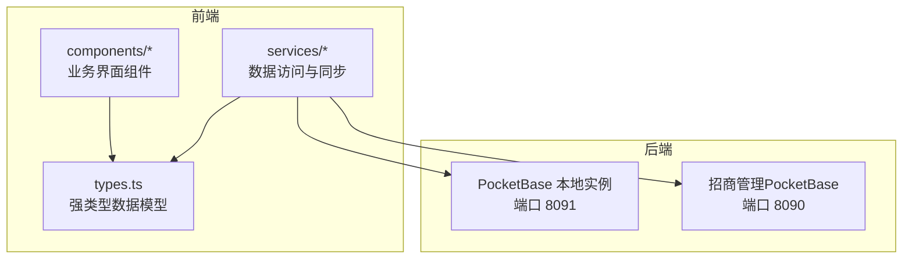
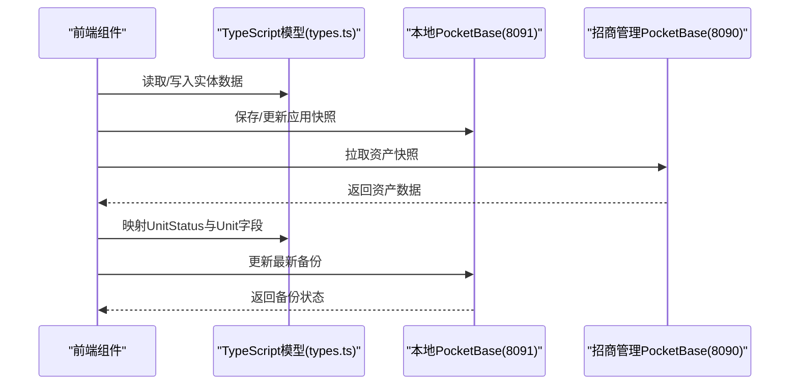
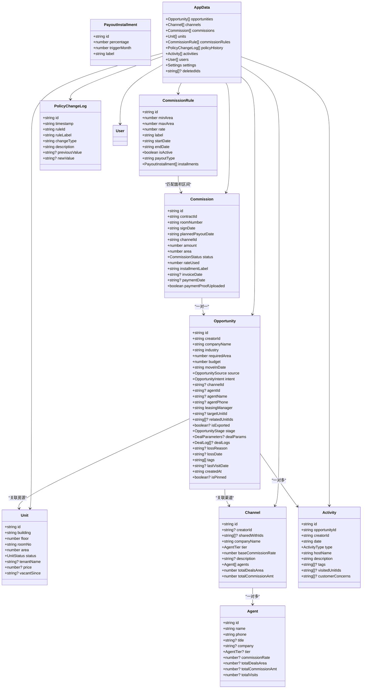

# 数据模型设计

<cite>
**本文档引用的文件**
- [types.ts](file://types.ts)
- [pocketbase.ts](file://services/pocketbase.ts)
- [mockData.ts](file://services/mockData.ts)
- [Opportunities.tsx](file://components/Opportunities.tsx)
- [Assets.tsx](file://components/Assets.tsx)
- [ChannelPRM.tsx](file://components/ChannelPRM.tsx)
- [CommissionLedger.tsx](file://components/CommissionLedger.tsx)
- [DealRecords.tsx](file://components/DealRecords.tsx)
- [Policies.tsx](file://components/Policies.tsx)
</cite>

## 目录
1. [简介](#简介)
2. [项目结构](#项目结构)
3. [核心组件](#核心组件)
4. [架构概览](#架构概览)
5. [详细组件分析](#详细组件分析)
6. [依赖关系分析](#依赖关系分析)
7. [性能考量](#性能考量)
8. [故障排查指南](#故障排查指南)
9. [结论](#结论)
10. [附录](#附录)

## 简介
本文件为“上海商机及渠道管理系统”的数据模型设计文档，基于TypeScript强类型定义，覆盖核心实体（Opportunity、Unit、Channel、Commission、Activity）及其关联关系，明确字段类型、约束条件、可选性与默认值，并阐述业务逻辑与数据完整性保障机制。系统采用前后端分离架构，前端通过PocketBase客户端访问本地与招商管理系统的资产数据库，实现数据同步与备份。

## 项目结构
系统采用模块化组织，核心数据模型集中在types.ts中，业务组件位于components目录，数据访问与同步逻辑位于services目录。

图表来源
- [types.ts](file://types.ts#L1-L276)
- [pocketbase.ts](file://services/pocketbase.ts#L1-L274)

章节来源
- [types.ts](file://types.ts#L1-L276)
- [pocketbase.ts](file://services/pocketbase.ts#L1-L274)

## 核心组件
本节概述系统的核心数据实体与枚举类型，以及它们之间的关联关系。

- 实体与枚举
  - 枚举：OpportunityStage（商机阶段）、UnitStatus（资产状态）、CommissionStatus（佣金状态）、AgentTier（代理等级）、ActivityType（活动类型）、UserRole（用户角色）、ResistanceType（阻力类型）
  - 实体：User（用户）、Unit（资产）、Agent（代理/联系人）、Channel（渠道）、Commission（佣金）、Opportunity（商机）、Activity（活动）、CommissionRule（佣金规则）、PolicyChangeLog（政策变更日志）、RentFreePeriod（免租期）、DealParameters（成交参数）、DealLog（成交日志）、AppData（应用数据快照）、CloudSnapshot（云端快照）、UnitHeatStats（房源热度统计）

- 关联关系
  - 商机（Opportunity）与渠道（Channel）：一对一关联（channelId、agentId、agentName、agentPhone）
  - 商机（Opportunity）与资产（Unit）：多对多关联（relatedUnitIds）
  - 商机（Opportunity）与活动（Activity）：一对多关联（opportunityId）
  - 佣金（Commission）与合同（Opportunity）：一对一关联（contractId）
  - 渠道（Channel）与代理（Agent）：一对多关联（agents）
  - 规则（CommissionRule）与佣金（Commission）：通过面积区间匹配间接关联
  - 应用数据（AppData）聚合所有实体，支持本地备份与恢复

章节来源
- [types.ts](file://types.ts#L10-L65)
- [types.ts](file://types.ts#L184-L256)

## 架构概览
系统采用前端TypeScript强类型模型驱动UI，通过PocketBase客户端访问本地与招商管理系统的资产数据库，实现数据同步、备份与恢复。

图表来源
- [pocketbase.ts](file://services/pocketbase.ts#L93-L173)
- [pocketbase.ts](file://services/pocketbase.ts#L178-L227)

## 详细组件分析

### 商机（Opportunity）数据模型
- 字段与类型
  - id: string（主键）
  - creatorId: string（创建者）
  - companyName: string（企业名称）
  - industry: string（所属行业）
  - requiredArea: number（需求面积）
  - budget: number（预算）
  - moveInDate: string（预计入驻日期）
  - source: OpportunitySource（商机来源）
  - intent: OpportunityIntent（意向等级）
  - channelId?: string（渠道ID）
  - agentId?: string（代理ID）
  - agentName?: string（代理姓名）
  - agentPhone?: string（代理电话）
  - leasingManager: string（招商经理）
  - targetUnitId?: string（目标房源ID）
  - relatedUnitIds?: string[]（关联房源ID列表）
  - isExported?: boolean（导出标记）
  - stage: OpportunityStage（商机阶段）
  - dealParams?: DealParameters（成交参数）
  - dealLogs?: DealLog[]（成交日志）
  - lossReason?: string（流失原因）
  - lossDate?: string（流失日期）
  - tags: string[]（标签）
  - lastVisitDate?: string（最后带看日期）
  - createdAt: string（创建时间）
  - isPinned?: boolean（置顶标记）

- 约束与默认值
  - 必填字段：companyName、requiredArea、leasingManager、stage
  - 默认值：tags为空数组；createdAt为当前时间；isPinned为false
  - 可选字段：channelId、agentId、agentName、agentPhone、targetUnitId、relatedUnitIds、dealParams、dealLogs、lossReason、lossDate、lastVisitDate、isExported

- 业务逻辑
  - 阶段推进：LEAD → VISIT → NEGOTIATION → CONTRACT → CLOSED_LOST
  - 成交后自动生成佣金记录并更新资产状态为OCCUPIED
  - 流失标记与原因归档
  - 关联房源展示与带看统计

- 数据完整性
  - 通过前端校验（必填字段）与后端规则（阶段转换）保障
  - 交易完成后联动更新资产状态与佣金状态

章节来源
- [types.ts](file://types.ts#L184-L211)
- [Opportunities.tsx](file://components/Opportunities.tsx#L75-L102)
- [Opportunities.tsx](file://components/Opportunities.tsx#L146-L159)

### 资产（Unit）数据模型
- 字段与类型
  - id: string（主键）
  - building: string（楼宇）
  - floor: number（楼层）
  - roomNo: string（房号）
  - area: number（面积）
  - status: UnitStatus（状态）
  - tenantName?: string（租户名称）
  - price?: number（单价）
  - vacantSince?: string（空置起始日期）

- 约束与默认值
  - 必填字段：building、floor、roomNo、area
  - 默认值：status为VACANT；price与tenantName可选
  - 空置天数计算：基于vacantSince与当前日期差

- 业务逻辑
  - 状态映射：支持从外部系统状态映射为内部UnitStatus
  - 热度统计：结合商机与带看生成房源热度指标
  - 同步策略：从招商管理PocketBase拉取资产快照并合并

- 数据完整性
  - 状态一致性：occupied状态下必须存在tenantName
  - 空置补录：空置状态必须提供vacantSince

章节来源
- [types.ts](file://types.ts#L78-L88)
- [pocketbase.ts](file://services/pocketbase.ts#L21-L28)
- [Assets.tsx](file://components/Assets.tsx#L39-L47)
- [Assets.tsx](file://components/Assets.tsx#L112-L169)

### 渠道（Channel）与代理（Agent）数据模型
- 渠道（Channel）
  - id: string（主键）
  - creatorId?: string（创建者）
  - sharedWithIds?: string[]（共享用户ID列表）
  - companyName: string（公司名称）
  - tier: AgentTier（代理等级）
  - baseCommissionRate: number（基础佣金率）
  - description?: string（描述）
  - agents: Agent[]（代理列表）
  - totalDealsArea: number（累计成交面积）
  - totalCommissionAmt: number（累计佣金金额）

- 代理（Agent）
  - id: string（主键）
  - name: string（姓名）
  - phone: string（电话）
  - title?: string（职位）
  - company?: string（公司）
  - tier?: AgentTier（代理等级）
  - commissionRate?: number（佣金率）
  - totalDealsArea?: number（累计成交面积）
  - totalCommissionAmt?: number（累计佣金金额）
  - totalVisits?: number（累计带看次数）

- 关联关系
  - Channel.agents 为 Agent 数组
  - Opportunity.channelId → Channel.id
  - Opportunity.agentId → Agent.id

- 业务逻辑
  - 权限管理：creatorId与sharedWithIds控制可见性
  - 绩效统计：按年/月维度统计成交面积与带看次数
  - 对接人管理：支持新增、编辑、删除代理

章节来源
- [types.ts](file://types.ts#L103-L114)
- [types.ts](file://types.ts#L90-L101)
- [ChannelPRM.tsx](file://components/ChannelPRM.tsx#L54-L98)
- [ChannelPRM.tsx](file://components/ChannelPRM.tsx#L128-L149)

### 佣金（Commission）数据模型
- 字段与类型
  - id: string（主键）
  - contractId: string（合同ID，对应Opportunity.id）
  - roomNumber: string（房间号）
  - signDate: string（签约日期）
  - plannedPayoutDate: string（计划发放日期）
  - channelId: string（渠道ID）
  - amount: number（金额）
  - area: number（面积）
  - status: CommissionStatus（状态）
  - rateUsed: number（使用佣金率）
  - installmentLabel: string（分期标识）
  - invoiceDate?: string（发票日期）
  - paymentDate?: string（支付日期）
  - paymentProofUploaded: boolean（支付凭证上传标记）

- 关联关系
  - Commission.contractId → Opportunity.id
  - Commission.channelId → Channel.id

- 业务逻辑
  - 状态机：PENDING → TRIGGERED → APPROVING → PAYABLE → PAID
  - 分期发放：根据CommissionRule.installments生成多个Commission记录
  - 财务校验：管理员可调整金额、状态与计划发放日期

- 数据完整性
  - 计划发放日期临近时高亮提醒
  - 未结清佣金自动拆分为分期记录

章节来源
- [types.ts](file://types.ts#L226-L241)
- [CommissionLedger.tsx](file://components/CommissionLedger.tsx#L19-L36)
- [CommissionLedger.tsx](file://components/CommissionLedger.tsx#L108-L155)

### 活动（Activity）数据模型
- 字段与类型
  - id: string（主键）
  - opportunityId: string（商机ID）
  - creatorId: string（创建者）
  - date: string（日期）
  - type: ActivityType（类型）
  - hostName: string（主办人）
  - description: string（描述）
  - tags?: string[]（标签）
  - visitedUnitIds?: string[]（带看房源ID列表）
  - customerConcerns?: string[]（客户关注点）

- 关联关系
  - Activity.opportunityId → Opportunity.id

- 业务逻辑
  - 类型覆盖：带看、电访、报价、谈判、签约
  - 带看统计：与UnitHeatStats结合生成热度指标
  - 关注点提取：支持关键词抽取与排行

章节来源
- [types.ts](file://types.ts#L213-L224)
- [Opportunities.tsx](file://components/Opportunities.tsx#L460-L472)

### 佣金规则（CommissionRule）与政策变更日志（PolicyChangeLog）
- 佣金规则（CommissionRule）
  - id: string（主键）
  - minArea: number（最小面积）
  - maxArea: number（最大面积）
  - rate: number（佣金率）
  - label: string（规则名称）
  - startDate: string（生效开始日期）
  - endDate: string（生效结束日期）
  - isActive: boolean（是否生效）
  - payoutType: 'ONETIME' | 'STAGED'（发放类型）
  - installments: PayoutInstallment[]（分期节点）

- 分期节点（PayoutInstallment）
  - id: string（主键）
  - percentage: number（分配比例，0-100）
  - triggerMonth: number（触发月份，0表示签约当月）
  - label: string（节点名称）

- 政策变更日志（PolicyChangeLog）
  - id: string（主键）
  - timestamp: string（时间戳）
  - ruleId: string（规则ID）
  - ruleLabel: string（规则名称）
  - changeType: 'CREATE' | 'UPDATE' | 'EXTEND' | 'DELETE'（变更类型）
  - description: string（描述）
  - previousValue?: string（变更前值）
  - newValue?: string（变更后值）

- 业务逻辑
  - 自动匹配：根据成交面积区间自动应用对应规则
  - 分期校验：分期比例之和必须等于100%
  - 变更审计：完整记录规则创建、更新、删除与扩展

章节来源
- [types.ts](file://types.ts#L123-L145)
- [types.ts](file://types.ts#L116-L121)
- [Policies.tsx](file://components/Policies.tsx#L39-L70)
- [Policies.tsx](file://components/Policies.tsx#L94-L128)

### 应用数据快照（AppData）与云端快照（CloudSnapshot）
- 应用数据快照（AppData）
  - 聚合所有实体：opportunities、channels、commissions、units、commissionRules、policyHistory、activities、users、settings
  - deletedIds?: string[]（已删除ID追踪）

- 云端快照（CloudSnapshot）
  - id: string（主键）
  - name: string（名称）
  - createdAt: string（创建时间）
  - data: AppData（应用数据）

- 业务逻辑
  - 本地备份：保存/更新最新备份，支持乐观锁避免并发冲突
  - 历史查询：列出所有备份版本
  - 数据迁移：支持从云端快照恢复

章节来源
- [types.ts](file://types.ts#L243-L263)
- [pocketbase.ts](file://services/pocketbase.ts#L178-L227)
- [pocketbase.ts](file://services/pocketbase.ts#L257-L273)

## 依赖关系分析
系统各模块间依赖清晰，TypeScript模型作为核心契约，组件与服务均依赖其进行类型安全的数据传递。

图表来源
- [types.ts](file://types.ts#L184-L263)

## 性能考量
- 前端渲染优化
  - 使用useMemo缓存计算结果（如商机列表排序、统计数据、热力图）
  - 列表虚拟化与滚动优化，减少DOM节点数量
- 数据访问优化
  - 批量查询与懒加载，避免一次性渲染大量数据
  - 本地缓存与降级策略（如从localStorage读取用户列表）
- 同步与备份
  - 超时控制与自动重试，提升云端同步稳定性
  - 乐观锁避免并发冲突，确保备份一致性

章节来源
- [Opportunities.tsx](file://components/Opportunities.tsx#L62-L66)
- [Opportunities.tsx](file://components/Opportunities.tsx#L235-L250)
- [ChannelPRM.tsx](file://components/ChannelPRM.tsx#L36-L52)
- [pocketbase.ts](file://services/pocketbase.ts#L50-L87)
- [pocketbase.ts](file://services/pocketbase.ts#L194-L227)

## 故障排查指南
- 同步失败
  - 现象：云端连接中断、解析异常
  - 排查：检查网络与目标服务状态，查看错误提示与重试日志
  - 处理：重试或等待自动重试，必要时手动刷新
- 状态映射异常
  - 现象：资产状态与预期不符
  - 排查：核对外部系统状态字段映射逻辑
  - 处理：修正映射规则或手动调整状态
- 数据完整性问题
  - 现象：成交后资产未更新、佣金未生成
  - 排查：检查商机阶段推进流程与联动逻辑
  - 处理：回滚至正确阶段并重新触发佣金生成

章节来源
- [Assets.tsx](file://components/Assets.tsx#L112-L169)
- [pocketbase.ts](file://services/pocketbase.ts#L21-L28)
- [Opportunities.tsx](file://components/Opportunities.tsx#L146-L159)

## 结论
本数据模型以TypeScript强类型为核心，围绕商机、资产、渠道、佣金与活动构建了完整的业务闭环。通过清晰的枚举与实体定义、严格的字段约束与默认值、完善的关联关系与业务逻辑，确保了系统的可维护性与可扩展性。配合前端优化与后端同步机制，系统能够稳定支撑招商管理的日常运营。

## 附录
- 数据验证规则
  - 必填字段校验：前端与后端双重校验
  - 分期比例校验：STAGED模式下比例之和必须为100%
  - 时间范围校验：生效日期与结束日期的合理性
- 业务逻辑约束
  - 商机阶段推进遵循固定流程
  - 成交后自动更新资产状态与佣金状态
  - 渠道权限控制与共享机制
- 数据完整性保障
  - 乐观锁与并发控制
  - 备份与恢复机制
  - 审计日志与变更追踪