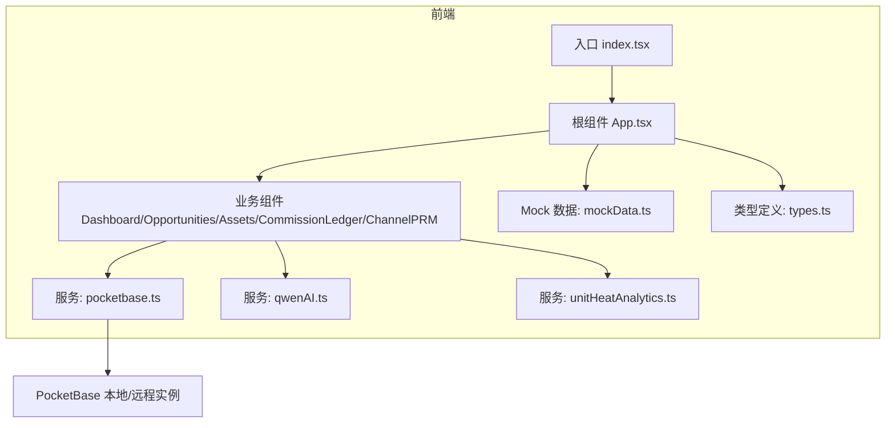
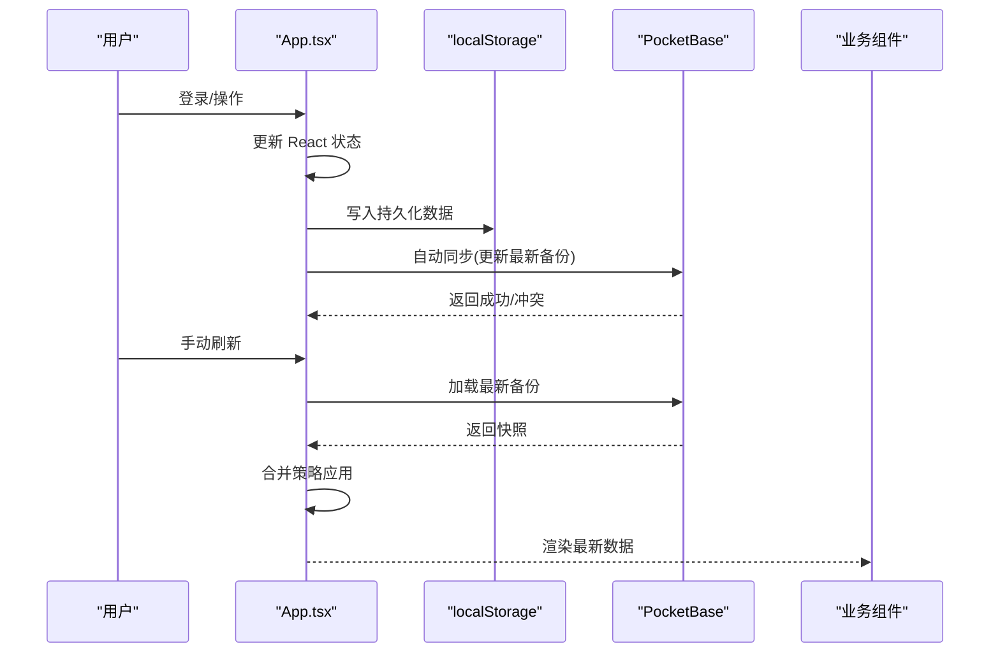
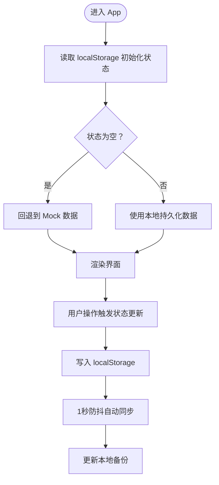
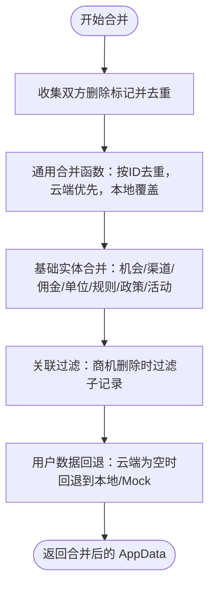
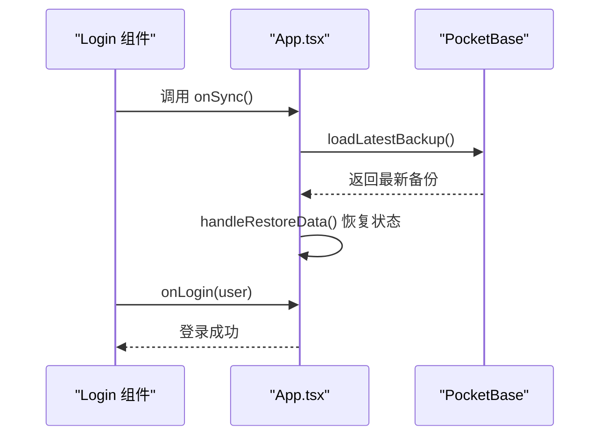
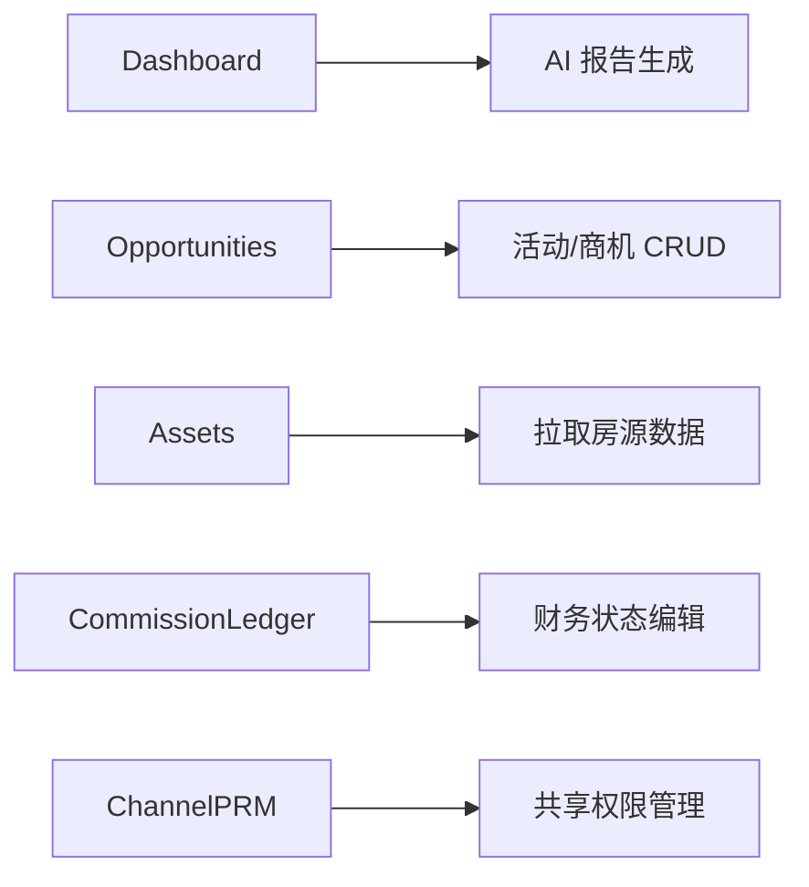
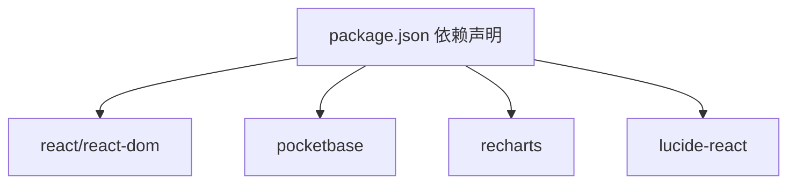

# 数据流管理

<cite>
**本文引用的文件**
- [App.tsx](file://App.tsx)
- [pocketbase.ts](file://services/pocketbase.ts)
- [mockData.ts](file://services/mockData.ts)
- [types.ts](file://types.ts)
- [index.tsx](file://index.tsx)
- [Dashboard.tsx](file://components/Dashboard.tsx)
- [Opportunities.tsx](file://components/Opportunities.tsx)
- [Assets.tsx](file://components/Assets.tsx)
- [CommissionLedger.tsx](file://components/CommissionLedger.tsx)
- [ChannelPRM.tsx](file://components/ChannelPRM.tsx)
- [unitHeatAnalytics.ts](file://services/unitHeatAnalytics.ts)
- [qwenAI.ts](file://services/qwenAI.ts)
- [package.json](file://package.json)
- [README.md](file://README.md)
</cite>

## 目录
1. [简介](#简介)
2. [项目结构](#项目结构)
3. [核心组件](#核心组件)
4. [架构总览](#架构总览)
5. [详细组件分析](#详细组件分析)
6. [依赖关系分析](#依赖关系分析)
7. [性能考量](#性能考量)
8. [故障排查指南](#故障排查指南)
9. [结论](#结论)
10. [附录](#附录)

## 简介
本文件面向“上海商机及渠道管理系统”，系统性阐述数据在应用内的流动路径：从用户操作到本地状态管理，再到云端同步的完整流程。重点覆盖：
- 本地状态管理机制：React 状态更新、数据缓存策略、状态持久化方案
- 云端数据同步机制：PocketBase 集成、数据合并策略、冲突解决算法
- Mock 数据系统的使用场景与实现原理
- 数据访问模式、异步数据处理、错误处理机制
- 数据流优化建议与性能考虑

## 项目结构
系统采用前端单页应用（React + Vite）+ 本地/云端数据存储的混合架构：
- 前端入口与根组件负责全局状态、登录与数据同步
- 组件层承载业务视图与交互
- 服务层封装数据访问与工具方法（PocketBase、AI、热力分析等）
- 类型定义集中于 types.ts，确保前后端一致的数据契约

**图表来源**
- [index.tsx](file://index.tsx#L1-L16)
- [App.tsx](file://App.tsx#L1-L560)
- [pocketbase.ts](file://services/pocketbase.ts#L1-L274)
- [qwenAI.ts](file://services/qwenAI.ts#L1-L249)
- [unitHeatAnalytics.ts](file://services/unitHeatAnalytics.ts#L1-L203)
- [mockData.ts](file://services/mockData.ts#L1-L81)
- [types.ts](file://types.ts#L1-L276)

**章节来源**
- [index.tsx](file://index.tsx#L1-L16)
- [README.md](file://README.md#L1-L21)

## 核心组件
- 根组件 App.tsx：统一管理用户会话、全局状态、本地持久化、云端同步与合并策略
- 业务组件：Dashboard、Opportunities、Assets、CommissionLedger、ChannelPRM
- 服务模块：pocketbase.ts（云端同步）、qwenAI.ts（AI分析）、unitHeatAnalytics.ts（热力分析）、mockData.ts（Mock 数据）
- 类型系统：types.ts（统一数据模型）

**章节来源**
- [App.tsx](file://App.tsx#L179-L558)
- [types.ts](file://types.ts#L243-L256)

## 架构总览
系统数据流分为两条主线：
- 本地主线：用户操作 → React 状态更新 → localStorage 持久化 → 自动同步至云端
- 云端主线：登录/手动刷新 → 从本地备份集合加载最新快照 → 合并策略应用 → 视图渲染

**图表来源**
- [App.tsx](file://App.tsx#L255-L283)
- [App.tsx](file://App.tsx#L304-L355)
- [pocketbase.ts](file://services/pocketbase.ts#L194-L227)
- [pocketbase.ts](file://services/pocketbase.ts#L232-L252)

## 详细组件分析

### 1) 本地状态管理与持久化
- 全局状态切片：机会、渠道、佣金、房源、规则、政策、活动、用户、设置、删除标记
- 初始化策略：优先从 localStorage 恢复，若缺失则回退到 Mock 数据
- 实时持久化：通过 ref 与 useEffect 将 dataRef.current 写入 localStorage，并设置 1 秒防抖自动同步
- 删除标记：deletedIds 用于防止云端聚合时复活已删除记录

**图表来源**
- [App.tsx](file://App.tsx#L180-L247)
- [App.tsx](file://App.tsx#L255-L283)
- [mockData.ts](file://services/mockData.ts#L4-L81)

**章节来源**
- [App.tsx](file://App.tsx#L180-L247)
- [App.tsx](file://App.tsx#L255-L283)
- [mockData.ts](file://services/mockData.ts#L4-L81)

### 2) 云端同步与合并策略
- 同步入口：handleFetchLatestBackup/loadLatestBackup
- 合并算法：mergeAppData
  - 合并删除标记（墓碑），保证级联删除一致性
  - 基于 ID 去重，云端快照优先，本地最新覆盖
  - 关联数据级联过滤：商机删除时，其子记录（佣金、活动）强制过滤
  - 用户数据特殊处理：云端为空时回退到本地或 Mock
- 冲突处理：updateLatestBackup 使用乐观锁，遇到并发冲突返回 conflict 标志

**图表来源**
- [App.tsx](file://App.tsx#L17-L75)
- [pocketbase.ts](file://services/pocketbase.ts#L194-L227)

**章节来源**
- [App.tsx](file://App.tsx#L17-L75)
- [pocketbase.ts](file://services/pocketbase.ts#L194-L227)

### 3) 登录与数据拉取流程
- 登录前置：登录前先同步云端最新数据，再进行用户校验
- 登录成功：设置当前用户，随后进入主界面
- 手动刷新：支持从云端加载最新备份并更新本地状态

**图表来源**
- [App.tsx](file://App.tsx#L77-L104)
- [App.tsx](file://App.tsx#L304-L328)

**章节来源**
- [App.tsx](file://App.tsx#L77-L104)
- [App.tsx](file://App.tsx#L304-L328)

### 4) 业务组件中的数据访问与异步处理
- Dashboard：使用 useMemo 过滤无效轨迹，避免僵尸数据影响统计；通过 AI 服务生成报告
- Opportunities：新增/编辑商机、成交确认、流失标记、活动录入；使用 useMemo 优化性能
- Assets：从招商系统 PocketBase 拉取房源，支持手动同步与错误提示
- CommissionLedger：筛选未结佣金，支持财务状态编辑
- ChannelPRM：渠道与代理管理，支持共享权限与统计

**图表来源**
- [Dashboard.tsx](file://components/Dashboard.tsx#L23-L40)
- [Dashboard.tsx](file://components/Dashboard.tsx#L121-L148)
- [Opportunities.tsx](file://components/Opportunities.tsx#L62-L66)
- [Assets.tsx](file://components/Assets.tsx#L112-L169)
- [CommissionLedger.tsx](file://components/CommissionLedger.tsx#L19-L30)
- [ChannelPRM.tsx](file://components/ChannelPRM.tsx#L105-L126)

**章节来源**
- [Dashboard.tsx](file://components/Dashboard.tsx#L23-L40)
- [Dashboard.tsx](file://components/Dashboard.tsx#L121-L148)
- [Opportunities.tsx](file://components/Opportunities.tsx#L62-L66)
- [Assets.tsx](file://components/Assets.tsx#L112-L169)
- [CommissionLedger.tsx](file://components/CommissionLedger.tsx#L19-L30)
- [ChannelPRM.tsx](file://components/ChannelPRM.tsx#L105-L126)

### 5) Mock 数据系统
- 用途：首次启动或本地无数据时提供初始数据，保障用户体验
- 内容：用户、房源、渠道、佣金规则、空机会/活动/佣金集合
- 使用：App.tsx 初始化时优先检查 localStorage，若为空则回退到 Mock

**章节来源**
- [mockData.ts](file://services/mockData.ts#L4-L81)
- [App.tsx](file://App.tsx#L192-L201)

### 6) AI 与热力分析
- AI 报告：通过 qwenAI.ts 调用千问 API，生成周/月/季/年报告与智能问答
- 热力分析：unitHeatAnalytics.ts 提取带看关注点关键词，计算房源热度与关注点排行

**章节来源**
- [qwenAI.ts](file://services/qwenAI.ts#L17-L64)
- [qwenAI.ts](file://services/qwenAI.ts#L144-L219)
- [unitHeatAnalytics.ts](file://services/unitHeatAnalytics.ts#L37-L152)

## 依赖关系分析
- 依赖生态：React、PocketBase、Recharts、Lucide-React
- 关键耦合点：
  - App.tsx 与 pocketbase.ts：同步与合并逻辑
  - 组件与服务：AI 与热力分析服务的调用
  - 类型系统：types.ts 为所有模块提供统一契约

**图表来源**
- [package.json](file://package.json#L11-L26)

**章节来源**
- [package.json](file://package.json#L11-L26)

## 性能考量
- 防抖同步：1 秒防抖减少频繁写入，提升用户体验与服务器压力
- 计算优化：useMemo 过滤无效轨迹、聚合统计，避免重复计算
- 级联过滤：删除标记确保子数据不会复活，降低渲染与计算负担
- 异步重试：云端请求带超时与重试，提高稳定性

**章节来源**
- [App.tsx](file://App.tsx#L255-L283)
- [Dashboard.tsx](file://components/Dashboard.tsx#L36-L40)
- [Opportunities.tsx](file://components/Opportunities.tsx#L62-L66)
- [pocketbase.ts](file://services/pocketbase.ts#L50-L87)

## 故障排查指南
- 登录失败：检查网络与云端可用性，确认 handleFetchLatestBackup 是否抛错
- 同步失败：查看 updateLatestBackup 的冲突标志；检查本地备份集合是否存在
- 云端连接异常：Assets 组件提供错误提示与重试入口
- AI 调用失败：检查 API Key、CORS 与代理配置

**章节来源**
- [App.tsx](file://App.tsx#L304-L355)
- [pocketbase.ts](file://services/pocketbase.ts#L194-L227)
- [Assets.tsx](file://components/Assets.tsx#L112-L169)
- [qwenAI.ts](file://services/qwenAI.ts#L17-L64)

## 结论
本系统通过“本地状态 + 云端备份”的双轨设计，实现了稳定的数据流闭环：用户操作即时反映在本地，后台自动同步至云端，登录/刷新时通过合并策略确保数据一致性与完整性。配合防抖、重试、级联过滤与 useMemo 优化，系统在功能与性能之间取得良好平衡。

## 附录
- 数据模型概览：AppData、Opportunity、Channel、Commission、Unit、Activity、User 等
- 服务接口：saveBackup、updateLatestBackup、loadLatestBackup、getAllBackups、fetchPropertyUnits
- Mock 数据：MOCK_USERS、MOCK_UNITS、MOCK_CHANNELS、MOCK_COMMISSION_RULES、MOCK_OPPORTUNITIES、MOCK_ACTIVITIES、MOCK_COMMISSIONS

**章节来源**
- [types.ts](file://types.ts#L243-L256)
- [pocketbase.ts](file://services/pocketbase.ts#L178-L273)
- [mockData.ts](file://services/mockData.ts#L4-L81)